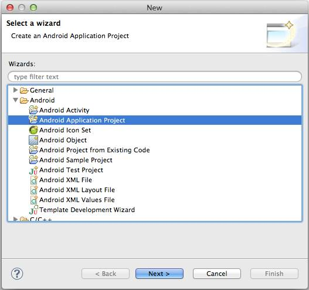
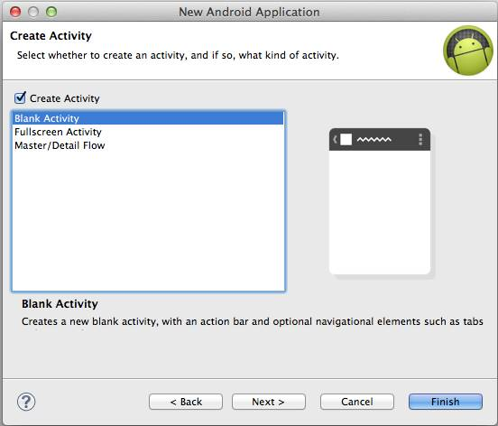
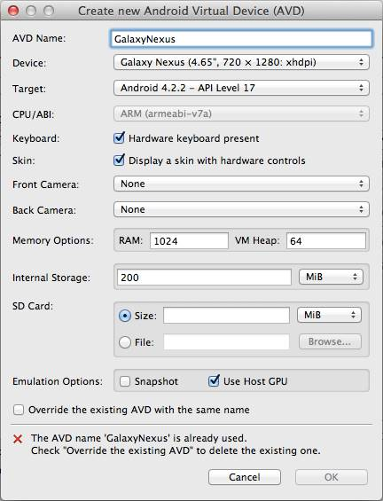
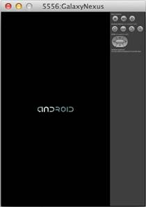
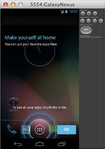

# 一、设置

在我们开始编写任何代码之前，我们的首要任务是建立一个开发环境。构建安卓应用程序所需的主要组件如下:

*   用于编写代码的文本编辑器。
*   安卓框架，用于链接你的应用程序代码。
*   安卓命令行工具，用于将您的代码编译成可运行的应用程序。
*   用于测试编译后的应用程序的仿真器或实际设备。

虽然几乎可以使用任何 IDE 或文本编辑器来创建应用程序，但使用安卓平台最简单的方法是官方的安卓软件开发工具包(SDK)，它在一次方便的下载中包含了所有这些组件。

## 安卓 SDK

[安卓软件开发工具包](http://developer.android.com/sdk/index.html)(适用于 OS X、视窗和 Linux)包括带有安卓开发工具(ADT)插件的 Eclipse IDE，以及仿真器、图形布局编辑器和一些其他有用的功能。这也是我们将在本书中使用的开发环境，所以现在就下载它，这样您就可以继续学习了。

### 安装

下载完成后，解压文件，打开`eclipse`文件夹。它应该包含一个`Eclipse`可执行文件，您可以启动它来启动 IDE。系统会提示您选择一个工作区文件夹，然后 Eclipse 应该准备好了。安装到此为止！

### 创建项目

让我们直接创建一个新的安卓项目。在**文件**菜单上，点击**新建**。在生成的向导中，选择**安卓应用项目** *。*

图 2:创建一个新的安卓项目

这将提示您关于新项目的一些信息:

*   **应用名称**:你的应用的名称。本栏位使用*你好安卓*。
*   **项目名称**:项目目录的名称。这个应该会自动填充 *HelloAndroid* ，你可以保持这个值不变。
*   **包名**:项目的唯一命名空间。因为它只是一个示例应用程序，所以您可以保留默认的*com . example . helloandoid*，但是您应该在实际应用程序中使用您组织的反向域名。

其余字段定义了重要的平台需求，您可以将它们全部保留为默认值。完成后，您的配置应该如下所示:

图 3:配置新的安卓项目

接下来的两个窗口会问你一些其他的细节和应用程序的图标。您可以将它们全部保留为默认值。最后，您将进入以下窗口，询问是否要创建活动:

图 4:创建初始活动

我们将在下一章详细讨论活动，但是现在您需要知道的是，一个活动代表您的应用程序的一个屏幕。我们最初想看一些东西，所以确保选中**创建活动**，然后选择**空白活动**指定一个空屏幕。在下一个窗口中，您可以使用**活动名称**和**布局名称**字段的默认**主活动**和**活动 _ 主**值(同样，我们将在下一章讨论布局)。点击**完成**创建全新的 Eclipse 项目。

### 设置仿真器

不幸的是，我们不能立即编译模板项目来查看它的功能。首先，我们需要设置一个设备来测试我们的新应用程序。安卓旨在让你在尺寸和功能迥异的设备上运行单个应用程序，这使得它成为一个非常高效的平台，可以将应用程序从智能手机移植到平板电脑，再移植到两者之间的任何设备上。软件开发工具包中包含的安卓虚拟设备管理器允许您模拟市场上几乎任何设备。

要查看仿真设备列表，导航至**窗口**并选择**安卓虚拟设备管理器**。此窗口使您可以轻松查看您的应用程序在各种安卓设备上的表现，测试不同的屏幕分辨率和尺寸，并尝试各种设备功能(例如，硬件键盘、相机、存储容量)。

要为我们的项目创建仿真设备，请单击**新建...**并使用 **GalaxyNexus** 作为 **AVD 名称**，然后从**设备**下拉菜单中选择 **Galaxy Nexus** ，并保留其他一切为默认值。出于开发目的，检查**使用主机图形处理器**来使用计算机的图形处理器也是一个好主意，因为模拟动画可能会非常缓慢和笨重。您的配置应该类似于以下内容:

图 5:创建新的仿真设备

点击**确定**后，你应该会在**安卓虚拟设备管理器**窗口找到你的设备。要启动模拟器，选择 **GalaxyNexus** 项，点击**启动**。将启动选项保留为默认值，然后单击**启动**。这将启动模拟器，如下所示:

图 6:安卓设备模拟器

模拟器必须启动安卓操作系统(就像一个真正的设备)，所以在模拟器真正准备好使用之前，你可能会盯着那个安卓标志看一会儿。当它最终准备就绪时，您将看到典型的安卓主屏幕，您可以点击启动应用程序并探索仿真设备:

图 7:模拟器准备好使用后

由于启动需要很长时间，所以在开始编写代码时，您会希望保持模拟器运行(Eclipse 可以在模拟器上重新启动应用程序，而无需重新启动它)。

### 编译应用程序

我们终于准备好编译示例项目了。回到 Eclipse，确保在包浏览器中选择了其中一个源文件，然后点击**运行**，选择**作为**运行，选择**安卓应用程序**。花点时间编译后，你应该会在设备模拟器中看到你的第一个安卓应用。如您所见，默认模板包含一个文本字段，上面写着“Hello world！”

图 8:编译后的模板项目

在下一章中，我们将学习如何更改这个文本字段的内容，添加其他 UI 组件，以及组织一个简单的 Android 应用程序。