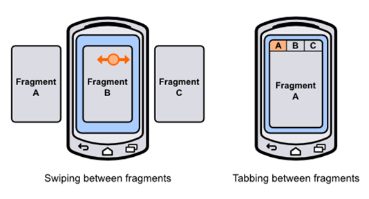
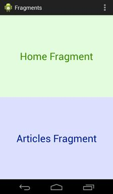
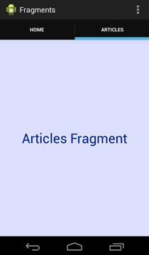

# 第六章碎片

一个**片段**是一个活动的封装部分。片段允许您将 UI 组件和行为配置到一个可重用的实体中，然后将该实体嵌入到几个不同的活动中。这为安卓应用打开了各种布局和导航的机会。你可以把它们看作是一个活动的“片段”，然后以不同的方式组合起来形成一个完整的活动。下图向您展示了开发安卓应用程序时可以使用的不同片段。


图 57:在智能手机和平板电脑布局中重用主片段和细节片段

片段最常见的用例之一是实现主-细节 UI 模式。例如，电子邮件应用程序包含邮件列表(主界面)和查看邮件正文的单独位置(详细界面)。通过将一个片段用于消息列表，另一个片段用于消息正文，您可以以不同的方式组合片段，从而轻松支持多个屏幕维度。在平板电脑上，您可能会在单个活动中显示这两个片段，以充分利用屏幕空间，而在智能手机上，您可能会希望在占用整个屏幕的专用活动中显示它们。因为主片段和细节片段是可重用的，所以您所要做的就是根据屏幕尺寸以不同的方式组合它们——它们所有的用户界面组件和行为都是可重用的。

还可以无缝地在活动中交换片段。这使您可以在单个活动中显示不同类型的界面和行为，这支持两种常见的导航模式:滑动视图和选项卡式导航。



图 58:片段之间的滑动和跳转

**滑动视图**旨在让用户在主-细节应用程序中的兄弟细节项目之间导航。例如，在电子邮件应用程序中，用户可以滑动屏幕来前后移动他们的消息，而不必被迫导航回主列表。也可以使用滑动手势在标签之间导航，我们将在本章后面讨论。

**标签导航**允许用户使用屏幕顶部的标签在片段之间切换。选项卡用于在应用程序的顶层部分之间切换，因此在任何给定时间显示的选项卡不应超过三四个。例如，电子邮件应用程序可能有选项卡，用于在收件箱、您的星号消息和您的电子邮件设置之间切换。

本章提供了片段的基本介绍。我们将学习如何创建它们，将它们嵌入到活动中，并使用它们来实现滑动视图和选项卡式导航。您应该理解如何将功能封装到片段中，并在各种活动中重用该功能。本书示例代码中包含的*片段*项目演示了我们将要讨论的所有内容。

## 创造碎片

片段由两部分组成:一个定义片段外观的 XML 布局文件，以及一个加载该布局并定义其行为的类。请注意，这些是活动所需的完全相同的组件。

*片段*示例项目包括两个片段:一个`HomeFragment`和一个`ArticlesFragment`。它们都显示一个带有名称和彩色背景的文本字段，这样一旦我们将它们加载到活动中，您就可以看到它们的尺寸。每个片段的 XML 看起来与活动的完全一样。例如，`home_view.xml`的定义如下:

```java
    <RelativeLayout xmlns:android="http://schemas.android.com/apk/res/android"
    android:layout_width="match_parent"
    android:layout_height="match_parent"
    android:background="#FFDDFFDD">

    <TextView
    android:layout_width="wrap_content"
    android:layout_height="wrap_content"
    android:layout_centerInParent="true"
    android:textSize="32sp"
    android:textColor="#FF009900"
    android:text="Home Fragment" />

    </RelativeLayout>

```

接下来，我们需要定义[片段](http://developer.android.com/reference/android/app/Fragment.html)的子类来加载这个布局。`Fragment`类只在 Android 3.0 (API 11)中添加。如果不需要支持 API 11 以下的东西，可以从`android.app.Fragment`导入`Fragment`类，但是可以通过`android.support.v4.app.Fragment`从支持库中导入 Fragment 支持回安卓 1.6。本章的示例代码使用后一种方法。

`HomeFragment.java`类定义了主片段的行为。`onCreateView()`是*必须在`Fragment`子类中覆盖的唯一方法，因为它返回代表片段的根`View`。在这种情况下，我们需要做的就是膨胀 XML 布局:*

```java
    import android.os.Bundle;
    import android.support.v4.app.Fragment;
    import android.view.LayoutInflater;
    import android.view.ViewGroup;
    import android.view.View;

    public class HomeFragment extends Fragment {
    @Override
    public View onCreateView(LayoutInflater inflater, ViewGroup container,
    Bundle savedInstanceState) {
    // Inflate the layout for this fragment
    return inflater.inflate(R.layout.home_view, container, false);
    }
    }

```

片段遵循与活动相同的生命周期模式。您可以在`Fragment`子类中定义自定义`onCreate()`、`onPause()`、`onResume()`以及我们在本书前面讨论的所有其他活动生命周期回调方法。当一个生命周期方法在一个宿主活动上被调用时，它会将这个生命周期方法传递给它包含的任何片段。这是片段如此模块化的部分原因——它们的行为就像活动一样，但完全是独立的。

## 在活动中嵌入片段

片段*必须*由活动主持。不可能单独显示片段，尽管它可能是活动中的唯一元素。如果您将`activity_main.xml`更改为以下内容，您将看到如何在活动中嵌入片段:

```java
    <LinearLayout xmlns:android="http://schemas.android.com/apk/res/android"
    xmlns:tools="http://schemas.android.com/tools"
    android:layout_width="match_parent"
    android:layout_height="match_parent"
    android:orientation="vertical"
    tools:context=".MainActivity" >

    <fragment android:name="com.example.fragments.HomeFragment"
    android:id="@+id/homeFragment"
    android:layout_width="match_parent"
    android:layout_height="0dp"
    android:layout_weight="1" />

    <fragment android:name="com.example.fragments.ArticlesFragment"
    android:id="@+id/articlesFragment"
    android:layout_width="match_parent"
    android:layout_height="0dp"
    android:layout_weight="1" />

    </LinearLayout>

```

这包括主活动中的`HomeFragment`和`ArticlesFragment`，结果如下截图所示。如你所见，碎片嵌入了`<fragment>`标签。最重要的属性是`android:name`，它应该是定义片段的类(包括应用程序包)的绝对路径。

请记住，片段的目标是成为一个可重用的用户界面。这意味着它应该能够拉伸或收缩，以匹配主机活动定义的任何大小。这就是片段的根元素使用`match_parent`作为其`android:layout_width`和`android:layout_height`的原因。上面的代码使每个片段占据了屏幕的一半:



图 59:在一个活动中显示两个片段

现在，片段可能看起来只是布局文件(它们是)的抽象，但是它们支持各种其他导航选项。由于它们是可重用的，我们可以在同一个活动中显示它们(就像我们在这里所做的那样)，在单独的活动中显示它们，用滑动视图对它们进行分页，或者让用户通过选项卡访问它们。

## 滑动视图

片段可以使用滑动视图进行分页，这是通过[视图分页](http://developer.android.com/reference/android/support/v4/view/ViewPager.html)类实现的。建议仅针对少量屏幕使用滑动视图，并且这些屏幕中的每一个都应该是独立的。如果您让用户浏览一组数据项，您还应该提供一个主列表作为导航的替代方式，并且您不应该使用滑动视图来为长文章分页。

要向主活动添加滑动视图，请用以下内容替换`activity_main.xml`中的`<fragment>`元素:

```java
    <android.support.v4.view.ViewPager
    android:id="@+id/fragmentPager"
    android:layout_width="match_parent"
    android:layout_height="match_parent" />

```

这增加了一个[视图页面](http://developer.android.com/reference/android/support/v4/view/ViewPager.html)，支持回到安卓 1.6。将使用适配器在`MainActivity.java`中填充`ViewPager`，就像填充`ListView`和`GridView`一样。首先，它需要定义[fragmentpage adapter](http://developer.android.com/reference/android/support/v4/app/FragmentPagerAdapter.html)的一个子类，在下面的代码中称为`SimplePagerAdapter`。其`getItem()`方法返回与页面关联的片段。在这种情况下，第一页返回`HomeFragment`，第二页返回`ArticlesFragment`。当然，如果你试图浏览一个集合，可以从一个数据集动态生成这些页面。要填充`ViewPager`，我们需要做的就是将其`adapter`属性设置为`SimplePagerAdapter`。

```java
    import android.os.Bundle;
    import android.support.v4.app.Fragment;
    import android.support.v4.app.FragmentActivity;
    import android.support.v4.app.FragmentManager;
    import android.support.v4.app.FragmentPagerAdapter;
    import android.support.v4.view.ViewPager;
    import android.view.Menu;

    public class MainActivity extends FragmentActivity {

    @Override
    protected void onCreate(Bundle savedInstanceState) {
    super.onCreate(savedInstanceState);
    setContentView(R.layout.activity_main);

    SimplePagerAdapter adapter = new SimplePagerAdapter(getSupportFragmentManager());
    ViewPager pager = (ViewPager) findViewById(R.id.fragmentPager);
    pager.setAdapter(adapter);
    }

    public static class SimplePagerAdapter extends FragmentPagerAdapter {
    public SimplePagerAdapter(FragmentManager fragmentManager) {
    super(fragmentManager);
    }

    @Override
    public int getCount() {
    return 2;
    }

    @Override
    public Fragment getItem(int position) {
    switch (position) {
    case 0:
    return new HomeFragment();
    case 1:
    return new ArticlesFragment();
    default:
    return null;
    }
    }
    }

    @Override
    public boolean onCreateOptionsMenu(Menu menu) {
    // Inflate the menu; this adds items to the action bar if it is present.
    getMenuInflater().inflate(R.menu.main, menu);
    return true;
    }

    }

```

每个片段现在应该占据整个屏幕，您应该能够在它们之间滑动。注意`MainActivity.java`扩展了[碎片活动](http://developer.android.com/reference/android/support/v4/app/FragmentActivity.html)而不是`Activity`。如果你想支持安卓 3.0 之前的任何东西，这是必要的。如果你不需要这样做，你只需要扩展`Activity`。

### 添加制表符

选项卡与[动作栏](http://developer.android.com/guide/topics/ui/actionbar.html)协同工作，这是我们到目前为止使用的所有示例顶部的栏。您可以通过使用`newTab()`方法从`ActionBar`请求一个标签来创建新的标签，设置它的标题，给它一个监听器来响应事件，然后使用`addTab()`方法将其添加到`ActionBar`中。这都在下面的片段中得到了演示，应该会用到`MainActivity.java`的`onCreate()`方法:

```java
    final ActionBar actionBar = getActionBar();
    actionBar.setNavigationMode(ActionBar.NAVIGATION_MODE_TABS);
    TabListener tabListener = new TabListener() {
    public void onTabSelected(Tab tab,
    android.app.FragmentTransaction ft) {
    pager.setCurrentItem(tab.getPosition());
    }
    public void onTabReselected(Tab arg0,
                                    android.app.FragmentTransaction arg1) {
    // TODO Auto-generated method stub
    }
    public void onTabUnselected(Tab arg0,
                                    android.app.FragmentTransaction arg1) {
    // TODO Auto-generated method stub
    }
    };
    actionBar.addTab(actionBar.newTab().setText("Home").setTabListener(tabListener)); actionBar.addTab(actionBar.newTab().setText("Articles").setTabListener(tabListener));

```

每当选择一个选项卡时，就会调用`onTabSelected()`回调方法。要显示相关的片段，我们需要做的就是告诉`ViewPager`改变它的`currentItem`属性。您现在应该能够选择标签来更改片段，但是当您在它们之间滑动时，标签不会更新。为了解决这个问题，我们需要监听页面变化，并在用户滑动时更新选项卡，如下所示:

```java
    pager.setOnPageChangeListener(new ViewPager.SimpleOnPageChangeListener() {
    public void onPageSelected(int position) {
    actionBar.setSelectedNavigationItem(position);
    }
    });

```

标签和滑动现在应该可以正常工作了。



图 60:使用标签在片段之间导航

## 总结

在本章中，我们学习了如何用`Fragment`子类封装用户界面的可重用部分，并使用滑动视图和选项卡显示它们。这是片段的常见用例，但它们也支持其他导航模式，如主-细节模式、灵活的用户界面和复杂的多面板布局。

下一章将远离安卓的用户界面框架，并解释如何保存和加载应用程序收集的数据。