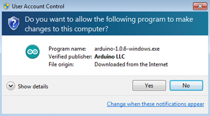
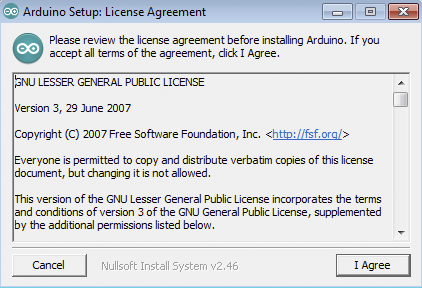
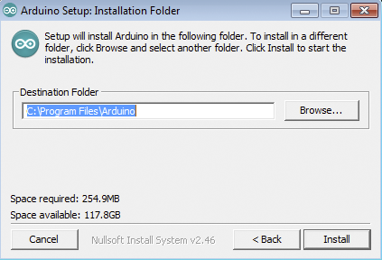
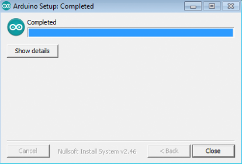
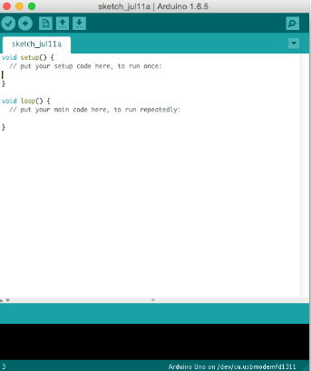
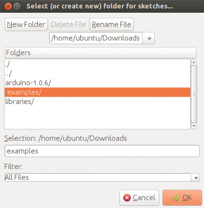
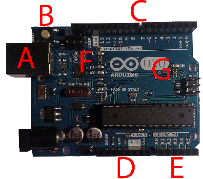
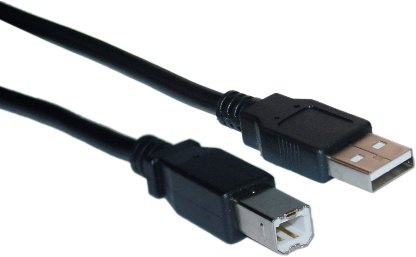
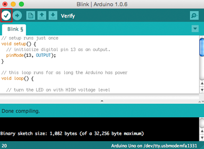

# 一、介绍和入门

如今，微控制器无处不在。多年来，与他们一起做一些事情需要大量的知识，这些知识必须在相当长的时间内积累。使用微控制器的成本也相对较高，因此大多数时间都是由各个行业训练有素的专业人员使用。

这在 2005 年阿尔杜伊诺董事会出现时发生了很大变化。Arduino 背后的整个想法是，它为世界各地的爱好者提供了一种相对便宜的方式来构建他们的电子项目。关于 Arduino 和微控制器可以说很多，但这是一本简洁的书，所以我们将保持简短和中肯。请记住，有很多种类的 Arduino 板。你可以在 Arduino 网站[这里](http://arduino.cc/en/Main/Products)查询。

描述每一个组件都超出了本书的范围。本书中的所有示例都将使用 Arduino Uno 板制作。关于 Arduino Uno 板的更多详细信息，请参见 Arduino 网站上的[本页](http://arduino.cc/en/Main/ArduinoBoardUno)。这款板最适合刚起步的人，因为它相对便宜，不需要任何焊接或特殊电源就能让你起步。基本上，你只需要一个 Arduino Uno 板、一根 USB 电缆和一台电脑。

|  | 注意:你必须获得一个 Arduino Uno 板来跟进。 |

当我们开始使用电子元件时，我会在每个部分的开头向您展示一份零件清单。这些示例将通过草图和表格来描述，以显示组件应该如何连接。在最后一节，我们将讨论网络。在这一部分，我们将使用两个 Arduino 板。再一次，一个阿尔杜伊诺是非常好的，你将能够跟随大部分的书。但是在这本书的最后，你会需要其中的两个。

当涉及到我们将要使用的电子元件时，本书中的例子没有任何特别的偏好。你可以自由地从任何最适合你的渠道获得它们，无论是经济上还是其他方面。除了 Arduino 本身，我们将要制造的电路不会使用任何外部电源。对于刚开始使用 Arduino 的人来说，使用强电流可能有点危险，可能会损坏设备，并可能伤害到你。因此，我们将继续使用来自您的计算机和 Arduino Uno 板的电源。

对于你们中的一些人来说，我们将使用的电子元件可能不熟悉，因为你从未听说过它们，但是不要担心，当我们第一次提到它们时，我们会对这些元件的基本工作原理进行简单的解释。如果有些概念你还不清楚，请先看看 [Arduino 网站](http://arduino.cc/en/Main/Products)再进一步阅读。

拥有 Arduino 板的目的是对它进行编程以做一些事情，因此希望您至少具有基本的编程知识。如果没有基本的编程知识，你可能会有点难以理解。了解 C 编程语言或任何其他类似的语言也是可取的。

我们还会尽量让程序保持简单，并在代码中做许多注释，以便您能够理解。开始使用 Arduino 编程相对容易。有一个免费的 Arduino 集成开发环境(IDE)，可以在当今所有最流行的操作系统上下载。

我们将使用集成开发环境，因为它将使我们的程序上传到 Arduino 板变得容易。基本上，只需要几次点击，然后我们将看到神奇的事情发生，因为我们的代码将实际上开始控制现实世界的对象，如灯和蜂鸣器。

在对电路板做任何事情之前，我们必须安装一些软件，使我们能够对它进行编程。在接下来的几节中，我们将介绍最流行的操作系统的安装步骤。我们将从使用微软视窗系统开始。

## 在 Windows 上安装 Arduino IDE

在撰写本书时，微软视窗 7 似乎仍然是市场上最受欢迎的视窗操作系统。下一个最受欢迎的 Windows 操作系统是 Windows XP。所以我们将集中讨论如何为 Windows 7 安装 Arduino IDE。在 Arduino 网站[这里](http://arduino.cc/en/Main/Software)有一个 Windows 的安装程序。下载并运行安装程序。要将其安装在 Windows 平台上，需要采取几个步骤:



图 1:通过单击“是”，允许应用程序对计算机进行更改



图 2:通过单击“我同意”同意许可协议


图 3:选择安装选项，然后单击下一步



图 4:选择安装文件夹，然后单击安装


图 5:通过单击安装，允许安装 Arduino USB 驱动程序



图 6:安装完成后，单击关闭

如果您按照前面的图中所示的步骤进行操作，那么现在您的 Windows 机器上应该已经有了一个功能正常的 Arduino IDE。通过单击开始菜单中的 Arduino 或双击桌面上的 Arduino 图标来启动 Arduino IDE。您应该会看到如下内容:



图 7:ide arduino

当您第一次插入 Arduino 时，您可能会等待一段时间，直到 Windows 识别并安装 Arduino Uno 板的驱动程序。这很常见；只需等待一会儿，你应该很快就能和你的 Arduino 一起运行了。这是我们目前能做的。在这个阶段，最重要的是我们已经安装了 Arduino IDE。稍后我们将介绍如何将 Arduino Uno 板与 Arduino IDE 真正挂钩，以及如何将代码上传到 Arduino。

## 在 Linux 上安装 Arduino IDE

在 Linux 平台上的安装不像在 Windows 平台上那样简单。安装和运行 Arduino IDE 之前需要一个先决条件。这个先决条件包括安装一个 Java 运行时环境。有很多可用的 Linux 版本。大约三分之一的桌面 Linux 机器运行在 Ubuntu 上。在这一节中，我们将介绍如何在 Linux Ubuntu 上安装 Arduino IDE。Linux Ubuntu 最基本的 Java 安装是启动终端，然后运行以下命令:

```c
    [Update the package index]
    # sudo apt-get update[Check if Java is already there, skip to Arduino installing if it’s installed]
    # java -version[Install Java if it’s not present on your system]
    # sudo apt-get install default-jre

    [install all the required packages and check if Java is installed]
    # java -version

```

在你检查了你的系统上是否有 Java 之后(或者你从头开始安装之后)，是时候从 Arduino 网站[这里](http://arduino.cc/en/Main/Software)下载 IDE 了。单击 Linux 版本的下载链接。

请注意检查您的系统是 32 位还是 64 位，并从网站下载适当的版本。如果 Linux 的版本与您的系统不匹配，您将无法将程序上传到 Arduino，并且在尝试这样做时会出现异常。

Linux 的 Arduino IDE 下载是压缩的。下载后打开它，并将其解压缩到您通常安装应用程序的文件夹中。确保您记得提取 Arduino IDE 的文件夹，然后导航到提取 Arduino IDE 的文件夹。双击`arduino`可执行文件运行。系统会问你以下问题:


图 8:单击运行

如果您正在从终端运行集成开发环境，您将不会看到上图所示的对话框。在您真正开始使用 Arduino IDE 之前，还有一个步骤。集成开发环境还会询问您在哪里存储新创建的草图。简而言之，草图是可以上传到 Arduino 主板的程序源代码文件:



图 9:指定 IDE 要保存草图文件的文件夹

## 在 Mac OS X 上安装 Arduino IDE

在 Mac OS X 上，Java 是运行 Arduino IDE 的先决条件。默认情况下，Java 在 Mac OS X 上不可用——至少在最新版本中不可用。有多种方法可以将 Java 带到您的 Mac 上。默认情况下，一些早期版本的苹果电脑已经安装了它。在 Mac 上开始使用 Java 最简单的方法是进入苹果支持页面[这里](http://support.apple.com/kb/DL1572)，下载并安装提供的文件。与 Linux 和 Windows 版本一样，Arduino IDE 可以在 Arduino 网站[这里](http://arduino.cc/en/Main/Software)上找到。

默认情况下，Mac OS X Arduino IDE 是压缩的。将归档文件提取到一个文件夹中，并记住提取它的位置。其余的安装都很容易；只需将提取的应用程序复制到应用程序文件夹中。然后，像运行安装在您的 Mac 上的其他应用程序一样运行 Arduino:


图 10:将提取的应用程序拖到应用程序文件夹

一旦 Arduino IDE 启动，无论您使用什么平台，它都是完全相同的。在下一节中，我们将介绍 Arduino 编程的基本 Hello World。

## 烧了一个 Hello World

这是您需要 Arduino Uno 板跟随的第一部分。除了主板，你还需要一根 a 到 Mini-B 的 USB 线。目前有两种方法可供你选择。一种方法是将 Arduino 连接到 USB，并查看当您将它插入计算机时发生了什么。

第二种方法是，在插入电路板之前，您可以了解电路板的各个部分。开始时，了解 Arduino Uno 板上的组件可能不那么重要，但随着您的进步，您将不得不熟悉这些部件。一开始可能看起来有点复杂，但有几件事你应该知道。让我们看看阿尔杜伊诺:



图 11:Arduino Uno 板

花点时间熟悉一下董事会。尝试找到位于上图中标记字母附近的元素。

以下是我们将使用的 Arduino Uno 板元素:

*   A–USB 电缆插座。通过这条电缆，我们为 Arduino 供电并上传程序。
*   重置按钮。我们使用此按钮重新启动上传的程序。
*   c–Arduino 数字引脚。这些工作将在后面的章节中解释。
*   d–Arduino 电源引脚。这些将用于为电子元件供电。
*   e–Arduino 模拟引脚。如何使用它们将在后面的章节中解释。
*   发射和接收发光二极管指示阿尔杜伊诺通过通用串行总线通信。l 可编程。
*   g–通电灯。Arduino 应该一有电就点燃这个 LED。

如果你一开始就不记得所有这些元素，那完全没问题。你和董事会合作得越多，你就越熟悉它。目前，唯一重要的元素是 USB 电缆插座。将 USB 电缆插入电脑，然后插入 Arduino 上的 USB 电缆插座。还是那句话，你应该用 USB A 线到 Mini-B 线。如果你不确定那是什么样的电缆，问问在你附近的电子商店工作的人。电缆看起来应该完全像(或类似于)以下内容:



图 12:从 A 型到迷你 B 型的通用串行总线电缆

将电缆插入 Arduino Uno，并将其与您的计算机连接。如果这是你第一次把 Arduino 插在电脑上，你应该会看到一个黄色的小发光二极管，上面标有字母“L”，每隔一段时间就会点亮和熄灭。它在图上用字母 F 标记的区域附近，解释了 Arduino Uno 板的基本部分。

这实际上是一个正在运行的 Arduino Hello World 程序。所有的官方 Arduino Uno 板都带有这个预上传的程序。Arduino Uno 板一插上电源，这个程序就会运行。这样，您可以快速确定您的 Arduino 板是否一切正常。但是，如果指示灯不亮不灭，请不要担心。也许你或其他人已经上传了一些东西。无论如何，我们将为您完成使该指示灯闪烁所需的步骤。

上一节解释了如何安装 Arduino IDE。如果您还没有运行集成开发环境，请现在运行它。每次将程序上传到 Arduino 板时，都需要执行两个步骤。首先，确保在 Arduino IDE 中正确设置了板类型。进入`Tools`菜单，然后进入`Board`，选择`Arduino Uno`正确设置类型。

第二步是选择串行端口(它在板菜单选项的下面)。根据您安装的操作系统类型，串行端口可能有不同的名称。在 Windows 上，会是`COM`后跟后缀。在 Linux 和 Mac 上，会更多的是`/dev/tty.xxxxxx`方向的东西或者类似的东西。如果您在已经运行 Arduino IDE 时在 Windows 上插入 Arduino Uno，您可能无法选择串行端口。如果出现这种情况，请重新启动 Arduino IDE。现在我们已经连接了 Arduino，让我们做一些编程。在 Arduino 集成开发环境中输入以下代码:

```c
    // setup runs just once
    void setup() {
      // initialize digital pin 13 as an output.
      pinMode(13, OUTPUT);
    }

    // this loop runs for as long the Arduino has power
    void loop() {

      // turn the LED on with HIGH voltage level
      digitalWrite(13, HIGH);

      // wait for a second
      delay(1000);

      // turn the LED off by making the voltage LOW
      digitalWrite(13, LOW);

      // wait for a second
      delay(1000);
    }

```

在继续之前，我们将稍微解释一下代码。板载发光二极管与数字引脚 13 相连。现在，你可能想知道什么是数字 pin。嗯，它的名字里有个“数字”。这意味着引脚可以有两种状态:`HIGH`和`LOW`。`HIGH`表示引脚上有电流，`LOW`表示引脚上没有电流。Arduino 可以向引脚输出电流，也可以从引脚读取电流。在本例中，我们向引脚 13 发送电流。如果引脚 13 上的电流很高，板载指示灯将亮起。如果引脚 13 处于低电平状态，板载发光二极管将关闭。

代码的第二部分是循环函数。只要 Arduino 上连接有电源，循环函数内部的代码就会运行，它会将电流发送到引脚 13。它将等待一秒钟，然后停止向引脚发送电流。然后它会再等一秒钟，从头开始。基本上，之前的代码会给出电流，然后在引脚 13 上以 1 秒的规则间隔将电流带走。Arduino 上暂停的单位是毫秒，所以一秒的暂停等于一千毫秒。现在您已经键入了代码，验证代码是个好主意。为此，只需单击验证:



图 13:运行中的验证功能

现在代码已经验证，是时候上传到 Arduino 了。我们通过点击上传来实现。点击后，代码被编译并上传:


图 14:上传功能正在运行

如果一切顺利，您应该会看到指示灯闪烁。现在，这可能看起来不多，但这实际上是一个功能齐全的程序，现在在你的 Arduino 板上，你的软件实际上是通过这个发光二极管与现实世界交互的。现在，除了学习如何控制它，这个发光二极管没有任何有用的用途。但是这个引脚的输出可以用来控制很多东西。我们将在这本书的其余部分讨论它。

## 串行监视器

Arduino 能够进行串行通信，可用于与计算机或其他懂串行通信的设备进行通信。串行通信已经存在了相当长的一段时间，并且经常在构建各种电子项目时使用。也许最好看一个简单的 Arduino 例子:

```c
    void setup() {
      // initializes serial communication with a speed of 9600 bit/s
      Serial.begin(9600);
    }

    // this loop runs for as long as the Arduino has power
    void loop() {
      // send a message to the serial port
      Serial.println("Hello I'm your Arduino Board!");

      // wait for 3 seconds and then start over
      delay(3000);
    }

```

如果您将此示例上传到主板，主板将每三秒向串行端口发送一条消息。您可以通过各种应用程序读取到达计算机串行端口的信息。您甚至可以编写自己的应用程序，与 Arduino 进行通信。消息中交换的数据通常是逗号分隔的字符串列表。这实际上是微控制器领域的一个悠久传统，因为数据对人类来说足够可读，足够容易被机器解析，并且在没有太多开销的情况下可用。这种方法的缺点是消息不容易扩展，每一个消息结构的变化都会导致发送方和接收方代码的更大变化。

Arduino IDE 有一个不错的工具，可以显示从串口传入的数据。它被称为串行监视器。要访问串行监视器，进入`Tools`菜单并选择`Serial Monitor`。如果您上传了前面的示例，您应该会看到工具中出现消息:


图 15: Arduino 串行监视器

除了与其他设备的通信之外，串行通信对于调试程序也很有用。有一个`Autoscroll`选项，该选项将始终显示最新消息。如果您注意到一些异常，您可以禁用此选项，然后查看打印的值。

这就完成了对 Arduino 和 Arduino IDE 的介绍。在下一章中，我们将使用电子元件——更具体地说，是发光二极管。使用发光二极管相对容易；它们是相对便宜的组件，并且它们执行各种任务。