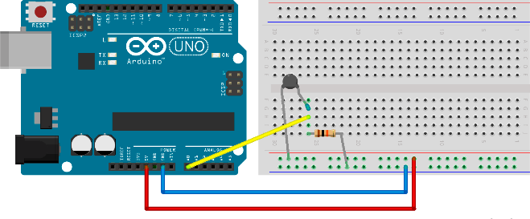
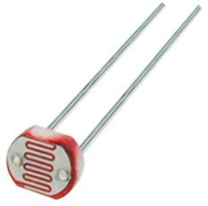
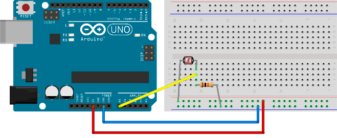
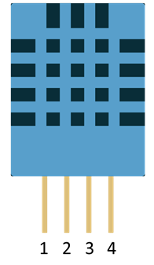
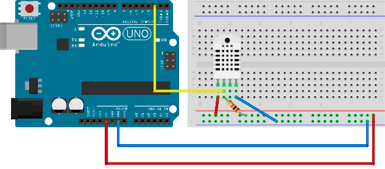
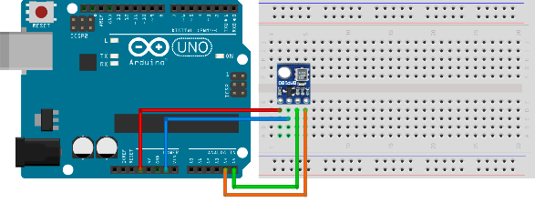
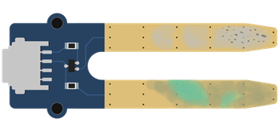

# 第五章测量环境条件

到目前为止，我们讨论的对 Arduino 的唯一输入是对按钮按压的反应。这是一个相对简单的读数，其中电流存在或不存在。基于当前的存在，我们可以采取各种行动。Arduino 不仅仅能够检测按钮是否被按下；它可以用来测量环境条件。环境测量很少是简单的二进制值。例如，房间的光线水平可能介于完全黑暗和非常明亮之间，因为阳光是从玻璃天花板照射进来的。例如，如果亮度下降到预定值以下，我们可以打开灯。在本节中，我们将解释如何测量空气温度、空气湿度和大气压力，以及如何检测光照水平。和前面的章节一样，我们将使用广泛可用且便宜的组件来制作示例。让我们从简单的气温读数开始。

## 测量空气温度

我们将从使用一种叫做热敏电阻的简单电子元件开始。该元件背后的基本原理是，它根据周围温度对通过的电流提供不同的电阻。热敏电阻有两种基本类型:

*   负温度系数-电阻随着温度的升高而降低
*   正温度系数-电阻随着温度的升高而增加

在我们的例子中，我们将使用负温度系数类型。从可用性、精度和价格来看，10K 欧姆 NTC 5 毫米热敏电阻是一个不错的选择:


图 35: 10K 欧姆 NTC 5 毫米热敏电阻

本节零件清单:

*   Arduino 一号
*   USB 电缆
*   1x 10K 欧姆 NTC 5 毫米热敏电阻
*   1x 10k 欧姆电阻
*   面包板
*   3x 线路板跳线

热敏电阻的行为由施泰因哈特-哈特方程决定。等式中最重要的参数是测得的电阻。测得的电阻不是`HIGH`和`LOW`的数字值。它在`HIGH`和`LOW`之间有一个完整的数值范围。Arduino 使用模拟引脚来测量这些值。对于二进制引脚，只有当某个引脚上存在电流或不存在电流时，我们才能获得信息。通过模拟，我们从一个范围中得到一个值。在 Arduino 中，该范围为 0 至 1023，这意味着有 10 位表示引脚上的输入电流。模拟引脚也可以用于输出，但它们的行为就像普通的数字引脚，无法从中读取模拟值。大多数情况下，你不会对这种行为有任何问题，但请记住，它可能会发生。让我们从示例的接线开始:



图 36:10K 欧姆热敏电阻的接线

前面的例子只使用了三根电线，而不是五根。如果需要，用导线替换元件的较长引脚。这是文献和原理图中常见的布线方式，但是对于较小的电路，不使用太多的导线是完全可以的。我们将把读数输出到串行端口。本例最复杂的部分是读取输入电流，然后将该读数转换为温度。网上找到的大多数例子都使用几个单行语句，然后神奇地向用户显示输出。通过理解代码，您将学到比仅仅复制和粘贴示例更多的东西。因此，我们将继续实施:

```c
    // we need advanced math functions
    #include <math.h>

    int reading;

    void setup() {
      // Initialize serial communication at 9600 bit/s
      Serial.begin(9600);
    }

    void loop() {
      reading = analogRead(A0);

      float kelvins = thermisterKelvin(reading);
      float celsius = kelvinToCelsius(kelvins);
      float fahrenheit = celsiusToFahrenheit(celsius);

      Serial.print("kelvins = ");
      Serial.println(kelvins);

      Serial.print("celsius = ");
      Serial.println(celsius);

      Serial.print("fahrenheit = ");
      Serial.println(fahrenheit);

      Serial.println("");

      delay(3000);
    }

    float thermisterKelvin(int rawADC) {
      // Steinhart-Hart equation
      // 1/T = A + B (LnR) + C(LnR)ˆ3

      // LnR is the natural log of measured resistance
      // A, B, and C are constants specific to resistor

      // we'll use:
      // T = 1 / (A + B(LnR) + C(LNR)ˆ3)

      // we are using long because Arduino int goes up to 32 767
      // if we multiply it by 1024, we won't get correct values
      long resistorType = 10000;

      // input pin gives values from 0 - 1024
      float r = (1024 * resistorType / rawADC) - resistorType;

      // let' calculate natural log of resistance
      float lnR = log(r);

      // constants specific to a 10K Thermistor
      float a = 0.001129148;
      float b = 0.000234125;
      float c = 0.0000000876741;

      // the resulting temperature is in kelvins
      float temperature = 1 / (a + b * lnR + c * pow(lnR, 3));

      return temperature;
    }

    float kelvinToCelsius(float tempKelvin) {
      return tempKelvin - 273.15;
    }

    float celsiusToFahrenheit(float tempCelsius) {
      return (tempCelsius * 9.0)/ 5.0 + 32.0;
    }

```

运行示例后，将手指缠绕在热敏电阻上并保持一会儿。你的体温应该比空气温度高，所以你会看到读数的变化。在前面的示例中，我们使用了串行监视器。

## 检测光照水平

光水平检测与温度测量非常相似。我们将在本节中使用的组件随着光照变得更具导电性:



图 37:光敏电阻

本节零件清单:

*   Arduino 一号
*   USB 电缆
*   1x GL5528 光敏电阻或任何 10K 欧姆光敏电阻
*   1x 10k 欧姆电阻
*   面包板
*   3x 线路板跳线

该示例的接线类似于测量空气温度的接线:



图 38:连接光敏电阻

让我们直接跳到代码，稍后再解释:

```c
    // we'll store reading value here
    int reading;

    void setup() {
      // initialize serial communication at 9600 bit/s
      Serial.begin(9600);
    }

    void loop() {
      reading = analogRead(A0); 

      // we'll measure the input values and map 0-1023 input
      // to 0 - 100 values
      int lightLevel = map(reading, 0, 1023, 0, 100);

      Serial.print("light = ");
      Serial.println(lightLevel);

      delay(3000);
    }

```

可能想到的第一个问题是这个数字意味着什么？它从 0 到 100，所以人们甚至可以认为它是一个百分比。但问题是，与什么相比？如果光敏电阻连接在电路中(如前图所示)，它可以测量高达 10 勒克斯的亮度。Lux 是亮度的量度。看下表 10 勒克斯不是很多；实际上，它相当暗，你无法衡量亮与亮的区别:

表 1:照度水平和光照水平的描述

| 勒克斯等级 | 描述 |
| 0.27 – 1.0 | 月光 |
| Three point four | 黄昏 |
| 10 勒克斯 | 非常黑暗和雨天 |
| 50 勒克斯 | 客厅中正常的光线水平 |
| 320 – 500 | 办公室灯 |
| One thousand | 没有阳光直射的全日光 |
| 100 000 | 阳光 |

在我们的示例中，我们不是以勒克斯为单位来测量光照水平，而是简单地将读数映射为百分比。百分比很容易理解，也很容易检查我们想要采取行动的光照水平。但是，使用之前的设置，我们将无法测量非常明亮的光线。有一个巧妙的方法可以避开这种情况。如果你在电路中放入一个 1k 欧姆的电阻，而不是 10 欧姆的电阻，你将能够在更高的水平上获得读数的差异，并且你将能够区分亮的和亮的。

如果您想测量精确的勒克斯水平，您必须仔细查看电阻规格，并将规格中的电压映射到您的读数。这项工作有点繁琐，只在非常特殊的情况下使用，比如摄影。对于常规用例，例如“灯亮着吗？”或者类似的方法，建议您简单地使用百分比，并使电路中的电阻适应您想要测量的光照水平。基本上，如果你想区分黑暗和黑暗，可以使用 10K 电阻，如果你想区分光明和光明，可以使用 1K 电阻。大多数有工程背景的读者可能更喜欢勒克斯单位，但是将电压映射到简单的百分比对于日常使用来说已经足够了。

## 使用温度和湿度传感器

在前面的部分中，我们使用了一种叫做热敏电阻的元件来测量温度。它背后的电子设备相对简单:有一个元素，我们只是解释我们得到的当前水平。对于某些用途来说，拥有一个简单的元素并不能解决问题，使用基本元素会显著增加我们必须放入电子产品中的元素数量。因此，制造商开始制造单独的组件，然后可以与 Arduino 通信，然后与其他设备通信，等等。我们将从一些相对简单的事情开始，比如测量温度，以便在 Arduino 中使用单独的组件。

有许多温度传感器可以与 Arduino 通信并与之交换信息。最常用且相对便宜的传感器之一是 DHT11 传感器。除了温度，它还可以测量相对湿度。对它进行编程可能有点棘手，我们必须深入到规范中才能使用它。所以我们打算用一个图书馆为我们做脏活。这是 DHT11 模块:



图 39: DHT11 温度和湿度传感器

该图显示了引脚上的标记，以便您在开始设置示例时更容易将传感器连接到电路板。您不必担心将传感器转错方向，因为图中所示的正面有孔，而背面是光滑的。就像每一节一样，我们将从零件开始。

零件清单:

*   Arduino 一号
*   USB 电缆
*   DHT11 温度和湿度传感器
*   10K 欧姆电阻器
*   面包板
*   5x 面包板跳线

这是线路:



图 40:分布式哈希表 22(如图所示)和分布式哈希表 11 具有相同的布线

DHT 有多种变体，如 DHT22。我们用 DHT22 描述了接线，只是为了让您知道还有其他名称几乎相同但功能完全不同的传感器(尽管接线相同)。当我们讨论编程时，我们会看到这一点。

为了把一切联系起来，我们需要下载一个库。在这里下载位于 Github [的文件，并记住保存的位置。创建一个新的草图，然后点击`Sketch` > `Include Library` > `Add ZIP Library`。选择您下载的 zip 存档，集成开发环境将自动安装库。下面是该示例附带的代码。请确保将 DHTTYPE 常量更改为您正在使用的类型:](https://github.com/adafruit/DHT-sensor-library/archive/master.zip)

```c
    #include "DHT.h"

    // to use the library we have to define some constants

    // what pin are we going to use
    #define DHTPIN 2

    // what type of sensor are we going to use
    // possible: DHT11, DHT22, DHT21
    // be careful to set it correctly
    #define DHTTYPE DHT11

    // instantiate DHT sensor
    DHT dht(DHTPIN, DHTTYPE);

    void setup() {
      // we'll print measurements to serial
      Serial.begin(9600);

      // start the sensor
      dht.begin();
    }

    void loop() {
      // it takes around 2 seconds for the sensor to update data
      delay(2000);

      // read humidity
      float h = dht.readHumidity();

      // Read temperature as Celsius
      float t = dht.readTemperature();

      // Read temperature as Fahrenheit
      float f = dht.readTemperature(true);

      // check the value
      if (isnan(h) || isnan(t) || isnan(f)) {
        Serial.println("Failed to read, reading again!");
      }
      else {
        // compute heat index
        // heat index works only with Fahrenheit
        float hi = dht.computeHeatIndex(f, h);

        Serial.print("Humidity %: ");
        Serial.println(h);

        Serial.print("Temperature *C: ");
        Serial.println(t);

        Serial.print("Heat index *C: ");
        Serial.println(fahrenheitToCelsius(hi));

        Serial.print("Temperature *F: ");
        Serial.println(f);

        Serial.print("Heat index *F: ");
        Serial.println(hi);

        Serial.println();
      }
    }

    float fahrenheitToCelsius(float tempF) {
      return (tempF - 32) / 1.8;
    }

```

许多 Arduino 传感器的工作原理与此类似。你下载一个库，连接传感器，然后开始读取数据。有许多适用于各种 Arduino 传感器的库。本节描述了使用更复杂传感器时的标准程序。

## 测量大气压力

这不是一本关于物理的书，所以我们就不多谈什么是气压了。空气也有重量，暴露在大气中的表面会受到空气的压力。使用气压有两种主要方式。一种方法是跟踪天气变化。第二种方法是用已知的压力测量两点之间的高度变化。

观察天气时，有很多气象站要么位于非常高的山上，在海平面上，要么位于海平面以下(就像在死亡谷一样)。无论我们在哪里测量，如果我们知道海平面以上的高度，我们就可以计算出海平面上的压力。所以，在天气预报中，所有的气压值通常都是以海平面来表示的。标准压力为 1013.25 毫巴或 29.92 英寸汞柱。然后，我们可以快速确定某个点是低于正常压力值还是高于正常压力值。根据我们目前所处的位置，我们甚至可以利用气压的变化来预测天气。

当空气进入大气层时会变得更稀薄。如今，传感器可以测量相对较小的垂直运动；通常精度在三英尺或一米以内。我们将在本节中使用的主要部件是 BMP180 大气压力传感器:


图 41: BMP180 大气压力传感器

本节零件清单:

*   Arduino 一号
*   USB 电缆
*   BMP180 大气压力传感器
*   面包板
*   4x 线路板跳线

外部引脚连接到 Arduino 上的 3.3V 电源。引脚 2 接地。引脚 3 转到 A5，引脚 4 转到 A4。请注意，芯片有多种，其中一些有五个或更多引脚。在五引脚版本中，第一个引脚被忽略，其余引脚与上图相同。如果有五个以上的引脚，请查阅制造商的文档。让我们看看接线:



图 42: BMP180 传感器接线

读取值有点复杂。与模块的通信将是一个劳动密集型的过程。所以为了把一切联系起来，我们需要下载一个库。在这里下载位于 Github [上的文件，并记住你把它保存在哪里。新建一个草图，点击`Sketch` > `Include Library` > `Add ZIP Library`。选择您下载的 zip 存档，集成开发环境将自动安装库。下面是该示例附带的代码:](https://github.com/sparkfun/BMP180_Breakout_Arduino_Library/archive/master.zip)

```c
    #include <SFE_BMP180.h>
    // SFE_BMP180 library is not enough
    // we have to include the wire to communicate with the sensor
    #include <Wire.h>

    // SFE_BMP180 object sensor:
    SFE_BMP180 sensor;

    // altitude of my home in meters
    // change this to your own altitude!!!
    // you will get strange reading otherwise
    #define ALTITUDE 178.0

    // we'll keep track of previous measured pressure
    // so that we can calculate relative distance
    double previous_p = 0;

    void setup() {
      Serial.begin(9600);
      Serial.println("INIT ...");

      // begin initializes the sensor and calculates the calibration values
      if (sensor.begin()) {
        Serial.println("BMP180 init OK");
      }
      else {
        Serial.println("BMP180 init FAILED!!!");
        // stop the execution
        delay(1000);
        exit(0);
      }
    }

    void loop() {
      // we'll make a reading every 5 seconds
      delay(5000);

      byte waitMillis, status;
      double temp, p, p0, a;

      // weather reports use sea level compensated pressure
      // find out your altitude to get the readings right

      Serial.println();
      Serial.print("ALTITUDE: ");
      Serial.print(ALTITUDE);
      Serial.print(" m  ");
      Serial.print(ALTITUDE * 3.28084);
      Serial.println(" feet");

      // to read the pressure, you must read the temperature first

      // ask the sensor when can we get a temperature reading
      // if o.k. we get waitMillis, otherwise 0

      waitMillis = sensor.startTemperature();
      if (waitMillis == 0) {
        Serial.println("Temperature reading not ready");
        return;
      }

      // wait for as long as the sensor says
      delay(waitMillis);

      // retrieve the temperature measurement into temp
      // function updates waitMillis again
      waitMillis = sensor.getTemperature(temp);

      if (waitMillis == 0) {
        Serial.println("Error reading temperature");
        return;
      }

      // current temperature values in different units
      Serial.print("TEMPERATURE: ");
      Serial.print(temp);
      Serial.print(" *C  ");
      Serial.print((9.0 / 5.0) * temp + 32.0);
      Serial.println(" *F");

      // start a pressure measurement:
      // precision from 0 to 3, precise readings take more time
      // we get millis how long to wait for the measurement

      waitMillis = sensor.startPressure(3);

      if (waitMillis == 0) {
        Serial.println("Error starting pressure reading");
        return;
      }

      delay(waitMillis);
      // Retrieve the completed pressure measurement:
      // Function returns 1 if successful, 0 if failure.

      status = sensor.getPressure(p,temp);
      if (waitMillis == 0) {
        Serial.println("Error getting pressure reading");
        return;
      }

      // pressure data
      Serial.print("ABSOLUTE PRESSURE: ");
      Serial.print(p);
      Serial.print(" mb  ");
      Serial.print(p * 0.0295333727);
      Serial.println(" inHg");

      // sensor returns absolute pressure, which varies with altitude.
      // in weather reports a relative sea-level pressure is used
      p0 = sensor.sealevel(p, ALTITUDE);

      Serial.print("SEA LEVEL: ");
      Serial.print(p0);
      Serial.print(" mb  ");
      Serial.print(p0 * 0.0295333727);
      Serial.println(" inHg");

      // altitude difference from previous reading
      a = sensor.altitude(p, previous_p);
      Serial.print("HEIGHT DIFFERENCE FROM PREVIOUS: ");
      Serial.print(a);
      Serial.print(" m  ");
      Serial.print(a * 3.28084);
      Serial.println(" feet");

      previous_p = p;
    }

```

这个例子可能会给你与当地气象站明显不同的读数。在你运行这个例子之前，确保你已经找到了你家的海平面高度。否则，你可能会被结果弄糊涂。使用所提供示例的第 12 行中的定义命令`#define ALTITUDE 178.0`设置高度。如果你打算建立一个天气监测项目，这将是一个有用的例子。到现在为止，我们已经谈了很多关于气氛的问题。用阿尔杜伊诺我们还能感觉到什么？我们将在下一节中详细讨论它。

## 检测土壤湿度

如果你曾经有过植物，你知道人们偶尔会忘记给它们浇水。信不信由你，阿尔杜伊诺也谈到了这一点。你只需要一个土壤湿度传感器就能避免这种问题。土壤电导率特性随着土壤中所含水量的变化而变化，传感器测量这些特性。传感器有两个部件:探头和传感器本身。


图 43:带零件的土壤湿度传感器

探头和传感器之间的接线是用两根导线完成的。你如何联系他们并不重要。我们稍后将讨论 Arduino 和传感器之间的接线。在这个例子中，我们将不使用试验板。

本节零件清单:

*   Arduino 一号
*   USB 电缆
*   YL-96 土壤湿度传感器
*   4x 线
*   一杯水来测试功能

表 2: YL-96 引脚

| 别针 | 描述 |
| VCC | 用于连接 5V +的引脚 |
| GND | 接地引脚 |
| 防御命令(Defense Order) | 数字输出 |
| 澳大利亚二等勋衔军官 | 模拟输出 |

将 VCC 连接到阿尔杜伊诺 5V，将 GND 连接到阿尔杜伊诺 GND，并将 DO 连接到数字 in 8。使用以下代码列表:

```c
    // we'll use digital pin 8
    int inPin = 8;

    // we'll store reading here
    int val;

    void setup() {
      // initialize serial communication
      Serial.begin(9600);
      // set the pin mode for input
      pinMode(inPin, INPUT);
    }

    void loop() {
      // read the value
      val = digitalRead(inPin);

      // if the value is low
      if (val == LOW) {
        // notify about the detected moisture
        Serial.println("Moisture detected!");
        delay(1000);
      }
    }

```

打开串行监视器，观察当您将探头放入一杯水中时会发生什么。记住，这只是一个数字阅读。探头可以使用模拟引脚发送湿度水平。重新连接引脚，将 VCC 连接到 Arduino 5V，将 GND 连接到 Arduino GND，并将 AO 连接到 Arduino 上的模拟输入 5。使用以下代码示例:

```c
    // we'll store reading from the input here
    int input;

    // we'll map the input to the percentages here
    int val;

    void setup() {
      // initialize the serial communication
      Serial.begin(9600);
    }

    void loop() {
      // read the value from A5
      input = analogRead(A5);
      // map it to percentage
      val = map(input, 1023, 0, 0, 100);

      // print and wait for a second
      Serial.println(val);
      delay(1000);
    }

```

打开串行监视器，检查如果将探头放入一杯水中会发生什么。现在，你可能会问，“为什么读数只有 40%左右，而如果浸入水中，应该是 100%左右？嗯，潮湿的土壤实际上比一杯水更能导电。如果有机会，尝试将传感器放入潮湿的土壤中(但注意不要弄乱土壤颗粒)。

此外，要非常小心这杯水，因为如果你洒了它，它可能会损坏 Arduino 或附近的电子设备。现在，你可能认为这就是它的全部，但是这个传感器有一个非常重要的问题。过一段时间后，探头开始腐蚀，几天(或者几周)内，它将完全无法使用。



图 44:腐蚀的土壤湿度传感器

我们将绕过传感器腐蚀，只在传感器需要测量湿度时给它通电。水分采样通常不是每秒进行一次；每分钟或每小时一次完全没问题。让我们重新布线传感器，使其仅在我们进行测量时支持开启。将 VCC 连接到阿尔杜伊诺数字引脚 8，将 GND 连接到阿尔杜伊诺 GND，并将 AO 连接到阿尔杜伊诺的模拟引脚 5。使用以下代码每分钟打开传感器一次，然后读取读数:

```c
    // we'll store reading from the input here
    int input;

    int vccPin = 8;

    // we'll map the input to the percentages here
    int val;

    void setup() {
      // initialize the serial communication
      Serial.begin(9600);

      // set up the pin mode
      pinMode(vccPin, OUTPUT);
    }

    void loop() {
      // turn on the sensor
      digitalWrite(vccPin, HIGH);

      // wait a little bit for the sensor to init
      delay(100);

      // read the value from the A5
      input = analogRead(A5);

      // turn off the sensor
      digitalWrite(vccPin, LOW);

      // map it to percentage
      val = map(input, 1023, 0, 0, 100);

      // print and wait for a minute
      Serial.println(val);

      delay(60000);
    }

```

使用这些代码可能会为您节省大量探针，因为如果暴露在恒定电流下，它们会很快熄灭。许多开始在园艺中使用 Arduino 的人经常会对这种效果感到惊讶，但在园艺中使用 Arduino 时，这实际上是一个已知的问题。此外，还有更昂贵的传感器可以使用更长的时间，但是使用便宜的传感器和一点点智能代码的解决方案就是 Arduino 的全部。

## 测量环境条件结论

对很多人来说，这是非常重要的一章。测量环境条件是他们甚至从阿尔杜伊诺开始的首要原因之一。人们只是想知道他们不在的时候房间里的温度，或者只是对他们不在的环境中发生的事情感兴趣。

这些担忧大多与能源成本、环境问题和节约有关。暖气不必一直开着。通过将 Arduino 与一些传感器结合使用，我们可以查看历史数据或将它们绘制成图表，并快速确定哪里可以实现潜在的节约。

还有一些人有健康问题，他们希望特别针对环境中的湿度水平；阿尔杜伊诺在那里也有很大的帮助。与现成的解决方案相比，Arduino 的一个主要优势是，您可以随时调整它以仅满足您的需求，而不必在您只需要其部分功能时购买昂贵的设备。

此外，越来越多的人想吃得更健康，他们开始种植自己的食物(嗯，也许不是他们所有的食物，但至少是一些)。有一个重要的运动叫做城市园艺(UG)，Arduino 在许多与 UG 相关的应用中绝对是一项热门技术。但是阿尔杜伊诺的可能性不仅仅止于环境条件。其实 Arduino 可以用来做更多的事情。我们将在下一章讨论它。