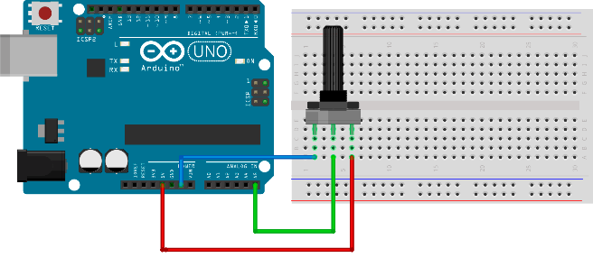
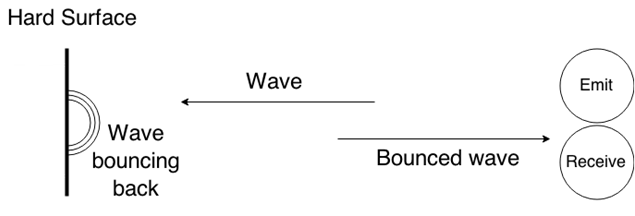
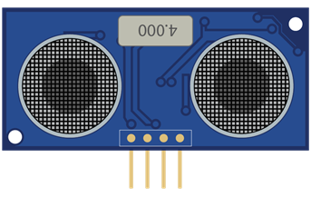
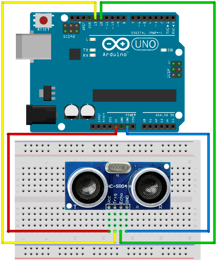
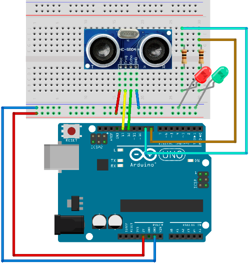
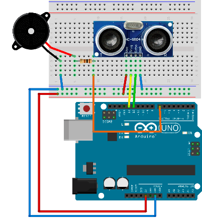
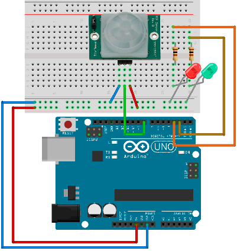

# 六、探测对象

到目前为止，我们已经学会了如何监控环境属性。但是，我们经常想要对物理变化的环境或其他在我们周围移动或执行动作的对象做出反应。那种传感电子设备已经在日常生活中使用了。

例如，如果你曾经向后驾驶一辆汽车，并且有停车传感器，你可能已经在使用对象检测技术。另一种流行的传感技术是各种报警系统中的入侵检测。我们也将描述这些系统是如何工作的。

检测对象通常不是一件二进制的事情，我们需要一定级别的配置。因此，在这一节中，我们将从一些简单的东西开始，这些东西与用于检测对象的传感器没有直接和明显的联系。但这实际上非常重要，因为如果值超过或低于预定值，我们并不总是希望检测组件做出反应。但是我们希望能够定义灵敏度水平，而不必重新编程整个 Arduino 项目。使我们能够进行可变设置的组件称为电位计。基本上，当我们转动旋钮时，它会改变电阻。在后面的例子中，我们将使用电位计来改变灵敏度。让我们从电位计开始。

## 使用电位计

电位计通常以旋钮的形式出现。这个旋钮越转动阻力越大。它通常用于控制收音机的音量、通风系统的风扇速度或室内所需的温度水平。你可能一生中至少用过一次，但让我们看看它是如何工作的，以及我们如何使用它。

本节零件清单:

*   Arduino 一号
*   USB 电缆
*   10K 欧姆电位计
*   面包板
*   3x 线路板跳线

该示例的布线相对简单。请记住，如何将正负引脚连接到电位计并不重要。如果对正极和负极引脚进行不同的接线，唯一会改变的是，当您转动旋钮时，电阻会从较小值变为较大值，反之亦然。这完全取决于你如何连接它。让我们看看接线:



图 45:电位计接线

使用这个编程示例来看看发生了什么:

```c
    // we'll store reading from the input here
    int input;

    // we'll map the input to the percentages here
    int val;

    // for keeping the previous reading
    int previous_val;

    void setup() {
      // initialize the serial communication
      Serial.begin(9600);
    }

    void loop() {
      // read the value from A5
      input = analogRead(A5);

      // map it to percentage
      val = map(input, 1023, 0, 0, 100);

      // if percentage changed
      if (val != previous_val) {
        // print and store the value for comparison
        Serial.println(val);
        previous_val = val;
      }

      // delay to prevent output overcrowding
      delay(100);
    }

```

如果你转动旋钮，你会看到百分比是如何从 0 变成 100 的。如果你不喜欢价值上升或下降的方向，你有两个选择。一种选择是交换前面提到的最右边和最左边的连接器。试一试，看看旋钮是如何工作的，然后重新连接，这样我们就可以看到如何使用软件:

```c
      val = map(input, 1023, 0, 100, 0);

```

如何根据旋钮调整读数，这完全取决于您。模拟元件的好处是，无论您在哪里以及如何使用它们，您都可以立即获得反馈，因此，如果您走错了方向，您可以快速进行补偿。让我们从另一个构造块开始，它通常用于检测环境中的对象，尤其是测量距离。根据 Arduino 的构建，它可能会断开或停止发送最小和最大电位计旋转点的数据。如果发生这种情况，请断开 Arduino 并重新连接。

## 使用超声波距离传感器

超声波距离传感器是一种非常便宜和实用的方法来检查东西有多远。声音以已知的速度穿过大气层。根据天气情况，速度可能会有所不同，但根据维基百科，声音在 4.689 秒内传播一英里，或在 2.914 秒内传播一公里。传感器背后的基本工作原理是，我们只需简单地测量发射超声波到等待它回来之间的时间。然后，我们把时间除以二，因为波传播的距离是两倍。然后我们简单地用这个持续时间除以声速。基本工作原理如下图所示:



图 46:超声波距离传感器基本工作原理

上图显示了两个组件。一个用于发射，另一个用于接收声波。超声波距离传感器看起来类似于显示的两个圆圈。如下图所示:



图 47:超声波距离传感器

我们案例中使用的模块非常容易获得且价格低廉；其名称为 HC-SR04，在本节的零件清单中。

本节零件清单:

*   Arduino 一号
*   USB 电缆
*   HC-SR04 超声波距离传感器
*   面包板
*   4x 线路板跳线

布线的基本概述如下所示:

表 3: HC-SR04 引脚和与 Arduino 的连接

| 别针 | 关系 |
| Vcc | 用于连接 5V +的引脚 |
| 漂亮的 | 在我们的示例中，连接到引脚 13 |
| 回声 | 在我们的示例中，连接到引脚 12 |
| 接地 | 连接到阿尔杜伊诺 GND 的 Pin 码 |

下图显示了完整的布线:



图 48:超声波距离传感器接线

我们将使用传感器测量最近的硬表面有多远，然后每秒钟显示到串行端口的距离。在后面的例子中，我们将在检测到一定距离的对象时执行动作，但是现在，我们将只看正在发生什么。请注意，声音不会很好地从衣服上反射回来，因此传感器可能不会像您预期的那样读取所有内容。下面是示例的代码:

```c
    // we'll use trigPin for emitting
    int trigPin = 13;

    // we'll listen for the pulse on the echoPin
    int echoPin = 12;

    // variables for calculations
    long duration, distance_inch, distance_cm;

    void setup() {
      // initialize serial communication
      Serial.begin (9600);

      // initialize pins
      pinMode(trigPin, OUTPUT);
      pinMode(echoPin, INPUT);
    }

    void loop() {
      // emit a pulse
      digitalWrite(trigPin, HIGH);
      delayMicroseconds(10);
      digitalWrite(trigPin, LOW);

      // get the time that it takes for the pulse to return
      // pulseIn waits for the pulse and returns number of microseconds
      // divided by two because sound travels there and back again
      duration = pulseIn(echoPin, HIGH) / 2;

      // convert to inches and centimeters by using this formula
      distance_inch = duration / 74;
      distance_cm = duration / 29;

      // print the results
      Serial.print(distance_inch);
      Serial.print(" inch; ");
      Serial.print(distance_cm);
      Serial.println(" cm");
      Serial.println("");

      delay(1000);
    }

```

如果你打开`Serial Monitor`工具，你应该会看到当你在距离传感器前面放东西时，距离是如何变化的。你甚至可以拿把尺子检查传感器的精度。请注意，根据您居住的海拔高度和实验期间的天气条件，可能会有细微的差异。此外，传感器无法检测对象何时离它太近。也不可能测量低于 2 厘米(0.8 英寸)和超过 400 厘米(157.5 英寸)的距离。在下一节中，我们将在对象离传感器太近时执行操作。

## 对接近的对象做出反应

大多数时候，传感器不仅仅是用来测量对象有多远。通常我们希望执行某种动作，例如开灯、发出哔哔声或打开警报。在本节中，我们将研究前面的例子，并使用发光二极管来模拟一个简单的警报。

如果一切正常，绿色指示灯将亮起。但是如果有东西离传感器太近，我们会打开红色的发光二极管。零件列表将比前一部分稍长。

本节零件清单:

*   Arduino 一号
*   USB 电缆
*   HC-SR04 超声波距离传感器
*   2x 100 欧姆电阻器
*   1 个红色发光二极管
*   1 个绿色发光二极管
*   面包板
*   8x 线路板跳线

示例的接线如下所示:



图 49:距离报警接线

该示例的代码:

```c
    // we'll use trigPin for emitting
    int trigPin = 13;

    // we'll listen for the pulse on the echoPin
    int echoPin = 12;

    int okPin = 8;
    int nOkPin = 9;

    // variables for calculations
    long duration, distance_inch, distance_cm;

    void setup() { 
      // initialize pins
      pinMode(trigPin, OUTPUT);
      pinMode(echoPin, INPUT);
      pinMode(okPin, OUTPUT);
      pinMode(nOkPin, OUTPUT);
    }

    void loop() {
      // emit a pulse
      digitalWrite(trigPin, HIGH);
      delayMicroseconds(10);
      digitalWrite(trigPin, LOW);

      // get the time that it takes for the pulse to return
      // pulseIn waits for the pulse and returns number of microseconds
      // divided by two because sound travels there and back again
      duration = pulseIn(echoPin, HIGH) / 2;

      // convert to inches and centimeters by using this formula
      distance_inch = duration / 74;
      distance_cm = duration / 29;

      // the distance is the same in both units
      // leave the one that suits you
      if (distance_cm < 28 || distance_inch < 11) {
        digitalWrite(nOkPin, HIGH);
        digitalWrite(okPin, LOW);
      }
      else {
        digitalWrite(okPin, HIGH);   
        digitalWrite(nOkPin, LOW);
      }

      delay(200);
    }

```

## 动态调节距离传感器

前面的示例始终是固定的，如果对象比预定义的值更近，则打开警告指示灯。在大多数现实生活中，只有一个固定的值是不够的。在某些情况下，我们希望调整传感器检测到的距离。为了克服我们当前解决方案的这个缺点，我们将在游戏中添加一个电位计。不久前，我们有一个关于它如何工作的部分，所以请随意回顾一下，用它来刷新一下自己。我们从零件清单开始。

本节零件清单:

*   Arduino 一号
*   USB 电缆
*   HC-SR04 超声波距离传感器
*   2x 100 欧姆电阻器
*   1 个红色发光二极管
*   1 个绿色发光二极管
*   10K 欧姆电位计
*   面包板
*   11x 面包板跳线

我们将使用电位计调节报警距离。规格中提供了传感器的最小值和最大值。我们将在示例中使用它。我们还会将从电位计读取的值映射到百分比。然后，我们将使用百分比来计算警报将要响起的实际距离。我们之前没有提到，但传感器在所有读数中不会是正确的。如果读数小于或大于传感器能够检测到的值，那么我们将简单地跳过一个反应周期，继续新的反应周期。布线比前面的例子稍微复杂一点:


图 50:带调节电位器的距离报警器

代码使用的 Arduino 引脚比前面几节多一点。如果您使用其他传感器来检测距离，请更改代码中的范围。这是示例的代码列表:

```c
    // we'll use trigPin for emitting
    int trigPin = 13;

    // we'll listen for the pulse on the echoPin
    int echoPin = 12;

    int okPin = 8;
    int nOkPin = 9;

    // sensor limits are defined in cm
    int sens_min = 2;
    int sens_max = 400;

    // variables
    long duration, distance, tune_in, alarm_distance;

    void setup() {
      // initialize pins
      pinMode(trigPin, OUTPUT);
      pinMode(echoPin, INPUT);
      pinMode(okPin, OUTPUT);
      pinMode(nOkPin, OUTPUT);
    }

    void loop() {
      // check the current tuned setting
      tune_in = map(analogRead(A5), 1023, 0, 0, 100);

      alarm_distance = sens_min + ((sens_max - sens_min) * tune_in)/100;

      // emit a pulse
      digitalWrite(trigPin, HIGH);
      delayMicroseconds(10);
      digitalWrite(trigPin, LOW);

      // get the time that it takes for the pulse to return
      // pulseIn waits for the pulse and returns number of microseconds
      // divided by two because sound travels there and back again
      duration = pulseIn(echoPin, HIGH) / 2;

      distance = duration / 29;

      // sanity check on the values
      if (distance > sens_max ||  distance < sens_min) {
        return;
      }

      // check if the alarm LED should light up
      if (distance <= alarm_distance) {
        digitalWrite(nOkPin, HIGH);
        digitalWrite(okPin, LOW);
      }
      else {
        digitalWrite(okPin, HIGH);   
        digitalWrite(nOkPin, LOW);
      }

      delay(200);
    }

```

接线完成后，更换电位计，看看报警器如何对接近做出反应。通过这个例子，我们讲述了距离传感器的基本用法。我们已经讲了很多，但例子或多或少是固定的。在下一节中，我们将向动态感知迈出一小步。

## 驻车传感器

我们提到停车传感器是使用超声波距离传感器的可能方式之一。在本节中，我们将更进一步，并完成制作一个所需的步骤。

布线比前面的例子简单一点，但是编程会稍微复杂一点。本节最难的部分是计算蜂鸣声的间隔，并使对象越靠近蜂鸣声越大。与前几节一样，我们将从零件列表开始。

本节零件清单:

*   Arduino 一号
*   USB 电缆
*   HC-SR04 超声波距离传感器
*   1x 100 欧姆电阻器
*   Arduino 兼容无源蜂鸣器
*   面包板
*   8x 线路板跳线

本例的接线如下:



图 51:驻车传感器接线

代码比前几节稍微复杂一点。最复杂的部分是根据物距确定蜂鸣声之间的间隔:

```c
    // we'll use trigPin for emitting
    int trigPin = 13;

    // we'll listen for the pulse on the echoPin
    int echoPin = 12;

    // pin for the buzzer
    int buzzPin = 7;

    // sensor limitations defined in cm
    int sens_min = 2;
    int sens_max = 400;

    // buzzer limitations are defined in cm
    // it starts buzzing when something is closer than 100 cm
    long buz_min = 2;
    long buz_max = 100;

    // beeping intervals in seconds
    // this will be a long beep
    int beep_max = 700;
    // short beep
    int beep_min = 50;

    // variables for calculations
    long duration, distance, beepInterval;
    float pulsePercent;

    // we'll initialize the lastBuzzTime to 0
    long lastBuzzTime = 0;

    void setup() {
      // initialize pins
      pinMode(trigPin, OUTPUT);
      pinMode(echoPin, INPUT);
      pinMode(buzzPin, OUTPUT);
    }

    void loop() { 
      // emit a pulse
      digitalWrite(trigPin, HIGH);
      delayMicroseconds(10);
      digitalWrite(trigPin, LOW);

      // get the time that it takes for the pulse to return
      // pulseIn waits for the pulse and returns number of microseconds
      // divided by two because sound travels there and back again
      duration = pulseIn(echoPin, HIGH) / 2;

      distance = duration / 29;

      // sanity check on the values
      if (distance > sens_max || sens_min < 2) {
        return;
      }

      // if distance is smaller than the beeping trigger distance, start beeps
      if (distance < buz_max) {   
        // the easiest is to calculate the percentages of min and max distance
        pulsePercent = (100 * (distance - buz_min) / (buz_max - buz_min));

        // determine the beeping interval with the help of percentages
        beepInterval = beep_min + (pulsePercent * (beep_max - beep_min)) / 100;

        // we will emit a tone without using the delay function
        // so we will check the Arduino internal clock to check when to beep
        if ((millis() - lastBuzzTime) >= beepInterval) {
          tone(buzzPin, 2200, 100);
          // we have to remember the last time we started a beep so that we don't
          // start to emit a continuous sound
          lastBuzzTime = millis();
        }
      }

      // minimum sensing time is the minimum beep interval
      delay(beep_min);
    }

```

现在用手掌试一试。离传感器越近，蜂鸣声之间的时间越短。请注意，超声波距离传感器在坚硬的表面上效果最好，如果您远离传感器，蜂鸣声可能会有点不规则。在这种情况下，拿任何一种表面坚硬的对象，试着看看传感器对它的反应。

用硬表面对象，你应该比用手掌得到更好的结果。此外，距离传感器有时无法检测到与其平行或角度较大的表面，因为声束反弹的方向不会回到传感器。因此，大多数汽车的挡泥板上都有多个传感器。

此外，一些较旧的传感器没有检测到小的垂直障碍物，如杆子和类似的对象。但是这种传感器非常适合廉价的项目，并且经常用于机器人技术。有许多 Arduino 机器人设计使用这种传感器来检测墙壁等障碍物。传感器通常安装在炮塔上，让机器人有更多的可能性来探测障碍物。传感器也有一个非常有趣的形状，因为发射器和接收器看起来像眼睛，机器人得到了一个非常有趣的形式。在某种程度上，传感器代表了它的眼睛。

## 使用红外运动传感器

到目前为止，我们在示例中使用了超声波距离传感器。如果你建立了这些例子，你可能已经注意到超声波距离传感器不能总是检测没有坚硬表面的对象，或者如果表面反射波的方式使它们不会返回传感器。它在距离感上也有相对适中的能力，不能探测到超过 4 米或 157 英寸的东西。

此外，有时东西有多远并不重要，我们通常只想检测房间里是否有人，或者是否有东西在移动。红外传感器非常适合这些情况，因此我们将在本节中使用它。我们将构建一个带有两个发光二极管的运动检测器。如果没有东西移动，绿色指示灯将亮起。如果有东西开始移动，我们会打开红色的发光二极管。

本节零件清单:

*   Arduino 一号
*   USB 电缆
*   Arduino 兼容红外传感器
*   2x 100 欧姆电阻器
*   1 个绿色发光二极管
*   1 个红色发光二极管
*   面包板
*   7x 试验板跳线

接线:



图 52:运动传感器接线

传感器接线可能因生产商而异。为确保万无一失，请用下表再次检查接线:

表 4:示例的红外传感器布线

| 别针 | 关系 |
| VCC | 用于连接 5V +的引脚 |
| 在外 | 在我们的示例中，连接到引脚 8 |
| GND | 连接到阿尔杜伊诺 GND 的 Pin 码 |

该示例的代码相对简单。我们将从输入引脚读取状态，然后根据我们从输入读取的内容打开和关闭指示灯:

```c
    // detection is going to be on pin 8
    int detectPin = 8;

    // LED pins
    int greenPin = 2;
    int redPin = 3;

    int detectPinValue = LOW;

    void setup() {
      // initialize pins
      pinMode(detectPin, INPUT);
      pinMode(greenPin, OUTPUT);
      pinMode(redPin, OUTPUT);
    }

    void loop() { 
      // check the value from the sensor
      detectPinValue = digitalRead(detectPin);

      if (detectPinValue == HIGH) {
        // if sensor detected movement, turn the red LED on
        digitalWrite(greenPin, LOW);
        digitalWrite(redPin, HIGH);

        // we'll leave the red LED on for a while
        delay(500);
      }
      else {
        // turn the green LED on
        digitalWrite(greenPin, HIGH);
        digitalWrite(redPin, LOW);
      }

      // relatively short loop cycle
      delay(100);
    }

```

这是一个非常有趣的例子。在传感器周围移动，看看它的反应。尽量不要全身动，只是动动手看看会发生什么。这个例子是创建报警设备的良好基础。这种传感器的另一个用途是打开灯，这样我们就可以看到通往门的路径，而不必使用遥控器或类似的东西。在下一节中，我们将设置一个运动传感器，当检测到移动时，它会打开一个发光二极管，但前提是房间很暗。

## 有条件地开灯

运动传感器的一个常见用途是当有人靠近时打开和关闭灯。传感器在夜间和白天都工作。但是在白天，我们想省电，不开灯，因为有足够的光线。在本节中，我们将通过布线和编程来实现这一点。与所有示例一样，我们将从零件列表开始。

本节零件清单:

*   Arduino 一号
*   USB 电缆
*   Arduino 兼容红外传感器
*   1x 10k 欧姆电阻
*   1x GL5528 光敏电阻或任何 10K 欧姆光敏电阻
*   1x 100 欧姆电阻器
*   1 个黄色发光二极管
*   面包板
*   9x 线路板跳线

10k 欧姆电阻与光敏电阻配对。100 欧姆电阻与发光二极管配对，如前所述。我们将使用黄色发光二极管，因为它模拟了应该打开的灯泡。我们之前提到，我们不会向您展示任何具有强电流的电路，因此这里我们只使用发光二极管。但是发光二极管可以很容易地用继电器代替，你就会得到真正的东西。但是在这个发展阶段，最好不要玩弄危险的潮流。让我们看一下接线:


图 53:带运动传感器接线的条件灯打开

缺少的只是代码。我们将使计时比实际电路中的时间稍微短一点。例如，在最后一次记录的运动后，灯将保持点亮大约 5 秒钟。如果你正在构建一个真正的条件灯，我们会在最后一次检测到运动后让灯亮几分钟。此外，我们在这里制作的软件肯定会有更高的价格，因为传感器监控最后一次移动。通常照明解决方案只是自己打开并等待，无论如何，在时间到期后，他们会自己关闭并再次等待新的运动。该示例持续监控空间，并在记录最后一次移动五秒后继续提供灯光。如果您正在非常明亮或黑暗的房间中尝试该示例，请根据您的需要调整 startTurningLightAt 变量。你最好尝试一下这个价值，看看会发生什么:

```c
    // movement detection is going to be on pin 8
    int detectPin = 8;
    int detectPinValue = LOW;

    // light pin is going to be on pin2
    int lightPin = 2;

    // we'll store reading value here
    int lightLevel, lightReading;

    // give this a bigger value in a light room
    int startTurningLightAt = 70;

    long lastMovementTime = 0;

    // continue with light 5 seconds after last movement
    int continueLightTime = 5000;

    void setup() {
      pinMode(lightPin, OUTPUT);
    }

    void loop() {
      // read the light level from pin A5
      lightReading = analogRead(A5); 

      // we'll measure the input values and map 0-1023 input
      // to 0 - 100 values
      lightLevel = map(lightReading, 0, 1023, 0, 100);

      if (lightLevel < startTurningLightAt) {
          detectPinValue = digitalRead(detectPin);

          if (detectPinValue == HIGH) {
            digitalWrite(lightPin, HIGH);
            lastMovementTime = millis();
          }
          else if ((millis() - lastMovementTime) > continueLightTime) {
            digitalWrite(lightPin, LOW);
          }
      }
      else {
        digitalWrite(lightPin, LOW);
      }

      delay(100);
    }

```

这是“检测对象”部分的最后一个示例。在本章的大部分时间里，我们一直在使用 Arduino 世界中最受欢迎的两种传感器:超声波距离传感器和红外运动传感器。我们还展示了在日常生活中看到的涉及这两者的经典例子。在下一章中，我们将概述最常见的 Arduino 网络解决方案。