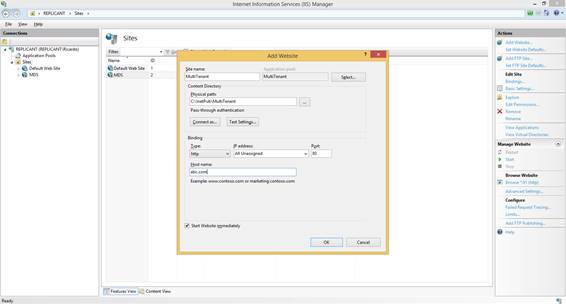

# 第二章设置

## 简介

本章将引导您完成开发和测试环境的设置。

## Visual Studio

为了能够遵循这里描述的概念和代码，您将需要一个 Visual Studio 的工作安装；2012 年以上的任何版本都可以，包括闪亮的全新[社区版](http://www.visualstudio.com/en-us/products/visual-studio-community-vs.aspx)。我自己也用过 Visual Studio 2013，但是你可以自由使用不同的版本；基本上，您需要一个可以处理的 Visual Studio 版本。NET 4.x 和 [NuGet](http://www.nuget.org) 包。

## 纽集

[NuGet](http://www.nuget.org) 是 Visual Studio 的原生打包系统。大多数软件公司，包括微软，以及独立开发者和社区(如 [NHibernate 社区](http://nhibernate.info/))通过 NuGet 提供他们的库和框架。这是获取软件包及其依赖项的简单方法。

出于本书示例的目的，您将需要以下软件包:

**OWIN 自主机**


**OWIN Web API**


**实体框架代码优先**


**无遮蔽**


**团结**


**ASP.NET MVC 统一引导程序**


**企业库日志应用程序块**


**ASP.NET 身份(实体框架)**


**ASP.NET 身份(NHibernate)**


**OWIN 身份**


**AspNet。身份.实体框架.多租户**


**瓦**


## 地址映射

如果你想遵循本书中描述的例子，你需要为你的开发机器设置不同的主机名。这样我们就可以利用第 3 章中描述的[主机头租户识别模式](03.html#_Host_Header_Strategy)。如果您对服务于您的本地连接(工作或家庭)的 DNS 服务器具有管理访问权限，您可以向静态 IP 地址添加不同的别名，然后使用该 IP 地址，而不是使用 DHCP 分配的地址。

另一种选择是使用免费服务，如 [xip.io](http://xip.io) ，将域名 **xip.io** 中的主机名翻译成 ip 地址；例如 **127.0.0.1.xip.io** 会自动翻译成 **127.0.0.1** 、 **192.168.1.1.xip.io** 变成 **192.168.1.1** 等等。这是因为我们可以使用基于前面提到的主机头来识别租户的策略，但是它只适用于 IP 地址，而不适用于主机名。

另一种选择是通过**% WINDIR % \ System32 \ Drivers \ Etc \ hosts**文件配置静态 IP-名称映射。该文件包含以下格式的行:

代码示例 1

```cs
          <IP address> <host name>  <alias 1>    …      <alias n>

```

例如，您可以添加以下条目:

代码示例 2

```cs
          127.0.0.1    localhost    abc.com             xyz.net

```

这将告诉 Windows 上的 IP 堆栈，名为**abc.com**和**xyz.net**的主机都将转换为回送地址 **127.0.0.1** ，而不需要进行 DNS 查找。

## IIS

在**互联网信息服务** (IIS)中设置多租户网站很简单:只需打开 **IIS 管理器**小程序，选择**网站** > **添加网站**。然后添加您希望处理的主机名:



图 2:在 IIS 中设置多租户站点

现在为所有其他租户添加一个主机名，选择站点，点击**绑定**。


图 3:向站点添加其他主机名


图 4:所有站点的主机名

同样重要的是应用程序池:您可以让不同的应用程序池为每个不同的租户服务(站点绑定)。这提供了更好的隔离，也就是说，如果其中一个租户出现问题(可能是未处理的异常导致站点不可用)，它不会影响其他租户。此外，您可以让应用程序池以不同的身份运行，如果您希望访问不同的数据库或具有不同的访问级别，这很好。只需在 IIS 管理器中创建任意多的应用程序池:


图 5:为租户创建应用程序池

## IIS Express

如果您将使用 **IIS Express** ，除了 DNS 或**主机**文件，您还需要配置网站的绑定以允许其他主机名。不幸的是，您将不得不手动完成，因为 IIS Express 不提供任何图形工具；该网站的配置文件位于:**% HOMEPATH % \ Documents \ IIS express \ Config \ application host . Config**。打开它并找到要更改的网站条目；应该如下所示(减去`name`、`id`、`physicalPath`和`bindingInformation`):

代码示例 3

```cs
          <sites>
                 <site name="Multitenant" id="1">                                 
                        <application path="/" applicationPool="Clr4IntegratedAppPool">                         <virtualDirectory path="/" 
                                     physicalPath="C:\InetPub\Multitenant" />
                       </application>
                       <bindings>
                              <binding protocol="http" bindingInformation="*:80:localhost" />
                        </bindings>
                 </site>
          </sites>

```

您可能会看到一些已经配置的站点。在这种情况下，您必须找到您感兴趣的元素，可能通过`physicalPath`属性，并添加一个带有指向正确主机名和端口的`bindingInformation`属性的`binding`元素。

代码示例 4

```cs
         <bindings>
               <binding protocol="http" bindingInformation="*:80:localhost" />
               <binding protocol="http" bindingInformation="*:80:abc.com" />
               <binding protocol="http" bindingInformation="*:80:xyz.net" />
         </bindings>

```

这指示 IIS Express 也接受对主机**abc.com**和**xyz.net**以及**本地主机**的请求。