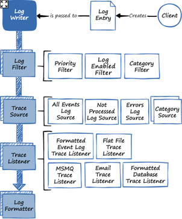
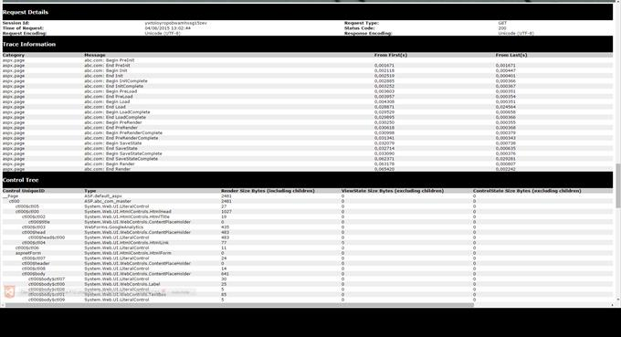
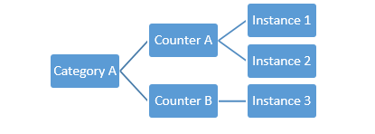
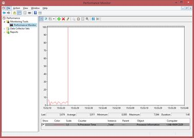
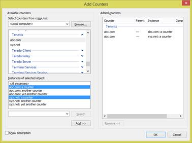
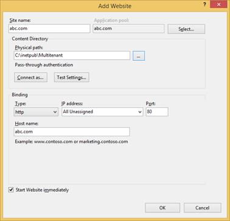
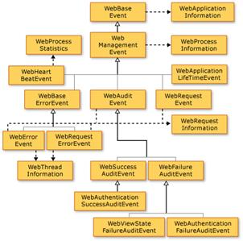
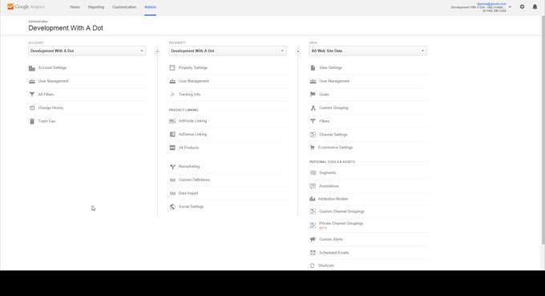

# 九、应用服务

## 简介

任何做一些至少稍微复杂的事情的应用程序都依赖于一些服务。称它们为共同关心的问题、应用服务、中间件或其他任何东西。这里的挑战是，我们不能只使用这些服务，而不为它们提供一些上下文，即当前的租户。例如，考虑缓存:您可能不希望为特定租户缓存的内容被其他租户访问。在这里，我们将看到一些通过利用 ASP.NET 和。NET 框架已经提供。

## 控制反转

在整个代码中，我一直使用公共服务定位器来检索服务，而不管用于实际注册它们的控制反转容器是什么，但最终，我们使用的是 Unity。当我们真正注册它们时，我们有几个选择:

*   注册静态实例
*   注册类实现
*   注册注射工厂

对于那些需要上下文的服务(知道当前的租户)，注入工厂是我们的朋友，因为这些信息只有在服务被实际请求时才能获得。使用 Unity，我们使用如下代码注册它们:

代码示例 89

```cs
          var container = UnityConfig.GetConfiguredContainer();
         container.RegisterType<IContextfulService>(new PerRequestLifetimeManager(), 
               new InjectionFactory(x =>
               {
                     var tenant = TenantsConfiguration.GetCurrentTenant();
                     return new ContextfulServiceImpl(tenant.Name);
               }));

```

值得注意的是:

*   [perrequestlifetime manager](https://msdn.microsoft.com/en-us/library/microsoft.practices.unity.perrequestlifetimemanager%28v=pandp.30%29.aspx)是一个 Unity 生存期管理器实现，它为注册的组件提供了每个请求的生存期，这意味着组件只有在当前 HTTP 请求的范围内创建，如果它们还没有创建的话。否则，将始终返回同一个实例。一次性组件在请求结束时得到适当处理。
*   [注入工厂](https://msdn.microsoft.com/en-us/library/microsoft.practices.unity.injectionfactory%28v=pandp.51%29.aspx)接受一个委托，该委托只返回一个预先创建的实例。在这个例子中，我们正在构建一个伪造的服务实现， **`ContextfulServiceImpl`** ，它接受一个构造函数参数，即当前租户的名称。

|  | 提示:将注入工厂与 PerRequestLifetimeManager 以外的生存期管理器一起使用没有多大意义。 |

|  | 注意:正如我之前所说的，您并不局限于 Unity——您可以使用任何您喜欢的 IoC 容器，前提是(为了本书示例的目的)它为公共服务定位器提供了一个适配器。 |

还记得代表租户配置的界面 **`ITenantConfiguration`** 吗？如果你这样做了，你就知道它有一个通用的索引集合， **`Properties`** 。我们可以实现一个自定义的生存期管理器，以透明的方式将项目存储在当前租户的 **`Properties`** 集合中:

代码示例 90

```cs
          public sealed class PerTenantLifetimeManager : LifetimeManager
         {
               private readonly Guid id = Guid.NewGuid();
               private static readonly ConcurrentDictionary<String, 
                     ConcurrentDictionary<Guid, Object>> items = 
                     new ConcurrentDictionary<String, 
                           ConcurrentDictionary<Guid, Object>>();

               public override Object GetValue()
               {
                     var tenant = TenantsConfiguration.GetCurrentTenant();
                     ConcurrentDictionary<Guid, Object> registrations = null;
                     Object value = null;

                     if (items.TryGetValue(tenant.Name, out registrations))
                     {
                           registrations.TryGetValue(this.id, out value);
                     }

                     return value;
               }

               public override void RemoveValue()
               {
                     var tenant = TenantsConfiguration.GetCurrentTenant();
                     ConcurrentDictionary<Guid, Object> registrations = null;

                     if (items.TryGetValue(tenant.Name, out registrations))
                     {
                           Object value;
                           registrations.TryRemove(this.id, out value);
                     }
               }

               public override void SetValue(Object newValue)
               {
                     var tenant = TenantsConfiguration.GetCurrentTenant();
                     var registrations = items.GetOrAdd(tenant.Name, 
                           new ConcurrentDictionary<Guid, Object>());
                     registrations[this.id] = newValue;
               }
         }

```

## 缓存

缓存是可以显著提高应用程序性能的技术之一，因为它将获取成本可能很高的数据保存在内存中。我们需要能够根据一个密钥存储数据，其中几个租户可以使用同一个密钥。这里的技巧是，在幕后，将提供的密钥与特定于租户的标识符连接起来。例如，典型的缓存服务接口可能是:

代码示例 91

```cs
          public interface ICache
         {
               void Remove(String key, String regionName = null);
               Object Get(String key, String regionName = null);
               void Add(String key, Object value, DateTime absoluteExpiration, 
                     String regionName = null);
               void Add(String key, Object value, TimeSpan slidingExpiration, 
                     String regionName = null);
         }

```

以及使用 ASP.NET 内置缓存的实现:

代码示例 92

```cs
          public sealed class AspNetMultitenantCache : ICache, ITenantAwareService
         {
               public static readonly ICache Instance = new AspNetMultitenantCache();

               private AspNetMultitenantCache()
               {
                     //private constructor since this is meant to be used as a singleton
               }

               private String GetTenantKey(String key, String regionName)
               {
                     var tenant = TenantsConfiguration.GetCurrentTenant().Name;
                     key = String.Concat(tenant, ":", regionName, ":", key);
                     return key;
               }

               public void Remove(String key, String regionName = null)
               {
                     HttpContext.Current.Cache.Remove(this.GetTenantKey(key, 
                     regionName));
               }

               public Object Get(String key, String regionName = null)
               {
                     return HttpContext.Current.Cache.Get(this.GetTenantKey(key, 
                     regionName));
               }
                     public void Add(String key, Object value, DateTime absoluteExpiration, 
                     String regionName = null)
               {
                     HttpContext.Current.Cache.Add(this.GetTenantKey(key, regionName),
                     value, null, absoluteExpiration, Cache.NoSlidingExpiration, 
                     CacheItemPriority.Default, null);
               }
                     public void Add(String key, Object value, TimeSpan slidingExpiration, 
                     String regionName = null)
               {
                     HttpContext.Current.Cache.Add(this.GetTenantKey(key, regionName),
                     value, null, Cache.NoAbsoluteExpiration, slidingExpiration, 
                     CacheItemPriority.Default, null);
               }
         }

```

|  | 注意:不要担心它。它只是我用于那些了解当前租户的服务的标记接口。 |

这里没有什么特别的——我们只是用当前租户的 ID 和地区名包装用户提供的密钥。这是作为单例实现的，因为只有一个 ASP.NET 缓存，没有任何状态并且都指向同一个缓存的 **`AspNetMultitenantCache`** 的多个实例是没有意义的。这就是 **`ITenantAwareService`** 接口所说的:它知道我们在寻址谁，所以每个租户不需要有不同的实例。

|  | 注意:注意类名上的> AspNet 前缀。这表明这个班需要 ASP.NET 去工作。 |

注册缓存服务很容易，我们不需要使用[注入工厂](https://msdn.microsoft.com/en-us/library/microsoft.practices.unity.injectionfactory%28v=pandp.51%29.aspx)，因为我们将注册一个单独的:

代码示例 93

```cs
          container.RegisterInstance<ICache>(AspNetMultitenantCache.Instance);

```

## 配置

我不知道有哪个中型应用程序不需要任何配置。这里的问题是一样的:两个租户可能共享相同的配置密钥，同时他们期望不同的值。让我们为基本配置特性定义一个公共接口:

代码示例 94

```cs
          public interface IConfiguration
         {
               Object GetValue(String key);
               void SetValue(String key, Object value);
               Object RemoveValue(String key);
         }

```

让我们也定义一个多租户实现，它使用每个租户配置文件中的[应用程序设置](https://msdn.microsoft.com/en-us/library/aa903313%28v=vs.71%29.aspx)作为后备存储:

代码示例 95

```cs
          public class AppSettingsConfiguration : IConfiguration, ITenantAwareService
         {
               public static readonly IConfiguration Instance = 
                     new AppSettingsConfiguration();

               private AppSettingsConfiguration()
               {
               }

               private void Persist(Configuration configuration)
               {
                     configuration.Save();
               }

               private Configuration Configuration
               {
                     get
                     {
                           var tenant =  TenantsConfiguration.GetCurrentTenant();
                           var configMap = new ExeConfigurationFileMap();
                           configMap.ExeConfigFilename =  String.Format(                    AppDomain.CurrentDomain.BaseDirectory, 
                                 tenant.Name, ".config");

                           var configuration = ConfigurationManager
                                 .OpenMappedExeConfiguration(configMap, 
                                      ConfigurationUserLevel.None);

                           return configuration;
                     }
               }

               public Object GetValue(String key)
               {
                     var entry = this.Configuration.AppSettings.Settings[key];
                     return (entry != null) ? entry.Value : null;
               }

               public void SetValue(String key, Object value)
               {
                     if (value == null)
                     {
                           this.RemoveValue(key);
                     }
                     else
                     {
                           var configuration = this.Configuration;
                           configuration.AppSettings.Settings
                                 .Add(key, value.ToString());
                           this.Persist(configuration);
                     }
               }

               public Object RemoveValue(String key)
               {
                     var configuration = this.Configuration;
                     var entry = configuration.AppSettings.Settings[key];

                     if (entry != null)
                     {
                           configuration.AppSettings.Settings.Remove(key);
                           this.Persist(configuration);
                           return entry.Value;
                     }

                     return null;
               }
         }

```

|  | 注意:这个类对于网络和非网络是完全不可知的；它可以用于任何类型的项目。它还实现了 ITenantAwareService，原因和之前一样。 |

有了这个实现，我们每个租户可以有一个文件，比如说 **abc.com.config** ，或者 **xyz.net.config** ，语法将与普通的一样。NET 配置文件:

代码示例 96

```cs
          <configuration>
                <appSettings>
                      <add key="Key" value="Value"/>
                </appSettings>
          <configuration>

```

这种方法很好，因为我们甚至可以在运行时更改文件，并且不会导致 ASP.NET 应用程序重新启动，如果我们更改 **Web.config** 文件，就会发生这种情况。

我们将使用相同的模式进行注册:

代码示例 97

```cs
          container.RegisterInstance<IConfiguration>(AppSettingsConfiguration.Instance);

```

## 测井

当有这么多好的日志框架可供选择时，实现另一个日志框架会很麻烦，也很愚蠢。对于这本书，我选择了[企业库日志应用块](https://msdn.microsoft.com/en-us/library/dn440731%28v=pandp.60%29.aspx) (ELLAB)。您可能希望通过 NuGet 来增加对它的支持:


图 18:安装企业程序库日志应用程序块

ELLAB 提供了一个 API，您可以使用它将日志发送到多个来源，如下图所示:



图 19:企业库日志应用程序块架构

这些来源包括:

*   文本文件([滚动平台文件跟踪侦听器](https://msdn.microsoft.com/en-us/library/microsoft.practices.enterpriselibrary.logging.tracelisteners.rollingflatfiletracelistener.aspx)、[平台文件跟踪侦听器](https://msdn.microsoft.com/en-us/library/microsoft.practices.enterpriselibrary.logging.tracelisteners.flatfiletracelistener.aspx)、[xmltracelines](https://msdn.microsoft.com/en-us/library/microsoft.practices.enterpriselibrary.logging.tracelisteners.xmltracelistener.aspx))
*   Windows 事件日志([formatedeventlogtracelistener](https://msdn.microsoft.com/en-us/library/microsoft.practices.enterpriselibrary.logging.tracelisteners.formattedeventlogtracelistener.aspx))
*   MSMQ([MSMQEventTraceListener](https://msdn.microsoft.com/en-us/library/microsoft.practices.enterpriselibrary.logging.tracelisteners.msmqtracelistener.aspx))
*   电子邮件( [EmailTraceListener](https://msdn.microsoft.com/en-us/library/microsoft.practices.enterpriselibrary.logging.tracelisteners.emailtracelistener.aspx)
*   数据库([formateddatabasetraclistener](https://msdn.microsoft.com/en-us/library/microsoft.practices.enterpriselibrary.logging.database.formatteddatabasetracelistener.aspx))
*   WMI ( [WmiTraceListener](https://msdn.microsoft.com/en-us/library/microsoft.practices.enterpriselibrary.logging.tracelisteners.wmitracelistener.aspx) )

现在，我们的要求是将每个租户的输出发送到自己的文件中。例如，租户`“**abc.com**”`的输出将转到`“**abc.com.log**”,`等等。但首先，这是我们的基本日志合同:

代码示例 98

```cs
          public interface ILog
          {
                      void Write(Object message, Int32 priority, TraceEventType severity, 
                                  Int32 eventId = 0);
          }

```

我保持简单，但是，无论如何，添加任何你认为合适的辅助方法。

ELLAB 可以记录:

*   任意的**信息**
*   一个字符串**类别**:我们将它用于租户名称，所以我们不会在 API 中公开它
*   整数**优先级**
*   事件**严重性**
*   事件标识符，可选( **`eventId`** )

在《电子学习法》的基础上实施该法可以是:

代码示例 99

```cs
          public sealed class EntLibLog : ILog, ITenantAwareService
          {
                public static readonly ILog Instance = new EntLibLog();

                private EntLibLog()
                {
                      //private constructor since this is meant to be used as a singleton
                }

               public void Write(Object message, Int32 priority, TraceEventType severity,            Int32 eventId = 0)
               {
                     var tenant = TenantsConfiguration.GetCurrentTenant();
                     Logger.Write(message, tenant.Name, priority, eventId, severity);
               }
         }

```

注册遵循与之前相同的模式:

代码示例 100

```cs
          container.RegisterInstance<ILog>(EntLibLog.Instance);

```

这一次，我们还需要考虑 ELLAB 配置。因为我们需要单独设置每个租户，所以我们必须在启动时运行以下代码:

代码示例 101

```cs
          private void CreateLogFactories(IEnumerable<ITenantConfiguration> tenants)
         {
               foreach (var tenant in tenants)
               {
                     try 
                     {
                           var configurationSource = 
                                 new FileConfigurationSource(tenant.Name + 
                                 ".config");
                           var logWriterFactory = new LogWriterFactory(
                                 configurationSource);
                           Logger.SetLogWriter(logWriterFactory.Create());
                     }
                     catch {}
               }
         }

          var tenants = TenantsConfiguration.GetTenants();
         CreateLogFactories(tenants);

```

|  | 提示:围绕初始化代码的 try…catch 块就在那里，这样如果我们不想要特定租户的配置文件，它就不会抛出。 |

`TenantsConfiguration.GetTenants`方法在“寻找租户”一章中介绍。该代码，特别是`FileConfigurationSource`类，要求所有租户都将其配置保存在一个单独的文件中，以租户命名( *`<tenant>`* `.config`)。接下来是一个日志配置示例，它使用每周循环的滚动平面文件:

代码示例 102

```cs
          <configuration>
                <configSections>
                      <section name="loggingConfiguration" 
                            type="Microsoft.Practices.EnterpriseLibrary.Logging.
          Configuration.LoggingSettings, Microsoft.Practices.EnterpriseLibrary.Logging" />
                </configSections>
                <loggingConfiguration name="loggingConfiguration" tracingEnabled="true"
                      defaultCategory="" logWarningsWhenNoCategoriesMatch="true">
                      <listeners>
                            <add name="Rolling Flat File Trace Listener"
                                  type="Microsoft.Practices.EnterpriseLibrary
          .Logging.TraceListeners.RollingFlatFileTraceListener,
                            Microsoft.Practices.EnterpriseLibrary.Logging"                   listenerDataType="Microsoft.Practices.EnterpriseLibrary
          .Logging.Configuration.RollingFlatFileTraceListenerData,
                            Microsoft.Practices.EnterpriseLibrary.Logging"
                            fileName="abc.com.log"
                            footer="---------------------------"
                            formatter="Text Formatter"
                            header="---------------------------"
                            rollFileExistsBehavior="Increment"
                            rollInterval="Week"
                            timeStampPattern="yyyy-MM-dd hh:mm:ss"
                            traceOutputOptions="LogicalOperationStack, DateTime,
                            Timestamp, ProcessId, ThreadId, Callstack"
                            filter="All" />
                      </listeners>
                      <formatters>
                            <add type="Microsoft.Practices.EnterpriseLibrary.Logging.
          Formatters.TextFormatter,
                            Microsoft.Practices.EnterpriseLibrary.Logging"
                            template="Timestamp: {timestamp}&#xA;
                            Message: {message}&#xA;Category: {category}&#xA;
                            Priority: {priority}&#xA;EventId: {eventid}&#xA;
                            Severity: {severity}&#xA;Title:{title}&#xA;
                            Machine: {machine}&#xA;Process Id: {processId}&#xA;
                            Process Name: {processName}&#xA;"
                            name="Text Formatter" />
                      </formatters>
                      <categorySources>
                            <add switchValue="All" name="General">
                                  <listeners>
                                        <add name=
                                       "Rolling Flat File Trace Listener" />
                                  </listeners>
                            </add>
                      </categorySources>
                      <specialSources>
                            <allEvents switchValue="All" name="All Events">
                                  <listeners>
                                       <add name=
                                       "Rolling Flat File Trace Listener" />
                                  </listeners>
                            </allEvents>
                            <notProcessed switchValue="All"
                                  name="Unprocessed Category">
                                  <listeners>
                                       <add name=
                                       "Rolling Flat File Trace Listener" />
                                  </listeners>
                            </notProcessed>
                            <errors switchValue="All" 
                                  name="Logging Errors &amp; Warnings">
                                  <listeners>
                                       <add name=
                                       "Rolling Flat File Trace Listener" />
                                  </listeners>
                            </errors>
                      </specialSources>
                </loggingConfiguration>
          </configuration>

```

|  | 注:有关企业库日志记录应用程序块的更多信息，请访问[企业库网站](https://msdn.microsoft.com/en-us/library/dn440731(v=pandp.60).aspx)。要登录数据库，需要安装[日志记录应用程序块数据库提供程序](https://www.nuget.org/packages/EnterpriseLibrary.Logging.Database/) NuGet 软件包。 |

## 监测

ASP.NET 和提供的经典宣传短片。用于诊断和监控的. NET 应用程序不能很好地处理多租户，即:

*   [追踪](https://msdn.microsoft.com/en-us/library/zs6s4h68.aspx)
*   [性能计数器](https://msdn.microsoft.com/en-us/library/windows/desktop/aa373083.aspx)
*   网络事件([健康监控提供商](https://msdn.microsoft.com/en-us/library/bb398933.aspx))

在这一章中，我们将研究一些使这些 API 多租户的技术。在此之前，让我们为所有这些不同的 API 定义一个统一的契约:

代码示例 103

```cs
          public interface IDiagnostics
         {           Int64 IncrementCounterInstance(String instanceName, Int32 value = 1);
               Guid RaiseWebEvent(Int32 eventCode, String message, Object data, 
                     Int32 eventDetailCode = 0);
               void Trace(Object value, String category);
         }

```

需要对每种方法进行解释:

*   **`Trace`** :写入注册的跟踪侦听器
*   **`IncrementCounterInstance`** :增加一个针对当前租户的性能计数器
*   **`RaiseWebEvent`** `:`在 ASP.NET 健康监测基础设施中引发网络事件

在接下来的部分中，我们将更详细地了解每一部分。

### 追踪

#### ASP.NET 追踪

[ASP.NET 追踪](https://msdn.microsoft.com/en-us/library/bb386420%28v=vs.140%29.aspx)服务对于分析你的 ASP.NET Web Forms 非常有用，它甚至可以帮助你解决一些问题。

在使用跟踪之前，需要通过一个[跟踪](https://msdn.microsoft.com/en-us/library/vstudio/6915t83k%28v=vs.100%29.aspx)元素在 **Web.config** 文件中进行全局启用:

代码示例 104

```cs
          <system.web>
                                  <trace enabled="true" localOnly="true" writeToDiagnosticsTrace="true" 
                                  pageOutput="true" traceMode="SortByTime" requestLimit="20"/>
          </system.web>

```

这个宣言说的是:

*   描摹的是 **`enabled`** 。
*   跟踪输出仅呈现给本地用户( **`localOnly`** )。
*   通知标准诊断跟踪侦听器( **`writeToDiagnosticsTrace`** )。
*   输出被发送到每个页面的底部，而不是显示在跟踪处理程序 URL ( **`pageOutput`** )上。
*   跟踪事件按时间戳排序( **`traceMode`** )。
*   最多存储 20 个请求( **`requestLimit`** )。

您还需要逐页启用它(默认为禁用):

代码示例 105

```cs
          <%@ Page Language="C#" CodeBehind="Default.aspx.cs" Inherits="WebForms.Default" 
          Trace="true" %>

```

我们不会详细讨论 ASP.NET 追踪。相反，让我们看一个 ASP.NET 网络表单的示例跟踪:



图 20:网页表单的页面跟踪

在 MVC 中，唯一的区别就是**控制树**表是空的，这是显而易见的，一旦想起来。

该轨迹显示在页面本身上，如`pageOutput`所示；另一个选项是让跟踪只显示在跟踪处理程序页面`Trace.axd`上，而不显示该页面。无论哪种方式，输出都是一样的。

跟踪条目对应于服务器处理的请求。我们可以通过调用 [TraceContext](https://msdn.microsoft.com/en-us/library/System.Web.TraceContext(v=vs.110).aspx) 类中的一个跟踪方法，将我们自己的跟踪消息添加到条目中，方便地作为[页面使用。在网页表单中追踪](https://msdn.microsoft.com/en-us/library/system.web.ui.page.trace%28v=vs.110%29.aspx):

代码示例 106

```cs
          protected override void OnLoad(EventArgs e)
         {
               this.Trace.Write("On Page.Load");
               base.OnLoad(e);
         }

```

或者作为 [Trace](https://msdn.microsoft.com/en-us/library/system.diagnostics.trace%28v=vs.110%29.aspx) 类的静态方法(对于 MVC 或者一般来说)，它甚至有一个用于传递条件的重载:

代码示例 107

```cs
          public ActionResult Index()
         {
               Trace.WriteLine("Before presenting a view");
               var tenant = TenantsConfiguration.GetCurrentTenant();
               Trace.WriteLineIf(tenant.Name != "abc.com", "Not abc.com");
               return this.View();
         }

```

现在，跟踪提供程序保留了许多跟踪，最大值由`requestLimit`指定—默认值为 10，最大值为 10，000。这意味着对我们所有租户的请求将以相同的方式处理，因此如果我们转到`Trace.axd`网址，我们无法知道该请求是针对哪个租户的。但是如果您仔细查看图 20 中**跟踪信息**表的**消息**列，您会注意到一个前缀，该前缀对应于发出请求的租户。为此，我们需要在 **Web.config** 文件的 [system.diagnostics](https://msdn.microsoft.com/en-us/library/1txedc80%28v=vs.110%29.aspx) 部分注册一个自定义诊断侦听器:

代码示例 108

```cs
          <system.diagnostics>
                <trace autoflush="true">
                      <listeners>
                            <add name="MultitenantTrace" 
                                  type="WebForms.MultitenantTraceListener, 
          WebForms" />
                      </listeners>
                </trace>
          </system.diagnostics>

```

**`MultitenantTraceListener`** 的代码如下:

代码示例 109

```cs
          public sealed class MultitenantTraceListener : WebPageTraceListener
         {
               private static readonly MethodInfo GetDataMethod = typeof(TraceContext)
               .GetMethod("GetData", BindingFlags.NonPublic | BindingFlags.Instance);

               public override void WriteLine(String message, String category)
               {
                     var ds = GetDataMethod.Invoke(HttpContext.Current.Trace, null)
                            as DataSet;
                     var dt = ds.Tables["Trace_Trace_Information"];
                     var dr = dt.Rows[dt.Rows.Count - 1];
                     var tenant = TenantsConfiguration.GetCurrentTenant();
                     dr["Trace_Message"] = String.Concat(tenant.Name, ": ", 
                           dr["Trace_Message"]);

                     base.WriteLine(message, category);
               }
         }

```

这是通过一点反射魔法，获取对包含最后一个跟踪的当前数据集的引用，并在最后一个跟踪(当前请求的跟踪)上添加一个前缀，即当前租户的名称(例如，`abc.com`)。

**Web.config** 不是唯一可以注册诊断侦听器的方式；还有代码: [Trace。听众](https://msdn.microsoft.com/en-us/library/system.diagnostics.trace.listeners.aspx)。使用这种机制，您可以添加自定义侦听器，当发出跟踪调用时，这些侦听器将执行各种操作:

代码示例 110

```cs
          protected void Application_Start()
         {
               //unconditionally adding a listener
               Trace.Listeners.Add(new CustomTraceListener());
         }

          protected void Application_BeginRequest()
         {
               //conditionally adding a listener
               var tenant = TenantsConfiguration.GetCurrentTenant();
               if (tenant.Name == "abc.com")
               {    
                     Trace.Listeners.Add(new AbcComTraceListener());
               }
         }

```

#### 跟踪提供程序

中存在其他跟踪提供程序。NET 基类库:

*   [事件日志跟踪侦听器](https://msdn.microsoft.com/en-us/library/system.diagnostics.eventlogtracelistener.aspx):写入窗口事件日志
*   [网页追踪监听器](https://msdn.microsoft.com/en-us/library/system.web.webpagetracelistener.aspx):ASP.NET 追踪
*   [IisTraceListener](https://msdn.microsoft.com/en-us/library/system.web.iistracelistener.aspx) : IIS 跟踪
*   [事件提供程序事件侦听器](https://msdn.microsoft.com/en-us/library/system.diagnostics.eventing.eventprovidertracelistener.aspx) : [窗口事件跟踪](https://msdn.microsoft.com/en-us/library/windows/desktop/bb968803.aspx) (ETW)
*   [控制台发送器](https://msdn.microsoft.com/en-us/library/system.diagnostics.consoletracelistener.aspx):控制台
*   [DefaultTraceListener](https://msdn.microsoft.com/en-us/library/system.diagnostics.defaulttracelistener.aspx):Visual Studio 中的输出窗口
*   [TextWriterTraceListener](https://msdn.microsoft.com/en-us/library/system.diagnostics.textwritertracelistener.aspx) :文本文件
*   [定界符列表跟踪侦听器](https://msdn.microsoft.com/en-us/library/system.diagnostics.delimitedlisttracelistener.aspx):带有自定义字段分隔符的文本文件
*   [事件模式侦听器](https://msdn.microsoft.com/en-us/library/system.diagnostics.eventschematracelistener.aspx) : XML 文本文件
*   [xmlwritertracelines](https://msdn.microsoft.com/en-us/library/system.diagnostics.xmlwritertracelistener.aspx):XML 文本文件
*   [filelogtracelistener](https://msdn.microsoft.com/en-us/library/microsoft.visualbasic.logging.filelogtracelistener.aspx):text file

所有这些都可以在[系统诊断](https://msdn.microsoft.com/en-us/library/1txedc80%28v=vs.110%29.aspx)或[追踪中注册。听众](https://msdn.microsoft.com/en-us/library/system.diagnostics.trace.listeners.aspx)。我们将有一个用于 [Trace](https://msdn.microsoft.com/en-us/library/System.Diagnostics.Trace.aspx) 静态方法的包装类，其中我们实现了`IDiagnostics`接口的`Trace`方法:

代码示例 111

```cs
          public sealed class MultitenantDiagnostics : IDiagnostics, ITenantAwareService
         {
               public void Trace(Object value, String category)
               {
                     var tenant = TenantsConfiguration.GetCurrentTenant();
                     System.Diagnostics.Trace.AutoFlush = true;
                     System.Diagnostics.Trace.WriteLine(String.Concat(tenant.Name,
                           ": ", value), category);
               }
         }

```

### 性能计数器

[性能计数器](https://msdn.microsoft.com/en-us/library/windows/desktop/aa373083(v=vs.85).aspx)是一项 Windows 功能，可用于提供对正在运行的应用程序和服务的洞察。甚至有可能让 Windows 自动对性能计数器的值超过给定阈值的情况做出反应。如果我们愿意，我们可以使用性能计数器向相关方传达应用程序状态的各个方面，其中该状态由整数值组成。

性能计数器以下列方式组织:

*   类别:名称
*   计数器:一个名称和一个类型(让我们暂时忘记类型)
*   实例:给定类型的名称和值(我们假设是一个长整数)



图 21:性能计数器的基本概念

在`ITenantConfiguration`界面中，我们添加了一个`Counters`属性，实现后用于自动创建性能计数器实例。我们将遵循这种方法:

表 6:映射多租户的性能计数器概念

| 概念 | 内容 |
| 种类 | “房客” |
| 计数器 | 租户名称(如**abc.com**或**xyz.net** |
| 情况 | 一个租户特有的名字，来自 **`ITenantConfiguration.Counters`** |

在`TenantsConfiguration`类中自动创建每个性能计数器和实例的代码如下:

代码示例 112

```cs
          public sealed class TenantsConfiguration : IDiagnostics, ITenantAwareService
         {
               private static void CreatePerformanceCounters(
                     IEnumerable<ITenantConfiguration> tenants)
               {
                     if (PerformanceCounterCategory.Exists("Tenants"))
                     {
                           PerformanceCounterCategory.Delete("Tenants");
                     }

                     var counterCreationDataCollection = 
                           new CounterCreationDataCollection(
                                 tenants.Select(tenant => 
                                      new CounterCreationData(
                                            tenant.Name,
                                            String.Empty,
                                      PerformanceCounterType.NumberOfItems32))
                                 .ToArray());

                     var category = PerformanceCounterCategory.Create("Tenants",
                           "Tenants performance counters",
                           PerformanceCounterCategoryType.MultiInstance,
                           counterCreationDataCollection);

                     foreach (var tenant in tenants)
                     {
                           foreach (var instance in tenant.Counters)
                           {
                                 var counter = new PerformanceCounter(
                                       category.CategoryName,
                                      tenant.Name,
                                      String.Concat(tenant.Name,
                                            ": ",
                                            instance.InstanceName), false);
                           }
                     }
               }
         }

```

另一方面，递增性能计数器实例的代码是在`IDiagnostics`接口(`IncrementCounterInstance`)中定义的，我们可以将其实现为:

代码示例 113

```cs
          public sealed class MultitenantDiagnostics : IDiagnostics, ITenantAwareService
         {
               public Int64 IncrementCounterInstance(String instanceName,
                     Int32 value = 1)
               {
                     var tenant = TenantsConfiguration.GetCurrentTenant();
                     using (var pc = new PerformanceCounter("Tenants", tenant.Name,
                           String.Concat(tenant.Name, ":", instanceName), false))
                     {
                           pc.RawValue += value;
                           return pc.RawValue;
                     }
               }
         }

```

当应用运行时，我们可以通过[性能监视器](https://technet.microsoft.com/en-us/library/cc749249.aspx)应用实时观察计数器实例的值:



图 22:显示性能计数器的性能监视器应用程序

我们只需要在显示器上增加一些计数器；我们的将在**租户** - ***<租户名称>*** - ***<实例名称>*** 下提供:



图 23:添加性能计数器

在本例中，可以感觉到两个租户，即**abc.com**和**xyz.net**，具有相同名称的计数器实例，但情况并非如此。

还有其他内置的 ASP。NET 相关的性能计数器，可用于监视应用程序。例如，在**性能监视器**中，添加一个新的计数器并选择**ASP.NET 应用程序**:


图 24:ASP.NET 应用程序性能计数器

您会注意到您有几个实例，每个运行的站点一个。这些实例会自动命名，但每个数字都可以追溯到一个应用程序。例如，如果您正在使用 IIS Express，请打开 **ApplicationHost.config** 文件(**C:\ Users \*<username>*\ Documents \ IIS Express \ Config**)并转到**站点**部分，您会发现类似这样的内容(当然，在这种情况下，您正在为租户服务**abc.com**和**xyz.net**):

代码示例 114

```cs
          <sites>
                 <site name="abc.com" id="1">
                       <application path="/" applicationPool="Clr4IntegratedAppPool">
                              <virtualDirectory path="/" 
                                     physicalPath="C:\InetPub\Multitenant" />
                       </application>
                        <bindings>
                              <binding protocol="http" bindingInformation="*:80:abc.com" />
                       </bindings>
                 </site>
                 <site name="xyz.net" id="2">
                       <application path="/" applicationPool="Clr4IntegratedAppPool">
                              <virtualDirectory path="/" 
                                     physicalPath="C:\InetPub\Multitenant" />
                       </application>
                       <bindings>
                              <binding protocol="http" bindingInformation="*:80:xyz.net" />
                       </bindings>
                 </site>
          </sites>

```

或者使用 IIS:



图 25:为 abc.com 创建一个单独的站点


图 26:为 xyz.net 创建一个单独的站点

为了有更多的控制权，我们把两个站点分开了；这是为了更精确地控制每一个。不过，代码库保持不变。

在每个实例的名称`(**_LM_W3SVC_<*n>*_ROOT**`)中，`*<n>*`将匹配这些数字中的一个。

另一方面，如果您想使用完整的 IIS，则 [appcmd](https://technet.microsoft.com/en-us/library/cc772200(v=ws.10).aspx) 命令会给您以下信息:

代码示例 115

```cs
          C:\Windows\System32\inetsrv>appcmd list site
          SITE "abc.com" (id:1,bindings:http/abc.com:80:,state:Started)
          SITE "xyz.net" (id:2,bindings:http/xyz.net:80:,state:Started)

          C:\Windows\System32\inetsrv>appcmd list apppool
          APPPOOL "DefaultAppPool" (MgdVersion:v4.0,MgdMode:Integrated,state:Started)
          APPPOOL "Classic .NET AppPool" (MgdVersion:v2.0,MgdMode:Classic,state:Started)
          APPPOOL ".NET v2.0 Classic" (MgdVersion:v2.0,MgdMode:Classic,state:Started)
          APPPOOL ".NET v2.0" (MgdVersion:v2.0,MgdMode:Integrated,state:Started)
          APPPOOL ".NET v4.5 Classic" (MgdVersion:v4.0,MgdMode:Classic,state:Started)
          APPPOOL ".NET v4.5" (MgdVersion:v4.0,MgdMode:Integrated,state:Started)
          APPPOOL "abc.com" (MgdVersion:v4.0,MgdMode:Integrated,state:Started)
          APPPOOL "xyz.net" (MgdVersion:v4.0,MgdMode:Integrated,state:Started)

```

我列出了所有网站(第一个列表)，然后是所有应用程序池。

### 健康监测

ASP.NET 的[健康监控](https://msdn.microsoft.com/en-us/library/bb398933(v=vs.140).aspx)功能允许配置规则来响应在 ASP.NET 应用程序中发生的某些事件。它使用提供的模型来决定当满足规则条件时该做什么。例如，当一分钟内登录尝试失败的次数达到三次时，发送通知邮件。因此，非常简单，健康监测功能允许我们:

*   注册一些将执行操作的提供程序
*   添加绑定到特定提供程序的命名规则
*   将事件代码映射到创建的规则

ASP.NET API 在内部引发了许多开箱即用的事件，但我们也可以定义自己的事件:



图 27:包含的健康监控事件

事件分为类和子类。处理身份验证事件有特定的类( [WebAuditEvent](https://msdn.microsoft.com/en-us/library/system.web.management.webauditevent(v=vs.110).aspx) 、 [WebFailureAuditEvent](https://msdn.microsoft.com/en-us/library/system.web.management.webfailureauditevent(v=vs.110).aspx) 、 [WebSuccessAuditEvent](https://msdn.microsoft.com/en-us/library/system.web.management.websuccessauditevent(v=vs.110).aspx) )、请求( [WebRequestEvent](https://msdn.microsoft.com/en-us/library/system.web.management.webrequestevent(v=vs.110).aspx) 、 [WebRequestErrorEvent](https://msdn.microsoft.com/en-us/library/system.web.management.webrequesterrorevent(v=vs.85).aspx) )和应用程序生存期事件([webapplicationlifetime event](https://msdn.microsoft.com/en-us/library/system.web.management.webapplicationlifetimeevent(v=vs.110).aspx))、查看状态失败事件([WebViewStateFailureEvent](https://msdn.microsoft.com/en-us/library/system.web.management.webviewstatefailureauditevent(v=vs.85).aspx))等。这些事件(和类)中的每一个都被分配一个唯一的数字标识符，该标识符列在[网络事件代码](https://msdn.microsoft.com/en-us/library/system.web.management.webeventcodes(v=vs.110).aspx)字段中。自定义事件应以[网络事件代码中的值开始。webextendbackbase](https://msdn.microsoft.com/en-us/library/system.web.management.webeventcodes.webextendedbase(v=vs.110).aspx)+1。

当然，还包括许多提供者，用于在满足规则时执行操作。我们也可以实现自己的，通过继承 [WebEventProvider](https://msdn.microsoft.com/en-us/library/system.web.management.webeventprovider.aspx) 或者它的一个子类:


图 28:包含的健康监控提供商

包括的提供商涵盖了许多典型场景:

*   写入数据库( [SQLWebEventProvider](https://msdn.microsoft.com/en-us/library/system.web.management.SQLWebEventProvider(v=vs.110).aspx) )
*   写信给 WMI ( [WMIWebEventProvider](https://msdn.microsoft.com/en-us/library/system.web.management.WMIWebEventProvider(v=vs.110).aspx) )
*   写入事件日志( [EventLogWebEventProvider](https://msdn.microsoft.com/en-us/library/system.web.management.eventlogwebeventprovider(v=vs.110).aspx)
*   发送邮件([simplemailbwebeventprovider](https://msdn.microsoft.com/en-us/library/system.web.management.SimpleMailWebEventProvider(v=vs.110).aspx))

在我们开始编写一些规则之前，我们先来看看我们的自定义提供程序， **`MultitenantEventProvider`** `,`及其相关类 **`MultitenantWebEvent`** 和 **`MultitenantEventArgs`** :

代码示例 116

```cs
          public sealed class MultitenantEventProvider : WebEventProvider
         {
               private static readonly IDictionary<String, MultiTenantEventProvider> 
                     providers = 
                     new ConcurrentDictionary<String, MultiTenantEventProvider>();

               private const String TenantKey = "tenant";

               public String Tenant { get; private set; }

               public event EventHandler<MultiTenantEventArgs> Event;

               public static void RegisterEvent(String tenantId,
                     EventHandler<MultiTenantEventArgs> handler)
               {
                     var provider = FindProvider(tenantId);
                     if (provider != null)
                     {
                           provider.Event += handler;
                     }
               }

               public static MultiTenantEventProvider FindProvider(String tenantId)
               {
                     var provider = null as MultiTenantEventProvider;

                     providers.TryGetValue(tenantId, out provider);

                     return provider;
               }

               public override void Initialize(String name, NameValueCollection config)
               {
                     var tenant = config.Get(TenantKey);

                     if (String.IsNullOrWhiteSpace(tenant))
                     {
                           throw new InvalidOperationException(
                                 "Missing tenant name.");
                     }

                     config.Remove(TenantKey);

                     this.Tenant = tenant;
                     providers[tenant] = this;

                     base.Initialize(name, config);
               }

               public override void Flush()
               {
               }

               public override void ProcessEvent(WebBaseEvent raisedEvent)
               {
                     var evt = raisedEvent as MultitenantWebEvent;
                     if (evt != null)
                     {
                           var tenant = TenantsConfiguration.GetCurrentTenant();

                           if (tenant.Name == evt.Tenant)
                           {
                                 var handler = this.Event;
                                 if (handler != null)
                                 {                                                          handler(this, 
                                            new MultitenantEventArgs(
                                                  this, evt));
                                 }
                           }
                     }
               }

               public override void Shutdown()
               {
               }
         }

         [Serializable]
          public sealed class MultitenantEventArgs : EventArgs
         {
               public MultitenantEventArgs(MultitenantEventProvider provider,
                     MultitenantWebEvent evt)
               {
                     this.Provider = provider;
                     this.Event = evt;
               }

               public MultitenantEventProvider Provider { get; private set; }
               public MultitenantWebEvent Event { get; private set; }
         }

          public class MultitenantWebEvent : WebBaseEvent
         {
               public MultitenantWebEvent(String message, Object eventSource,               Int32 eventCode, Object data) : 
                           this(message, eventSource, eventCode, data, 0) {}

               public MultitenantWebEvent(String message, Object eventSource, 
                     Int32 eventCode, Object data, Int32 eventDetailCode) : 
                           base(message, eventSource, eventCode, eventDetailCode)
               {
                     var tenant = TenantsConfiguration.GetCurrentTenant();
                     this.Tenant = tenant.Name;
                     this.Data = data;
               }

               public String Tenant { get; private set; }
               public Object Data { get; private set; }
         }

```

因此，我们有一个提供者类(`MultitenantEventProvider`)、一个提供者事件参数(`MultitenantEventArgs`)和一个提供者事件(`MultitenantWebEvent`)。我们总是可以通过调用静态方法`FindProvider`找到为当前租户注册的提供程序，并且从这个提供程序中，我们可以将事件处理程序注册到`Event`事件。稍后，我们将了解如何连接，但首先，这里有一个`IDiagnostics`接口`RaiseWebEvent`方法的可能实现:

代码示例 117

```cs
          public sealed class MultitenantDiagnostics : IDiagnostics, ITenantAwareService
         {
               public Guid RaiseWebEvent(Int32 eventCode, String message, Object data, 
                     Int32 eventDetailCode = 0)
               {
                     var tenant = TenantsConfiguration.GetCurrentTenant();
                     var evt = new MultitenantWebEvent(message, tenant, eventCode,
                           data, eventDetailCode);
                     evt.Raise();
                     return evt.EventID;
               }
         }

```

现在，让我们添加一些规则，看看事情的发展。首先，我们需要向 **Web.config** 文件的[健康监控](https://msdn.microsoft.com/en-us/library/2fwh2ss9(v=vs.100).aspx)部分添加一些元素:

代码示例 118

```cs
          <configuration>
               <system.web>
                     <healthMonitoring enabled="true" heartbeatInterval="0">
                           <providers>
                                 <add name="abc.com"                                                                type="MultitenantEventProvider, MyAssembly"
                                      tenant="abc.com" />
                                 <add name="xyz.net"
                                      type="MultiTenantEventProvider, MyAssembly"
                                      tenant="xyz.net" />
                           </providers>
                           <rules>
                                 <add name="abc.com Custom Event"
                                      eventName="abc.com Custom Event"
                                      provider="abc.com"
                                      minInterval="00:01:00"
                                      minInstances="1" maxLimit="1" />
                                 <add name="xyz.net Custom Event"
                                      eventName="xyz.net Custom Event"
                                      provider="xyz.net"
                                       minInterval="00:01:00"
                                      minInstances="2" maxLimit="2" />
                           </rules>
                           <eventMappings>
                                 <add name="abc.com Custom Event"
                                      startEventCode="100001"
                                      endEventCode="100001"
                                      type="MultiTenantWebEvent, MyAssembly" />
                                 <add name="xyz.net Custom Event"
                                      startEventCode="200001"
                                      endEventCode="200001"
                                      type="MultiTenantWebEvent, MyAssembly" />
                           </eventMappings>
                     </healthMonitoring>
               </system.web>
         </configuration>

```

所以，我们这里有:

*   注册在同一类别(`MultitenantEventProvider`)的两个**提供商**，每个租户一个，其属性`tenant`说明了这一点
*   两个**规则**，对于给定的`provider`，当一个命名事件(`eventName`)在一定时间内(`minInterval`)被引发多次(`minInstances`、`maxLimit`)时，每个规则都会引发一个自定义事件；
*   两个事件映射(`eventMappings)`，将事件 id 间隔(`startEventCode`、`endEventCode`)转换为某个事件类(`type`)。

我们还需要为正确租户的`MultitenantEventProvider`类添加一个事件处理程序，可能在[应用程序 _ 开始](https://msdn.microsoft.com/en-us/library/ms178473(v=vs.140).aspx)中:

代码示例 119

```cs
          protected void Application_Start()
         {
               MultiTenantEventProvider.RegisterEvent("abc.com", (s, e) =>
               {
                     //do something when the event is raised
               });
         }

```

因此，最后，如果在任何规则中指定的时间段内引发了许多 web 事件，就会引发一个事件，希望会发生一些事情。

## 分析

不用说，[谷歌分析](http://www.google.com/analytics/)是*事实上的*标准，当分析你网站的流量时。据我所知，没有其他服务能提供同样多的信息和功能，所以使用它是有意义的，对于多租户网站也是如此。

如果你没有谷歌分析账户，那就去创建一个，这个过程非常简单(是的，你确实需要一个谷歌账户)。

有了之后，进入**管理**页面，创建尽可能多的房产(T2 房产下拉列表):



图 29:创建谷歌分析属性

每个租户将被分配一个唯一的密钥，形式为`UA-<*nnnnnnnn*-*n>*`，其中 *n* 是数字。如果您按照配置服务的前一个主题进行操作，您的网站的根目录下会有一个每个租户的配置文件( **abc.com.config** ，您可以在这里存储该密钥:

代码示例 120

```cs
          <configuration>
                <appSettings>
                      <add key="GoogleAnalyticsKey" value="UA-nnnnnnnn-n"/>
                </appSettings>
          </configuration>

```

当然，一定要用正确的键替换`UA-<*nnnnnnnn*-*n>*`！

现在，我们需要在提到这个密钥和租户名称的页面上添加一些 JavaScript。这个脚本是实际调用谷歌分析应用编程接口的地方，它看起来像这样:

代码示例 121

```cs
          <script type="text/javascript">// <![CDATA[
               (function(i,s,o,g,r,a,m){i['GoogleAnalyticsObject']=r;i[r]=i[r]||function(){
                     (i[r].q=i[r].q||[]).push(arguments)},i[r].l=1*new Date();a=s.createElement(o),
                     m=s.getElementsByTagName(o)[0];a.async=1;a.src=g;m.parentNode.insertBefore(a,m)
                     })(window,document,'script','//www.google-analytics.com/analytics.js','ga');
                     ga('create', '{0}', 'auto');
                     ga('send', 'pageview');
          // ]]></script>

```

如果你想知道这是从哪里来的，谷歌分析的**管理**页面已经准备好了这些信息供你选择——只需点击**追踪信息**找到你选择的房产(租户)。

您可能已经注意到了 **{0}** 令牌—这是一个标准。NET 字符串格式占位符。意思是需要用实际租户密钥`(UA-*nnnnnnnn*-*n*)`替换。每个租户都将该密钥存储在其配置中，例如，在密钥`GoogleAnalyticsKey`下。这样我们就可以通过刚才介绍的`IConfiguration`界面进行检索。

如果我们将使用 ASP.NET 网络表单，一个不错的包装可能是一个控件:

代码示例 122

```cs
          public sealed class GoogleAnalytics : Control
         {
               private const String Script = "<script type=\"text/javascript\">// <![CDATA[" +
               "(function(i,s,o,g,r,a,m){{i['GoogleAnalyticsObject']=r;i[r]=i[r]||function(){{" +
               "  (i[r].q=i[r].q||[]).push(arguments)}},i[r].l=1*new Date();a=s.createElement(o)," +
               "  m=s.getElementsByTagName(o)[0];a.async=1;a.src=g;m.parentNode.insertBefore(a,m)" +
               "  }})(window,document,'script','//www.google-analytics.com/analytics.js','ga');" +
                     "  ga('create', '{0}', 'auto');" +
                     "  ga('send', 'pageview');" +
                     "// ]]></script>";

               protected override void Render(HtmlTextWriter writer)
               {
                     var config = ServiceLocator.Current
                           .GetInstance<IConfiguration>();
                     var key = config.GetValue("GoogleAnalyticsKey");

                     writer.Write(Script, key);
               }
         }

```

以下是页面或母版页上的示例声明:

代码示例 123

```cs
          <%@ Register Assembly="Multitenancy.WebForms" Namespace="Multitenancy.WebForms" 
          TagPrefix="mt" %>

          <mt:GoogleAnalytics runat="server" />

```

否则，对于 MVC 来说，正确的地方应该是对 [HtmlHelper](https://msdn.microsoft.com/en-us/library/system.web.mvc.htmlhelper%28v=vs.118%29.aspx) 的扩展方法:

代码示例 124

```cs
          public static class HtmlHelperExtensions
         {           private const String Script = "<script type=\"text/javascript\">// <![CDATA[" +            "(function(i,s,o,g,r,a,m){{i['GoogleAnalyticsObject']=r;i[r]=i[r]||function(){{" +
               "  (i[r].q=i[r].q||[]).push(arguments)}},i[r].l=1*new Date();a=s.createElement(o)," +
               "  m=s.getElementsByTagName(o)[0];a.async=1;a.src=g;m.parentNode.insertBefore(a,m)" +
               "  }})(window,document,'script','//www.google-analytics.com/analytics.js','ga');" +
               "  ga('create', '{0}', 'auto');" +
              "  ga('send', 'pageview');" +
               "// ]]></script>";

               public static void GoogleAnalytics(this HtmlHelper html)
               {
                     var config = ServiceLocator.Current
                           .GetInstance<IConfiguration>();
                     var key = config.GetValue("GoogleAnalyticsKey");
                     html.Raw(String.Format(Script, key));
               }
         }

```

然后，在本地或共享视图中，它将被这样调用:

代码示例 125

```cs
          @Html.GoogleAnalytics()

```

就这样！每个租户将在谷歌分析上获得自己的物业页面，你可以开始监控他们。