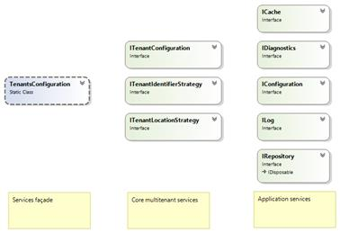
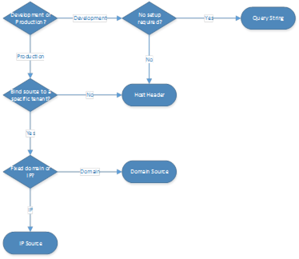
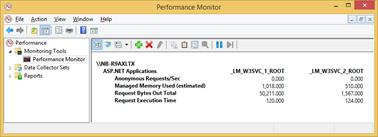
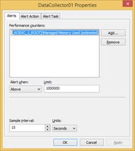

# 第 12 章综合所有

## 班级模型

我们在示例中使用的框架类有:

图 38:高级接口

以及它们的常见实现:

图 39:高级接口的典型实现

## 选择正确的租户识别策略

第 3 章中介绍的所有租户识别策略都有一些优点和缺点；有些需要一些额外的配置，有些只适用于简单的场景。一些标准包括:

*   测试一个或另一个租户的便利性
*   将租户绑定到特定源(IP 范围或域)的需要
*   易于设置

您可以使用以下决策流程:

图 40:选择租户识别策略的简单决策流程

## 选择合适的租户位置策略

选择租户位置(和注册策略)时，您需要考虑以下问题:

*   需要动态注册新租户吗？
*   注册新租户需要付出多少努力(例如，更改一些配置文件、重新编译应用程序、重新启动应用程序)？
*   租户的某些方面是否只能通过配置来配置？

在你做决定之前，你需要权衡所有这些限制。下图总结了这一点:

图 41:选择租户位置策略的简单决策流程

## 选择正确的数据访问策略

所展示的两个 API，NHibernate 和实体框架，支持所有的数据访问策略。最后，我认为决定性因素是我们想要的隔离级别:单独的数据库提供最高级别，通过鉴别器列进行数据分区提供最低级别。标准可能包括:

*   合同要求
*   SLA
*   监管要求
*   技术原因
*   需要按使用空间收费

图 42:选择数据分离策略的决策流程

至于应用编程接口本身，在实体框架的易用性方面可能会有一些好处，但这一切都归结于开发人员最清楚的一点，尽管使用 NHibernate 拥有单独的模式确实有点棘手。无论如何，使用 ORM 似乎是一个比坚持使用普通 ADO.NET 更明智的决定，因为 ORM 提供了所有额外的服务。只有当您不需要任何特定于应用编程接口的特性，并且坚持使用最小公分母时，使用通用存储库模式来抽象出数据访问应用编程接口才是一个好主意。

## 监测

即使您不使用定制的性能计数器，内置的性能计数器在监控(也许是计费)单个租户方面也提供了很好的工具。一些性能计数器可以很好地洞察租户的情况(您可以选择要独立监控的站点):

*   **ASP.NET 应用**
*   **ASP.NET 应用 4.0.30319**
*   **APP_POOL_WAS** (应用池信息)

您可以查看其中一些指标的报告，这些报告可以帮助您做出决策或作为计费依据:

图 43:报告性能计数器

当某些值超过正常阈值时，甚至可以添加要触发的警报:

图 44:添加性能计数器警报

本示例显示了一个规则，用于为每 15 秒评估一次的**ASP.NET 应用程序**计数器的**托管内存使用(估计)**度量超过 1，000，000 时的 **_LM_W3SVC_1_ROOT** 站点(**abc.com**)生成警报。

## 布局

如果您需要支持每个租户不同的布局，请确保您遵循定义页面标记的现代准则；也就是说，严格区分内容(HTML)和布局(CSS)，并使用适当的 HTML 元素来组织内容。例如，不要使用 [Table](https://developer.mozilla.org/en-US/docs/Web/HTML/Element/table) 元素来布局或分组内容，因为它不能很好地缩放，并对我们可以更改的内容施加了限制。

|  | 注: [CSS 禅苑网站](http://www.csszengarden.com/)提供了关于 CSS 力量的奇妙例子。 |