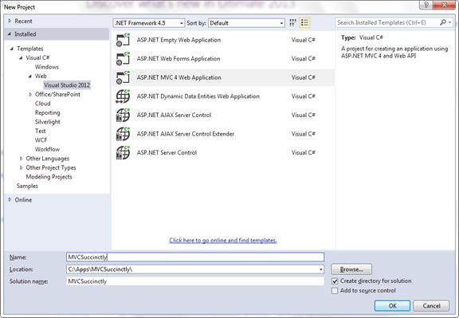
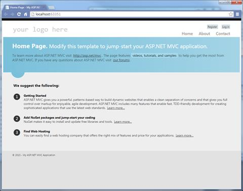
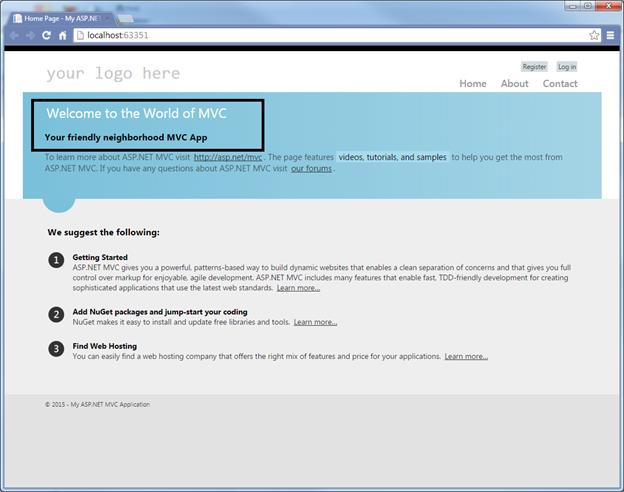

# 第二章 MVC 说你好世界

当您在 Visual Studio 中创建新的 MVC web 应用程序时，您将有一个开箱即用的功能性 web 应用程序。Visual Studio 将创建框架期望的目录结构，并将基于我们将在[第 6 章](6.html#_Chapter_6_)中探讨的模板为关键文件提供默认内容。这将不是一个有用的应用程序，但它确实有运行的所有部分。我们开始吧。

本书截图取自 Visual Studio 2013。我也在使用 2012 兼容的模板，因为我相信这给了你一个更好的模板选项细分。Visual Studio 的其他版本可能看起来有点不同。

## 我们的首次应用

在 Visual Studio 中，创建一个新的 ASP.NET MVC 4 网络应用程序，并赋予它一个有意义的名称。



图 2:创建初始应用程序

然后，您将被提示关于这个新应用的一些其他细节。

我们将使用剃刀视图引擎，所以保持该选项被选中。稍后我们将更全面地讨论视图引擎。

选择一个模板有点困难，这取决于你想做什么。在大多数情况下，你的选择可以归结为在互联网应用和内部网应用之间做出选择。

如果您选择一个空模板，您仍然可以轻松地构建互联网、内部网、移动或任何其他类型的应用程序。添加网络应用编程接口很容易，构建单页应用程序也很容易。唯一的区别是已经为你做了多少工作，以及这些工作是如何完成的。对于本书，我们将使用**互联网应用**模板。这意味着它将包括一个`AccountController`和支持视图来处理身份验证以及密码重置和更改。如果你从一个内部网应用程序开始，最终的应用程序将不包括`AccountController`，而是依赖于 Windows 身份验证来处理身份验证和授权。


图 3:选择互联网应用程序模板

所提供的模板只是:它们给你一个起点来构建。

|  | 注意:因为可测试性在 MVC 中是一件大事，所以系统也会提示您创建一个单元测试项目。如果设置好了，就可以使用单元测试工具来测试控制器中的所有业务逻辑。这是一个很好的实践，但超出了本书的范围。 |

一旦 Visual Studio 完成创建我们的初始项目，它将看起来类似于下面的截图。


图 4:新 MVC 项目的解决方案资源管理器

在这一点上，我们有一个功能性的 MVC 网络应用程序。按 F5 运行它。您应该会在您的 web 浏览器中看到类似以下内容的内容。



图 5:我们简单的应用程序在运行

|  | 注意:根据 Visual Studio 的版本和使用的框架，初始应用程序的外观可能与图 5 所示的不同。这是因为您的 Visual Studio 版本附带的选定模板的布局和样式表不同。 |

恭喜你！你有了第一个运行的 MVC 应用。现在让我们让它做一些有趣的事情。

## 介绍模型

让我们努力让这个应用变得有用。首先，我们将定义一个模型来保存我们想要显示的数据。在**解决方案浏览器**中，右键单击**模型**，然后选择**类**。我们的模型将从相当简单的开始。

```cs
    public class GreetingModel
    {
       public string Name { get; set; }
       public string Greeting { get; set; }
    }

```

代码清单 1:初始视图模型

一旦我们创建了一个模型，我们就可以改变`HomeController`的`Index`动作来使用它。`HomeController`是基于我们开始的模板在控制器文件夹中自动创建的。一旦进行了更改，您的操作应该类似于下面的代码清单。

```cs
    using System;
    using System.Collections.Generic;
    using System.Linq;
    using System.Web;
    using System.Web.Mvc;
    using MVCSuccinctly.Models;

    namespace MVCSuccinctly.Controllers
    {
        public class HomeController : Controller
        {
          public ActionResult Index()
          {
              var model = new GreetingModel
              {
                 Greeting = "Welcome to the World of MVC",
                 Name = "Your friendly neighborhood MVC App"
              };
              return View(model);
          }
        }
    }

```

代码清单 2:初始动作

|  | 注意:不要忘记在顶部添加一个 using 语句来引用 MVC success。我们放置模型的命名空间。模板会自动添加所有其他使用语句。 |

除了创建我们刚刚看到的控制器之外，模板还将创建这个控制器所需的支持视图的初始版本。我们现在需要更改视图以使用从控制器传入的模型。我们可以通过右键单击动作主体内部并从上下文菜单中选择**转到查看**来轻松导航到该视图。我们从将模型与视图相关联开始。我们在视图中添加以下代码作为第一行，它将位于**视图**下的**主页**文件夹中，并将与我们的动作同名。

```cs
    @model MVCSuccinctly.Models.GreetingModel

```

代码清单 3:指定模型的数据类型

|  | 提示:您也可以从上下文菜单中选择“添加视图”，Visual Studio 将为此控制器在“视图”文件夹中添加一个新视图，因此您无需担心将文件放在正确的位置。 |

现在，当我们在视图中引用`Model`时，它将具有我们在动作中指定的值。我们将以下代码添加到视图中。

```cs
    <hgroup class="title">
       <h2>@Model.Greeting</h2>
       <h3>@Model.Name</h3>
    </hgroup>

```

代码清单 4:初始视图

|  | 注意:@Model 是视图的一个属性，它引用从控制器传递给视图的模型。此属性基于视图顶部的@model 指令中指定的数据类型进行强类型化。@model 和@Model 看起来很相似，但它们有很大的不同。@model 只出现一次，并指定模型的数据类型。@Model 允许您引用传递给视图的模型值。 |

如果一切都如预期的那样运行，按 F5 运行应用程序应该会给我们以下信息，我们的新内容在黑盒中突出显示，我添加了一些简单的级联样式表(CSS)来突出显示差异。



图 6:我们最初的应用程序

我们的视图是使用 Razor 视图引擎编写的。视图引擎负责编写简单的 HTML 的大部分魔力。开箱即用，MVC 附带两个视图引擎，Razor 和 ASPX。ASPX 视图引擎是专门为简化从网络表单或经典 ASP 的过渡而设计的。它使用熟悉的语法。Razor 被设计成一种更精简的语法，考虑了从各代代码中吸取的经验教训以及将代码与标记合并的各种变化。Razor 和 VB.NET 一样理解 C#代码，这取决于您创建应用程序时选择的语言。因为它能理解这两种语言，所以它能自己判断代码块何时结束。没有必要终止代码块。另外，Razor 使用单个字符“@”来开始一个代码块，而不是大多数网络开发人员都熟悉的传统双字符。

## 价值替代

当我们在模型中替换属性值时，我们已经看到了一个这样的例子。值替换只是将变量、属性或方法调用的值注入标记中。你可能会经常这样做。虽然值替换仅限于单个表达式，但这仍然给了您很大的灵活性。

您可以调用一个方法:

```cs
    <span>@DateTime.Now.ToLongDateString()</span>

```

您可以访问属性:

```cs
    <h3>@Model.Name</h3>

```

您可以访问局部变量:

```cs
    <li class="@style">

```

## 代码块

虽然简单的值替换仅限于单个表达式，但代码块实际上就是代码块。您可以声明变量、评估`if`语句、循环迭代、定义自己的函数等等。

代码块如下所示:

```cs
    @{
       if (!string.IsNullOrEmpty(Model.Greeting))
       {
          <span>@Model.Greeting</span>
       }
    }

```

代码清单 5:一个基本的代码块

或者像这样:

```cs
    @{
       var style = "morningTheme";
       if (DateTime.Now.Hour > 12)
       {
          style = "eveningTheme";
       }
    }

```

代码清单 6:另一个基本代码块

|  | 注:请参考[ASP.NET MVC 4 移动网站简洁地](http://www.syncfusion.com/resources/techportal/ebooks/aspnetmvc4)了解为什么您可能希望有备用视图的示例。您放在视图中的任何逻辑都不容易测试，可测试性在 MVC 中是一件大事。此外，如果您有备用视图，则需要复制该逻辑。 |

即使我们可以把逻辑放在视图中，我们也需要限制它。一个好的经验法则是将代码块中的逻辑限制为与视图相关的逻辑。例如，您可以使用`if`语句来确定要使用的 CSS 类，或者使用循环来遍历列表中的项目，或者您可以将列表转换为`List<SelectListItem>`等。

后面的章节将显示，即使是这种逻辑也经常可以避免，从而进一步减少视图中包含的逻辑量。

## HTML 助手

HTML 助手使创建标记和生成清晰的标记变得更加容易。使用它们可以更容易地编写标记，还可以确保生成的标记具有正确的结构和良好的格式。

这些助手被定义为`HTMLHelper`类的扩展方法，使用一个就像调用一个方法一样简单。

```cs
    @Html.LabelFor(m => m.UserName)
    @Html.TextBoxFor(m => m.UserName)

```

代码清单 7:调用一个 HTML 助手

在这里，我们创建一个标签，并为传递给视图的模型中的一个属性输入一个文本框。`LabelFor`助手将使用属性名创建一个 HTML 标签标签。如果属性包含`DisplayAttribute`，将显示其值。否则，将显示属性的名称。

`TextBoxFor`助手通过使用属性名称来创建输入文本框，以生成`id`及其值作为文本框的初始值。

有许多助手可用于创建您需要的任何类型的输入:

*   `ActionLink`
*   `BeginForm`
*   `CheckBoxFor`
*   `DropDownListFor`
*   `EditorFor`
*   `HiddenFor`
*   `PasswordFor`
*   `RadioButtonFor`
*   `TextAreaFor`
*   `ValidationMessageFor`

|  | 提示:只要有可能，您应该使用一个 HTML 助手来生成您的标记。一个 HTML 助手将减少您必须创建的标记数量，确保它是标准投诉，并确保您的标记与框架的其他部分很好地工作。 |

## 布局

您可能已经注意到，在我们到目前为止的所有标记中，我们还没有包含任何添加样式表或 JavaScript 文件的细节，但是每个视图看起来仍然与其他视图相似。这种格式可能不是很明显。如果您习惯于在 ASP.NET 环境中进行 web 开发，那么您可能正在寻找母版页，如果您使用的是 ASP.NET 视图引擎，那么您仍然会使用母版页。因为我们使用的是 Razor 视图引擎，所以我们对**布局**文件很感兴趣。该文件位于**\视图\共享\ _ 布局. cshtml** 或**_ 布局. vbhtml** 。

让我们来看看这个文件的一些基础知识。在其最简单的形式中，它可能看起来像下面的代码清单。

```cs
    <!DOCTYPE html>
    <html>
       <head>
          <meta charset="utf-8"/>
          <meta name="viewport"content="width=device-width"/>
          <title>@ViewBag.Title</title>
          @Styles.Render("~/Content/css")
          @Scripts.Render("~/bundles/modernizr")
       </head>
       <body>
          @RenderBody()
          @Scripts.Render("~/bundles/jquery")
          @RenderSection("scripts", required: false)
       </body>
    </html>

```

代码清单 8:基本布局

此时我们感兴趣的关键领域是`@RenderBody`语句。这一行代码将呈现我们在这个位置的视图中的任何标记。因此，这将我们的观点置于应用程序其余部分的更大背景中。

对`Styles.Render`和`Scripts.Render`的调用也相当重要。MVC 允许我们轻松地捆绑脚本和样式表，以使页面加载更快。一个大样式表比多个小样式表下载得更快，因为需要多次调用 HTTP 来获取数据。这是一个关键的优化选项，很容易实现，并且根据您正在使用的样式表或 JavaScript 文件的数量，会有很大的影响。

|  | 注意:如果使用空模板或基本模板启动项目，可能会丢失绑定组件。要解决此问题，请从另一个项目的 App_Start 文件夹中复制 BundleConfig 文件，然后在 Global.asax:BundleConfig。RegisterBundles(BundleTable。捆绑包)； |

## 路段

最后，让我们把注意力转向`RenderSection`方法调用。在这里我们定义了一个部分，称之为`scripts`，并标记为不需要。这告诉框架在视图中寻找名为`scripts`的部分。如果找到一个，它将被渲染到调用`RenderSection`的地方，而不管它在实际视图中显示在哪里。

那么，这在视图中看起来如何？稍后我们将看到这一点，但是下面的示例提供了一个预览。

```cs
    @section scripts
    {
    <script>

       // JavaScript code here

    </script>
    }

```

代码清单 9:呈现脚本部分

部分可用于在页面的任何位置添加任何所需的附加内容，从样式表到内联资源，具有极大的灵活性。部分不限于添加样式表和 JavaScript 文件。它们也可以用来为标记指定不同的位置。例如，我们可以为导航栏、侧栏或页脚定义一个部分。这将允许布局控制页面的外观、感觉和结构，但仍然允许单个视图控制这些区域的实际内容。

## 总结

在本章中，我们已经看到，虽然有多种模板可用于创建新的 MVC 应用程序，但我们通常希望根据我们将如何处理安全性来创建互联网应用程序或内部网应用程序。我们还看到了如何使用模型将数据从控制器传递到视图。

当我们对视图进行第一次更改时，我们第一次体验到了 Razor 视图引擎，它具有简单的变量替换和代码块。我们已经看到了 Razor 如何通过布局来处理网站模板。我们还看到了如何将部分添加到布局中，以允许单个视图根据需要在布局中的特定位置添加内容。

接下来，我们将进一步探索视图引擎，并看看框架和 Razor 视图引擎，具体来说，如何为我们做更多的工作来创建一个现代的、专业的 MVC 网络应用程序。