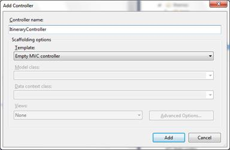
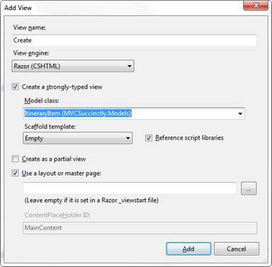
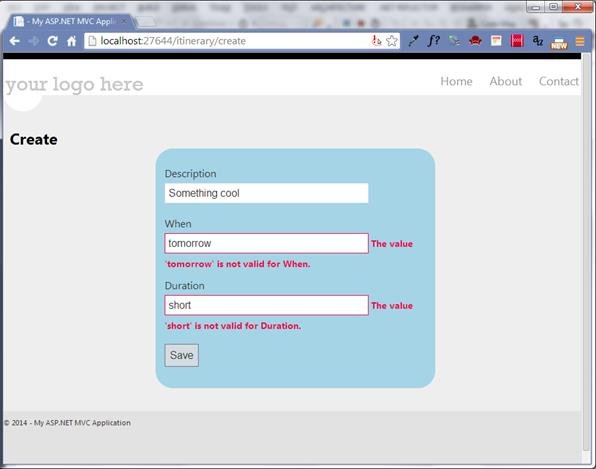
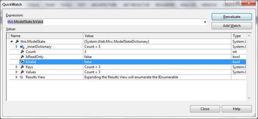
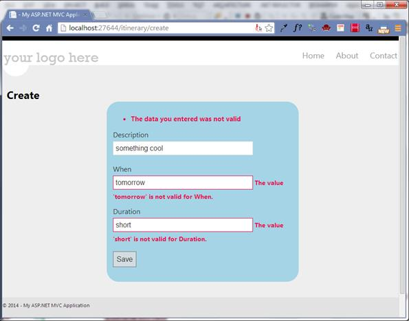
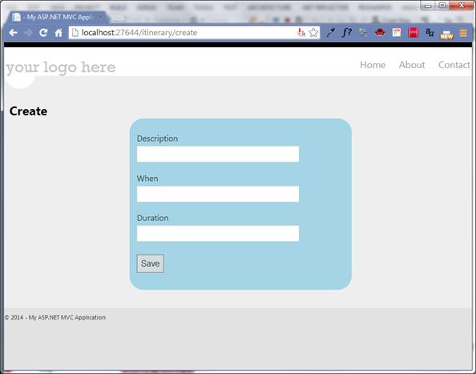
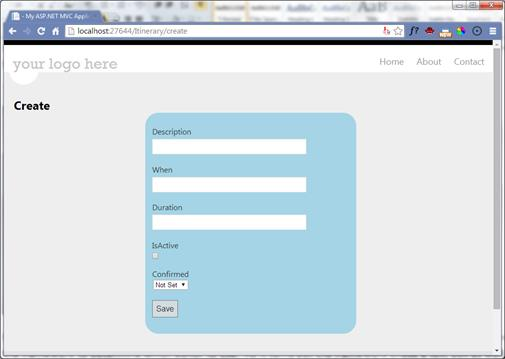
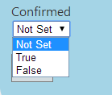
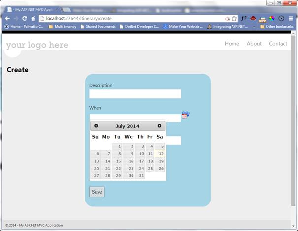
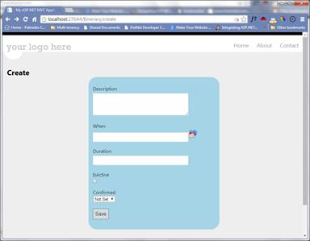

# 第三章世界向你问好

网络应用包括与用户的双向对话。这个网络应用程序会以输入控件的形式提问，用户会通过点击按钮或链接来回答。有时用户可以通过点击链接或选择下拉值来提问，MVC 会以新的视图或类似的`ActionResult`进行响应。

为了促进这种对话，我们需要一种新的模式。

```cs
    public class ItineraryItem
    {
       public DateTime? When { get; set; }
       public string Description { get; set; }
       public int? Duration { get; set; }
    }

```

代码清单 10:我们的第一个模型

我们将在这个模型的基础上进行构建，在本章的剩余部分中添加额外的特性。

## 添加控制器

既然有了这个模型，那就再增加一个新的`ItineraryController`。让我们从一个空的控制器开始。在**解决方案浏览器**中，右键单击**控制器**文件夹，然后选择**添加** > **控制器**。



图 7:添加新控制器

在`Create`动作中，我们将允许用户创建一个新的`ItineraryItem`。我们的`Create`行动会很简单。参见[代码清单 11](#CodeListing11) 。

|  | 注意:在模板下拉菜单中选择不同的值还有其他选项；您可以让框架自动为您填充更多的部分。我们将在后面探讨这些选项，但是目前，我们将使用一个空的控制器。 |

因为我们正在创建一个新的`ItineraryItem`，所以我们不需要初始化它，也不需要担心数据映射。

```cs
    using MVCSuccinctly.Models;
    namespace MVCSuccinctly.Controllers
    {
        public class ItineraryController : Controller
        {
            public ActionResult Create()
          {
             var model = new ItineraryItem();
             return View(model);
          }
       }
    }

```

代码清单 11:创建操作

## 添加视图

右键单击代码编辑器中操作定义的任意位置。在上下文菜单中，选择**添加视图**。这将打开**添加视图**窗口。



图 8:添加视图窗口

我们想要创建一个强类型视图，我们将通过从**模型类**下拉列表中选择它来指定我们刚刚创建的模型。目前，忽略脚手架模板字段；我们将在后面探讨它提供的选项。在这里，我们将坚持使用一个空模板。

我们将对视图进行几次迭代，展示不同的特性，并允许框架为我们做更多的工作。

以最简单的形式，我们的视图应该看起来像下面的代码清单。

```cs
    @model MVCSuccinctly.Models.ItineraryItem
    <h2>Create</h2>
    <div class="editor">
    @using (Html.BeginForm())
    {
       <p>
          @Html.LabelFor(m => m.Description)
          @Html.TextBoxFor(m => m.Description)
          @Html.ValidationMessageFor(m => m.Description)
       </p>
       <p>
          @Html.LabelFor(m => m.When)
          @Html.TextBoxFor(m => m.When)
          @Html.ValidationMessageFor(m => m.When)
       </p>
       <p>
          @Html.LabelFor(m => m.Duration)
          @Html.TextBoxFor(m => m.Duration)
          @Html.ValidationMessageFor(m => m.Duration)
       </p>
       <p><input type="submit" value="Save"/></p>
    }
    </div>

```

代码清单 12:行程项目的简单编辑器

有了这个标记，当我们运行应用程序时，我们的视图将如下所示。


图 9:我们的第一个输入表单

您会注意到代码示例中的一些新内容。`using`语句和你从 C#熟悉的`using`语句是一样的。这将把代码块中的标记包装在由`BeginForm` HTML 助手创建的表单元素中。如果没有参数，生成的表单元素将会回发。这是最常见的用法；但是，有一些重载允许您指定控制器、操作、POST 与 GET 方法，以及指定要添加到表单标签中的 HTML 属性。

## 模型绑定

`LabelFor`、`TextBoxFor`和`ValidationMessageFor`也是新的，它们的语法刚开始看起来可能有点奇怪。这些帮助器方法使用 lambda 表达式来指定从模型中使用哪个属性。一旦你熟悉了这个语法，你会发现它对我们有很大的帮助。通过使用助手和扩展 lambda 表达式，我们获得了出色的 IntelliSense，它向我们展示了哪些功能可用，哪些不可用。许多重构工具也会在属性被重命名时捕获并自动清理标记——如果我们简单地将属性指定为内联字符串，这是不可能的。

* * *

| Lambda 表达式是表达匿名函数的简洁方式。λ运算符`=>`可以读作“前往”。所以这个表达`m => m.When`可以理解为“m 去 m 点当”。`m`，lambda 运算符左边的值，是传递给函数的参数。在这种情况下，它将是传递给视图的模型。所以`m=>m.When`是指定模型的哪个属性起作用。 |

* * *

通过使用`TextBoxFor` HTML 帮助器，我们将获得带有必要标识的标记，以便于将值放回模型中。是的，你没看错。只要视图结构正确，框架就会将输入控件中的数据放回模型中。这是使模型绑定工作的关键。

`LabelFor`将为指定的属性生成适当的标签。我们很快就会看到，这不仅仅是简单地输出属性名。

`TextBoxFor`将输出一个文本框，从指定属性的当前值开始，并允许用户根据需要编辑该值。

`ValidationMessageFor`将输出标记，以显示与指定属性相关联的任何验证消息。现在不要担心验证消息。我们稍后将详细介绍它们。目前，视图的唯一职责是提供显示消息的位置。

现在让我们将注意力转向处理用户响应的操作。

```cs
    [HttpPost]
    public ActionResult Create(ItineraryItem data)
    {
       return View();
    }

```

代码清单 13:基本创建操作的方法签名

我们不关心您如何处理用户输入的数据；您可以将它保存在数据库、一个 XML 文件中，或者只是将其保存在内存中。这里的重点是使用 MVC 与用户进行交互；然而，在我们完成之前，这个简单的动作会变得有点复杂。

## 过滤器

[代码清单 13](#CodeListing13) 中的`HttpPost`属性就是一个过滤器的例子。该属性指示框架该操作只能作为 POST 调用，而不能作为 GET 调用。这是框架区分两个`Create`动作所必需的。如果没有它，我们会得到一个关于不明确的动作引用的错误消息。此外，如果只有一个动作，并且它有一个`HttpPost`过滤器，你会得到一个 404 错误，如果你试图用一个 get 导航到它。

* * *

| 过滤器是可以添加到控制器或控制器中的单个动作的属性。属性是我们可以与代码片段(类、方法、属性等)相关联的元数据片段。).可以在运行时通过反射检索这些元数据，并改变程序的行为方式。MVC 框架大量使用过滤器和属性。 |

* * *

当添加到控制器中时，过滤器会影响类中的每个操作。当添加到特定方法时，只有该操作会受到影响。

`HttpPost`过滤器是属性集合的一部分，旨在影响动作何时可用。这些属性包括:

*   `AjaxOnly`
*   `HttpDelete`
*   `HttpGet`
*   `HttpHead`
*   `HttpPost`
*   `HttpPut`
*   `RequireHttps`

`AjaxOnly`、`HttpGet`、`HttpPost`将是你最常使用的。由于模型绑定器的工作方式，方法签名中的差异很难确定，因此这些过滤器在帮助框架区分同名动作时非常有用。这些过滤器也有一些不错的安全含义。使用`HttpPost`进行数据修改(如创建、更新和删除)是一种很好的做法。发布数据需要提交表单，因此它可以防止用户点击电子邮件中的恶意链接并错误地更改数据。

过滤器不限于方法选择。我们还有动作过滤器，例如:

*   `Timeout`
*   `Cache`
*   `Authorize`
*   `HandleError`

过滤器提供了一种简单的方法来增加安全性、限制访问或增加性能增强，例如缓存和超时。您还可以实现一些接口，通过过滤器添加自己的任意逻辑。

## 验证

让我们回到我们的控制器，并在我们将回发到的`Create`动作中设置一个断点。运行应用，点击**保存**。点击断点，点击**保存**时，会发现数据参数有来自用户的数据。这是因为模型绑定器完成了它的工作。模型绑定器检查表单集合、查询字符串、cookies 等。，查找与模型属性名匹配的标识。模型绑定器还处理类型转换，正如我们将很快看到的，执行输入验证。

在这一点上，我们没有明确声明任何验证规则，但是框架已经基于数据类型推断出一些基本规则。因为`When`属于`DateTime`类型，任何不能转换成`DateTime`的值都将无法通过验证。我们对`Duration`进行了类似的验证。很快，我们将添加更多的验证规则。

花一些时间玩`HttpPost Create`动作。输入对模型中的数据类型无效的值。例如，当时输入“明天”表示**，当**时输入“短”表示**持续时间。点击**保存**时，返回的视图如下图所示。**



图 10:验证消息

这些消息来自我们在代码清单 10 中添加到视图中的`ValidationMessageFor`调用。验证消息的文本来自模型绑定器，严格基于数据类型。

此外，如果在单击**保存**时检查断点，您将看到没有有效值的属性将具有空值。通过在调试器中闲逛，您可能还会注意到模型状态抱怨输入不良。



图 11:显示无效模型状态的快速观察

这给了我们一个线索，关于下一步我们需要对我们的行动进行的改进。在进行任何更改之前，我们需要确保模型状态有效。我们更新的操作现在看起来像下面的代码清单。

```cs
    [HttpPost]
    public ActionResult Create(ItineraryItem data)
    {
       if (ModelState.IsValid)
       {
          // Handle saving the data only if
          // the model state is valid
       }
       else
       {
          ModelState.AddModelError("",
             "The data you entered was not valid");
       }
       return View();
    }

```

代码清单 14:检查模型是否有效的操作

除了检查模型状态之外，我们现在将自己的错误消息添加到混合中。`AddModelError`方法需要两个参数。第一个将指定消息应该显示的位置，第二个将指定要显示的消息。第一个参数应该引用模型中导致问题的属性，但是因为我们将它留空，所以我们的消息不会与任何输入控件相关联，并且在我们修改视图以包含`ValidationSummary`之前不会显示在页面上。在 **Create.cshtml** 中的“`editor`”`div`标签的顶部添加以下一行。

```cs
    @Html.ValidationSummary(true)

```

代码清单 15:向视图添加验证摘要

将`true`传递给该方法将指示框架不显示与属性相关联的错误消息。如果您有与每个属性相关联的验证消息，您将需要这样做。有了这些更改，我们的视图在提交回控制器后将如下图所示。



图 12:带有验证摘要的编辑器

如果我们将`false`传递给`ValidationSummary`，那么特定于属性的消息也会出现。在这种情况下，它们将被复制，因为它们也显示在每个属性的编辑器旁边。我们可以省略对`ValidationMessageFor`的单独调用，只依靠摘要来显示所有的验证消息，但是这样我们就会失去验证消息的上下文。

我们将在下一章更详细地探讨添加我们自己的验证。

## 编辑

现在，让我们回到视图，探索框架还能为我们做些什么来使表单更加直观。考虑这个简单的变化:

```cs
    @model MVCSuccinctly.Models.ItineraryItem
    <h2>Create</h2>
    <div class="editor">
    @using (Html.BeginForm())
    {
       @Html.ValidationSummary(true)
       <p>
          @Html.LabelFor(m => m.Description)
          @Html.EditorFor(m => m.Description)
          @Html.ValidationMessageFor(m => m.Description)
       </p>
       <p>
          @Html.LabelFor(m => m.When)
          @Html.EditorFor(m => m.When)

          @Html.ValidationMessageFor(m => m.When)
       </p>
       <p>
          @Html.LabelFor(m => m.Duration)
          @Html.EditorFor(m => m.Duration)
          @Html.ValidationMessageFor(m => m.Duration)
       </p>
       <p><input type="submit" value="Save"/></p>
    }
    </div>

```

代码清单 16:使用编辑器的编辑器

我们已经将对`TextBoxFor`的呼叫替换为对`EditorFor`的呼叫。当我们运行应用程序时，我们会看到它看起来完全一样。



图 13:编辑器的输出

那么，有什么区别呢？在我们的原始版本中，我们明确声明我们想要一个编辑器文本框。在第二个版本中，我们允许框架决定使用哪个编辑器。事实证明，框架也选择了一个文本框，但情况并非总是如此。

事实上，如果您仔细观察，您会看到当“持续时间”字段有焦点时，它会有细微的差异，如下图所示。


图 14:整数的自定义编辑器

如果你查看生成的标记，你会看到使用的文本框指定了新的 HTML 5 类型之一，只要浏览器支持`number`类型，你就会得到更聪明一点的文本框。我们得到这个新功能是因为 Duration 属性是一个整数。

```cs
    <input class="text-box single-line" data-val="true"
       data-val-number="The field Duration must be a number."    
       id="Duration" name="Duration" type="number" value="">

```

代码清单 17:带有 HTML 5 属性的输入元素

* * *

| 考虑到与属性关联的数据类型和属性，框架有自己的逻辑来确定使用哪个编辑器。这样更容易写出我们的观点。我们不必担心使用哪个编辑器；我们总是可以使用更通用的`EditorFor`并让框架来解决它。 |

* * *

考虑到这一点，让我们回到我们的模型。

我们将添加一些新的属性来展示一些基于属性类型的内置模板。让我们添加一个布尔和一个可空的布尔属性。

```cs
    public class ItineraryItem
    {
       public DateTime? When { get; set; }
       public string Description { get; set; }
       public int? Duration { get; set; }
       public bool IsActive { get; set; }
       public bool? Confirmed { get; set; }
    }

```

代码清单 18:扩展旅程项目

`IsActive`需要有一个真或假的值。`Confirmed`也将有一个真值或假值，但也无法设置。

现在，如果我们以与前面属性相同的方式将这些新属性添加到现有视图中(参见[代码清单 15](#CodeListing15) ，我们将获得如下图所示的视图。



图 15:一个运行中的布尔和可空布尔编辑器

框架知道，如果属性是布尔值，那么只有两个值——复选框是合适的编辑器。但是如果属性可以为空，那么我们有第三个选项——它切换到一个下拉菜单，其中包含“未设置”、“真”和“假”选项。在我们的应用程序中，我们不需要做任何额外的事情来获得下拉菜单。



图 16:可空布尔选项

除了 MVC 已经知道的内置模板之外，我们可以轻松地添加自己的模板。

## 基于类型的编辑器

如果有一个标准的日期编辑器就好了。要让 MVC 像对待 Booleans 一样对待`DateTime`的属性，我们所要做的就是提供一个与数据类型同名的编辑器模板。要让 MVC 知道一个编辑器模板，只需将它放入文件夹**\视图\共享\编辑器模板**。

我们最初的 **DateTime.cshtml** 应该看起来像下面的代码示例。

```cs
    @model DateTime?

    @Html.TextBox("", (Model.HasValue ? Model.Value.ToShortDateString() : string.Empty),
    new { @class = "datePicker" , @readonly = "readonly"})

```

代码清单 19:日期时间的自定义编辑器

一旦你让这个基本的编辑器工作，玩它，让它成为你自己的。你可以经常这样做。能够创建自己的编辑是一个巨大的生产力提升。您可以像我们到目前为止所做的那样保持标记的简单性，但仍然可以让结果视图如您所愿地复杂。

这将创建一个文本框。通过将第一个参数留空，我们允许框架填充它，它将使用适当的值来支持数据绑定。第二个参数指定文本框的初始值。这里，我们使用三元运算符来计算条件。如果传递给它的值被设置，我们将显示对该值调用`ToShortDateString`的结果。如果没有设置该值，我们将显示一个空字符串。我们可以很容易地显示诸如“没有输入日期”或任何其他默认值。最后一个参数是一个匿名对象，其属性将被视为文本框的 HTML 属性。在这种情况下，我们指定 CSS 类并使其成为只读的。

我会经常用一些 JavaScript 来添加一个基于类`datePicker`的 jQueryUI 日期选择器。日期很难验证。此外，用户通常很难正确输入它们。为了简化客户端的数据输入和验证，最好提供一个编辑器来帮助引导用户提供正确的输入。

```cs
    $(".datePicker").datepicker(
    {
        showOn: "button",
        gotoCurrent: true,
        showAnim: 'fold',
        buttonImage: "/Content/calendar.png",
        buttonImageOnly: true
    })

```

代码清单 20:激活日期选择器的 jQuery 代码

我们的渲染视图现在将如下图所示。



图 17:日期选择器的自定义编辑器

有了这个，任何类型的属性`DateTime`将自动获得一个不错的日期选择器作为它的编辑器。

## 基于数据类型的编辑器

我们不限于数据类型来关联适当的编辑器。我们也可以在任何属性上使用`DataType`属性来指定合适的编辑器。这个属性，以及我们感兴趣的许多其他属性，可以在`System.ComponentModel.DataAnnotations`名称空间中找到。这个属性允许我们在. NET 中的同一类型中进行区分

例如，我们可以重新定义我们的`ItineraryItem`，如下面的代码清单所示。

```cs
    public class ItineraryItem
    {
       public DateTime? When { get; set; }
       [DataType(DataType.MultilineText)]
       public string Description { get; set; }
       public int? Duration { get; set; }
       public bool IsActive { get; set; }
       public bool? Confirmed { get; set; }
    }

```

代码清单 21:强制描述支持多行文本

现在描述将呈现为文本区域，而不是文本框。



图 18:作为编辑器的文本区域

`DataTypeAttribute`提供了几个选项来指定不能从数据类型中推断出的内置模板。`DataType`枚举提供以下选项:

*   `CreditCard`:代表一个信用卡号。
*   `Currency`:代表一种货币价值。
*   `Custom`:表示自定义数据类型。
*   `Date`:表示日期值。
*   `DateTime`:表示时间上的瞬间，表示为一天中的日期和时间。
*   `Duration`:表示物体存在的连续时间。
*   `EmailAddress`:代表电子邮件地址。
*   `Html`:表示一个 HTML 文件。
*   `ImageUrl`:表示图像的网址。
*   `MultilineText`:表示多行文字。
*   `Password`:表示密码值。
*   `PhoneNumber`:代表电话号码值。
*   `PostalCode`:代表邮政编码。
*   `Text`:表示显示的文本。
*   `Time`:表示时间值。
*   `Upload`:代表文件上传数据类型。
*   `Url`:代表一个网址值。

其中大多数直接映射到为 HTML 5 定义的新文本类型，因此默认实现只适用于支持新 HTML 5 语法的浏览器。

## 基于 UIHint 的编辑器

最后，我们还有一个选项来指定编辑器模板；我们可以用一种叫做`UIHintAttribute`的东西。在这里，我们明确给出了要使用的自定义编辑器模板的名称。例如，我们可以为电话号码定义一个自定义编辑器模板，并将其与`ContactNumber`属性相关联，如下面的代码清单所示。

```cs
    public class ItineraryItem
    {
       public DateTime? When { get; set; }
       [DataType(DataType.MultilineText)]
       public string Description { get; set; }
       public int? Duration { get; set; }
       public bool IsActive { get; set; }
       public bool? Confirmed { get; set; }
       [UIHint("Phone")]
       public string ContactNumber { get; set; }
    }

```

代码清单 22:带有 UIHint 的视图模型

现在，我们可以定义一个编辑器模板， **Phone.cshtml** ，描述应该如何编辑电话号码。

```cs
    @model string

    @{
       var areaCode = string.Empty;
       var firstNumber = string.Empty;
       var secondNumber = string.Empty;
       if (Model != null)
       {
          areaCode = Model.Substring(0, 3);
          firstNumber = Model.Substring(3, 3);
          if (Model.Length >= 10)
          {
             secondNumber = Model.Substring(6, 4);
          }
       }
    }
    <input type="text" name="area_code" id="area_code"
       maxlength="3" size="3" value="@areaCode"/> -
    <input type="text" name="number1" id="number1"
       maxlength="3" size="3" value="@firstNumber"/> -
    <input type="text" name="number2" id="number2"
       maxlength="4" size="5" value="@secondNumber"/>
    <input type="hidden" name="@ViewData.TemplateInfo.HtmlFieldPrefix"
       id="@ViewData.TemplateInfo.HtmlFieldPrefix"value="@Model"/>
    
    <input type="text" name="unparsed" id="unparsed"/>
    <script type="text/javascript">
        $(document).ready(function () {
            $("#unparsed").hide();
            var edit = $("#phoneNumberEdit");
            edit.click(function () { $("#unparsed").toggle(); });
            var phone = $('#area_code, #number1, #number2');
            phone.autotab_magic().autotab_filter('numeric');

            $("#unparsed").change(function () {
               var unparsed = $("#unparsed");
               var value = unparsed.val();

                value = value.replace(/\(|\)|\s|\-/gi, '');
                value = value.replace(/[a-zA-Z]+/gi, '');
                unparsed.val(value);
                $("#area_code").val(value.substring(0, 3));
                $("#number1").val(value.substring(3, 6));
                $("#number2").val(value.substring(6, 10));
                if (value.length == 10)
                    unparsed.hide();
                var result = ($('#area_code').val()
                    + $("#number1").val()
                    + $("#number2").val());
                $("#@ViewData.TemplateInfo.HtmlFieldPrefix")
                    .val(result);
            });
            phone.blur(function () {
               var result = ($('#area_code').val()
                    + $("#number1").val()
                    + $("#number2").val());
               $("#@ViewData.TemplateInfo.HtmlFieldPrefix")
                    .val(result);
            });
        });
    </script>

```

代码清单 23:电话编辑器模板

|  | 注意:这个例子说明了这些编辑器模板是如何变得像我们需要的那样复杂的。不管模板有多复杂或简单，我们仍然通过将适当的属性与模型中的属性相关联来访问它，并且总是使用编辑器来帮助 HTML。 |

## 基于复杂类型的编辑器

将编辑器模板与数据类型相关联不限于简单类型。我们可以很容易地为任何数据类型定义新的编辑器模板，包括像我们的`ItineraryItem`这样的视图模型。

如果我们决定将当前视图的标记移动到一个编辑器模板中，我们的**巡行项目. cshtml** 看起来像下面的代码示例。

```cs
    <p>
       @Html.LabelFor(m => m.Duration)
       @Html.EditorFor(m => m.Duration)
       @Html.ValidationMessageFor(m => m.Duration)
    </p>
    <p>
       @Html.LabelFor(m => m.IsActive)
       @Html.EditorFor(m => m.IsActive)
       @Html.ValidationMessageFor(m => m.IsActive)
    </p>
    . . .
    <p>
       @Html.LabelFor(m => m.Confirmed)
       @Html.EditorFor(m => m.Confirmed)
       @Html.ValidationMessageFor(m => m.Confirmed)
    </p>

```

代码清单 24:自定义编辑器模板

我们的观点可以简化为这么简单:

```cs
    @model MVCSuccinctly.Models.ItineraryItem
    <h2>Create</h2>
    <div class="editor">
       @using (Html.BeginForm())
       {
          @Html.ValidationSummary(true)
          @Html.EditorFor(m=>m)

          <p><input type="submit" value="Save"/></p>
        }

    </div>

```

代码清单 25:使用编辑器模板

当一个特定的视图模型是另一个视图模型的属性时，这是很有用的，这使得界面组合对我们来说很容易。

## 总结

我们在这一章中讨论了很多内容，并介绍了几个概念，这些概念将在后面更详细地探讨。

我们已经看到了 HtmlHelper 函数如何协同工作来促进模型绑定。我们看到框架使用的第一个过滤器将一个动作标记为只能通过 POST 或 GET 访问。

我们还经历了一个温和的介绍，解释了如何显示验证消息。

最后，我们深入研究了 MVC 编辑器模板概念的一些细微差别。这些模板是 MVC 的一个令人兴奋的特性，它使得整合一致的输入表单变得更加容易，这些表单充满了引人入胜的功能，而不会引起任何麻烦。

在下一章中，我们将仔细研究框架中提供的验证特性。