# 六、MVC 脚手架

在[第 2 章](2.html#_Chapter_2_)中，在创建控制器和视图时，我注意到有选项可以指定脚手架模板。当时，我建议您忽略这些选项，并打算稍后再讨论。在本章中，我们将更详细地探讨这些选项。

在将控制权移交给架子工之类的人之前，了解各个部分是如何配合在一起的是有帮助的。既然我们有了这样的背景和视角，让我们来探索框架和 Visual Studio 可以为我们做些什么来简化事情。

架子工是一个代码生成器，旨在让您在编写代码时处于领先地位。当您选择架子工时，将评估与该模板关联的代码，为您提供一个起点。在许多情况下，这将处理大量更繁琐的代码。在某些情况下，模板可能会包含注释，为您在开始使用代码时需要做什么提供指导。

与大多数典型的代码生成器不同，架子工并不是代码的结尾。架子工的设计不是为了提供完整的解决方案和所有需要的代码。相反，架子工允许你从为你设计的大笔画开始，期望你能完成剩下的部分。这是“一次性的、仅代码的”代码生成，因此您不必担心丢失所做的任何代码更改。

这是 MVC 提供的最大的生产力提升之一。

## 控制器

创建新控制器时，可以在支架选项中指定模板。到目前为止，我们一直使用默认的空控制器，但也有其他内置选项可用。

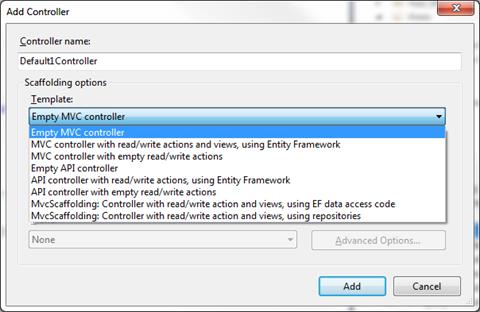

图 27:控制器脚手架选项

这些模板提供了不同程度的已经为您编写的样板代码。这是“一次性的”代码生成，可以启动您的开发。例如，如果您选择 **MvcScaffolding:具有读/写操作和视图的控制器，使用存储库**，您将拥有一个功能齐全的控制器，该控制器具有一组完整的视图，这些视图由一组架构良好的数据访问类构建而成，所有这些都无需您自己编写任何代码。

根据您的开发标准，这可能是您需要的全部。只需指定模型和存储库，剩下的就让 Visual Studio 来做。

多亏了脚手架，你不必看着一堂空课，想知道接下来会发生什么。让框架尽可能多地承担重任；你有足够的担心。

## 视图

视图的脚手架模板要简单得多。指定一个模型，然后从六个动作中选择一个。

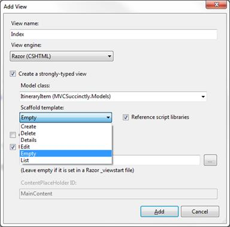

图 28:查看脚手架选项

表 3:脚手架模板选项

| 创造 | 创建视图以创建关联模型的新实例。 |
| 删除 | 创建一个视图，该视图将显示关联模型的详细信息以及删除该项目的提示。 |
| 细节 | 创建视图以显示关联模型的只读副本。 |
| 编辑 | 创建视图，用于编辑关联模型的现有实例的详细信息。 |
| 空的 | 创建一个空视图，其中没有关联模型的详细信息。 |
| 目录 | 创建一个视图，该视图包含一个表，用于显示模型项列表的详细信息。 |

你会得到一些体面的加价。

```cs
    <h2>Create</h2>

    @using (Html.BeginForm())
    {
       @Html.AntiForgeryToken()
       @Html.ValidationSummary(true)

       <fieldset>
          <legend>ItineraryItem</legend>

          <div class="editor-label">
             @Html.LabelFor(model => model.When)
          </div>
          <div class="editor-field">
             @Html.EditorFor(model => model.When)
             @Html.ValidationMessageFor(model => model.When)
          </div>

          <div class="editor-label">
             @Html.LabelFor(model => model.Description)
          </div>
          <div class="editor-field">
             @Html.EditorFor(model => model.Description)
             @Html.ValidationMessageFor(model => model.Description)
          </div>

          <div class="editor-label">
             @Html.LabelFor(model => model.Duration)
          </div>
          <div class="editor-field">
             @Html.EditorFor(model => model.Duration)
             @Html.ValidationMessageFor(model => model.Duration)
          </div>

          <div class="editor-label">
             @Html.LabelFor(model => model.IsActive)
          </div>
          <div class="editor-field">
             @Html.EditorFor(model => model.IsActive)
             @Html.ValidationMessageFor(model => model.IsActive)
          </div>

          <div class="editor-label">
             @Html.LabelFor(model => model.Confirmed)
          </div>
          <div class="editor-field">
             @Html.EditorFor(model => model.Confirmed)
             @Html.ValidationMessageFor(model => model.Confirmed)
          </div>

          <div class="editor-label">
             @Html.LabelFor(model => model.ContactNumber)
          </div>
          <div class="editor-field">
             @Html.EditorFor(model => model.ContactNumber)
             @Html.ValidationMessageFor(model => model.ContactNumber)
          </div>

          <p>
              <input type="submit" value="Create"/>
          </p>
       </fieldset>
    }

       <div>
          @Html.ActionLink("Back to List", "Index")
       </div>

    @section Scripts {
       @Scripts.Render("~/bundles/jqueryval")
    }

```

代码清单 46:生成的编辑器

在大多数情况下，除了对控件进行重新排序之外，您应该能够在不更改生成的标记中的任何内容的情况下获得所需的外观。请记住，从我们之前的讨论来看，`EditorFor` HTML 帮助器在找到正确的编辑器方面非常复杂。

无论视图是由控制器支架还是视图支架创建的，您都将获得相同的标记。但是如果您不喜欢这个标记或者为控制器生成的代码呢？还有其他选择吗？

## 进入文本模板转换工具包

脚手架模板生成的代码使用文本模板转换工具包，或 T4。T4 是保守得最好的秘密之一。NET 开发。

这是一个用于创建代码生成器的工具包，无论生成的代码是什么语言。事实上，称它为代码生成器是在卖空。我们可以使用 T4 生成任何基于文本的输出。T4 通过我们指定的模板转换元数据，以生成适当的输出。该元数据可以从以下任何场景中输入:

*   C#代码
*   VB.NET 法典
*   SQL 代码
*   超文本标记语言
*   剃刀
*   更改日志

我们可以用任何。NET 语言，通常是 C#或 VB.NET。我们的示例都将使用 C#。

因为脚手架模板基于 T4，我们可以编辑这些模板来更改生成的代码。您可能希望这样做来创建一个基于 NHibernate 而不是实体框架的控制器模板，或者您可能希望创建一个不使用表来显示列表的列表视图模板。可能性只受你想象力的限制。

对 T4 的全面讨论超出了本书的范围，但我们不需要 T4 的全部能力。总的来说，我们的变化会很小。

首先，我们需要找到脚手架使用的模板，这样我们就可以编辑它们来做我们需要的事情。这些模板与您安装的 Visual Studio 一起存储。因此，完整路径取决于您运行的是 32 位还是 64 位、您的 Visual Studio 版本、您希望最终使用的语言以及您使用的视图引擎。要查找 Visual Studio 2013 的 32 位版本使用 Razor 为 C#使用的模板，请查看:

c:\程序文件(x86)\ Microsoft Visual Studio 12.0 \ common 7 \ IDE \ item templates \ CSharp \ Web \ MVC 4 \ CodeTemplates \ AddView \ CSHTML

和

c:\程序文件(x86)\ Microsoft Visual Studio 12.0 \ common 7 \ IDE \ item templates \ CSharp \ Web \ MVC 4 \ code templates \ add controller

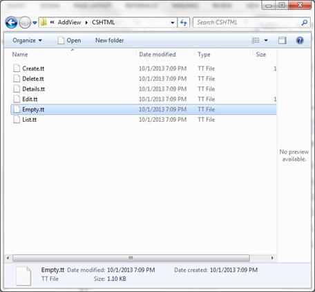

图 29:视图模板位置

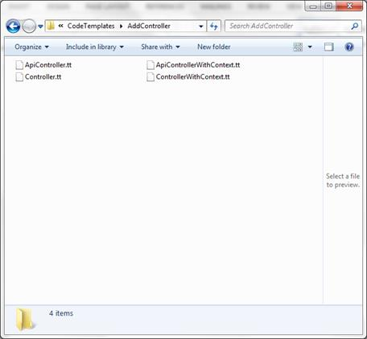

图 30:控制器模板位置

先看 **Empty.tt** 。这将是最简单的模板，因为它实际上创建了一个空壳，而不考虑与模型相关的元数据。

默认情况下，当您在 Visual Studio 中打开一个. tt 文件时，它看起来有点粗糙，没有语法高亮显示。通过 Visual Studio 2015 的社区预览可以看出这一点。

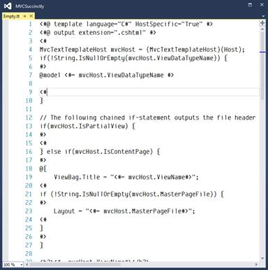

图 31:编辑没有扩展名的模板

语法突出显示总是好的，但是对于代码生成器来说更重要——尤其是如果用于驱动生成的语言与将要生成的语言相同的话。如果您使用 C#生成 C#，则很难将模板代码与生成的代码分开。

我们也缺少现成的智能感知支持。这可能是一个巨大的障碍。智能感知大大提高了生产力。如果缺失，我们都会感受到影响。最后，开箱即用，不支持调试模板。这在最初可能不是什么大问题，但是最终你的模板可能会变得足够复杂，以至于你需要这个类型特性。

幸运的是，有几个扩展可以填补这个空白。

下面的截图和讨论基于有形的 T4 扩展。

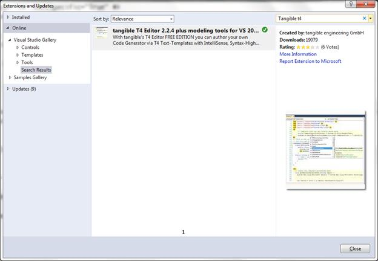

图 32:有形的 T4 扩展

这将添加一些非常需要的语法突出显示和智能感知支持。

|  | 注意:有形扩展是我使用的扩展。还有其他可用的，所以值得四处看看。有形有免费社区版和付费专业版。如果你打算和 T4 一起做任何专业的事情，专业版是值得投资的。 |

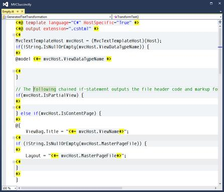

图 33:使用扩展进行编辑

通过语法高亮显示，文件的结构变得更容易导航和理解。

前两行是 T4 指令，规定了生成文件的语言和文件扩展名。如果您在之前的任何项目中使用过 ASPX 文件，T4 语法很有可能会立即对您有意义。基本标签如下:

*   `<#=` `#>`指定变量替换。
*   `<#` `#>`划一个码块。
*   `<#@` `assembly name = “” #>`定义 T4 代码使用的引用程序集。
*   `<#@` `import namespace = “” #>`定义了一个被引用的命名空间，您的 T4 代码将使用它。

有形编辑器也给了我们一个新的菜单，可以选择**折叠所有 T4** 。

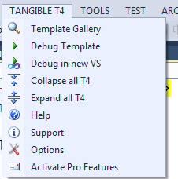

图 34:有形的 T4 菜单

这将折叠所有的 T4 代码块，只留下生成的代码。这使得更容易看到输出的样子。


图 35:带有 T4 代码的空. tt 折叠

研究生成的代码在模板中的外观。将此与生成的代码进行比较。在这一点上，我们并不真正关心用来驱动一代人的 T4 代码。我们对最终产品更感兴趣。

## 编辑. tt

让我们进入 **Edit.tt** 文件。这个模板更有趣，因为它在指定模型的属性中循环。最简单的改变是给生成的输出添加注释。让我们从简单地添加一个注释开始，给开发人员一点关于下一步需要做什么的指导。

我们的模板现在应该如下图所示。

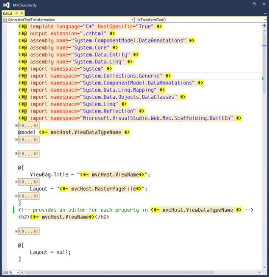

图 36:我们更新的编辑器模板

一旦我们创建了一个新的`Edit`视图，我们就可以看到这个简单变化的结果。

```cs
    @model MVCSuccinctly.Models.ItineraryItem

    @{
        ViewBag.Title = "Edit";
    }
    <!-- provides an Editor for each property in MVCSuccinctly.Models.ItineraryItem -->
    <h2>Create3</h2>

    @using (Html.BeginForm()) {
       @Html.AntiForgeryToken()
       @Html.ValidationSummary(true)

       <fieldset>
          <legend>ItineraryItem</legend>

          @Html.HiddenFor(model => model.Id)

          <div class="editor-label">
             @Html.LabelFor(model => model.When)
          </div>
          <div class="editor-field">
             @Html.EditorFor(model => model.When)
             @Html.ValidationMessageFor(model => model.When)
          </div>

```

代码清单 47:用我们的新注释生成的代码

现在让我们来看看更有趣的东西。假设您的样式想要将一个标签、输入控件组合组合成一个单元，并且能够每行显示两个。为了支持这一点，让我们将两者包装在一个`div`标签中。

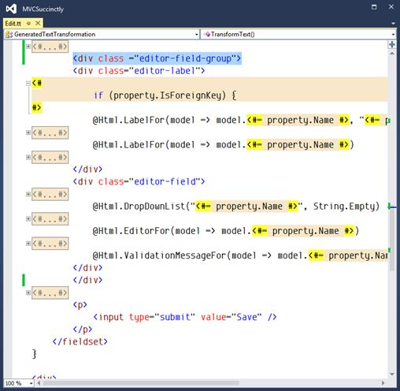

图 37:我们的编辑器，更新后支持两列布局

在这里，我们添加了一个新的`div`标签，它包装了标签和输入控件。现在，当我们创建一个新视图时，我们会得到以下结果:

```cs
    @using (Html.BeginForm()) {
    @Html.AntiForgeryToken()
    @Html.ValidationSummary(true)

    <fieldset>
    <legend>ItineraryItem</legend>

       @Html.HiddenFor(model => model.Id)

       <div class="editor-field-group">
          <div class="editor-label">
             @Html.LabelFor(model => model.When)
          </div>
          <div class="editor-field">
             @Html.EditorFor(model => model.When)
             @Html.ValidationMessageFor(model => model.When)
          </div>
       </div>
       <div class="editor-field-group">
          <div class="editor-label">
             @Html.LabelFor(model => model.Description)
          </div>
          <div class="editor-field">
             @Html.EditorFor(model => model.Description)
             @Html.ValidationMessageFor(model => model.Description)
          </div>
       </div>
       <div class="editor-field-group">
          <div class="editor-label">
             @Html.LabelFor(model => model.Duration)
          </div>
         <div class="editor-field">
             @Html.EditorFor(model => model.Duration)
             @Html.ValidationMessageFor(model => model.Duration)
         </div>
       </div>
       <div class="editor-field-group">
          <div class="editor-label">
             @Html.LabelFor(model => model.IsActive)
          </div>
          <div class="editor-field">
             @Html.EditorFor(model => model.IsActive)
             @Html.ValidationMessageFor(model => model.IsActive)
          </div>
       </div>
       <div class="editor-field-group">
          <div class="editor-label">
             @Html.LabelFor(model => model.Confirmed)
          </div>
          <div class="editor-field">
             @Html.EditorFor(model => model.Confirmed)
             @Html.ValidationMessageFor(model => model.Confirmed)
          </div>
       </div>
       <div class="editor-field-group">
          <div class="editor-label">
             @Html.LabelFor(model => model.ContactNumber)
          </div>
          <div class="editor-field">
             @Html.EditorFor(model => model.ContactNumber)
             @Html.ValidationMessageFor(model => model.ContactNumber)
          </div>
       </div>
       <p>
          <input type="submit" value="Save"/>
       </p>
    </fieldset>

```

代码清单 48:支持两列的生成器输出

我在[代码清单 48](#CodeListing48) 中用粗体标注了我的更改，以便更容易看到我对原始文件的更改。

## 添加我们自己的 T4 代码

继续我们已经构建的示例，让我们创建一个完全自定义的文件。让我们修改生成的标记，以便在两列显示中的列之间进行区分。我们将跟踪输入控件是在第一列还是第二列。

这个人为的例子将允许我们定义一些条件逻辑，在那里我们确定这是偶数还是奇数输入控制集。

为了支持这一点，我们将添加两个新的样式表类-`even`和`odd`，它们将被添加到`editor-field-group`标签中。

为了确定向我们的每个`editor-field-group`添加哪个类，我们需要跟踪到目前为止我们已经添加了多少个输入控件。如果这个计数是偶数，那么我们将添加类`even`。如果是奇数，那么我们将添加类`odd`。我们更新的模板现在应该如下所示。

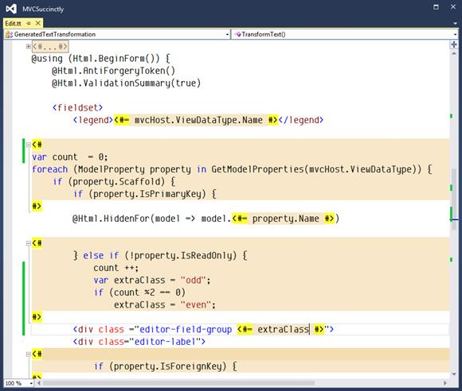

图 38:没有添加我们的逻辑的更新模板

|  | 注意:有许多方法可以使用 T4 技术来帮助为本节中强调的场景提供解决方案。我在这里选择的道路只是其中之一。我鼓励你去试验和发展其他人来满足你的任何需求，并满足你的项目可能有的任何要求。 |

生成的代码如下所示。

```cs
    @using (Html.BeginForm()) {
    @Html.AntiForgeryToken()
    @Html.ValidationSummary(true)

    <fieldset>
       <legend>ItineraryItem</legend>

       @Html.HiddenFor(model => model.Id)

       <div class="editor-field-group odd">
          <div class="editor-label">
             @Html.LabelFor(model => model.When)
          </div>
          <div class="editor-field">
             @Html.EditorFor(model => model.When)
             @Html.ValidationMessageFor(model => model.When)
          </div>
       </div>
       <div class="editor-field-group even">
          <div class="editor-label">
             @Html.LabelFor(model => model.Description)
          </div>
          <div class="editor-field">
             @Html.EditorFor(model => model.Description)
             @Html.ValidationMessageFor(model => model.Description)
          </div>
       </div>
       <div class="editor-field-group odd">
          <div class="editor-label">
             @Html.LabelFor(model => model.Duration)
          </div>
          <div class="editor-field">
             @Html.EditorFor(model => model.Duration)
             @Html.ValidationMessageFor(model => model.Duration)
          </div>
       </div>
       <div class="editor-field-group even">
          <div class="editor-label">
             @Html.LabelFor(model => model.IsActive)
          </div>
          <div class="editor-field">
             @Html.EditorFor(model => model.IsActive)
             @Html.ValidationMessageFor(model => model.IsActive)
          </div>
       </div>
       <div class="editor-field-group odd">
          <div class="editor-label">
             @Html.LabelFor(model => model.Confirmed)
          </div>
          <div class="editor-field">
             @Html.EditorFor(model => model.Confirmed)
             @Html.ValidationMessageFor(model => model.Confirmed)
          </div>
    </div>
    <div class="editor-field-group even">
         <div class="editor-label">
             @Html.LabelFor(model => model.ContactNumber)
         </div>
         <div class="editor-field">
            @Html.EditorFor(model S=> model.ContactNumber)
            @Html.ValidationMessageFor(model => model.ContactNumber)
         </div>
       </div>
       <p>
          <input type="submit" value="Save"/>
       </p>
    </fieldset>
    }

```

代码清单 49:更新生成的代码的输出，以支持偶数和奇数列

凭借一点创造力和耐心，T4 打开了许多可能性。我们已经在这里介绍了几个人为的例子，但是你有很大的权力。

## 总结

在本章中，我们已经看到了 Visual Studio 如何为控制器和视图编写大量代码。脚手架包括内置模板，这些模板可以自动添加大部分代码，这些代码需要一个具有相关视图的全功能控制器来支持基本的创建、读取、更新和删除操作。

我们还看到了如何通过更改相关的 T4 模板来扩展内置模板。更改可以是简单地在生成的代码中包含注释，或者对 T4 代码进行复杂的添加。