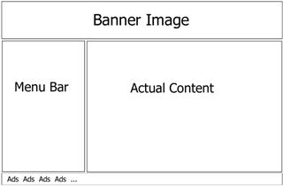
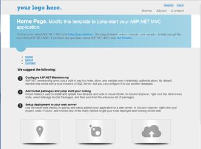
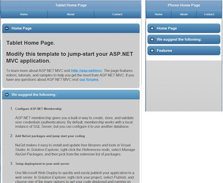

# 三、设计移动友好网站

“妈妈总是说生活就像一盒巧克力。你永远不知道你会得到什么。”
阿甘在*阿甘在*

设计移动网站是当今的一个大话题。你参加的每个会议都有几个关于这个主题的会议，并且有大量关于这个主题的书籍。有那么多噪音，很难知道该听谁的。

有些人说，你需要使用一个专用的移动网站和一个单独的桌面网站。这有时被称为“mdot”策略，因为许多网站在其移动 URL 的前面放了一个“m”。然而，这种策略会导致一个问题，因为你最终会得到两个(或者三个！)您必须维护的不同站点，每个站点都有重复的内容和 web 配置。

其他网站依赖于通常所说的响应性网页设计。理论是，如果你用合适的样式表设计你的网站，你将能够有一个网站和一个网址，它将适应许多屏幕尺寸，放大或缩小尺寸，移动列，并使它在各种不同的尺寸上看起来很好。这个策略的一个失败之处是页面膨胀。即使你有一个较小的屏幕，内容不太明显，但你通常不会有较少的内容。不太可见的内容不等于下载的字节数少。手机具有数据上限和较低的下载速度，因此使用这种策略不是移动设备的最佳设计。

如果你使用响应式设计策略设计网站，你需要决定是以移动设计开始作为你的偏好，然后随着屏幕变大进行渐进式增强，还是以桌面设计开始，然后进行优雅的降级。这两种方法都有一些严重的问题。

如果你能创建一个从这两种策略中各取所需的网站呢？比起依赖响应性网页设计策略，我更喜欢使用我称之为“自适应视图设计”的模式通过使用本书中的自适应视图设计模式，您可以在项目中拥有这两种策略中最好的一部分。

## 桌面布局对比移动布局

在我们进入实际代码之前，在设计移动布局时，有几个设计概念需要理解。当您将桌面屏幕与小型手机屏幕进行比较时，会有一些明显的差异，当您为平板电脑等中型屏幕进行设计时，有些差异就不那么明显了。

### 多柱与单柱设计

当您设计典型的桌面网站时，您倾向于使用多列布局，其中三列布局是最常见的方法。这样的布局利用横幅图像、菜单栏、广告来吸引你的注意力，等等。，像这样:

桌面布局

布局移动网站时，更好的方法是设计单列布局。仅使用一列就可以轻松地在不同尺寸的设备之间进行缩放，并且可以轻松地在纵向和横向模式之间切换。考虑大多数电话应用程序的布局:

电话布局

另一方面，平板电脑倾向于两种方法都有一点。平板电脑倾向于采用手机常见的一列布局，但当旋转到横向模式时，它会切换到两列布局，并且偶尔会使用三列布局。

平板电脑布局

每种设计都有不同的方法，假设我们可以创建一个在所有这三种外形中都能很好工作的页面是错误的。改变的也不仅仅是布局；还有其他考虑。

### 敲击与悬停和点击

另一个需要考虑的问题是，在桌面上，人们习惯于点击小的文本链接来进入下一页，而鼠标是一个非常精确的工具。在移动设备上，人们正在用手指和拇指轻敲，当你试图这样做时，一个小的文本链接实际上不起作用。您的移动友好型设计需要尽可能包含更大的按钮和图标，并使用链接，让您点击整行的任何地方来激活选择，而不仅仅是包含链接的实际单词。

此外，在许多桌面应用程序和网站上，开发人员倾向于使用隐藏的信息，直到指针悬停在对象上。这一概念根本不存在于手机或平板电脑等基于触摸的输入设备上。

### 大屏幕和可折叠集装箱

除了缩减设计中的列数，您还需要考虑内容容器本身。在桌面上有大量的不动产，因此在许多视觉上不同的容器中尽可能多地扩展和显示数据是有意义的。在移动设备的小屏幕上，您希望显示最少量的有意义的数据，然后让用户决定下一步显示什么，在平板电脑上，它介于两者之间。对于这个范例来说，最明智的选择之一是可折叠容器。以下三个截图是完全相同的网址，内容也完全相同，但每个截图都是针对其目标平台进行组织和优化的。

桌面视图

在这个例子中，桌面显示了所有的内容，并且它被组织成具有适当样式的漂亮容器。

平板电脑和手机视图

平板电脑视图显示相同的内容，但它被放置在标题中带有减号的容器中，如果您愿意，可以折叠它们。电话视图使用相同的容器，但从折叠的所有内容开始，这样您就可以轻松地扫描文档中您感兴趣的内容。

* * *

在[第 8 章](08.html#heading_id_52)中，我们将了解一种模式，我们可以使用这种模式，您可以有三个不同的布局，但是在每个布局中重用相同的内容，这样您就不会有重复的内容。我们还将在[第 8 章](08.html#heading_id_53)和[第 9 章](09.html#heading_id_61)中更详细地了解可折叠集装箱。

* * *

## 桌面！=平板！=电话

希望这一章能让你稍微思考一下构建移动网站时需要解决的不同设计范式。好的桌面设计和好的平板设计不一样，好的手机设计也不一样。这里的关键是尝试优化设计以匹配请求内容的设备，同时不必在多个站点和文件中维护重复的内容。

说到设计网站，阿甘是对的——我们并不真正知道我们会得到什么。我们可能认为我们知道应该如何设计我们的网站，但是在我们知道之前，一个新的设备将会出现并给我们带来惊喜。就像有人曾经说过的:“如果你做一些白痴证明，他们只会做一个更好的白痴。”