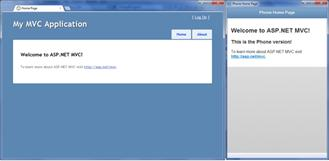

# 第十一章还在用 MVC 3？

“我要吃她吃的！”
哈利遇见莎莉时的匿名顾客

有很多项目是用 MVC 3 开发的，如果你还在用 MVC 3 工作，你现在可能会觉得有点被冷落了，想要一些其他人都有的东西。别担心——你可以使用现有的 MVC 3 技术实现同样的移动友好的效果，并在没有大的中断的情况下将自己定位到 MVC 4。

## 减速带:MVC 3 和 MVC 4 并列

你可以很容易地在 MVC 3 旁边安装 MVC 4，打破任何东西都不是*假设的*。然而，有一个小减速带，你可能会遇到。

安装 MVC 4 后，它会在**C:\ Program Files(x86)\ Microsoft ASP 中为您的系统安装它的新文件。. NET\ASP。NET MVC 4** 文件夹，所以它确实将新的 MVC 文件与它旁边的 ASP.NET MVC 3 文件夹分开。但是，它也会在**ASP.NET 网页**文件夹内 **v1.0** 文件夹旁安装一个新的 **v2.0** 文件夹:**C:\ Program Files(x86)\ Microsoft ASP。. NET\ASP。NET 网页\v2.0** 。

这个文件夹恰好包含了一些 MVC 3 使用的同名但不同版本的文件。

当您在安装 MVC 4 后返回并构建现有的 MVC 3 项目时，您可能会得到以下编译错误:

```cs
      c:\Windows\Microsoft.NET\Framework\v4.0.30319\Microsoft.Common.targets(1360,9): warning MSB3247: Found conflicts between different versions of the same dependent assembly.

```

如果你仔细研究一下，你会发现你的 MVC 3 项目引用了**系统。网页**和**系统。网络助手**dll，但没有指定版本。最快的解决方法是在记事本中打开您的项目文件，并进行一些快速编辑，将所有内容放回正确的位置，您的项目将再次正常工作。

之前的项目定义文件:(*)。csproj)

```cs
      <Reference Include="System.Web.WebPages">
        <Private>True</Private>
      </Reference>
      <Reference Include="System.Web.Helpers">

```

项目定义文件在:(*)之后。csproj)

```cs
      <Reference Include="System.Web.WebPages, Version=1.0.0.0, Culture=neutral,
        PublicKeyToken=31bf3856ad364e35, processorArchitecture=MSIL">
        <SpecificVersion>True</SpecificVersion>
      </Reference>
      <Reference Include="System.Web.Helpers, Version=1.0.0.0, Culture=neutral,
        PublicKeyToken=31bf3856ad364e35, processorArchitecture=MSIL">
        <Private>True</Private>
      </Reference>

```

一旦你修复了这个小错误，你应该能够再次正常运行你的 MVC 3 项目，并且一切都并行工作。但是，您必须将此修复应用于您打开的每个 MVC 3 项目。

## 回到 MVC 3 项目

让我们回到我们手头的主题:如何将您的 MVC 3 项目转换为使用我们在花哨的新 MVC 4 项目中使用的移动友好技术？事实证明，在 MVC 3 中，我们不需要添加太多东西来实现这一点。

首先要做的是安装 jQuery。使用 NuGet 的移动包，就像我们在 MVC 4 中做的那样。使用**包管理器控制台**命令行，运行命令**安装-包 jQuery。移动**。

由于`DisplayModeProvider`代码是 MVC 4 中的新特性，我们将不得不在我们的 MVC 3 项目中复制该功能。在项目的根目录下，创建一个名为**mobilecapablerazoverwingine . cs**的新类文件，并将以下代码放入该类中:

```cs
      using System;
      using System.IO;
      using System.Web;
      using System.Web.Mvc;

      namespace YourApplicationNameSpace
      {
        // In Global.asax.cs Application_Start you can insert these
        // into the ViewEngine chain like so:
        //
        // ViewEngines.Engines.Insert(0, new
        //   MobileCapableRazorViewEngine());
        //
        // or
        //
        // ViewEngines.Engines.Insert(0,
        //  new MobileCapableRazorViewEngine("iPhone")
        //  {
        //    ContextCondition = (ctx =>
        //     ctx.Request.UserAgent.IndexOf(
        //      "iPhone", StringComparison.OrdinalIgnoreCase) >= 0)
        //  });

        public class MobileCapableRazorViewEngine : RazorViewEngine
        {
          public string ViewModifier { get; set; }
          public Func<HttpContextBase, bool> ContextCondition
            { get; set; }

          public MobileCapableRazorViewEngine()
            : this("Mobile", context =>
              context.Request.Browser.IsMobileDevice)
          {
          }

          public MobileCapableRazorViewEngine(string viewModifier)
            : this(viewModifier,
              context => context.Request.Browser.IsMobileDevice)
          {
          }

          public MobileCapableRazorViewEngine(string viewModifier,
            Func<HttpContextBase, bool> contextCondition)
          {
            this.ViewModifier = viewModifier;
            this.ContextCondition = contextCondition;
          }

          public override ViewEngineResult FindView(
           ControllerContext controllerContext,
           string viewName, string masterName, bool useCache)
          {
            return NewFindView(controllerContext, viewName, 
              null, useCache, false);
          }

          public override ViewEngineResult FindPartialView(
            ControllerContext controllerContext,
            string partialViewName, bool useCache)
          {
            return NewFindView(controllerContext, partialViewName,
              null, useCache, true);
          }

          private ViewEngineResult NewFindView(
            ControllerContext controllerContext,
            string viewName, string masterName, bool useCache,
            bool isPartialView)
          {
            if (!ContextCondition(controllerContext.HttpContext))
            {
              // We found nothing and we pretend we looked nowhere.
              return new ViewEngineResult(new string[] { });
            }

            // Get the name of the controller from the path.
            string controller = controllerContext.RouteData
              .Values["controller"].ToString();
            string area = "";
            try
            {
              area = controllerContext.RouteData.DataTokens["area"]
               .ToString();
            }
            catch
            {
            }

            // Apply the view modifier.
            var newViewName = string.Format("{0}.{1}", viewName,
              ViewModifier);

            // Create the key for caching purposes.         
            string keyPath = Path.Combine(area, controller,
              newViewName);

            string cacheLocation =
              ViewLocationCache
                .GetViewLocation(controllerContext.HttpContext,
                keyPath);

            // Try the cache.         
            if (useCache)
            {
              //If using the cache, check to see if the location
              //is cached.                             
              if (!string.IsNullOrWhiteSpace(cacheLocation))
              {
                if (isPartialView)
                {
                  return new ViewEngineResult(CreatePartialView(
                    controllerContext, cacheLocation), this);
                }
                else
                {
                  return new ViewEngineResult(
                    CreateView(controllerContext, cacheLocation,
                     masterName),
                      this);
                }
              }
            }
            string[] locationFormats = string.IsNullOrEmpty(area) ?
              ViewLocationFormats : AreaViewLocationFormats;

            // For each of the paths defined, format the string and
            // see if that path exists. When found, cache it.         
            foreach (string rootPath in locationFormats)
            {
              string currentPath = string.IsNullOrEmpty(area)
                ? string.Format(rootPath, newViewName, controller)
                : string.Format(rootPath, newViewName, controller,
                  area);
              if (FileExists(controllerContext, currentPath))
              {
                ViewLocationCache.InsertViewLocation(
                  controllerContext.HttpContext,
                  keyPath, currentPath);
                if (isPartialView)
                {
                  return new ViewEngineResult(CreatePartialView(
                    controllerContext, currentPath), this);
                }
                else
                {
                  return new ViewEngineResult(CreateView(
                    controllerContext, currentPath, masterName),
                      this);
                }
              }
            }
            // We found nothing and we pretend we looked nowhere.
            return new ViewEngineResult(new string[] { });
          }
        }
      }

```

通过运行以下命令，可以在 NuGet 上获得此代码:

```cs
      PM> Install-Package MobileViewEngines

```

如果你安装了 NuGet 包，它不会自动将代码包含在你的项目中，但是代码会在你的项目旁边的 **Packages** 文件夹中，所以你可以从那里复制它。

* * *

斯科特·汉斯曼(Scott Hanselman)和彼得·摩尔菲尔德(Peter Mourfield)为这段代码赢得了赞誉，前者在博客中介绍了这种移动视图方法 <sup>[5](MVC4_0016.htm#heading_id_82)</sup> ，后者贡献了这段版本的移动视图引擎代码！

* * *

现在您已经有了可以使用的视图引擎，编辑 **Global.asax.cs** 文件并用下面的代码更新`Application_Start`函数(它看起来与我们为 MVC 4 所做的非常相似！):

```cs
      protected void Application_Start()
      {
        AreaRegistration.RegisterAllAreas();
        RegisterGlobalFilters(GlobalFilters.Filters);
        RegisterRoutes(RouteTable.Routes);

        ViewEngines.Engines.Insert(0,
        new MobileCapableRazorViewEngine("Phone")
        {
          ContextCondition = (ctx =>
            ctx.Request.UserAgent.IndexOf("iPhone",
                StringComparison.OrdinalIgnoreCase) >= 0 ||
            ctx.Request.UserAgent.IndexOf("iPod",
                StringComparison.OrdinalIgnoreCase) >= 0 ||
            ctx.Request.UserAgent.IndexOf("Droid",
                StringComparison.OrdinalIgnoreCase) >= 0 ||
            ctx.Request.UserAgent.IndexOf("Blackberry",
                StringComparison.OrdinalIgnoreCase) >= 0 ||
            ctx.Request.UserAgent.StartsWith("Blackberry",
                StringComparison.OrdinalIgnoreCase))
        });
        ViewEngines.Engines.Insert(0,
        new MobileCapableRazorViewEngine("Tablet")
        {
          ContextCondition = (ctx =>
            ctx.Request.UserAgent.IndexOf("iPad",
                StringComparison.OrdinalIgnoreCase) >= 0 ||
            ctx.Request.UserAgent.IndexOf("Playbook",
                StringComparison.OrdinalIgnoreCase) >= 0 ||
            ctx.Request.UserAgent.IndexOf("Transformer",
                StringComparison.OrdinalIgnoreCase) >= 0 ||
            ctx.Request.UserAgent.IndexOf("Xoom",
                StringComparison.OrdinalIgnoreCase) >= 0)
        });
      }

```

就是这样——您现在有了一个代码库，它在功能上几乎等同于我们使用 MVC 4 移动功能和`DisplayModeProvider`创建的代码库。有一些不同之处，但是您应该能够开始使用这个代码库创建一个非常移动友好的网站。jQuery。移动功能应该都一样，大部分布局文件也应该一样。有一些类似捆绑技术的东西在 MVC 3 中不可用，所以您必须在布局文件中列出您的每个样式表和 JavaScript 文件(或者自己缩小并连接它们)。

下图是一个 MVC 3 应用程序的示例，其中包含布局页面代码的屏幕截图、生成的熟悉的蓝色选项卡式桌面默认布局的屏幕截图，以及标题更改为**电话主页**的更新后的电话布局。




具有桌面和电话布局的 MVC 3 应用程序

当您将这种技术与您在本书前面所学的内容相结合时，您应该能够开始让您的 MVC 3 应用程序几乎像 MVC 4 应用程序一样对移动友好！