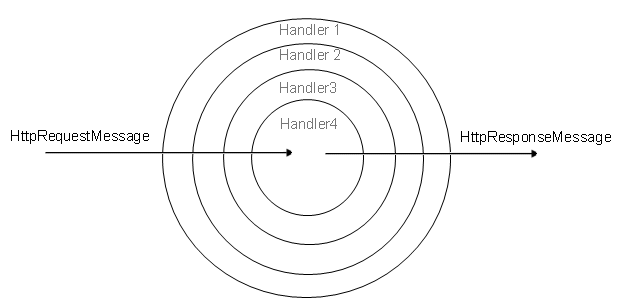

# 第八章信息处理程序

## 洋葱建筑

当我们看到一个请求是如何被处理的时候，我们在[第 3 章](03.html#_Chapter_3_)中提到了消息处理程序。现在，我们更深入地了解它们是如何实现的，以及它们如何为我们的应用程序添加功能。

消息处理程序的典型行为是获取请求，对请求进行一些操作，然后将其传递给链中的下一个处理程序。

消息处理程序只是一个继承了`HttpMessageHandler`抽象类的类。这个类的接口，如果去掉`IDisposable`接口，只是一个接收`HttpRequestMessage`返回`HttpResponseMessage`的方法。

事实上，消息处理程序的目的只是接收请求消息(`HttpRequestMessage`)并返回响应(`HttpResponseMessage`)。ASP.NET 网络应用编程接口将这些处理程序组成一个链，其中每个处理程序都是对下一个的引用(通过`InnerHandler`属性)，这样处理程序就可以执行调用并将结果传递给下一个。最终的结果就像一个洋葱，被请求和响应消息遍历。



消息处理程序有几种使用方式。例如，我们可以构建一个消息处理程序，在响应中添加一个定制的头。代码非常简单，反映了架构的简单性:

```cs
  public class CustomHeaderMessageHandler : DelegatingHandler
  {
      protected override Task<HttpResponseMessage> SendAsync

  (

           HttpRequestMessage request, 

           CancellationToken cancellationToken

  )
      {

  request.Headers.Add("X-My-custom-Header", "this is a custom header");
          return base.SendAsync(request,
  cancellationToken);
      }
  }

```

前面的代码演示了如何创建一个处理程序，该处理程序只需在请求头(`X-My-custom-Header`)中添加一个新条目，并将调用传递给基类进行进一步处理。

我们继承自`DelegatingHandler`类，该类已经实现了管理对链中其他处理程序的传递调用的机制。`DelegatingHandler`本身来源于`HttpMessageHandler`。

处理程序也可以用来记录请求或错误:

```cs
  public class LogMessageHandler : DelegatingHandler
  {
      protected override async Task<HttpResponseMessage> SendAsync

  (

  HttpRequestMessage request,

  CancellationToken cancellationToken
                                   )
      {
          HttpResponseMessage response = await base.SendAsync(request, 

  cancellationToken);
          if (!response.IsSuccessStatusCode)
          {
              // Log the error.
          }
          return response;
      }
  }

```

在这种情况下，我们将调用传递给基类来执行，因为我们需要知道调用是成功的还是抛出了错误。我们得到响应，并在出现错误时写入日志。

定义后，需要将处理程序添加到配置中，以便 ASP.NET 网络应用编程接口可以在执行管道中使用它:

```cs
  // in WebApiConfig.cs
  config.MessageHandlers.Add(new CustomHeaderMessageHandler());
  config.MessageHandlers.Add(new LogMessageHandler());

```

我们必须考虑注册处理程序的顺序很重要，因为它是以自上而下的方式执行的。也就是说，首先为请求消息调用第一个条目，然后为响应消息调用最后一个条目(如上图所述)。

消息处理程序也可以按路由注册，而不是全局应用。每个路由注册一个处理程序意味着该处理程序只对某些请求发生:

```cs
  IHttpRoute route = config.Routes.CreateRoute(
      routeTemplate: "api/Posts/{id}",
      defaults: new HttpRouteValueDictionary("route"),
      constraints: null,
      dataTokens: null,
      handler: new CustomHeaderMessageHandler());
  config.Routes.Add("WithHandler",route);

```

在这种情况下，我们只对路线模板中显示的`PostsController`使用`CustomHeaderMessageHandler`。

## 总结

处理程序在 ASP.NET 网络应用编程接口的架构中起着核心作用。在服务之外修改请求和响应的能力打开了有趣的场景，并提供了扩展默认框架行为的可能性。

在本章中，我们了解了关于处理程序的一些基本背景信息，以及如何针对特定情况实现一些自定义处理程序。