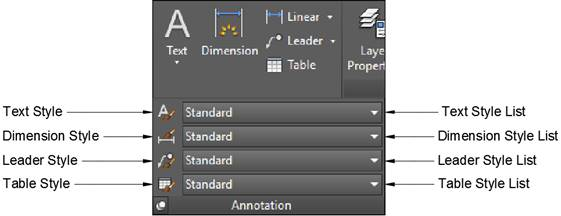
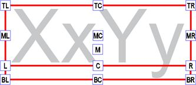
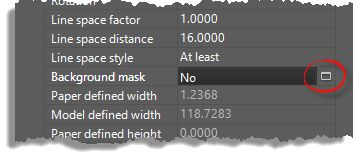
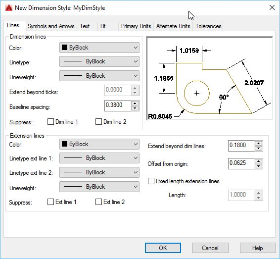
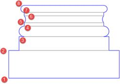
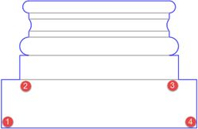
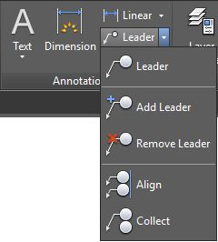

# 六、注解

添加注解和标注可能是设计过程中最无聊的阶段。幸运的是，AutoCAD 提供了正确的工具，可以更快、更有效地添加注解。

在本章中，您将了解如何向 AutoCAD 添加注解，包括文本、引线和表格。您还将学习如何拼写检查笔记，以及如何创建在绘图中使用的文本样式。

您可以在“常用”选项卡的“注解”面板中使用注解对象，并且可以从“注解”选项卡访问更强大的工具。

图 103 显示了位于“主页”选项卡中的“注解”面板，您可以在其中打开对话框来定义样式和设置当前样式。

 103:主页选项卡中展开的注解面板

注解性对象允许您创建一个可以表示多种尺寸或比例的注解对象(参见图 104)。您可以启用注解对象的“注解性”特性，并为对象指定许多绘图比例，而不是在不同的图层上创建注解对象的多个实例。

 104:指定了两种注解比例的注解性文本

正确使用注解性对象可以提高工作效率，并有助于避免在编辑或删除注解性对象时出现不必要的错误。

创建注解性对象时，对象大小会进行缩放以匹配当前注解性比例。

 105:状态栏中的注解性控件

注解性控件如下:

`Show annotation objects`:启用(蓝色)时，如果与当前视图的当前注解比例相关联，所有注解性对象都将独立显示。对象以最接近的关联比例显示。禁用(灰色)时，仅显示与当前视图的注解比例相关联的注解性对象。

|  | 提示:在模型空间中工作时打开“显示注解对象”，在图纸空间中关闭。这将有助于避免创建已存在于图形中的注解性对象，您所要做的就是指定必要的比例。 |

`Add scales to annotative objects when scale changes`:启用(蓝色)时，当选择另一个比例时，所有注解性对象都与注解比例相关联。

`Annotation scale of the current view`:显示当前标注比例。单击从列表中选择另一个注解比例，或编辑/添加注解比例。

向对象添加和删除注解比例:

1.  选择注解性对象并单击鼠标右键。
2.  点击`Annotative Object Scales`。

在开始添加注解之前，设置至少两种文本样式非常重要。文本样式是一个库，AutoCAD 在其中存储文本格式，如文本高度和字体信息，以满足您可能需要的许多注解目的。理想情况下，您应该在模板文件中创建文本样式。

要创建文本样式:

1.  开始新的绘图。
2.  在主页选项卡中，展开注解面板，点击`Text Style`工具(见图 105)打开文本样式对话框。
3.  样式列表中当前有一种样式(标准。)我们将创建一些额外的样式。
4.  点击`New…`按钮添加新样式，名称输入 Normal，点击【确定】添加样式。
5.  在“字体”区域，选择:
6.  字体名称:`Arial`
7.  字体样式:`Regular`
8.  在“大小”区域:
9.  确保勾选了`Annotative`(样式名称旁边会出现一个符号，表示该样式是注解性的)。
10.  高度:`0.1`(这是以 1:1 比例绘制时字体的大小)。
11.  在“效果”区域:

13.  点击`New…`，进入`Style name`的`DimTxt`，点击`OK`。
14.  在“字体”区域，选择:
15.  字体名称:`Arial`
16.  字体样式:`Regular`
17.  在“大小”区域:
18.  确保`Annotative`未被选中。
19.  高度:`0`(当高度设置为零时，高度在创建文本时定义)。
20.  在“效果”区域:
21.  确保`Upside down`未被选中。
22.  确保`Backwards`未被选中。
23.  设置`Width Factor`=`0.8``oblique Angle`=`0`。
24.  点击`Apply`。
25.  按如下方式创建附加文本样式:

| 名字 | 名称来源 | 字体样式 | 注解 | 高度 | 宽度系数 | 斜角 |
| 修订本 | 天线 | 意大利语族的 | 是 | Zero point one | one | Zero |
| 标题 1 | 新罗马时代 | 大胆的 | 不 | Zero point two five | one | Zero |
| 标题 2 | 新罗马时代 | 粗斜体 | 不 | Zero point one six | one | Zero |
| 标题 3 | 新罗马时代 | 意大利语族的 | 不 | Zero point one two five | one | Zero |

在`Styles`列表中，选择`Normal`并点击`Set Current`使`Normal`成为当前文本样式。点击`Close`关闭对话框。

既然已经定义了一些文本样式，就可以开始向图形中添加注解了。最常见的两种文本类型是单行文本和多行文本。

图 106:文本工具

创建不需要高级格式的基本文本(如标签)时，请使用单行文本。

单行文本每次按下`Enter`键都会创建一行新的文本。每一行文本都是一个独立的对象，您可以随意编辑，而不会影响其他行。

指挥:DTEXT

别名:DT

使用多行文本创建段落文本对象。所有线条和段落都是单个对象的一部分，可以使用 AutoCAD 文本编辑器进行编辑。

命令:MTEXT

别名:T 或 MT

创建多行文本时，功能区中会显示“文本编辑器”上下文选项卡，您可以在其中设置文本格式，类似于在 Microsoft Word 或其他桌面文本编辑器中设置文本格式。

图 107:文本编辑器上下文选项卡

如果分解多行文本，它将被转换为单行文本，其中每一行文本都是一个独立的对象，所有格式都将被取消。

图 108:文本对齐基点

| `TL` =左上
`ML` =中左
`L` =左
`BL` =左下 | `TC` =上中
`MC` =中中
`M` =中
`C` =中
`BC` =下中 | `TR` =右上
`MR` =中右
`R` =右
`BR` =右下 |

1.  从“常用”选项卡中，展开`Annotation`面板，并确保活动文本样式为注解性的(注解性文本样式显示一个蓝色小三角形)。在本练习中，选择`Normal`文本样式。
2.  在状态栏中，选择适当的注解比例(以后可以向对象添加其他注解比例)。选择`1/8”=1’-0”`进行本练习。

创建注解性单行文字:

1.  继续之前的绘图，创建一个名为`A-Anno-Note`的新图层，颜色 231，连续线型，可绘制(参见第 2 章中的“创建图层”主题，查看如何创建图层)。设置`A-Anno-Note`为当前图层。
2.  缩放以使建筑适合绘图区域。
3.  从`Home`选项卡的`Annotation`面板中，展开`Text`并选择`Single Line Text`。
4.  按下`F3`关闭对象捕捉。命令窗口显示一条消息，通知您`Osnap`状态。如果上面写着>上的<奥斯纳普。再次按下`F3`将其关闭。
5.  单击建筑中心大房间区域的中心附近。
6.  输入`0`并按`Enter`获取文本的旋转角度。
7.  进入`Great Room`，按`Enter`、`FFL +7’-0”`，再按`Enter`。
8.  按`Enter`完成命令。
9.  选择文本。请注意，它们是两个独立的对象。

创建注解性多行文字:

单行文本没有宽度限制，该行一直延续到您按下`Enter`创建新的文本行。

对于多行文字，可以指定宽度限制，当达到指定宽度时，线条会自动断开。

1.  从`Home`选项卡的`Annotation`面板中，展开`Text`并选择`Multiline Text`。
2.  指定第一个角:在车库区域中心附近单击
3.  指定对角:单击一个点，使文本框的宽度接近 125 个单位。
4.  键入`Garage`并按下`Enter`，键入`FFL +6’-6”.`不要按下`Enter`；相反，请在文本框外单击以完成该命令。
5.  选择多行文本；文本是具有两行的单个对象。

将现有文本导入多行文本

1.  双击鼠标中键进行缩放扩展。
2.  从`Home`选项卡的`Annotation`面板中，展开`Text`并选择`Multiline Text`。
3.  单击网站左侧的空白区域。
4.  在命令窗口中，输入`W`并按`Enter`指定文本框宽度。
5.  输入`550`并按`Enter`确定宽度。
6.  从`Text Editor`上下文选项卡中，展开`Tools`面板并选择`Import Text`。
7.  浏览到本书练习的`Chapter 06`文件夹，选择`MText.txt`文件。
8.  点击`Open`。
9.  文本已导入文本框。
10.  单击文本框外部以完成该命令。

创建非注解性文本的步骤与创建注解性文本的步骤相同，但是您需要确保选择未设置为注解性的文本样式，并且可能需要在屏幕上指定文本高度。

`Edit texts`

命令：文本编辑

别名:ED

要编辑文本，只需双击文本对象或选择要编辑的注解对象，在命令窗口中键入`ED`，然后按下`Enter`或`Spacebar`。

|  | 注意:如果在未选择注解对象的情况下执行“文本编辑”，AutoCAD 会提示选择要编辑的注解对象。 |

如果文本与其他对象重叠，有时会变得难以阅读。多行文本可以很容易地被屏蔽，以便背景元素被隐藏，文本变得可读。

为了说明这一点，请将车库中添加的多行文字复制到右侧车道区域的上方。双击编辑文本，将`Garage`替换为`Driveway`。在文本区域外单击以提交。

文本很难通过阴影模式阅读。按照以下步骤屏蔽它:

1.  选择多行文本。
2.  右键单击并从上下文菜单中选择`Properties`以打开属性选项板。
3.  在`Properties`调色板的`Text group`下，找到背景蒙版。
4.  点击`No`文本，然后点击字段右侧的小图标，如图 109 所示。
5.  在`Background Mask` 对话框中，选择`Use background mask`和`Use drawing background color`。
6.  在`Border offset factor`文本框中输入`1.25`。这是相对于文本大小，从文本到遮罩边框的间隙距离。
7.  点击`OK`应用设置并关闭对话框。
8.  在命令窗口中，输入`REGEN`并按`Enter`重新生成图形。
9.  使用夹点模式调整文本框宽度。
10.  保存并关闭您的绘图。

 109:多行文字背景遮罩

没有尺寸的设计是不完整的。尺寸是设计过程的关键部分，必须易于阅读且精确。

您需要在几乎每种类型的项目上添加尺寸，从概念到生产和施工图纸。AutoCAD 包含正确的工具，可帮助您使尺寸标注成为一个流畅的设计过程。

尺寸样式是保存在图形中的一组参数，您可以在其中定义从线到单位格式的所有标准特性。

命令:DIMSTYLE

别名:D

要从主页选项卡创建或编辑尺寸样式，请展开`Annotation`面板，单击`Dimension Style`图标(参见图 103)或在命令窗口中键入`DIMSTYLE`，然后按`Enter`或`Spacebar`打开尺寸样式管理器对话框。

“样式”列表(左侧的框)显示当前图形中可用的所有尺寸样式。在列表中选择尺寸样式时，预览会显示在预览框中。

要创建新的尺寸样式，单击对话框右侧的`New…`，打开创建新尺寸样式对话框:

`New Style Name`:输入新样式的名称。

`Start With`:可以选择一种样式作为模板。

`Annotative`:允许用户定义新标注样式是否为注解性。

`Use for`:允许用户定义要应用新样式的尺寸类型。例如，可以创建一组仅用于角度尺寸的参数。当选择特定类型的尺寸时，新名称不可用，新样式成为在`Start with`下拉列表中选择的尺寸的子样式。

按如下方式创建尺寸样式:

*   新风格名称:`MyDimStyle`
*   从:`Standard`开始
*   注解性:`Yes`(选中)
*   用于:`All dimensions`
*   点击`Continue`。维度样式编辑器(图 110)被加载，您可以开始配置新的维度样式。

标注样式编辑器(“新建”、“修改”和“替代标注样式”对话框)由七个选项卡组成:

*   `Lines:`控制尺寸中所有线条的外观。

*   `Symbols and Arrows`:控制箭头和中心标记的外观。
*   `Text`:控制要放置在标注样式中的文本的外观、位置和对齐方式。
*   `Fit:`控制文本和箭头的放置方式。
*   `Primary Units:`控制尺寸单位格式。
*   `Alternate Units:`允许用户为尺寸定义第二个单位。例如，假设将主要单位设置为“建筑”格式(英尺和英寸)，则可以设置替代单位以厘米为单位显示尺寸。
*   `Tolerances:`控制公差中文本的外观。

 110:尺寸样式编辑器

继续我们的尺寸样式:

1.  选择`Lines`标签:
2.  尺寸线

4.  延长线

6.  选择`Symbols and Arrows`标签:
7.  箭头:

9.  选择`Text`标签:
10.  文本外观:

12.  文本位置:

14.  文本对齐:`ISO standard`
15.  选择`Primary Units`标签:
16.  线性尺寸:

18.  点击`OK`添加尺寸样式，关闭对话框。
19.  在`Dimension Style Manager`中，选择`Styles`列表中的`MyDimStyle`，点击`Set Current`按钮。
20.  单击`Close`关闭尺寸样式管理器。
21.  保存绘图。

编辑尺寸样式

若要编辑现有的标注样式，请打开标注样式管理器，选择要编辑的标注样式，然后单击`Modify…`按钮。编辑完成后，单击`OK`提交更改并关闭对话框，或单击`Cancel`放弃所有更改并关闭对话框。

关闭所有对话框后，AutoCAD 会重新生成图形，以将更改应用于与已编辑样式关联的现有尺寸。

您可以从“常用”选项卡的“注解”面板中处理尺寸，或者对于更高级的工具，可以从“注解”选项卡的“尺寸”面板中处理尺寸。基本上有七种基本类型的维度:

*   `Linear`:线性尺寸是与当前 UCS 方向匹配的垂直或水平尺寸。
*   `Aligned`:对齐尺寸是尺寸线旋转到延长线原点方向的线性尺寸。
*   `Radius`:测量圆和弧半径的径向尺寸。“折弯”是一个径向尺寸，可用于折弯尺寸线。
*   `Diameter`:测量圆直径的径向尺寸，虽然不常用，但也可以测量圆弧的直径。
*   `Angular`:测量选定对象的角度或通过指定三个点(顶点、角度起点和角度终点)。
*   `Ordinate`:测量距 UCS 原点的垂直或水平距离。
*   `Arc Length`:测量弧线的长度。

图 111:尺寸工具

基线和延续维度

“基线”和“继续”是尺寸命令，支持从先前创建的尺寸或通过选择现有尺寸继续进行尺寸标注。

`Continue Dimension`从先前创建的尺寸的第二条尺寸线开始创建新尺寸。

`Baseline Dimension`创建新尺寸，其中所有后续尺寸从先前创建的尺寸的第一条尺寸界线开始，并按尺寸样式中基线间距设置中指定的值进行间隔。

要开始尺寸标注，请打开位于`Chapter 06`文件夹中的`Column Base Notes`图。这是在之前的练习中创建和编辑的相同的图形，但是在这个图形上，我添加了一个名为`Dim with Alternate Unit`的标注样式。此标注样式包括以建筑单位表示的主要单位和以毫米表示的替代单位。请随意在标注样式编辑器中打开它以查看属性。

让我们向柱基添加一些尺寸:

1.  确保`Osnap`开启。您可以随时按`F3`根据需要切换`Osnap`。
2.  从`Home`选项卡的`Annotation`面板中，选择`Linear dimension`工具。
3.  单击柱基左下角附近。确保捕捉到终点。
4.  单击正上方的终点。
5.  向左移动光标并单击以放置尺寸线。
6.  激活功能区中的`Annotate`标签。
7.  从`Dimensions`面板中，选择`Baseline`。
8.  Select each end point of the column base transition sequentially, up to the top-most point.

    

    图 112:“注解”选项卡中的“尺寸”面板

    

9.  按下`Enter`、`Spacebar`或`Esc`完成命令。
10.  选择`Linear dimension`工具。
11.  选择柱基的左下角。
12.  选择柱基第二层左下角的终点。
13.  向下移动光标，使尺寸线水平。单击以将尺寸标注放置在柱基下方。
14.  选择底部第二层右侧的终点，然后选择底部的右下角。
15.  选择`Linear`尺寸工具。
16.  Select the points `1` and `4` shown in the following figure.

    

17.  向下移动光标并选择一个点，将尺寸线放置在现有水平尺寸的下方。
18.  保存您的绘图。

多重引线是一个注解对象，用于创建带有引线的文本。

图 113:多重引线

要从“常用”选项卡创建或编辑多重引线样式，请展开`Annotation`面板，然后单击`Multileader Styles`图标(参见图 103)以打开“标注样式管理器”对话框。

“样式”列表(左侧的框)显示当前图形中可用的所有多重引线样式。在列表中选择尺寸样式时，预览会显示在预览框中。

要创建新的多重引线样式，单击对话框右侧的`New…`按钮，打开`Create New Multileader Style`对话框:

`New Style Name`:输入新样式的名称。

`Start With`:可以选择一种样式作为模板。

`Annotative`:允许您定义新标注样式是否为注解性的。

在`Column Base Notes`图形中，创建多重引线样式，如下所示:

1.  新风格名称:`MyMultileader`
2.  从:`Standard`开始
3.  注解性:`Yes`(选中)
4.  用于:`All dimensions`

6.  点击`Continue`。

多重引线样式编辑器已加载，它由三个选项卡组成:

*   `Leader Format`:控制引线和箭头外观的设置。
*   `Leader Structure`:处理引线格式的设置。
*   `Content`:控制多重引线内容的设置。您可以从多行文字、块或无(仅引线)中进行选择。

继续我们的新多重引线样式配置:

1.  在“引线格式”选项卡中:
2.  一般信息:

4.  箭头:

6.  在“引线结构”选项卡中:
7.  限制

9.  着陆设置:

11.  比例:

13.  在内容选项卡中:
14.  多重引线类型:`Mtext`
15.  文本选项:

17.  引线连接:

19.  点击`OK`保存修改并关闭对话框。
20.  选择`MyMultileader`样式，点击`Set Current`。
21.  点击`Close`。

您可以从“常用”选项卡的“注解”面板或“注解”选项卡的“引线”面板中使用引线。

图 114:注解面板中的多重引线工具

1.  打开`Column Base Notes`图，如果没有打开。
2.  单击“注解”面板中的`Leader`工具。
3.  右键单击鼠标，从`Object Snap Override`菜单中选择`Geometric center`。
4.  将十字准线移近柱基周界。确保它捕捉到柱基的中心，然后单击。
5.  将光标移动到图形的右侧，然后单击以放置多重引线。
6.  类型:`Cast stone finish` `8 Color TBD`
7.  按下`Ctrl+Enter`或点击文本框外的任意位置。
8.  选择`Add Leader`工具。
9.  选择多重引线对象。
10.  在现有引线的上方和下方再添加两条引线。
11.  按下`Enter`、`Spacebar`或`Esc`完成命令。
12.  单击`Annotation`面板中的`Leader`工具。
13.  单击柱基的右垂直线最低点的中点附近。
14.  向右移动鼠标并单击以放置引线。
15.  类型:`Structural by others`
16.  按`Ctrl+Enter`完成。
17.  保存您的绘图。

在本章中，您学习了如何向绘图添加注解。您创建了文本样式、标注样式和引线样式，还向图形中添加了注解。

绘图注解在绘图中至关重要。这是你传达你的想法和产品生产要求的方式。