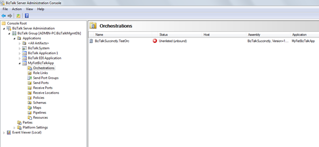
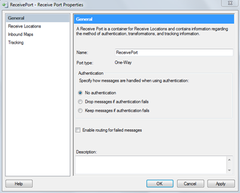
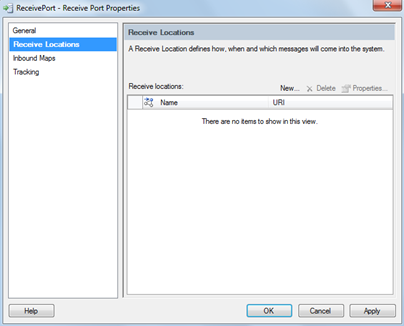
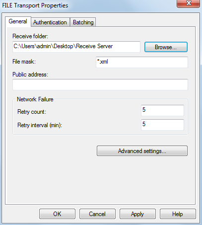
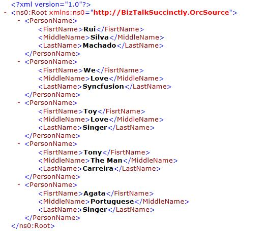
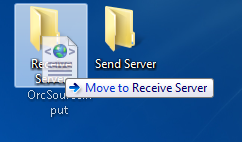
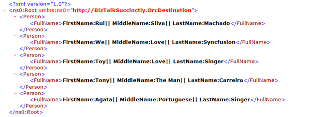

# 十、配置 BizTalk 管理员

要配置我们的应用程序，我们将使用 BizTalk 服务器管理员。关于这一点，我不会讲太多细节，因为这将需要整本书来解释如何使用所有的管理任务，以及它们如何影响应用程序的性能。相反，我将只介绍运行我们的小应用程序所需的配置。

要打开 BizTalk 服务器管理控制台，请执行以下步骤:

1.  点击**开始**。
2.  选择**程序**。
3.  选择**微软 BizTalk Server 2010** 。
4.  选择 **BizTalk 服务器管理**。

在管理员的左侧，您有一个树形视图，允许您在这些控制台选项和组件之间导航。打开树后，您会发现“应用程序”节点包含我们部署的应用程序。正如您所看到的，我们的 MyFirstBizTalkApp 可以作为应用程序节点的子节点使用。如果您展开它，您会发现该应用程序的所有元素都组织到文件夹中，其中包含在 BizTalk 开发人员环境中创建的所有工件(模式、映射、业务流程、端口和任何其他资源)。

图 BizTalk 管理员的第一个视图

在第 8 章的例子中，我们开发了一个简单的应用程序，它有一个接收端口、一个发送端口和一个转换。为了测试它，我们需要手动绑定接收消息的物理位置和发送消息的物理位置，指定它们将运行哪个进程(主机实例)，然后将这些端口绑定到我们的编排中存在的端口。

为了使我们的应用程序正常工作，我们需要完成以下步骤:

1.  配置接收端口和位置。
2.  配置发送端口和位置。
3.  配置业务流程。
4.  启动应用程序。
5.  测试应用程序。

配置接收端口

我们的第一步是配置接收端口。在左侧树形视图窗口的应用节点中选择**接收端口**选项。将打开接收端口文件夹。要创建新的接收端口，右键点击屏幕中央，选择**新建**，然后选择**单向接收端口**，如图 79 所示。

图 79:创建新的接收端口

BizTalk 管理员将启动一个向导来帮助您进行配置。如图 80 所示，您需要设置接收端口名称和身份验证级别。例如，选择**无认证**，因为我们不需要任何认证来处理我们的接收消息。

图 80:配置接收端口

接下来，单击向导屏幕左窗格中的**接收位置**。在这里，我们将告诉 BizTalk 使用特定的物理位置作为我们的消息接收位置。点击**新建...在接收位置窗口中的**。

图 81:创建新的接收位置

这将打开一个新的“接收位置”窗口，您可以在其中从以下现成选项中选择需要使用的适配器:

*   文件
*   文件传送协议
*   超文本传送协议
*   MQSeries
*   MSMQ
*   POP3
*   肥皂
*   结构化查询语言
*   WCF
*   Windows SharePoint 服务

如您所见，BizTalk 允许许多适配器。适配器是一种软件组件，它使您能够使用符合公认标准的传递机制，如 SMTP、POP3、FTP 或微软消息队列(MSMQ)，轻松地将消息发送到 BizTalk 服务器或从 BizTalk 服务器接收消息。随着微软 BizTalk 服务器的发展，对能够快速实现与常用应用程序和技术连接的适配器的需求也在增加。对于我们的例子，我们将使用文件传输类型。

在**类型**组合框中选择**文件**，并选择该端口的**接收处理程序**，默认为 **BizTalk 服务器应用程序**。不要忘记在**接收管道**字段中选择**XMLReceive**；这样，消息将被分解，并且可以识别订户。否则，如果选择 PassThruReceive 管道，BizTalk 将引发一个错误，说明没有识别出任何订阅者。

现在点击**配置**，这样你就可以为你的位置定义 URI 了。

图 82:接收位置属性

接下来，将出现一个文件传输属性窗口，您可以在其中设置**接收文件夹**路径。这将是我们模拟的**接收服务器**。因为我们将处理 XML 文件作为输入，所以选择文件掩码 ***。xml** 这样只会处理 xml 文件。

图 83:配置接收文件夹

在文件传输属性窗口中点击**确定**，对于该接收端口配置的所有打开窗口，继续点击**确定**。完成后，您将在“接收端口”文件夹中看到一个新对象，这是您最近创建的端口。

图 84:创建的接收端口

现在，您将对发送端口执行同样的操作，唯一的区别是您将使用的管道。因为我们期望我们的结果消息格式和 BizTalk 内部消息格式是 XML，所以您不需要任何特殊的处理，所以您可以使用**pass 推力结束**管道。创建发送端口后，您应该会看到它出现在“发送端口”文件夹中。唯一的区别是状态字段端口中的红色符号，表示该端口已停止。

图 85:未列出的端口

右键单击端口，选择**开始**。现在，您应该会看到一个绿色符号，表示状态已更改为“已开始”。

图 86:启动端口

配置业务流程

这是我们的最后一个配置步骤，我们只需将物理端口绑定到编排中开发的逻辑端口。在业务流程文件夹中双击您的业务流程；您将在管理员左侧的树视图中看到“业务流程属性”窗口。选择主机，选择默认的 **BizTalk 服务器应用程序**，对于每个接收和发送端口，使用组合框将它们绑定到先前在此管理员控制台中创建的物理端口。一旦您完成了这一步，我们的应用程序配置就完成了，我们准备开始并测试它。

图 87:将编排绑定到物理端口

启动应用程序

下一步是启动应用程序，这是一个非常简单的步骤:只需右键单击**my irstbiztalk app**并选择**启动...**。接下来，BizTalk 会问你要不要启动，你要选择**启动**确认。

图 88:启动应用程序

测试应用程序

这是我们的最后一步——测试应用程序是否工作。为此，我们需要构建我们的 XML 消息；对于这个例子，我将使用图 89 所示的代码。

图 89:输入 xml

现在让我们在接收位置使用它。只需转到您的**接收服务器**文件夹，并删除输入的 XML 文件。如果配置一切顺利，BizTalk 将自动使其消失。

图 90:将输入文件放到接收位置

一旦文件消失，转到您的**发送服务器**位置，该位置应包含新消息。

图 91:向服务器发送新消息

如果您打开这个文件，您将看到输入消息使用我们开发的地图进行了转换，预期结果如图 92 所示:

图 92:结果消息

## 最后一个音符

BizTalk Server 是一个功能强大的平台，可以应用于多种项目类型。它不仅允许您集成数据、使用业务规则引擎，并使用其业务活动监控来监控您的业务，还允许您使用业务流程和工作流来连接人员、系统和业务。我在本书中没有谈到的另一个很好的特性是创建电子数据交换(EDI)项目的能力，这不仅仅是业务伙伴之间交换文档的标准。

这本书旨在向你展示如何用这个平台开始开发；然而，BizTalk 激发了围绕它的整个职业世界，包括开发人员、数据库管理员、经理、集成顾问等等。如果你想继续学习，有很多资源可以利用。

虽然它看起来像是一项新技术，但它从 2000 年就已经存在了，许多人每天都在与这个平台相关的话题上分享他们的知识。花时间研究它是一项宝贵的投资，我非常肯定它会为你打开许多商机。

我最后要提到的是 BizTalk 服务器 2013 R2，它为该产品带来了更强大的功能。最大的功能之一是将您的应用程序连接到 Azure 服务的能力，消除了开发一些集成解决方案所需的物理基础架构，并显著提高了适配器和执行效率。如果您对 BizTalk 服务器 2010 感到满意，您应该尝试一下这个版本。