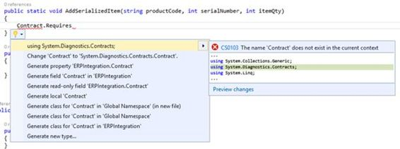
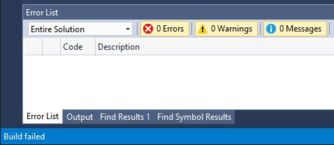
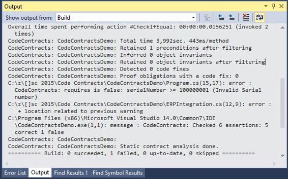
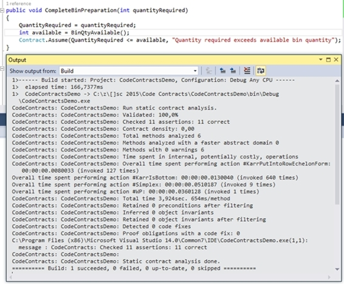
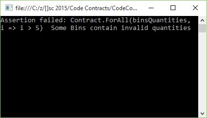
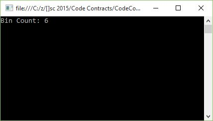
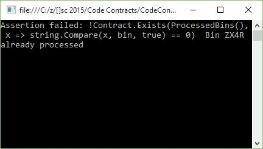
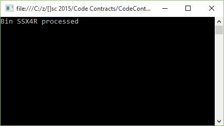
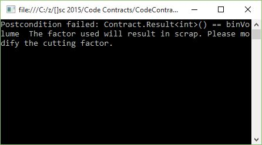

# 二、使用代码契约

|  | 注:本书代码样本可在[bitbucket.org/syncfusiontech/c-code-contracts-succinctly](https://bitbucket.org/syncfusiontech/c-code-contracts-succinctly)获得。 |

有很多例子说明了代码契约的使用。他们中的许多人似乎使用原始的非现实世界的例子来解释代码契约的使用。虽然我理解这样做的好处，但我觉得使用真实世界的例子更好。那么什么可以归类为合适的例子呢？嗯，几年前，我正在开发一个系统，用来取代现有的企业资源规划系统。新旧企业资源规划系统都使用数字序列号，但我们为新企业资源规划系统开发的集成只能使用新的序列号。

旧的企业资源规划系统被保留用于历史目的，因此整合必须确保它只使用对新的企业资源规划系统有效的序列号。我们决定开始所有一亿以上的序列号。这意味着创建的第一个序列号将是 100，000，001。任何低于这个数字的序列号(虽然有效)都不得输入新的企业资源规划系统。

在 Visual Studio 2015 中，首先在您的类中添加以下`using`语句。

```cs
    using System.Diagnostics.Contracts;

```

代码清单 1:必需的使用语句

如果您在没有`using`语句的情况下开始为代码契约编写代码，Visual Studio 2015 将提示您通过新的灯泡生产力功能添加它，如图 7 所示。



图 7: Visual Studio 2015 灯泡功能

您会注意到 Visual Studio 2015 建议了一些更正。在图 7 中，您可以看到`using`语句是第一个建议，也是我们在这种情况下需要应用的修复。

### Visual Studio 2015 灯泡

这项生产力功能在 Visual Studio 2015 中是新的。灯泡会自动出现在 Visual Studio 编辑器中，并针对当前正在键入的代码行向开发人员提供错误修复和重构建议。灯泡也可以通过在一行代码上按下`Ctrl+Period`来手动调用，以查看潜在修复的列表。

考虑下面的代码清单，它检查传递给方法的序列号的值。此方法用于将新的企业资源规划系统的库存表添加序列化库存项目。

```cs
    public static class ERPIntegration
    {
        public static void AddSerializedItem(string productCode, int serialNumber, int qty)
        {
            Contract.Requires<SerialNumberException>
                (serialNumber >= 100000001, "Invalid Serial number");          
        }
    }
    public class SerialNumberException : Exception
    {
        public SerialNumberException()
        {
        }

        public SerialNumberException(string message)
            : base(message)
        {
        }

        public SerialNumberException(string message, Exception inner)
            : base(message, inner)
        {
        }
    }

```

代码清单 2:代码契约先决条件

`Contract.Requires`语句表示前提条件。先决条件是方法体中的第一个语句。在前面的代码清单中，前提条件检查传递给方法的序列号的值，并确定它是否是有效的序列号。

现在让我们仔细看看实际的代码契约。代码合同汇总如下:`Contract.Requires<TException>(bool condition, string errorMessage) where TException : Exception`。验证布尔条件，如果失败，代码契约将抛出一个异常，并提供消息。请注意，我在合同中添加了一个名为`SerialNumberException`的自定义例外。它源自`Exception`类，但是您可以在这里添加任何适用的例外来满足您的要求。

前面代码清单中代码契约的格式只是一种实现。下表说明了代码合同前提条件的有效语法:

*   `Contract.Requires(bool condition)`
*   `Contract.Requires(bool condition, string errorMessage)`
*   `Contract.Requires<TException>(bool condition)`
*   `Contract.Requires<TException>(bool condition, string errorMessage)`

就我个人而言，我更喜欢指定的异常类和用户定义的错误消息的组合，如果代码契约中表达的条件失败了，就会抛出该错误消息。这为开发人员提供了一个非常强大的机制来确保传递给方法的值是有效的。它还使开发人员不必为可能破坏系统的每一个可能发生的情况编写防御代码。知道合同中的方法将始终符合您指定的预定规则，让您作为开发人员更加安心。

为了说明代码契约中定义的前提条件的失败，我在方法调用中硬编码了一个无效的序列号。作为一个控制台应用程序，对方法的调用被包装在一个`try` / `catch`语句中，该语句将错误输出到控制台。考虑下面的代码清单。

```cs
    static void Main(string[] args)
    {
        try
        {
            ERPIntegration.AddSerializedItem("BC32WL", 70012, 1);
        }
        catch (Exception ex)
        {
            Console.Write(ex.Message);
            Console.ReadLine();
        }
    }

```

代码清单 3:运行中的代码契约先决条件

当控制台应用程序运行时，将引发异常并显示在控制台窗口中。当使用具有自定义异常的代码契约时，如代码清单 2 所示，您必须将代码契约汇编模式属性设置为`Standard Contract Requires`。


图 8:先决条件失败

前面的例子是一个相当简单的方法来说明代码契约的力量。然而，在生产系统中，人们显然不会在方法调用中有硬编码的值。这些值来自数据库或用户输入的可能性非常高。众所周知，所有的输入(用户或数据存储)都是我们无法控制的，我们应该这样对待它。代码契约减轻了坏数据的负面影响。

虽然前面的例子是功能性的，但我想从我的代码契约中得到更多。我不想运行我的应用程序，然后意识到有些代码段会导致我的合同失败。就我个人而言，我希望在构建项目时看到任何失败。这个项目足够小，所以我可以对项目属性窗口中指定的代码契约属性有点漫不经心。

返回到代码合同属性页，如果您还没有这样做，请启用`Perform Static Contract Checking`。接下来，您需要清除`Check in background`选项。然后您会看到`Fail build on warnings`选项被启用。选择此选项。


图 9:根据警告启用失败构建

继续构建您的项目。静态契约检查立即开始，由于您的代码契约没有通过，您的构建将失败，如图 10 所示。然而，有一个问题。你的`Error List`是空的，即使你的建造失败了。因为我们只有一个代码契约，所以我们知道去哪里找。然而，当我们有几个代码契约时，这是不可行的。



图 10: Visual Studio 2015 构建失败

那么出了什么问题呢？要找到导致构建失败的问题，请前往`Output`窗口。如果看不到输出窗口，按`Ctrl+W, O`进入视图。然后，您将看到构建的结果和失败的代码契约。



图 11: Visual Studio 输出窗口

在代码契约的当前版本 1.9.10714.2 中，未输出到`Error List`的构建错误被确定为 Visual Studio 2015 版本中的一个错误。此错误已被修复，并将包含在代码契约的下一个版本中。有关 Visual Studio 2015 代码契约相关问题的更多信息，请查看 GitHub 上的[拉取请求 166](https://github.com/Microsoft/CodeContracts/pull/166) 和[问题 137](https://github.com/Microsoft/CodeContracts/issues/137) 。如果您想查看关于代码合同的所有未决问题，请查看代码合同 GitHub 页面上的[问题](https://github.com/Microsoft/CodeContracts/issues)。

代码契约是一小撮专注的个人不断努力改进当前版本的结果。像我们这样的用户有责任报告我们遇到的问题，这样做可以建立一个健康的影响者社区和一个更稳定的产品。最后，由于它是开源的，您可以为代码契约做出贡献，并成为这个不可思议的 Visual Studio 扩展的一部分。

代码契约后置条件是契约方式下的方法，它向调用代码保证，如果满足所有前置条件，它将返回一个特定的结果。让我们回到一个银行和一笔贷款的类比，合同就是为这笔贷款起草的。银行确保贷款有固定的利率，但前提是必须按时还款并支付到期金额。你所支付的款项可以等同于代码合同的先决条件。银行确保固定利率的事实可以等同于后置条件。

因此，代码契约后置条件的语法使用`Ensures`方法就不足为奇了。需要注意的另一个有趣的点是，虽然后置条件验证了契约下方法的结果，但它必须出现在方法中前置条件的后面。考虑以下代码示例:

```cs
    public static Warehouse AddSerializedItem(string productCode, int serialNumber, int qty)
    {        
        Contract.Requires<SerialNumberException>
            (serialNumber >= 100000001, "Invalid Serial number");
        Contract.Ensures(Contract.Result<Warehouse>() != null);

        ProductCode = productCode;
        SerialNumber = serialNumber;
        Quantity = qty;

        return CreateItem();
    }

```

代码清单 4:合同后置条件

从前面的代码清单中可以看出，我稍微扩展了我们的方法。我添加了后置条件，告诉调用代码这个方法的返回值将是`Warehouse`类型，并且不会为空。因此，调用代码不需要检查返回给它的对象是否有效。合同规定将返回一个`Warehouse`对象给它。

```cs
    Contract.Ensures(Contract.Result<Warehouse>() != null);

```

代码清单 5:代码契约确保结果

在真实的例子中，这基本上意味着创建的库存项目将根据特定的条件(产品代码)发放到特定的仓库。产品代码将产品标识为快件、原材料、成品等。，并且必须在创建时发放到正确的仓库。我们在契约下的`AddSerializedItem`方法告诉调用代码，它确保这个仓库出库的结果将存储在`Warehouse`对象中。如果出现任何问题，产品代码将被发放到默认仓库。企业资源规划系统的用户可以检查存储在默认仓库中的物品，并在稍后阶段手动将产品代码发放到正确的仓库。


图 12:代码合同后条件结果

我在下面的代码清单中包含了`CreateItem()`方法的代码。虽然显示这个代码示例只是为了解释一个概念，但逻辑是合理的。`switch`语句将检查一组固定的案例，如代码清单 5 所示。然而，它返回的`Warehouse`对象没有硬编码值。当代码与企业资源规划系统交互时，这些代码将从数据库或其他对象中读取，以创建产品代码条目并将其发布到仓库。代码逻辑所确保的是，该方法将始终返回一个`Warehouse`对象，并且该对象将始终是系统中的一个有效仓库。

```cs
    private static Warehouse CreateItem()
    {
        // Add Stocked Item code goes here
        Warehouse IssuedToWarehouse = new Warehouse();
        switch (ProductCode.Substring(0,1))
        {
            case "A":
                IssuedToWarehouse.Code = "FM";
                IssuedToWarehouse.Name = "Fast movers";
                IssuedToWarehouse.Bin = "A";
                IssuedToWarehouse.BinReorderLevel = 10000;
                IssuedToWarehouse.LastStockTake = Convert.ToDateTime("2015-09-01");
                break;
            case "B":
                IssuedToWarehouse.Code = "FG";
                IssuedToWarehouse.Name = "Finished Goods";
                IssuedToWarehouse.Bin = "B";
                IssuedToWarehouse.BinReorderLevel = 500;
                IssuedToWarehouse.LastStockTake = Convert.ToDateTime("2015-09-04");
                break;
            case "C":
                IssuedToWarehouse.Code = "RM";
                IssuedToWarehouse.Name = "Raw Materials";
                IssuedToWarehouse.Bin = "AD";
                IssuedToWarehouse.BinReorderLevel = 7500;
                IssuedToWarehouse.LastStockTake = Convert.ToDateTime("2015-09-02");
                break;
            default:
                IssuedToWarehouse.Code = "GS";
                IssuedToWarehouse.Name = "General Stock";
                IssuedToWarehouse.Bin = "SS";
                IssuedToWarehouse.BinReorderLevel = 5000;
                IssuedToWarehouse.LastStockTake = Convert.ToDateTime("2015-09-09");
                break;
        }
        return IssuedToWarehouse;
    }

```

代码清单 6:仓库发放逻辑

您可以看到如何在代码契约中使用后置条件来创建高度健壮的代码。想象一下在分布式团队中工作的开发人员。能够在世界任何地方工作有很多优点和缺点(取决于你的观点)。缺乏一对一的个人交流可以被理解为一个明显的缺点。不能坐在会议室里让开发人员一起解决问题仍然是一个挑战。你的大脑可以根据我们倾向于发出的大量其他信号(如肢体语言、眼球运动或呼吸)下意识地推断感觉、意义和观点。

交流不仅仅是说话的行为。因此，作为开发人员，我们需要变得更加敏锐，并提高我们在其他领域的效率。一个很好的起点是代码。使用代码契约，我们能够防御性地抢占可能发生的某些情况。仅仅因为规范没有明确提到空条件会破坏集成，这并不意味着我们不需要防御它。

前面的例子展示了开发人员如何针对逻辑上可能对集成产生不利影响的某些问题编写防弹代码。

代码契约允许验证类的内部状态。它通过使用代码契约不变量来实现这一点。顾名思义，不变量是永远不会改变的东西。它将始终如合同类中规定的那样。

我们现在知道我们的`AddSerializedItem`方法必须提供一个有效的序列号。有效序列号在特定范围内。

```cs
    Contract.Requires<SerialNumberException>
            (serialNumber >= 100000001, "Invalid Serial number");

```

代码清单 7:合同要求条件

我们还知道，契约下的方法保证调用代码，当满足有效序列号前提条件时，将返回一个非空的`Warehouse`对象。

```cs
    Contract.Ensures(Contract.Result<Warehouse>() != null);

```

代码清单 8:合同确保条件

现在让我们假设必须添加额外的逻辑来检查生产日期的有效性。这个日期也可以在将来，所以需要由外部数据存储、用户输入或查找来提供。

这很简单，通过向应用了`[ContractInvariantMethod]`属性的类中添加一个新的私有方法来实现。如果我们必须在`Warehouse`类上添加这个检查，我们需要向其中添加以下代码。

```cs
    [ContractInvariantMethod]
    private void Invariants()
    {
        Contract.Invariant(this.ProductionYear >= 0);        
        Contract.Invariant(this.ProductionMonth >= 0);
        Contract.Invariant(this.ProductionMonth <= 12);
        Contract.Invariant(this.ProductionDay >= 0);
        Contract.Invariant(this.ProductionDay <= 30);
    }

```

代码清单 9:契约不变方法

这告诉代码契约，生产日期的以下属性必须在以下范围内。它们都不能为零，月数不能大于`12`，天数可以有最大值`30`(假设我们用的是 30 天的月)。

通常，你可以随意调用契约不变量方法，但很多人更喜欢称之为`ObjectInvariant`。关于前面的代码清单需要注意的另一点是，该方法必须有一个`void`返回类型，并且作用域为`private`或`protected`。

代码契约不变的方法允许我们指定一个不允许改变的类的状态。代码很短，易于理解和实现。

代码契约还包含在代码中使用的各种其他方法。让我们在接下来的章节中看看这些例子。

### 合同断言和假设

你们中的一些人可能想知道`Debug.Assert`和`Contract.Assert`在代码中使用时有什么区别。`Debug.Assert`仅在`Debug`模式下编译代码时执行。然而，`Contract.Assert`方法是在`Debug`或`Release`模式下调试代码时执行的。

代码契约中的`Assert`方法也很容易与`Contract.Requires`方法混淆。正如我们在前面的代码清单中看到的那样，`Requires`方法是一个先决条件，并且必须总是在特定方法的开始被调用。这是因为`Contract.Requires`包含关于它所在方法的信息。另一方面，`Contract.Assert`和`Contract.Assume`在合同规定的方法中，特定于某个时间点的某一位代码。

那么我们什么时候用哪种方法呢？借助`Assert`，静态检查器运行，并将尝试在特定的代码行证明断言。`Assume`将让静态检查器简单地假设它需要证明的任何检查都是真实的。那为什么两者都有呢？考虑下一个代码清单。

```cs
    public void CompleteBinPreparation(int quantityRequired)
    {        
        QuantityRequired = quantityRequired;
        int available = BinQtyAvailable();
        Contract.Assert(QuantityRequired <= available, "Quantity required exceeds available bin quantity");        
    }

    public int BinQtyAvailable()
    {
        MaxBinQuantity = 75;
        CurrentBinQuantity = 50;
        int QtyAvailable = MaxBinQuantity - CurrentBinQuantity;
        return QtyAvailable;
    }

```

代码清单 10:断言静态检查

代码清单 10 中的代码检查包含零件的`Bin`是否有足够的空间来包含所需的数量。使用`Assert`方法，我们让静态检查器检查`QuantityRequired`变量的值。如果我们必须为`QuantityRequired`传递一个值`77`，我们会看到静态检查器发出一个警告，并且构建失败(记住，我们在代码契约属性页中打开了`Fail build on warnings`)。


图 13:断言失败

如果我们必须修改代码清单 10 中的代码以包含一个`Assume`，那么输出将会完全不同。考虑下面清单中的代码。

```cs
    public void CompleteBinPreparation(int quantityRequired)
    {        
        QuantityRequired = quantityRequired;
        int available = BinQtyAvailable();
        Contract.Assume(QuantityRequired <= available, "Quantity required exceeds available bin quantity");        
    }

    public int BinQtyAvailable()
    {
        MaxBinQuantity = 75;
        CurrentBinQuantity = 50;
        int QtyAvailable = MaxBinQuantity - CurrentBinQuantity;
        return QtyAvailable;
    }

```

代码清单 11:假设静态检查



图 14:假设通过

当我们使用`Contract.Assume`时，我们是在告诉静态检查器，它需要假设合同下的条件为真。我们为什么要这么做？代码清单 11 中的前一段代码调用了一个我们可以控制的方法。我们可以在`BinQtyAvailable`方法中逻辑地添加一个`Contract.Ensures`，以保证它符合代码合同。然而，考虑一下，我们正在调用另一个外部库中的一个方法。我们无法控制该动态链接库中包含的代码，开发人员也没有实现代码契约。但是，他们保证退回的价值将始终考虑到所需的数量，并退回一个有足够数量可用的箱子。因此，我们可以告诉静态检查器假设这个契约条件通过了。

请注意，前面关于`Assert`和`Assume`的示例仅适用于静态检查器。因为我们打开了`Perform Runtime Contract Checking`并将其设置为`Full`，所以如果被检查的条件失败(外部库返回一个无效的可用箱数量值)，则`Contract.Assume`在运行期间仍然会失败。


图 15:假设运行时失败

`Assert`和`Assume`在处理外部代码时形成了一个非常强大的组合，并确保您期望的东西以您需要的方式返回并有效。

最后，您可以在代码合同属性页中更改`Warning Level`。如果您希望在输出窗口中看到某些警告，但没有看到，请务必将`Warning Level`更改为高电平。

### 合同。对所有人来说

在我继续解释`Contract.ForAll`逻辑之前，我必须指出，它目前无法在 Visual Studio 2015 中静态验证。GitHub 上已经为这个问题记录了问题 177，线程中提供了一个解决方法。要了解更多信息，请访问[github.com/Microsoft/CodeContracts/issues/177](https://github.com/Microsoft/CodeContracts/issues/177)。

现在，我需要禁用静态检查来说明`Contract.ForAll`方法的使用。要禁用静态检查，请在 Visual Studio 的解决方案资源管理器中右键单击您的项目，然后选择`Properties`。将打开“代码合同”属性页。点击`Code Contracts`选项卡。

这是我们以前访问过的同一页面。在`Static Checking`组下，清除`Perform Static Contract Checking`选项。


图 16:禁用静态契约检查

完成后，您应该能够让代码契约执行所需的操作，并验证您指定的条件。

说完了，让我们修改一下`CompleteBinPreparation`方法。业务规则要求在处理一个仓位之前，数量必须大于 5。让我们通过要求`binQuantities`数组永远不为空来构建这个契约。如前所述，这很容易通过添加`Contract.Requires`方法来实现。

接下来，我们需要添加`Contract.Assert`来包含`Contract.ForAll`方法。这将使用 lambda 表达式来检查所有的量是否大于 5。实现如下面的代码清单所示。

```cs
    public void CompleteBinPreparation(int[] binQuantities)
    {
        Contract.Requires(binQuantities != null);
        Contract.Assert(Contract.ForAll(binQuantities, x => x > 5),
            "Some Bins contain invalid quantities");

        // Process bin quantities
        BinCount = binQuantities.Length;
    }

```

代码清单 12:契约。举个例子

如果我们的方法通过了验证，它将简单地返回数组中的 bin 计数。例如，如果数组包含无效的仓位数量，将显示一个异常。

在我们的调用代码中，我们现在将添加一个包含一些无效仓位数量的数组。我们可以看到`4`和`3`的数量小于`5`，因此无效。

```cs
    static void Main(string[] args)
    {
        try
        {
            int[] iBins = { 4, 3, 61, 51, 88, 55 };
            ERPWarehouseIntegration oWhi = new ERPWarehouseIntegration();
            oWhi.CompleteBinPreparation(iBins);

            Console.Write("Bin Count: " + oWhi.BinCount);
            Console.ReadLine();
        }
        catch (Exception ex)
        {
            Console.Write(ex.Message);
            Console.ReadLine();
        }
    }

```

代码清单 13:调用契约。对于所有方法

如果我们运行代码，控制台应用程序将抛出异常，并向用户显示错误消息。



图 17:无效箱数量

现在让我们修改我们的调用代码，只包含`iBins`数组中的有效仓位数量。您会看到我已经将`4`和`3`的无效箱数量分别更改为`32`和`19`。

如果您再次运行该应用程序，它将导致代码契约通过验证，并在控制台应用程序中显示 bin 计数。

```cs
    static void Main(string[] args)
    {
        try
        {
            int[] iBins = { 32, 19, 61, 51, 88, 55 };
            ERPWarehouseIntegration oWhi = new ERPWarehouseIntegration();
            oWhi.CompleteBinPreparation(iBins);

            Console.Write("Bin Count: " + oWhi.BinCount);
            Console.ReadLine();
        }
        catch (Exception ex)
        {
            Console.Write(ex.Message);
            Console.ReadLine();
        }
    }

```

代码清单 14:修改后的调用代码

控制台应用程序现在显示有效箱的计数，这意味着代码契约通过了验证。



图 18:有效箱数量

如您所见，`Contract.ForAll`方法提供了一种极好的方法来检查条目的值数组，如果它们违反了业务规则，可能会在执行过程中导致问题。`Contract.ForAll`方法也可用于`List`系列或任何`IEnumerable`系列。

### 合同。存在

现在，让我们假设一个需要处理的箱号进入一批已处理的箱中 30 天。系统不知道某个箱何时进入流程阶段，因此需要在处理之前检查每个箱的编号，以确保它不存在于流程队列中。代码契约在这里也提供了一个很好的解决方案。

创建一个名为`ProcessBin`的方法，并添加`Contract.Requires`方法，以检查传递给该方法的参数不为空。然后添加`Contract.Assert`方法以包含`Contract.Exists`方法。这将检查已处理的队列`ProcessedBins`是否包含我们要处理的 bin。下面的代码清单说明了这个实现。

```cs
    public void ProcessBin(string bin)
    {
        Contract.Requires(bin != null);
        Contract.Assert(!Contract.Exists(ProcessedBins(),
            x => string.Compare(x, bin, true) == 0),
            "Bin " + bin + " already processed");

        // Process bin and add to ProcessedBins collection
    }

    private List<string> ProcessedBins()
    {
        List<string> oBinsProcessed = new List<string>();
        oBinsProcessed.Add("A12");
        oBinsProcessed.Add("CD25");
        oBinsProcessed.Add("ZX4R");
        oBinsProcessed.Add("A11");

        return oBinsProcessed;
    }

```

代码清单 15:契约。现有实施

在调用代码中，我们将只使用箱号的硬编码值进行检查。调用契约下的方法，并将其传递给已经在进程队列中的 bin。

```cs
    static void Main(string[] args)
    {
        try
        {
            string BinToProcess = "ZX4R";
            ERPWarehouseIntegration oWhi = new ERPWarehouseIntegration();
            oWhi.ProcessBin(BinToProcess);

            Console.Write("Bin " + BinToProcess + " processed");
            Console.ReadLine();
        }
        catch (Exception ex)
        {
            Console.Write(ex.Message);
            Console.ReadLine();
        }
    }

```

代码清单 16:调用契约。存在方法

代码契约验证进程队列中是否存在绑定，并在控制台应用程序中向用户显示输出。



图 19:进程队列中存在箱

回到我们的调用代码，让我们将 bin 号更改为进程队列中不存在的号码。

```cs
    static void Main(string[] args)
    {
        try
        {
            string BinToProcess = "SSX4R";
            ERPWarehouseIntegration oWhi = new ERPWarehouseIntegration();
            oWhi.ProcessBin(BinToProcess);

            Console.Write("Bin " + BinToProcess + " processed");
            Console.ReadLine();
        }
        catch (Exception ex)
        {
            Console.Write(ex.Message);
            Console.ReadLine();
        }
    }

```

代码清单 17:修改后的调用代码

如果我们第二次运行该应用程序，将处理 bin，并在控制台应用程序中向用户显示确认消息。



图 20:进程队列中不存在 Bin

`Contract.Exists`允许开发人员基于您设计的系统中的某些业务规则轻松验证某个项目的存在。

### 合同。旧值<>

几年前，我在一家钢铁制造商的项目上工作。当通过将钢板切割成特定尺寸来产生切屑时，他们有一个非常特殊的废料处理过程要遵循。我参与的另一个项目有一个特定的报废工作流程要处理。报废是许多公司非常重视的事情，他们需要仔细管理这个过程。

对于代码契约的下一个例子，我将使用报废过程来说明`Contract.OldValue<>`方法的使用。不过，我必须提到的是，`Contract.OldValue<>`方法只能用于`Ensures`合同的条件表达式中。

让我们假设钢铁制造商需要将切割过程产生的切屑量降至最低。为了做到这一点，他们使用了一种计算方法，这种方法计算要切割的钢的体积，并根据切割系数计算可使用的钢的数量。完美的切割意味着如果钢的体积是 10 m <sup class="calibre37">3</sup> ，那么钢的最终切割也将等于 10 m <sup class="calibre37">3</sup> 。因此，所有的钢材都被消耗掉了，从而实现了零减产。

不完美的切割会导致钢的原始体积减少，这意味着用户需要改变切割系数，直到他们能够确保近乎完美的切割。在不详细讨论阈值和限制的情况下，让我们假设如果返回了除完美切割之外的任何东西，切割过程将不会被批准。

考虑下面的代码清单。

```cs
    public void CutSteelNoScrap(int volumeSteel, int factor)
    {
        Contract.Ensures(volumeSteel != 0, "The volume of steel can't be zero");
        Contract.Ensures(Contract.OldValue<int>(volumeSteel)
            == CutSteel(volumeSteel, factor) + volumeSteel,
        "The factor used will result in scrap. Please modify the cutting factor.");
        // Process steel to cut
    }

    private int CutSteel(int volumeToCut, int factor)
    {
        return volumeToCut % factor;
    }

```

代码清单 18:契约。旧值<>实现

如您所见，我只是使用了一个模数运算符来模拟基于不正确因子的截断的存在。模数运算符只是返回除法的余数，用`%`运算符表示。因此，以下情况属实:

`19 % 5 = 4`

`12 % 4 = 0`

这很粗糙，但它有效地说明了我需要表达的观点。在调用代码中，我们调用`CutSteelNoScrap`方法进行计算，告诉我们使用的因子是否不正确，是否产生报废。

```cs
    static void Main(string[] args)
    {
        try
        {
            int steelVolume = 4;
            int cutFactor = 3;
            ERPWarehouseIntegration oWhi = new ERPWarehouseIntegration();
            oWhi.CutSteelNoScrap(steelVolume, cutFactor);

            Console.Write("Steel fully consumed by cutting process");
            Console.ReadLine();
        }
        catch (Exception ex)
        {
            Console.Write(ex.Message);
            Console.ReadLine();
        }
    }

```

代码清单 19:调用代码

`Contract.OldValue`方法将检查变量`volumeSteel`的值，并查看`CutSteel`方法返回的新值是否为零。如果为零，`volumeSteel`和`CutSteel`之和等于零。因此，我们知道这一因素没有导致停产。

然而，如果`volumeSteel`和`CutSteel`的和不等于`volumeSteel`，那么该因素导致切割过程产生截止。以 4 m <sup class="calibre37">3</sup> 的钢体积值和 3 的系数运行控制台应用程序会导致截断。


图 21:合同。旧值<>失败

继续修改前面的代码列表，以便将系数更改为在模数计算中不会产生余数的值。将其更改为`2`值，并再次运行控制台应用程序。

```cs
    static void Main(string[] args)
    {
        try
        {
            int steelVolume = 4;
            int cutFactor = 2;
            ERPWarehouseIntegration oWhi = new ERPWarehouseIntegration();
            oWhi.CutSteelNoScrap(steelVolume, cutFactor);

            Console.Write("Steel fully consumed by cutting process");
            Console.ReadLine();
        }
        catch (Exception ex)
        {
            Console.Write(ex.Message);
            Console.ReadLine();
        }
    }

```

代码清单 20:修改后的调用代码

控制台应用程序现在返回给定因子和钢量的完美切割。


图 22:合同。旧值<>通过

虽然前面的代码清单是说明`Contract.OldValue<>`方法使用的一种极其简单的方式，但是它可以扩展，从而在验证方法符合某些业务规则方面提供更多的好处。

### 合同。结果<>

注意`Contract.Result<>`方法不能用在具有`void`返回类型的方法中，这是谨慎的。为了说明这个契约的使用，我们可以重用前面的代码清单，并稍微修改它们。

```cs
    public int ProductionVolumePerBin(int binVolume, int factor)
    {
        Contract.Ensures(Contract.Result<int>() == binVolume,
            "The factor used will result in scrap. Please modify the cutting factor.");

        int remainder = CutSteel(binVolume, factor);
        return binVolume - remainder;
    }

    private int CutSteel(int volumeToCut, int factor)
    {
        return volumeToCut % factor;
    }

```

代码清单 21:合同。结果<>

我们可以看到，前面的代码清单告诉调用方法，契约下的方法将导致切割体积始终等于 bin 体积。这意味着所有的钢都被完美地切割了，并且没有使用特定的因子进行切割。

调用代码也没有太大区别。

```cs
    static void Main(string[] args)
    {
        try
        {
            int binVolume = 4;
            int cutFactor = 2;
            ERPWarehouseIntegration oWhi = new ERPWarehouseIntegration();
            oWhi.ProductionVolumePerBin(binVolume, cutFactor);

            Console.Write("Steel fully consumed by cutting process");
            Console.ReadLine();
        }
        catch (Exception ex)
        {
            Console.Write(ex.Message);
            Console.ReadLine();
        }
    }

```

代码清单 22:调用代码

如果我们用`2`的因子和`4`的体积运行前面的代码，我们会得到一个完美的切割。


图 23:契约导致完美切割

然而，如果我们不得不再次修改调用代码到一个不满足`Contract.Result<>`条件的因子，以下内容将被输出到控制台应用程序。

```cs
    static void Main(string[] args)
    {
        try
        {
            int binVolume = 9;
            int cutFactor = 2;
            ERPWarehouseIntegration oWhi = new ERPWarehouseIntegration();
            oWhi.ProductionVolumePerBin(binVolume, cutFactor);

            Console.Write("Steel fully consumed by cutting process");
            Console.ReadLine();
        }
        catch (Exception ex)
        {
            Console.Write(ex.Message);
            Console.ReadLine();
        }
    }

```

代码清单 23:修改后的调用代码



图 24:合同。结果<>失败

代码契约允许我们精确地定义什么需要被验证，以便特定的方法通过契约条件。能够在一个方法中添加几个契约方法使您的代码更加健壮并且没有错误。

### 合同。值设置<>

有时您可能需要在方法中使用`out`参数。代码契约在这里也很容易应用。让我们用一个稍加修改的`Contract.Result<>`的例子来说明这个概念。

根据钢铁制造代码演示，假设我们需要确保给定特定数量的钢铁，所有的箱子都装满了。我们的`out`参数是一个超过计数的箱。如果该值大于零，则意味着钢的体积超过了箱子所能容纳的最大体积。为了实现这个逻辑，我将再次使用模数运算符。

```cs
    public void EnsureAllBinsFilled(out int binOverCount, int binVol, int steelVol)
    {
        Contract.Ensures(Contract.ValueAtReturn<int>(out binOverCount) == 0,
            "The steel volume exceeds the bin volume");

        binOverCount = steelVol % binVol;
    }

```

代码清单 24:合同。值设置

我们合同下的方法需要规定`out`参数`binOverCount`永远不能大于零。为了实现这一点，我们需要使用`Contract.Ensures`方法和`Contract.ValueAtReturn<>`方法。

在代码清单 24 中，您会注意到`Contract.ValueAtReturn<>`引用了`out`参数`binOverCount`，并指定它必须始终等于零。

若要实现方法，请参考下面的代码示例。

```cs
    static void Main(string[] args)
    {
        try
        {
            int steelVolume = 10;
            int binVolume = 3;
            int binWastedSpace = 0; // This must always equal zero
            ERPWarehouseIntegration oWhi = new ERPWarehouseIntegration();
            oWhi.EnsureAllBinsFilled(out binWastedSpace, binVolume, steelVolume);

            Console.Write("All bins filled");
            Console.ReadLine();
        }
        catch (Exception ex)
        {
            Console.Write(ex.Message);
            Console.ReadLine();
        }
    }

```

代码清单 25:调用代码

`binWastedSpace`的值需要保持等于零，合同下的方法才能通过验证。如果我们运行这段代码，我们会看到为`steelVolume`和`binVolume`提供的值导致应用程序抛出异常。

异常通知用户钢的体积超过了为操作提供的箱柜的最大体积。


图 25:合同。值设置<>失败

如果我们必须修改调用代码来为参数`steelVolume`和`binVolume`提供有效值，我们的应用程序将通过验证。

```cs
    static void Main(string[] args)
    {
        try
        {
            int steelVolume = 10;
            int binVolume = 2;
            int binWastedSpace = 0; // This must always equal zero
            ERPWarehouseIntegration oWhi = new ERPWarehouseIntegration();
        oWhi.EnsureAllBinsFilled(out binWastedSpace, binVolume, steelVolume);

            Console.Write("All bins filled");
            Console.ReadLine();
        }
        catch (Exception ex)
        {
            Console.Write(ex.Message);
            Console.ReadLine();
        }
    }

```

代码清单 26:修改后的调用代码

我所做的只是将料仓容积的值更改为`2`。运行应用程序会成功验证 bin 逻辑。


图 26:合同。值设置<>成功

我们不必编写大量的代码逻辑来验证传入和返回值，而是以代码契约的形式提供了大量的验证代码。