# 四、新的伪选择器

在前一章中，我们介绍了添加到 CSS3 中的新的主选择器。现在，我们通过探索已经添加的新伪选择器来更进一步。

伪选择器不同于常规选择器，因为它们不能单独使用。相反，它们需要与其他选择器相结合，例如前两章中的选择器，以便完成它们的工作。至少，主流是这样描述他们的。

事实是，许多伪选择器现在确实可以在没有任何后缀规则的情况下使用(正如您稍后将看到的)，但是当将它们与常规选择器结合时，您仍然可以从中获得最佳效果。

本章中您将看到的一些选择器实际上在 CSS3 中并不是新的，并且已经存在了很长时间。然而，在以前的版本中，它们要么不太为人所知，要么因为 IE6/IE7/IE8 的兼容性生成问题，它们被积极避免并没有被大量使用。

首先，我们先处理最老的问题。

## :聚焦

顾名思义，当输入元素在文档中有焦点时，使用`focus`。这通常用于表单中突出显示活动字段。

让我们使用以下 HTML 标记创建一个模型表单:

```css
          <form action="#" method="post">
              <label for="txtUserName">User Name</label><br />
              <input type="text" id="txtUserName" name="txtUserName" /><br /><br />
              <label for="txtEmail">Email</label><br />
              <input type="text" id="txtEmail" name="txtEmail" /><br /><br />
              <input type="submit" value="Submit" />
          </form>

```

代码清单 39:模拟 HTML 表单标记

这将给我们一个非常普通的 HTML 表单。

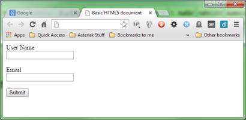

图 25:代码清单 39 生成的通用表单

让我们在样式表中添加以下简单规则:

```css
          :focus
          {
            background-color: beige;
            color: green;
          }

```

代码清单 40:简单焦点 CSS 规则

如果我们重新呈现我们的浏览器，并点击其中一个表单域，使其获得焦点，我们应该会看到它发生了变化，以反映所选的状态。

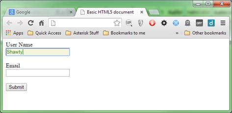

图 26:应用了焦点规则的简单表单

您可能会在示例中注意到，我在没有扩展任何内容的情况下单独使用了`focus`。在 CSS3 中，许多伪选择器现在可以以这种方式使用；它只是意味着将其应用于任何理解选择器的东西。

对于我们的例子，任何可以从用户那里获得焦点的元素，当焦点被赋予时，都会按照指定的方式改变它的颜色。

### 稍微转入访问状态

我只是想简短地打断一下，展示另一个伪选择器，它自从 CSS 规范的 V2 以来就一直存在。可以和`focus`一样单独使用，也可以恶意使用，找出一个人的浏览历史。

如果您在文档中放置一些外部锚点标签，如下所示:

```css
          <ul>
              <li><a href="http://www.google.co.uk/">Google</a></li>
              <li><a href="http://www.yahoo.co.uk/">Yahoo</a></li>
              <li><a href="http://msn.com">MSN</a></li>
          </ul>

```

代码清单 41a:外部网址

然后应用以下样式规则:

```css
          :link
          {
            color: green;
          }

          :visited
          {
            color: red;
          }

```

代码清单 41b:41a 中外部网址的样式

渲染文档时，您将看到以下内容。

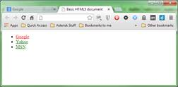

图 27:代码清单 41 呈现的链接

您可能会看到一些甚至所有的链接都是红色的。在我的例子中，只有谷歌链接有，这是因为谷歌英国主网站在我的浏览器历史中，而其他两个没有。

如果你看看 CSS，你会看到样式是由`visited`伪选择器提供的，给你，页面的用户，即时的视觉确认你最近访问了那个页面。

虽然这在表面上看起来是相当无害的，但是如果你深入到引擎盖下，看看在更新的规范中增加的一些新的 JavaScript API，你会发现有一个名为`getComputedStyle`的 API 调用。使用这个调用，有可能获得浏览器中元素上可见的实际计算样式，或者至少它是可见的。

在今天的现代浏览器中，这个漏洞大部分都被修补了，尝试使用这个调用来获取链接的颜色实际上只会返回任何基本颜色。在我们的例子中，我们得到的(即使是谷歌链接)都是绿色。

然而，我听说有传言说可以使用 JQuery 和 MooTools 来检索正确的值并进行区分。

这只是一个小例子，任何东西都可能被用来侵犯用户的隐私或安全，甚至像 CSS 这样常见的东西。尽可能确保你的规则是具体的。仅仅因为您可以在没有规则扩展的情况下全局使用它们，并不意味着您应该这样做。如果你将它们与给定的规则集联系起来，这意味着你的样式规则不会被那些使用浏览器工具的人滥用。

## :禁用和:启用

在 HTML 5 规范中可以应用于元素的许多新属性中，有`disabled`属性。

您可以像使用任何其他属性一样使用它，只需在标记的元素中添加“disabled”即可。

让我们重用我们在代码清单 39 中创建的表单模型，但是对其进行更改，使其看起来如下所示:

```css
          <form action="#" method="post">
              <label for="txtUserName">User Name</label><br />
              <input type="text" id="txtUserName" name="txtUserName" disabled /><br /><br />
              <label for="txtEmail">Email</label><br />
              <input type="text" id="txtEmail" name="txtEmail" /><br /><br />
              <input type="submit" value="Submit" />
          </form>

```

代码清单 42:带有禁用元素的模拟 HTML 表单标记

当您渲染它时，您应该会看到第一个输入元素现在无法使用。

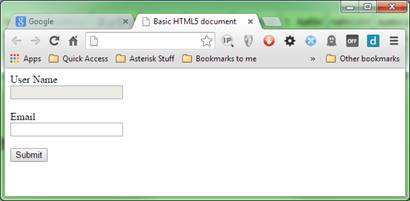

图 28:禁用输入的简单表单

让我们将以下规则添加到样式表中:

```css
          input:disabled
          {
            background-color: red;
            border: 2px solid blue;
          }

```

代码清单 43:设置禁用元素样式的 CSS 规则

当你重新渲染表单时，你会看到一个剧烈的变化。

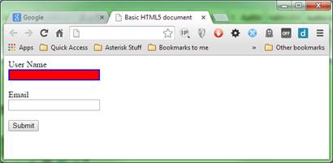

图 29:应用了代码清单 43 中禁用的伪类的简单表单

如果从元素中移除`disabled`属性，输入将恢复到其原始状态。

此规则通常用于在记录编辑器中显示只读字段，或者显示不适用于当前表单的字段。例如，您可以标记一个表单，以便地址字段仅在勾选了向该地址发送邮件的复选框时显示。

如果您使用引导用户界面框架，您可能已经看到，当您用鼠标指针悬停在表单中的某些元素上时，它们上面会显示一个红色的小停止圆。这是以相同的方式执行的，使用禁用的规则来更改鼠标指针的样式。

`enabled`伪选择器在逻辑上与禁用相反，它将给定的样式应用于未禁用的元素，如下例所示:

```css
          input:enabled
          {
            background-color: yellow;
            border: 2px solid green;
          }

```

代码清单 44:支持样式元素的 CSS 规则


图 30:显示应用的已启用 CSS 规则的浏览器表单

当没有理由禁用某个元素时，或者特别是当它没有应用`disabled`属性时，该元素被归类为启用。

请注意，如果元素的布尔`disabled`属性在使用 JavaScript 的文档对象上设置为`true`，则该元素也被归类为禁用。在这种情况下，与其他选择器一样，禁用/启用选择器的应用是基于元素的状态显式应用的，这意味着您不必一直确保正确的元素应用了正确的类。

## :有效和无效

HTML 5 增加的另一个很好的特性是浏览器端验证。通过浏览器端验证，您可以让浏览器在表单提交之前验证表单的输入。

与禁用的选择器一样，这里的伪选择器仅在我们使用规范中提供的额外属性和标记时适用于元素。

再次使用我们的表单，让我们进行另一个更改，以便您拥有以下 HTML 代码:

```css
          <form action="#" method="post">
              <label for="txtUserName">User Name</label><br />
              <input type="text" id="txtUserName" name="txtUserName" required /><br /><br />
              <label for="txtEmail">Email</label><br />
              <input type="email" id="txtEmail" name="txtEmail" /><br /><br />
              <input type="submit" value="Submit" />
          </form>

```

代码清单 45:带有可验证元素的模拟 HTML 表单标记

这些变化起初可能并不明显，但是如果你查看用户名框，你会发现它现在有一个`required`属性。

然而，电子邮件输入不再具有`text`类型；它现在有一种类型的`email`。

如果我们渲染这个，然后点击**提交**而不输入任何值，我们会看到类似如下的内容:

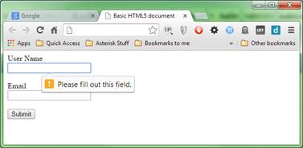

图 31:我们的基本表单显示了所需的属性

如果我们在名称框中添加了一些东西，并在电子邮件框中放入了一些东西，但故意将电子邮件的格式设置错误，我们也会得到电子邮件格式的验证。

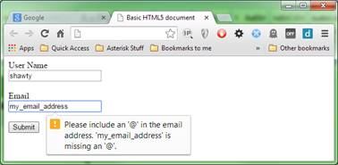

图 32:我们的基本表单显示了正在运行的电子邮件验证

我将在这里展示更多的验证类，但是现在，在您的样式表中添加以下规则:

```css
          input:valid
          {
            background-color: green;
          }

          input:invalid
          {
            background-color: red;
          }

```

代码清单 46: CSS3 验证规则

如果随后呈现页面，您应该会得到以下内容:

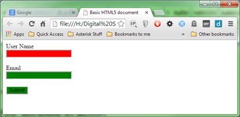

图 33:应用了代码清单 46 中验证样式的简单表单

用户名会立即显示为红色，因为它是必需的，所以在填写之前，它会被归类为无效。

电子邮件是有效的，因为我们只告诉它，它必须将其输入验证为电子邮件地址。我们没有说它是必需的输入，所以有一个空白的电子邮件是有效的。但是，如果您开始输入，它将变为红色，并且不会变回绿色，直到输入正确形成，或者完全移除。

使用`valid`和`invalid`是给用户反馈的好方法，但是表单一显示就立即看到它们通常不被认为是好的做法。

由于这个原因，你通常不会像我一样将它们直接应用于输入元素(事实上，你可以看到我刚刚使用了一个非常广泛的选择器，因为按钮也是绿色的)。通常，您会将它们附加到类/id 名称上，然后在提交表单时使用 JavaScript 检查并应用它们。

因为这本书是关于 CSS 的，所以我不打算在这里详细讨论。如果你想进一步探索 HTML 5 验证的兔子洞，在[我的博客](http://shawtyds.wordpress.com/2014/10/29/html5-validation/)上有一个帖子会让你开始。

## :范围内和范围外

接下来是验证伪选择器，我们有`in-range`和`out-of-range`。这两者的使用方式与上一节中的`valid`和`invalid`相似，但它们处理的场景不同。

文本类型和内容的验证不是添加到新规范中的唯一验证；HTML 5 规范还带来了数字类型和最小/最大范围。

创建另一个虚拟表单，但这一次，让我们定义一个数字范围，而不是用户名和电子邮件输入框。

```css
          <form action="#" method="post">
              <label for="nmbUserAge">User Age</label><br />
              <input type="number" id="nmbUserAge" name="nmbUserAge" min="16" maximum="100" /><br /><br />
              <input type="submit" value="Submit" />
          </form>

```

代码清单 47a:带有数字输入的模拟 HTML 表单

让我们将以下样式应用到表单中:

```css
          input[type=number]:in-range
          {
            background-color: yellow;
          }

          input[type=number]:out-of-range
          {
            background-color: salmon;
          }

```

代码清单 47b:清单 47a 中数字范围表单的样式

当我们渲染表单时，我们最初会看到它使用超出范围的颜色显示，因为它在表单中没有任何价值。

如果我们开始输入值，我们应该会看到颜色的变化，这取决于我们输入的值是在范围内还是范围外。


图 34:加载后的数字范围表单

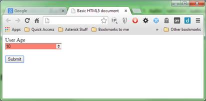

图 35:数值无效的数字范围形式

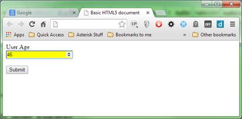

图 36:带有有效值的数字范围表单

## :空

`empty`伪选择器起初看起来像是在元素值为空时使用的，但事实并非如此；当 HTML 元素的内部内容为空时使用。请考虑以下 HTML:

```css
          <div class="mydiv"></div>

```

代码清单 48a:一个空的 div 元素

代码清单 48a 中的`div`是空的——在它周围的开始和结束标签之间没有任何内容。

如果我们现在应用如下规则:

```css
          .mydiv:empty
          {
            /*rules go here*/
          }

```

代码清单 48b:空伪选择器的 CSS 规则

CSS 中定义的任何样式规则都将应用于它。然而，因为实际上没有内容，所以应用改变颜色的规则是非常多余的，除非父元素已经有一个规则显示自己有固定的大小和边框。

当您想要从显示中移除空元素时，`empty`伪元素会派上用场。例如，让我们假设您在用户界面的一个选项卡的末尾有一个消息计数。如果该计数为 0 或没有值，则您不会想要显示一个空的红色圆圈。

在这种情况下，您可以在单独的规则中设置红色徽章的样式，然后设置空规则的样式，如下所示:

```css
          .mydiv:empty
          {
            display: none;
          }

```

代码清单 48c:让一个空元素从显示中消失的 CSS 规则

通过使用无显示定义`empty`选择器，您需要做的就是确保开始和结束标签之间没有任何东西，以使计数从显示中消失。

你可能会注意到，我用“什么都没有”来形容事情，这是故意的。当我们说`empty`选择器匹配一个空标签时，我们指的是 100%空。对我们来说，一个空间可能看起来是空的，但是对 CSS 选择器引擎来说，它被归类为内容，就像把一个空标签分成两行一样。

当你试图追踪一个你确信应该从显示中消失的元素为什么没有从显示中消失时，这可能会非常令人沮丧。我直接知道这有多扯头发。

如果在开始标记和结束标记之间有任何东西，那么空的选择器将不匹配。它最适用于形成小容器的跨度和 div，这些容器的内容是使用 JavaScript 构建和移除的。

由于这个选择器在视觉上的工作方式，我不打算提供屏幕截图。如果您构造一个简单的`div`标签，并将代码清单 48c 中的规则应用于它，然后使用编辑器手动添加或删除内容，您很快就会看到它是如何工作的。

## :勾选

`checked`伪选择器用于处理复选框和单选元素。

前提很简单:如果元素被选中或选中，那么就会应用这个伪规则；否则，它不会。

让我们改变一下表单，这次显示几个复选框和单选按钮，如代码清单 49 所示:

```css
          <form action="#" method="post">
              <label>Check box 1<input type="checkbox" /></label><br />
              <label>Check box 2<input type="checkbox" /></label><br />
              <label>Check box 3<input type="checkbox" /></label><br />
              <label>Check box 4<input type="checkbox" /></label><br />
              <label>Radio Button 1<input type="radio" name="radios" /></label><br />
              <label>Radio Button 2<input type="radio" name="radios" /></label><br />
              <label>Radio Button 3<input type="radio" name="radios" /></label><br />
              <label>Radio Button 4<input type="radio" name="radios" /></label><br />
          </form>

```

代码清单 49:复选框和单选按钮的简单形式

呈现这个应该会给我们一堆相当简单的控件。

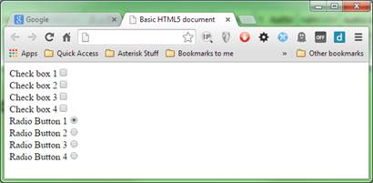

图 37:显示简单复选框和单选控件的表单

由于复选框和单选按钮不会改变颜色，我们将在这个演示中使用稍微不同的策略，并改变控件的大小。将以下规则添加到样式表中:

```css
          input[type="checkbox"], input[type="radio"]
          {
            width: 20px;
            height: 20px;     
          }
          input[type="checkbox"]:checked, input[type="radio"]:checked
          {
            width: 25px;
            height: 25px;
          }

```

代码清单 50: CSS 样式演示了如何使用选中的伪选择器

如果您现在呈现表单，并选中和取消选中一些控件，您应该会在选中的项目上看到小的尺寸变化。


图 38:我们的复选框和单选按钮改变大小

您可能会想，如果很难更改复选框的颜色等属性，为什么要使用这个伪选择器。

直到你开始考虑把它和邻接选择器结合起来，你才开始意识到你可能想如何使用它。

在代码清单 49 的表单中创建一行，如下所示:

```css
          <input type="checkbox" /><span class="checkboxlabel">This is my check box</span>

```

代码清单 51a:添加到前一个表单的行

然后，添加以下 CSS 规则:

```css
          input[type="checkbox"]:checked + span.checkboxlabel
          {
            color: red;
          }

```

代码清单 51b:代码清单 51a 中的线条样式规则

您应该会发现，当您渲染文档时，选中或取消选中复选框不会对复选框本身进行任何更改，但会更改其后面范围的文本颜色。

它这样做是因为我们已经告诉 CSS 引擎，对于任何类型属性等于`checkbox`的输入元素，查看相邻的元素并检查它是否是一个跨度，并且有一个类`checkboxlabel`。如果是，则将该 span 元素的颜色更改为红色。

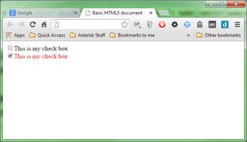

图 39:使用相邻的选择器来设置标签样式的复选框

像这样使用选中的选择器是 UI 工具包(如 Foundation 和 Bootstrap)用来生成切换按钮和自定义单选按钮以及由图标列表组成的检查组的方法。

如果您希望创建自定义复选框，那么您只需要将这种模式与伪元素(如“之前”和“之后”)结合起来，就可以在标记中动态添加/移除内容。

## :之前和之后:

在 CSS3 出现之前，如果您想动态地添加或删除元素和内容，您必须求助于 JavaScript，或者在服务器端进行更改，并使用类似 Ajax 调用的方式重新绘制文档片段。

|  | 注意:Ajax 不是我们将在本书中讨论的内容，因为它与 JavaScript 紧密相关，并且是一个相当复杂的主题。然而，一般来说，Ajax 调用是要求 JavaScript 向 web 服务器发出部分请求以便只获取少量内容的过程。它通常被用作获取小块数据并根据需要将其插入网页的手段，而不是在一次请求中下载整个页面。 |

有了`before`和`after`伪选择器，我们可以在不接触任何一行代码的情况下添加和移除 HTML 元素中的内容，并使用纯 CSS 规则驱动所有内容。

从一个简单的例子开始，假设我们的 HTML 标记中有下面一行:

```css
          <span class="bracketedLabel">This is a bracketed Label</span>

```

代码清单 52a:演示选择器前后的简单跨度

这个标签一点都不特别；如果我们渲染它，我们只得到一个简单的输出。

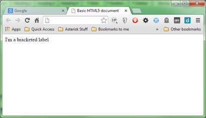

图 40:代码清单 52a 的输出

顾名思义，我们希望这个类的任何标签周围都有方括号，但我们不想去查找所有出现的内容来手动添加它们。

因此，我们可以添加以下 CSS 规则:

```css
          .bracketedLabel
          {
            color: green;
          }
          .bracketedLabel:before
          {
            content: '[';
            color: red;
          }
          .bracketedLabel:after
          {
            content: ']';
            color: red;
          }

```

代码清单 52b:使我们的标签成为带括号的标签所需的 CSS 规则

然后，当我们刷新浏览器输出时，我们会得到以下结果:

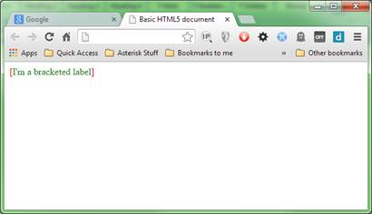

图 41:我们的括号标签现在有括号了

在你们开始匆忙地让前后选择器在你们的文档中添加和移除 HTML 标签之前，我必须告诉你们，不幸的是，你们不能。

虽然前后伪选择器功能强大，但您仅限于纯文本。如果您试图将 HTML 标签放入规则中，那么这些标签将简单地按原样呈现，标签本身作为文本字符串完成。

这有很多原因。假设你有一个元素，通过一个 CSS 规则添加了一个元素，这个元素也添加了一个元素；如果你不小心，你很容易陷入无限循环，一切都会停止。

CSS 规则也被设计为在一次运行中被解析，因此任何插入需要样式化的元素的元素都意味着必须停止，返回并重新处理已经看到的规则，然后返回并继续。

然而，你仍然可以用它们表演一些非常有趣的把戏。

其中一个更好的用途是创建自定义复选框，只使用 CSS3 属性和选择器。为了说明这一点，创建一个包含两个复选框的简单表单。

```css
          <form action="#" method="post">
              <input id="chkCheckboxOne" type="checkbox">
              <label class="checkbox" for="chkCheckboxOne"> Checkbox 1 </label><br />
              <input id="chkCheckboxTwo" type="checkbox">
              <label class="checkbox" for="chkCheckboxTwo"> Checkbox 2 </label>
          </form>

```

代码清单 53:准备定制的复选框和无线电

就像我们前面的复选框示例一样，渲染它只会给我们一种简单的样式:

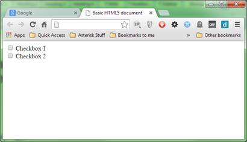

图 42:只是另一个简单的形式

让我们添加第一个规则，并给复选框一些默认样式。

```css
          .checkbox
          {
            display: inline-block;
            cursor: pointer;
            font-size: 20px;
            font-family: sans-serif;
          }

          input[type=checkbox]
          {
            display:none;
          }

```

代码清单 54a:复选框和单选按钮的默认样式

如果此时呈现页面，您可能会惊讶地发现我们隐藏了实际的控件，并且只是设置了标签文本的样式。我们这样做是因为我们不想看到原来的控件，并且因为我们不能用颜色等自定义它们，所以我们只想让它们消失，这样我们就可以绘制自己的新控件。

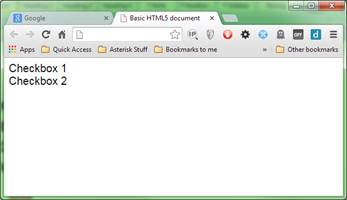

图 43:我们的复选框还在，只是看不见

我们添加的下一个规则是样式表的`before`部分，但是请注意，我们的目标是标签，而不是实际的 checkbox 元素，因为标签才是所有这些的驱动因素。

```css
          .checkbox:before
          {
            content: "";
            display: inline-block;
            width: 18px;
            height: 18px;
            vertical-align: middle;
            background-color: green;
            color: #f3f3f3;
            text-align: center;
            box-shadow: inset 0px 2px 3px 0px rgba(0, 0, 0, .3), 0px 1px 0px 0px rgba(255, 255, 255, .8);
            border-radius: 3px;
          }

```

代码清单 54b:规则的前一部分，绘制控件的未检查版本

渲染这个，我们可以看到我们现在有了一些看起来更像复选框的东西。


图 44:我们有绿色复选框

我们还没有完全完成；我们需要再添加一个规则，这将确保当控件处于选中或选中状态时，我们会看到一个好看的复选符号。

```css
          input[type=checkbox]:checked + .checkbox:before
          {
            content: "\2713";
            text-shadow: 1px 1px 1px rgba(0, 0, 0, .2);
            font-size: 15px;
          }

```

代码清单 54c:完成自定义复选框所需的最后一条规则

当我们渲染它的时候，我们应该会发现我们可以像使用默认复选框一样切换复选框。

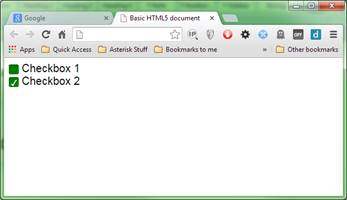

图 45:完成的自定义复选框

这种技术可以用在很多地方；例如，Bootstrap 使用它来定位 Bootstrap UI 框架中输入字段中的图标。

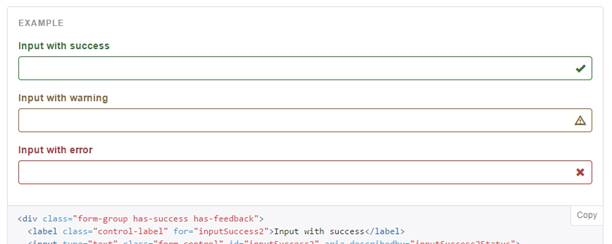

图 46:推特引导对验证图标使用相同的方法

`Before`和`after`可能是两个最灵活的伪选择器，开发社区仍然没有发现它们可以使用的所有方式。

## 第一个 X、最后一个 X 和第 n 个 X

我选择将最后一组作为一个集合来表示，因为它们都是相关的。第一个、最后一个和第 n 个伪选择器用于选择元素列表中元素的第一个、最后一个和用户定义的计数。

这一批中有两个不同的组；我们将看看通用选择器(也就是那些可以选择任何东西的选择器)，然后是特定类型的选择器。这两个组在 CSS3 规范中列出如下:

`first-child`、`last-child`、`nth-child()`

和

`first-of-type`、`last-of-type`、`nth-of-type()`

对于第一组示例，我们将使用下面的 HTML 标记来说明选择器是如何工作的，以及它们可以做什么。

```css
          <ul>
              <li>List Item One</li>
              <li>List Item Two</li>
              <li>List Item Three</li>
              <li>List Item Four</li>
              <li>List Item Five</li>
              <li>List Item Six</li>
              <li>List Item Seven</li>
              <li>List Item Eight</li>
              <li>List Item Nine</li>
              <li>List Item Ten</li>
          </ul>

```

代码清单 55:第一个、最后一个和第 n 个选择器的无序列表标记

到目前为止，我们已经完成了所有其他工作，下面是在浏览器中呈现标记之前的情况:


图 47:代码清单 55 中的非样式列表

像许多可用的选择器一样，它们的名字毫无疑问地描述了它们的功能。让我们对代码清单 55 中的 HTML 应用以下规则。

```css
          ul > li:first-child
          {
            color: red;
          }

          ul > li:last-child
          {
            color: green;
          }

```

代码清单 56:演示“第一个孩子”和“最后一个孩子”伪选择器的 CSS 规则

正如您可能预测的那样，我们无序列表中的第一个和最后一个项目会如预期的那样改变颜色。


图 48:我们使用“第一个孩子”和“最后一个孩子”的列表样式

第一个孩子和最后一个孩子的选择和我们得到的一样简单；n-child()，但是，需要多一点解释。

您可能会注意到，与其他的不同，n-child 后面有一组括号。这是因为与其他选择器不同，第 n 个子接受一个参数来控制它。

该参数采用代数方程的形式，描述了选择什么以及如何选择。

|  | 注意:记住代数:对于许多人来说，在学校做代数是一个遥远的记忆。对于那些记得的人来说，他们可能更希望自己没有。然而，即使你可能想知道它什么时候会派上用场，记住它是如何工作的确实会帮助你在 CSS3 中使用代数表达式。如果你很难记住其中的任何一个，那么现在可能是一个快速复习的好时机。 |

不要害怕；代数方程是描述数字计算应该如何工作的东西，但不一定是实际的答案应该是什么。

许多人会在他们人生的某个阶段遇到类似这样的事情: **1n+5x=6y**

对于那些记得的人来说，这被称为代数，是数学的一个非常专业的分支，许多人连续学习多年。对许多理论数学家来说，解决这些奇怪的方程多少是一种爱好，有些人甚至把一生的时间都花在了简单的理论化这些事情上。

对于那些仍然摸不着头脑的人来说，这一点点代数意味着:

*等式 1 乘以 n 的值，当加到 5 乘以 x 的值时，将总是等于 6 乘以 y 的值，其中 n、x 和 y 是不保持当前值的理论实例。*

别担心，你不需要知道代数的深度来理解第 n 个孩子是如何工作的，但是你需要知道代数是如何工作的。

当您有一个离散值后跟一个理论实例时，该理论实例通常会以某种方式乘以运算符。运算符也可以应用加法和减法，或者只需自行指定即可给出静态值。

例如:

***1*** 的意思就是:1，偏移 1，计数 1，一页，一件事……真的没关系，因为是理论上的。

***1n*** 则表示 **n** 的 1 个数量，或者 **n** 的 1 个乘法；同样， **n** 可以代表任何东西，因为都是理论上的。

***1n+1*** 是指 1 个 n 加上 1。

也许理解这些方程如何工作的一个更简单的方法是想象用它们来执行乘法表。例如，记住 3 乘法表:

***3×0 = 0***

***3×1 = 3***

***3×2 = 6***

***3×3 = 9***

***3×4 = 12***

等等…

现在，假设我们的 **3n** 中的 **n** 是第二列的被乘数(值 0 到 4)；然后，您开始看到 n 如何引用该范围内的任何值。

如果你把结果当作一个静态数字，你会得到下面的静态序列。

***0、3、6、9、12***

让我们冷静一下。

现在回想一下代码清单 55 中的 HTML 元素列表。该列表中有 10 个列表项目子项目，如果我们忘记静态列表中的数字 0 和 12，我们有 3、6 和 9，它们都可以作为偏移量来选择(0 和 12 不是有效项目，因为它们不存在)。

嗯，这正是 n-child()所做的。它使用传递给它的代数方程来准确地确定它需要选择列表中的哪些元素。

让我们将下面的 CSS 规则应用于代码清单 55 中的列表:

```css
          ul > li:nth-child(3n)
          {
            color: red;
          }

```

代码清单 57a:选择每三个元素的第 n 个子 CSS 规则

将会发生的是列表中的每三个元素都会受到规则的影响。


图 49:我们的第 n 个子(3n)规则在起作用

如果我们开始增加一个 **+** 偏移量，我们决定乘法从哪里开始:

```css
          ul > li:nth-child(3n+1)
          {
            color: red;
          }

```

代码清单 57b:从元素 1 开始选择每三个元素的第 n 个子 CSS 规则

这将产生以下结果:

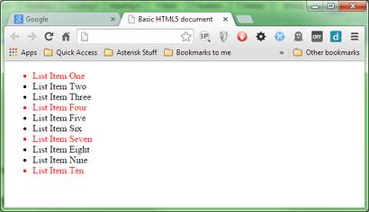

图 50:第 n 个子元素(3n+1)从 1 开始，每隔三个元素选择一个

如您所见，它从元素索引号 1 开始，然后每次应用 3 的乘法来选择每三个项目。

您也可以单独使用一个 **n** ，当使用正偏移时，它允许您选择范围。例如:

```css
          ul > li:nth-child(n+7)
          {
            color: red;
          }

```

代码清单 57c:从 7 开始选择所有内容的第 n 个子 CSS 规则

将从偏移量 7 开始，并简单地选择从该点开始剩下的所有内容。

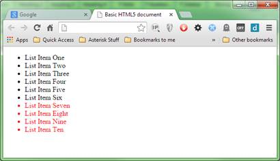

图 51:从 7 开始的第 n 个子选择元素

您也可以通过简单地在 **n** 前面加一个减号来倒推。

```css
          ul > li:nth-child(-n+7)
          {
            color: red;
          }

```

代码清单 57d:第 n 个子 CSS 规则，从 7 开始向后选择所有内容

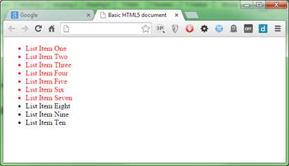

图 52:第 n 个孩子从 7 中向后选择

如果您只想选择列表中的单个编号元素，可以执行以下操作:

```css
          ul > li:nth-child(5)
          {
            color: red;
          }

```

代码清单 57e:只选择索引号 5 的第 n 个子 CSS 规则

直接指定数字索引将只选择该编号元素。

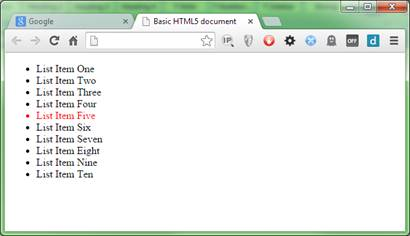

图 53:第 n 个子元素只选择列表中的第五个元素

我可以很容易地用第 n 个子方程的不同组合来填充这本书的其余部分，但我认为我们现在已经有足够的了。

我可以猜测一下你们大多数人现在问自己的问题。

*“我如何使用它来选择和分条表格或网格中的所有行？你能告诉我这个等式是什么吗？”*

好消息是，W3C 标准委员会意识到这可能是第 n 个子伪选择器最常见的用途之一，因此他们添加了几个快捷方式:`even`选择每个偶数元素，`odd`选择每个奇数元素。

如果添加以下规则:

```css
          ul > li:nth-child(odd)
          {
            color: red;
          }

```

代码清单 57f:选择每个奇数元素的第 n 个子 CSS 规则

您应该看到标记中的每个奇数列表项都被选中。

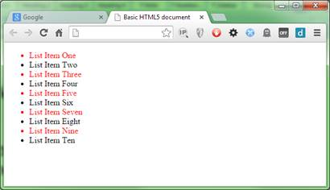

图 54:第 n 个子元素选择每个奇数元素

我想到了这个时候，你可能想让你的大脑休息一下，所以我们暂时把代数抛在脑后。

不过，请注意，我们还有大量资金没有支付。例如，您可以链接第 n 个子选择器(就像您可以链接许多其他选择器一样)，导致一些看起来像这样的疯狂的选择器规则:

***第 n 个子(3n+1):第 n 个子(偶数)***

这将选择从索引 1 开始的每三个元素，但只选择那些索引为偶数的元素。对于 11 个元素，这将只选择索引为 4 和 10 的元素(所有其他元素都是奇数)。

您可以轻松选择范围，然后将这些范围分开。您也可以将这些范围选择与`first-child`和`last-child`组合，只允许您选择范围的开始和结束。这本身就是一个可能保证整本书的主题，到目前为止已经有一些非常聪明的使用`nth-child`伪选择器；但对我们来说，是时候继续前进了。

属于`first`、`last`和`nth`元素选择的第二组伪选择器是`of-type`选择器。

`first-of-type`、`last-of-type`和`nth-of-type`选择器的工作方式都与本章前面描述的通用选择器完全相同，但它们针对的是特定的元素类型。

让我们从代码清单 55 中取出我们的无序列表，稍微修改一下，把它变成一个定义列表。

```css
          <dl>
              <dt>HTML 5</dt>
              <dd>HTML 5 is the markup language used to create documents that are published on the internet</dd>
              <dt>CSS3</dt>
              <dd>CSS3 is the markup language used to add style and colors to documents created using HTML 5</dd>
              <dt>HTTP (Hyper Text Transfer protocol)</dt>
              <dd>HTTP is the mechanism by which HTML 5 documents and their associated resources are transported on the internet</dd>
              <dt>WWW (World Wide Web)</dt>
              <dd>The World Wide Web is the collective name for the many hundreds of thousands of HTML 5 documents published via the internet</dd>
              <dt>The Internet</dt>
              <dd>The internet is a massive global computer network, which amongst other things holds the World Wide Web</dd>
          </dl>

```

代码清单 58:第一个、最后一个和第 n 个选择器的定义列表标记

定义列表与其他类型的列表略有不同。事实上，除了列表项元素之外，其中还存在两种不同类型的子元素:`dt`元素或“定义标题”和`dd`元素或“定义，定义”

如果我们呈现代码清单 58，我们可以看到这两者的默认样式:

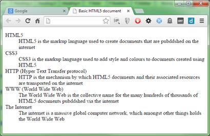

图 55:默认样式的定义列表

如果我们尝试将我们之前的一个规则应用到这个列表中(为了考虑不同的标签类型而稍微修改了一下)，例如，选择每三个孩子的 CSS 规则(代码清单 57a)，我们会发现它并没有完全达到我们预期的效果。

```css
          dl > :nth-child(3n)
          {
            color: red;
          }

```

代码清单 59a:为我们的定义列表修改了第 n 个子规则

它试图选择每三个子元素中的一个，尽管我们可以通过名称来确定目标，但我们可能不得不处理各种各样的列表内容。

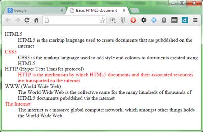

图 56:第 n 个孩子弄错了我们的选择。

但是，如果我们使用`nth-of-type()`:

```css
          dt:nth-of-type(2n)
          {
                 color: red;
          }

```

代码清单 59b:使用“第 n 个类型”CSS 规则代替“第 n 个子类型”

我们很快发现它只影响我们要求它影响的元素。

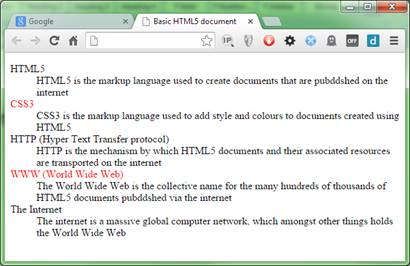

图 57:第 n 种类型得到了我们的选择

`nth-of-type`(就此而言`first-of-type`和`last-of-type`)只考虑指定的目标元素作为选择候选。

在前面的例子中，我们看到了一些可能用于新闻页面的标记；如果你在上面使用`nth-of-type`，你可以像使用`nth-child`一样灵活地选择内容，但是你可以告诉 CSS 选择器引擎只将它应用于文章中的段落元素。

例如，您可以轻松地为所有偶数段落设置与奇数段落不同的颜色，而不管每个部分中有多少段落元素，或者有多少其他元素(如标题)可能存在。

仍然有更多的伪选择器需要覆盖，并且可以通过将它们链接在一起来完成更多的工作；然而，这种潜力远远超出了我们在这里所能描述的范围。

也请记住，一般规则总是先于具体规则。

如果您定义:

```css
          p:nth-child(odd)
          {
            color: blue;
          }

          p
          {
            color: green;
          }

```

代码清单 60:首先是特定的 CSS 规则

你会发现你所有的段落元素都是绿色的。这是因为后一个规则比前一个规则更有针对性，所以前一个规则适用的任何更改都将被后一个规则覆盖。

颠倒这两个规则的顺序可以解决这个问题，所以通用的规则首先将所有东西都变成绿色，然后特定的规则将奇数元素从绿色变成蓝色。

|  | 注意:在撰写本文时，随着 Chrome(和其他浏览器)版本的使用，之前的描述是正确的，因为所有元素确实会变成绿色。然而，两个月后，对规范进行了更新，这意味着第 n 个子规则的特定性优先于示例中的标准元素选择器。这意味着前面的例子现在产生完全相同的结果，不管它们是以什么顺序。这并不意味着你应该突然忽略规则顺序；仍然有很多地方遵守这一点。然而，在这种情况下，这是一个完美的例子，说明这些功能中的许多仍然处于不断变化的状态，所以像往常一样，在决定使用哪些功能以及为什么使用时，要明智地选择。 |

如果你对风格没有在你期望的时间和地点应用有任何问题，首先要检查的是特定性的顺序。

## 总结

在这一章中，我们对 CSS3 中可用的新伪选择器进行了一次旋风(和大脑锻炼)之旅。到目前为止，您应该已经非常清楚如何确定目标并选择需要选择的元素，以及可以选择的方法。

在这一章中，我们学到了大量的东西，并在这一过程中学会了一些巧妙的技巧。现在困难的事情已经过去，是时候坐下来享受轻松的生活了。

从下一章开始，我们将看看你们大多数人一直在等待的东西:眼睛糖果。我们将从每个人最喜欢的开始:圆角、阴影和渐变填充。