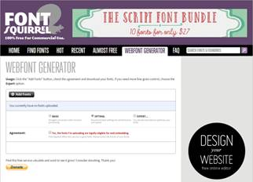
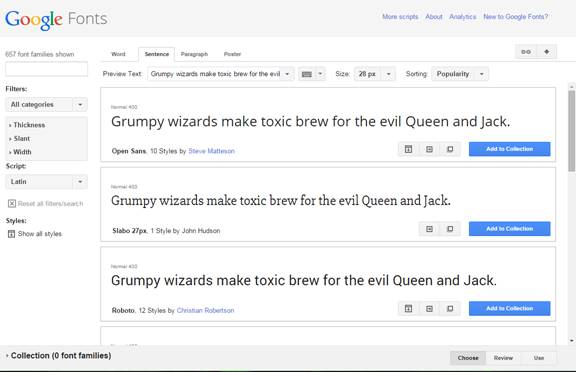
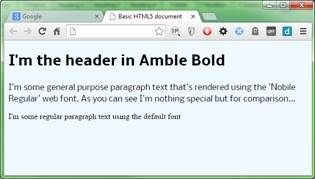

# 七、网页字体

在 HTML/CSS 规范的几乎整个生命周期中，web 开发人员和设计人员都被限制使用相同的核心字体集进行排版。

我已经记不清在这个问题上看到过多少激烈的辩论和讨论，我直接知道客户想要特定字体的文本，却不得不告诉他们这是不可能的，这让我感到沮丧。

如果您想要使用给定的字体，您通常必须在可以访问您想要的字体的艺术包或文字处理器中准备文本，然后将图像保存为浏览器兼容的图像文件，或者从文字处理器中抓取屏幕以在您的 HTML 文档中使用。

不用说，这并不容易。拼写错误和简单的文本更改花费了非常长的时间来纠正(在有人问之前，我多年来至少有一个客户希望正文的每一点都这样做)，除了简单的横幅或标题之外，这真的不切实际。

虽然围绕字体的使用有很多令人沮丧的地方，但是有很好的理由来限制这些东西，这些通常归结为平台差异。

早期的浏览器远不如今天的浏览器具有图形功能，许多操作系统只安装了有限数量的字体，因此 HTML 委员会制定了一个已知字体的列表，几乎可以保证在运行任何图形浏览器的任何平台上都存在。为了记录在案，我们不仅仅是在谈论视窗和苹果电脑——那时，你有更多的 Unix 和 Linux 变体，而且每一种都有自己特定的桌面环境。直到 20 世纪 90 年代初，他们中的许多人才开始标准化，使用 X11 和 Gnome、Kde 等 windows 管理器。甚至 Windows 也至少有四个不同的版本。

几乎总是保证有效的受限基本字体列表是:

*   无衬线字体
*   衬线
*   幻想
*   草书
*   单一间隔

如果您使用其中一种指定字体，您将获得该平台的字体版本，虽然它可能不总是完全相同，但外观、样式和感觉将足够接近，从而不会严重影响您的设计布局。

根据您的平台，您也可以提供要使用的覆盖。通常在 Windows 机器上开发的网站上，您会看到字体描述为:

*时代，《新罗马时代》，衬线*

这样做的意思很简单:试试看你有没有时代字体；如果没有，寻找 times new roman，如果失败了，那么回到' serif '标识符，让平台选择最佳匹配。

不过，你还是不能随便使用任何你喜欢的字体。

例如，如果您指定了`"Impact Bold", sans-serif`，那么任何安装了`"Impact Bold"`的平台都会按照预期显示。如果字体不可用，那么将使用无衬线字体。它可能看起来一点也不像原来的字体，所以许多设计会简单地分崩离析，无法正确呈现。

CSS3 修复了所有这些问题，它提供了将不同格式的字体打包到 web 应用程序中的能力，如果 web 服务器检测到目标平台没有可用的字体，它会让 web 服务器下载并使用这些字体。

这仍然不意味着您不应该使用网络安全字体列表；所需要的只是失去连接，你又回到了起点。然而，这确实意味着您可以指定`"Impact Bold"`，并且有很大的机会在`"Impact Bold`中渲染，在极端情况下显示失败现在很明显。

## 使用网页字体

既然你知道了“为什么”，让我们看看“怎么做”

### 创建合适的字体

也许让字体在你的设计中使用的最简单的方法是使用神奇的字体松鼠网站，它可以用来将你系统中的字体转换成一套即时可用的 CSS3 规则和样式表。

前往[字体松鼠](http://www.fontsquirrel.com/tools/webfont-generator)应该会看到这样的内容(2015 年 1 月 6 日起有效):



图 86:字体松鼠网络字体生成器

使用它很简单；单击，添加字体，然后选择要添加的字体文件。添加了要转换的字体后，必须单击协议框才能继续。字体松鼠会为你转换字体。完成后，它将向您提供一个指向 zip 文件的下载链接，该文件包含几种不同的网络格式的字体，以及一些显示如何使用它的 CSS 文件和 HTML 标记示例。

|  | 注意:关于转换字体的注意事项:转换和使用字体时要非常小心。许多排版供应商对你的要求非常严格，不允许你使用他们的字体。他们中的大多数人把这种在网页上使用的字体转换过程归类为盗版，并且在向网站所有者指出这一点时不太友好。据我所知，有些公司甚至没有收到警告信，只是向不知情的网站所有者收取许可费，要求立即付款。除非您使用的是您知道允许使用的字体，否则请务必检查字体的许可要求。它们中的许多使它变得更加困难，允许您使用字体创建图像并在您的网页中使用它，但是不允许直接使用字体。 |

在网页中使用字体的另一种选择是开源的[谷歌字体目录](https://www.google.com/fonts)。

谷歌强调了这个工具允许网站上列出的所有字体在网页设计中使用。



图 87:谷歌字体(2015 年 1 月)

使用谷歌字体，您可以搜索、过滤和比较列表中的任何字体，然后一旦您决定了想要使用的字体，您就可以将其添加到集合中或查看其使用的快速示例。

快速使用页面特别有用，因为它列出了立即将该字体添加到网页中所需了解的所有信息。通过遵循快速使用页面上的说明并复制和粘贴给定的示例代码，您可以直接从谷歌的全球内容交付网络上使用该字体，因此它加载速度很快，并且您不必麻烦地下载它并将其添加到您自己的网络服务器上。

如果您选择将其添加到收藏中，则可以继续添加其他字体，所有字体都将出现在页面底部的“收藏”面板中。


图 88:谷歌字体收集面板

从这个面板中，你只需要点击**使用**按钮，你将被带到一个看起来和快速使用页面一样的页面来完成集成。

## 手动添加字体

为了完成这一章，我将带你通过一个例子添加你自己的字体到你的网页。我将使用之前使用字体松鼠转换的两种字体，称为 Amble 和 Nobile。如果你去字体松鼠的主页，浏览免费字体列表，你可以找到这两个和更多。你必须下载它们，解压它们，然后使用网络字体生成器工具转换它们。

转换完字体后，打开提供给您的 zip 文件，您会发现许多文件都是以您选择的字体命名的。

查看 Nobile 字体的 zip 文件，您会看到如下内容(我使用的是名为 7-zip 的优秀免费 Zip 程序):


图 89: 7-Zip 显示了我们的字体套件的部分列表

和预期的一样。html 和。css 文件，你会看到你有。ttf，。eot。svg，。woff 和. woff2 文件；这五个扩展名是您实际的字体文件，您需要将这些文件复制到您的 web 服务器上，以便您的页面使用。我一般把它们放在根目录下一个叫做**字体**的文件夹里，这样我就可以把它们都放在一起了。如何做完全取决于你，但是记住 CSS 样式需要能够找到它们，所以你可能需要放一个**..\** 在路径名中使用它们，这取决于你如何组织你的网站。

将两个 zip 文件中的字体文件提取到测试网页要使用的位置，然后在演示文件中创建以下 HTML 标记来测试它们:

```css
          <h1 class="ambleBold">I'm the header in Amble Bold</h1>
          <p class="nobileRegular">
              I'm some general purpose paragraph text that's rendered using the 'Nobile Regular'
              web font. As you can see I'm nothing special but for comparison...
          </p>
          <p>I'm some regular paragraph text using the default font</p>

```

代码清单 68a:演示自定义网页字体使用的 HTML 标记

创建测试 HTML 后，使用以下规则创建样式表:

```css
          body
          {
            background-color: aliceblue;
          }

          @font-face
          {
            font-family: 'amblebold';
            src: url('fonts/amble-bold-webfont.eot');
            src: url('fonts/amble-bold-webfont.eot?#iefix') format('embedded-opentype'),
                 url('fonts/amble-bold-webfont.woff2') format('woff2'),
                 url('fonts/amble-bold-webfont.woff') format('woff'),
                 url('fonts/amble-bold-webfont.ttf') format('truetype'),
                 url('fonts/amble-bold-webfont.svg#amblebold') format('svg');
            font-weight: normal;
            font-style: normal;
          }

          @font-face
          {
            font-family: 'nobileregular';
            src: url('fonts/nobile-regular-webfont.eot');
            src: url('fonts/nobile-regular-webfont.eot?#iefix') format('embedded-opentype'),
                 url('fonts/nobile-regular-webfont.woff2') format('woff2'),
                 url('fonts/nobile-regular-webfont.woff') format('woff'),
                 url('fonts/nobile-regular-webfont.ttf') format('truetype'),
                 url('fonts/nobile-regular-webfont.svg#nobileregular') format('svg');
            font-weight: normal;
            font-style: normal;
          }

          .ambleBold
          {
            font-family: 'amblebold'
          }

          .nobileRegular
          {
            font-family: 'nobileregular'
          }

```

代码清单 68b: CSS 字体规则来设计和使用代码清单 68a 中的 HTML

将适当的字体文件复制到名为**字体**的文件夹中，该文件夹与您的测试 HTML 文档和样式表位于同一位置，如果您将文档加载到浏览器中，您应该会看到以下内容:



图 90:我们使用自定义字体呈现的 HTML

你可以指定任意多的`@font-face`规则。一旦定义了它们，您就可以在任何 CSS 规则中使用您定义它们的名称，您将在其中使用一种原始的网络安全字体。

但是，正如您在我们的演示中看到的，我更喜欢定义一个基于类的规则，其中包含字体名称。这允许我将类名添加到元素的类列表中；然后，如果我需要改变字体，我只需要在一个地方改变它，而不是在几个不同的规则。同样，这取决于你如何在自己的项目中构建它；你唯一要确定的是每个字体定义中的各种`url`关键词都可以下载。

我看到在 IIS web 服务器下的 Windows 平台上工作的开发人员最常见的一个问题是，有时字体无法正确呈现，即使字体文件在那里，CSS 文件也是正确的。出现这种情况的原因是，默认情况下，IIS 没有 woff 和 woff2 字体扩展的 mime 类型列表(在一些旧的版本中，ttf 和 svg 也没有定义)。您可以通过直接在浏览器的地址栏中请求字体来验证这一点。如果字体没有正确的 mime 类型，服务器会显示 404 错误，告诉您找不到字体。

修复起来还是挺容易的，不在这里重复说明了，我就指给你[这篇](http://stackoverflow.com/questions/14793842/browser-does-not-render-woff-fonts-font-face)和[这篇](http://stackoverflow.com/questions/4015816/why-is-font-face-throwing-a-404-error-on-woff-files)吧。这两个环节会给你解决问题所需要知道的一切。

如果这种情况发生在其他服务器上，那么您需要参考该服务器的相应文档来了解如何添加合适的 mime 类型。

## 总结

在这一章中，我们看到了如何使用 CSS3 中的字体功能，如何转换和添加新的字体到我们的网页中，同时也注意到了一些使用它们的注意事项。

接下来，我们将看看生成的内容、计数器和计算。