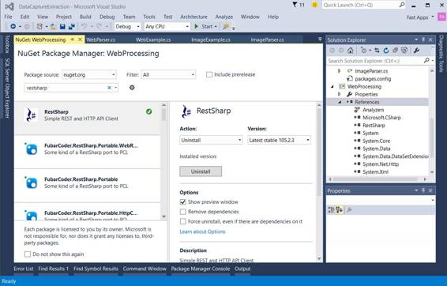
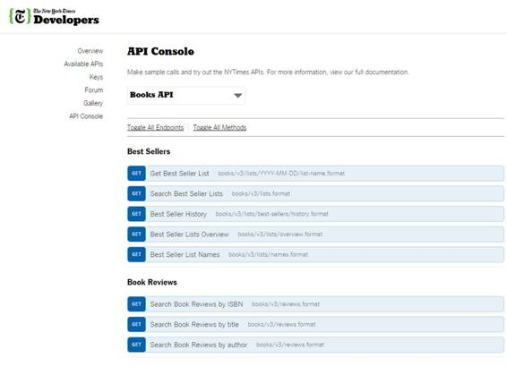
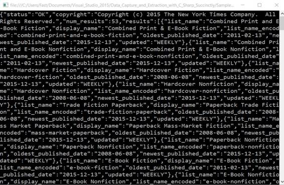
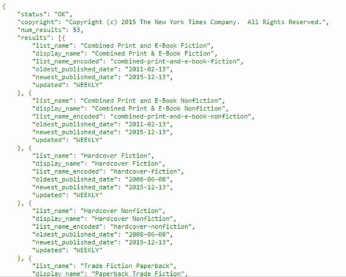

# 三、从 Web 提取器数据

网络已经成为世界在线知识库——一个看似无限的数据和信息池。谷歌作为世界顶级搜索引擎的崛起证明了公众对访问互联网资源的渴望，知道如何从网络中提取数据现在对个人和企业来说都是一项强大的资产。

无论您是寻求新技能的软件开发人员，还是寻求竞争优势的业务领导者，您都会发现本章中的数据提取说明有助于创造您可能从未想过可能出现的新机会。

我们可以使用两种方法之一从网站中提取数据:使用网站提供的应用编程接口或抓取网站的 HTML 内容。我建议使用一个网站的应用编程接口，当它被提供时，作为数据提取的首选方法。如果网站不提供 API，抓取数据可以工作，但请注意，在某些情况下不允许抓取，因为所需信息受版权保护。

此外，使用抓取方法从网络中提取数据可能需要创建类似自动浏览器的代码(网络机器人)。这里我们应该注意到，从技术角度来看，“好的”和“坏的”(有害的)网络机器人之间几乎没有区别。但是，开发人员的意图可能会有所不同。以道德、合法的方式使用您编写的代码和提取的数据是您的责任。您永远不要使用这里的信息来违反版权法、从事非法活动或破坏网络。如果你确实从事了不道德的行为，你要为自己的行为负责。

刮擦的伦理和技术考虑都超出了本书的范围，但是在我们继续之前，其中一些问题值得注意——例如，使用隐形来模拟人类模式，善待您的信息资源提供者，避免您的网络机器人每天在同一时间运行，在节假日和周末停止您的网络机器人，使用随机获取延迟，以及不采取任何导致您的 IP 地址被禁止的行动。

本章将重点介绍如何使用 RestSharp，并理解通过使用站点的应用编程接口提取数据背后的概念。

当一个站点提供其应用编程接口时，它承认通过该应用编程接口提供的数据可以按照其应用编程接口条款使用。换句话说，如果你没有违反 API 准则，你可以使用数据。相比之下，抓取意味着您正在解析 HTML，并从没有提供 API 的网站中提取文本，这反过来意味着您正在进入一个未知的领域，因为数据可能受版权法保护，也可能不受版权法保护。通常，当一个站点不提供应用编程接口时，是因为它不想共享它的信息。

大多数提供应用编程接口的网站使用 [REST](https://en.wikipedia.org/wiki/Representational_state_transfer) ，这允许第三方应用程序和开发人员通过 HTTP(S)消费他们的数据。

使用 C# 时，有几种方法可以连接到 HTTP(S)端点并发出 GET 或 POST 请求我们将使用名为 [RestSharp](http://restsharp.org/) 的库，这使得使用任何 REST API 都变得极其容易。

图 7 显示了 RestSharp 如何作为 NuGet 包安装。



*图 7:用 Visual Studio 2015 将 RestSharp 作为 NuGet 包安装*

一旦安装了 RestSharp，就会向 Visual Studio 项目中添加一个引用。现在让我们看看如何在 C# 中使用 RestSharp。

代码清单 12:创建和使用 RestSharp 网络客户端

```cs

  //
  WebParser: Web extraction using RestSharp.

  using System;
  using RestSharp;

  namespace WebProcessing
  {

  public class WebParser : IDisposable

  {

       protected RestClient WebClient = null;

  protected string response = String.Empty;

  public string Response

  {

  get { return response; }

  }

  public string Request(string resource, Method type, 

       string param, string value)

  {

  string res = String.Empty;

  if (WebClient != null)

  {

  var request = new RestRequest(resource, type);

  request.AddParameter(param, value);

          IRestResponse htmlRes =
  WebClient.Execute(request);

  res = htmlRes.Content;

  if (res != String.Empty)

  response = res;

  }

  return res;

  }

  protected bool
  disposed;

  public WebParser()

  {

  WebClient = null;

  response = String.Empty;

  }

  public WebParser(string baseUrl)

  {

  WebClient = new RestClient(baseUrl);

  }

  ~WebParser() { this.Dispose(false); }

  public virtual void Dispose(bool disposing)

  {

  if (!this.disposed)

  {

  if (disposing)

  WebClient = null;

  }

  this.disposed = true;

  }

  public void
  Dispose()

  {

  this.Dispose(true);

  GC.SuppressFinalize(this);

  }

  }
  }

```

让我们以《纽约时报》(NYT)API 为例来检查代码。在网络解析器构造函数中，通过传递站点的应用编程接口地址的基本网址来创建一个 RestClient 实例。通过查看[图书畅销书 API 文档](http://developer.nytimes.com/docs/books_api/Books_API_Best_Sellers)，我们可以看到这个 API 的基本网址是[http://api.nytimes.com/svc/books](http://api.nytimes.com/svc/books)。


*图 8:畅销书《纽约时报》图书 API 基本 URL*

这个 RestClient 实例称为网络客户端，稍后将在请求方法中使用，以便对指定的应用编程接口资源执行一个 HTTP 请求。

为了理解 RestSharp 是如何工作的，我们首先需要理解 WebParser 类的 Request 方法是如何工作的，以及它处理什么类型的参数。在请求方法内部，创建了一个 RestRequest 实例。此实例接收两个参数:资源和类型。在这种情况下，资源将是{version}/list/names . JSON(即 v3/list/names . JSON)，其中{ version }根据编写时的文档是 v3，类型是 GET (Method。GET)。请注意，资源 v3/list/names . json 以 JavaScript 对象表示法(JSON)格式返回图书畅销书列表的名称，我们将在本章稍后部分对此进行研究。

如果你四处看看，用 [API 控制台](http://developer.nytimes.com/io-docs)做实验，你会更好地理解 API。



*图 9:纽约时报图书 API 控制台*

随着 RestRequest 实例的创建，对 AddParameter 方法的调用是必要的，因为应用编程接口需要传递一个应用编程接口密钥。api 键对应于变量 param 和值，它们分别是“API 键”和您在[http://developer.nytimes.com](http://developer.nytimes.com)上注册特定 NYT API 时收到的 API 键值。

从 RestClient 实例调用 Execute 方法会返回一个 IRestResponse，默认情况下是 JSON 格式(需要解析)。现在，我们将把 JSON 响应视为原始字符串结果。稍后我们将学习如何用另一个方便的工具正确解析 JSON 响应。NET 库。

注册任何 NYT 应用编程接口(为了获得一个应用编程接口密钥)是一个简单的过程——你只需要提供一个电子邮件地址和一个密码。

《纽约时报》的每一个 API 都有自己的 API 键。这意味着图书应用编程接口密钥不同于顶级故事或国会应用编程接口密钥。记住这一点。*纽约时报*在使他们的开发者网站易于跟踪、导航和理解方面做得很好。

检查了网络解析器类是如何工作的，让我们看看如何调用和使用它，以便使用书籍畅销书应用编程接口获得原始的 JSON 响应。

代码清单 13:为 NYT 畅销书列表名调用网络解析器类。

```cs

  //
  WebExample: A wrapper around WebParser.

  using RestSharp;
  using System;

  namespace WebProcessing
  {

  public class WebExample

  {

  public const string cStrNYTBooksBaseUrl = 

  "http://api.nytimes.com/svc/books/";

  public const string cStrNYTBooksResource = "v3/lists/names.json";

  public const string cStrNYTApiKeyStr = "api-key";

  public const string cStrNYTApiKeyVal = 

  "<<Your
  NYT Books API key>>";

  public static string GetRawNYTBestSellersListNames()

  {

    string res = String.Empty;

  using (WebParser wp = new WebParser(cStrNYTBooksBaseUrl))

  {

  res = wp.Request(cStrNYTBooksResource, Method.GET,

  cStrNYTApiKeyStr, cStrNYTApiKeyVal);

  Console.WriteLine(res);

  }

  return res;

  }
          }
  }

```

代码清单 14:调用 NYT 畅销书书单名称的主程序

```cs

  //
  Main Program: Web extraction using the NYT API.

  using System;
  using WebProcessing;

  namespace DataCaptureExtraction
  {

  class Program

  { 

  static void
  Main(string[] args)

  {

  WebExample.GetRawNYTBestSellersListNames();

  Console.ReadLine();

  }

  }
  }

```



*图 10:NYT 畅销书排行榜名产生于 Raw JSON。*

现在我们已经看到了如何获取原始的 JSON 结果，我们可以通过将 JSON 数据序列化并结构化为具有特定字段的对象来最好地理解它。请记住，JSON 数据已经是响应的对象表示，但是它是作为字符串返回的，这意味着它可以序列化为具有特定属性的类。实现这一点的一个简单方法是使用流行的[JSON.NET](http://www.newtonsoft.com/json)库。JSON.NET 可以通过 NuGet 安装。


*图 11:通过 NuGet 安装的 JSON.NET。*

让我们在前面的代码中添加特定的功能，而不是将返回的 JSON 数据视为原始字符串。但是首先，让我们确保理解实际的 JSON 对象是如何构造的。

GetRawNYTBestSellersListNames 以字符串形式返回的原始 JSON 结果实际上是图 12 中的 JSON 对象。这也可以通过检查 [API 控制台](http://developer.nytimes.com/io-docs)来检查。



*图 12:NYT 畅销书排行榜名称返回的 JSON 对象。*

我们可以很快看到，list_name、display_name、list_name_encoded、最旧 _published_date、最新 _published_date 和 update 是我们感兴趣的实际属性。

让我们用 JSON.NET 将这个 JSON 响应反序列化为一个 C# 对象。

代码清单 15:使用 JSON.NET 将 JSON 对象反序列化为 C# 类

```cs

  public T
  DeserializeJson<T>(string res)
  {

  return JsonConvert.DeserializeObject<T>(res);
  }

```

代码清单 15 显示了 JsonConvert 是一个 JSON.NET 类，它将 JSON 对象反序列化为 C# 类。在前面的代码中，C# 类由 T 表示。

t 是一个泛型类类型，但是为了让 JSON.NET 能够正确地反序列化它，它需要用 JSON 对象响应中包含的相同属性来定义。让我们看看这是如何做到的。

代码清单 16:反序列化 JSON 响应所需的 C# 类

```cs

  public class BestSellersListNames
  {

  public string status;

  public string copyright;

  public int
  num_results;

  public BestSellerListNamesItem[] results;
  }

  public class BestSellerListNamesItem
  {

  public string list_name;

  public string display_name;

  public string list_name_encoded;

  public DateTime oldest_published_date;

  public DateTime newest_published_date;

  public string updated;
  }

```

基于代码清单 16，方法 GetRawNYTBestSellersListNames 接下来将用于解析 JSON 响应。

代码清单 17:重新调整 GetRawNYTBestSellersListNames 以解析 JSON

```cs

  public static BestSellersListNames GetNYTBestSellersListNames()
  {

  BestSellersListNames bs = null;

  using (WebParser wp = new WebParser(cStrNYTBooksBaseUrl))

  {

  string res =
  wp.Request(cStrNYTBooksResource, Method.GET,

                   cStrNYTApiKeyStr, cStrNYTApiKeyVal);

  bs = wp.DeserializeJson<BestSellersListNames>(res);

  }

  return bs;
  }

```

能够用 JSON.NET 成功解析 JSON 响应的关键是拥有一个 C# 等价类(定义为一个或多个类)，其属性与 JSON 响应对象中返回的属性相同。请确保使用相同的属性名和相同的数据类型，尽管您可以将 C# 类本身命名为任何适合的名称。请注意，返回的 JSON 对象的属性名称和等效 C# 类的属性名称是相同的。还要注意，数据类型是相同的。

JSON 字符串属性需要一个字符串 C# 字符串属性，而 JSON 日期属性需要一个等效的 C# 日期时间。带有子属性(即结果)的 JSON 数组属性需要一个具有相同子属性名称和数据类型的 C# 数组等价物(即畅销书名网站)。

既然我们已经解决了如何解析 JSON 响应，那么让我们创建一个快速的程序来清楚地显示获得的结果。

清单 18:显示反序列化的 JSON 响应属性

```cs

  //
  WebExample – A wrapper around WebParser.

  using RestSharp;
  using System;
  using System.Collections.Generic;
  using System.Linq;
  using System.Text;
  using System.Threading.Tasks;

  namespace WebProcessing
  {

  public class BestSellersListNames

  {

  public string status;

  public string copyright;

  public int
  num_results;

  public BestSellerListNamesItem[] results;

  }

  public class BestSellerListNamesItem

  {

  public string list_name;

  public string display_name;

  public string list_name_encoded;

  public DateTime oldest_published_date;

  public DateTime newest_published_date;

  public string updated;

  }

  public class WebExample

  {

  public const string cStrNYTBooksBaseUrl = 

  "http://api.nytimes.com/svc/books/";

  public const string cStrNYTBooksResource = "v3/lists/names.json";

  public const string cStrNYTApiKeyStr = "api-key";

  public const string cStrNYTApiKeyVal = 

  "<<Your
  NYT Books API key>>";

  public static void DisplayNYTBestSellersListNames()

  {

  BestSellersListNames b = GetNYTBestSellersListNames();

  if (b != null && b.results.Length > 0)

  {

  foreach (BestSellerListNamesItem i in b.results)

  {

  Console.WriteLine("Name: " + i.display_name);

  Console.WriteLine("Oldest Published Date:
  " + 

  i.oldest_published_date.ToString());

  Console.WriteLine("Newest Published Date:
  " + 

  i.newest_published_date.ToString());

  }

  }
          }

  public static BestSellersListNames GetNYTBestSellersListNames()

  {

  BestSellersListNames bs = null;

  using (WebParser wp = new WebParser(cStrNYTBooksBaseUrl))

  {

  string res = wp.Request(cStrNYTBooksResource,

  Method.GET, cStrNYTApiKeyStr,
  cStrNYTApiKeyVal);

  bs = wp.DeserializeJson<BestSellersListNames>(res);

  }

  return bs;

  }

  }
  }

  //
  Main Program: Web extraction using the NYT API.

  using System;
  using WebProcessing;

  namespace DataCaptureExtraction
  {

  class Program

  { 

  static void
  Main(string[] args)

  {

  WebExample. DisplayNYTBestSellersListNames();

  Console.ReadLine();

   }

  }
  }

```

方法 DisplayNYTBestSellersListNames 调用 GetNYTBestSellersListNames，该方法将反序列化的 JSON 响应作为畅销书列表名称对象获取。正是通过这个畅销书列表名称对象，结果属性被迭代。对于结果中的每个对象，将显示子属性 display_name、最旧 _published_date 和最新 _published_date。

API 可以在数百个站点上访问，它们可以执行各种各样的功能，远远超出了检索信息的范围。寻找其他提供 API 的网站的一个很好的资源是[可编程网页](http://www.programmableweb.com/)。

我们已经看到了如何使用 RestSharp 来调用在线信息源，如 NYT 图书应用编程接口，以及在任何其他提供 REST 应用编程接口的平台上，可以使用 HTTP(S)进行查询。

关于刮擦的最后一句话:这个主题值得拥有自己的书，但是如果你对学习更多感兴趣，我强烈建议你首先考虑通过合法的 API 检索信息，而不是试图从任何网站提取原始的 HTML 内容。

代码清单 19 包含了我们使用 RestSharp 处理的所有示例的全部源代码。

代码清单 19:使用 RestSharp 的完整演示程序源代码

```cs

  //
  Main Program: Web extraction using the NYT API.

  using System;
  using WebProcessing;

  namespace DataCaptureExtraction
  {

  class Program

  { 

  static void
  Main(string[] args)

  {

  WebExample.DisplayNYTBestSellersListNames();

  Console.ReadLine();

  }

  }
  }

  //
  WebExample – A wrapper around WebParser.

  using RestSharp;
  using System;

  namespace WebProcessing
  {

  public class BestSellersListNames

  {

  public string status;

     public string copyright;

  public int
  num_results;

  public BestSellerListNamesItem[] results;

  }

  public class BestSellerListNamesItem

  {

  public string list_name;

  public string display_name;

  public string list_name_encoded;

  public DateTime oldest_published_date;

  public DateTime newest_published_date;

  public string updated;

  }

  public class WebExample

  {

  public const string cStrNYTBooksBaseUrl = 

  "http://api.nytimes.com/svc/books/";

  public const string cStrNYTBooksResource = "v3/lists/names.json";

  public const string cStrNYTApiKeyStr = "api-key";

  public const string cStrNYTApiKeyVal = 

  "<<Your
  NYT Books API key>>";

  public static string GetRawNYTBestSellersListNames()

  {

  string res = String.Empty;

  using (WebParser wp = new WebParser(cStrNYTBooksBaseUrl))

  {

  res = wp.Request(cStrNYTBooksResource, Method.GET,

            cStrNYTApiKeyStr, cStrNYTApiKeyVal);

    Console.WriteLine(res);

  }

  return res;

  }

  public static void DisplayNYTBestSellersListNames()

  {

  BestSellersListNames b = GetNYTBestSellersListNames();

  if (b != null && b.results.Length > 0)

  {

  foreach (BestSellerListNamesItem i in b.results)

  {

  Console.WriteLine("Name: " + i.display_name);

  Console.WriteLine("Oldest Published Date:
  " + 

  i.oldest_published_date.ToString());

  Console.WriteLine("Newest Published Date:
  " + 

  i.newest_published_date.ToString());

  }

  }

  }

  public static BestSellersListNames GetNYTBestSellersListNames()

  {

  BestSellersListNames bs = null;

  using (WebParser wp = new WebParser(cStrNYTBooksBaseUrl))

  {

  string res = wp.Request(cStrNYTBooksResource,

  Method.GET, cStrNYTApiKeyStr,
  cStrNYTApiKeyVal);

  bs = wp.DeserializeJson<BestSellersListNames>(res);

  }

  return bs;

  }

  }
  }

  //
  WebParser: Web extraction using RestSharp.

  using System;
  using RestSharp;
  using Newtonsoft.Json;

  namespace WebProcessing
  {

  public class WebParser : IDisposable

  {

  protected RestClient WebClient = null;

  protected string response = String.Empty;

  public string Response

  {

  get { return response; }

  }

  public string Request(string resource, Method type, string param, 

  string value)

  {

  string res = String.Empty;

  if (WebClient != null)
              {

  var request = new RestRequest(resource, type);

  request.AddParameter(param, value);

  IRestResponse htmlRes =
  WebClient.Execute(request);

  res = htmlRes.Content;

  if (res != String.Empty)

  response = res;

  }

  return res;

  }

  public T
  DeserializeJson<T>(string res)

  {

  return JsonConvert.DeserializeObject<T>(res);

  }

  protected bool
  disposed;

  public WebParser()

  {

  WebClient = null;

  response = String.Empty;

  }

  public WebParser(string baseUrl)

  {

  WebClient = new RestClient(baseUrl);

  }

  ~WebParser()

  {

  this.Dispose(false);

  }

  public virtual void Dispose(bool disposing)

  {

  if (!this.disposed)

  {

  if (disposing)

  {

  WebClient = null;

              }

  }

  this.disposed = true;

  }

  public void
  Dispose()

  {

  this.Dispose(true);

  GC.SuppressFinalize(this);

  }

  }
  }

```

完整的 Visual Studio 项目源代码可以从以下网址下载:

[https://bit bucket . org/syncfusiontech/data-capture-and-extraction-with-c-简洁地](https://bitbucket.org/syncfusiontech/data-capture-and-extraction-with-c-succinctly)