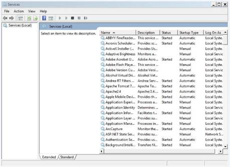

# 零、简介

## 什么是 Windows 服务？

视窗服务，以前被称为视窗服务，是一个可执行的应用程序，运行在自己的视窗会话中，不显示用户界面。它在后台运行，只要 Windows 在运行，它就会运行。它还可以配置为在操作系统启动时启动，或者手动或通过事件启动。因为 Windows 服务在其自己的专用用户帐户的上下文中运行，所以它可以在用户未登录时运行。

### 窗口服务管理

Windows 管理员可以通过几种方式管理服务。其中包括 Sc.exe 命令行工具、Windows Power Shell 和服务管理单元，该管理单元位于 Windows 控制面板的管理工具下，如下图所示。

图 1:服务管理单元

服务管理单元可以连接到本地计算机或网络上的远程计算机，使用户能够执行以下操作:

*   查看所有已安装服务的列表，包括服务名称、描述和配置
*   启动、停止、暂停或重新启动服务
*   更改启动类型。可接受的类型有:
*   自动:服务在系统启动时启动。
*   自动(延迟):该服务在系统完成启动后短时间内启动。
*   手动:服务仅在明确召唤时启动。
*   已禁用:服务已禁用，不会运行。
*   更改服务工作的用户帐户上下文。
*   配置服务失败时应采取的操作。
*   检查服务依赖关系。
*   将服务列表导出到文本文件。

|  | 注意:自动(延迟)选项是在 Windows Vista 中引入的，旨在减少从启动到桌面的时间。但是，并非所有服务都支持延迟启动。 |

### 开发 Windows 服务

可以使用 Visual Studio 开发 Windows 服务。为了成为一个窗口服务，一个程序需要使用提供的模板以特定的方式进行编码。也就是说，它必须处理来自服务控制管理器的启动、停止和暂停消息，服务控制管理器是负责启动和停止服务的 Windows 组件。

|  | 提示:服务必须在 Visual Studio 下的 Windows 服务应用程序项目中创建。 |