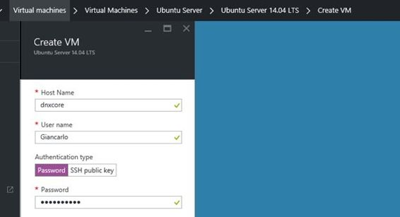
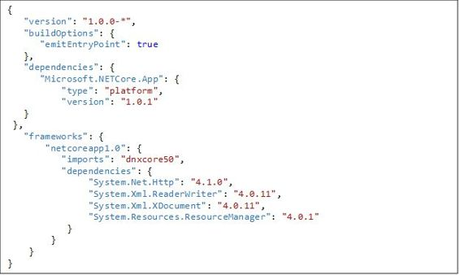
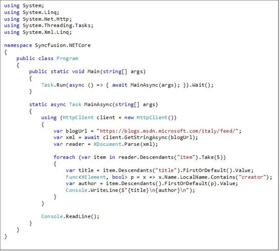
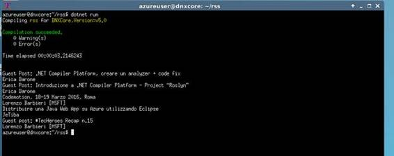

如果你在这本书里读到这里，那么你可能已经读了几十遍了。NET Core 是跨平台的。为了强调这个概念，让我们看看从 0 到一个简单的 *RSS 阅读器*控制台应用需要什么。NET 内核。

因为我不是一个用 Linux 的人，也没有一个搭载 Linux 的物理机，所以我在 Azure 上启动了一个搭载 Ubuntu 14.04 的基本虚拟机。在撰写本文时，不支持 14.04 以上版本的 Ubuntu。在 Azure 上创建虚拟机相当简单。我已经使用了新的门户，图 19 是一个屏幕截图，它基本上告诉你去哪里(沿着顶部菜单栏中的路径)。

图 19:在 Azure 上创建 Ubuntu 虚拟机

一旦 Azure 完成创建我们的虚拟机(这个过程通常需要大约 30 分钟)，我们必须配置我们的 SSL 端点，我们将使用它来配置对我们的 Ubuntu 虚拟机的 RDP 访问。最快的方法是遵循这两个教程: [SSL](https://azure.microsoft.com/en-us/documentation/articles/virtual-machines-linux-classic-log-on/) 和 [RDP](http://c-nergy.be/blog/?p=5305) 。

##  `on Ubuntu`

应用该解决方法后，我们就可以安装了。通过在外壳中键入:

然后安装命令行界面:

图 20:的。在 Ubuntu 上运行的. NET 命令行界面

图 21:运行在 Ubuntu 上的基本 Hello World 应用程序

我们现在准备开始编写我们的 RSS 阅读器。进入任意选择的目录运行``dotnet new`` ，然后这样编辑 project.json 和 Program.cs:

`Project.json`

`Program.cs`

一旦我们准备好了这些文件，我们只需要使用夜间提要做一个简单的``dotnet restore`` [，然后``dotnet run`` 就可以看到如图 22 所示的输出。从代码中可以理解，这款 RSS 阅读器采用了意大利 MSDN 博客的前五篇博文。](https://dotnet.myget.org/F/dotnet-core/)

图 22:用。净核心