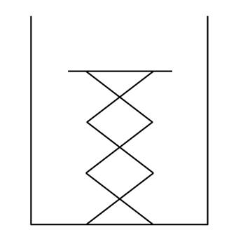
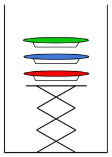
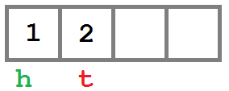
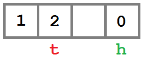
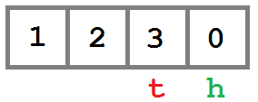

# 四、栈和队列

## 概述

到目前为止，我们已经看到了提供非常基本的数据存储的集合，本质上是对数组的抽象。在本章中，我们将看看当我们添加一些非常基本的行为，完全改变集合的效用时会发生什么。

## 堆叠

栈是以后进先出模式向调用者返回对象的集合。这意味着添加到集合中的最后一个对象将是返回的第一个对象。

栈不同于列表和类似数组的集合。它们不能被直接索引，对象使用不同的方法添加和移除，并且它们的内容比列表和数组更不透明。我这样说的意思是，虽然基于列表的集合提供了`Contains`方法，但是栈没有。此外，栈不可枚举。为了理解这是为什么，让我们来看看什么是栈，以及栈的使用如何驱动这些差异。

一叠最常见的类比之一是餐馆的盘子叠。这是一个简单的弹簧加载装置，清洁板叠放在上面。弹簧确保无论堆叠中有多少板，都可以轻松接近顶板。干净的盘子被添加到堆叠的顶部，当顾客移除盘子时，他或她正在移除最上面的盘子(最近添加的盘子)。

我们从一个空盘子架开始。



图 13:空的板堆(弹簧没有支撑板)

然后我们按照这个顺序在架子上添加一个红色、一个蓝色和一个绿色的盘子。

|  |  |  |

图 14:将红色、蓝色和绿色板添加到板架中

这里要理解的关键点是，随着新板块的加入，它们会被添加到栈的顶部。如果客户取回一个盘子，他或她将获得最近添加的盘子(图 14 中的绿色盘子)。下一个顾客会拿到蓝色的盘子，最后红色的盘子会被拿走。

现在我们了解了栈是如何工作的，让我们定义一些新的术语。

当一个项目被添加到栈中时，使用`Push`方法将其“推”上。当从栈中移除一个项目时，使用`Pop`方法将其“弹出”。栈中最上面的项目，最近添加的，可以使用`Peek`方法“偷看”。窥视允许您查看物品，而无需将其从堆叠中取出(就像货架上的顾客能够看到顶板的颜色一样)。记住这些术语，让我们来看看`Stack`类的实现。

### 类别定义

`Stack`类定义了`Push`、`Pop`和`Peek`方法，一个`Count`属性，并使用`LinkedList<T>`类存储栈中包含的值。

```cs
    public class Stack<T>
    {
        LinkedList<T> _items = new LinkedList<T>();

        public void Push(T value)
        {
            throw new NotImplementedException();
        }

        public T Pop()
        {
            throw new NotImplementedException();
        }

        public T Peek()
        {
            throw new NotImplementedException();
        }

        public int Count
        {
            get;
        }
    }

```

### 推

| 行为 | 将项目添加到栈顶部。 |
| 表演 | *O* (1) |

因为我们使用链表作为后备存储，所以我们需要做的就是将新项目添加到链表的末尾。

```cs
    public void Push(T value)
    {
        _items.AddLast(value);
    }

```

### 流行

| 行为 | 移除并返回添加到栈中的最后一项。如果栈为空，则抛出`InvalidOperationException`。 |
| 表演 | *O* (1) |

`Push`将物品添加到列表的后面，所以我们将从后面“弹出”它们。如果列表为空，则会引发异常。

```cs
    public T Pop()
    {
        if (_items.Count == 0)
        {
            throw new InvalidOperationException("The stack is empty");
        }

        T result = _items.Tail.Value;

        _items.RemoveLast();

        return result;
    }

```

### Peek

| 行为 | 返回添加到栈中的最后一项，但将该项留在栈中。如果栈为空，则抛出`InvalidOperationException`。 |
| 表演 | *O* (1) |

```cs
    public T Peek()
    {
        if (_items.Count == 0)
        {
            throw new InvalidOperationException("The stack is empty");
        }

        return _items.Tail.Value;
    }

```

### 计数

| 行为 | 返回栈中的项数。 |
| 表演 | *O* (1) |

既然栈应该是一个不透明的数据结构，为什么我们有一个`Count`属性？知道栈是否为空(Count == 0)非常有用，尤其是因为`Pop`在栈为空时抛出异常。

```cs
    public int Count
    {
        get
        {
            return _items.Count;
        }
    }

```

### 示例:RPN 计算器

经典的栈示例是反向波兰符号(RPN)计算器。

RPN 语法相当简单。它使用

`<operand> <operand> <operator>`

而不是传统的

`<operand> <operator> <operand>`。

换句话说，我们应该说“4 2 +”，而不是说“4 + 2”如果你想了解 RPN 语法的历史意义，我鼓励你去维基百科或者你最喜欢的搜索引擎。

评估 RPN 的方式，以及栈在实现 RPN 计算器时如此有用的原因，可以在以下算法中看到(栈操作是粗体的):

```cs
    for each input value
        if the value is an integer
            push the value on to the operand stack
        else if the value is an operator
            pop the left and right values from the stack
            evaluate the operator
            push the result on to the stack
    pop answer from stack.

```

因此，给定输入字符串“`4 2 +`”，操作将是:

```cs
    push (4)
    push (2)
    push (pop() + pop())

```

现在栈包含单个值:`6`(答案)。

下面是一个简单计算器的完整实现，该计算器从控制台输入中读取一个等式(例如，“4 2 +”)，在每个空格(例如[“4”、“2”和“+”)拆分输入，并对输入执行 RPN 算法。循环一直持续到输入单词“退出”。

```cs
    void RpnLoop()
    {
        while (true)
        {
            Console.Write("> ");
            string input = Console.ReadLine();
            if (input.Trim().ToLower() == "quit")
            {
                break;
            }
            // The stack of integers not yet operated on.
            Stack<int> values = new Stack<int>();

            foreach (string token in input.Split(new char[] { ' ' }))
            {
                // If the value is an integer...
                int value;
                if (int.TryParse(token, out value))
                {
                    // ... push it to the stack.
                    values.Push(value);
                }
                else
                {
                    // Otherwise evaluate the expression...
                    int rhs = values.Pop();
                    int lhs = values.Pop();

                    // ... and pop the result back to the stack.
                    switch (token)
                    {
                        case "+":
                            values.Push(lhs + rhs);
                            break;
                        case "-":
                            values.Push(lhs - rhs);
                            break;
                        case "*":
                            values.Push(lhs * rhs);
                            break;
                        case "/":
                            values.Push(lhs / rhs);
                            break;
                        case "%":
                            values.Push(lhs % rhs);
                            break;
                        default:
                            throw new ArgumentException(
                                string.Format("Unrecognized token: {0}", token));
                    }
                }
            }

            // The last item on the stack is the result.
            Console.WriteLine(values.Pop());
        }
    }

```

## 队列

队列非常类似于栈，它们提供了一个不透明的集合，对象可以通过在基于列表的集合上增加值的方式添加(入队)或移除(出列)。

队列是先进先出(FIFO)集合。这意味着项目将按照添加的顺序从队列中删除。你可以把排队想象成商店收银台前的一排队伍——人们按照到达的顺序排队接受服务。

队列通常用于应用程序中，以提供一个缓冲区来添加项目供将来处理，或者提供对共享资源的有序访问。例如，如果一个数据库只能处理一个连接，那么可以使用一个队列来允许线程等待轮到它们访问数据库。

### 类别定义

`Queue`和`Stack`一样，有一个`LinkedList`作为后盾。此外，还提供了`Enqueue`(添加项目)、`Dequeue`(移除项目)、`Peek`和`Count`的方法。和`Stack`一样，不会被当作通用集合，意味着不会实现`ICollection<T>`。

```cs
    public class Queue<T>
    {
        LinkedList<T> _items = new LinkedList<T>();

        public void Enqueue(T value)
        {
            throw new NotImplementedException();
        }

        public T Dequeue()
        {
            throw new NotImplementedException();
        }

        public T Peek()
        {
            throw new NotImplementedException();
        }

        public int Count
        {
            get;
        }
    }

```

### 入队

| 行为 | 将项目添加到队列的末尾。 |
| 表演 | *O* (1) |

此实现将该项添加到链表的开头。这个项目也很容易被添加到列表的末尾。真正重要的是，项目排队到列表的一端，从另一端出列(先进先出)。请注意，这与`Stack`类相反，在该类中，项目从同一端添加和移除(后进先出)。

```cs
    Public void Enqueue(T value)
    {
        _items.AddFirst(value);
    }

```

### 出列

| 行为 | 从队列中移除并返回最旧的项目。如果队列为空，则抛出`InvalidOperationException`。 |
| 表演 | *O* (1) |

由于`Enqueue`将项目添加到列表的开头，`Dequeue`必须删除列表末尾的项目。如果队列不包含任何项目，则会引发异常。

```cs
    public T Dequeue()
    {
        if (_items.Count == 0)
        {
            throw new InvalidOperationException("The queue is empty");
        }

        T last = _items.Tail.Value;

        _items.RemoveLast();

        return last;
    }

```

### Peek

| 行为 | 返回如果调用`Dequeue`将返回的下一项。队列保持不变。如果队列为空，则抛出`InvalidOperationException`。 |
| 表演 | *O* (1) |

```cs
    public T Peek()
    {
        if (_items.Count == 0)
        {
            throw new InvalidOperationException("The queue is empty");
        }

        return _items.Tail.Value;
    }

```

### 计数

| 行为 | 返回当前队列中的项目数。如果队列为空，返回`0`。 |
| 表演 | *O* (1) |

```cs
    public int Count
    {
        get
        {
            return _items.Count;
        }
    }

```

## 双端队列

双端队列(deque)通过允许在队列两端添加或删除项目来扩展队列行为。这种新行为在几个问题域中非常有用，特别是任务和线程调度。它通常对实现其他数据结构也很有用。稍后我们将看到[使用一个 deque 来实现另一个数据结构的例子](#_Example_Implementing_a)。

### 类别定义

`Deque`类由[双链表](2.html#_Doubly_Linked_List)支持。这允许我们在列表的前面或后面添加和删除项目，并访问`First`和`Last`属性。`Queue`类和`Deque`类的主要变化是`Enqueue`、`Dequeue`和`Peek`方法被加倍为`First`和`Last`变体。

```cs
    public class Deque<T>
    {
        LinkedList<T> _items = new LinkedList<T>();

        public void EnqueueFirst(T value)
        {
            throw new NotImplementedException();
        }

        public void EnqueueLast(T value)
        {
            throw new NotImplementedException();
        }

        public T DequeueFirst()
        {
            throw new NotImplementedException();
        }

        public T DequeueLast()
        {
            throw new NotImplementedException();
        }

        public T PeekFirst()
        {
            throw new NotImplementedException();
        }

        public T PeekLast()
        {
            throw new NotImplementedException();
        }

        public int Count
        {
            get;
        }
    }

```

### 入队

排队优先

| 行为 | 将提供的值添加到队列头。这将是`DequeueFirst`出列的下一个项目。 |
| 表演 | *O* (1) |

```cs
    public void EnqueueFirst(T value)
    {
        _items.AddFirst(value);
    }

```

#### 排队最后

| 行为 | 将提供的值添加到队列的尾部。这将是`DequeueLast`出列的下一个项目。 |
| 表演 | *O* (1) |

```cs
    public void EnqueueLast(T value)
    {
        _items.AddLast(value);
    }

```

### 出列

先出列

| 行为 | 移除并返回 deque 中的第一项。如果目标为空，则抛出`InvalidOperationException`。 |
| 表演 | *O* (1) |

```cs
    public T DequeueFirst()
    {
        if (_items.Count == 0)
        {
            throw new InvalidOperationException("DequeueFirst called when deque is empty");
        }

        T temp = _items.Head.Value;

        _items.RemoveFirst();

        return temp;
    }

```

#### 出列最后一个

| 行为 | 移除并返回列表中的最后一项。如果目标为空，则抛出`InvalidOperationException`。 |
| 表演 | *O* (1) |

```cs
    public T DequeueLast()
    {
        if (_items.Count == 0)
        {
            throw new InvalidOperationException("DequeueLast called when deque is empty");
        }

        T temp = _items.Tail.Value;

        _items.RemoveLast();

        return temp;
    }

```

### 先看

| 行为 | 返回 deque 中的第一项，但保持集合不变。如果目标为空，则抛出`InvalidOperationException`。 |
| 表演 | *O* (1) |

```cs
    public T PeekFirst()
    {
        if (_items.Count == 0)
        {
            throw new InvalidOperationException("PeekFirst called when deque is empty");
        }

        return _items.Head.Value;
    }

```

### 浏览最后

| 行为 | 返回 deque 中的最后一项，但保持集合不变。如果目标为空，则抛出`InvalidOperationException`。 |
| 表演 | *O* (1) |

```cs
    public T PeekLast()
    {
        if (_items.Count == 0)
        {
            throw new InvalidOperationException("PeekLast called when deque is empty");
        }

        return _items.Tail.Value;
    }

```

### 计数

| 行为 | 返回当前德格中的项数，如果德格为空，则返回`0`。 |
| 表演 | *O* (1) |

```cs
    public int Count
    {
        get
        {
            return _items.Count;
        }
    }

```

### 示例:实现栈

deq 经常被用来实现其他数据结构。

我们已经看到了一个使用`LinkedList`实现的栈，所以现在让我们看看一个使用`Deque`实现的栈。

你可能想知道为什么我会选择使用`Deque`而不是`LinkedList`来实现`Stack`。原因之一是性能和代码可重用性。链表的代价是每个节点的开销和降低的数据局部性——项目在堆中分配，内存位置可能彼此不靠近，从而在中央处理器和内存硬件级别导致大量缓存未命中和页面错误。一个性能更好的队列实现可能使用数组而不是列表作为后备存储。这将减少每个节点的开销，并通过解决一些局部性问题来提高性能。

然而，将`Stack`或`Queue`实现为数组是一个更复杂的实现。通过以这种更复杂的方式实现`Deque`，并将其用作其他数据结构的基础，我们可以实现所有结构的性能优势，而只需编写一次代码。这加快了开发时间并降低了维护成本。

在本章的后面，我们将看一个`Deque`作为数组的例子，但是首先让我们看一个使用`Deque`实现的`Stack`的例子。

```cs
    public class Stack<T>
    {
        Deque<T> _items = new Deque<T>();

        public void Push(T value)
        {
            _items.EnqueueFirst(value);
        }

        public T Pop()
        {
            return _items.DequeueFirst();
        }

        public T Peek()
        {
            return _items.PeekFirst();
        }

        public int Count
        {
            get
            {
                return _items.Count;
            }
        }
    }

```

请注意，所有的错误检查现在被推迟到`Deque`并且对`Deque`所做的任何优化或错误修复将自动应用到`Stack`类。实现一个`Queue`同样简单，因此留给读者做练习。

### 数组后备存储器

如前所述，使用数组而不是链表作为`Deque<int>`(一组整数)的后备存储有很多好处。从概念上看，这似乎很简单，但实际上有几个问题需要解决才能成功。

让我们用图表的方式来看看其中的一些问题，然后看看我们可以如何处理它们。在此过程中，请记住[数组列表](3.html#_Chapter_3_)一章中讨论的增长政策问题，这些问题同样适用于此。

创建集合时，它是一个 0 长度的数组。让我们看看一些动作如何影响内部数组。当我们看这个的时候，注意图中绿色的“h”和红色的“t”分别指的是“头”和“尾”。头和尾是指示队列中第一个和最后一个项目的数组索引。随着我们添加和删除项目，头部和尾部之间的交互将变得更加清晰。

```cs
    Deque<int> deq = new Deque<int>();
    deq.EnqueueFirst(1);

```


图 15:向 deque 的前面添加一个值

```cs
    deq.EnqueueLast(2);

```



图 16:向 deque 的末尾添加一个值

```cs
    deq.EnqueueFirst(0);

```



图 17:在 deque 的前面添加另一个值；头部索引环绕

注意此时发生了什么。头部索引已经绕到数组的末尾。现在，deque 中的第一项`DequeueFirst`将返回数组索引 3 (0)处的值。

```cs
    deq.EnqueueLast(3);

```



图 18:向 deque 的末尾添加一个值

此时，数组被填充。添加另一个项目时，将出现以下情况:

1.  增长策略将定义新数组的大小。
2.  项目将从头到尾复制到新数组中。
3.  将添加新项目。
    1.  `EnqueueFirst`–项目在索引 0 处添加(复制操作使其保持打开状态)。
    2.  `EnqueueLast`–该项目被添加到数组的末尾。

```cs
    deq.EnqueueLast(4);

```


图 19:在展开的 deque 的末尾添加一个值

现在让我们看看当物品从`Deque`中移除时会发生什么。

```cs
    deq.DequeueFirst();

```


图 20:从展开的视图中移除第一个项目

```cs
    deq.DequeueLast();

```


图 21:从展开的列表中移除最后一项

需要注意的关键点是，不考虑内部数组的容量，`Deque`的逻辑内容是从头索引到尾索引的项，考虑到需要在数组末尾换行。提供从头到尾环绕行为的数组通常称为循环缓冲区。

了解了数组逻辑的工作原理后，让我们来深入研究一下代码。

### 类别定义

基于数组的`Deque`方法和属性与基于列表的相同，这里不再赘述。但是，列表已经被替换为一个数组，现在有三个属性来包含大小、头部和尾部信息。

```cs
    public class Deque<T>
    {
        T[] _items = new T[0];

        // The number of items in the queue.
        int _size = 0;

        // The index of the first (oldest) item in the queue.
        int _head = 0;

        // The index of the last (newest) item in the queue.
        int _tail = -1;
    ...
    }

```

### 入队

增长政策

当内部数组需要增长时，需要运行增加数组大小、复制数组内容和更新内部索引值的算法。`Enqueue`方法执行该操作，由`EnqueueFirst`和`EnqueueLast`调用。`startingIndex`参数用于确定是否让索引 0 处的数组槽保持打开状态(在`EnqueueFirst`的情况下)。

特别注意在从头到尾的遍历需要绕过数组的末尾回到 0 的情况下，数据是如何展开的。

```cs
    private void allocateNewArray(int startingIndex)
    {
        int newLength = (_size == 0) ? 4 : _size * 2;

        T[] newArray = new T[newLength];

        if (_size > 0)
        {
            int targetIndex = startingIndex;

            // Copy the contents...
            // If the array has no wrapping, just copy the valid range.
            // Else, copy from head to end of the array and then from 0 to the tail.

            // If tail is less than head, we've wrapped.
            if (_tail < _head)
            {
                // Copy the _items[head].._items[end] -> newArray[0]..newArray[N].
                for (int index = _head; index < _items.Length; index++)
                {
                    newArray[targetIndex] = _items[index];
                    targetIndex++;
                }

                // Copy _items[0].._items[tail] -> newArray[N+1]..
                for (int index = 0; index <= _tail; index++)
                {
                    newArray[targetIndex] = _items[index];
                    targetIndex++;
                }
            }
            else
            {
                // Copy the _items[head].._items[tail] -> newArray[0]..newArray[N]
                for (int index = _head; index <= _tail; index++)
                {
                    newArray[targetIndex] = _items[index];
                    targetIndex++;
                }
            }

            _head = startingIndex;
            _tail = targetIndex - 1; // Compensate for the extra bump.
        }
        else
        {
            // Nothing in the array.
            _head = 0;
            _tail = -1;
        }

        _items = newArray;
    }

```

#### 排队优先

| 行为 | 将提供的值添加到队列头。这将是`DequeueFirst`出列的下一个项目。 |
| 表演 | *O* (1)多数情况下； *O* ( *n* )需要成长的时候。 |

```cs
    public void EnqueueFirst(T item)
    {
        // If the array needs to grow.
        if (_items.Length == _size)
        {
            allocateNewArray(1);
        }

        // Since we know the array isn't full and _head is greater than 0,
        // we know the slot in front of head is open.
        if (_head > 0)
        {
            _head--;
        }
        else
        {
            // Otherwise we need to wrap around to the end of the array.
            _head = _items.Length - 1;
        }

        _items[_head] = item;

        _size++;
    }

```

#### 排队最后

| 行为 | 将提供的值添加到队列的尾部。这将是`DequeueLast`出列的下一个项目。 |
| 表演 | *O* (1)多数情况下； *O* ( *n* )需要成长的时候。 |

```cs
    public void EnqueueLast(T item)
    {
        // If the array needs to grow.
        if (_items.Length == _size)
        {
            allocateNewArray(0);
        }

        // Now we have a properly sized array and can focus on wrapping issues.
        // If _tail is at the end of the array we need to wrap around.
        if (_tail == _items.Length - 1)
        {
            _tail = 0;
        }
        else
        {
            _tail++;
        }

        _items[_tail] = item;
        _size++;
    }

```

### 出列

先出列

| 行为 | 移除并返回 deque 中的第一项。如果目标为空，则抛出`InvalidOperationException`。 |
| 表演 | *O* (1) |

```cs
    public T DequeueFirst()
    {
        if (_size == 0)
        {
            throw new InvalidOperationException("The deque is empty");
        }

        T value = _items[_head];

        if (_head == _items.Length - 1)
        {
            // If the head is at the last index in the array, wrap it around.
            _head = 0;
        }
        else
        {
            // Move to the next slot.
            _head++;
        }

        _size--;

        return value;
    }

```

#### 出列最后一个

| 行为 | 移除并返回列表中的最后一项。如果目标为空，则抛出`InvalidOperationException`。 |
| 表演 | *O* (1) |

```cs
    public T DequeueLast()
    {
        if (_size == 0)
        {
            throw new InvalidOperationException("The deque is empty");
        }

        T value = _items[_tail];

        if (_tail == 0)
        {
            // If the tail is at the first index in the array, wrap it around.
            _tail = _items.Length - 1;
        }
        else
        {
            // Move to the previous slot.
            _tail--;
        }

        _size--;

        return value;
    }

```

### 先看

| 行为 | 返回 deque 中的第一项，但保持集合不变。如果目标为空，则抛出`InvalidOperationException`。 |
| 表演 | *O* (1) |

```cs
    public T PeekFirst()
    {
        if (_size == 0)
        {
            throw new InvalidOperationException("The deque is empty");
        }

        return _items[_head];
    }

```

### 浏览最后

| 行为 | 返回 deque 中的最后一项，但保持集合不变。如果目标为空，则抛出`InvalidOperationException`。 |
| 表演 | *O* (1) |

```cs
    public T PeekLast()
    {
        if (_size == 0)
        {
            throw new InvalidOperationException("The deque is empty");
        }

        return _items[_tail];
    }

```

### 计数

| 行为 | 返回当前德格中的项目数，如果德格为空，则返回`0`。 |
| 表演 | *O* (1) |

```cs
    public int Count
    {
        get
        {
            return _size;
        }
    }

```