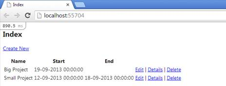
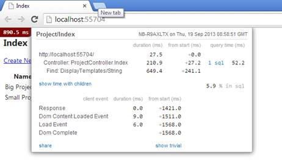

# 十、跟踪和分析

## 获取查询的 SQL

LINQ 和实体 SQL 查询由实体框架翻译成 SQL。它们都提供了一种查看生成的 SQL 是什么样子的方法；这是通过 [ToTraceString](http://msdn.microsoft.com/en-us/library/system.data.objects.objectquery.totracestring.aspx) 方法实现的，该方法是 [ObjectQuery < T >](http://msdn.microsoft.com/en-us/library/system.data.objects.objectquery.aspx) 类的公共方法。代码优先的 LINQ 实现也有办法达到这个[目标查询<T>T5】，但是需要反思。这是一个通用跟踪方法的可能实现。](http://msdn.microsoft.com/en-us/library/system.data.objects.objectquery.aspx)

```cs
public static String ToSqlString<TEntity>(this IQueryable<TEntity> queryable) 
where TEntity : class
{
  ObjectQuery<TEntity> objectQuery = null;

  if (queryable is ObjectQuery<TEntity>)
  {
    objectQuery = queryable as ObjectQuery<TEntity>;
  }
  else if (queryable is DbQuery<TEntity>)
  {
    var dbQuery = queryable as DbQuery<TEntity>;
    var iqProp = dbQuery.GetType().GetProperty("InternalQuery", 
BindingFlags.Instance | BindingFlags.NonPublic | BindingFlags.Public);
    var iq = iqProp.GetValue(dbQuery); 
    var oqProp = iq.GetType().GetProperty("ObjectQuery", BindingFlags.Instance | 
BindingFlags.NonPublic | BindingFlags.Public);

    objectQuery = oqProp.GetValue(iq) as ObjectQuery<TEntity>;
  }
  else
  {
    throw (new ArgumentException("queryable"));
  }

  var sqlString = objectQuery.ToTraceString();

  foreach (var objectParam in objectQuery.Parameters)
  {
    if ((objectParam.ParameterType == typeof(String)) 
    || (objectParam.ParameterType == typeof(DateTime)) 
    || (objectParam.ParameterType == typeof(DateTime?)))
    {
      sqlString = sqlString.Replace(String.Format("@{0}", objectParam.Name), 
      String.Format("'{0}'", objectParam.Value.ToString()));
    }
    else if ((objectParam.ParameterType == typeof(Boolean)) 
    || (objectParam.ParameterType == typeof(Boolean?)))
    {
      sqlString = sqlString.Replace(String.Format("@{0}", objectParam.Name), 
String.Format("{0}", Boolean.Parse(objectParam.Value.ToString()) ? 1 : 0));
    }
    else
    {
      sqlString = sqlString.Replace(String.Format("@{0}", objectParam.Name), 
String.Format("{0}", objectParam.Value.ToString()));
    }
  }

  return (sqlString);
}

```

该方法将提取[返回的 SQL 字符串到字符串](http://msdn.microsoft.com/en-us/library/system.data.objects.objectquery.totracestring.aspx)，并用实际参数值替换参数占位符。您可以在任何[IQueryable<T>T3】实现上使用它。如果该参数已经是一个](http://msdn.microsoft.com/en-us/library/bb351562.aspx)[对象查询< T >](http://msdn.microsoft.com/en-us/library/system.data.objects.objectquery.aspx) ，那么它是直接了当的，如果它是一个[数据库查询<T>T7】(一个来自代码优先的 LINQ 查询)，它首先从中提取底层的](http://msdn.microsoft.com/en-us/library/gg696530.aspx)[对象查询<T>T9】。](http://msdn.microsoft.com/en-us/library/system.data.objects.objectquery.aspx)

```cs
//get the SQL for an Entity SQL query
var finishedProjectsSQL = octx.CreateQuery<Project>(
"SELECT VALUE p FROM Projects AS P WHERE p.[End] IS NOT NULL").ToTraceString();

//get the SQL for an Entity SQL query
var projectsStartingAWeekAgoSQL = (from p in ctx.Projects where p.Start == 
DateTime.Today.AddDays(-1) select p).ToSqlString();

//get the SQL for all the Projects using the ToSqlString extension method
var allProjectsSQL = ctx.Projects.ToSqlString();

```

## 微型先验仪

[MiniProfiler](http://miniprofiler.com/) 是一个开源项目，为 ASP.NET MVC 和实体框架提供了一个代码分析器。我将演示如何在 MVC 项目中使用它，但是除了 MVC 控制台之外，它还可以用在 Windows 窗体、控制台甚至 Web 窗体应用中。

要使用它，需要先从 [NuGet](http://www.nuget.org/packages/MiniProfiler/) 获取它的核心包。


然后是 [MVC](http://www.nuget.org/packages/MiniProfiler.MVC3/) 和 [EF](http://www.nuget.org/packages/MiniProfiler.EF/) 套餐。


在你的 web 应用的**全局**类中，你需要在 **Application_Start** 方法中添加以下几行。

```cs
MiniProfilerEF.Initialize();
MiniProfiler.Settings.SqlFormatter = new SqlServerFormatter();

```

在布局视图(或母版页，取决于您选择的视图引擎)中，您需要添加一个特定的方法调用来添加所需的 JavaScript。

对于 Razor，将是**~ view \ Shared \u layout . cshtml**文件。

```cs
@StackExchange.Profiling.MiniProfiler.RenderIncludes()

```

而对于 ASPX 来说，它将是主页**~视图\共享\站点。主**。

```cs
<%@: StackExchange.Profiling.MiniProfiler.RenderIncludes() %>

```

完成后，您将开始在每个页面的左上角看到 MiniProfiler 控制台。



图 54: MiniProfiler 指示器

通过点击它，它将展开并显示当前请求的一些统计数据。



图 55: MiniProfiler MVC 控制台

到目前为止，这与实体框架无关，但是如果你点击 **sql** 链接，那么所有的乐趣都开始了。


图 56:迷你分析器 SQL 控制台

MiniProfiler 将向您显示作为当前 web 请求的一部分执行的所有查询，将检测重复的查询，还将显示一些其他问题，如 SELECT N+1。

如果不想使用 MVC 控制台，仍然可以从当前的探查器实例中获取相关信息。

```cs
//some statistics        
var nonQueriesCount = MiniProfiler.Current.ExecutedNonQueries;
var readersCount = MiniProfiler.Current.ExecutedReaders;
var scalarsCount = MiniProfiler.Current.ExecutedScalars;
var duration = MiniProfiler.Current.DurationMillisecondsInSql;

//all queries executed as part of the current request     
var timings = MiniProfiler.Current.GetSqlTimings();
var sql = timings.First().FormattedCommandString;
var isDuplicate = timings.First().IsDuplicate;
var stackTrace = timings.First().StackTraceSnippet;
var parameters = timings.First().Parameters;

```

## SQL Server 事件探查器

[SQL Server Profiler](http://technet.microsoft.com/en-us/library/ms181091.aspx) 是一个无价的工具，从 2005 年开始包含在 SQL Server 的商业版本中。简而言之，它允许您实时监控发送到数据库的 SQL。

通过使用 SQL Server Profiler，您可以了解实体框架在背后做什么。对于`ctx.Projects.OrderBy(x => x.Start).ToList()`这样的简单查询，会发出如下的 SQL。


图 57: SQL Server 事件探查器输出

您注意到“应用名称”栏了吗？实体框架总是将应用名称设置为“EntityFrameworkMUE”，这样您总是可以知道它发送了哪些 SQL 查询，并且您可以在 SQL Server Profiler 上创建一个过滤器来仅显示这些条目。如果需要，可以通过在连接字符串中提供应用名称参数来指定不同的应用名称。

```cs
<connectionStrings>
  <add name="ProjectsContext" 
  connectionString="Data Source=.\SQLEXPRESS;Integrated Security=SSPI;
  Initial Catalog=Succinctly;MultipleActiveResultSets=true;Application Name=ProjectsContext"
  providerName="System.Data.SqlClient"/>
</connectionStrings>

```