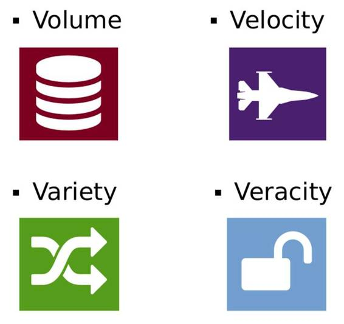
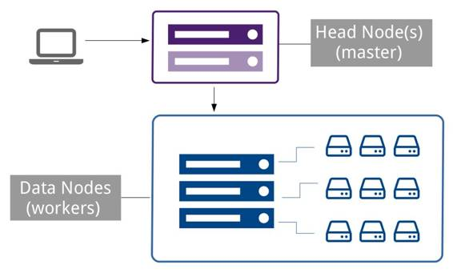
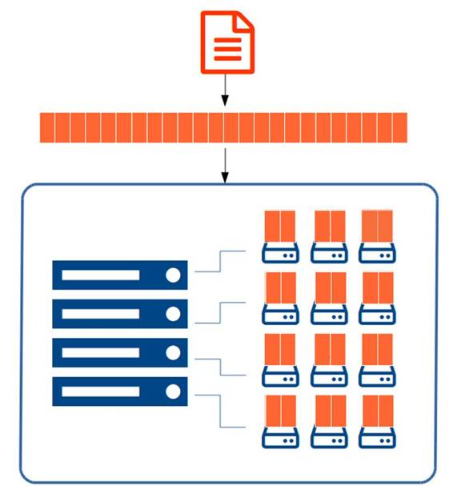

# 一、Hadoop 简介

Hadoop 是一个大数据平台，具有两个功能——将大量数据存储在安全、可靠的存储中，以及以高效的方式对这些数据运行复杂的查询。在 Hadoop 中，存储和计算都运行在同一组服务器上，并且两个功能都是容错的，这意味着您可以从商用硬件构建高性能集群。

Hadoop 的关键特性是它可以不断扩展。随着数据需求的增长，您可以通过添加更多服务器来扩展集群。相同的查询将在具有 1，000 个节点的集群上以与在具有 5 个节点的集群上完全相同的方式运行(只是速度快得多)。

Hadoop 是一个来自 Apache 的免费开源项目。从 2006 年开始就有了，平台上一次重大变化是在 2013 年。Hadoop 是一个稳定而成熟的产品，已经变得非常受欢迎，并且随着数据成为每个业务的核心部分，它的受欢迎程度也在增加。Hadoop 只需要最少的投资就可以开始，这是一个关键特性，它允许您快速启动一个开发 Hadoop 环境，并运行一些您自己的数据，看看它是否适合您。

Hadoop 的另一个主要吸引力是它的生态系统。Hadoop 本身是一个概念上简单的软件——它一方面进行分布式存储，另一方面进行分布式计算。但是两者的结合给了我们一个坚实的基础，让我们可以充分利用其他项目。Hadoop 是一系列其他大数据工具的核心，例如用于实时大数据的 HBase、用于使用类似于 SQL 的语言查询大数据的 Hive 以及用于编排和安排工作的 ozie。

Hadoop 是一套大数据工具的核心，目前流行的热门产品，如 Spark 和 Nifi，仍然将 Hadoop 放在首位。这意味着对 Hadoop 的良好理解将帮助您充分利用您使用的其他工具，并最终从您的数据中获得更好的洞察力。

我们将了解 Hadoop 如何工作，集群内部发生了什么，如何将数据移入和移出 Hadoop，以及如何高效地查询数据。Hadoop 主要是一个 Java 平台，标准的查询工具是 Java MapReduce 框架。我们不会深入研究 MapReduce，但我们将浏览一个 Java 示例，并学习如何用 Python 和. NET 编写相同的查询。我们将探索 Hadoop 的商业发行版，并以更广泛的 Hadoop 生态系统中的一些关键技术作为结束。

Hadoop 在概念上可能很简单，但它仍然是一项复杂的技术。为了可靠地运行它，我们需要多个服务器专用于集群中的不同角色；为了高效地处理我们的数据，我们需要仔细考虑数据是如何存储的；为了运行简单的查询，我们需要编写一个特定的程序，将其打包，并将其发送到集群。

Hadoop 的美妙之处在于，它不会随着我们的数据变大而变得更加复杂。我们只是将同样的概念应用到更大的集群中。

如果您正在考虑采用 Hadoop，您必须首先确定您是否真的拥有大数据。答案不仅仅是基于你有多少兆字节的数据——更多的是关于你的数据环境的性质。大数据文献侧重于三(或四)个 Vs，这些是了解 Hadoop 的优势是否证明其复杂性的好方法。

根据图 1 所示的特征来考虑你的数据。

 1:四对

*   卷:你有多少数据？
*   Velocity:您接收数据的速度有多快？
*   多样性:你的数据有不同的形式吗？
*   真实性:你能相信数据的内容和上下文吗？

拥有大量数据并不一定意味着拥有大数据。如果您有 1 TB 的日志文件，但日志条目都是相同的格式，并且您只是以每月 1 GB 的速度添加新文件，则 Hadoop 可能不太适合。通过仔细的规划，您可以将所有这些都存储在一个 SQL 数据库中，并且可以进行实时查询访问，而无需额外的 Hadoop 开销。

但是，如果您的日志文件变化很大，其中混合了 CSV 和 JSON 文件，文件中有不同的字段，并且如果您以每周 1 TB 的速度收集它们，您将很难将它们包含在 SQL 中，这意味着 Hadoop 将是一个很好的选择。

为了回答您是否拥有大数据，请从 Vs 的角度思考您的数据，然后问自己，“我们可以使用现有的任何技术来解决我们遇到的问题吗？”当答案是否定的时候，是时候开始研究 Hadoop 了。

第四个 V，准确性，并不总是被使用，但我认为它为我们的思维增加了一个有价值的维度。当我们有大量数据高速进入时，我们需要考虑数据的可信度。

在物联网解决方案中，您可能会从数百万台设备中获得数十亿个事件，您应该预料到准确性问题。来自设备的数据可能不准确(尤其是时间戳——设备上的时钟是出了名的不可靠)，并且您可能无法获得预期的数据(事件可能被丢弃或以错误的顺序出现)。这意味着增加了数据分析的复杂性。

通过四个 Vs 查看您的数据，您可以考虑您是否有复杂的存储和计算需求，这将有助于您确定是否需要 Hadoop。

Hadoop 是一种分布式技术，在许多服务器之间共享工作。一般来说，Hadoop 集群是一个经典的主/工作架构，其中客户端主要与主服务器联系，如图 2 所示。

2:Hadoop 的主/工作者架构

主节点知道数据在工作节点中的分布位置，它还协调查询，在工作节点中将查询分成多个任务。工作节点存储数据并执行主机发送给它们的任务。

当我们在 Hadoop 中存储一个大文件时，该文件被分成许多块，称为块，这些块在集群中的从设备之间共享。Hadoop 在存储级别存储每个数据块的多个副本以实现冗余，默认情况下，每个数据块存储三个副本。如果您在群集上存储 1 GB 文件，Hadoop 会将其拆分为八个 128 MB 的数据块，这八个数据块中的每一个都将在三个节点上复制。

原始 1 GB 文件实际上将存储为 24 个 128 MB 的数据块，在一个具有四个数据节点的集群中，每个节点将在其磁盘上存储六个数据块，如图 3 所示。

 3:大文件拆分成文件块

跨多个节点复制数据为 Hadoop 提供了存储的高可用性。在本例中，我们可能会丢失两个数据节点，但仍然能够从其余节点读取整个 1 GB 文件。更重要的是，复制数据可以提高查询性能。如果我们有一个在文件中所有数据上运行的查询，那么主服务器可以将该查询分成八个任务，并在数据节点之间分配这些任务。

因为主服务器知道哪些数据块在哪些服务器上，所以它可以调度任务，以便它们在具有数据本地副本的数据节点上运行。这意味着节点可以通过从本地磁盘读取来执行任务，并节省通过网络传输数据的成本。在我们的示例中，如果数据节点有足够的计算能力来同时运行两个任务，我们对 1 GB 以上数据的单个查询将被视为八个同时运行的任务，每个任务运行超过 128 MB 的数据。

Hadoop 能够将一个非常大的任务分成许多小任务，同时这些任务同时运行，这是它如此强大的原因——这被称为大规模并行处理(MPP)，它是查询大量数据并在合理的时间内获得响应的基础。

为了了解您从高并发性中获得了多少好处，请考虑一个更现实的例子——对超过 1 TB 的数据进行查询，该数据被分成 256 MB 的块(块大小是您可以在 Hadoop 中配置的许多选项之一)。如果 Hadoop 将该查询分成 4，096 个任务，每个任务大约需要 90 秒，那么在单节点机器上完成该查询将需要 100 多个小时。

在强大的 12 节点集群上，同样的查询将在 38 分钟内完成。表 1 显示了如何在不同的集群规模上调度这些任务。

表 Hadoop 集群的计算时间

| 数据节点 | CPU 总数颜色 | 并发任务总数 | 最佳计算时间 |
| one | one | one | 100 小时 |
| Twelve | One hundred and ninety-two | One hundred and sixty | 38 分钟 |
| Fifty | One thousand two hundred | One thousand | 6 分钟 |

Hadoop 的目标是在调度作业时最大限度地利用集群。每个任务分配给一个 CPU 内核，这意味着考虑到一些处理器开销，一个包含 12 个数据节点的集群，每个节点有 16 个内核，可以同时运行 160 个任务。

一个强大的 50 节点集群可以同时运行 1000 多个任务，在不到 6 分钟的时间内完成我们 100 小时的查询。但是，添加的节点越多，节点就越有可能被分配一个不在本地存储数据的任务，这意味着平均任务完成时间会更长，因为节点会从网络上的其他节点读取数据。Hadoop 在最小化这种影响方面做得很好，正如我们将在第 4 章《又一个资源谈判者》中看到的。

本章概述了 Hadoop 和大数据的概念。简单地拥有大量数据并不意味着您需要使用 Hadoop，但是如果您拥有大量快速增长的不同类型的数据，并且如果您需要执行复杂的分析，Hadoop 可能是一个很好的选择。

我们看到 Hadoop 有两个部分——分布式文件系统和智能作业调度器。他们共同努力在存储级别提供高可用性，在计算级别提供高并行性，这就是 Hadoop 如何在没有定制的企业级硬件的情况下实现高性能大数据处理。

Hadoop 必须了解手头工作的性质，以便进行拆分和分发，这意味着为了查询 Hadoop，您将需要使用集合模式和特定的编程框架。主要的模式叫做 MapReduce，而 map/reduce 查询通常是用 Java 编写的。在下一章中，我们将看到如何开始使用 Hadoop，以及如何编写一个简单的 MapReduce 程序。