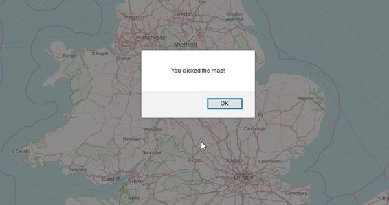
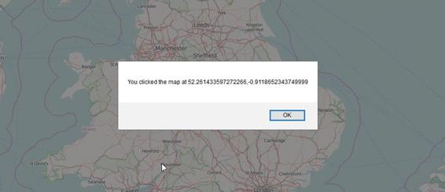
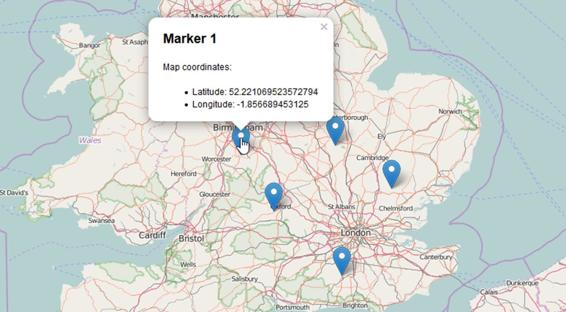
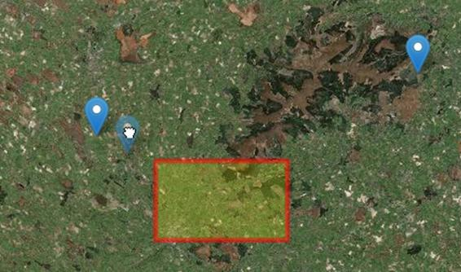
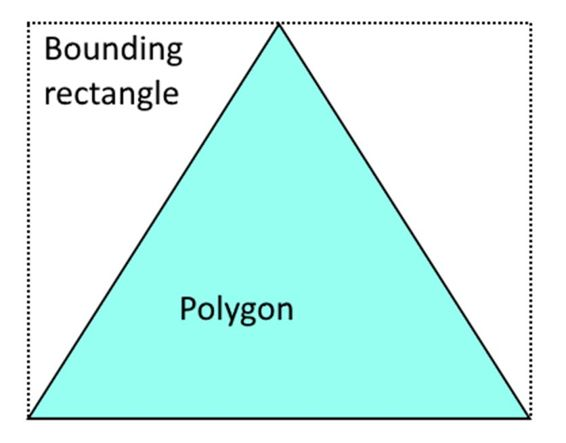
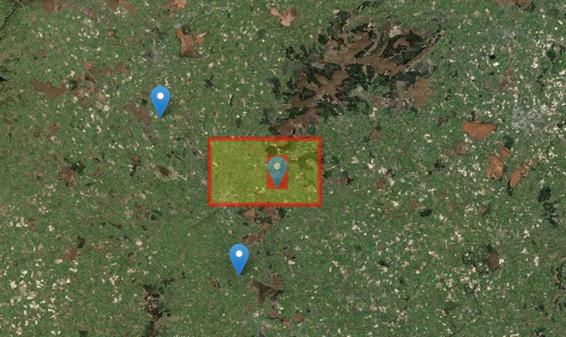

# 四、处理事件

现在，您有了一个包含地图和一些数据的应用，您通常会想要一种用户与之交互的方式。到目前为止，您启用的唯一交互是用户能够单击覆盖图中的功能，并看到您使用绑定到它的弹出窗口。bindPopup()方法。

当事情发生时，Leaflet. js 中的每个控件都会发出事件来提醒您的应用。例如，L.Map 类在编写时支持 34 个事件。这些事件的范围从您期望任何编程环境中的任何控件都具有的事件类型(如焦点、鼠标悬停和单击)到非常特定于它所提供的功能的事件类型(如重叠添加(当新的重叠添加到地图中时)和移动(当地图范围发生变化时))。

此表列出了 L.Map 中支持的事件。它显示了事件的名称、事件触发时返回的对象以及描述。

表 1:地图控制事件

| 长度地图事件 |
| --- |
| **名称** | **返回类型** | **点火时** |
| --- | --- | --- |
| 点击 | 老鼠事件 | 当用户点击(或轻击)地图时 |
| dblclick(数据库点击) | 老鼠事件 | 当用户双击(或双击)地图时。 |
| 老鼠洞 | 老鼠事件 | 当用户在地图上按下鼠标按钮时。 |
| 老鼠！老鼠 | 老鼠事件 | 当用户在地图上放开鼠标按钮时。 |
| 鼠标悬停 | 老鼠事件 | 当鼠标指针进入地图时。 |
| 鼠标移出 | 老鼠事件 | 当鼠标指针离开地图时。 |
| 摩门教徒 | 老鼠事件 | 当鼠标指针在地图上移动时。 |
| 上下文菜单 | 老鼠事件 | 当用户在地图上按下鼠标右键(或在移动设备上长按)时。如果您处理此事件，它会阻止通常的上下文菜单出现。 |
| 集中 | 事件 | 当地图控件获得焦点时(通过点击、平移或跳转)。 |
| 虚化 | 事件 | 当地图控件失去焦点时。 |
| 预点击 | 老鼠事件 | 在点击事件发生之前。如果您想预先阻止点击行为，这很有用。 |
| 负荷 | 事件 | 地图初始化后，其中心和缩放级别首次固定。 |
| 倾销 | 事件 | 当使用。remove()方法。 |
| 视图重置 | 事件 | 当地图需要重绘时。 |
| 移动开始 | 事件 | 当地图范围开始改变时(例如当用户开始拖动地图时)。 |
| 移动 | 事件 | 当地图范围(中心点或缩放级别)改变时。 |
| moveend | 事件 | 当地图范围停止更改时(例如当用户停止拖动地图时)。 |
| 拖动启动 | 事件 | 当用户开始拖动地图时。 |
| 拖 | 事件 | 当用户拖动地图时。 |
| 德拉戈 | dragondevent | 当用户停止拖动地图时。 |
| 动物园开始 | 事件 | 当地图缩放级别即将改变时(在缩放动画出现之前)。 |
| 急速上升 | 事件 | 当地图缩放级别改变时。 |
| zoomlevelschange | 事件 | 当地图中的缩放级别数量因图层的添加或移除而发生变化时。 |
| 调整大小 | 调整事件大小 | 当调整地图控件的大小时。 |
| 自动启动 | 事件 | 当地图由于弹出窗口被打开而开始自动扫描时。 |
| 分层 | 图层显示 | 当一个新图层被添加到地图中时。 |
| 分层移动 | 图层显示 | 当图层从地图中移除时。 |
| 基线层更改 | 图层显示 | 当图层控制改变当前基础图层时。 |
| 重叠的 | 图层显示 | 当图层控制选择覆盖时。 |
| 重叠移动 | 图层显示 | 当图层控制取消选择覆盖时。 |
| 找到位置 | LocationEvent | 当地理定位成功时。 |
| 定位误差 | ErrorEvent(错误事件) | 当地理定位失败时。 |
| 人口 | 弹出事件 | 当弹出窗口通过打开时。openPopup() |
| popupclose | 弹出事件 | 当弹出窗口通过关闭时。closePopup() |

这是 Leaflet. js 中一个控件的事件列表(虽然可以说是最复杂的)。所有其他控件都发出自己的事件，这使得创建高度交互的 web 地图应用成为可能。

在本章中，我们将使用地图控件的事件来演示 Leaflet. js 中的事件处理。有关属于其他控件的事件的信息，请查看您感兴趣的控件的[Leaflet. js 文档](http://leafletjs.com/reference.html)。

为了处理事件，您需要知道:

*   您希望应用开始注意到哪个事件
*   事件的名称
*   事件触发时返回的数据类型

让我们用一个例子来证明这一点。假设我们想要构建一个应用，允许用户点击地图，并在弹出窗口中显示他们点击的地图坐标。

查看表 1，我们可以看到我们想要监控的事件是地图的点击事件。为了开始捕获点击事件，我们需要为该事件创建一个事件处理程序。我们可以用地图做到这一点。on()方法，该方法将我们要处理的事件的名称(click)作为其第一个参数，并将响应该事件的函数(即*回调*)作为其第二个参数。

我们可以连接事件处理程序，并使用以下简单代码测试它是否正常工作:

代码清单 34:处理地图的点击事件

```js
          ...
         <script type="text/javascript">
             function init() {
                 var map = L.map('map').setView([52.187, -1.274],7);
                 // OSM Mapnik
                 var osmLink = "<a href='http://www.openstreetmap.org'>Open StreetMap</a>";  
                 L.tileLayer(
                     'http://{s}.tile.openstreetmap.org/{z}/{x}/{y}.png', {
                     attribution: '&copy; ' + osmLink,
                     maxZoom: 18,
                 }).addTo(map);

                 map.on("click", function() {
                     alert("You clicked the map!");
                 })
             }            
         </script>
          ...

```

如果您的代码是正确的并且没有语法错误，您可以启动应用并单击地图，您的处理程序应该会触发并显示一个消息框:



图 28:地图捕捉点击事件

如果您已经走了这么远，那么您知道您的应用正在监听地图点击事件。太好了。接下来要做的是捕获地图点击事件渴望传递给您的事件处理程序的信息，但这种信息目前被忽略了。

为了处理事件数据，您需要知道正在返回什么类型的数据，然后调整回调函数来拦截和处理它。

查看表 1，您可以看到地图的 click 事件返回一个 MouseEvent 类型的对象。MouseEvent 的 Leaflet. js 文档提供了以下信息:

表 2: MouseEvent 属性:

| 老鼠事件 |
| --- |
| **属性** | **型** | **描述** |
| --- | --- | --- |
| 拉特恩 | 拉特伦 | 鼠标事件发生的地理点。 |
| layerpaint | 要点 | 鼠标事件发生点相对于地图图层的像素坐标。 |
| 容器点 | 要点 | 鼠标事件发生点相对于地图容器的像素坐标。 |
| 原始级别 | DOMMouseEvent | 浏览器触发的原始 DOM 鼠标事件。 |

查看这个表，您可以看到 MouseEvent 扩展了 DOMMouseEvent，它是鼠标点击网页中任何 DOM 元素的原始事件对象。它只是添加了一些与地图相关的新属性。如果我们需要原始事件的信息，我们可以深入到 MouseEvent 的 original vent 属性。

然而，出于我们的目的，我们不需要这样做。我们的目标是显示用户单击的点的地理坐标，该信息在 MouseEvent 的 latlng 属性中可用。考虑到这一点，我们可以调整回调来处理事件，并将信息报告给用户。

代码清单 35:在消息框中显示地图点击坐标

```js
          ...
             map.on("click", function(e) {
                 var lat = e.latlng.lat;
                 var lng = e.latlng.lng;              
                 alert("You clicked the map at " + lat + "," + lng);
             })
          ...

```



图 29:在消息框中显示地图点击坐标

这一切都很好，但是消息框的使用有点打扰，因为它是模态的，阻止我们与地图交互。除此之外，我们最初的任务是在弹出窗口中显示信息。那么，为什么我们不使用我们在上一章中获得的知识，在我们单击的位置添加一个新的标记对象，这样我们就可以看到它在地图上的位置，并且一旦我们在其他地方单击了它，以后可能会再次引用它呢？在此过程中，我们将使用地图点击的连续计数器，并以 HTML 格式很好地格式化输出:

代码清单 36:用弹出窗口将地图坐标数据显示为标记

```js
          ...
             var clickCount = 0;
             map.on("click", function(event) {
                 var lat = event.latlng.lat;
                 var lng = event.latlng.lng;   
                 ++clickCount;
                 var popupContent = "<h2>Marker " + clickCount + "</h2>"
                     + "<p>Map coordinates:</p>"
                     + "<ul><li>Latitude: " + lat + "</li>"
                     + "<li>Longitude: " + lng + "</li></ul>";

                 var myMarker = L.marker([lat, lng],
                 {
                     title: "Click to see map coordinates"
                 }).bindPopup(popupContent).addTo(map);
             })
          ...

```



图 30:放置在点击坐标上的标记

让我们尝试一些更复杂的东西来真正掌握处理事件的技巧。我们将实现一个非常简单的地理围栏。地理围栏基本上是一个“虚拟屏障”当有东西进入指定区域时，就会触发警报。

在我们的例子中，地理围栏区域将是一个神秘地出现在爱尔兰农村中间的矩形，我们的“某物”将是一个或多个标记。


图 31:我们的“地理围栏”和标记

我们将使我们的标记可拖动，以便我们应用的用户可以在乡村移动它们。使标记可拖动就像将其可拖动属性设置为 true 一样简单。

然后我们将连接两个事件处理程序来监控标记的 dragstart 和 dragend 事件。顾名思义，这些事件分别在用户开始和结束拖动标记时触发。

因为我们有三个标记，所以我们将为 dragstart 和 dragend 事件创建一个事件处理程序，标记将共享它们。我们将深入研究传递到回调中的事件对象，以找出是哪个标记引发了事件。

这是我们的出发点:

代码清单 37:地理围栏代码，显示事件处理程序存根

```js
          ...
         <script type="text/javascript">

             var theRectangle;

             function init() {
                 var map = L.map('map').setView([52.96228865548326, -7.499542236328124],10);

                 var mapLink = "Esri";
                 var sourcesLink ="Contributors";
                 // Esri World Imagery Service
                 L.tileLayer(
                         'http://server.arcgisonline.com/ArcGIS/rest/services/. . . {
                         attribution: '&copy; ' + mapLink + ', ' + sourcesLink,
                         maxZoom: 18,
                 }).addTo(map);

                 theRectangle = L.rectangle(
                     [[52.947728, -7.820206],[53.013874, -7.637558]],
                     {
                         color: "red",
                         weight: 5,
                         fillColor:"yellow",
                     }
                 ).addTo(map);

                 var marker1 = L.marker([53.085694, -7.459030],
                                        {draggable:true}).addTo(map);
                 marker1.on("dragstart", dragStartHandler);
                 marker1.on("dragend", dragEndHandler);
                 var marker2 = L.marker([52.875678, -7.772141],
                                        {draggable:true}).addTo(map);
                 marker2.on("dragstart", dragStartHandler);
                 marker2.on("dragend", dragEndHandler);
                 var marker3 = L.marker([53.033699, -7.903976],
                                        {draggable:true}).addTo(map);
                 marker3.on("dragstart", dragStartHandler);
                 marker3.on("dragend", dragEndHandler);
             }            

             function dragStartHandler(e) {
                 // starting marker drag
             }

             function dragEndHandler(e) {
                 // ending marker drag
             }
         </script>
          ...

```

此时，您可能希望确保拖动标记时会触发 dragStartHandler()和 dragEndHandler()事件。您可以使用 console.log(“消息”)将某些内容记录到浏览器控制台，您可以在浏览器的开发人员工具中查看这些内容，或者使用 console.log(“消息”)将某些内容记录到浏览器控制台，您可以在浏览器的开发人员工具中查看这些内容。我使用带有惊人的 Firebug 扩展的 Firefox，但是现在所有的主要浏览器都有很好的开发工具，可以用来调试脚本。

我们要做的第一件事是创建一个漂亮的小视觉效果，使标记在被拖动时部分透明，并在到达目的地时将其恢复为完全不透明。为了实现这一点，我们需要知道是哪个标记引发了事件，这样我们就可以设置该标记的不透明度，而不去管其他标记。

查看文档，我们可以看到 dragstart 和 dragend 事件都将不同的事件对象传递到它们的回调中:


图 32:标记的拖动事件

让我们深入文档来看看这些事件对象。首先，dragstart 事件的事件对象:


图 33:事件对象

正如文档有用地指出的，事件对象是所有其他事件类的基础，它们包括其属性。其中一个属性，target，对于我们能够找出是哪个标记引发了一个事件绝对是至关重要的。

现在是 DragEndEvent 对象，用于 dragend 事件:


图 DragEndEvent 对象

DragEndEvent 包含一个距离属性，因此我们可以计算出特定标记被拖动了多远。这对于其他用例来说很有趣，但与我们在这个例子中试图实现的目标无关。所以对于 dragend event 事件，我们将只使用 DragEndevent 的父类:Event 上的属性。

我们想知道是哪个标记引发了 dragstart 事件，并将其不透明度设置为 0.5，这是半透明的。我们还想知道是哪个标记引发了 dragend 事件，这样我们就可以将其不透明度重置为 1.0(完全不透明)。我们可以使用事件对象的 target 属性来检索引发事件的标记，然后调用其 setOpacity()方法:

代码清单 38:在拖动操作期间设置标记透明度

```js
          ...
             function dragStartHandler(e) {
                 // starting marker drag
                 e.target.setOpacity(0.5);
             }

             function dragEndHandler(e) {
                 // ending marker drag
                 e.target.setOpacity(1.0);
             }
          ...

```



图 35:标记在拖动操作过程中变得部分透明

太好了。我们现在可以在地图上移动我们的标记，包括进入地理围栏区域，我们得到了一些不错的透明度效果。

我们现在需要解决的是，我们的任何标记是否会出现在地理围栏中。如果他们这样做了，那么我们可以改变他们的外表来突出这一事实。

首先，我们需要计算出矩形的范围。矩形类实现了抽象类路径，这使得它可以访问路径的所有属性、事件和方法。这包括 getBounds()方法，该方法返回一个 LatLngBounds 对象，该对象表示包围我们的矩形的边框。在矩形的情况下，包围矩形的边界矩形的大小和形状与它包围的矩形完全相同！但是我们已经讨论过的其他覆盖，比如多边形，也实现了 getBounds()，它们的封闭矩形可能是一个非常不同的形状:



图 36:多边形的边界矩形

检索到 LatLngBounds 对象后，我们可以调用它的 contains()方法之一，传入标记的地图坐标，以确定矩形是否包含标记:


图 LatLngBnds 对象的包含、相交、s 和等于方法

您可以从 Labber . js API 引用的摘录中看到，LatLngBnds 包含两个版本的 contains():一个用于点(例如我们标记的位置)，另一个用于其他矩形。它还包括检查一个矩形是否与另一个矩形相交，或者两个矩形是否相等的方法。

我们需要在 dragend 事件处理程序中实现这种检查。如果 contains()返回 true，那么我们知道我们的标记已经进入了地理围栏，我们需要一些方法来提醒用户。在本例中，我只是使用了一点 CSS 来更改标记图标的背景颜色，但是您可以切换标记图标，以获得不同的效果:

代码清单 39:检查新的标记位置是否在地理围栏矩形内

```js
          ...
             function dragEndHandler(event) {
                 // ending marker drag
                 event.target.setOpacity(0.5);
                 if (theRectangle.getBounds().contains(event.target.getLatLng())) {
                     event.target.valueOf()._icon.style.backgroundColor = 'red';
                 }

             }
          ...

```



图 38:地理围栏标记