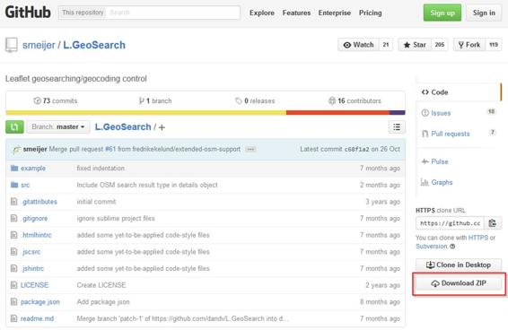
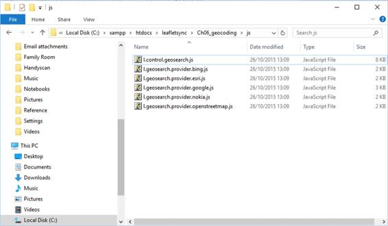
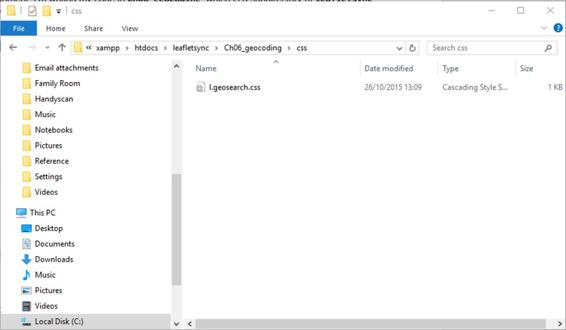
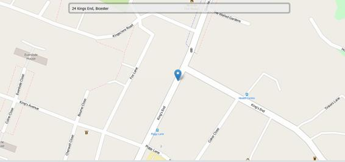

# 六、地理编码

通常，您希望您的用户能够输入地址、地标或国家公园等位置，并让您的地图立即缩放到正确的位置。地理信息系统的人们对此有一个术语:地理编码。如果你还没有猜到的话，Leaflet.js 有一个插件。事实上，它有几个。但是我喜欢的一个，也是我们将在这一章看到的，是地理搜索

任何地理编码操作的准确性都完全取决于可用数据的质量，我真正喜欢 L.GeoSearch 的原因之一是，它让我们能够根据几个不同提供商的数据进行地理编码:谷歌、Esri、Bing、和 OpenStreetmap。另一个原因是，无论您决定使用哪个提供程序，它都很容易实现，甚至提供了自己完全足够的用户界面控制。让我们继续使用它。

首先，访问 GitHub 上的 L.GeoSearch 页面，网址为:[https://github.com/smeijer/L.GeoSearch](https://github.com/smeijer/L.GeoSearch)并下载 zip 文件:



图 51:GitHub 上的 L.GeoSearch 页面

像大多数 Leaflet. js 插件一样，L.GeoSearch 由一些 JavaScript 文件和一些 CSS 组成，用于控制样式，因此您可以忽略 zip 文件的大部分内容。如果您想跟随这个例子，只需复制。js 文件从 zip 文件中的 src\js 文件夹移动到一个名为 js 的目录中，该目录与您将要编写代码的目录相同。在我的环境中，我正在用 Ch06 _ geocoding 编写代码，这是我的本地 web 服务器上 leafletsync 的子目录:



图 52:地理搜索 JavaScript 文件的位置

然后将 l.geosearch.css 文件复制到一个名为 css 的目录中，该目录与您要编写代码的目录相同:



图 53:每个 CSS 文件的位置

我们现在需要创建我们的 HTML 页面，确保引用我们之前添加的 L.GeoSearch 文件。在这个例子中，我将使用 OpenStreetmap 作为我的提供者，所以我需要一个

如果我想在任何阶段交换提供者，甚至允许我的用户在运行时选择提供者，那么我需要引用相关的 l . geo search . provider[name]。js 文件。

我还需要在<link>引用中引用 l.geosearch.css 文件，该文件将用于控制样式。

创建地图后，将其范围设置为美国，并添加 OpenStreetmap 底图图层，这是我们的起点:

代码清单 48:地理编码应用的起点

```js
         <!DOCTYPE html>
         <html>

         <head>
         <title>My Leaflet.js Map</title>
         <link rel="stylesheet" href="http://cdnjs.cloudflare.com/ajax/libs/leaflet/0.7.3/leaflet.css" />
         <script src="http://cdnjs.cloudflare.com/ajax/libs/leaflet/0.7.3/leaflet.js"></script>
         <script src='js/leaflet-omnivore.min.js'></script>
         </script>
         <style>
             html,
             body,
             #map {
                 height: 100%;
             }
         </style>

         <script type="text/javascript">
             function init() {
                 var map = L.map('map').setView([0,0], 2);

                 // OSM Mapnik
                 var osmLink = "<a href='http://www.openstreetmap.org'>Open StreetMap</a>";
                 L.tileLayer(
                     'http://{s}.tile.openstreetmap.org/{z}/{x}/{y}.png', {
                         attribution: '&copy; ' + osmLink,
                         maxZoom: 18
                     }).addTo(map);

                 var runLayer = omnivore.kml('kml/2.5_month_age.kml')
                     .on('ready', function() {
                         map.fitBounds(runLayer.getBounds());

                         runLayer.eachLayer(function(layer) {
                             layer.bindPopup(layer.feature.properties.name);
                         });
                     }).addTo(map);
             }
         </script>
         </head>

         <body onload="init()">
             <div id="map"></div>
         </body>

         </html>

```

|  | 注意:底图图层的选择无关紧要。仅仅因为您使用 OpenStreetmap 进行地理编码操作，您并不局限于在地图中使用 OpenStreetmap 切片。 |

现在我们只需要为我们选择的提供者创建一个新的类实例:

代码清单 49:创建一个适当的提供者的 L.GeoSearch 类的新实例

```js
         ...
             new L.Control.GeoSearch({
                 provider: new L.GeoSearch.Provider.OpenStreetMap()
             }).addTo(map);
         ...

```

就这样！现在，当我们运行应用时，我们会在页面顶部看到一个不错的文本输入字段。我们可以输入一个地方的名称，或者地址的一部分，根据提供者数据的质量，得到或多或少有用的结果。

让我们尝试搜索谷歌在加州山景城的总部:


图 54:搜索谷歌总部

我们在那里，就在谷歌地图的中间。请注意，L.GeoSearch 如何立即将地图定位到搜索结果的位置，放大并根据它为地址存储的坐标显示标记。

让我们看看它是否适用于我的地址(请不要发送仇恨邮件):


图 55:搜索我的家庭地址

实际上，这很可怜。谷歌的地理编码结果使我离我实际居住的地方大约 200 英尺。让我们交换提供商，给 Esri 一个击败谷歌的机会。我只需要更改我在

代码清单 50:使用 Esri 作为提供者

```js
         <!DOCTYPE html>
         <html>
         <head>
           <title>My Leaflet.js Map</title>
             <link rel="stylesheet"
               href="http://cdnjs.cloudflare.com/ajax/libs/leaflet/0.7.3/leaflet.css" />
             <link rel="stylesheet" href="css/l.geosearch.css" />
             <script src="http://cdnjs.cloudflare.com/ajax/libs/leaflet/0.7.3/leaflet.js"></script>
             <script src="js/l.control.geosearch.js"></script>
             <script src="js/l.geosearch.provider.esri.js"></script>
             <style>
               html, body, #map {
                 height: 100%;
               }
             </style>
             <script type="text/javascript">
                 function init() {
                     var osmLink = "<a href='http://www.openstreetmap.org'>Open StreetMap</a>"
                     var map = L.map('map').setView([34.525, -97.778],5);
                     L.tileLayer(
                         'http://{s}.tile.openstreetmap.org/{z}/{x}/{y}.png', {
                         attribution: 'Map data &copy; ' + osmLink,
                         maxZoom: 18,
                     }).addTo(map);

                     new L.Control.GeoSearch({
                         provider: new L.GeoSearch.Provider.Esri()
                     }).addTo(map);
                 }              
             </script>
         </head>
         <body onload=init()>
               <div id="map"></div>
         </body>
         </html>

```

这就是 Esri 的成果:



图 56: Esri 对我的地址的地理编码结果

好多了！(即使我不住在路中间。)这个故事的寓意是，所有的地理搜索提供商并不是生来平等的，尤其是如果你在美国以外的地方搜索地址。