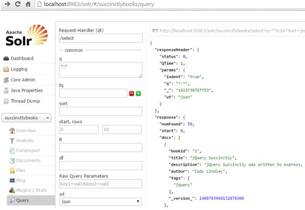
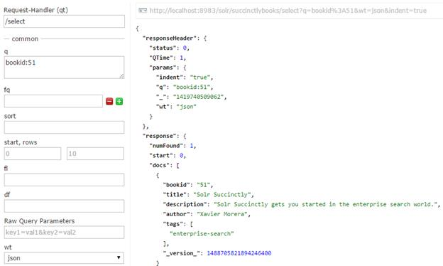
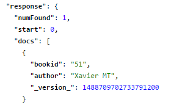
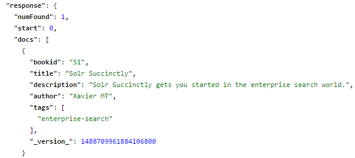
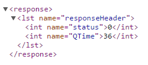
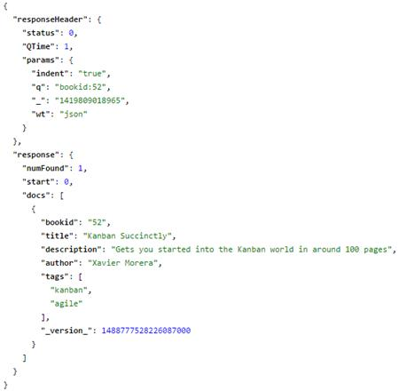
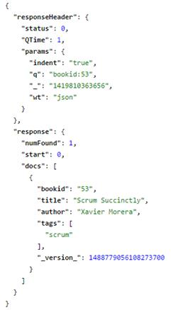
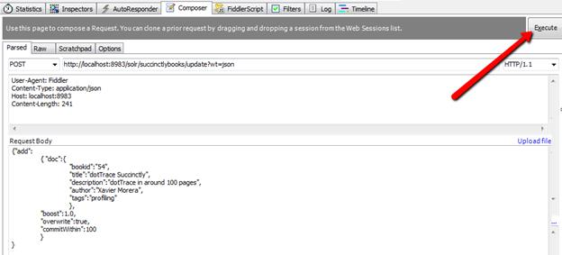
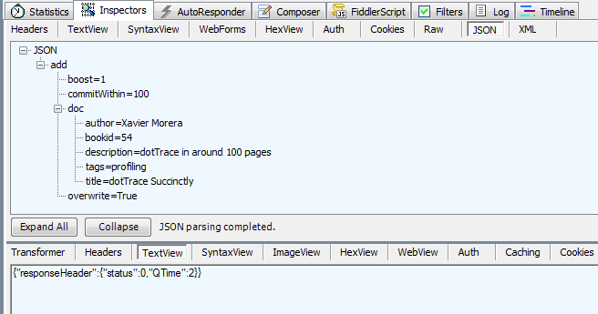
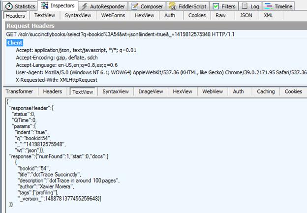

# 第六章索引

## 让您的内容可搜索

当你在 Solr(或其他搜索引擎)的上下文中听到“索引”这个词时，它基本上意味着获取内容，对其进行标记化，必要时进行修改，将其添加到索引中，然后使其可搜索。Solr 检索结果非常快，因为它搜索的是倒排索引，而不是直接搜索文本。

但是到底什么是倒排指数呢？它是一种数据结构，存储从内容(如单词或数字)到其在一组文档中的位置的映射。因此，搜索变得非常快，因为代价是在索引时而不是在查询时付出的。引用倒排索引的另一种方式是作为发布文件或倒排文件。所以如果你听到这三个术语中的任何一个，它们的意思是一样的。

在索引过程中，Solr 将以页面为中心的数据结构转换为以关键字为中心的数据结构。一个词可以在很多页上找到。Solr 将该索引存储在名为*数据*目录中的*索引*的目录中。有许多方法可以索引您的内容；在本章中，我将向您介绍其中的几个。

索引并不是什么新鲜事——人类已经做了几个世纪了！这是我们忙碌生活中一直在做的事情。例如，书后面的索引，或者告诉你电视台有哪些节目的电视指南，都是索引起作用的完美例子。

您可以通过快速扫描预定义的列表来使用它们，寻找一些有意义的关键字或主题。一旦找到关键字或主题，条目将包含某种指针(例如，页码)，允许您直接找到您要查找的信息。


图 76:教科书索引

### 索引技术

我们已经使用`post.jar`工具索引了一些数据，但是还有很多选项:

*   您可以将 Apache Tika 上构建的 Solr 单元框架用于二进制文件，如 PDF、Word、Excel 等。
*   也可以通过 HTTP 请求上传 XML 文件。
*   `DataImportHandler`允许访问数据库检索数据，但不限于数据库。`DataImportHandler`还可以读取 RSS 源或许多其他数据源。
*   您还可以通过 Solr 的 Java 客户端应用编程接口 SolrJ 来构建您的自定义 Java 应用程序。
*   对于你们这些热爱的人来说。NET 和我一样，你有 SolrNet。
*   正如我之前提到的，还有其他内容处理管道工具，如搜索技术 ASPIRE 后期到 Solr 工具。
*   最后，您可以在 Solr 的 RESTful 界面上构建自己的界面。

### 简洁地索引*系列*

 *在本节中，我们将通过索引、更新和删除来处理数据。这里的重点是用几种不同的方式做事情，这样你就可以提高你的技能。

以下是我们将要做的:

*   首先使用 CSV 和 post.jar 工具进行索引。
*   然后，学习如何使用管理用户界面更新文档。
*   接下来，我们将讨论如何删除文档。
*   接下来，我们将介绍 Solr XML 格式。
*   最后，我们将使用两个有用的工具来索引，cURL 和 Fiddler。

#### 使用 CSV 为文档编制索引

如果您已经对数据的 CSV 文件进行了结构化和适当的转义，那么为文档编制索引是非常容易的。我们已经在 Schema.xml 中定义了静态字段，所以接下来我们需要导入数据。

首先打开位于 GitHub 中的示例中的资产文件夹。请检查您克隆的存储库，并确认它看起来如下所示:


图 77: GitHub 存储库


图 78:练习 1

你可能想知道为什么我们要把 CSV 和 BAT 文件复制到`exampledocs`。这是因为`post.jar`就在那里，即使你可以设置正确的路径，这样也更容易。

下一步是执行文件索引。为此，我们将打开一个命令提示符并导航到`exampledocs`文件夹。您可以只运行`exercise-1-succinctly-schema.bat`文件，它将执行以下命令:

```
      java -Durl=http://localhost:8983/solr/succinctlybooks/update -Dtype=text/csv -jar post.jar "exercise-1-succinctly-schema.csv"

```

阅读命令窗口中的响应。如果一切顺利，它将提示“1 个文件已编入索引”


图 79:索引的样本文件

太棒了！现在让我们在`succinctlybooks`中为 **:** 运行一个查询。您可以从*管理界面*进行操作。

如果您没有收到此回复，请确保练习文件在`exampledocs`文件夹中，就在`post.jar`旁边。另外，从`exampledocs`运行`post.jar /?`确认其能够执行。



图 80:查询所有书籍

一切看起来都很棒。我们有 50 份文件，我们的数据似乎还可以。让我们分析一条记录:


图 81:单一记录

有些事情看起来不太对劲。你能指出它是什么吗？看`tags`。你现在可能已经注意到了，但是让我们把它变得更明显一点。在标签中，只有一个条目带有“git |源代码管理”。这是一个多值字段，但它将`git`和`source-control`视为同一标签的一部分。为了使这个例子正确，它们应该是两个独立的值。

要进一步查看，请单击下面的响应链接，其中 xml 为 wt(响应编写器):

```
      http://localhost:8983/solr/succinctlybooks/select?q=*%3A*&wt=xml&indent=true

```

|  | 注意:如果您修改了 Solr 的位置，请使用您当前的位置。 |

让我们简洁地看看*Git*的相同记录。


图 82:标签有错误的文档

从上图中，您应该能够看到 tags 字段已经被索引为单个字段，而不是多个字段，即使我们声明为多值的。发生这种情况的原因很简单:我们没有告诉 post.jar 我们要分隔哪个字段，哪个字段是分隔符。

我们可以通过运行以下命令轻松解决这个问题:

```
      java -Durl="http://localhost:8983/solr/succinctlybooks/update?f.tags.split=true&f.tags.separator=|" -Dtype=text/csv -jar post.jar "exercise-1-succinctly-schema.csv"

```

我还在我们的资产文件夹中的以下文件中包含了修复程序:`exercise-1-succinctly-schema-index-fixseparator.bat`。

一旦我们进行了这种更改，请尝试重新运行以前的查询；你应该看到不同。


图 83:正确的多值标签

每当您必须将多值输入指定为单个字符串时，您必须确保使用以下参数告诉 Solr 它需要拆分输入:

```
      f.tag.encapsulator='<separator character here>'

```

#### 通过管理界面索引

您也可以使用“文档”部分中的管理用户界面来创建和修改索引。对于我们的第一个示例，让我们证明我要添加的记录不存在。打开核心选择器，点击**查询**，在`q`输入框中，输入`bookid:51`并执行查询。未找到任何文档。我们将增加第 51 本书，也就是你现在正在读的这本书。


图 84:没有 ID 为 51 的书

现在选择**文档**，并在文档输入栏中键入以下文本:

```
      {"bookid":"51","title":"Solr Succinctly","description":"Solr Succinctly gets you started in the enterprise search world.","author":"Xavier Morera","tags":"enterprise-search"}

```

点击**提交文件**，在右侧部分会出现`success`状态。保持此窗口打开，因为我们将在接下来的两个部分中使用它，并在同一位置打开一个新的选项卡以继续测试。


图 85:提交的文档

现在这本书可以在索引中找到，并且可以搜索。



图 86:ID 为 51 的图书可用

如果您尝试将它作为一个单独的查询运行，如下所示:

```
      http://localhost:8983/solr/succinctlybooks/select?q=Solr&wt=xml&indent=true

```

你可能会惊讶地发现你没有得到任何结果。我将把解释留到稍后；现在，我想向您展示更多关于 Solr 如何搜索其索引的信息。

#### 通过管理界面更新

我们刚刚添加了一个文档。但是如果我们想更新文档呢？这很简单，只需再次添加文档。去掉我的姓，离开`“author”:”Xavier”`。点击**提交文件**，再次运行查询。你会看到我的名字被更新了，没有姓。


图 87:作者修改

如果你看文档输入栏的正下方，你会看到一个名为`Overwrite`的输入参数；最初这将被设置为`true`。使用此默认设置的目的是确保它在需要的地方更新，并且不会插入新记录。设置为 **`false`** ，再次尝试更改作者姓名，应该会发现现在反而增加了一条新记录:


图 88:覆盖选项

#### 部分更新

部分更新是人们多年来在 Solr 中一直要求的功能；然而，直到 Solr 4.0 才正式推出。简而言之，部分更新包括更新文档中的单个字段，而不需要为整个文档编制索引。这听起来可能不多，但是如果您有大文档(以及大量文档)，只需要简单的单个字段更改就需要大量处理，您可以很快看到会浪费多少处理时间。这一点，再加上文件的数量，会有很大的不同。

让我和你分享一个几年前发生在我身上的故事。我在为一个专利搜索申请项目工作。它基本上有一个两位数的结核病指数，由大约 96M 个专利组成，包含全球所有专利机构提交的每一份专利申请和授权。文档大小从几个字节到几兆字节不等；我们有成千上万个字段，索引一个文档意味着要消耗大量的处理能力，这是由于字段规范化和许多其他必需的操作。

每个专利条目都有一个或多个分类代码，基本上规定了每个专利的内容；这些代码使用了 USPC、ECLA 和许多其他代码，这取决于拥有权限。

从 2013 年 1 月 1 日起，合作专利分类开始作为官方新分类使用，这是美国专利商标局和欧洲专利局联合开发的方案。

这意味着所有专利突然需要重新分类，其结果基本上是为新的产品总分类代码增加了一个新的领域。从技术角度来说，无论怎么想象，这都不是一项艰巨的任务。我们收到了一个包含专利规范号和产品总分类代码的 CSV 文件，因此我们确切地知道需要匹配哪些记录。所有专利都需要用新的 CPC 代码进行搜索，这就是我们的问题开始的地方。我们没有能力执行部分更新，这意味着我们每次更新都必须完全重新处理大约 8000 多万个文档，这项任务需要几周的时间。

部分更新可以将所需时间减少到几天。这个故事的寓意很简单:在可能的情况下使用部分更新，你会很快意识到它们有多宝贵。

让我们现在做一个部分更新。如果你还记得的话，这就是我们要索引的书籍文档:

```
      {"bookid":"51","title":"Solr Succinctly","description":"Solr Succinctly gets you started in the enterprise search world.","author":"Xavier Morera","tags":"enterprise-search"}

```

只留下`bookid`和`author`，将`author`改为泽维尔部分更新，点击**提交文件**。

```
      {"bookid":"51","author":"Xavier MT"}

```

现在运行查询来检索该文档。发生了什么事？基本上，当您进行更新时，它会添加带有您指定的字段的完整记录。全面更新不是我们需要的；我们需要部分更新。



图 89:完全更新

让我们再试一次。首先将文档重置为原始状态。运行查询进行确认。

```
      {"bookid":"51","title":"Solr Succinctly","description":"Solr Succinctly gets you started in the enterprise search world.","author":"Xavier Morera","tags":"enterprise-search"}

```

一旦你重置了东西，试着再次提交部分更新。使用{}内的关键字 **`set`** 指定要更新的字段，如下所示:

```
      {"bookid":"51","author":{"set":"Xavier MT"}}

```

再次运行`bookid`的查询。现在你将对`author`进行部分更新。



图 90:部分更新

最后一件你需要注意的事情是:要让部分更新正常工作，你必须将你所有的字段设置为`stored=true`。如果您希望通过不存储所有字段来管理索引大小，这可能是一个问题，但是如果不指定，您将无法对该字段进行部分更新。

#### 删除数据

现在我们知道如何插入和更新文档，下一步是学习如何删除文档。您可以通过标识和查询删除文档。例如，要从索引中删除这本书，可以使用以下两种方法之一:

首先是按 ID 删除。这个命令将告诉 Solr 它需要删除哪个 ID:

```
      <delete>
      <id>51</id>
      </delete>

```

您应该用来执行此操作的网址如下:

```
      http://localhost:8983/solr/succinctlybooks/update?stream.body=<delete><id>51</id></delete>&commit=true

```

获得的响应应该如下所示。`0`状态表示没有返回错误。



图 91:文档被删除

但是，它并不指示记录的数量，或者记录是否被实际删除。为此，您需要运行查询来确认。在管理界面，请选择`succinctlybooks`核心，点击`Query`部分，在 *q* 中添加以下`bookid:51`，并执行。


图 92:查询确认记录已删除

要通过查询删除，您可以尝试以下命令:

```
      <delete>
      <query>author:"Xavier Morera"</query>
      </delete>

```

执行它的网址如下:

```
      http://localhost:8983/solr/succinctlybooks/update?stream.body=%3Cdelete%3E%3Cquery%3Eauthor:%22Xavier%20Morera%22%3C/query%3E%3C/delete%3E&commit=true

```

至此，您应该能够看到可以删除整个索引，只需使用以下网址:

```
      http://localhost:8983/solr/succinctlybooks/update?stream.body=<delete><query>*:*</query></delete>&commit=true

```

指定通配符比单独指定每个索引更有效，这并不总是可能的，因为 Solr 可能会锁定文件。

值得注意的是，需要将 **`commit`** 设置为 **`true`** ，否则不会致力于指数。如果要删除多个文档，最好不要对每个操作都进行提交。

此外，您可以删除匹配多个字段的文档。您可以构建用于搜索的任何查询也可以用于删除。然后，如果您正在使用 SolrNet 或 SolrJ，您可以使用函数`Solr.deleteByQuery` **:** 调用它们的 API。我们不会在本书中涉及 SolrJ 或 SolrNet 的 API，但我相信值得一提。

#### XML 格式

Solr 有自己的 XML 格式，非常具体和冗长，但易于阅读。它能更好地处理多值可选字段、复杂字符串和实际需求。我参与了多个项目，其中首选使用 Solr XML 格式，因为文档处理是单独完成的，并且可能是并行完成的，生成了数百万个 XML 文件，然后作为一个单独的过程在 Solr 中进行索引。

在示例文件中，您应该可以找到 *。*如果你在文本编辑器中打开这个文件，你应该看到它基本上有 **`add`** 命令，文档，然后是我将为这个特定文档添加的所有字段。这本书现在还没有真正进展，但我刚刚为 Pluralsight 完成了一门关于它的课程，所以它是一个很好的示例主题。


图 93:索引 Solr XML 样本数据

使用我们前面学习的一种或两种方法，对 ID 等于 52 的书执行查询；您可以使用以下网址，或者将其输入管理用户界面查询输入:

```
      http://localhost:8983/solr/succinctlybooks/select?q=bookid%3A52&wt=json&indent=true

```

下一步是以我们处理 CSV 文件的相同方式添加文档。为了便于使用，您会发现一个批处理文件以及 XML 如果您运行此程序，文档将被编入索引。


图 94:复制示例文件

如果您不在 Windows 上，或者无法运行批处理文件，那么您需要的命令如下:

```
      java -Dauto -Durl=http://localhost:8983/solr/succinctlybooks/update -jar post.jar "exercise-2-solr-xml.xml"

```

请注意我是如何使用–Dauto 而不是指定文件扩展名的。该工具能够处理命令行响应中描述的多个扩展。


图 95:索引索勒 XML 文件

现在再次运行`bookid 52`的查询。它将返回一个文档。



图 96:查询 bookid 52

如果你已经走了这么远，那就拍拍自己的背吧——你已经很好地理解了 Solr 的工作原理，并创建了自己的搜索索引。

#### 使用 cURL

**cURL** 是一个命令行工具，用于使用各种协议传输数据，其中一个协议通常需要在基于 shell 的范围内进行管理员访问，但是简单易用。说到和 Solr 合作，我可以说 cURL 是你的朋友。它很棒，因为它很容易使用，你可以很容易地发布二进制文件。关于 cURL 的培训超出了本书的范围，但是我将向您展示如何使用它的快速演示。此外，如果你在一个不能使用 cURL 的环境中，你可以使用类似 Chrome 的 Postman 插件这样的插件来实现类似的结果。

要开始，您需要下载 cURL，它安装起来非常简单。

您实际上是从命令行使用 cURL。它允许你发布信息，甚至发布文件。它允许您添加、更新和删除文档。

要调用它，请在命令行中键入**CUlR**，然后键入更新处理程序的位置。您还需要包括您实际承诺的核心。

关于参数，我传递的 **`commit`** 等于 **`true`** ，这意味着一旦我发出命令，信息就应该提交给索引。然后我传递 **`-H`** 为表头，内容类型为 **`text/XML`** 。

接下来是 Solr 的命令。在这种情况下，我正在执行 **`add`** 命令，该命令与 Solr XML 格式完全相同，其中包含了我想要包含在本文档中的字段。

完成所有这些操作的 cURL 命令如下:

```
      curl http://localhost:8983/solr/succinctlybooks/update?commit=true -H "Content-Type: text/xml" --data-binary "<add><doc><field name=\"bookid\">53</field><field name=\"title\">Scrum Succinctly</field><field name=\"author\">Xavier Morera</field><field name=\"tags\">scrum</field></doc></add>"

```

为了让您的生活更轻松，我还将**运动-3-curl.bat** 添加到**简明书籍**中的**示例文档**文件夹中并运行它。您必须确保您的系统可以找到并运行 cURL 程序，以便批处理文件工作。


图 cURL 练习的 Bat 文件


图 98:通过 cURL 索引

你应该可以看到之前操作的状态是`0`，也就是你现在知道的没有错误的意思。如果您随后对 ID = 53 的图书运行查询，您应该会在结果中看到一个文档。

我索引的文档没有所有字段。只需要`bookid`，但如果复制粘贴的字段定义并留下`required=“true”` `,`，则 Solr 可能会提示如下异常消息:

```
      <str name="msg">[doc=53] missing required field: description</str>

```

如果出现这种情况，请确保 Schema.xml 中只有`bookid`包含必需的=“true”属性



图 99: Bookid 53

你也可以发出任何你想要的命令。例如，一个 **`delete`** 命令会是这样的:

```
      curl http://localhost:8983/solr/succinctlybooks/update?commit=true -H "Content-Type: text/xml" --data-binary "<delete><query>courseid:getting-started-enterprise-search-apache-solr*:*</query></delete>"

```

#### 游手好闲的人

如果你习惯于网络开发，你可能知道 Fiddler。如果不是，那么 Fiddler 就是一个调试代理，它会将所有 HTTP 流量记录到您的计算机中。如果您有问题，或者您想在使用 Solr 时调试请求，这是一个很好的工具。使用它来检查、重新发出和编写请求。要获得提琴手，请访问 http://getfiddler.com。

安装完成后，打开 Fiddler。它开始监控您计算机内的所有流量，因此我建议您设置一个过滤器，以便它只接收本地请求。为此:

*   转到**过滤器**
*   选择**仅显示内部网主机**
*   选择**无主机过滤器**


图 100:菲德尔滤波器

除了监控，Fiddler 还可以发出请求。让我们学习如何发出请求。

转到**作曲家**选项卡。您可以选择指定要使用的动词，如 GET 或 POST。在这种情况下，我将对更新处理程序进行 POST，特别是对**简洁地说就是**核心。这是网址:

```
      http://localhost:8983/solr/succinctlybooks/update?wt=json

```

下一步是添加标题。不用担心内容长度；提琴手自动添加。

```
      User-Agent: Fiddler
      Content-Type: application/json
      Host: localhost:8983
      Content-Length: 241

```

现在添加身体:

```
          {"add":
              { "doc":{
                  "bookid":"54",
                  "title":"dotTrace Succinctly",
                  "description":"dotTrace in around 100 pages",
                  "author":"Xavier Morera",
                  "tags":"profiling"
                  },
              "boost":1.0,
              "overwrite":true,
              "commitWithin":100
              }
          }

```

您的 Composer 选项卡应该如图 101 所示。点击**执行**。



图 101:在提琴手作曲器中执行

一旦发出请求，Fiddler 将在左侧面板中记录。`Result 200`表示一切顺利。如果这是你第一次使用 Fiddler，故意犯一个错误来查看 HTTP 500 响应。


图 102:提琴手的回应

现在双击请求，Fiddler 将打开详细信息。



图 103:提琴手检查员的回应

您也可以运行查询:


图 104:使用 Fiddler 查询 Solr

然后，您可以分析结果:



图 105:分析提琴手中的 Solr 响应

如你所见，这是一个非常强大的工具。

#### 在 Solr 中重新索引

当您在生产或开发环境中运行 Solr 时，在某些时候您需要重新索引。需要重新建立索引的一种情况是，由于添加了新字段，模式发生了变化。虽然您确实可以进行部分更新，但有些情况下您需要完全更新，执行重新索引是唯一的方法。

根据模式更改的类型，您可能需要删除所有文档，然后从头开始重新索引。在这种情况下，拥有一套完整的辅助 Solr 服务器是有利的，这样在重新索引时就不会丢失搜索功能。关键是，当您因为模式更改而进行重新索引时，您需要将您的应用程序指向原始 Solr 索引的精确副本，并且一旦重新索引完成，您就将您的应用程序指向新的 Solr 索引。

重新索引到底意味着什么？基本上，这是一个为每个文档重新建立索引的过程，就像您最初将它们添加到索引中一样。

在某些情况下，重新索引会非常慢，因为访问原始数据源的效率不是很高。如果您遇到这样的情况，我建议您建立一个中间存储，或者另一个 Solr 作为缓存，帮助您以更快的方式重新索引。

### 总结

在本章中，您已经学习了如何索引数据，这是 Solr 最基本的操作之一；而是如何将数据插入搜索引擎。您通过使用包含的 post.jar(一个名为 cURL 的命令行工具)和 Fiddler 学习了如何索引。您还学习了如何删除和更新数据。关于更新，我们了解了完全更新和部分更新之间的区别，这是不是所有搜索引擎都有的功能。

现在是时候学习如何通过 Solrconfig.xml 配置 Solr 的核心了。*