# 七、`Solrconfig.xml`

## 配置 Solr

Solrconfig.xml 是用于配置 Solr 核心的主要配置文件。有多个部分包含用于为给定集合设置配置值的 XML 语句、包括重要功能的参数，如缓存、事件侦听器、请求处理程序、请求调度程序、荧光笔插件配置、数据目录位置以及管理用户界面部分中可用的项目。

### 请求处理程序

可以配置的一个特别重要的特性是请求处理程序。请求处理程序负责接受 HTTP 请求，执行搜索，然后将结果返回给调用客户端。

请求处理程序是使用 QT 参数指定的，它们定义了为传递给它们的任何请求执行的逻辑。

例如，您可以包含过滤器或刻面。您也可以在两种模式下进行更改。一种方法是追加，将它们添加到请求中，而无需用户请求，或者您可以添加一个不变量。在这种情况下，如果选择不变量，它将被添加到请求中，用户不能修改它。不变量对于范围界定甚至安全性都非常有用。

可以在同一个`Solrconfig`中指定多个请求处理程序，您已经命名了覆盖多个 Solr 内核的请求处理程序。

请求处理程序中有三种类型的查询参数:

*   **默认值**:提供默认参数值，如果在请求时指定了值，将使用该值。
*   **追加**:提供参数值，该参数值将在请求时指定的任何值之外使用或作为默认值使用。
*   **不变量**:提供将被使用的参数值，而不管请求时提供的任何值。这是一种让 Solr 锁定 Solr 客户端可用选项的方式。这里指定的任何参数值都将被使用，无论查询、默认值或`appends`参数中指定了什么值。

Solr 安装中的默认请求处理程序是`/select`，现在您应该非常熟悉了，因为这是我们在本书中针对每个示例使用的程序。


图 106:在管理界面中看到的默认请求处理程序

如果你打开你的 Solrconfig。Xml 文件并查找处理程序，您会看到它基本上有三个默认值，即`echoParams`、`rows`、*、*和`df`参数。如前所述，请求处理程序可以定义多个其他参数，以控制如何通过`appends`或`invariants`处理查询。

如果我取消注释***/选择*** 请求处理程序的包含示例部分，我们应该会看到如下所示的内容:

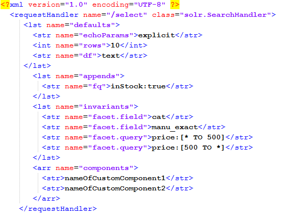

图 107:/选择请求处理程序

正如您所看到的，这个例子明确指出，任何要返回的结果都必须有库存。这是通过添加过滤查询`instock:true`来完成的。暂时不要自己做这些取消注释的改变；我们马上就要建立自己的处理器。

### 创建新的请求处理程序

让我们创建一个新的请求处理程序，只返回一个特定作者的书籍。这可能不是一个非常现实的场景，但是它将允许我演示一个处理程序是如何工作的。

首先，让我们确保处理程序不存在。最好总是执行这一步，以确保您还没有定义具有该名称的处理程序。使用浏览器将以下网址传递到您的 Solr 安装:

```
      http://localhost:8983/solr/succinctlybooks/books?q=*%3A*&wt=json&indent=true

```

下图显示您应该从该请求中收到一个 404 错误；这是意料之中的，表明您实际上可以安全地添加新的处理程序。


图 108:404 Solr 返回的错误显示“books”处理程序还不存在

现在打开你的 **Solrconfig。Xml** 位于您的**Solr/summary books/conf**文件夹中。请寻找`/select`请求处理程序，复制它，并删除所有注释掉的行。暂时不要做任何改变。应该是这样的:


图 109:我们的新书处理器

下一步是导航到**核心管理**并点击**重新加载**。默认情况下，将选择 collection1 请务必选择**简明图书**。暂时不要离开——继续看重新加载按钮。它需要变成绿色几秒钟，以表明重装成功。


图 110:重新加载内核

再次运行查询，但确保使用的是`/books`而不是`/select`请求处理程序，如红色所示:

```
      http://localhost:8983/solr/succinctlybooks/books?q=*%3A*&wt=json&indent=true

```

这一次，它肯定会起作用，你有 53 个结果——同样的 53 个结果。让我们做几个改变，从一个非常简单的开始。

#### 更改请求处理程序中的行

您返回给用户的结果数量在很大程度上取决于您显示结果的方式。有些人做 5 个结果，其他人做 10 个——我见过显示 50 个结果的应用程序。虽然这取决于不同的用例，但是设置很容易，如下所示。

Solrconfig 内部。Xml，导航到`/books`请求处理程序，将行参数从 **`10`** 更改为 **`5`** 。重新加载**简明图册**核心并重新执行*:*查询。

|  | 提示:每次对 Solrconfig.xml 进行更改时，都需要重新加载核心。 |

如果我们在之前和之后运行查询，我们会看到在我们得到 10 个结果之前，然后我们只得到 5 个:


图 111:比较变更行帐簿处理程序

好吧，这个很简单。让我们再做一个。

#### 请求处理程序中的追加

`/books`请求处理程序返回所有 53 个文档——最初添加的 50 个*简洁的*系列条目，以及我们在索引章节中添加的条目。让我们使用 append 做一个小的改变，这样所有执行的查询只返回以我的名字作为作者的书。

为此，添加一个`appends`部分，在该部分中为`author:"Xavier Morera".`指定一个过滤器查询。它应该类似于图 111，显示添加了一个名为`'appends'`的`'lst'`标签和一个名为`'fq'`的内部字符串标签来指定过滤器。

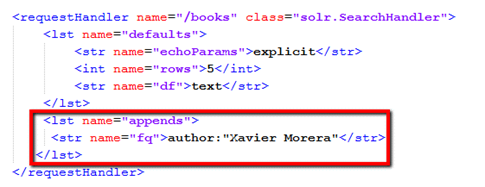

图 112: /books 处理程序追加部分

重新加载核心，然后对所有文档运行查询。你只会得到三个结果。

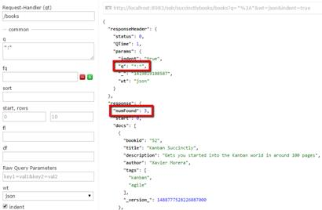

图 113:图书处理程序追加的结果

如果想要更具体的查询，可以试试`q= description:you`。在这个具体的查询中，如果使用 **`/select`** ，会得到两个结果。其中一本是我的书，另一本是科迪·林德利的书。

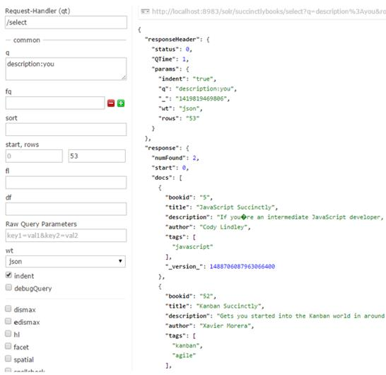

图 114:使用“/”选择处理程序时的查询结果

但是，如果您使用我们的`'/books'`处理程序进行同样的操作，您应该只会得到一个结果。

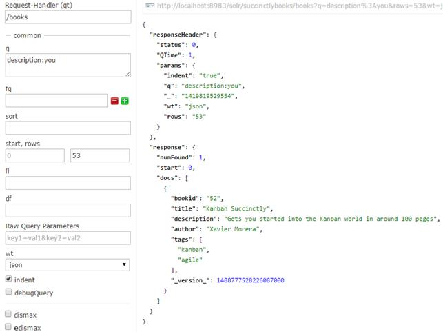

图 115:使用“/books”处理程序时的查询结果

#### `Response Fields`

您可能想要控制的另一个方面是在您的响应中为您的特定请求处理程序返回哪些字段。当您有大量字段时，这尤其有用。在我最近的一个项目中，每个文档大约有 200 个字段，其中只有大约 9 个字段需要在每个查询中返回以显示结果。那为什么要全部退回呢？

选择应该返回哪些字段非常容易。基本上，在默认情况下，只需添加一个`fl`条目，并枚举您想要返回的字段。

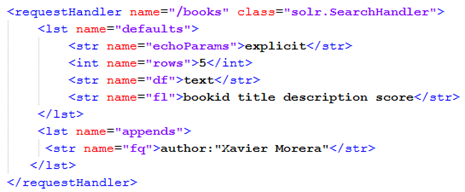

图 116:响应字段

现在我们来测试一下。首先，运行一个查询，这样就有了一个基线。接下来，重装核心。最后，在单独的窗口中，再次运行相同的查询。区别应该很明显。

首先:

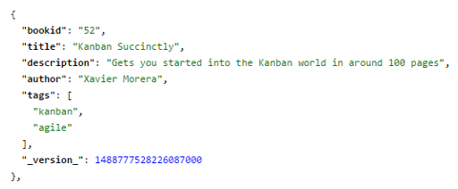

图 117:第一次查询，无分数

重装后:


图 118:带分数的查询

#### 面状

我们最后的小修改将是返回方面。如果你回想一下前几章，Faceting 是根据索引项以及指示每个项的出现次数的计数，将搜索结果排列成类别。它使用户更容易深入复杂的结果集并更好地对信息进行分类。

`Facet.query`是用于生成方面计数的任意查询。`facet.field`用于指定要将哪个字段视为小平面。前缀表示只有以该前缀开头的术语才能用作方面。

让我们在 Solrconfig.xml 中修改我们的 **`/books`** 请求处理程序来返回方面，在这个过程中，我们还将删除 author 的过滤器查询，这样我们就可以得到整个结果集。步骤很简单:

1.  注释掉`appends`部分。
2.  用`facet=true`添加一个`invariants`启用刻面，然后指定两个不同的刻面，`authors`和`tags`。应该将以下 XML 代码添加到您的配置中:

```
          <lst name="invariants">
          <str name="facet">true</str>
                  <str name="facet.field">author</str>
              <str name="facet.field">tags</str>
          </lst>

```

您的请求处理程序应该如下所示:

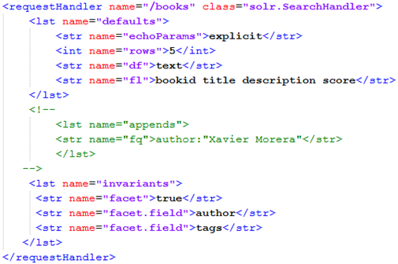

图 119:带有方面的请求处理程序

重新加载核心，用所有默认值对所有记录运行查询，并在响应中向下滚动。以下是您应该关注的内容:

*   The **`facet_counts`** section includes the resulting facets. In our case, we requested two facet fields, **`author`** and

    **标签**

    . As you can see, they are ordered from highest number of occurrences to lowest. Way to go Ryan with `6`. My friend Peter has three books at the time of writing, but my sources tell me he will be tied with Ryan pretty soon!

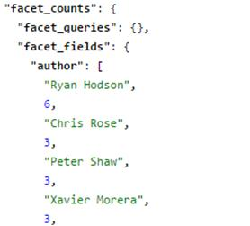

图 120:作者方面

*   再往下，我们可以看到标签，顺便说一下，这是我在这个练习中补上的。它们可以进一步改进，以获得更现实的结果。

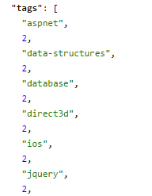

图 121:标签方面

*   最后，我们没有包括任何方面查询、方面日期、方面范围或方面间隔。

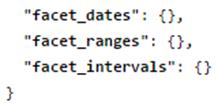

图 122:我们没有包括的方面

您也可以在多值字段上指定，如标签，也可以使用`facet.mincount`来避免显示低于特定点击次数的所有值。

使用刻面也可以进行分组。在这种情况下，我们没有每个*简洁地说*系列电子书的页数，但是如果我们有，我们可以通过使用以下方面动态地创建一个范围:

*   `facet.range=rangepageslong`:我们的射程。
*   `f..facet.range.start=0`:范围的开始。
*   `f..facet.range.end=200`:这里我指定 200 的顶值。
*   `f.pageslong.facet.range=20` *:* 差距大小。

Solr 将动态生成具有分组值的面！

**轮到你了:为什么不自己试试呢？**在页面大小上添加一列，添加字段，重新加载核心索引，试试这个练习！

如前几章所述，管理用户界面只包括非常小的字段子集。如果你想充分利用刻面的能力，你需要使用原始的查询参数。

需要完全使用所有字段的 Faceting 和其他操作通常是从第三方应用程序运行的，尤其是那些为管理服务而创建的应用程序。但是请记住:方面非常强大和有用，你应该尝试学习所有可能的参数和字段，即使只是允许使用方面。

### Solrconfig。Xml 常见的错误和陷阱

权力越大，责任越大，不幸的是，有了 Solr 的配置文件，你也可以做很多伤害。我已经列出了一些技巧来避免新来者在配置 Solr 时犯的常见错误和陷阱。避开它们会让你的搜索生活变得更容易。

*   专注于极简主义。例如，在 schema.xml 中，当您包含您不需要的东西时，这里同样适用:只包含您需要的或计划在不久的将来使用的东西。记住:YAGNI(你不需要它)。
*   别忘了缓存。缓存是提高性能的一个很好的工具，尤其是在高负载下，但是它并不总是合适的。
*   避免过度武装。当 Solr 启动时，您可以定义一些常见的升温查询。不要定义太多——定义得越多，启动时间就越长。
*   不要定义太多的处理程序。您可以为每个特定的场景定义太多的处理程序，这可能会使您的部署过于复杂，并将使维护成为一场噩梦。
*   请记住查看默认配置。开箱即用的配置并不总是生产的最佳选择，因此请记住在部署前进行审查。
*   一定要升级。Solr 以令人难以置信的速度移动，所以尽量保持最新，否则你可能会错过一些重要或有趣的功能。

## 总结

在本节中，我们学习了 Solrconfig.xml 是如何配置 Solr 核心的文件。我们学习了如何创建请求处理程序，然后使用追加来配置它。一些可能的配置包括指定方面、返回的行和响应字段。

我们还了解到，每次在 Solrconfig.xml 中进行更改时，都需要从 Admin UI 中重新加载核心。

现在是时候学习搜索和与 Solr 的相关性了。