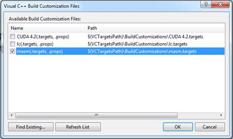
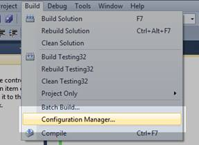
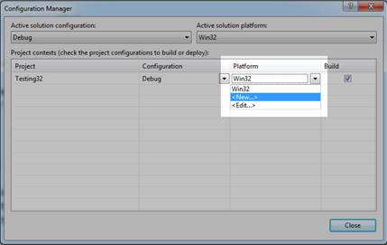
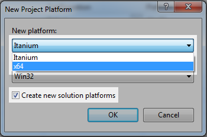
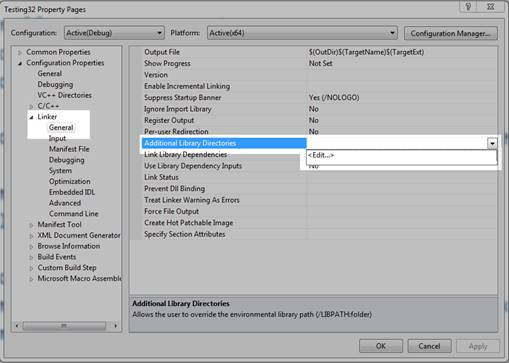
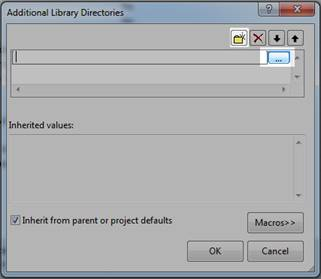
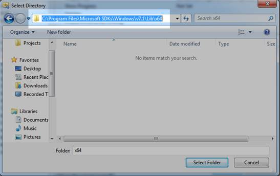

# 一、Visual Studio 中的汇编

如果没有检查过一些汇编编码方法，描述 x64 汇编语言是没有意义的。在 32 位和 64 位应用程序中，有多种方法可以对程序集进行编码。这本书将主要集中在 64 位汇编上，但是首先让我们检查一些编码 32 位汇编的方法，因为 32 位 x86 汇编与 64 位 x86 有许多共同的特征。

## 32 位应用程序中的内联汇编

Visual C++ Express 和 Visual Studio Professional 允许在 32 位应用程序中使用所谓的内联程序集。我在本书的代码中使用了 Visual Studio 2010，但是对于较新版本的 IDE，步骤是相同的。所有这些信息适用于 Visual Studio 2010、2012 和 2013(包括快速版和专业版)的用户。内联汇编是将汇编代码嵌入到普通的 C++中，要么是单行代码，要么是标有`__asm`关键字的代码块。

|  | 注意:您也可以在开头使用带有单个下划线的 _asm。这是为了向后兼容而维护的旧指令。最初，关键字是不带前导下划线的 asm，但 Visual Studio 不再接受这一点。 |

您可以使用`__asm`关键字将单行汇编代码注入到 C++代码中，而无需打开代码块。该关键字右侧的任何内容都将被 C++编译器视为本机汇编代码。

```asm
         int i = 0;
         _asm mov i, 25             // Inline assembly for i = 25     
         cout<<"The value of
  i is: "<<i<<endl;

```

您可以将多行汇编代码注入到常规 C++中。这是通过放置`__asm`关键字并在其后直接打开一个代码块来实现的。

```asm
  float Sqrt(float f) {
         __asm {
                fld f         // Push
  f to x87 stack
                fsqrt         //
  Calculate sqrt
                }
         }

```

使用内联程序集代替本机 32 位程序集文件有几个好处。向过程传递参数完全由 C++编译器处理，程序员可以通过名称来引用局部和全局变量。在本机程序集中，必须手动操作栈。传递给过程的参数以及局部变量必须被称为与`RSP`(栈指针)或`RBP`(基指针)的偏移量。这需要一些背景知识。

使用内联程序集绝对没有开销。C++编译器会将内联程序集生成的确切机器代码注入到它从 C++源代码生成的机器代码中。有些事情很容易在程序集中描述，有时将整个本机程序集文件添加到项目中并不方便。

内联程序集的另一个好处是，它使用与 C++相同的注释语法，因为我们实际上并没有离开 C++代码文件。不必将单独的程序集源代码文件添加到项目中可能会使项目导航更加容易，并实现更好的可维护性。

使用内联程序集的缺点是程序员失去了一些他们原本应该有的控制。他们失去了手动操作栈和定义自己的调用约定的能力，以及详细描述段的能力。最重要的妥协是 Visual Studio 不支持 x64 内联程序集。Visual Studio 不支持 64 位应用程序的内联程序集，因此任何带有内联程序集的程序都已经过时，因为它们仅限于传统的 32 位 x86。这可能不是问题，因为需要 x64 提供的更大寻址空间和寄存器的应用很少。

## c++中的本机汇编文件

内联程序集提供了很大的灵活性，但是有些东西是程序员无法用内联程序集访问的。因此，向项目中添加单独的本机程序集代码文件是很常见的。

Visual Studio Professional 安装了所有组件，可以轻松地将项目的目标 CPU 从 32 位更改为 64 位，但是 Visual C++的快速版本需要额外安装 Windows 7 SDK。

|  | 注意:如果您使用的是 Visual C++ Express，请下载并安装最新的 Windows 7 SDK(7.1 版或更高版本)。NET 4)。 |

现在，您将了解如何向简单的 C++项目添加本机程序集的指南。

1.  创建一个新的**空 C++** 项目。我已经为这个示例创建了一个空项目，但是向 Windows 应用程序添加程序集文件是一样的。
2.  给你的项目添加一个名为 **main.cpp** 的 C++文件。如前所述，这本书不是关于在汇编中制作整个应用程序。出于这个原因，我们将制作一个基本的 C++前端，只要它需要更高的性能，就调用汇编。
3.  在解决方案资源管理器中右键单击您的项目名称，然后选择**构建定制...**。生成自定义很重要，因为它们包含了 Visual Studio 如何处理程序集文件的规则。我们不希望 C++编译器编译。asm 文件，我们希望 Visual Studio 将这些文件交给 MASM 进行汇编。MASM 汇编了。asm 文件，它们在编译后与 C++文件链接，形成最终的可执行文件。


图 1

1.  选择名为 **masm(。目标。道具)**。在实际添加程序集代码文件之前执行此步骤非常重要，因为 Visual Studio 会在创建文件时而不是在生成项目时分配文件的处理方式。



图 2

1.  添加另一个 C++代码文件，这次是用。asm 扩展。我在示例代码中使用了 asmfunctions.asm 作为我的第二个文件名)。文件名可以是您为主程序文件选择的名称以外的任何名称。不要将程序集文件命名为 main.asm，因为编译器可能无法识别主方法的位置。


图 3

|  | 注意:如果您的项目是 32 位的，那么您应该能够编译下面的 32 位测试程序(代码在第六步中给出)。这个小应用程序将整数列表从 C++传递给程序集。它使用本机汇编过程来查找数组中的最小整数。 |

|  | 注意:如果你正在编译到 64 位，那么这个程序将不能在 32 位 MASM 上运行，因为 64 位 MASM 需要不同的代码。有关使用 64 位 MASM 的更多信息，请阅读[x64 的附加步骤](#_Additional_Steps_for)部分，其中解释了如何设置 64 位应用程序与本机程序集一起使用。 |

1.  在您创建的每个源代码文件中键入 32 位示例代码。第一个清单是针对 C++文件的，第二个清单是针对程序集的。

```asm
  // Listing: Main.cpp
  #include <iostream>

  using namespace std;

  // External procedure defined in
  asmfunctions.asm
  extern "C" int
  FindSmallest(int* i, int
  count);

  int main() {
         int arr[] = { 4, 2,
  6, 4, 5, 1, 8, 9, 5, -5 };

         cout<<"Smallest is "<<FindSmallest(arr,
  10)<<endl;

         cin.get();

         return 0;
  }

```

```asm
  ;
  asmfunctions.asm
  .xmm
  .model flat, c

  .data

  .code
  FindSmallest proc export
         mov edx, dword ptr [esp+4] ; edx = *int
         mov ecx, dword ptr [esp+8] ; ecx = Count

         mov eax, 7fffffffh   ; eax will be our answer

         cmp ecx, 0           ; Are there 0 items?
         jle Finished  ; If so we're done

  MainLoop:
         cmp dword ptr [edx], eax   ; Is *edx < eax?
         cmovl eax, dword ptr [edx] ; If so, eax = edx

         add edx, 4           ; Move *edx to next int
         dec ecx                    ;
  Decrement counter
         jnz MainLoop  ; Loop if there's more

  Finished:
         ret           ; Return with lowest in eax
  FindSmallest endp
  end

```

### x64 的附加步骤

Visual Studio 2010、2012 和 2013 Professional 附带了将本机程序集代码文件快速添加到 C++项目所需的所有工具。这些步骤提供了一种向 C++项目添加本机程序集代码的方法。截图取自 Visual Studio 2010，但 2012 在这些方面几乎完全相同。创建这个项目的第一步到第六步与 32 位应用程序描述的步骤相同。完成这些步骤后，必须将项目更改为针对 x64 架构进行编译。

1.  打开**建立**菜单，选择**配置管理器**。



图 4

1.  在配置管理器窗口中，选择 **<新建...>** 来自站台栏。



图 5

1.  在**新项目平台**窗口，从**新平台**下拉列表中选择 **x64** 。确保将中的**复制设置设置为 **Win32** ，并选中**新建解决方案平台**框。这将使 Visual Studio 完成将我们的路径从 32 位库更改为 64 位库的几乎所有工作。只有选择**创建新的解决方案平台**，并且安装了 Windows 7 SDK，编译器才会从 ML.exe(32 位版本的 MASM)变为 ML64.exe(64 位版本)。**



图 6

如果您使用的是 Visual Studio 专业版，现在应该能够编译本节末尾的示例。如果你使用的是 Visual C++速成版，那么还有一件事要做。

Windows 7 SDK 没有为 x64 编译正确设置库目录。如果你试图用本机汇编文件运行一个程序，那么你会得到一个错误，说编译器需要 **kernel32.lib** ，主 Windows 内核库。

```asm
  LINK : fatal error LNK1104: cannot open file 'kernel32.lib'

```

您可以通过告诉项目在安装了 Windows SDK 的目录中搜索 x64 库来轻松添加库。

1.  右键单击您的解决方案并选择**属性**。


图 7

1.  选择**链接器**，然后选择**通用**。单击**附加库目录**并选择 **<编辑… >** 。



图 8

1.  点击窗口右上角的**新建文件夹**图标。这将在它下面的框中添加一个新行。盒子的右边是一个带有省略号的按钮。单击省略号框，您将看到一个标准的文件夹浏览器，用于定位带有**内核 32.lib** 的目录。



图 9

下图所示的**C:\ Program Files \ Microsoft SDKs \ Windows \ v 7.1 \ Lib \ x64**目录是 Windows 7 SDK 默认安装 **kernel32.lib** 库的目录。打开该目录后，点击**选择文件夹**。在**附加库目录**窗口中，点击**确定**。这将带您回到**项目属性**页面。单击**应用**并关闭属性窗口。

现在，您应该能够编译 x64 并成功链接到本机程序集文件。



图 10

|  | 注意:32 位应用程序有一个内核 32.lib，x64 有一个内核 32.lib。它们的名称完全相同，但它们不是同一个库。请确保您尝试链接到的 kernel32.lib 文件位于 x64 目录中，而不是 x86 目录中。 |

### 64 位代码示例

将以下两个代码清单添加到我们添加到项目中的 C++源文件和程序集文件中。

```asm
    // Listing: Main.cpp
    #include <iostream>

    using namespace std;

    // External procedure defined in asmfunctions.asm
    extern "C" int FindSmallest(int* i, int count);

    int main() {
    int arr[] = { 4, 2, 6, 4, 5, 1, 8, 9, 5, -5 };

    cout<<"Smallest is "<<FindSmallest(arr, 10)<<endl;

    cin.get();

    return 0;
    }

```

```asm
    ; Listing: asmfunctions.asm
    .code
    ; int FindSmallest(int* arr, int count)
    FindSmallest proc ; Start of the procedure
    mov eax, 7fffffffh ; Assume the smallest is maximum int

    cmp edx, 0 ; Is the count <= 0?
    jle Finished ; If yes get out of here

    MainLoop:
    cmp dword ptr [rcx], eax ; Compare an int with our smallest so far
    cmovl eax, dword ptr [rcx] ; If the new int is smaller update our smallest
    add rcx, 4 ; Move RCX to point to the next int

    dec edx ; Decrement the counter
    jnz MainLoop ; Loop if there's more

    Finished:
    ret ; Return whatever is in EAX
    FindSmallest endp ; End of the procedure
    end ; Required at the end of x64 ASM files, closes the segments

```