# 三、学习 DAX

数据分析表达式(DAX)是用于在表格数据模型中定义计算的语言。DAX 也是客户端报告工具用来查询表格数据模型的查询语言。在本章中，我们将从 DAX 的基础知识(语法、运算符、数据类型和计算上下文)开始，稍后学习 DAX 函数。

DAX 查询引用包含许多函数，这些函数对表的列或表本身进行操作，并计算为标量常数或返回一个表。

## DAX 语法

当 DAX 用于定义计算列或度量时，公式总是以等号(=)开始。在 DAX 语法中，表的列名总是在方括号[ ]中引用，列名的前面是表的名称。

例如，在上一章中，我们使用以下公式定义了雇员表中计算出的“姓名”列:

```
    =Employee[FirstName] & " " & Employee[MiddleName] & " " & Employee[LastName]

```

我们使用以下公式定义了数据模型中的度量:

```
    Sales:=SUM(ResellerSales[SalesAmount])

```

在这些例子中，我们看到一个公式以等号开头，所有的列都被引用为<*表名*>**【<***列名>***】**。

当 DAX 用作查询表格式数据模型的查询语言时，语法显示为:

```
    DEFINE
        { MEASURE <table>[<col>] = <expression> }]
    EVALUATE <Table Expression>
    [ORDER BY {<expression> [{ASC | DESC}]} [, …]
        [START AT {<value>|<parameter>} [, …]] ]

```

DAX 作为一种查询语言，总是以 EVALUATE 关键字开始，后面跟一个表达式，这个表达式返回一个表。

## DAX 运算符

DAX 支持四种不同类型的计算运算符:算术、比较、文本串联和逻辑。

算术运算符

| 操作员 | 操作 |
| + | 增加 |
| - | 减去 |
| * | 乘；成倍增加；（使）繁殖 |
| / | 划分 |
| ^ | 幂运算 |

比较运算符

| 操作员 | 操作 |
| = | 等于 |
| > | 大于 |
| < | 不到 |
| >= | 大于或等于 |
| <= | 小于或等于 |
| <> | 不等于 |

文本操作符

| 操作员 | 操作 |
| & | 串联 |

逻辑运算符

| 操作员 | 操作 |
| && | 逻辑“与” |
| &#124;&#124; | 逻辑或 |

DAX 运算符的优先级顺序如下:

1.  ^
2.  –(负值的符号运算符)
3.  * /
4.  ！(非操作员)
5.  + -
6.  &
7.  ，> =，<=, =, <>

## DAX 数据类型

支持以下数据类型。导入数据或在公式中使用值时，即使原始数据源包含不同的数据类型，数据也会转换为以下数据类型之一。公式产生的值也使用这些数据类型。

| 模型中的数据类型 | DAX 中的数据类型 | 描述 |
| --- | --- | --- |
| 整数 | 64 位(8 字节)整数值 | 没有小数位数的数字。整数可以是正数或负数，但必须是介于-9，223，372，036，854，775，808 (-2^63)和 9，223，372，036，854，775，807 (2^63-1).)之间的整数 |
| 小数 | 64 位(8 字节)实数 | 实数是可以有小数位的数字。实数涵盖了广泛的值:
从-1.79E +308 到-2.23E -308 的负值
零
从 2.23E -308 到 1.79E +308 的正值
但是，有效位数仅限于 15 位小数。 |
| 布尔代数学体系的 | 布尔代数学体系的 | 真值或假值。 |
| 文本 | 线 | Unicode 字符数据字符串。可以是以文本格式表示的字符串、数字或日期。 |
| 日期 | 日期/时间 | 接受的日期时间表示中的日期和时间。
有效日期均为 1900 年 3 月 1 日以后的日期。 |
| 货币 | 货币 | 货币数据类型允许值介于-922，337，203，685，477.5808 和 922，337，203，685，477.5807 之间，具有四个固定精度的十进制数字。 |
| 不适用的 | 空白的 | 空白是 DAX 中的一种数据类型，它表示并替换 SQL 空值。您可以使用 blank 函数创建空白，并使用逻辑函数 ISBLANK 测试空白。 |

此外，DAX 使用表数据类型。DAX 在许多函数中使用这种数据类型，例如聚合和时间智能计算。有些函数需要对表的引用；其他函数返回一个表，该表可以用作其他函数的输入。在一些需要表作为输入的函数中，可以指定一个计算结果为表的表达式。对于某些函数，需要引用基表。

## 评估上下文

DAX 公式或表达式总是在以下上下文之一中计算:

*   行上下文
*   查询上下文
*   筛选上下文

行上下文

在行上下文中计算 DAX 公式时，将为表达式引用的列的每一行计算表达式。计算列表达式始终在行上下文中计算。

例如，在我们的数据模型中，我们使用以下 DAX 公式定义了计算列。

```
    =Employee[FirstName] & " " & Employee[MiddleName] & " " & Employee[LastName]

```

这个 DAX 公式是为雇员表的每一行计算的，因此是在雇员表的行上下文下计算的。

查询上下文

当在查询的上下文中计算 DAX 公式时，通过应用为该查询定义的过滤器来计算表达式。

例如:

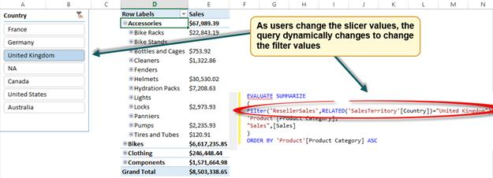

图 57:动态变化的查询

在此 Excel 报告中，当用户单击国家切片器的各种值时，数据透视表的 DAX 查询会动态变化，以反映用户选择的筛选值。换句话说，DAX 查询据说是在查询上下文中评估的。

筛选上下文

当在筛选器上下文中评估 DAX 公式时，公式中定义的筛选器会覆盖查询上下文或行上下文中的任何筛选器。例如，在我们的数据模型中，我们定义了以下计算度量:

```
    FY04 Sales:=CALCULATE(SUM(ResellerSales[SalesAmount]),'Date'[FiscalYear]=2004)

```

此公式包含 2004 财年的筛选器，因此将始终在此筛选器上下文下进行评估。

如果在会计年度的切片器设置为的 Excel 报表中使用了度量“2004 财年销售额”，则切片器选择不会影响 2004 财年销售额度量值，因为该度量值是在筛选器上下文中评估的，该筛选器上下文将覆盖查询上下文。


图 58:Excel 中的过滤器上下文

## DAX 功能

DAX 语言包含一组丰富的功能，这使得它成为一种强大的分析和报告语言。这些功能分为以下几类:

*   聚合函数
*   日期和时间功能
*   过滤功能
*   信息功能
*   逻辑功能
*   数学和三角函数
*   统计函数
*   文本功能
*   时间智能功能

讨论 DAX 查询引用中的每个函数超出了本书的范围；但是，我们将讨论每个类别中的一些常用函数。

### 聚合函数

聚合函数用于聚合列。这些主要用于定义度量。

以下是 DAX 中可用的聚合函数列表以及每个函数的简要描述。

| 功能 | 使用 |
| --- | --- |
| 平均的 | 返回一列中所有数字的平均值(算术平均值)。 |
| 平均的 | 返回一列中所有值的平均值(算术平均值)。处理文本和非数值。 |
| 平均的 | 对表中的一组表达式求平均值。 |
| 马克斯(男子名ˌ等于 Maximilian) | 返回列中最大的数值。 |
| 麦克斯 | 返回对表求值的一组表达式中的最大值。 |
| 部 | 返回列中最小的数值。 |
| MINX | 返回对表求值的一组表达式中的最小值。 |
| 总和 | 将一列中的所有数字相加。 |
| 苏姆 | 返回对表求值的一组表达式的总和。 |
| 数数 | 计算一列中数值的数量。 |
| COUNTA | 计算列中非空值的数量。 |
| counta | 计算对表求值的一组表达式。 |
| COUNTBLANK | 计算列中空白值的数量。 |
| 数数 | 计算表中的总行数。 |
| 国家 | 计算从嵌套表函数(如筛选函数)返回的行数。 |

聚合函数非常容易解释，使用起来也很简单。在上表中列出的函数集中，有带有“X”后缀的聚合函数的变体，例如 SUMX 和 AVERAGEX。这些函数用于聚合表或返回表的表达式。例如，SUMX 的语法是:

```
    SUMX(<table>, <expression>)

```

我们可以如下定义计算度量。

```
    France Sales:=SUMX(FILTER('ResellerSales',RELATED(SalesTerritory[Country])="France"),ResellerSales[SalesAmount])

```

在这个公式中，FILTER 函数首先过滤法国的经销商销售额，然后 SUMX 函数汇总法国销售交易的销售额。

X 后缀聚合函数为我们提供了在表达式返回的一组行(或一个表)上进行聚合的灵活性。

上表中列出的一些聚合函数有一个“A”后缀(AVERAGEA，COUNTA)。后缀“A”用于聚合非数字数据类型的列或数据。所有其他聚合函数只能聚合数字数据类型。例如:

```
    COUNTA(<column>)

```

当函数找不到任何要计数的行时，函数返回一个空白。如果有行，但没有一行满足指定的条件，则函数返回 0。

```
    Regions:=COUNTA(SalesTerritory[Region])

```

前面的 DAX 公式计算了 AdventureWorks 销售区域覆盖的区域，可以在下面的报告中使用。


图 59:对非数字数据类型使用聚合公式

### 日期和时间功能

在数据仓库或维度模型中，日期和时间维度是一致的维度，因为它们在所有数据集市中用于跨日期和时间分析度量。数据模型中定义的日期维度应该具有尽可能多的列或属性(例如，日、月、日、月)，以使最终用户能够灵活地识别数据随时间变化的趋势。

为了支持跨日期和时间维度的分析，并从日期列中提取各种属性，我们有以下日期和时间函数。

| 功能 | 使用 |
| --- | --- |
| 日期 | 以日期时间形式返回指定日期。 |
| DATEVALUE(日期值) | 将文本日期值转换为日期时间格式的日期。 |
| 天 | 以数值形式返回一个月中的某一天。 |
| EDATE | 以开始日期之前或之后的月数返回日期。 |
| 伊奥蒙斯 | 返回该月最后一天的日期。 |
| 小时 | 以从 0 到 23 的数值形式返回小时。 |
| 分钟 | 以 0 到 59 之间的数值形式返回分钟。 |
| 月 | 以从 1 到 12 的数值形式返回月份。 |
| 现在 | 返回当前日期和时间。 |
| 时间 | 将小时、分钟和秒转换为日期时间格式的时间值。 |
| 时间值 | 将文本日期值转换为日期时间格式的时间。 |
| 今天 | 返回当前日期。 |
| 工作日 | 以 1(星期日)和 7(星期六)之间的数值形式返回一周中的当前日期。 |
| 周数 | 返回一年中的周数。 |
| 年 | 返回日期的当前年份，整数值在 1900 和 9999 之间。 |
| YEARFRAC(年复一年) | 计算由两个日期之间的天数表示的年分数。 |

函数 DAY、MONTH 和 YEAR 分别用于从日期值中提取日、月和年。例如:

```
    YEAR(<date>) , Day(<date>), Month(<date>)
    =YEAR('Date'[FullDateAlternateKey])

```

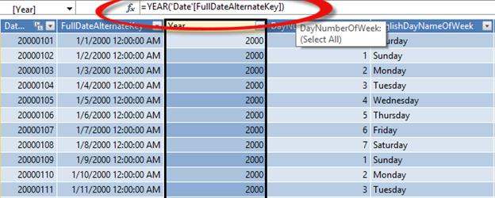

图 60:使用日期和时间函数

### 过滤功能

过滤函数是另一组常用的函数，我们已经在前面的例子中使用过。当我们在表的各个列上对度量进行切片和切割时，我们会为这些列的值过滤数据，这是通过使用过滤函数来实现的。

下表列出了可用的过滤器功能。

| 功能 | 使用 |
| --- | --- |
| 计算(<expression>、<filter1>、<filter2>……)</filter2></filter1></expression> | 计算由函数中指定的筛选器修改的上下文中的表达式。 |
| 可计算表(<expression>、<filter1>、<filter2>……)</filter2></filter1></expression> | 在由函数中指定的筛选器修改的上下文中计算表表达式。 |
| 相关(<column>)</column> | 从另一个相关表中返回相关值。 |
| 可关联(<tablename>)</tablename> | 基于筛选器上下文计算表表达式。 |
| ALL({ &#124; <column>[， <column>[， <column>[，…]]]})</column></column></column>

 | 返回表中的所有行或列中的所有值，忽略可能已应用的任何筛选器。 |
| 等位基因(123 t0、<column>、<column>、…)</column></column> | 移除表中除已应用于指定列的筛选器之外的所有上下文筛选器。 |
| allnoblanrow(&#124;

 | 从关系的父表中，返回除空行之外的所有行，或除空行之外的列的所有不同值，而不考虑上下文筛选器。 |
| ALLSELECTED([ <tablename>&#124; <columnname>)</columnname></tablename> | 获取表示查询中所有行和列的上下文，同时维护筛选器和行上下文。 |
| DISTINCT( <column>)</column> | 返回由一列组成的表，该列具有与指定列不同的值。 |
| 过滤器(、<filter>)</filter>

 | 返回表示另一个表或表达式子集的表。 |
| 过滤器(<columnname>)</columnname> | 返回作为筛选器直接应用于列名的值。 |
| HASONEFILTER(<columnname></columnname> | 当列名上直接筛选的值的数量为 1 时，返回真；否则返回 FALSE。 |
| HASONEVALUE( <columnname>)</columnname> | 当列名的筛选上下文只有一个不同的值时，返回真；否则返回 FALSE。 |
| ISCROSSFILTERED( <columnname>)</columnname> | 当筛选列名或同一表或相关表中的另一列时，返回真。 |
| ISFILTERED( <columnname>)</columnname> | 筛选列名时返回真；否则返回 FALSE。 |
| 更早(<column>、<number>)</number></column> | 用于嵌套计算，其中需要使用某个值作为输入，并基于该输入进行计算。 |
| 最早(<column>)</column> | 在指定列的外部计算过程中，返回指定列的当前值。 |
| 值(<column>)</column> | 返回包含指定列的不同值的单列表。 |

虽然前面的函数被归类为过滤函数，但每一个函数过滤数据的方式都是独特的。让我们在这里讨论一些过滤函数。

计算函数

CALCULATE 函数是最常用的函数之一，用于通过应用各种过滤器来计算表达式。CALCULATE 函数中定义的过滤器会覆盖客户端工具中的查询上下文。例如:

```
    CALCULATE( <expression>, <filter1>, <filter2>… )

```

以前，我们将计算度量定义为 2004 财年销售额，它使用计算函数来计算 2004 财年的销售额:

```
    FY04 Sales:=CALCULATE(SUM(ResellerSales[SalesAmount]),'Date'[FiscalYear]=2004)

```

在前面的 DAX 公式中，销售额的总和是通过过滤 2004 财年的经销商销售额表来计算的。我们看到“会计年度”列是在“日期”表中定义的，但是由于表之间定义的关系，仍然可以使用会计年度来过滤“经销商销售额”表。CALCULATE 函数自动使用表之间的活动关系来筛选表达式。

滤波函数

FILTER 函数通常用于根据筛选条件筛选表或表达式。例如:

```
    FILTER(<table>,<filter>)

```

在前面的示例中，为了计算 2004 财年的销售额，我们可以使用以下 DAX 公式计算相同的度量:

```
    FY04 Sales:=SUMX(FILTER('ResellerSales',RELATED('Date'[FiscalYear])=2004),ResellerSales[SalesAmount])

```

在此公式中，我们首先过滤 2004 财年的经销商销售额表，并使用 SUMX 计算过滤后的经销商销售额的总和。

相关函数

RELATED 函数是另一个流行的、常用的函数，用于计算列或度量中，以执行对相关表的查找，并获取与基础关系相关的列值。RELATED 函数使用在数据建模过程中定义的基础表关系对相关表执行查找。

RELATED 函数要求当前表和具有相关信息的表之间存在关系。相关函数允许用户查找维度或主表，类似于 Excel 的 VLOOKUP。例如:

```
    RELATED(<column>)

```

在本例中，为了计算法国的总销售额，我们使用了相关函数:

```
    France Sales:=SUMX(FILTER('ResellerSales',RELATED(SalesTerritory[Country])="France"),ResellerSales[SalesAmount])

```

在这个公式中，我们使用属于销售区域的国家列来过滤销售表。因此，我们使用 RELATED 函数，该函数使用 ResellerSales 表和 SalesTerritory 表之间定义的关系来筛选法国国家的 ResellerSales 表。

全功能

ALL 函数用于检索列或表的所有值，忽略任何可能已应用的筛选器。此函数对于覆盖筛选器和在表中的所有行上创建计算非常有用。例如:

```
    ALL( {<table> | <column>[, <column>[, <column>[,…]]]} )

```

在我们的数据模型中，假设我们需要计算每个国家对总销售额的贡献。为了创建此度量，我们定义了以下计算:

```
    Total Geography Sales:=CALCULATE(SUM(ResellerSales[SalesAmount]),ALL(SalesTerritory[Country]))
    % Geography Contribution:=[Sales]/[Total Geography Sales]

```


图 61:使用全部功能

### 信息功能

信息函数是检查某些数据值、空白或错误是否存在的有用函数。大多数信息函数返回布尔值，因此它们最好与 IF 函数一起使用。

| 功能 | 使用 |
| --- | --- |
| 包含 | 如果值存在或包含在指定的列中，则返回真。 |
| 伊斯布兰克 | 如果值为空，则返回真；如果值不为空，则返回假。 |
| iseries error | 如果该值为错误，则返回“真”，否则返回“假”。 |
| ISLOGICAL | 如果该值是逻辑值或布尔值，则返回真。 |
| 非文本 | 如果指定的值不是文本，则返回真。 |
| ISNUMBER | 如果指定的值是数字，则返回真。 |
| ISTEXT | 如果指定的值是文本，则返回真。 |
| 查找值 | 返回符合指定搜索条件的行的值。 |
| 小路 | 返回一个带分隔符的文本字符串，其中包含当前标识符所有父级的标识符，从最早的开始，直到当前。 |
| 路径包含 | 如果该项存在于指定的路径中，则返回真。 |
| PATHITEM | 从 PATH 函数的计算中返回指定位置的项。位置从左到右计算。 |
| PATHITEMREVERSE | 从对 PATH 函数求值得到的字符串中返回指定位置的项。位置从右向左向后计数。 |
| 通路长度 | 返回给定路径结果中指定项的父项数量，包括自身。 |

CONTAINS 函数

CONTAINS 函数返回一个布尔数据类型(真或假)，具体取决于该值是否存在于指定的列中。例如:

```
    CONTAINS(<table>, <columnName>, <value>[, <columnName>, <value>]…)

```

考虑这样一个场景:AdventureWorks 管理层已经决定修改销售目标，以便每个国家都应努力实现 20%的销售增长目标，但美国除外。由于市场情况，管理层决定为美国设定 10%的增长目标。

为了计算修订后的销售目标，我们使用如下的 CONTAINS 函数:

```
    Revised Sales Target:=IF(CONTAINS(ResellerSales,SalesTerritory[Country],"United States"),[Sales]+0.1*[Sales],[Sales]+0.2*[Sales])

```

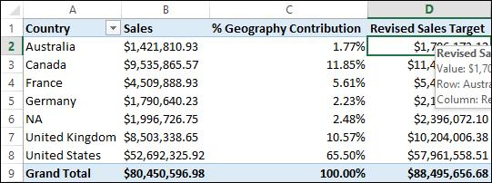

图 62:使用 CONTAINS 函数

ISBLANK 函数

ISBLANK 函数检查列值，并根据列值是否为空返回一个布尔值。

空白是表格数据模型中的一种特殊数据类型，用于处理空值。空白并不意味着 0 或空白文本字符串。空白是没有值时使用的占位符。此外，在表格数据模型中，我们没有空值，因此当数据被导入时，空值被转换为空值。

ISBLANK 函数对于检查列中的空白值非常有用。例如:

```
    ISBLANK(<value>)
    PreviousSales:=CALCULATE([Sales],PARALLELPERIOD('Date'[FullDateAlternateKey],-1,YEAR))
    YoY:=[Sales]-[PreviousSales]
    YoY %:=IF(ISBLANK([Sales]),BLANK(),IF(ISBLANK([PreviousSales]),1,[YoY]/[PreviousSales]))

```


图 63:在数据模型中使用 ISBLANK 函数

在本例中，我们使用 ISBLANK 函数来测试当年的销售额是否为空，如果为空，则显示一个空值。此外，如果当年的销售额不是空白的，我们会检查上一年的销售额是否为空白。如果是的话，我们代表着 100%的销售额增长；否则，我们计算上一年销售额的百分比增长。

同样，我们有 ISTEXT、ISNONTEXT、ISERROR 和 ISLOGICAL 函数，用于测试列的值并返回布尔值。

PATH 函数

路径函数是专门为解决父子维度而设计的。与自动检测和创建父子层次结构的多维模型不同，表格数据模型不支持立即创建父子层次结构。

在我们的数据模型中，我们有一个员工表，该表具有父子关系，其中每一行代表一个拥有经理的员工，而该经理又是同一表中的员工。

首先，我们使用 PATH 函数在 Employee 表中创建一个计算列，以确定每个雇员到其父代的路径。

```
    =PATH(Employee[EmployeeKey],Employee[ParentEmployeeKey])

```

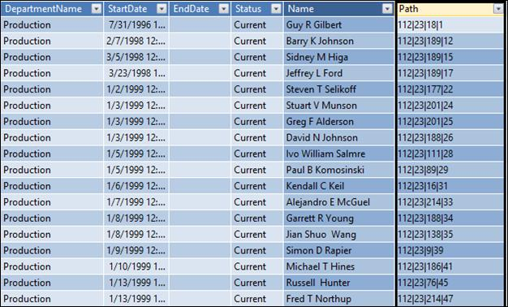

图 64:使用路径函数

如您所见，该列现在包含从下到上存储为单个字符串值的 EmployeeKey 的完整路径。

现在，对于父子关系中的每个级别，我们都希望创建一个列。我们使用每个计算列的 DAX 函数 PathItem 来获取特定级别的键。为了获得路径的第一级，我们使用下面的函数。

```
    =PathItem([Path],1,1)

```

为了得到第二个层次，我们使用下面的函数。

```
    =PathItem([Path],2,1)

```

PathItem 函数的输出将是经理的雇员；但是，我们需要管理器的名称，因此我们使用 LOOKUPVALUE 函数来查找它，如下所示。

```
    =LOOKUPVALUE(Employee[Name], Employee[EmployeeKey],PATHITEM([Path],1,1))

```

我们使用前面的 LOOKUPVALUE 函数为层次结构的每个级别定义计算列，以形成如下图所示的扁平层次结构。

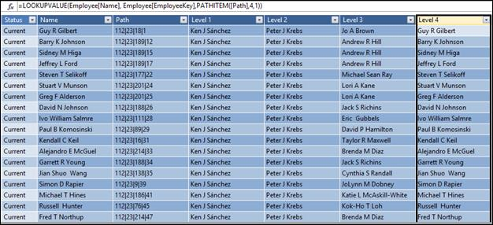

图 65:使用 PathItem 和 LOOKUPVALUE 列出层次级别

接下来，我们通过切换到图表视图来创建员工层次结构:


图 66:创建员工层次结构

现在，我们在 Excel 中浏览层次结构:

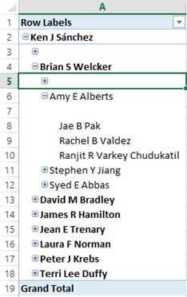

图 67:Excel 中的员工层次结构

创建父子层次结构的每种方法的缺陷是:

*   应该提前知道父子层次结构中的级别数，以便我们可以为每个级别创建计算列。
*   如果我们有一个参差不齐的层次结构，一些层次是空白的——因此在图 67 的层次结构中有空白的值。但是，我们可以通过使用 ISBLANK 函数来处理空白值。

这种使用 Path 函数创建父子层次结构的方法参考了微软项目经理 Kasper de Jonge 的以下博客:[http://www . power pivot blog . nl/power pivot-Denali-parent-child-use-DAX/](http://www.powerpivotblog.nl/powerpivot-denali-parent-child-using-dax/)

### 逻辑功能

逻辑函数在检查、错误处理和执行逻辑“与/或”运算中很有用。下表列出了 DAX 支持的逻辑功能。

| 功能 | 使用 |
| --- | --- |
| 和 | 评估两个参数是否都为真，并返回真或假。 |
| 错误的 | 返回假。 |
| 如果 | 将第一个参数评估为逻辑测试，如果条件为真，则返回一个值，如果条件为假，则返回另一个值。 |
| IFERROR | 计算表达式，如果表达式返回错误，则返回指定的值。如果该值不返回错误，则返回该值。 |
| 不 | 更改逻辑真或假的值。 |
| 运筹学 | 评估两个参数中的一个是否为真，如果一个为真则返回真，如果两个都为假则返回假。 |
| 转换 | 根据值列表计算表达式，并返回一个可能的表达式。这个函数非常类似于 C++ 或 C# 中的 SWITCH 函数。 |
| 真实的 | 返回真。 |

此类别中列出的大多数函数都是不言自明的，通常用于其他编程语言。

IFERROR 是 DAX 中用于错误处理的特殊函数，我们将对此进行更详细的讨论。IFERROR 实际上是两个函数的组合，IF 和 ISERROR。由于它们通常用于错误处理，SSAS 产品团队决定拥有一个专用的 IFERROR 功能。例如:

```
    IFERROR(value, value_if_error)

```

在前面的例子中，为了计算同比百分比，我们使用了 ISBLANK 函数来处理前一年的空白值。但是，我们也可以使用 IFERROR 函数来获得类似的结果，如下例所示。

```
    YoY %:=IF(ISBLANK([Sales]),BLANK(),IFERROR([YoY]/[PreviousSales],BLANK()))

```

### 数学函数

由于 DAX 是一种分析查询语言，它必须支持对分析和报告有用的数学函数。DAX 支持以下数学函数。

| 功能 | 使用 |
| --- | --- |
| 防抱死制动装置 | 返回数值参数的绝对值。 |
| 天花板 | 将数字向上舍入到最接近的整数值或有效倍数。 |
| 货币 | 计算作为参数传递的值，并以货币形式返回结果。 |
| 经历 | 将 *e* 的值(2.71828182845904)提升到指定的功率。 |
| 事实 | 返回数值的阶乘。 |
| 地面 | 将数字向下舍入到最接近的有效倍数。 |
| （同 Internationalorganizations）国际组织 | 将数值向下舍入到最接近的整数值。 |
| ISO。天花板 | 将数字向上舍入到最接近的整数值或有效倍数。 |
| LN | 返回数值的自然对数。 |
| 原木 | 将数字的对数返回到指定的底数。 |
| LOG10 | 返回数字的以 10 为底的对数。 |
| MROUND | 返回舍入到所需倍数的数字。 |
| 产品改进(Product Improve) | 返回π的值，3.14159265358979，精确到 15 位数。 |
| 力量 | 返回一个数的幂的结果。 |
| 商 | 执行除法并只返回除法结果的整数部分。 |
| 边缘 | 返回大于或等于 0 且小于 1 的均匀分布的随机数。 |
| 兰伯特 | 返回您指定的两个数字之间的随机数。 |
| 轮次 | 将数字舍入到指定的位数。 |
| 四舍五入 | 向下舍入数值。 |
| 综述 | 向上舍入数值。 |
| 符号 | 确定数值的符号，对于正值返回 1，对于零值返回 0，对于负值返回-1。 |
| SQRT(工作站) | 返回数值的平方根。 |
| 总和 | 返回一列中所有数字的总和。 |
| 苏姆 | 返回对表中每一行求值的表达式的总和。 |
| TRUNC | 通过删除数字的小数部分将数字截断为整数。 |

我相信这些函数是非常不言自明的，不需要详细阐述。如有必要，我们可以参考[在线文档](http://technet.microsoft.com/en-us/library/ee634241.aspx)了解函数的语法并投入使用。

### 统计函数

DAX 支持以下统计函数列表。请注意，聚合函数和统计函数(SUMX、COUNT、AVERAGE 等)之间有一些重叠。).

| 功能 | 使用 |
| --- | --- |
| ADDCOLUMNS | 将计算列添加到表或表表达式中。 |
| 平均的 | 返回列中数字的算术平均值。 |
| 平均的 | 返回列中数字的算术平均值，但处理非数值 |
| 平均的 | 计算表中一组表达式的算术平均值。 |
| 数数 | 计算列中包含数字的单元格的数量。 |
| COUNTA | 计算列中不为空的单元格数，而不管数据类型如何。 |
| counta | 计算表中指定表达式产生非空值的行数。 |
| COUNTBLANK | 计算一列中空白单元格的数量。 |
| 国家 | 计算指定表或表格表达式中的行数。 |
| 数数 | 计算计算结果为数字的行数。 |
| 交叉连接 | 返回一个表，该表包含参数中所有表的所有行的笛卡尔乘积。 |
| 独特计数 | 计算一列数字中不同单元格的数量。 |
| 产生 | 返回一个表，其中表 1 中的每一行与计算表 2 的结果之间都有笛卡尔乘积。 |
| 全部生成 | 返回一个表，其中表 1 中的每一行与计算表 2 的结果之间都有笛卡尔乘积。 |
| 马克斯(男子名ˌ等于 Maximilian) | 返回列中包含的最大数值。 |
| 麦克斯，麦克斯 | 返回列中的最大值，包括布尔值和空值。 |
| 麦克斯 | 计算表中每一行的表达式，并返回最大的数值。 |
| 部 | 返回列中最小的数值。 |
| 迈纳 | 返回列中最小的数值，包括布尔值和空值。 |
| MINX | 为表的每一行计算表达式后，返回最小的数值。 |
| RANK。情商 | 返回一个数字在数字列表中的排名。 |
| RANKX | 返回表参数中每行的数字在数字列表中的排名。 |
| 排 | 使用每个列的表达式返回由单行组成的表。 |
| 样品 | 从指定的表中返回一个行数示例，行数由用户决定。 |
| STDEV。P | 返回总体标准偏差。 |
| STDEV。S | 返回样本标准偏差。 |
| 新浪网.P | 返回总体标准偏差。 |
| 新浪网.S | 返回样本标准偏差。 |
| 总结 | 返回一个汇总表。 |
| TOPN | 返回表的前 N 行，其中 N 是用户指定的数值。 |
| 有 p | 返回样本总体的方差。 |
| 风险值。S | 返回总体的方差估计值。 |
| 瓦克斯足球俱乐部 | 返回总体的方差估计值。 |
| VARX。S | 返回样本总体的方差。 |

当我们在客户端工具中使用 DAX 作为查询语言时，一些统计函数(如 GENERATE、SUMMARIZE、CROSSJOIN 和 TOPN)是有用的函数。在本节中，我们将讨论 RANK 函数。

RANKX 函数

RANKX 函数，顾名思义，用于根据表达式或度量对列进行排序。例如:

```
    RANKX(<table>, <expression>[, <value>[, <order>[, <ties>]]])

```

考虑这样一个场景:AdventureWorks 希望根据产品的需求和订单数量对产品进行排名。为了实现这一点，我们首先定义一个计算度量，订单，来获取订单数量。

```
    Orders:=SUM(ResellerSales[OrderQuantity])

```

接下来，我们使用“产品”表中的 RANKX 函数来定义一个计算列，该列根据度量“订单”对产品进行排序。

```
    =RANKX(Product,[Orders])

```

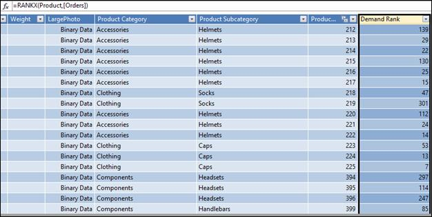

图 68:使用 RANKX 函数

### 文本功能

文本函数类似于字符串操作函数。这些是 DAX 查询参考中可用的文本函数:

| 功能 | 使用 |
| --- | --- |
| 替换 | 用不同的文本替换部分文本字符串。 |
| 报告 | 将文本重复参数中指定的次数。 |
| 正确 | 从字符串末尾返回指定数量的字符。 |
| 搜索 | 从左到右返回第一次找到特定字符或文本字符串的字符数。搜索不区分大小写，区分重音。 |
| 代替者 | 用新文本替换现有文本。 |
| 整齐 | 从字符串中删除前导空格和尾随空格。 |
| 上面的 | 将字符串转换为大写。 |
| 价值 | 将数值的文本表示形式转换为数字。 |
| 空白的 | 返回 BLANK 值。 |
| 连锁的 | 连接两个文本字符串。 |
| 确切的 | 比较两个文本字符串，如果它们完全相同，包括大小写，则返回真。 |
| 发现 | 返回一个文本字符串在另一个文本字符串中的起始位置。 |
| 固定的；不变的 | 将数字舍入到指定的小数位数，并将结果作为文本返回。 |
| 格式 | 将值转换为文本。 |
| 左边的 | 返回从文本字符串开始的指定字符数。 |
| 低输入联网（low-entry networking 的缩写） | 返回文本字符串中的字符数。 |
| 降低 | 将文本字符串转换为小写。 |
| 中间的 | 根据起始位置和长度返回字符串。 |

大多数文本函数都是不言自明的，非常简单，因此我们将不详细讨论它们。事实上，在前面的一些例子中，我们已经使用了 FORMAT 和 CONCATENATE 函数。

### 时间智能功能

如前所述，日期和时间是数据仓库中一致的维度，因为大多数分析都是跨时间轴执行的，例如比较 YoY、QoQ 和 MoM 等度量，以及计算 YTD、QTD 和 MTD。时间智能功能可用于促进此类计算。

| 功能 | 使用 |
| --- | --- |
| CLOSINGBALANCEMONTHclosingbalancecortmentCLOSINGBALANCEYEAR | 计算给定期间日历结束时的值。 |
| OPENINGBALANCEMONTHOPENINGBALANCEQUARTEROPENINGBALANCEYEAR | 在给定期间之前的期间的日历结束时计算值。 |
| TOTALMTD完全TOTALQTD | 计算从周期的第一天开始到指定日期列中的最晚日期结束的时间间隔内的值。 |
| 日期添加 | 返回一个包含日期列的表，日期在时间上向前或向后移动。 |
| 日期介于 | 返回一个表，该表包含以 start_date 开始并持续到 end_date 的日期列。 |
| 日期周期 | 返回一个表，该表包含一列以 start_date 开始并持续指定间隔数的日期。 |
| 日期时间
日期时间
日期系统 | 返回一个表，该表包含当前上下文中给定期间的日期列。 |
| endofonth
endofquarter
endofear | 返回当前上下文中给定期间的最后一个日期。 |
| 下一个月下一个季度下一年 T2 | 基于当前上下文中指定的日期，返回一个包含下一期间所有日期的单列表。 |
| 初次约会 | 基于当前上下文返回指定日期列的第一个日期。 |
| FIRSTNONBLANK | 返回由当前上下文筛选的列中表达式不为空的第一个值。 |
| 最后一次约会 | 返回指定日期列在当前上下文中的最后一个日期。 |
| LASTNONBLANK | 返回由当前上下文筛选的列中表达式不为空的最后一个值。 |
| 平行周期 | 返回一个包含日期列的表，该日期列表示与当前上下文中指定日期列中的日期平行的期间，日期在时间上向前或向后移动了一定的间隔。 |
| 前一天
前一个月
前一个季度
前一年 | 基于当前上下文中指定的日期，返回一个包含前一时期所有日期的单列表。 |
| SAMEPERIODLASTYEAR | 返回一个表，该表包含使用当前上下文从指定日期列中的日期向后移动一年的日期列。 |
| STARTOFMONTH
启动总部
启动年份 | 基于当前上下文返回指定期间的第一个日期。 |

为了在我们的数据模型中使用时间智能函数，我们需要将一个表标记为日期表，并将该表中的一列标识为唯一标识符，该标识符应该是日期数据类型。

在我们的数据模型中，我们定义了一个可以标记为日期表的日期表，以及一个列 FullDateAlternateKey，它是该表的唯一标识符，属于日期数据类型。在我们的数据模型中，我们通过选择表格并点击**表格** > **日期** > **标记为日期表格**来标记日期表格，如下图所示。

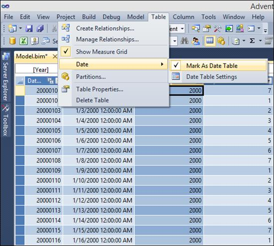

图 69:设置一个表来使用时间智能功能

接下来，我们单击同一菜单中的**日期表设置**选项，并在**日期**字段中选择**完整日期替代**唯一标识符列。

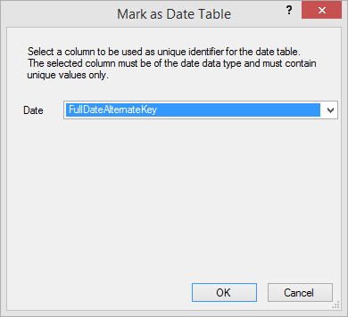

图 70:标记日期表

现在我们已经标记了一个日期表，我们使用时间智能函数来定义数据模型中的计算。

TotalYTD、TotalQTD 和 TotalMTD 函数

TotalYTD、TotalQTD 和 TotalMTD 是财务分析中常用的函数，用于评估从年初到当前日期、从季度开始到当前日期以及从月初到当前日期的表达式。例如:

```
    TOTALYTD(<expression>,<dates>[,<filter>][,<year_end_date>])
    TOTALQTD(<expression>,<dates>[,<filter>])

```

在我们的数据模型中，我们将年初至今销售额和季度销售额的衡量标准定义如下:

```
    YTD Sales:=TOTALYTD(SUM(‘Reseller Sales’[SalesAmount]),'Date'[FullDateAlternateKey],ALL('Date'),"6/30")
    QTD Sales:=TOTALQTD(SUM(‘Reseller Sales’[SalesAmount]), 'Date'[FullDateAlternateKey],ALL('Date'))

```

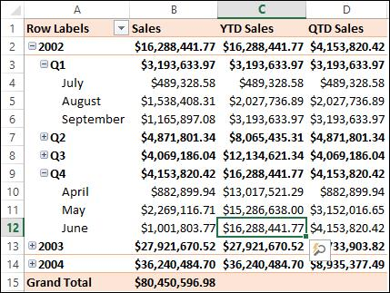

图 71:使用 TotalYTD 和 TotalQTD 函数

PREVIOUSYEAR，PREVIOUSQUARTER 函数

PREVIOUSDAY、PREVIOUSMONTH、PREVIOUSQUARTER 和 PREVIOUSYEAR 函数是财务分析中常用的函数，用于将当前度量值与前一天、前一个月、前一个季度或前一年进行比较。例如:

```
    PREVIOUSYEAR(<dates>[,<year_end_date>])
    PREVIOUSQUARTER(<dates>)

```

在我们的数据模型中，我们可以定义衡量前几年销售额和前几个季度销售额的指标，这些指标使用以下 DAX 公式计算前几年和前几个季度的销售额:

```
    PreviouYearsSales:=CALCULATE([Sales],PreviousYear('Date'[FullDateAlternateKey]))
    PreviousQuarterSales:=CALCULATE([Sales],PREVIOUSQUARTER('Date'[FullDateAlternateKey]))

```

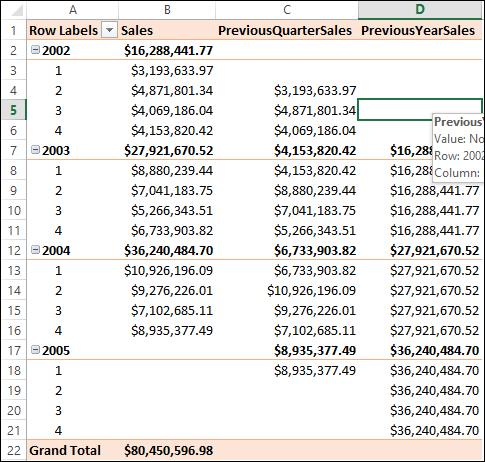

图 72:使用前一年和前一季度功能

SAMEPERIODLASTYEAR 函数

函数的作用是:返回一个表，该表包含一列在当前上下文中从指定日期列的日期向后移动了一年的日期。

通过使用如下的并行周期函数，也可以实现相同周期的功能:

```
    PARALLELPERIOD(dates,-1,year)

```

例如:

```
    SAMEPERIODLASTYEAR(<dates>)

```

在我们的数据模型中，我们之前定义了计算度量 PreviousSales，它使用如下的 PARALLELPERIOD 函数计算去年同期的销售额:

```
    PreviousSales:=CALCULATE([Sales],PARALLELPERIOD('Date'[FullDateAlternateKey],-1,YEAR))

```

我们还可以使用 SAMEPERIODLASTYEAR 函数重写这个度量，以获得相同的结果:

```
    PreviousSales:=CALCULATE([Sales],SAMEPERIODLASTYEAR('Date'[FullDateAlternateKey]))

```

现在我们对 DAX 函数更加熟悉了，在下一节中，我们将看到如何使用其中的一些函数进行报告。

## 作为查询语言的 DAX

在一些客户端报告工具(如 SSRS)中，我们使用 DAX 作为查询语言来定义数据集，以便从表格数据模型多维数据集中获取数据。当我们使用 DAX 作为查询语言时，我们使用了前面讨论过的一些相同的函数，这些函数返回一个表格数据集。

当 DAX 用作查询语言时，我们使用以下语法:

```
    DEFINE
        { MEASURE <table>[<col>] = <expression> }]
    EVALUATE <Table Expression>
    [ORDER BY {<expression> [{ASC | DESC}]} [, …]
        [START AT {<value>|<parameter>} [, …]] ]

```

DAX 作为一种查询语言，总是以 EVALUATE 关键字开头，后面跟一个表达式，这个表达式返回一个表。DEFILE 关键字用于定义查询范围内的计算度量。

为了使用 DAX 作为查询语言，我们使用 SQL Server Management Studio 连接表格分析服务多维数据集，点击**新建 MDX 查询**窗口。

同样的 MDX 查询窗口也用于对表格模型立方体执行 DAX 查询，如图 73 所示。

例如，最简单的 DAX 查询是:

```
    EVALUATE 'SalesTerritory'

```

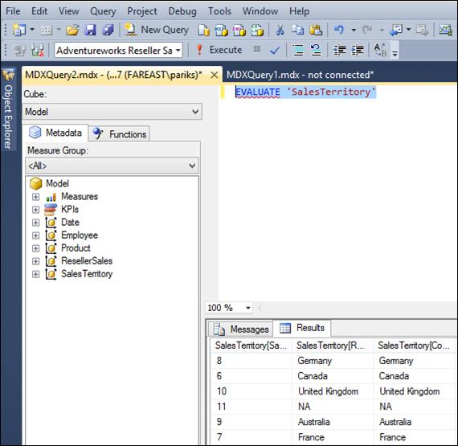

图 73:使用 DAX 作为查询语言

该查询返回 SalesTerritory 作为输出。如果输出需要按国家排序，我们可以将查询重写为:

```
    EVALUATE 'SalesTerritory'
    ORDER BY 'SalesTerritory'[Country]

```

将筛选器应用于 DAX 查询

如果我们需要评估美国 2004 财年的销售额，我们可以使用 FILTER 函数来筛选美国国家和 2004 财年的 ResellerSales 表。生成的 DAX 查询是:

```
    EVALUATE
    FILTER(
           FILTER('ResellerSales', RELATED('SalesTerritory'[Country])="United States"),
           RELATED('Date'[FiscalYear])=2004
           )

```

在 DAX 查询中向查询输出添加列

考虑一份报告，其中我们需要 AdventureWorks 目录中的所有产品及其迄今为止的最大订购量。我们可以使用 ADDCOLUMNS 函数添加一个计算列，该计算列计算最大订单数量并将其添加到产品表中。生成的 DAX 查询是:

```
    EVALUATE
    ADDCOLUMNS('Product',
                        "Max Quantities Ordered",CALCULATE(MAX('ResellerSales'[OrderQuantity]),ALL(Product[Product]))
                        )
    ORDER BY [Max Quantities Ordered] desc

```

在 DAX 查询中聚合和分组

考虑一份报告，其中我们需要每个产品类别的总销售额。这可以很容易地在 DAX 查询中通过使用如下的 SUMMARIZE 函数来实现:

```
    EVALUATE
    SUMMARIZE(
    'Product',
    'Product'[Product Category],
    "Sales",FORMAT(SUM(ResellerSales[SalesAmount]),"CURRENCY")
    )
    ORDER BY [Sales] desc

```


图 74:使用 DAX 查询来聚合值

如果我们也想计算总销售额，我们可以在 DAX 查询中使用 SUMMARIZE 函数和 ROLLUP:

```
    EVALUATE
    SUMMARIZE (
    'Product',
    ROLLUP('Product'[Product Category]),
    "Sales",FORMAT(SUM(ResellerSales[SalesAmount]),"CURRENCY")
    )
    ORDER BY [Sales] asc

```

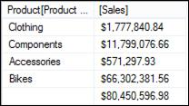

图 75:使用 DAX 查询来聚合值

在 DAX 查询中使用交叉连接

考虑一份报告，其中我们需要计算每个会计年度每个国家的销售额。我们可以使用 CROSSJOIN 函数来实现这一点，如下面的 DAX 查询所示:

```
    EVALUATE
    FILTER(
    ADDCOLUMNS(
                  CROSSJOIN(
                             ALL('Date'[FiscalYear]),
                             ALL('SalesTerritory'[Country])
                             ),
                        "Sales",FORMAT(ResellerSales[Sales],"CURRENCY")
                        ),
                        ResellerSales[Sales]>0
                        )

```

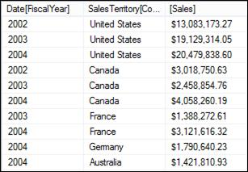

图 76:在 DAX 查询中使用交叉连接

在 DAX 查询中使用 TOPN

考虑一份报告，其中我们需要确定需求最大的三种产品。为了实现这一点，我们将使用 TOPN 函数和前面定义的需求等级计算列，该列根据迄今为止销售的总订单数量计算每个产品的等级。

```
    EVALUATE
    TOPN(3,Product,Product[Demand Rank],1)
    ORDER BY Product[Demand Rank]

```


图 77:在 DAX 查询中使用 TOPN 函数

在 DAX 查询中定义度量

在前面的示例中，我们设计了一个 DAX 查询来计算迄今为止每种产品的最大销售量，我们可以通过定义度量来重写该查询，如下例所示。

```
    DEFINE MEASURE 'Product'[Max Quantities Ordered]=CALCULATE(MAX('ResellerSales'[OrderQuantity]),ALL(Product[Product]))

    EVALUATE
    ADDCOLUMNS('Product',
                        "Max Quantities Ordered",'Product'[Max Quantities Ordered]
                        )
    ORDER BY [Max Quantities Ordered] desc

```

定义查询范围的度量在很大程度上简化了查询。例如，在前面的查询中，我们首先定义一个计算度量来计算所有产品的最大销售订单数量。当在 ADDCOLUMNS 函数中使用此度量时，将在行上下文中为产品表的每一行评估该度量，这将给出每种产品的最大订单数量。

在 DAX 查询中使用 GENERATE 函数

在前面的示例中，我们根据使用 TOPN 销售的总订单数量计算了前三名的需求产品。现在，假设我们需要计算每个国家的前三大需求产品，以确定每个国家最受欢迎的产品。

为此，我们需要对每个国家重复同样的 TOPN 计算。这可以使用 DAX 中的 GENERATE 函数来实现，如下所示。

```
    DEFINE MEASURE 'Product'[Max Quantities Ordered]=IF(ISBLANK(MAX('ResellerSales'[OrderQuantity])),0,MAX('ResellerSales'[OrderQuantity]))
    EVALUATE
    GENERATE
    (
    VALUES('SalesTerritory'[Country]),
    ADDCOLUMNS(
    TOPN(3,VALUES('Product'[Product]),'Product'[Max Quantities Ordered]),
                 "Max Quantities Ordered",'Product'[Max Quantities Ordered]
        )
    )

```

在这个 DAX 查询中，我们重复了 TOPN 计算，它使用 GENERATE 函数根据每个国家的最大销售订单数量来计算前三名产品。下图显示了查询的结果输出:

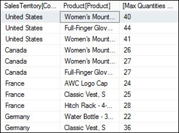

图 78:在 DAX 查询中使用 GENERATE 函数

这些例子应该会让我们有足够的机会开始使用 DAX。像任何其他查询语言一样，我们可以通过更多的实践来获得 DAX 方面的专业知识。

## 总结

在本章中，我们学习了如何使用 DAX 语言定义计算列和度量。在下一章中，我们将讨论如何为部署准备我们的数据模型，以及如何为报告和分析部署数据模型。