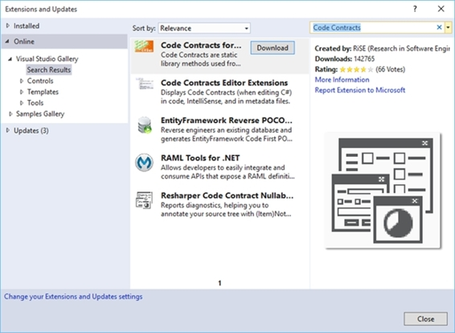
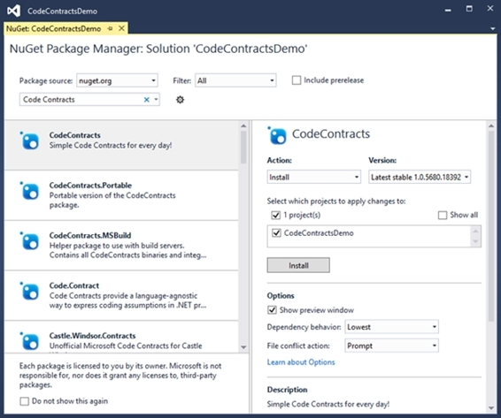
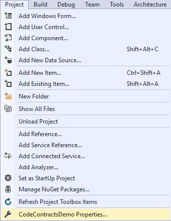
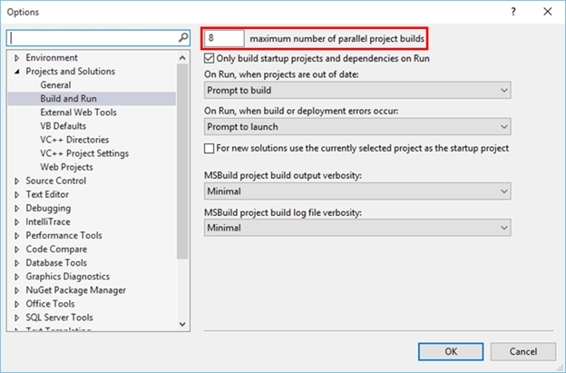

许多开发人员可能知道什么是代码契约，但是他们不了解它们提供的好处或者如何实现它们。不过，我必须提到，我发现对代码契约及其在开发中的使用的态度有些分歧。一方面是一群坚定的支持者，另一方面是一群反对者。然而，中间是一大群不熟悉代码契约及其使用的开发人员。正是在这里，我怀疑你们中的许多人会发现自己。在使用代码契约一段时间后，我预计你们中的许多人会自然地迁移到爱恨交织的一端。

由微软软件工程研究公司创建的代码契约已经存在了很多年。事实上， [RiSE 网站](http://research.microsoft.com/en-us/projects/contracts/releasenotes.aspx)上的发布说明是从 2009 年 2 月 23 日发布 1.1.20215 开始的。这些年来，《代码契约》经历了各种各样的修订，在被微软开源后，现在已经在 [GitHub](https://github.com/Microsoft/CodeContracts) 上找到了新家。

在我们继续之前，让我们定义什么是代码契约。代码契约的目标是提供一种语言不可知的方式，在您的。NET 应用程序。让我们用你和第三方(例如银行)之间的实际合同来类比。这是你们两个之间的协议，以确保双方以特定的方式行事。这是代码契约的核心。我们假设代码中存在某些逻辑，我们在代码中定义契约来维护这些假设。这些假设可以采取前提条件、后条件和状态不变量的形式。如果这些合同条件在任何时候被打破，我们都会知道的。这在团队工作时尤其有价值。

在本书的其余部分，我将参考 Visual Studio Enterprise 2015()。NET 框架 4.6)和代码契约版本 1.9.10714.2。代码契约也将适用于 Visual Studio 2015 Professional，但遗憾的是，在撰写本文时，代码契约不适用于免费的 Visual Studio 2015 社区版。在 Visual Studio 中开始使用代码契约非常容易。在 Visual Studio 的`Tools`菜单中，单击`Extensions and Updates`。


图 1:扩展和更新菜单项

这将打开`Extensions and Updates`窗口(图 2)，您可以从中搜索 Visual Studio 图库。顺便说一句，您还可以通过 NuGet 在项目中包含代码契约(稍后将详细介绍)。

在屏幕右侧的搜索框中，输入`Code Contracts`，并确保在左侧的树形视图中选择了`Online`部分。当您的搜索结果被返回时，代码契约应该是最重要的结果之一。从这里很容易安装代码契约。只需点击`Download`按钮，即可下载。msi 安装程序，您可以运行它来安装代码契约。



图 2:扩展和更新

### 纽吉特

NuGet 包管理器还可以用来下载代码契约并将其包含在您的解决方案中。您可以使用“获取包管理器”(图 3)来搜索代码契约，也可以使用“工具”>“获取包管理器”选项中的包管理器控制台来运行以下命令来安装代码契约。

```cs
    PM> Install-Package CodeContracts

```

您还将在 NuGet 上找到代码合同包的可移植版本(用于视窗移动应用程序)。使用哪种方法安装代码契约并不重要；只是你喜欢哪种方法的问题。



图 3:获取包管理器

您需要重新启动 Visual Studio，以使“属性”页中的“代码合同”项变得可见。通过右键单击您的项目并从上下文菜单中选择`Properties`，可以找到代码契约集成。您也可以通过从 Visual Studio 工具栏中选择`Project`(确保您已经在解决方案资源管理器中选择了您的项目)，然后单击`*ProjectName* Properties`菜单项来找到代码契约集成(图 4)。

我已经调用了我的 Visual Studio 项目`CodeContractsDemo`，所以 Visual Studio 中`Projects`菜单中的项目将被调用`CodeContractsDemo Properties`。熟悉的属性页将为您的项目打开，在属性页左侧列表的底部，您将看到一个名为`Code Contracts`的新属性窗格。

点击此处将显示一大堆设置供您选择。不要让设置的数量吓倒你；我们将在下一节详细介绍这些内容。只知道许多设置都是默认的，如果你愿意，你可以这样设置。



图 4:项目属性

### 代码合同属性页

代码契约属性最初会向您展示许多选项和设置。代码协定下的属性分为三组:运行时检查、静态检查和协定引用程序集。

通过选择`Perform Runtime Contract Checking`或`Perform Static Contract Checking`启用代码契约。

至少，您需要确保选择其中一个选项，以便在项目中启用代码契约。如果不选择这两个选项中的任何一个，代码契约将无法在您的项目中启用，并且您将无法从它们为您的系统增加的价值中获益。

顾名思义，运行时契约检查将在运行时发挥它的魔力。然而，静态合同检查完全是另一回事。它允许代码契约在您键入代码或构建项目时分析您的代码。这就是代码契约变得有趣并为我增加最大价值的地方。


图 5:代码契约属性页

### 静态检查

如果启用静态检查，建议保持在属性页面中选择`Check in background`选项。这是因为分析可能需要一些时间来执行。另一个可取的选择是在 Visual Studio 中选择并行构建选项。从 Visual Studio 的`Tools`菜单中，选择`Options`。在选项屏幕左侧的树形视图中(图 6)，展开`Projects and Solutions`节点。你会注意到一个名为`Build and Run`的节点。选择它，您将看到启用并行构建的选项。

任何大于`1`的值都将在 Visual Studio 中启用并行构建选项。我机器上的默认值是`8`。在此文本框中输入值`1`将有效地关闭 Visual Studio 中的并行构建。通过在 Visual Studio 中启用并行构建，您可以让代码契约并行分析几个项目。根据 RiSE 的说法，Visual Studio 扩展是线程安全的。“代码合同”属性页中还有许多其他可用选项，但是您现在可以开始使用代码合同，而无需进一步配置这些设置。



图 6: Visual Studio 并行构建选项