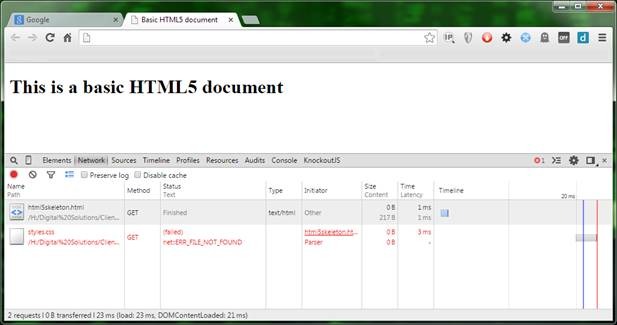

# 一、什么是 CSS3？

如果你已经做了很长时间的网络开发人员，那么 CSS 对你来说并不陌生。然而，你可能想知道 CSS3 到底是怎么回事。

就像新的 HTML 5 规范一样，CSS3(或者更准确地说是 CSS Version 3)是最新的一套规范，旨在塑造、塑造和定义最新版本的 CSS 具有哪些功能。

要想从 CSS3 中获得最大的收益，首先你确实需要对 CSS 的概念有一个大概的了解。第 2 章将介绍一个非常基本的复习知识来帮助你，但是如果你从来没有以任何方式使用过 CSS，那么你可能会觉得读这本书有点迷失，因为它确实假设你对这项技术至少有一点点熟悉。

CSS3 也不是很多人想象的“新 CSS”；像 HTML 5 一样，它与它之前的所有东西向后兼容。然而，展望未来，有大量的新功能，允许大量的创造性的可能性，这在以前的版本中是不存在的。

## 代码样本

当我们浏览这本书时，我将创建各种代码示例供您学习。这些代码示例无法下载，但它们足够小，可以手动输入。

在大多数情况下，给出代码只是为了突出某个特定的主题，尤其是在混合使用 CSS 和 HTML 代码的情况下。对于 HTML 代码(除非它是一个相当复杂的例子)，我将只描述需要什么，然后将 CSS 代码显示为一个代码示例。

正因为如此，我将假设读者理解 HTML，它是如何构造的，以及如何创建标准的简单 HTML 标签和元素。如果你没有，那么我强烈建议你在继续阅读这本书之前，至少阅读一些这方面的背景材料。

然而，为了让事情变得简单一些，下面的 HTML 代码应该作为 HTML 5 标准文档的一个非常小的例子。这绝不是一个完整的例子；它的目的是为书中的其他代码提供一个样板起点。

我在本书中给出的所有例子都假设您正在使用一段类似的代码，并试图在该代码的基础上进行构建。

```css
          <!doctype html>
          <html>
          <head>
              <title>Basic HTML 5 document</title>
              <link href="styles.css" rel="stylesheet" type="text/css" />
          </head>
          <body>
              <h1>This is a basic HTML 5 document</h1>
          </body>
          </html>

```

代码清单 1:基本的 HTML 5 文档

请密切注意标题中的`link`标记—这指定了一个名为 **styles.css** 的文件。

我们将把大部分 CSS 代码放在一个同名(或类似)的文件中。

良好的实践要求 CSS 代码与 HTML 代码分开，由于简洁系列的基本原则之一是促进良好的实践，因此我们将在本书的整个过程中努力保持这一点。

当然，你不用调用你的文件**styles . CSS**；你想叫它什么都可以。但是，如果您确实更改了它的名称，那么请记住，您在创建基本的 HTML 文档进行实验时使用了不同的名称。

您将能够判断文件名是否有误——您将在浏览器调试工具中看到一个错误，类似于图 1。



图 1:显示 CSS 文件加载失败的 Chrome 浏览器工具

如果您的 HTML 文件找不到链接的 CSS 文件，那么您定义的样式规则都不会被使用，您的结果看起来也不会像它应该的那样。

## 简单说一下浏览器兼容性

在继续之前，我们需要解决的最后一件事是浏览器兼容性。

任何做过 HTML 前端驱动的 web 开发的人都非常清楚让代码在所有浏览器中看起来统一所涉及的痛苦。

如果你花了时间研究 CSS2 和 HTML4 标准，以及不太久以前的浏览器战争，那就更是如此了。

因为 CSS3 进来了，与较新的 HTML 5 标准一致，所以我不会特意去确保我提供的代码在所有较旧的浏览器上都能正常工作。

在本书的课程中，我将使用以下浏览器:

谷歌 Chrome 39.0.2171.95 m

我还将提供以下浏览器版本，但不一定会使用它们:

*   Firefox 34.0.5
*   internet Explorer 11 . 0 . 9600 . 17501 更新 11.0.15 (KB3008923)
*   Maxthon 云浏览器 4.4.3.4000

因为我将主要坚持或多或少完整的特性，或者在提到的四种浏览器中具有相同的支持，所以使用不同的浏览器应该没有问题。然而，我将尽可能注意任何可能需要的改变。

请注意，在使用不同的浏览器时，可能会有需要厂商前缀的情况(但由于我使用了 Chrome，我错过了这种情况)。

作为一般的经验法则，我使用 Chrome 开发，然后修改以适应其他浏览器。如果有些东西不能像预期的那样工作，那么在假设代码被破坏之前，请在网上查找非工作代码的 CSS3 语法。

至于最低版本，我不会试图让本书中的任何代码正常工作，你可能需要使用某种合适的帮助库来填补空白。由于有大量的帮手，不幸的是，这本书里没有讨论他们的空间。