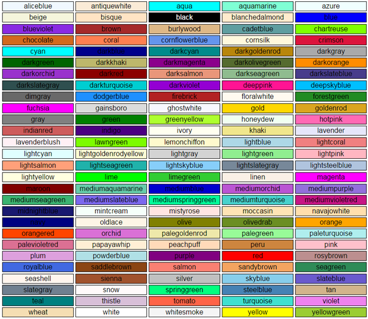

# 第六章颜色

如果你在阅读本书之前做过任何网页开发，那么你几乎肯定会遇到在 HTML/CSS 中使用 6 位十六进制符号定义颜色的标准方式: **#rrggbb**

这到底是什么意思？其实挺简单的。实际上，它是由三个 8 位分量组成的 24 位颜色值。

在十六进制数字方案中，数字从 0 到 F 计数，而不是像正常的十进制数字系统那样从 0 到 9 计数。当你仔细观察时，你会发现你可以把所有这些值都放入 4 位，因为 4 位在十进制中可以表示的最大数字是 15，那么 0 到 F 实际上意味着 0 到 15。

如果你把它翻倍，4 位就变成了 8 位，你能容纳的最大值是 255，所以 FF(我们最大的十六进制数)变成了 255(我们最大的十进制数)。我在这里的目的不是把它变成一堂十六进制数学课；我的目的只是向您解释，一个颜色值由 256 (0 到 255)个级别的红色、绿色和蓝色值组成，0 表示没有颜色，255 表示该颜色的最大数量。

例如，如果你想要一个中灰色，你可以使用 127 作为红色、绿色和蓝色的值，当翻译后会给你 **#7F7F7F** 。

如果你使用的是视窗系统，使用视窗计算器很容易转换。在运行框中输入**计算**，或者在开始菜单中搜索。加载后，在**视图**菜单上，选择**编程器**。

图 83:窗口计算器视图菜单

您应该会得到以下结果:

图 84:程序员模式下的 Windows 计算器

要转换为十六进制，请确保选择 **Dec** (在图 84 中标记为“1”)，然后输入您的值。选择**六角**(在图 84 中标记为“2”)，您将看到放置在您的颜色值中的值。如果您的值只有一个数字(从 0 到 F)，那么只需在它前面加一个额外的 0 (01，02 … 0E，0F)。对这三个值中的每一个都这样做，并将它们组合在一起，形成最终的颜色。很简单，对吧？

不，不完全是，因为你要么必须理解十六进制/十进制转换，要么需要手头的某种工具来理解事情。

一开始是这样，一直都是这样——至少在 CSS3 出现之前是这样。

## 颜色名称

CSS2 引入了一些颜色的专有名称，但并没有真正宣传出来；然而，CSS3 极大地扩展了这一点。你已经在这本书里看到我用了红、绿、蓝这样的名字。实际上总共有 140 个，如下图所示:

图 85: 140 个 CSS3 颜色名称

实际上还有一些(总共 147 种)，但这些只是已经指定的颜色的替代拼写，例如“深灰色”(对于那些用“e”拼写“灰色”一词的人来说)。

在 CSS 规则中任何需要指定颜色的地方，都可以使用这些颜色名称。

如果像我们许多人一样，你很难记住它们，那么你可能会发现[这个网站](http://www.colors.commutercreative.com/)很有用。

每次你加载或刷新页面时，网站都会从主屏幕上的列表中随机选择一种颜色，并以大写字母列出颜色名称。如果你点击文本正下方的小网格图标，你将进入一个页面，在那里你可以将鼠标悬停在颜色上，以不同的方式对它们进行排序，并通常检查整个列表。

[CSS-Ticks](http://css-tricks.com/snippets/css/named-colors-and-hex-equivalents/)也有一个有用的可用列表。它不仅列出了颜色，还列出了每种颜色的#rrggbb 值。

还有最后一个颜色名你需要知道，那就是**透明**。

当您使用透明颜色名称时，您将使要应用颜色值的对象 100%透明。不幸的是，没有办法使用颜色名称和十六进制值来改变透明度级别，但是您可以在元素上设置`opacity` CSS 规则，除非您想要使用直接颜色值。

## 颜色值

如果命名的颜色不够，十六进制符号对您来说太麻烦，那么您会很高兴知道，使用 CSS3，您可以使用四种新数据类型中的一种来定义您的颜色。

这些类型的使用方式与前面在渐变部分看到的类似，通过将它们指定为关键字，然后在括号中指定一组参数值。

括号内的值可以是固定值或百分比值。本章开头的中灰色示例现在可以表示如下:

*   #7F7F7F
*   rgb(127，127，127)
*   rgb(50%、50%、50%)

所有这三个值，当在 CSS 中任何可以指定颜色的地方使用时，将导致生成相同的颜色。

您现在也可以使用`rgba`关键字指定 Alpha 通道的颜色。

|  | 注意:alpha 分量是指定给定颜色使用的不透明度级别的值。把它想象成一个透明值，其中 0 是完全透明的，255/100%是完全不透明的，中间的值提供不同的透明度。它就像一扇纱门:你可以透过门看到，但你不能只是走过它，因为它仍然是一个物理对象。透明度是相似的，给定 Alpha 值的级别决定了你能透过“门”看到多少 |

`rgba`关键字的使用方式与`rgb`关键字完全相同，但采用指定 Alpha 级别的附加值:`rgba(127,127,127, 0.5)`

但是，与颜色值本身不同，您不能为 alpha 值提供百分比值或 0 到 255 之间的整数。

相反，您必须使用从 0 到 1 的基于浮点的数字，其中 0 是完全透明的，1 是完全不透明的，0.5 表示中间标记。

大多数人只是追求简单的价值观，比如`0, 0.1, 0.2…. 0.8, 0.9, 1`

然而，如果你需要，你可以通过将数字翻倍来获得更好的控制，比如:`0.01, 0.32, 0.84`

对于常见的百分比值，您通常会使用以下值:

*   0.00 = 0%
*   0.25 = 25%
*   0.50 = 50%
*   0.75 = 75%
*   1.00 = 100%

当你以这种方式将数字翻倍时，突然变得很容易将百分比值与所用的 0 比 1 的比例关联起来。

还有一种方法可以指定我们需要涵盖的颜色，这对那些受过专业图形艺术家或设计师的正确颜色理论培训的人来说更有意义。这是`hsl`和`hsla`的方式。

使用方式与`rgb`颜色值完全相同，`hsl`方法为前三个值赋予了不同的含义。

它们不是混合红色、绿色和蓝色，而是指定色相、饱和度和明度。

我在这里不打算深入色彩的全部理论，但是 Hue 值代表你沿着色图有多远，0 度是红色，360 度是品红色/红色；当你在 360 度色轮上从 0 到 360 度旋转时，你会得到一个不同的根颜色值。

饱和度是所选颜色值从 0%(非常弱)到 100%(非常强)的强度，明度值是 0%(非常暗/通常为黑色)到 100%(非常亮或非常亮)。

一切都在 [W3C 颜色模块页面](http://www.w3.org/TR/css3-color/)详细说明。你会在这个网站上找到一个非常方便的图表，它显示了各种 HSL 颜色组合以及如何指定它们的更多信息。

在`hsla`值的情况下，阿尔法分量的指定方式与`rgb`颜色完全相同。

## 总结

在这相当短的一章中，我们看了颜色是如何在 CSS3 中定义的。我特意没有创建任何代码清单，因为如果您想进行实验，有很多机会可以回到以前的示例，替换`color`、`background-color`和`gradient`规则中的值。

我们已经了解了 CSS3 如何使在样式规则中指定颜色变得更加容易，并介绍了一些互联网资源，这些资源将使记住和指定颜色变得更加有用。

在下一章中，我们将深入探讨如何使用新的字体功能，这种功能现在可以用于基于 CSS3 的页面。