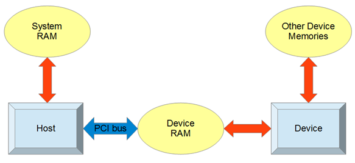
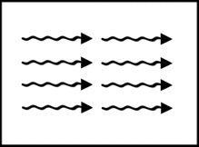
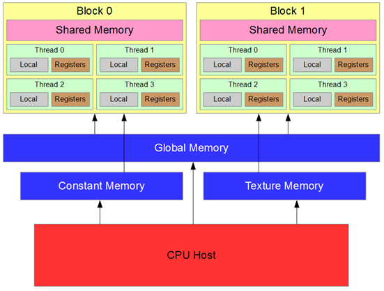
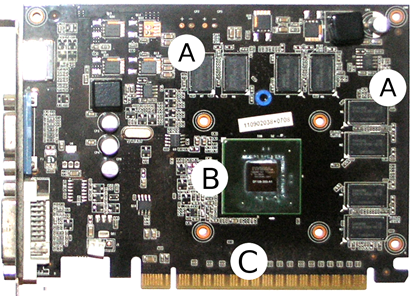

# 第三章建筑

我们将快速浏览许多术语，为了使 CUDA 得到理解，这些术语必须被理解。很自然地会被这些术语的冲击所迷惑。如果这一章令人困惑，读几遍它和下一章，编写第 4 章中的例子，并检查更改代码的效果。所有这些概念都是相互联系的，不了解其他概念就无法描述一个概念。

GPU 被称为设备；CPU 和系统的其余部分称为主机。主机控制系统内存和其他外围硬件，包括设备本身。该设备有自己的体系结构和内存，通常(但不总是)与系统内存分开。该设备无法控制硬盘、系统内存或任何其他外围设备；这都是主机的领域。

在计算机系统中，设备是板载的(即作为原始构建硬件的一部分，而不是作为某种扩展卡添加的)，它可以共享一些主系统内存。在这些情况下，操作系统和图形驱动程序可能会划分一些系统内存，供设备作为图形内存使用。该内存有效地成为专用图形内存；它的编程方式与物理图形 RAM 完全相同。然而，在本书的剩余部分，我将假设情况并非如此，并且该设备有自己的专用内存。

设备通过 PCI 总线与主机通信，如图 3.1 所示。



图 3.1:设备和主机

主机和设备之间的所有通信都通过 PCI 总线进行。主机能够通过特殊的 CUDA API 函数调用读写自己的系统内存和设备内存。该设备也可以读写设备内存，但它有一个额外的层次结构的其他内存空间，我们将详细研究。

图 3.1 中的设备内存通常是一种特殊的快速类型的内存，称为图形内存(GDDR)。设备的这个主存储区域通常相当大(一个或多个千兆字节在今天并不罕见)。在图形处理器的规格中，这种设备内存的数量通常被称为“专用图形内存”。如上所述，在没有专用图形内存的系统中，设备内存实际上是系统内存的一部分，只是在概念上分开。通常，设备的内存芯片位于设备本身，与主机的唯一通信通道是设备插入的主板上的 PCI 总线插座。

## 内核、启动配置和 dim3

### 内核

CUDA 内核是设计为由设备执行的功能。它们通常不同于常规的主机函数，因为它们意味着由许多线程同时执行。主机告诉设备使用所谓的内核启动来运行内核。内核启动类似于常规的 C 函数调用，只是它在函数名旁边有一个启动配置。清单 3.1 展示了一个内核启动。

```cpp
    SomeKernel<<<12, 64>>>(a, b, c);

```

清单 3.1:内核启动

发射配置(清单 3.1)用三个直角括号(<<< and >> >)描述；它配置了设备的执行单元，因此内核的代码可以由许多线程执行。这里，内核将由 12 个块启动——每个块包含 64 个线程；`a`、`b`和`c`为参数。我们将立即更详细地了解发射配置。

### 对内核的限制

内核的语法几乎与常规的 C++ 或 C 完全相同，但是有一些限制。内核不能是递归的，它们不能有可变数量的参数，并且它们必须返回 void。它们标有`__global__`说明符，由主机调用。

不是所有的设备功能都必须返回 void，只有`__global__`内核有这个限制。可从设备调用并标有`__device__`的辅助函数不需要返回 void。从费米开始(费米是 GeForce 400 系列 NVIDIA 设备架构的名称)，`__device__`函数被允许有限深度的递归，如清单 4.6 所示。

### 启动内核

在内核调用中，启动配置是在内核名称之后指定的。启动配置可以包含两个或三个参数。前两个参数指定网格中的块数和每个块中的线程数(我们将很快描述线程和块)。第三个参数指定动态共享内存的数量。

`Kernel_Name<<<gridSize, blockSize>>>(params…);`

`Kernel_Name<<<gridSize, blockSize, dynamic_Shared_Memory>>>(params…);`

`Kernel_Name`是正在启动的内核函数的名称。`gridSize`参数是网格中的块数。`blockSize`参数是每个块中的线程数。`gridSize`和`blockSize`参数可以是`dim3`(下述)或常规整数。

#### dim3

`dim3`数据类型是由三个无符号整数组成的结构:`x`、`y`和`z`。它用于指定多维度网格和块的大小。它也是`idx`索引(即`threadIdx`、`blockIdx`、`blockDim`和`gridDim`)的数据类型，线程使用这些索引来计算内核中的唯一标识。在清单 3.1 中，启动配置是使用整数指定的；在清单 3.2 中，启动配置是使用`dim3`指定的。

```cpp
    dim3 gridSize(10, 10, 10);
    dim3 blockSize(32, 32);
    Call_Kernel<<<gridSize, blockSize>>>(params...);

```

清单 3.2:多维内核启动

清单 3.2 展示了使用块和网格大小的`dim3`结构启动多维内核的代码。启动配置使用两个`dim3`结构来指定网格中线程的排列。`gridSize`参数指定网格是块的三维阵列，尺寸为`10`、`10`和`10`(这意味着总共将推出 1000 个块)。`blockSize`参数规定每个块由尺寸为`32`和`32`的二维螺纹网格组成。这种启动配置将导致总共 1，000 个块，每个块中有 32 × 32 个线程，总线程数为 1，024，000 个线程。

主机启动的块和线程数量可能超过设备的物理容量。如果您的设备每个内核能够执行 768 个线程，并且您有 16 个内核，那么该设备可能会并行执行 16 × 768 个线程。但是这个数字(16 × 768 = 12，288)只是设备可以物理并行执行的块和线程的数量；它不是由启动配置指定的大小的限制。该设备有一个调度器，它将数据块分配给物理内核执行。当一个内核完成一个块的执行时，调度程序要么给这个内核另一个块来执行，要么如果在启动中没有更多的块要执行，那么内核将完成。

`dim3`数据类型提供了定义结构的一维、二维和三维实例的构造函数。一维版本(使用带有一个参数的构造函数)初始化一个只有 X 组件集的`dim3`结构；其他维度默认为`1`。二维构造器(采用两个操作数)可用于设置`dim3`结构的 X 和 Y 维度，Z 维度设置为`1`。三维构造器允许程序员设置所有三个维度。

多维网格和块是一种理论构造，当数据本质上是多维的时，它被提供来简化编程。例如，当处理二维图像时，启动二维线程块并让每个线程处理单个像素可能会很方便。

## 线、块、网格和扭曲

该设备是一个物理硬件，一个插入计算机主板的专用显卡。该设备由一些称为流式多处理器的执行单元组成。一个 SM 有一个线程处理器的集合，一个寄存器文件，双精度单元，和共享内存。SMs 能够同时执行多个线程，每个线程处理器单元执行一个不同的线程。

### 螺纹

在并行编程(和 CUDA)中，线程是一个概念上的执行单元。它是一个执行单行串行指令的理论对象。并行编程完全基于运行并发线程。我们可以将问题拆分成单独的子问题，同时使用多个线程来解决更大的问题，而不是使用单线程来解决问题。如图 3.2 所示，单个螺纹可以用一个带有弯曲尾部的箭头来表示。CUDA 中的每个线程都有一个名为`threadIdx`的索引，它与`blockIdx`和`blockDim`一起可以在内核中读取，并且是`dim3`类型。


图 3.2:一个线程

|  | 注意:并发在并行编程中有特定的含义。并发线程实际上可能并行执行，也可能不并行执行(完全在同一时间)。线程执行的顺序理论上不在程序员的控制范围内。如果两个线程可能同时访问同一个变量，或者根据代码无法判断哪个线程将首先访问，则称这两个线程是并发的。 |

### 螺纹块

在 CUDA 中，我们将线程组合成线程块。线程块是可以轻松相互通信的线程的集合。每个区块都有一个区块编号(`blockIdx`)，该编号在网格中是唯一的，并且是`dim3`类型。线程可以使用内核中的`blockIdx`作为线程所属区块的参考。线程也可以引用`blockDim`结构(也是一个`dim3`)，这是每个块有多少线程的记录。



图 3.3:线程块

### 网格

当我们启动一个内核时，我们指定一个称为网格的线程块集合。线程块是线程的集合，网格是线程块的集合。图 3.4 描绘了线程块的二维网格。


图 3.4:线程块的网格

每个块允许的线程数是最大的(在费米上是 1，024，在前面的例子中也是如此)，但是每个网格的最大块数非常大。并发运行的线程总数是网格的大小乘以线程中每个块的大小。线程可以使用`gridDim`结构，这是一个`dim3`，作为内核启动时网格包含多少块的记录。

从线程到线程块的额外抽象层意味着，随着新硬件变得可用，它可以同时执行更多的块，并且代码不需要更改。块内的线程彼此之间有快速的通信通道，但它们不能轻松地与其他块的线程通信。

### 扭曲

当设备执行内核时，它将线程分成 32 组，称为扭曲。每根经线包含 32 根具有连续`threadIdx`值的线。经线的所有线都来自同一个区块。

经纱以锁步方式执行指令；这意味着它们都同时执行同一条指令，除非有分支。如果线程处于翘曲分支中(当存在诸如`if`语句的条件时发生分支，并且一些线程采用一条路径，而其他线程采用另一条路径)，则设备串行执行分支的两条路径。管理扭曲中的线程分支是性能编程的重要考虑因素。

扭曲也是资源管理的一个重要考虑因素。如上所述，经纱总是由 32 根纱线组成，来自同一纱线块的连续`threadIdx`值。无论区块中是否有 32 个线程，每个扭曲都会为所有 32 个线程分配足够的资源。这意味着，如果每个块的线程数少于 32，那么设备将为 32 个线程的完全扭曲分配资源，并且一些资源将被浪费。

即使一个线程块包含 32 个以上的线程，或者如果它由任何数量的不能被 32 整除的线程组成，那么该块将在其中一个扭曲中浪费资源。建议线程块具有可被 32 整除的线程数。

## 设备存储器

GPU 中有许多不同类型的内存，每种内存都有特定的用途以及各种限制和性能特征。图 3.5 说明了这些记忆之间的理论关系。标记为“块 0”和“块 1”的两个框代表线程块；通常会有两个以上的并发运行。每个块都有一定数量的共享内存和线程集合。每个线程都可以访问自己的本地内存和寄存器。

除了块和线程单独访问的内存空间(即共享内存、本地内存和寄存器)之外，还有几个所有线程都可以访问的内存空间。所有线程和中央处理器主机都可以访问全局内存、常量内存和纹理内存。



图 3.5:内存层次结构

图 3.6 显示了一个典型的显卡。显卡是硬件的组合，包括图形处理器本身。将整个显卡称为 GPU 是很常见的，但 GPU 实际上只是显卡上的主芯片，就像图 3.6 中标注 *B* 的芯片一样。这款特殊的显卡由盖恩沃德设计，搭载英伟达 GT 440。散热器(用于冷却设备的大型风扇)已被移除，以便更好地查看布局。

查看图 3.6 中的图像，您会注意到四个水平和四个垂直的黑色矩形，标有 *A* 。这些矩形是设备的主要图形存储芯片。该设备的主存储器用于全局、局部、常量和纹理存储器(所有这些将在稍后解释)。这些存储器中的每一个都有相关的高速缓存，这些高速缓存位于 GT 440 芯片内部。

英伟达 GT 440 芯片本身标有 *B* 。它是一个黑色的小广场，坐落在一个较大的绿色广场上。SMs，包括共享内存、缓存、CUDA 内核和寄存器，都位于芯片内部。

标有 *C* 的金色针脚插入系统主板。主机通过这些引脚与设备通信。有两个相关的术语，“器件上”和“芯片上”。设备上是指整个卡上的任何地方，而芯片上是指 GT 440 芯片本身内部。



图 3.6:显卡

### 寄存器

器件中最快的存储器是寄存器。寄存器是设备的基础，没有地址，因为它们不在任何类型的内存中。寄存器是软件中暴露给程序员的硬件变量。他们本质上是设备的主力。它们在芯片上(这也意味着它们在物理上位于 SM 内部)。SMs 有一个由有限数量的寄存器组成的寄存器文件，它们可以将其分配给并发模块。

|  | 注:所有计算都在寄存器中进行。这个事实经常对程序员隐藏。没有在任何其他存储器上执行算术、逻辑或移位的指令。当设备对另一个存储空间中的数据执行操作时，它首先将数据复制到寄存器中，然后对该数据执行操作，然后将结果复制回原始位置。 |

线程不共享寄存器；每个线程都有自己的寄存器集合来使用。当器件的寄存器用完时，会导致所谓的寄存器溢出。该设备将使用全局内存作为额外的存储空间。当全局内存以这种方式使用时，它被称为本地内存。从这个意义上说，本地内存不是一种独特的内存类型；当寄存器用完时，这是设备使用全局内存进行额外存储的方式。我们将在后面更详细地讨论本地内存；除了应对寄存器溢出之外，它还用于其他情况。

|  | 提示:在设备查询中报告为“每个块可用的寄存器总数”的值是每个 SM 的寄存器文件的大小。要查找设备上可用的寄存器总数，请将其乘以 SMs 数。例如，这台机器中的 GT 430，多处理器(SMs)的数量是 2，每个块有 32，768 个寄存器，因此这台设备上可用的寄存器总数是 65，536 个。 |

要在内核中使用寄存器，只需声明一个变量。如果有足够的空闲寄存器(即没有寄存器溢出)，这将导致变量存储在寄存器中。但是，如果没有足够的空闲寄存器，变量将在本地内存中创建，并将物理驻留在全局内存中。寄存器、本地内存和全局内存之间的区别可能会令人困惑。一般来说，您希望每个线程使用尽可能少的寄存器，并避免寄存器溢出。本地内存不是一种独特的内存类型；这是对全局内存的使用。

### 共享内存

共享内存在块的线程之间共享。它非常快，运行速度几乎与寄存器相同，并且是片内的。共享内存是与全局内存的 L1 缓存相同的物理内存(参见后面的[缓存](#_Caches_not_illustrated)部分)。共享内存是程序员控制设备中 L1 缓存的一种方式。我们将在[第 6 章](06.html#_Chapter_6_)和[第 7 章](07.html#_Chapter_7_)中详细讨论，因为谨慎使用共享内存可以大大提高代码的性能。理解共享内存是有效使用设备的一个重要部分。

### 缓存

在现代设备上(费米一代和更新的设备)，有两个缓存，L1 和 L2。这些缓存几乎完全由设备控制。L1 缓存在芯片上，因此速度特别快(只有寄存器更快)。L2 缓存比 L1 缓存慢，但仍比全局内存快得多。全局内存中的所有读写操作，包括从主机复制的数据，都会在 L2 缓存中进行处理。当线程发出全局内存请求时，设备首先检查 L1 缓存是否能满足该请求，如果不能，则其次检查 L2 缓存。只有当两个缓存都不能满足请求时，才读取全局内存；该最终读取是可用的最慢读取类型。

缓存是一个自动内存优化系统，由设备控制，以帮助减少全局内存总线上的流量。设备对缓存的使用相当简单:当第一次从全局内存中读取数据时，数据存储在 L1 缓存中(通常)。该设备假设可能会再次请求相同的数据，并且将副本存储在 L1 将意味着如果再次请求，它可以非常快速地被第二次读取。过了一段时间，随着越来越多的值存储在 L1，它最终会变满。此时，当从全局内存中读取更多数据时，L1 缓存必须驱逐最旧的(最不可能被读取的)值，并用较新的数据替换它们。从 L1 逐出的数据将进入 L2 缓存。

L2 缓存比 L1 缓存离芯片更远(导致访问时间更慢)，但仍然比使用全局内存更近。L2 缓存比 L1 缓存大得多(有关设备上这些内存的实际大小，请参见设备查询)，但不幸的是，最终也必须像 L1 缓存一样清除陈旧数据。

如共享内存部分所述，L1 缓存和共享内存实际上是相同的物理内存。共享内存是控制 L1 缓存的一种方式。

### 本地存储器

本地内存是每个线程的本地内存。本地内存中的数据不会被网格中的任何其他线程共享。本地内存在物理上与全局内存相同。在两种情况下，全局内存可以称为本地内存。请始终记住，本地内存不是一种独特的内存类型，而是使用全局内存的一种特殊方式。

第一种情况是当寄存器溢出发生时，全局存储器可能被称为局部存储器。当我们在一个线程的代码中创建局部变量时(用正常的变量声明`int j`、`float q`等)。)，器件会将这些变量分配给一个寄存器，但前提是有足够的寄存器可用。如果没有可用的寄存器，则设备将变量存储在全局存储器中；全局内存的这种使用称为本地内存。术语“本地内存”指的是其他线程不打算访问这些变量的事实。变量应该是每个线程的本地变量，就像寄存器一样。将变量划分为寄存器和内存是自动的。本地内存比寄存器慢得多，您通常希望尽可能减少本地内存的使用。您可以通过分析您的应用程序来检查内核使用的本地内存量(参见[第 8 章](08.html#_Chapter_8_))。

使用全局内存(也称为本地内存)的第二种情况是在内核中使用结构和数组。该设备尽可能将变量存储在寄存器中，但是结构和数组需要指针来访问它们的元素。当设备访问结构或数组的特定元素时，它在幕后使用基指针和偏移指针。这意味着，为了在内核中使用结构或数组，变量需要它们可以指向的地址。寄存器没有地址，因此不能用来存储和访问结构或数组的元素。因此，结构和数组存储在设备的全局内存中。就像寄存器溢出一样，全局内存的这种使用是自动的，它被称为本地内存。

### 恒定记忆

常量内存是设备上专门设计用于存储网格范围常量的特殊内存。常量内存不能由设备设置(因此得名)，但是主机可以在调用内核之前在常量内存中设置值(从这个意义上说，它根本不是常量)。常量内存缓存在其自己的缓存中，与全局内存中的 L1 和 L2 缓存无关。

当一个块的所有线程读取相同的值(共享内存速度)时，恒定内存非常快。要在常量内存中创建一个变量，将其标记为`__constant__`。常量内存实际上存储在全局内存中，但是，如前所述，由于其专用缓存，可以非常快速地访问它。

|  | 提示:如果变量值永远不会改变，则使用 C++ 常量(即 const 关键字)，如果主机需要在程序执行过程中改变变量的能力，则使用 __constant__(设备的常量内存)。C++ 常量成为机器代码中的立即值，并且不需要任何周期来从内存中读取(除了指令的初始读取)。另一方面，器件常数需要从常数存储器中读取。常量内存在缓存时速度很快，但不如没有读取快。 |

如果一个 warp 的所有线程没有从常量内存中访问完全相同的值，访问将被序列化。如果一个 warp 的所有线程访问完全相同的值，访问将非常快，内存将从常量缓存中读取一次，并将广播给线程。如果请求的内存不在常量缓存中，那么第一次读取将会很慢，因为数据必须来自全局内存；后续读取将导致快速缓存命中。

主机可以使用`cudaMemcpyToSymbol` API 函数调用来改变常量内存的值。语法如下:

`cudaError_t cudaMemcpyToSymbol(__constant__ devConst, const void* src_ptr, size_t size);`

第一个参数是指向`__constant__`合格设备变量的指针。第二个参数是从主机复制数据的指针，最后一个参数是要复制的字节数。

清单 3.3 包含一个使用`cudaMemcpyToSymbol`函数设置设备常量并读取设备内核中的值的例子。我们向前跳过了一点，清单 3.3 中的大部分代码都是全新的。我们不再谈论恒定记忆；此代码作为参考提供。不要觉得你应该熟悉这些语法，因为它们将在下一章中介绍。

```cpp
    #include <iostream>
    #include <cuda.h>

    using namespace std;

    // The device's scale constant
    __device__ __constant__ float DEVICE_CONST_SCALE;

    // This kernel scales values in arr by the constant:
    __global__ void ScaleArray(float* arr, int count)
    {
    int idx = threadIdx.x + blockIdx.x * blockDim.x;
    if(idx < count) arr[idx] *= DEVICE_CONST_SCALE;
    }

    int main() {
    // The host's scale constant
    float scale;

    // Arrays of floats for host and device
    float arr[100], *d_arr;

    // Generate random floats on the host:
    cout<<"The unscaled array values are:"<<endl;
    for(int i = 0; i < 100; i++) {
           arr[i] = (float)(rand() % 1000) / 1000.0f;
           cout<<i<<". "<<arr[i]<<endl;
           }

    // Read a scale value from the user:
    cout<<"Enter a scale value:"; cin>>scale;

    // Set this scale to the DEVICE_CONST_SCALE in constant memory
    cudaMemcpyToSymbol(DEVICE_CONST_SCALE, &scale, sizeof(float));

    // Malloc and copy the arr from host to device:
    cudaMalloc(&d_arr, sizeof(float) * 100);
    cudaMemcpy(d_arr, arr, sizeof(float) * 100, cudaMemcpyHostToDevice);

    // Scale the values in the array on the device
    ScaleArray<<<1, 100>>>(d_arr, 100);

    // Copy the results back to the host and free
    cudaMemcpy(arr, d_arr, sizeof(float) * 100, cudaMemcpyDeviceToHost);
    cudaFree(d_arr);

    // Cout the values to make sure they scaled:
    cout<<"The scaled array values are:"<<endl;
    for(int i = 0; i < 100; i++) cout<<i<<". "<<arr[i]<<endl;

    return 0;
    }

```

清单 3.3:写入和读取设备常量

|  | 注意:在 CUDA 的早期版本中，cudaMemcpyToSymbol 函数的原型与现在非常不同。许多在线资源和教程仍然参考早期的功能原型，它不再像预期的那样工作。原始语法包含一个字符串作为其第一个参数；该字符串是符号的名称(例如，如清单 3.3 所示的 DEVICE_CONST_SCALE)。在 CUDA 工具包的较新版本中，使用字符串来指定设备符号的名称已被否决。 |

### 纹理记忆

纹理记忆是另一种特殊的记忆。这种内存掩盖了一个事实，即该设备是为处理图形而设计的。纹理内存缓存在它自己的缓存中(就像常量内存一样)，设计用于存储和索引位图纹理和图像中的像素。纹理内存有一些有趣(并且非常有用)的索引能力。例如，它能够自动且非常快速地从一个数组中插入几个值，或者将一个数组归一化为一致的中值。纹理内存使用设备内存(全局内存)，但它有自己的缓存。

对纹理存储器的访问速度与常量存储器相同。如果缓存数据，读取会非常快；否则必须从全局内存中读取。在本书的剩余部分，我们不会在任何教程中讨论纹理内存的使用。

### 全局内存

全局内存是设备上可用的最大内存存储，但与前面描述的片内内存相比，访问速度也最慢。`cudaMemcpy`、`cudaMalloc`和`cudaMemset`函数都引用了全局内存(我们将在下一章中详细了解这些函数)。全局内存通过两级缓存进行缓存:L1 和 L2。全局内存极其重要，因为主机能够通过使用全局内存与设备通信。

CUDA 内核的一般流程是主机使用 CUDA API 函数将一些数据复制到全局内存中。然后，内核由许多线程同时执行，这些线程又从全局内存中读取数据，并将其放入设备上的其他可用内存空间。然后计算结果并存储回全局内存中。然后，主机使用 CUDA 应用编程接口函数将结果从全局内存复制回系统。

## 回忆总结

为了方便起见，本节总结了每个内存区域的一些关键特性。图 3.6 显示了与 SM 核心相关的内存(右侧黄色方框)。最慢的内存通常是离 SM 核心最远的内存。图的左侧显示了系统内存；该内存必须使用 CUDA API 函数通过 PCI 总线复制到全局内存中。第二慢的存储器是那些驻留在设备主存储器中的存储器；这些包括全局内存、本地内存、常量内存和纹理内存。全局内存 L2 缓存接近 SM，但不在芯片上。它在图中显示为位于全局内存和 SM 之间。右手边的记忆是所有记忆中最快的；它们都在芯片上。寄存器是所有存储器中最快的。


图 3.6:按访问速度排序的内存

下表总结了 CUDA 内存空间的一些关键方面。全局内存速度取决于当前 L1 和 L2 缓存的使用情况，可能一点也不慢。

表 3.1: CUDA 存储器总结

| 记忆 | 范围 | 速度 | 笔记 |
| --- | --- | --- | --- |
| 系统 | 主持 | - | 设备无法读取/写入系统内存。 |
| 登记 | 线 | 非常快 | 供应有限。 |
| 一级缓存 | Block/SM | 快的 | 设备控制的，与共享内存相同的内存。 |
| L2 高速缓存 | 格子 | 慢的 | 设备控制，所有全局内存读写通过 L2。 |
| 共享的 | 街区 | 快的 | 用户控制的 L1 高速缓冲存储器。 |
| 纹理 | 格子 | 慢/快 | 使用全局内存，但有自己的缓存。 |
| 常数 | 格子 | 慢/快 | 使用全局内存，但有自己的缓存，只读。 |
| 当地的 | 线 | 慢的 | 当不能使用寄存器时，用于局部变量。 |