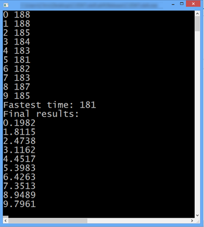
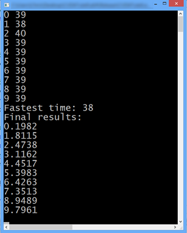
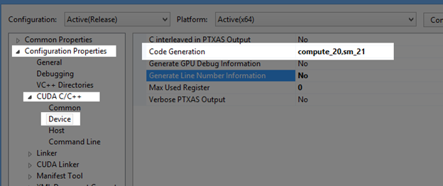

# 五、从 C++ 移植

在前一章中，我们研究了该设备的一些非常简单的用途。它们不是实际的例子，主机可能会比设备更快地执行所有先前引用的内核的计算。在本章中，我们将介绍一个比任何通用 CPU 都更适合使用 CUDA(以及一般的并行处理)的设备的问题。

## C++ 主机版本

人们可能对 CUDA 感兴趣的最常见原因之一是优化一个已经用 C++ 为主机编写的算法。在本章中，我们将研究将一个简单的 C++ 算法移植到 CUDA，看看该设备是否能提供比原始主机版本更好的性能。我们将从标准 C++ 代码直接编写一个端口到基于 CUDA 的代码。

该算法在三维点的阵列上工作，并且对于每个点，从列表中的其他点找到最近的邻居。主机代码(清单 5.1)通过遍历数组尽可能多的点来找到每个最近的邻居。

|  | 注意:有一些众所周知的数据结构可以显著提高解决最近邻问题所涉及的比较次数。使用 k-d 树的实现将大大减少比较的次数。 |

```cpp
    // main.cu
    #include <iostream>
    #include <ctime>
    #include <cuda_runtime.h>  // For float3 structure

    #include "FindClosestCPU.h"

    using namespace std;

    int main() {
    // Number of points
    const int count = 10000;

    // Arrays of points
    int *indexOfClosest = new int[count];

    float3 *points = new float3[count];

    // Create a list of random points
    for(int i = 0; i < count; i++) {
           points[i].x = (float)((rand()%10000) - 5000);
           points[i].y = (float)((rand()%10000) - 5000);
           points[i].z = (float)((rand()%10000) - 5000);
           }

    // This variable is used to keep track of the fastest time so far
    long fastest = 1000000;

    // Run the algorithm 10 times
    for(int q = 0; q < 10; q++) {
           long startTime = clock();

           // Run the algorithm
           FindClosestCPU(points, indexOfClosest, count);

           long finishTime = clock();

           cout<<q<<" "<<(finishTime - startTime)<<endl;

           // If that run was faster, update the fastest time so far
           if((finishTime - startTime) < fastest)
                  fastest = (finishTime - startTime);
           }

    // Print out the fastest time
    cout<<"Fastest time: "<<fastest<<endl;

    // Print the final results to the screen
    cout<<"Final results:"<<endl;
    for(int i = 0; i < 10; i++)
           cout<<i<<"."<<indexOfClosest[i]<<endl;

    // Deallocate RAM
    delete[] indexOfClosest;
    delete[] points;

    return 0;
    }

```

清单 5.1:前端，main.cu

清单 5.1 是算法的前端。这是一个小的 C++ 程序，创建了一个 10，000 个随机三维点的列表。然后，它运行`FindClosestCPU`函数，查找每个点的最近邻居。`FindClosestCPU`函数在清单 5.2`FindClosestCPU.h`中定义。要将新标题添加到项目中，请在解决方案资源管理器面板中右键单击项目名称，然后在上下文菜单中单击**添加** > **新项目**。

|  | 注意:在主机代码(清单 5.2)和设备代码中，我们实际上并没有计算点之间的距离。点与点之间的真实距离需要一个额外的平方根函数。在这个例子中，我们不需要实际距离；我们只需要找到最近的点；因此，平方根函数被省略了。 |

```cpp
    // FindClosestCPU.h
    #pragma once

    #include <cuda_runtime.h> // For float3 structure

    // FindClosestCPU host function
    void FindClosestCPU(float3* points, int* indices, int count) {
    if(count <= 1) return; // If there are no points return

    // Loop through every point
    for(int curPoint = 0; curPoint < count; curPoint++) {
           // Assume the nearest distance is very far
           float distToClosest = 3.40282e38f;

           // Run through all the points again
           for(int i = 0; i < count; i++) {
                  // Do not check distance to the same point
                  if(i == curPoint) continue;

                  // Find distance from points[curPoint] to points[i]
                  float dist = ((points[curPoint].x - points[i].x) *
                         (points[curPoint].x - points[i].x) +
                         (points[curPoint].y - points[i].y) *
                         (points[curPoint].y - points[i].y) +
                         (points[curPoint].z - points[i].z) *
                         (points[curPoint].z - points[i].z));

                  // Is dist nearer than the closest so far?
                  if(dist < distToClosest) {
                         // Update the distance of the nearest point found so far
                         distToClosest = dist;

                         // Update index of this thread's nearest neighbor so far
                         indices[curPoint] = i;
                         }
                  }
           }
    }

```

清单 5.2: FindClosestCPU.h

清单 5.2 展示了一个查找最近邻居的简单方法。CPU 从列表中的第一个点开始，假设最近的点距离 3.40282e38f。这大约是 C++ 中`float`的最大可能值。它遍历数组，检查到每个其他点的距离。每次发现一个点比当前最小距离更近时，就会更新最小距离并记录该点的索引。当中央处理器遍历整个阵列时，它已经找到最接近第一个的点的索引(`points[0]`)。然后，它对第二个点重复这个过程，然后对第三个点重复这个过程，以此类推，直到找到列表中每个点的最近邻居。

在构建和运行程序时，您应该会看到一系列类似于图 5.1 的输出。输出的第一行显示了中央处理器运行`FindClosestCPU`算法所花费的时间(毫秒)。



图 5.1:输出

主机运行算法的最快时间在图 5.1 中显示为 181 毫秒。当我们转到 CUDA 时，这是我们希望改进的时候。前 10 个结果会打印到屏幕上。图 5.1 的结果显示，发现距离`point[0]`最近的点是`point[1982]`，距离`point[1]`最近的点是`point[8115]`。

|  | 提示:使用主机的结果来检查设备结果。当将主机代码移植到 CUDA 时，将设备找到的结果与原始主机代码找到的结果进行比较是一个非常好的主意。如果设备给出不正确的结果，移植到 CUDA 的主机代码是无用的。有时(尤其是不使用调试器的情况下)，仅仅通过查看内核代码就很难知道设备的结果是否正确。 |

## CUDA 版本

C++ 代码可以用许多不同的方式移植。最初的问题之一是，“如何将问题分解成单独的线索？”通常有不止一种方法可以做到这一点。我们目前的问题是多次最近邻搜索。将这个特殊问题分解成线程的一个自然方法是为我们可能拥有的每个线程分配一个点，最终，这些线程将在自己的独立内核上运行。在这种情况下，每个线程都将负责找到其自身点的最近邻居。

宿主代码使用嵌套 for 循环；通过为每个线程分配一个不同的点，我们将移除其中一个循环(外部循环)，并将其替换为我们的并发 CUDA 线程。

清单 5.3 中的`FindClosestGPU.h`包含算法的设备版本的原型；`FindClosestGPU`是一个 CUDA 内核。

```cpp
    // FindClosestGPU.h
    #pragma once

    #include <cuda_runtime.h>

    __global__ void FindClosestGPU(float3* points, int* indices, int count);

```

清单 5.3: FindClosestGPU.h

清单 5.4 中的`FindClosestGPU.cu`包含执行最近邻居搜索的 CUDA 内核`FindClosestGPU`。要将此文件添加到项目中，请在解决方案资源管理器中右键单击项目名称，然后在上下文菜单中单击**添加** > **新项目**。这是原`FindClosestCPU`功能到 CUDA 的一个非常基础和直接的端口。来自原始代码的外部`for`循环被多个线程代替，但除此之外，两个函数是相同的。

```cpp
    // FindClosestGPU.cu
    #include <cuda.h>
    #include <cuda_runtime.h>
    #include <device_launch_parameters.h>

    #include "FindClosestGPU.h"       // Not required!

    // FindClosestGPU kernel
    __global__ void FindClosestGPU(float3* points, int* indices, int count) {
    if(count <= 1) return;     // If there are no points return

    // Calculate unique thread idx
    int idx = threadIdx.x + blockIdx.x * blockDim.x;

    // If the calculated thread idx is within the bounds of the array
    if(idx < count) {
           // Assume the nearest distance is very far
           float distanceToClosest = 3.40282e38f;

           // Run through all the points
           for(int i = 0; i < count; i++) {
                  // Do not check distance to this thread's point
                  if(i == idx) continue;

                  // Find distance from this thread's point to another point
                  float dist = (points[idx].x - points[i].x) *
                         (points[idx].x - points[i].x) +
                         (points[idx].y - points[i].y) *
                         (points[idx].y - points[i].y) +
                         (points[idx].z - points[i].z) *
                         (points[idx].z - points[i].z);

                  // Is distance nearer than the closest so far?
                  if(dist < distanceToClosest) {
                         // Update the distance of the nearest point found so far
                         distanceToClosest = dist;

                  // Update index of this thread's nearest neighbor so far
                         indices[idx] = i;
                         }
                  }
           }
    }

```

清单 5.4: FindClosestGPU.cu

接下来，我们需要改变 C++ 前端(`main.cu`)来调用新的 CUDA 版本的算法，而不是原来的 C++ 版本。这包括将点数组复制到设备的全局内存(`d_points`)并为设备分配空间来存储索引(`d_indexOfClosest`)。main.cu 文件的修改版本如清单 5.5 所示。

|  | 注意:以下程序比以前的程序需要更多的数据和执行时间。CUDA 是低级编程，它会导致您的设备或驱动程序重置。也会造成死亡蓝屏，导致整个系统重置。在对 CUDA 编程时，建议您在调试 CUDA 应用程序之前关闭任何不必要的应用程序，并将您的工作保存在其他应用程序中。 |

```cpp
    // main.cu
    #include <iostream>
    #include <ctime>
    #include <cuda.h>

    // #include "FindClosestCPU.h"
    #include "FindClosestGPU.h"

    using namespace std;

    int main()
    {
    // Number of points
    const int count = 10000;

    // Arrays of points
    int *indexOfClosest = new int[count];

    float3 *points = new float3[count];
    float3* d_points;     // GPU version
    int* d_indexOfClosest;

    // Create a list of random points
    for(int i = 0; i < count; i++) {
           points[i].x = (float)((rand()%10000) - 5000);
           points[i].y = (float)((rand()%10000) - 5000);
           points[i].z = (float)((rand()%10000) - 5000);
           }

    // Copy the points to the device and malloc space for results
    cudaMalloc(&d_points, sizeof(float3) * count);
    cudaMemcpy(d_points, points, sizeof(float3) * count, cudaMemcpyHostToDevice);
    cudaMalloc(&d_indexOfClosest, sizeof(int) * count);

    // This variable is used to keep track of the fastest time so far
    long fastest = 1000000;

    // Run the algorithm 10 times
    for(int q = 0; q < 10; q++) {
           long startTime = clock();

           // Run the algorithm
           FindClosestGPU<<<(count / 64)+1, 64, 64 * sizeof(float4)>>>
                  (d_points, d_indexOfClosest, count);

           // Copy the results back to the host
           cudaMemcpy(indexOfClosest, d_indexOfClosest,
                  sizeof(int) * count, cudaMemcpyDeviceToHost);

           long finishTime = clock();

           cout<<q<<" "<<(finishTime - startTime)<<endl;

           // If that run was faster, update the fastest time so far
           if((finishTime - startTime) < fastest)
                  fastest = (finishTime - startTime);
           }

    // Print out the fastest time
    cout<<"Fastest time: "<<fastest<<endl;

    // Print the final results to the screen
    cout<<"Final results:"<<endl;
    for(int i = 0; i < 10; i++)
           cout<<i<<"."<<indexOfClosest[i]<<endl;

    // Deallocate ram
    delete[] indexOfClosest;
    delete[] points;
    cudaFree(d_points);
    cudaFree(d_indexOfClosest);

    // Dispose of the CUDA context and write device performance counters
    cudaDeviceReset();

    return 0;
    }

```

清单 5.5:更新的 main.cu

在执行修改后的应用程序时，我们可以看到性能的巨大提高。与运行内核的机器中的图形处理器相比，性能的实际提高完全取决于中央处理器的功率。图 5.2 显示了配备英特尔 i7 2600 中央处理器和英伟达 GT 430 图形处理器的机器的输出。



图 5.2:来自 FindClosestGPU 内核的输出

图 5.2 中的输出显示，设备内核能够在最短 38 毫秒的时间内执行最近邻居搜索。请记住，主机花费了大约 181 毫秒(图 5.1)，从这个天真的端口到 CUDA 的性能提升几乎是速度的 5 倍(设备只花费了主机所需时间的大约 21%)。CUDA 端口背后的设计原理非常简单:串行代码中的一个嵌套`for`循环被并发线程取代。如果不使用多线程和 x86 SIMD 指令集，或者不手动编写一些汇编语言，这种类型的优化在算法的主机版本上是非常难以执行的。这种性能提升不仅仅是简单的速度提升，而是所需工作量的大幅减少。如果您没有使用设备上的图形处理器，所有这些技术都需要比简单的 CUDA 端口更多的努力。在[第 7 章](07.html#_Chapter_7_)中，我们将重新审视这个问题，进一步加大设备和主机之间的性能差距。

## 提示和技巧

为 64 位硬件编译

有时项目或程序中的小变化可以提供更好的性能。为了达到前面示例中的时间(图 5.2)，项目被设置为 64 位。64 位机器(CPU 和 GPU)在运行本机 64 位代码而不是 32 位代码时，性能通常会稍快一些。

允许主机和设备结果之间的ε

当对照已知正确的主机输出检查器件输出时，请记住舍入误差。当算法处理浮点数据类型时，这是适用的。设备和主机输出之间通常会有细微的差别；可能允许有小的误差范围(通常称为ε)。

使用发布模式和编译器优化

测试性能时，通常最好使用优化，因为编译器(NVCC 和微软 C++ 编译器)可以自动提高速度。该项目(清单 5.5)是在发布模式下编译的，为了产生如图 5.1 和 5.2 所示的输出，对主机和设备都启用了所有优化。



图 5.3:设置代码生成

**设备** > **代码生成**选项被设置为匹配该机器中的硬件(对于图 5.2 中的输出)。设置代码生成属性，打开**项目属性**点击左侧面板 **CUDA C/C++** ，然后点击**设备**。在右侧面板中找到**代码生成**设置，并为计算能力(设置为`compute_xx`)和`sm`版本选择合适的值(`sm`这里不是流式多处理器！下一段解释它是什么)。

当 NVCC 编译一个 CUDA C/C++ 文件时，它会将其转换成一种叫做 PTX 的准汇编语言。PTX 实际上不是硬件的汇编语言，但它与它非常相似。然后，PTX 代码被编译成真实设备的机器代码。`compute`设置是要编译到的 PTX 版本，`sm`设置是真实的机器(即真实硬件的计算能力)。如果您的目标是多台机器，最好使用与您的应用程序的最低硬件相匹配的`compute`和`sm`值。通过用分号分隔每个规范，可以在代码生成中包含多个规范(例如，`compute_10,sm_10;compute_20,sm_20`)。

有关英伟达卡及其计算能力的完整列表(这些是`sm`的有效值)，请访问位于[https://developer.nvidia.com/cuda-gpus](https://developer.nvidia.com/cuda-gpus)的英伟达网站。

根据所需的功能和`sm`设置，可以从以下项目符号列表中选择为`compute`设置提供的值。请记住，`compute`和`sm`值的前几位应该匹配(例如，`compute_20,sm_10`是不兼容的代码生成请求)。

*   compute_10:原始、最少的功能
*   compute_11:原子全局内存操作
*   compute_12:原子共享内存操作
*   compute_13:双精度(64 位浮点)
*   compute_20:费米硬件
*   计算机 30:开普勒硬件

本节中的信息摘自在线提供的《NVCC 手册》。