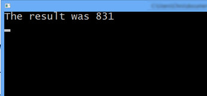
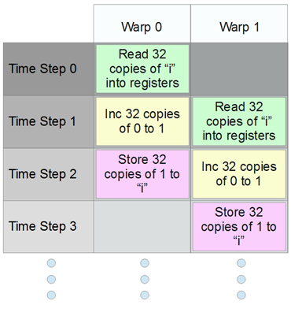
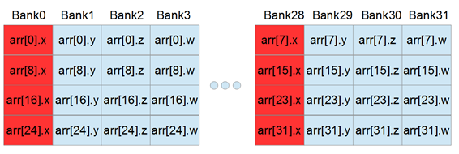
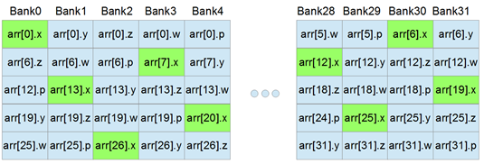

# 第六章共享内存

共享内存是少量的片内内存，范围从 16 千字节到 48 千字节，具体取决于内核的配置。请记住，术语“片上”是指显卡主处理器内部(芯片在[图 3.6](03.html#Figure3_6) 中标记为 *B* )。

共享内存非常快，接近寄存器速度，但只有在最佳使用时。每个块分配和使用共享内存。同一线程块中的所有线程共享相同的共享内存分配，并且共享内存的每个块分配对网格中运行的其他块都不可见。

由于全局内存和共享内存之间的速度差异，如果您要执行的操作允许有效使用共享内存，那么使用共享内存几乎总是首选。在本章中，我们将研究共享内存的有效使用，但首先我们需要学习基本共享内存使用的语法和 API 调用。

## 静态和动态分配

共享内存可以通过两种方式之一分配给每个块:静态或动态。静态方法不太灵活，需要在编译时知道共享内存的数量。动态方法稍微复杂一些(语法上)，但是允许在运行时指定共享内存的数量。

### 静态分配的共享内存

要声明内核中的变量将存储在共享内存中，请在其定义中使用变量名称旁边的`__shared__`限定符关键字(参见清单 6.1)。

```cpp
    __global__ void MyKernel() {
    __shared__ int i; // Shared int
    __shared__ float f_array[10]; // 10 shared floats
    // ... Some other code
    }

```

清单 6.1:静态分配的共享内存

清单 6.1 显示了两个声明为`__shared__`的变量，一个名为`i`的整数和一个名为`f_array`的浮点数组。这个共享内存(包括`i`和`f_array`变量)被描述为静态分配的，因为共享内存的数量在编译时必须是恒定的。这里，我们为每个块分配一个`int`和十个`float` s，每个块共有 44 字节的共享内存(两个`int`和`float`都是 4 字节长)。

给定块中的所有线程将共享这些变量。网格中启动的每个块都会分配自己的这些变量的副本。如果我们启动一个 25 块的网格，共享内存中会有 25 份`i`和 25 份`f_array`。如果设备没有足够的共享内存来分配所请求的共享内存的所有 25 个副本，那么它就不能同时执行所有的块。设备可以同时执行尽可能多的块，但是当没有足够的资源时，它会安排一些块在另一些块之后执行。共享内存是设备最重要的资源之一，谨慎分配共享内存是决定占用率的重要因素，[第 8 章](08.html#_Occupancy)对此进行了描述。

## 动态分配的共享内存

分配共享内存的另一种方法是动态分配。这允许每个内核的共享内存量在每次启动时都有所变化。换句话说，数量不需要是编译时常数。要为内核分配动态数量的共享内存，我们需要在主机的内核启动配置中提供第三个参数。清单 6.2 中的代码显示了带有第三个参数的示例启动配置。

```cpp
    // Kernel
    __global__ void SomeKernel() {
    // The size of the following is set by the host
    extern __shared__ char sharedbuffer[];
    }

    int main() {

    // Other code

    // Host launch configuration
    SomeKernel<<<10, 23, 32>>>();

    // Other code

    }

```

清单 6.2:动态共享内存分配

内核启动配置参数(在`main`方法中)指定用每个`13`线程的`10`块启动内核。最后一个参数是每个块要分配的动态共享内存量。该参数以字节为单位，因此这里的值`32`意味着每个块应该分配 32 字节的共享内存。这 32 个字节可以用于许多不同的目的——它们可以是 8 `floats`、16 `shorts`、32 `chars`，或者消耗 32 个字节的任何数据类型的组合。

内核将共享数组声明为`extern __shared__`，这意味着共享内存的数量是动态的，将由启动配置中的主机决定。在前面的例子中，共享数组是`char`类型，但是它可以是任何类型。此外，每个块的 32 字节共享内存是在启动配置中用文字常量指定的，但是这个量可以是一个变量。

### 使用动态共享内存作为多个数据

启动配置只允许一个额外的值来指定每个块的动态共享内存量。如果一个算法要求每个块有多个共享内存数组，程序员必须分配一个共享内存存储，并使用指针来访问它。换句话说，如果需要多个动态共享内存阵列，必须手动协调。清单 6.3 展示了一个为两个数组使用单个共享内存块的例子，一个是 chars，另一个是 floats。

```cpp
    __global__ void SomeKernel(int sizeofCharArray) {
    // Declare a single dynamic store of shared memory per block
    extern __shared__ char bothBuffers[];

    // Make a char* pointer to the first element
    char* firstArray = &bothBuffers[0];

    // Make a float* pointer to some other element
    float* secondArray = (float*)&bothBuffers[sizeofCharArray];

    firstArray[0]++; // Increment first char
    secondArray[0]++; // Increment first float
    }

```

清单 6.3:使用两个动态数组

在这个列表中，相同的动态共享内存分配(称为`bothBuffers`)用于字符数组(`firstArray`)和浮点数组(称为`secondArray`)。显然，必须注意不要在这些数组的边界之外读写。

在清单中，字符数组的大小被指定并作为参数传递给内核`sizeOfCharArray`。将偏移量和数组大小作为参数传递给内核允许变量类型和大小的数组。`bothBuffers`数组使用动态共享内存，但它很容易成为静态分配，`sizeOfCharArray`参数仍可用于手动控制数组的大小。

## CUDA 缓存配置

如前所述，全局内存和共享内存的 L1 缓存实际上是相同的物理内存。这个内存有 64k(在所有当前的卡上)，程序员可以将它拆分，以使用更多的 L1、更多的共享内存，或者两者的数量相同。L1 是一个完全正常的自动全局内存缓存。数据存储在 L1 缓存中，并在设备认为必要时被逐出。共享内存完全由程序员控制。

启动内核时，您可以将这 64k 内存分成 48k 的 L1 内存和 16k 的共享内存。您也可以使用 16k 的 L1 和 48k 的共享内存。在较新的卡(700 系列以上)上，还有另一种选择，那就是将内存分成两半——32k 的 L1 和 32k 的共享。要为特定内核设置共享内存和 L1 的配置，请使用`cudaFuncSetCacheConfig`功能:

`cudaFuncSetCacheConfig(kernelName, enum cudaFuncCache);`

其中`kernelName`为内核，`cudaFuncCache`为表 6.1 中`cudaFuncCache`列的值之一。

表 6.1: cudaFuncCache 值

| cudaccfuncache | >整数值 | 配置 |
| --- | --- | --- |
| `cudaFuncCachePreferNone` | Zero | 默认 |
| `cudaFuncCachePreferShared` | one | 48k 的共享，16k 的 L1 |
| `cudaFuncCachePreferL1` | Two | 16k 的共享，48k 的 L1 |
| `cudaFuncCachePreferEqual` | three | 共享 32k，L1 32k |

|  | 注意:cudaFuncCachePreferEqual 设置仅适用于较新的卡—700 系列和更新的卡。如果为旧卡选择了此设置，将使用默认值。 |

无论程序员对`cudaFuncCache`设置使用什么值，都只是推荐给 NVCC。如果 NVCC 决定，尽管有这个设置，内核需要更多的共享内存，那么它将覆盖这些设置，选择 48k 的共享内存设置。这种对程序员偏好的覆盖发生在编译时，而不是程序运行时。

下面的代码示例演示了如何调用`cudaFuncSetCacheConfig`函数。

```cpp
    // Set the cache config for SomeKernel to 48k of L1
    cudaFuncSetCacheConfig(SomeKernel, cudaFuncCachePreferL1);

    // Call the kernel
    SomeKernel<<<100, 100>>>();

```

清单 6.4:设置缓存配置

## 平行陷阱和竞赛条件

本节强调了在并发线程之间共享资源的一些危险。当资源在多个线程之间共享时(这包括来自全局内存、共享内存、纹理内存等的任何共享资源。)出现了串行代码中没有的潜在危险。除非注意适当地协调对共享资源的访问，否则多个线程可能会同时争用一个资源。这导致代码经常是不可预测和有问题的。多个线程同时改变一个资源的值的结果是未知的(实际上假设任何特定的值都是不安全的)。

为了理解比赛条件如何导致麻烦以及为什么会导致不可预测的结果，考虑计算机实际上是如何对内存中的变量进行操作的。清单 6.5 展示了一个简单的内核，其代码故意导致两个竞争条件，一个在共享内存中，另一个在全局内存中。

```cpp
    #include <iostream>
    #include <cuda.h>

    using namespace std;

    // Kernel with race conditions
    __global__ void Racey(int* result) {

    __shared__ int i;

    // Race condition 1, shared memory
    i = threadIdx.x;

    // Race condition 2, global memory
    result[0] = i;
    }

    int main() {
    int answer = 0;
    int* d_answer;
    cudaMalloc(&d_answer, sizeof(int));

    Racey<<<1024, 1024>>>(d_answer);

    cudaMemcpy(&answer, d_answer, sizeof(int), cudaMemcpyDeviceToHost);

    cout<<"The result was "<<answer<<endl;

    return 0;
    }

```

清单 6.5:比赛条件

内核声明一个名为`i`的共享整数。每个线程都试图将这个共享变量设置为自己的`threadIdx.x`。一个积木里的每一根线都有不同的`threadIdx.x`。理论上，每个块的所有 1024 个线程会同时将这个共享变量设置为不同的值。这只是“理论上”的，因为调度器负责块实际执行的顺序，并且根据资源的可用性，调度器可能会也可能不会同时执行所有 1024 个线程。不管调度器实际上是否同时执行线程，或者如果一些线程在另一些线程之后执行，将变量`i`设置为 1024 个不同的值是没有意义的。这种类型的活动不利于生产性软件开发。在实践中，实际产生的`i`将是一个单一的值，但我们不知道是什么。

清单 6.5 中的下一个竞争条件发生在网格中的每个线程同时设置全局内存的时候。参数`result`存储在全局存储器中。`result[0] = i;`那句台词就是废话。首先，`i`的值是用共享内存中的比赛条件设置的。本质上，程序员不再控制这些变量。这些变量给出的最终值完全取决于设备。该设备将按某种顺序调度线程，并实际得出如图 6.2 所示的答案，但是假设该设备将总是返回 831 是非常愚蠢的。



图 6.2:比赛条件的输出

### 读-修改-写

看起来，如果一个共享变量由多个线程递增，而不是像清单 6.5 中那样被设置为多个值，那么操作将是安全的。毕竟，线程实际增加的顺序完全无关紧要。只要它们都增加，我们就应该得到相同的值。问题是这仍然是一种比赛状态。要了解原因，我们需要更详细地了解增量指令。语句`i++`实际上做了三件事(这适用于 GPU 和 CPU):

1.  将`i`的值读入寄存器。
2.  递增寄存器中的值。
3.  将结果存储回`i`。

这个过程叫做*读-修改-写*操作。几乎所有修改内存的操作(在主机和设备中)都是通过这三个步骤完成的。图形处理器和中央处理器从来不直接在内存上运行。只有当数据在寄存器中时，它们才能对数据进行操作。这就是寄存器的用途；它们是硬件用于核心计算的变量。这意味着硬件必须首先从内存中读取值，并在操作完成时写入结果值。问题在于，当多个线程同时运行时，它们各自同时执行读-修改-写操作，或者以任意顺序混杂，或者两者兼而有之。100 个并发线程都试图增加同一个共享变量`i`可能如下所示:

1.  所有 100 个线程将`i`的值读入寄存器。
2.  所有 100 个线程将其寄存器增加到`1`。
3.  100 个线程全部存储`1`作为结果。

人们很容易认为我们总是会得到价值`1`，但除了非常无意义地使用 100 个线程之外，这甚至不是真的。这 100 个线程实际上可以或不可以彼此同步操作。在 CUDA 中，线程一次以 32 个线程的经线执行(经线是 32 个具有顺序`threadIdx`值的线程的集合，所有线程都来自同一个块，并且都同时执行)。图 6.3 显示了在两条经线中同时运行的 64 条线。



图 6.3: CUDA 扭曲试图同时递增

在图 6.3 中，我们看到从 0 到 3 的四个时间步长(这些可能被认为是单独的时钟周期)。在该示例中，来自第一个扭曲(扭曲 0)的线程首先执行读取。随着`i`的增加，第二个经纱的纱线读取`i`的初始值(仍然是 0)。前 32 个线程随后会随着第二次扭曲的增加将结果 1 写入内存。最后，第二次扭曲也将 1 写入内存。


图 6.4:另一种可能的执行顺序

图 6.4 显示了另一种可能的方式，调度程序可能会在试图增加一个共享变量时对两个扭曲进行排序。在本例中，第一次扭曲完成了读-修改-写，第二次扭曲将变量增加到 2。当调度扭曲时，调度程序可能选择这些执行顺序中的任何一个，并且它可能选择其他可能性。

该算法有多个可能的输出。此外，如果 32 个线程被编程来增加一个变量，程序员可能希望最终结果是 32，这几乎肯定是永远不会得到的。

|  | 注意:当多线程共享资源时，有特殊的原语来处理它们。互斥体和信号量是最常见的。对于那些对这些并行原语感兴趣的人，我强烈推荐阅读罗伯特·唐尼的《信号量小书》。 |

### 街区范围的屏障

并行编程中的“障碍”是代码中的一个点，在这个点上，所有线程都必须先相遇，然后才能继续。这是一种简单但非常有用的同步技术，可以用来消除代码中的竞争条件。在 CUDA 中，有一个全块屏障功能`__syncthreads`。该函数没有参数，也没有返回值。它确保块的所有线程在继续之前在函数调用点同步。使用`__syncthreads`函数，我们可以确保线程不会争夺`__shared__`变量。请参见清单 6.6。

```cpp
    __global__ void SomeKernel() {
    // Declare shared variable
    __shared__ int i;

    // Set it to 0
    i = 0;

    // Wait until all threads of the block are together
    __syncthreads();

    // Allow one thread access to shared i
    if(threadIdx.x == 0)
           i++;

    // Wait until all threads of the block are together
    __syncthreads();

    // Allow another single thread access to i
    if(threadIdx.x == 1)
           i++;
    }

```

清单 6.6: __syncthreads()，块级屏障函数

在前面的清单中，`__syncthreads`用于确保一次只有一个线程递增共享变量`i`。所有线程将变量初始设置为`0`保证会导致其中至少一个线程最后成功设置该值。下一行包含对`__syncthreads`的调用。所有线程都将等待，直到该块的每个线程都执行了`i=0`指令。一旦所有线程在第一次`__syncthreads`调用时暂停，只有带有`threadIdx.x == 0`的线程会通过第一次`if`语句，并在另一次`__syncthreads()`中找到自己。当它们等待时，第一个线程(`threadIdx.x == 0`)将递增`i`，然后加入在屏障处等待的块的其他线程。然后螺纹将继续，带有`threadIdx.x == 1`的螺纹将增加`i`。代码显示`__syncthreads`和单线程访问共享资源是一个安全的操作，我们保证到这段代码结束时，共享变量`i`会递增到`2`。

|  | 注意:__syncthreads()方法只是块范围的屏障。属于其他块的线程不会被阻止。它对于同步对全局资源的访问没有用。在块的线程分支的情况下，不要使用 __syncthreads。如果某些线程在 If 语句的代码中发现了`__syncthreads()`，而同一块的其他线程通过 if 语句，就会产生死锁。等待的线程将无限期暂停，再也见不到它们的兄弟了，这很可能导致程序冻结。 |

|  | 注意:没有安全的方法可以在内核中产生网格宽度的屏障。该设备的设计不允许在自己的代码中设置网格范围的屏障。然而，主机会造成网格范围的障碍。函数 cudaMemcpy 造成了一个隐含的网格范围的障碍。主机将等待，直到设备完成任何正在执行的内核，然后再复制内存。此外，主机函数 cudaDeviceSynchronize()被设计为显式允许主机等待设备完成内核执行。 |

### 原子指令

除了障碍，线程可以通过使用原子指令来安全地访问资源。原子指令是在单个不间断的步骤中执行读-修改-写的指令。如果 32 个线程同时执行一个原子增量，那么这个变量肯定会增加 32 次。参见清单 6.7 中使用`atomicAdd`指令递增全局变量的例子。

|  | 注意:原子指令仅在计算能力为 1.1 或更高的设备上可用。要编译清单 6.7 中的代码，您需要在项目的代码生成选项中指定 compute_11、sm_11 或更高版本。 |

```cpp
    #include <iostream>
    #include <cuda.h>
    #include <cuda_runtime.h>

    using namespace std;

    __global__ void AtomicAdd(int* result) {
    // Atomically add 1 to result[0]
    atomicAdd(&result[0], 1);
    }

    int main() {
    int answer = 0;
    int* d_answer;

    // Allocate data and set to 0
    cudaMalloc(&d_answer, sizeof(int));
    cudaMemset(d_answer, 0, sizeof(int));

    // Run 2048 threads
    AtomicAdd<<<64, 32>>>(d_answer);

    // Copy result and print to screen
    cudaMemcpy(&answer, d_answer, sizeof(int), cudaMemcpyDeviceToHost);
    cout<<"The result was "<<answer<<endl;

    return 0;
    }

```

清单 6.7:自动递增一个全局变量

清单 6.7 的结果(主机的`answer`变量)总是 2048。每个线程自动递增全局变量`result[0]`，确保在允许任何其他线程访问`result[0]`之前，其增量已经完成。内核是用 2048 个线程启动的，所以结果会是 2048 个。当一个线程开始对`result[0]`变量进行原子读-修改-写时，所有其他线程都必须等待，直到它完成。线程将一次增加一个`results[0]`。

原子指令缓慢但安全。许多常见的指令都有原子版本。有关可用原子指令的完整列表，请参见 CUDA C 编程指南的原子函数部分:[http://docs . NVIDIA . com/CUDA/CUDA-C-编程指南/index . html #原子函数](http://docs.nvidia.com/cuda/cuda-c-programming-guide/index.html#atomic-functions)。

|  | 注意:计算能力为 2.0 及更高的设备能够在共享内存上执行原子指令。旧设备(计算能力 1.xx)只有全局内存的原子指令。 |

## 共享内存库和冲突

现在我们已经研究了并发线程之间共享资源的一些常见问题，我们可以将注意力转向共享内存，特别是如何有效地使用它。该设备执行所有操作(加法、乘法、布尔运算等)。)关于寄存器中的数据。共享内存在运行前必须读入寄存器(全局、纹理、常量和所有其他内存也必须先读入寄存器)。一旦在寄存器中执行了计算，结果就可以存储回共享存储器。共享内存被组织成每个四字节的字。任何一个四字节的字可以包含一个 32 位的`int`、一个`float`、半个`double`、两个`short` `int`以及任何其他可能的 32 位组合。每个字属于 32 个存储体中的一个，存储体向寄存器读写值。


图 6.5:共享内存中的地址

图 6.5 展示了共享内存中的一些地址。Bank0 负责读写共享内存的前四个字节，Bank1 读写下一个字节。存储体 31 读写地址为 0x7C 至 0x7F 的字节，此后，存储体重复。地址 0x80 至 0x83 的字节再次属于存储体 0(它们是存储体 0 的第二个字)。

共享内存可以用字节来寻址，但它也是专门为 32 位字的快速寻址而设计的。想象一下，我们在共享内存中有一个由浮点组成的数组(浮点是 32 位宽或每个字一个):

`__shared__ float arr[256];`

数组中每个连续的`float`将属于不同的存储体，直到`arr[32]`，它(像`arr[0]`一样)属于存储体 0。图 6.5 显示了这些单词的索引以及它们属于哪家银行。


图 6.6:共享内存中的单词索引

这一点很重要，因为每家银行一次只能为一条经线提供一个单词。所有 32 个存储体可以非常快速地同时服务于一个曲速的所有 32 个线程，但前提是每个存储体只请求一个字。当 warp 从共享内存中请求某种地址模式时，这些地址对应于存储体的任何排列。有些排列比其他排列快得多。当经线从任何单个存储体请求一个以上的字时，这被称为引起存储体冲突。银行将连续访问这些单词，意思是先访问一个，然后访问另一个。

|  | 注意:银行冲突只是扭曲级别的考虑因素；任何块间访问模式都不会导致存储体冲突。如果块 0 的翘曲在块 1 从存储库 0 访问字 1 的同时从存储库 0 访问字 0，则不存在存储库冲突。 |

当一个 warp 的所有线程从共享内存中访问完全相同的字时，就会执行一个称为广播的操作。共享内存被读取一次，值被分配给一个扭曲的线程。广播非常快——就像从每家银行阅读一样，没有冲突。

在计算能力为 2.0 及以上的设备上，有一种类似于广播(但更灵活)的操作称为多播。任何时候，一个 warp 的多个线程从任何特定存储体访问完全相同的字，存储体将读取共享内存一次，并将该值提供给任何需要它的线程。组播类似于广播，只有曲速的所有 32 个线程不需要访问同一个字。如果没有存储体冲突，多播操作的速度与广播操作的速度相同。

### 访问模式

在前面关于银行冲突的讨论中，广播和组播对性能编码有重要影响。扭曲的线程可能会从共享内存中请求许多访问模式。有些比其他的快得多。下面所有的例子都是基于一组叫做`arr[]`的单词。

下表显示了一些模式、使用它们的速度以及可能导致的冲突描述。

表 6.2:访问模式

| 访问模式 | 笔记 |
| --- | --- |
| `arr[0]` | 快，这是广播。 |
| `arr[blockIdx.x]` | 快，这是广播。 |
| `arr[threadIdx.x]` | 快速，所有线程请求来自不同的银行。 |
| `arr[threadIdx.x/2]` | 快，这是多播。每 2 个<sup>和</sup>线程从同一个存储体读取。 |
| `arr[threadIdx+71]` | 快速，所有线程请求来自不同的银行。 |
| `arr[threadIdx.x*2]` | 缓慢的双向银行冲突。 |
| `arr[threadIdx.x*3]` | 快速，所有线程请求来自不同的银行。 |
| `arr[threadIdx.x*8]` | 非常缓慢，8 路银行冲突。 |
| `arr[threadIdx.x*128]` | 极其缓慢的 32 路银行冲突。 |
| `arr[threadIdx.x*129]` | 快速，所有线程请求来自不同的银行。 |

访问多个`threadIdx.x`类似于访问数组中的结构(产生相同的地址模式)。例如，下面的结构正好是四个单词长。

```cpp
    // 4-word-long structure
    struct Point4D {
    float x, y, z, w;
    };

```

清单 6.8:长度为四个单词的结构

给定内核中这种结构的实例数组，并且给定线程基于它们的`threadIdx.x`访问后续元素，我们将从清单 6.9 中的操作中得到一个四路库冲突。

```cpp
    __shared__ Point4D arr[32];
    arr[threadIdx.x].x++; // Four-way bank conflict

```

清单 6.9:四方银行冲突

`x`元素的增量需要三个指令(读-修改-写)，并且导致的不是一个，而是两个四向存储体冲突。数组的元素各有四个字长。每个结构都有各自的`x`值，相隔四个存储体。每四个银行服务于曲速四值和中间银行(银行 1，2，3，5，6，7 等。)什么都没做。见图 6.7。



图 6.7:来自结构的四向银行冲突

有一个非常简单的方法可以解决这种四路银行冲突——用一个额外的单词填充结构，如清单 6.10 所示。

```cpp
    // 4-word-long structure with extra padding
    struct Point4D {
    float x, y, z, w;
    float padding;
    };

```

清单 6.10:填充结构以抵消银行

通过增加一个额外的字，`sizeof(Point4D)`已经从四个字变成了五个字，但是来自一个经线的线程的访问模式不再导致任何存储体冲突(至少在每个线程访问数组的后续元素时不会)。使用与之前完全相同的代码(清单 6.9)，我们现在可以看到，由于有了额外的填充，根本不存在存储体冲突——每个线程都从不同的存储体请求一个单词。



图 6.8:带有填充字的访问模式

图 6.8 中的访问模式看起来比图 6.7 中的模式复杂得多，但它要快得多，因为每个银行都将被精确地使用一次。

添加填充来抵消所请求的单词并更好地利用 32 个存储体通常是一个好主意，但并不总是这样。它需要足够的共享内存来存储额外的填充字。填充字除了抵消请求模式之外，通常是完全无用的。有时添加填充是有益的，有时共享内存是一种非常宝贵的资源，不能在每个需要的线程上丢弃 4 字节的填充。

单靠理论很难(如果不是不可能的话)完全发明最好的访问模式和填充结构。微调共享内存访问模式的唯一方法是反复试验。理论，甚至侧写，只能提供建议。