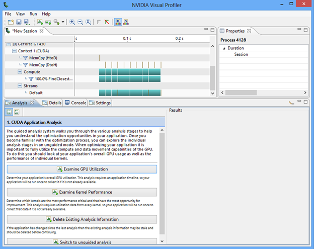
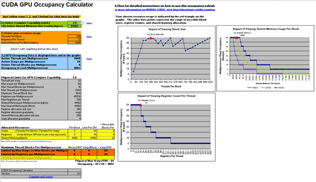
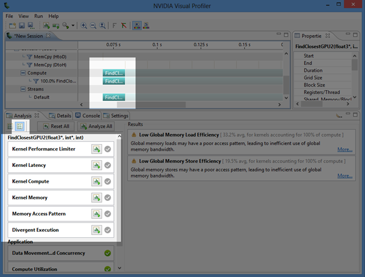
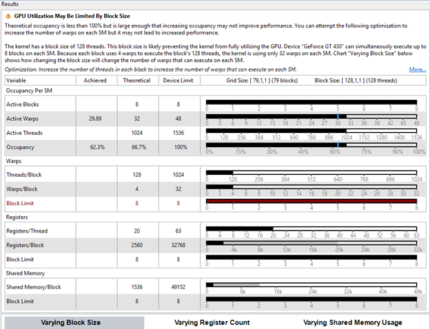
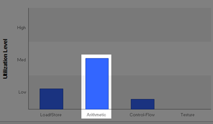
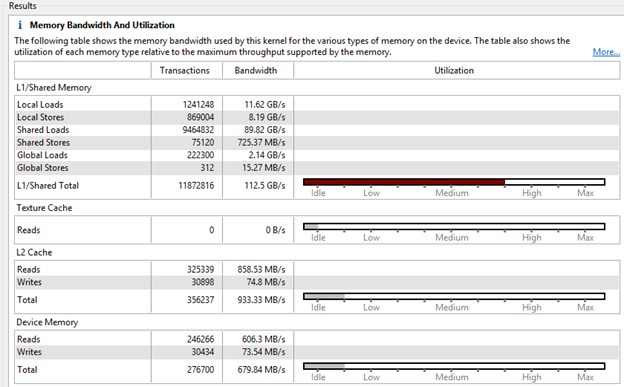
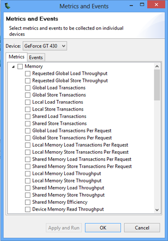
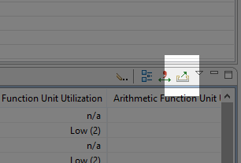

# 八、英伟达视觉轮廓仪(NVVP)

我们现在将把注意力转移到完全不同的事情上。我们将不再直接使用 CUDA C 编码，而是看看其他一些工具，它们共同构成了 CUDA 工具包。CUDA 工具包中最强大的工具之一是英伟达视觉分析器，即 NVVP。它提供了大量的分析工具，旨在深入内核并收集数百个有趣的性能计数器。

使用探查器可以极大地帮助代码优化，并为程序员节省大量时间和反复试验。NVVP 可以指出该设备可以更有效使用的许多可能领域。它运行应用程序，在内核执行时从设备收集数千个指标。它以有效且易于理解的方式呈现信息。

具有计算能力 1.x 的旧设备不会收集与新设备相同的指标。如果您使用的是旧设备，您可能会发现探查器没有足够的数据用于以下某些测试。当没有数据时，探查器不会生成图中所示的图表。

## 启动探查器

可视探查器将安装到几个不同位置中的任何一个，具体取决于您安装的 CUDA 工具包的版本。运行探查器的最简单方法是在您安装的应用程序中搜索 NVVP。您可以使用 Windows 7 和早期版本的“开始”菜单或 Windows 8 中的“开始”屏幕来搜索 NVVP。

当您运行 NVVP 应用程序时，您将看到一个简短的闪屏。然后，您应该会看到主探查器窗口。向导可能会打开并帮助您创建项目，并将程序加载到配置文件中。

要打开分析程序，打开**文件**菜单，选择**新会话**。您将看到“创建新会话”对话框。在下面的截图中，我将使用共享内存版本的最近邻算法(来自第 7 章)来测试 profiler，但是您可以加载任何一个。exe 文件。键入的路径。通过点击**浏览**按钮(见图 8.1)，您已经编译的 exe 文件或找到您想要配置的编译文件。通常最好是分析用优化编译的应用程序(即发布模式，而不是调试模式)。发布模式和调试模式之间的性能差异很大，探查器关于调试模式程序的信息可能与发布模式编译完全无关。

图 8.1:创建新的探查器会话

如果需要，您可以选择工作目录和命令行参数来在程序执行时传递程序，以及环境变量。“创建新会话”对话框中唯一需要的设置是“文件”设置。选择文件后，点击**下一步**。

对话框的下一页允许您指定一些基本的分析设置，例如是否应该立即分析应用程序(或者分析器是否应该简单地定位文件并等待您的命令开始分析)以及设备的驱动程序超时应该是多少。单击**完成**创建探查器项目。如果您选择了**通过分析**开始执行复选框，程序将立即运行并分析您的应用程序。

|  | 提示:使用 Visual Studio 中的“生成行号信息”选项来充分利用可视化探查器。当编译的程序包含行号引用时，探查器能够提供详细信息。在 Visual Studio 的“项目设置”对话框中，可以在 CUDA C/C++ 部分将此选项设置为“是”(-lineinfo)。 |

### 总平面布置图

探查器由窗口顶部的菜单栏和工具栏以及三个子窗口组成，每个子窗口包含一个或多个选项卡(参见图 8.2)。左上角的窗口提供了内核和其他 CUDA 应用编程接口函数调用的概述。它由应用程序中活动的设备(包括主机)、流和上下文的可折叠树视图组成。

图 8.2:NVVP 主窗口

该概览面板还在树形视图的左侧包含一个图表。图表的行可以使用树形视图打开或关闭。该图表描述了内核执行和 CUDA 应用编程接口函数调用所花费的时间。函数或内核花费的时间越长，代表调用的条就越长。

如果您选择不立即分析应用程序，或者在对进行更改后需要重新运行分析。exe，可以随时点击工具栏中的**播放**按钮(后面有加载条的那个)重新运行配置文件。

分析完应用程序后，选择代表您感兴趣的内核调用的栏。我在图 8.3 中选择了对`FindClosestGPU`的第一次调用。

图 8.3:内核调用的属性

属性面板将充满关于内核调用的信息(图 8.3 的右侧)。开始、结束和总执行时间以毫秒为单位显示。启动配置显示网格由总共 79 个块组成，每个块有 128 个线程。

每个线程的寄存器计数和每个块的共享内存都有度量标准。我们将很快对此进行更详细的研究，因为它们对占用率有很大的影响。下一个数字是理论入住率。随着本章的深入，我们还将详细检查占用率，因为生成的已实现占用率度量告诉我们内核实现的实际占用率，而不仅仅是最高的理论占用率。

最后三个属性显示了 SMs 请求的共享内存量、它们被给了多少，以及共享内存库的字长(当前所有卡的字长为 4)。

## 入住

占用率是一个简单的指标，用于确定设备与其可能的繁忙程度相比有多繁忙。占用率是并发运行的经纱数除以特定设备可运行的最大经纱数的比率。

并发扭曲可能会也可能不会同时运行。如果设备已经为扭曲分配了资源(共享内存和寄存器)，则称扭曲是活动的(并发运行)。该设备将保持一个扭曲活动，直到它已经完成执行内核。它将在活动扭曲之间来回切换，试图隐藏扭曲在执行指令时导致的内存和算术延迟。

通常，并发运行的经纱越多(占用率越高)，设备的利用率越好，性能越高。如果有许多扭曲同时运行，当一个扭曲被延迟时，调度程序可以切换到其他扭曲，从而隐藏这个延迟。

|  | 提示:CUDA 工具包提供了一个名为 CUDA 占用率计算器的 Excel 工作表。这可以在 C:\程序文件\NVIDIA GPU 计算工具包\ CUDA \ v6.5 \工具或类似文件夹中找到，具体取决于您的安装。工作表允许您快速输入计算能力、共享内存使用情况、每个线程的寄存器计数和块大小。它计算理论占用率，并显示详细的图表，描述改变块大小、寄存器计数、共享内存使用或所有三者的可能结果。图 8.4 显示了计算器的截图。 |

图 8.4: CUDA 图形处理器占用率计算器

每个 SM 的最大线程数(根据我的设备的输出设备查询；确保检查您自己硬件的输出)是 1，536(或 48 × 32)。这意味着对于 100%的占用率，内核在任何时候都需要总共有 1，536 个线程处于活动状态；任何低于这个的都不是 100%的入住率。设备中很可能有多个 SM(同样，根据我的硬件的设备查询，有两个)，活动线程的总数是 1，536 乘以设备中的 SMs 数量。例如，如果有两个 SMs，活动线程的总数可能是 3，072。

只有特别小心才能达到最大入住率。每个块的线程数、每个线程的寄存器和每个块的共享内存共同定义了 SM 能够并发执行的线程数。

|  | 注意:最大化占用率并不总是优化特定内核的最佳选择，但它通常会有所帮助。关于优化某些低占用率内核的非常有启发性的演示，请参见瓦西里·沃尔科夫在 2010 年图形处理器技术会议(GTC)上的演示，更低占用率下的更好性能。幻灯片可在[http://www.cs.berkeley.edu/~volkov/volkov10-GTC.pdf](http://www.cs.berkeley.edu/~volkov/volkov10-GTC.pdf)获得。演示文稿已录制完毕，可从 GTC 在线点播到[http://www.gputechconf.com/gtcnew/on-demand-gtc.php](http://www.gputechconf.com/gtcnew/on-demand-gtc.php)。 |

### 寄存器计数

设备中的每个 SM 最多可以同时执行 8 个块，最多可以执行 48 个扭曲，但前提是资源允许。管理资源之一是每个线程的寄存器计数。图 8.3 中的寄存器/线程度量显示了每个线程使用了多少个寄存器。使用的寄存器数量与内核代码中的变量数量(以及变量类型——例如，双精度取两个寄存器)有关。在代码中重用一小部分变量，而不是定义许多不同的变量，通常会减少每个线程的寄存器数量，但通常是以代码复杂性为代价的。

如果该值很高(每个线程可能有 40 或 60 个寄存器)，并且每个块有相当多的线程，SMs 将不能同时执行 48 个扭曲。

|  | 提示:NVCC 可以返回详细的信息。除了其他内容之外，该输出还包括在项目构建过程中对 Visual Studio 输出窗口的每个内核的寄存器使用情况的打印输出。如果希望启用此输出，请在 CUDA/设备部分的项目属性中将详细 PTXAS 输出选项设置为是(- ptxas-options=-v)。 |

|  | 注意:每个线程使用一个额外的隐式寄存器，这不会在探查器或详细的 PTXAS 输出中报告。所有寄存器计数都应增加这个额外的寄存器，以确保准确。不是每个内核最多 64 个寄存器，而是限制在 63 个。 |

此设备的每个 SM 的最大并发线程数(根据设备查询，GT 430)为 1，536 (48 条经线，每条 32 条线)。寄存器的最大数量(由设备查询报告)为 32，768 或 32k。如果每个线程使用 24 个寄存器(加上一个隐式寄存器)，那么 1536 个线程将使用 25×1536；或 38400 个寄存器。这个数字大于 32，768 个可用寄存器，因此设备不可能在 100%占用率下运行。每经需要 32 × 25 个(因为每经有 32 根线)寄存器，即 800 个。可用寄存器的数量除以该值并向下舍入，将得出 SM 可以执行的活动扭曲的大致数量，32，768 / 800 = 40。这意味着，如果只有一个 SM，设备可以执行的活动扭曲数将是 40，而不是最大值 48。

|  | 提示:有一个非常简单的方法可以减少线程的寄存器使用——在项目的属性中设置 MaxRegCount 值。在设备子标题下的 CUDA C/C++ 选项卡中，其中一个选项标记为最大使用寄存器。如果内核的寄存器使用限制了占用率，请在这里设置一个小数字。小心点！不要将其设置为不切实际的低值(如 1 或 2)；您的代码可能需要很长时间来编译，或者根本不编译。设置为 0(默认)意味着 NVCC 将决定使用多少寄存器。将值设置为低于 NVCC 使用的数值通常意味着当寄存器溢出时会使用本地内存，并且在提高性能方面不会给你带来任何额外的好处。 |

### 共享内存使用情况

设备上的共享内存总量为 64k，其中一部分将用作 L1 缓存。本例中的内核使用了 16k 的 L1 缓存和 48k 的共享内存。每个块使用一个`float3`结构的数组，每个结构有一个 12 字节的`sizeof`值。数组中有 128 个元素，因此该内核每个块的共享内存使用总量为 128 × 3 × 4 字节，即 1.5 千字节。

如果资源允许，SM 将一次执行多达八个块。由于 48k / 1.5k = 32，我们的共享内存使用实际上将允许 32 个并发块。这意味着共享内存不是这个内核占用率的限制因素。

## 非导向分析

通过在图形显示窗口中选择内核的一个特定实例，并使用非导向分析选项，我们可以从分析器中获得更多的细节。在下面的截图中(图 8.5)，我选择了第一次内核启动。

图 8.5:非导向分析

单击“运行分析”按钮(这些按钮在左侧面板的“分析”选项卡中带有一个小图表和绿色箭头)将在探查器中重新运行应用程序，但它将在当前选定的内核上收集特定请求的数据。所选内核通常需要更长的时间来运行，因为探查器在执行代码时会收集信息。

### 内核性能限制器

来自无指导分析的信息可以帮助您准确地指出代码中的瓶颈在哪里。在这个例子中，点击内核性能限制器按钮会产生下面的图表(图 8.6)。

图 8.6:内核性能限制器

控制流和内存操作只是图 8.6 中计算栏的一小部分。内存栏显示我们严重依赖共享内存，根本不使用 L1 缓存。这种对共享内存的大量使用是有意的；这是我们在第 7 章中应用的阻塞技术的结果。

计算栏的算术运算部分非常大。该图表表明，如果内核要执行得更快，它将需要更少的算术运算。为了减少内核中的运算量，我们需要简化表达式(由于表达式并不复杂，这可能不会带来实质性的好处)，或者我们可以使用更有效的算法。

我们的算法本质上只是一个蛮力线性搜索，是一个糟糕的选择。每个点与整个数组中的其他点进行比较，如果我们真的想减少算术运算量，我们会研究将我们的点存储在一个更复杂的结构中，这样我们就不需要执行如此多的比较。剖析器没有直接说这些，但是可以从图 8.6 中收集到。我们的内核需要太多的点比较，这是它慢的主要原因。

### 内核延迟

内核延迟选项产生了一个复杂的图表输出，指出了可能限制内核占用率的因素(见图 8.7)。

图 8.7:内核延迟

此选项还会在属性选项卡中生成达到的占用率统计数据，刚好高于理论占用率。图 8.7 中的输出将实现的占用率与最大值进行了比较。它非常清楚地表明，块大小(128 个线程)是一个可能的限制因素。

对于这个特定的内核和这个特定的设备，分析器的这个提示对整体性能几乎没有影响。我测试了许多块大小，发现尽管较大的块大小会提高占用率(例如，每个块 512 个线程的占用率为 92.2%)，但整体性能保持不变。在这种情况下，探查器提出的增加块大小的建议是无益的，但通常情况并非如此。

### 内核计算

当我们使用内核计算选项时，我们可以再次看到算术可能是我们代码中的一个瓶颈。图 8.8 中的图表(来自内核计算分析的输出)也显示我们的纹理计算使用不存在。将点存储为纹理并允许纹理单元执行至少一些计算可能会提高我们的性能。

图 8.8:内核计算

### 内核内存

内核内存使用配置文件显示，我们的共享内存使用量与我们在第 7 章中使用的阻塞技术相比相当高，这并不奇怪(图 8.9)。纹理缓存读取非常低，因为我们根本没有使用任何纹理内存。这个输出再次表明，如果我们能够找到一种方法来使用纹理内存来解决当前的问题，可能会有一些好处。

图 8.9:共享内存阻塞的内核内存

L2 和设备内存的“空闲”读数通常是一件好事，因为与共享内存相比，这些内存非常慢。图 8.10 显示了算法的原始 CUDA 版本的内核内存使用配置文件(其中我们没有使用共享内存)。我把它包括在内，因为它进行了有趣的比较。

图 8.10:没有共享内存阻塞的内核内存

性能差异(从第 5 章算法的 37 毫秒到第 7 章算法的 12 毫秒)几乎完全归因于原始代码中使用的 L2 缓存。代码的原始版本(导致图 8.9)广泛使用了 L1 缓存。当原始内核的代码执行时，点被从 L1 驱逐到 L2，而实际上它们将在不久的将来被再次读取。使用 L2 和共享内存阻塞之间的差异为我们带来了健康的 300%性能提升。

使用`cudaMemcpy`复制到设备的数据总是经过 L2。在图 8.8 中，L2 读数显示这些点是从 L2 读入我们的共享内存块的。

### 内存访问模式

要在无指导分析下执行内存访问，必须在编译应用程序时生成行号。该选项将检查全局内存的使用效率。图 8.11 是一个输出示例。

图 8.11:内存访问模式

前三行(代码中引用第 118 行的行)可能不如后三行重要。第 118 行是我们从全局内存读取一个点到每个线程的地方。这里有三个事务，因为结构(`float3`)是由三个浮点组成的。以下三个事务对我们来说可能更重要(它们引用了代码中的第 128 行，在那里我们将全局内存读入共享内存块)。从图 8.11 中可以清楚地看到，并且知道我们的阻塞是如何工作的，第 118 行(3，752)的事务计数与更往下的第 128 行事务(296，408)相比完全不重要。如果我们需要基于这个输出进行优化，我们应该从第 128 行开始，而不是第 118 行。

在这段代码中，您可以看到这一点对内核的实际性能没有任何影响。如果我们注释掉代码中的第 128 行并重新运行内核，它会获得完全相同的性能。

在算法的原始 CUDA 版本中(来自第 5 章)，内部循环导致 37，520，000 个事务(截图中未显示)。在新版本(来自第 7 章)中，内部循环的全局内存事务完全可以忽略不计，并且在图 8.10 中根本没有被分析器显示出来。相反，我们看到的是创建共享内存块所涉及的相对较少的事务。将块读入共享内存的 296，408 个事务比 37，520，000 个事务有了巨大的改进。

### 发散执行

非导向分析中的最后一个选项(如果您使用的是 CUDA 或更高版本，则排在倒数第二)是发散执行分析。在我们特定的内核中，经线内的线的发散是不相关的，并且每根经线的线几乎一直都是以锁步的方式运行的。这种类型的执行模式对于 CUDA 来说是理想的，在这里也是可能的，因为我们的算法是令人尴尬的并行的。线程之间几乎不需要任何通信(除了偶尔的块范围的障碍`__syncthreads())`)。

线程发散是一个棘手的问题。考虑解决线程发散导致的性能不佳的一个好方法是改变数据、算法或两者，而不是试图优化小部分并保持相同的算法、数据结构或两者。尽量减少线程通信和同步。组织数据，使得大组连续的线程(即一个经线的 32 个线程)最有可能在`if`语句中采用相同的分支。

|  | 提示:当询问如何更好地存储和访问数据时，请考虑结构数组和数组结构。这个概念被称为“AoS vs. SoA”，它涉及到数据在内存中的垂直旋转，以改善访问模式。例如，不是将三维点存储为[x 1 、y 1 、z 1 、x 2 、y 2 、z 2 ...】，数据先存储所有 x 值，后存储 y 值，再存储 z 值，如[x 1 、x 2 、x 3 ...，y 1 ，y 2 ，y 3 ...z 1 ，z 2 ，z 3 。换句话说，与其将数据存储为点数组，不如访问模式来存储三个数组——一个用于 X 值，一个用于 Y 值，一个用于 Z 值(SoA)。 |

|  | 提示:CUDA 可以快速执行一个算法，但也可以多次执行同一个算法。这个看似显而易见的说法，在决定什么应该转换为 CUDA 时，总是值得考虑的。例如，在字符串搜索中，我们可以使用 CUDA 快速搜索特定的字符序列。但是一种完全不同的方法是使用 CUDA 来同时执行许多搜索。 |

## 其他工具

### 详细信息选项卡

“详细信息”选项卡提供了所有内核启动的摘要。该信息与“属性”窗口中的信息基本相同，但它是以类似电子表格的格式一次性提供给所有启动的。

|  | 提示:如果您在图形视图中选择了一个内核，将只显示该内核的详细信息。要显示所有详细信息，请在图形视图中单击鼠标右键，然后从上下文菜单中选择“不聚焦时间线”。 |

### 指标和事件

最后，从菜单栏中的**运行**选项，您可以选择收集或配置指标和事件。这将打开一个窗口，允许您指定您感兴趣收集的确切统计数据(参见图 8.12)。

图 8.12:指标和事件

明确定义您感兴趣的指标的好处是，当您单击**应用并运行**时，将为所有内核收集指标。在前面几节中，数据是单独为所选内核收集的。输出指标不会显示在“属性”窗口中，而是显示在“详细信息”面板中。

除此之外，通过在树视图中选择根节点，您可以一次选择许多度量(图 8.12)。这允许您快速选择所有指标并运行巨大的分析，收集应用程序中每个内核的每个方面的信息。完成分析需要一些时间，这取决于内核。这种请求的输出是研究可能的优化的众所周知的金矿。整个“详细信息”面板可以导出为逗号分隔值(CSV)文件，并在标准电子表格应用程序中打开。要导出详细信息面板，点击面板右上方的**导出 CSV 格式的详细信息**按钮(见图 8.13)。

图 8.13:将详细信息导出为 CSV 格式