# 第二章事故管理

事件管理可以定义为解决客户问题所采取的一系列步骤，是客户服务的核心。在管理客户事件时，清晰的沟通是成功的关键。

管理客户和团队的期望是良好沟通的基本要素。简而言之，您的客户应该知道他们报告问题后会发生什么(一个清晰的路线图和持续的反馈循环至关重要)，您的经理应该知道您将在特定事件上花费多少时间和精力。

管理客户事件的期望首先要问用户和老板对你的期望是否可以实现。在回答之前，你还必须问自己，就时间限制而言，你能合理地期望自己做什么。

如果被问的是不合理的，你必须后退一步，向各方(主要是你的老板)说明这一点，并向客户做出协调一致的解释，说明为什么回应当前的请求是不可行的。另一方面，如果请求合理，您应该尽快做出响应，给出明确的时间估计，并指出解决客户问题所涉及的步骤。

管理对客户事件的预期意味着理解以下内容:

*   当用户希望快速解决问题时，你的老板可能会希望你在这项任务上花更少的时间，而是要求快速解决问题。
*   你必须明白自己的极限，让所有相关方知道什么是合理的。
*   如果你是主要的联系人，你出去的时候一定要让人知道。
*   如果你手头没有一个完整的回应或解决方案，一句简单的“别担心，我有这个”会有很大帮助。

事件管理还包括确定需要多少沟通、沟通的语气，以及最重要的沟通频率。

在本章中，我们将通过创建 C#解决方案来自动化事件管理，该解决方案包括期望管理和成功关闭任何报告的事件所需的沟通循环。大多数帮助台和客户关系管理工具并不关注期望管理或沟通的语气和频率，但是当这些工具直接包含在您的项目或产品中时，它们应该是有用的，并且它们将允许您在您公司的产品线中开箱即用地集成这些功能。

客户关系管理是为了管理公司与当前和未来客户的互动而采取的方法。

大多数当前的客户关系管理软件，如 Salesforce 和 Microsoft Dynamics，更侧重于结束销售周期，而不是事件管理本身。尽管大多数客户关系管理软件都包含服务台子集，但我检查过的客户关系管理工具(甚至是那些专门为客户支持而构建的工具，如 Zendesk)都不太重视期望管理和沟通的频率或语气。

我的建议是，你提供一个 C#类，负责管理围绕沟通的期望，以及与任何报告的客户事件相关的沟通频率和语气。该类可以作为项目或产品中的一个可嵌入的、面向小型事件管理的客户关系管理系统，允许客户在产品本身中向您的 CORD 服务台报告问题。

表 4 代表了我们的简单可怕的客户关系管理工具将强调的规格。

表 4:简单易用的客户关系管理工具的规格

| 允许产品内的用户向 CORD 服务台报告问题。 |
| 明确定义和重新定义客户对问题的期望。 |
| 管理和设置通信频率。 |
| 向用户报告事件的状态和阶段，直到问题得到解决。 |
| 向服务台工作人员表明需要跟进或提供更新。 |
| 向用户指示为任务分配的资源及其可用性。 |

写完这些想法，让我们考虑如何编写代码。理想情况下，简单可怕的客户关系管理工具应该能够将其数据存储在云中，以便可以从任何位置轻松存储和检索。

当涉及到在云中存储数据时，使用传统的关系数据库(例如，MySQL、SQL Server、Postgres SQL、Oracle 等)有无数种选择。)和 NoSQL(如 MongoDB、DynamoDB、RavenDB 等。)可以私有托管，或者托管在亚马逊网络服务(AWS)或微软 Azure 等服务上。

尽管近年来在 AWS 或 Azure 上设置任何关系或非关系(NoSQL)数据库已经大大简化，但您仍然必须调配实例和吞吐量，并且您必须考虑请求和定价等因素，以便正确部署在线数据存储。这是一个相当复杂的过程，坦率地说，要求很高。

我们的目标是构建一个简单的客户关系管理工具，它可以很容易地嵌入到现有的项目和产品中，而不会导致我们在部署在线数据存储时绞尽脑汁。

表 5 展示了我们的数据存储应该允许我们的简单的令人敬畏的客户关系管理工具实现什么。

表 5:简单棒极了的客户关系管理工具数据存储规格

| 零维护，开箱即用。 |
| 可扩展，对吞吐量和请求没有限制。 |
| 廉价、无模式、出色的安全特性。 |
| NoSQL(非关系)数据库，但具有 SQL 语言功能。 |

现在，等一下。乍一看，我们的要求似乎有点过分。一个几乎无限可扩展的、无模式的 NoSQL 数据库，它允许与 SQL 兼容的查询功能？这真的存在吗？

嗯，是的，这样的奇迹确实存在。微软的员工已经开发了一个非常灵活和令人印象深刻的、完全托管的 NoSQL 文档(JSON)数据库，该数据库具有 SQL 查询语言功能。叫做 DocumentDB，可以在[微软 Azure](https://azure.microsoft.com/en-us/) 找到。

为了编写简单易用的客户关系管理工具，我们将使用。DocumentDB 的. NET SDK，可以在 [GitHub](https://github.com/Azure/azure-documentdb-dotnet) 上找到。

虽然显示的代码示例对于后续操作来说非常直观，但我建议您查看一下优秀的在线文档库[文档](https://azure.microsoft.com/en-us/documentation/services/documentdb/)。

根据[表 4](#Table4) 中的规格，我们需要创建一个 C#基类，它应该能够:

*   允许客户报告事件及其期望(严重性和重要性)。
*   允许客户进行一次或多次交流互动。
*   允许客户设置所需的通信交互频率级别(双向)。这应该提醒服务台跟进或采取行动。
*   允许服务台报告事故状态(如[表 2](1.html#Table2) 中所述)，直到解决为止，明确指出修复的可能交付日期。
*   明确告知客户在每个步骤中分配的资源(负责人)和状态。

我们需要在 Microsoft Azure 上创建一个 DocumentDB 实例，您需要使用 Microsoft 帐户登录或注册 Azure。你可以通过访问 azure.microsoft.com 来实现。


图 1:微软 Azure 登录屏幕

注册或登录 Azure 门户后，您可以浏览 Azure 服务列表并选择`DocumentDB Accounts`选项。


图 Azure 服务列表中的文档数据库

选择文档数据库后，必须通过点击`Add`创建一个新的文档数据库账户。

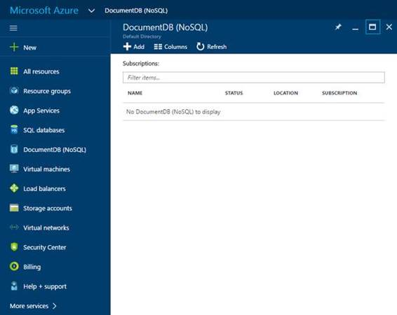

图 3:添加文档数据库帐户的屏幕

这将导致一个屏幕，允许您输入文档数据库帐户的详细信息:标识、NoSQL 应用编程接口、订阅、资源组和位置。您可以选择将托管您的帐户的 Azure 区域。

该标识是微软 Azure 中文档数据库帐户的唯一全局标识符。要完成帐户的创建，请单击`Create`。DocumentDB 帐户创建过程可能需要几分钟时间。

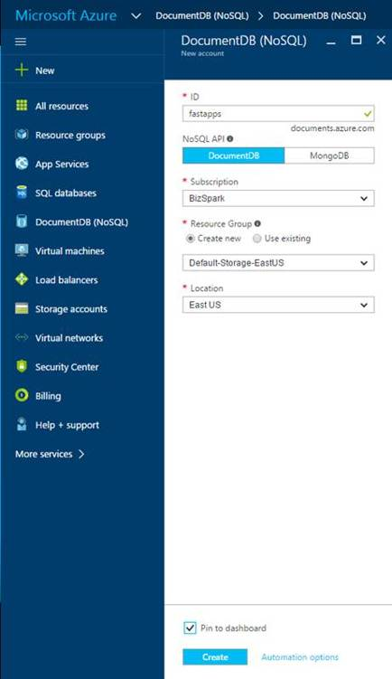

图 4:最终文档数据库帐户创建屏幕

图 5 描述了 DocumentDB 帐户在创建后将如何显示。

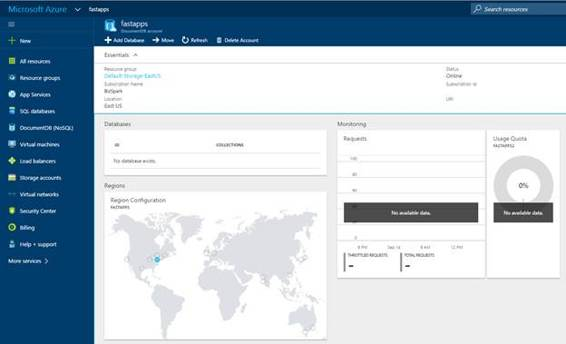

图 5:文档数据库帐户仪表板

一个 DocumentDB 帐户可以托管多个 DocumentDB 数据库，但是简单地拥有一个 DocumentDB 帐户并不意味着您可以随时使用一个 DocumentDB 数据库。但是，这样的数据库可以通过点击`Add Database`来创建。

唯一的要求是为新的文档数据库提供一个标识。


图 6:新的文档数据库创建屏幕

创建文档数据库后，可以通过直观的仪表板进行配置。


图 7:文档数据库仪表板

在 DocumentDB 中，JSON 文档存储在集合下。集合是 JSON 文档和相关的 JavaScript 应用程序逻辑(用户函数、存储过程和触发器)的容器。

图 8 描述了文档数据库的结构。

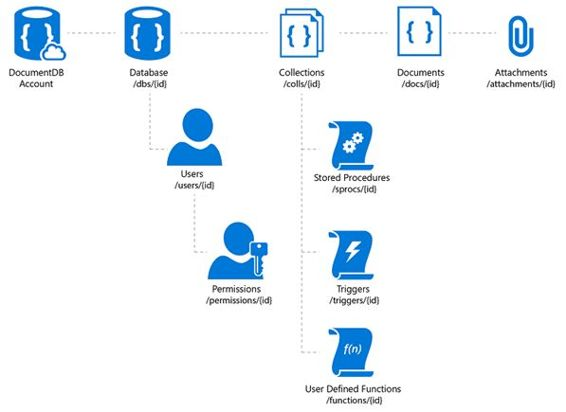

图 8:文档数据库内部结构

收款是一个可计费的实体，其成本由与收款相关的绩效水平决定。性能级别(S1、S2 和 S3)提供 10GB 的存储和固定的吞吐量。

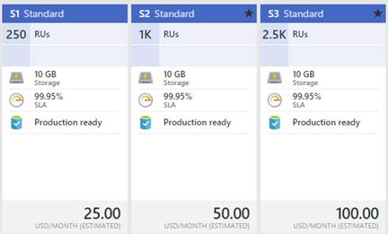

图 9:文档数据库集合的性能级别和定价层

请求单位可以用秒来衡量。例如，在 S1 级别，每秒可以执行 250 个 RUs(应用编程接口调用)。关于 DocumentDB 中性能级别的更多信息，可以在[这里](https://azure.microsoft.com/en-us/documentation/articles/documentdb-performance-levels/)找到。

创建集合时，默认定价层是 S2。但是，对于演示和概念验证(POCs)，S1 层级就足够了。

点击仪表盘上的`Add Collection`可以创建一个集合。您需要指定定价级别(通过选择 S1)和索引策略。索引策略的默认设置实际上是默认设置。如果您想利用全字符串查询，只需在创建集合后在`Scale & Settings`选项中将索引策略从默认更改为哈希即可。打开`Indexing Policy`选项，将`indexingMode`属性从`consistent`更改为`hash`。对于简单可怕的客户关系管理，我们将使用哈希索引策略。

| 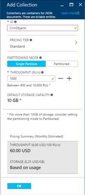 | 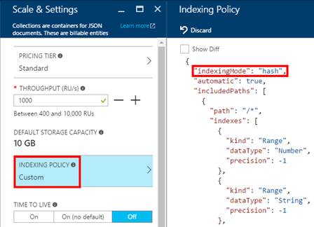 |

图 10:创建文档数据库集合并更改索引策略

现在，文档数据库帐户、数据库和集合已经在微软 Azure 上准备好了，接下来您必须安装。为了开始编码，NuGet 的. NET DocumentDB 客户端库调用了`Microsoft.Azure.DocumentDB`。

首先，启动 Visual Studio 2015 并创建一个 C#控制台应用程序。模板代码加载后，转到`Tools` > `NuGet Package Manager` > `Manage NuGet Packages`，在`Package Source`下拉控件中选择`nuget.org`。在搜索框中，输入`DocumentDB`，将显示软件包，可供安装。

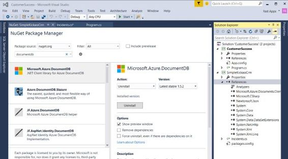

一旦。NET DocumentDB 客户端已经安装，您将在您的 Visual Studio 解决方案中引用`Microsoft.Azure.Documents.Client`和`Newtonsoft.Json`程序集。

随着 DocumentDB 连接就绪，我们可以开始编码了。

根据规定的指导原则，我们的简单卓越的客户关系管理软件应该能够允许用户打开事件、按属性查找事件、更改事件属性、添加注释，并允许服务台工作人员指示为解决事件分配的任何资源。

DocumentDB 支持数值字段的基于范围的索引，允许您进行范围查询(例如，其中字段> 10，字段< 20)。为了避免在对日期进行范围查询时进行昂贵的扫描(例如，早于昨天的记录或上周的记录)，我们需要将日期的字符串表示转换为数字。这将允许我们在这些字段上使用范围索引。

我们将把`DateTime`值视为纪元值(自特定日期以来的秒数)。这节课我们以 1970 年 1 月 1 日 00:00 为起点；但是，您可以自由使用不同的值。

现在让我们研究如何使用 Visual Studio 2015 和实现这一点。NET 4.5.2。

首先，我们将创建一个名为`CrmCore.DateEpoch`的名称空间，负责实现纪元值。这将包括`DateEpoch`和`Extension`课程。

稍后，我们将需要实现一个`CrmCore.Enum`命名空间，其中将定义枚举定义，并且我们将需要创建一个名为`CrmCore.EnumUtils`的实用程序命名空间。

稍后，我们还需要实现一个`CrmCore.Enum`命名空间，其中将定义枚举定义，我们还需要一个名为`CrmCore.EnumUtils`的实用程序命名空间。

代码清单 1:实现纪元

```cs
  using System;

  namespace CrmCore.DateEpoch
  {

  public static class Extensions

  {

  public static int ToEpoch(this DateTime date)

  {

  if (date == null) return int.MinValue;

  DateTime epoch = new DateTime(1970, 1, 1);

  TimeSpan epochTimeSpan = date - epoch;

  return (int)epochTimeSpan.TotalSeconds;

  }

  }

  public class DateEpoch

  {

  public DateTime Date { get; set;
  }

  public int
  Epoch

  {

  get

  {

  return (Date.Equals(null) || 

  Date.Equals(DateTime.MinValue))

  ? DateTime.UtcNow.ToEpoch()

  : Date.ToEpoch();

  }

  }

  public DateEpoch(DateTime dt)

  {

  Date = dt;

  }

  }
  }

```

既然我们已经看到了 DocumentDB 将如何处理日期，我们还需要定义几个`Enum`类型，用于指示事件的状态、严重性、反馈频率和通信类型。

代码清单 2:表示事件状态的枚举

```cs
  using System;

  namespace CrmCore.Enums
  { 

  public enum IncidentSeverity {

  [Description("Urgent")]

  Urgent,

  [Description("High")]

  High,

  [Description("Normal")]

  Normal,

  [Description("Low")]

  Low

  };

  public enum
  IncidentFeedbackFrequency {

  [Description("Hourly")]

  Hourly,

  [Description("Every4Hours")]

  Every4Hours,

  [Description("Every8Hours")]

       Every8Hours,

  [Description("Daily")]

  Daily,

  [Description("Every2Days")]

  Every2Days,

  [Description("Weekly")]

  Weekly,

  [Description("Every2Weeks")]

  Every2Weeks,

  [Description("Monthly")]

  Monthly

  };

  public enum
  IncidentCommunicationType {

  [Description("ReceiveUpdatesOnly")]

  ReceiveUpdatesOnly,

  [Description("Bidirectional")]

  Bidirectional

  };

  public enum
  IncidentStatus {

  [Description("NotReported")]

  NotReported,

  [Description("Reported")]

  Reported,

  [Description("FeedbackRequested")]

  FeedbackRequested,

  [Description("UnderAnalysis")]

  UnderAnalysis,

  [Description("IssueFound")]

  IssueFound,

  [Description("WorkingOnFix")]

  WorkingOnFix,

  [Description("FixDelivered")]

  FixDelivered,

  [Description("FixAccepted")]

  FixAccepted,

  [Description("Solved")]

  Solved,

  [Description("Closed")]

  Closed,

  [Description("Reopen")]

  Reopen

  };
  }

```

随着`IncidentSeverity`、`IncidentFeedbackFrequency`、`IncidentCommunicationType`和`IncidentStatus`的到位，我们有必要的类别来分配使用系统提交的任何事件。

但是，考虑到 DocumentDB 与 JSON 一起工作，需要理解的是，当转换为 JSON 时，一个 C# `enum`将存储为一个整数，这可能会使浏览 DocumentDB 上的文档列表时难以阅读。

因此，为了使任何`Enum`值作为`string`可读，我们必须在将该值存储在 DocumentDB 上之前使用`System.ComponentModel` 和`System.Reflection`。让我们实现一个`EnumUtils`类来处理这个过程。

代码清单 3:枚举类

```cs
  using System;
  using System.ComponentModel;
  using System.Reflection;

  namespace CrmCore.EnumUtils
  { 

  public class EnumUtils

  {

  protected const string cStrExcep = 

  "The string is
  not a description or value of the enum.";

  public static string stringValueOf(Enum value)

  {

  FieldInfo fi =
  value.GetType().GetField(value.ToString());

  DescriptionAttribute[] attributes = (DescriptionAttribute[])

  fi.GetCustomAttributes(typeof(DescriptionAttribute), 

  false);

  return (attributes.Length > 0) ?
  attributes[0].Description : 

  value.ToString();

  }

  public static object enumValueOf(string value, Type
  enumType)

  {

  string[] names = Enum.GetNames(enumType);

  foreach (string name in names)

  {

  if (stringValueOf((Enum)Enum.Parse(enumType, 

  name)).Equals(value))

  {

               return Enum.Parse(enumType, name);

  }

  }

  throw new
  ArgumentException(cStrExcep);

  }

  }
  }

```

`stringValueOf`方法将一个整数`Enum`值转换为其`string`表示，`enumValueOf`取一个`string`值并将其转换为其对应的整数`Enum`值(给定其类型)。

`EnumUtils`是 Simple Awesome CRM 系统中非常方便和重要的一部分，因为它将被用于接下来的许多方法中。

现在，我们已经知道如何在 DocumentDB 中处理日期，并通过使用`Enum`类型对事件进行分类，让我们创建存储事件详细信息的类。

代码清单 4:事件详细信息类

```cs
  using CrmCore.EnumUtils;
  using CrmCore.Enums;
  using CrmCore.DateEpoch;

  using System;
  using System.ComponentModel;
  using System.Reflection;

  namespace CrmCore.IncidentInfo
  { 

  public sealed class AllocatedResource

  {

  private IncidentStatus stage;

  public string Engineer { get; set;
  }

  public string Stage {

  get

  {

  return EnumUtils.stringValueOf(stage);

  }

  set

  {

  stage = (IncidentStatus)EnumUtils.

  enumValueOf(value, typeof(IncidentStatus));

           }

  }

  public DateEpoch Start { get; set;
  }

  public DateEpoch End { get; set;
  }

  }

  public sealed class Comment

  {

  public string Description { get; set; }

  public string UserId { get; set;
  }

  public string AttachmentUrl { get; set; }

  public DateEpoch When { get; set;
  }

  }

  public sealed class IncidentInfo

  {

  private IncidentSeverity severity;

  private IncidentStatus status;

  private IncidentFeedbackFrequency feedbackFrequency;

  private IncidentCommunicationType communicationType;

  public string Description { get; set; }

  public string Severity

  {

  get

  {

  return EnumUtils.stringValueOf(severity);

  }

  set

  {

  severity = (IncidentSeverity)EnumUtils.

  enumValueOf(value, typeof(IncidentSeverity));

  }

  }

  public string Status

  {

  get

         {

  return EnumUtils.stringValueOf(status);

  }

  set

  {

  status = (IncidentStatus)EnumUtils.

  enumValueOf(value, typeof(IncidentStatus));

  }

  }

    public string FeedbackFrequency

  {

  get

  {

  return EnumUtils.stringValueOf(feedbackFrequency);

  }

  set

  {

  feedbackFrequency = (IncidentFeedbackFrequency)EnumUtils.

  enumValueOf(value,typeof(IncidentFeedbackFrequency));

  }

  }

  public string CommunicationType

  {

  get

  {

  return EnumUtils.stringValueOf(communicationType);

       }

  set

  {

  communicationType = (IncidentCommunicationType)EnumUtils.

  enumValueOf(value,typeof(IncidentCommunicationType));

  }

  }

  public AllocatedResource[] Resources { get; set; }

  public Comment[] Comments { get; set; }

  public DateEpoch Opened { get; set;
  }

  public DateEpoch Closed { get; set;
  }

  }
  }

```

每个特定事件的详细信息都作为一个单独的 JSON 文档存储在 DocumentDB 中，在 C#中，它由`IncidentInfo`类表示。`IncidentInfo`类是密封的，这表明它只是一个数据容器。它可能不包含注释或资源(作为对象数组)，也可能包含多个项目。

`Comment`对象表示与特定事件相关的注释的实例。`AllocatedResource`对象表示分配给特定事件的资源实例。

这都是好的，但是我们还不能用`IncidentInfo`或它的相关类做任何有意义的事情，因为到目前为止它们只是数据定义。

为了与文档数据库交互并使用`IncidentInfo` `,`，我们必须创建一个`Incident`类，该类将作为负责向文档数据库发布和检索任何事件数据(`IncidentInfo`)的类。

代码清单 5 包含了`Incident`类的完整代码。接下来，我们将分别检查每种方法。

代码清单 5:事件类实现

```cs
  using Microsoft.Azure.Documents;
  using Microsoft.Azure.Documents.Client;
  using Microsoft.Azure.Documents.Linq;
  using System;
  using System.Collections.Generic;
  using System.ComponentModel;
  using System.Linq;
  using System.Reflection;
  using System.Threading.Tasks;

  using CrmCore.EnumUtils;
  using CrmCore.Enums;
  using CrmCore.DateEpoch;
  using CrmCore.IncidentInfo;

  namespace CrmCore.Incident
  {

  public class Incident : IDisposable

  {

  private bool
  disposed = false;

  private const string docDbUrl = 

  "dbs/SimpleAwesomeCrm/colls/CrmObjects";

  private const string docDbEndpointUrl = 

  "https://fastapps.documents.azure.com:443/";

  private const string docDbAuthorizationKey = "<<DocDb Key>>";

  private const string cStrSeverityProp = "Severity";

  private const string cStrStatusProp = "Status";

  private const string cStrFrequencyProp = "FeedbackFrequency";

  private const string cStrCTProp = "CommunicationType";

  private const string cStrClosedProp = "Closed";

  private const string cStrComments = "Comments";

  private const string cStrResources = "Resources";

  private const string cStrOpened = "Opened";

  public IncidentInfo info = null;

  // Class defined in
  Microsoft.Azure.Documents.Client

       protected DocumentClient client = null;

  ~Incident()

  {

  Dispose(false);

  }

  public Incident()

  {

  info = new IncidentInfo();

  info.Status = 

  EnumUtils.stringValueOf(IncidentStatus.Reported);

  info.Severity = 

  EnumUtils.stringValueOf(IncidentSeverity.Normal);

  info.FeedbackFrequency = 

  EnumUtils.stringValueOf(IncidentFeedbackFrequency.Daily);

  info.CommunicationType = 

  EnumUtils.stringValueOf(IncidentCommunicationType.

  ReceiveUpdatesOnly);

  info.Opened = new DateEpoch(DateTime.UtcNow);

  info.Resources = null;

  info.Comments = null;

  }

   public Incident(IncidentStatus status, IncidentSeverity severity,    

  IncidentFeedbackFrequency freq, 

  IncidentCommunicationType
  comType)

  {

  info = new IncidentInfo();

  info.Status = EnumUtils.stringValueOf(status);

  info.Severity = EnumUtils.stringValueOf(severity);

  info.FeedbackFrequency = EnumUtils.stringValueOf(freq);

  info.CommunicationType = EnumUtils.stringValueOf(comType);

  info.Opened = new DateEpoch(DateTime.UtcNow);

  info.Resources = null;

  info.Comments = null;

  }

  private void
  Connect2DocDb()

  {

  client = new DocumentClient(new Uri(docDbEndpointUrl), 

  docDbAuthorizationKey);

  }

          public IEnumerable<Document> FindById(string id)

  {

  if (client == null)

  Connect2DocDb();

  if (info != null && client != null)

  {

  var cases =

  from c in
  client.CreateDocumentQuery(docDbUrl)

  where c.Id == id

  select c;

  return cases;

  }

  else

  return null;

  }

  public IEnumerable<IncidentInfo> FindByDescription(string 

  description)

  {

  if (client == null)

  Connect2DocDb();

  if (info != null && client != null)

  {

  var cases =

  from c in
  client.CreateDocumentQuery

  <IncidentInfo>(docDbUrl)

  where c.Description.ToUpper().

  Contains(description.ToUpper())

  select c;

  return cases;

  }

  else

      return null;

  }

  public IEnumerable<IncidentInfo> FindByDateOpenedAfter(DateTime 

  opened)

  {

  if (client == null)

  Connect2DocDb();

  if (info != null && client != null)

  {

  var cases =

  from c in
  client.CreateDocumentQuery

  <IncidentInfo>(docDbUrl)

  where c.Opened.Epoch >=
  opened.ToEpoch()

  select c;

  return cases;

         }

  else

  return null;

  }

  public IEnumerable<IncidentInfo> FindByDateOpenedBefore(DateTime 

  opened)

  {

  if (client == null)

  Connect2DocDb();

  if (info != null && client != null)

  {

  var cases =

  from c in
  client.CreateDocumentQuery

  <IncidentInfo>(docDbUrl)

  where c.Opened.Epoch <
  opened.ToEpoch()

  select c;

  return cases;

  }

  else

  return null;

  }

  public IEnumerable<IncidentInfo> FindByDateOpenedBetween(DateTime 

  start, DateTime end)

  {

  if (client == null)

            Connect2DocDb();

  if (info != null && client != null)

  {

  var cases =

  from c in
  client.CreateDocumentQuery

  <IncidentInfo>(docDbUrl)

  where c.Opened.Epoch >=
  start.ToEpoch()

  where c.Opened.Epoch < end.ToEpoch()

  select c;

  return cases;

  }

  else

  return null;

  }

  public IEnumerable<IncidentInfo> FindByStatus(IncidentStatus 

  status)

  {

  if (client == null)

  Connect2DocDb();

  if (info != null && client != null)

  {

  var cases =

  from c in
  client.CreateDocumentQuery

  <IncidentInfo>(docDbUrl)

  where c.Status == status.ToString()

  select c;

  return cases;

  }

  else

  return null;

  }

  public IEnumerable<IncidentInfo> FindBySeverity(IncidentSeverity 

  severity)

  {

  if (client == null)

  Connect2DocDb();

  if (info != null && client != null)

  {

  var cases =

           from c in
  client.CreateDocumentQuery

  <IncidentInfo>(docDbUrl)

  where c.Severity == severity.ToString()

  select c;

  return cases;

  }

  else

     return null;

  }

  public IEnumerable<IncidentInfo> 

  FindByFeedbackFrequency(IncidentFeedbackFrequency ff)

  {

  if (client == null)

  Connect2DocDb();

  if (info != null && client != null)

  {

  var cases =

  from c in
  client.CreateDocumentQuery

  <IncidentInfo>(docDbUrl)

  where c.FeedbackFrequency ==
  ff.ToString()

  select c;

  return cases;

  }

  else

  return null;

  }

  public IEnumerable<IncidentInfo> 

  FindByCommunicationType(IncidentCommunicationType ct)

  {

  if (client == null)

  Connect2DocDb();

  if (info != null && client != null)

  {

  var cases =

  from c in
  client.CreateDocumentQuery

  <IncidentInfo>(docDbUrl)

  where c.CommunicationType == ct.ToString()

  select c;

  return cases;

  }

  else

  return null;

  }

  public async Task<Document> Open(string description, bool check = 

  false)

  {

  if (client == null)

  Connect2DocDb();

  if (info != null && client != null)

  {

  info.Description = description;

  Document id = await client.CreateDocumentAsync

   (docDbUrl, info);

  if (check)

  return 

  (id != null) ?
  client.CreateDocumentQuery(docDbUrl).

  Where(d => d.Id == 

  id.Id).AsEnumerable().FirstOrDefault() :

  null;

  else

  return id;

  }

  else

  return null;

  }

  public async Task<IncidentInfo> AddResource(string id, 

  IncidentStatus stage, string engineer, DateTime
  st, DateTime end)

  {

  if (client == null)

  Connect2DocDb();

  if (info != null && client != null)

  {

  var cases =

  from c in
  client.CreateDocumentQuery(docDbUrl)

  where
  c.Id.ToUpper().Contains(id.ToUpper())

  select c;

  IncidentInfo issue = null;

  Document oDoc = null;

  foreach (var
  cs in cases)

  {

                  var it = await client.ReadDocumentAsync(cs.AltLink);

  oDoc = it;

  issue = (IncidentInfo)(dynamic)it.Resource;

  break;

  }

  if (oDoc != null)

        {

  AllocatedResource rc = new
  AllocatedResource();

  rc.End = new DateEpoch((end != null) ? 

  end.ToUniversalTime() : DateTime.UtcNow);

  rc.Engineer = engineer;

           rc.Stage = EnumUtils.stringValueOf(stage);

  rc.Start = new DateEpoch((st != null) ? 

  st.ToUniversalTime() : DateTime.UtcNow);

  List<AllocatedResource> rRsc = new 

  List<AllocatedResource>();

  if (issue?.Resources?.Length > 0)

  {

  rRsc.AddRange(issue.Resources);

  rRsc.Add(rc);

  oDoc.SetPropertyValue(cStrResources, 

  rRsc.ToArray());

  }

  else

  {

  rRsc.Add(rc);

  oDoc.SetPropertyValue(cStrResources, 

  rRsc.ToArray());

  }

  var updated = await 

  client.ReplaceDocumentAsync(oDoc);

  issue = (IncidentInfo)(dynamic)updated.Resource;

  }

  return issue;

  }

        else

  return null;

  }

  public async Task<IncidentInfo> AddComment(string id, string 

  userId, string comment, string attachUrl)

  {

  if (client == null)

  Connect2DocDb();

     if (info != null && client != null)

  {

  var cases =

  from c in
  client.CreateDocumentQuery(docDbUrl)

  where
  c.Id.ToUpper().Contains(id.ToUpper())

  select c;

     IncidentInfo issue = null;

  Document oDoc = null;

  foreach (var
  cs in cases)

  {

  var it = await client.ReadDocumentAsync(cs.AltLink);

  oDoc = it;

  issue = (IncidentInfo)(dynamic)it.Resource;

  break;

  }

  if (oDoc != null)

  {

  Comment c = new
  Comment();

  c.AttachmentUrl = attachUrl;

    c.Description = comment;

  c.UserId = userId;

  c.When = new DateEpoch(DateTime.UtcNow);

  List<Comment> cMts = new List<Comment>();

  if (issue?.Comments?.Length > 0) {

                cMts.AddRange(issue.Comments);

  cMts.Add(c);

  oDoc.SetPropertyValue(cStrComments, 

  cMts.ToArray());

  }

  else {

      cMts.Add(c);

  oDoc.SetPropertyValue(cStrComments, 

  cMts.ToArray());

  }

  var updated = await 

  client.ReplaceDocumentAsync(oDoc);

    issue = (IncidentInfo)(dynamic)updated.Resource;

  }

  return issue;

  }

  else

  return null;

  }

  public async Task<IncidentInfo> ChangePropertyValue(string id, 

  string propValue, string propName)

  {

  if (client == null)

  Connect2DocDb();

  if (info != null && client != null)

  {

  var cases =

  from c in
  client.CreateDocumentQuery(docDbUrl)

  where
  c.Id.ToUpper().Contains(id.ToUpper())

  select c;

  IncidentInfo issue = null;

  Document oDoc = null;

  foreach (var
  cs in cases)

  {

          var it = await client.ReadDocumentAsync(cs.AltLink);

  oDoc = it;

  issue = (IncidentInfo)(dynamic)it.Resource;

  break;

  }

  if (oDoc != null)

  {

  switch (propName)

  {

  case cStrSeverityProp:

  oDoc.SetPropertyValue(cStrSeverityProp, 

  propValue);

            break;

  case cStrStatusProp:

  oDoc.SetPropertyValue(cStrStatusProp, 

  propValue);

  break;

  case cStrFrequencyProp:

  oDoc.SetPropertyValue(cStrFrequencyProp, 

  propValue);

  break;

  case cStrCTProp:

  oDoc.SetPropertyValue(cStrCTProp, propValue);

  break;

  case cStrClosedProp:

  oDoc.SetPropertyValue(cStrClosedProp, 

  issue.Closed);

  break;

  }

  var updated = await 

  client.ReplaceDocumentAsync(oDoc);

  issue = (IncidentInfo)(dynamic)updated.Resource;

  }

  return issue;

  }

  else

         return null;

  }

  protected virtual void
  Dispose(bool disposing)

  {

  if (!disposed)

  {

  if (disposing)

  client.Dispose();

  }

  disposed = true;

   }

  public void
  Dispose()

  {

  Dispose(true);

  GC.SuppressFinalize(this);

  }

  }
  }

```

为了理解我们的 Simple Awesome CRM 是如何与 DocumentDB 一起工作的，让我们详细了解一下`Incident`类中的每一种方法，并确保我们理解以下每一项的作用。

代码 的重要初始化细节

```cs
  private const string docDbUrl = "dbs/SimpleAwesomeCrm/colls/CrmObjects";

  private const string docDbEndpointUrl = "https://fastapps.documents.azure.com:443/";

  private const string docDbAuthorizationKey = "<<DocDb Key>>";
  protected DocumentClient client = null;

```

`docDbUrl`字符串表示使用 Azure 门户在文档数据库中创建的`CrmObjects`集合的相对网址。该网址的格式如下:

`dbs/<DocumentDB database name>`/cols/<documentdb 集合名称>

在我们的例子中，`SimpleAwesomeCrm`是 DocumentDB 数据库名称，`CrmObjects`是 DocumentDB 集合名称(这是我们的 CRM JSON 文档将被存储的地方)。

`docDbEndpointUrl`字符串表示运行在 Azure 上的 DocumentDB 实例的实际 URL。我们选择了子域“fastapps”，但是您可以使用其他任何东西(只要它对应于您在 Azure 门户上创建 DocumentDB 帐户时定义的内容)。

`docDbAuthorizationKey`字符串是指定的文档数据库实例的 Azure 访问键  y `docDbEndpointUrl`。

`client`对象是的 DocumentDB Azure SDK。NET 实例类，负责与 DocumentDB 的所有通信。

现在我们可以建立一个到文档数据库的连接。

代码清单 7:与文档数据库的连接

```cs
  private void
  Connect2DocDb()
  {

  client = new DocumentClient(new Uri(docDbEndpointUrl), 

  docDbAuthorizationKey);
  }

```

 `DocumentClient`的实例来实现的，该实例将在以后得到适当的处理。

代码 

```cs
  protected virtual void Dispose(bool disposing)
  {

  if (!disposed)

  {

      if (disposing)

      client.Dispose();

  }

  disposed = true;
  }

```

建立连接后，我们现在可以打开一个事件并将其提交给 DocumentDB。我们可以这样做，如代码清单 9 所示。

```cs
  public async Task<Document> Open(string description, bool check = false)
  {

  if (client == null)

      Connect2DocDb();

  if (info != null && client != null)

  {

      info.Description = description;

  Document id = await client.CreateDocumentAsync(docDbUrl, info);

  if (check)

  return (id != null) ? client.CreateDocumentQuery(docDbUrl).

                 Where(d => d.Id == 

  id.Id).AsEnumerable().FirstOrDefault() :

  null;

  else

  return id;

  }

  else

      return null;
  }

```

当`client`(T2】实例)为空时，即当连接尚未建立时，`Open`方法会连接到文档数据库。

一旦建立了连接，就用`docDbUrl`和一个`IncidentInfo`实例调用`CreateDocumentAsync`。要检查文档是否成功提交到文档数据库，`check`参数可以设置为`true`。

然而，为了使其工作，需要创建一个`IncidentInfo`的实例。代码清单 10 展示了我们如何从包装器做到这一点。

代码清单 10:事件包装器。打开

```cs
  using System;
  using Newtonsoft.Json;
  using System.Threading.Tasks;
  using Microsoft.Azure.Documents;
  using System.Linq;
  using System.Collections.Generic;

  using CrmCore.EnumUtils;
  using CrmCore.Enums;
  using CrmCore.DateEpoch;
  using CrmCore.IncidentInfo;
  using
  CrmCore.Incident;

  namespace CrmCore
  {

  public class CrmExample

  {

      private const string cStrCaseCreated = 

  "Case created
  (as JSON) ->";

  private const string cStrTotalResults = "Total results: ";

  private const string cStrDescription = "Description: ";

  private const string cStrStatus = "Status: ";

  private const string cStrSeverity = "Severity: ";

  private const string cStrCommunication = "Communication: ";

  private const string cStrFrequency = "Frequency: ";

  private const string cStrOpened = "Opened: ";

     private const string cStrClosed = "Closed: ";

  private const string cStrDateTimeFormat = 

  "dd-MMM-yyyy
  hh:mm:ss UTC";

  public static async Task<string> OpenCase(string description)

  {

  string id = string.Empty;

  using (Incident inc = new Incident(IncidentStatus.Reported,

  IncidentSeverity.High,

  IncidentFeedbackFrequency.Every4Hours,

  IncidentCommunicationType.Bidirectional))

  {

         var issue = await inc.Open(description);

  if (issue != null)

  {

  var i = JsonConvert.DeserializeObject

  <IncidentInfo>(issue.ToString());

  Console.WriteLine(cStrCaseCreated);

  Console.WriteLine(issue.ToString());

  id = issue.Id;

  }

  }

  return id;

  }

  public static async Task<string> OpenCase(string description, 

    IncidentStatus st, IncidentSeverity sv, 

  IncidentFeedbackFrequency ff, IncidentCommunicationType ct)

  {

  string id = string.Empty;

  using (Incident inc = new Incident(st, sv, ff, ct))

  {

    var issue = await inc.Open(description);

  if (issue != null)

  {

  var i = JsonConvert.DeserializeObject

  <IncidentInfo>(issue.ToString());

  Console.WriteLine(cStrCaseCreated);

  Console.WriteLine(issue.ToString());

  id = issue.Id;

  }

  }

  return id;

  }

  public static void CheckCase(string id)

  {

  using (Incident inc = new Incident())

  {

  IEnumerable<Document> issues = inc.FindById(id);

  foreach (var
  issue in issues)

  OutputCaseDetails(issue);

  }
          }

  private static void OutputCaseDetails(object issue)

  {

  IncidentInfo i = (issue is IncidentInfo) ? 

  (IncidentInfo)issue :

  JsonConvert.DeserializeObject

  <IncidentInfo>(issue.ToString());

  Console.WriteLine(cStrDescription +
  i?.Description);

  Console.WriteLine(cStrStatus + i?.Status);

  Console.WriteLine(cStrSeverity +
  i?.Severity);

  Console.WriteLine(cStrCommunication +
  i?.CommunicationType);

  Console.WriteLine(cStrFrequency +
  i?.FeedbackFrequency);

  Console.WriteLine(cStrOpened + 

  i?.Opened?.Date.ToString(cStrDateTimeFormat));

  Console.WriteLine(cStrClosed + 

  i?.Closed?.Date.ToString(cStrDateTimeFormat));

  }
      }
  }

  using CrmCore;
  using System;
  using System.Threading.Tasks;

  namespace CustomerSuccess
  {

  class Program

  {

  static void
  Main(string[] args)

  {

  Console.Clear();

  OpenFindCase();

  Console.ReadLine();

  }

  public static async void
  OpenFindCase()

  {

  await Task.Run(

  async () =>

  {

  string id = await CrmExample.OpenCase(

  "Export failing", 

  IncidentStatus.Reported,

  IncidentSeverity.High, 

  IncidentFeedbackFrequency.Every8Hours, 

  IncidentCommunicationType.Bidirectional);

  Console.WriteLine(Environment.NewLine);

  CrmExample.CheckCase(id);

  });

  }

  }
  }

```

`OpenFindCase`将调用包装在`CrmExample.OpenCase`周围， `which`创建一个`Incident`实例并调用该实例的`Open`方法。这会返回一个`Document`实例，然后反序列化为一个`IncidentInfo`对象。最后，这个`IncidentInfo`对象通过`OutputCaseDetails`打印在屏幕上。运行这个例子将产生如图 12 所示的结果。


该文档可以在 Azure 上看到，如图 13 所示。

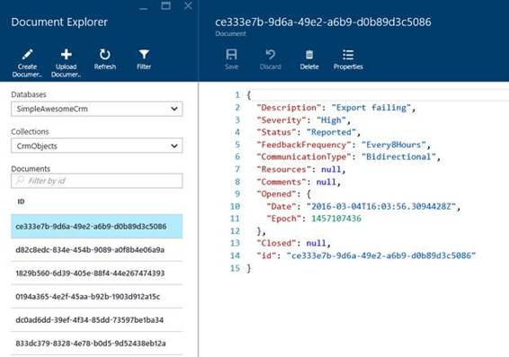

图 Azure 文档浏览器中的事件

当创建的文档没有特定的规范时，DocumentDB 会自动为其分配一个随机的 GUID 在本例中为:ce 333 e7b-9d6a-49e 2-a6b 9-d0b 89 d3c 5086。

现在我们已经能够创建事件，我们将把重点转移到在 Azure 中检索和查找文档。假设我们应该能够使用`IncidentInfo`对象的任何字段来搜索任何特定的标准，我们接下来需要向`Incident`类添加几个`Find`方法。

代码清单 11:查找事件类的方法

```cs
  public IEnumerable<Document> FindById(string id)
  {

  if (client == null) Connect2DocDb();

  if (info != null && client != null)

  {

      var cases =

       from c in client.CreateDocumentQuery(docDbUrl)

  where c.Id == id

      select c;

  return cases;

  }

  else

      return null;
  } 

  public IEnumerable<IncidentInfo> FindByDescription(string description)
  {

  if (client == null) Connect2DocDb();

  if (info != null && client != null)

  {

      var cases =

      from c in
  client.CreateDocumentQuery<IncidentInfo>(docDbUrl)

      where c.Description.ToUpper().

          Contains(description.ToUpper())

      select c;

  return cases;

  }

  else

     return null;
  } 

  public IEnumerable<IncidentInfo> FindByDateOpenedAfter(DateTime opened)
  {

  if (client == null) Connect2DocDb();

  if (info != null && client != null)

  {

      var cases =

  from c in
  client.CreateDocumentQuery<IncidentInfo>(docDbUrl)

  where c.Opened.Epoch >=
  opened.ToEpoch()

  select c;

  return cases;

  }

  else

      return null;
  } 

  public IEnumerable<IncidentInfo> FindByDateOpenedBefore(DateTime opened)
  {

  if (client == null) Connect2DocDb();

  if (info != null && client != null)

  {

      var cases =

      from c in
  client.CreateDocumentQuery<IncidentInfo>(docDbUrl)

   where c.Opened.Epoch <
  opened.ToEpoch()

   select c;

  return cases;

  }

  else

      return null;
  } 

  public IEnumerable<IncidentInfo> FindByDateOpenedBetween(DateTime start,    

  DateTime end)
  {

  if (client == null) Connect2DocDb();

  if (info != null && client != null)

  {

      var cases =

      from c in
  client.CreateDocumentQuery<IncidentInfo>(docDbUrl)

  where c.Opened.Epoch >=
  start.ToEpoch()

  where c.Opened.Epoch < end.ToEpoch()

  select c;

     return cases;

  }

  else

      return null;
  }

  public IEnumerable<IncidentInfo> FindByStatus(IncidentStatus status)
  {

  if (client == null) Connect2DocDb();

  if (info != null && client != null)

  {

      var cases =

      from c in
  client.CreateDocumentQuery<IncidentInfo>(docDbUrl)

  where c.Status == status.ToString()

  select c;

  return cases;

  }

  else

      return null;
  } 

  public IEnumerable<IncidentInfo> FindBySeverity(IncidentSeverity 

  severity)
  {

  if (client == null) Connect2DocDb();

  if (info != null && client != null)

  {

      var cases =

      from c in
  client.CreateDocumentQuery<IncidentInfo>(docDbUrl)

  where c.Severity == severity.ToString()

  select c;

  return cases;

  }

  else

      return null;
  } 

  public IEnumerable<IncidentInfo> FindByFeedbackFrequency

  (IncidentFeedbackFrequency ff)
  {

  if (client == null) Connect2DocDb();

  if (info != null && client != null)

  {

      var cases =

      from c in
  client.CreateDocumentQuery<IncidentInfo>(docDbUrl)

  where c.FeedbackFrequency ==
  ff.ToString()

  select c;

  return cases;

  }

  else

      return null;
  } 

  public IEnumerable<IncidentInfo> FindByCommunicationType

  (IncidentCommunicationType ct)
  {

  if (client == null) Connect2DocDb();

  if (info != null && client != null)

  {

      var cases =

      from c in
  client.CreateDocumentQuery<IncidentInfo>(docDbUrl)

         where c.CommunicationType ==
  ct.ToString()

  select c;

  return cases;

  }

  else

      return null;
  }

```

`Incident`类的所有`Find`方法都是相似的——它们都是从尝试使用`Connect2DocDb`连接到 DocumentDB 开始的，如果存在连接(当`client`不为空时)，则使用特定条件执行 LINQ 查询。在大多数情况下，会返回一个带有 LINQ 查询结果的`IEnumerable<IncidentInfo>`实例。

`IEnumerable`更可取，因为它描述了行为，而`List`是该行为的实现。当你使用`IEnumerable`的时候，你给了编译器一个把工作推迟到以后的机会，允许沿途可能的优化。如果使用`List`，则强制编译器立即检查结果。

无论何时使用 LINQ 表达式，也应该使用`IEnumerable`，因为只有当你指定行为时，你才会给 LINQ 一个延迟评估和优化程序的机会。

假设可能有一个或多个结果，返回的`IEnumerable<IncidentInfo>`对象需要被解析，每个结果都应该被打印出来。为了做到这一点，我们将使用我们的包装器`CrmExample`类。

让我们为`CrmExample`类中的方法`FindByDescription`创建第一个包装器。

代码清单 12:查找描述包装器

```cs
  public static void FindByDescription(string description)
  {

  using (Incident inc = new Incident())

  {

      IEnumerable<IncidentInfo> issues = 

  inc.FindByDescription(description);

  Console.WriteLine("FindByDescription: " + description);

  if (issues.Count() > 0)

  {

      Console.Write(Environment.NewLine);

  foreach (var
  issue in issues)

  {

      OutputCaseDetails(issue);

    Console.Write(Environment.NewLine);

  }

  }

  Console.WriteLine(cStrTotalResults +
  issues.Count().ToString());

  }
  }

```

代码清单 13 描述了如何从主程序调用它。

代码清单 13:查找描述调用

```cs
  CrmExample.FindByDescription("Exception");

```

图 14 和 15 显示了屏幕上和 Azure 中的`FindByDescription`结果。

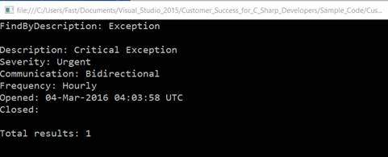

图 14:在屏幕上查找描述结果

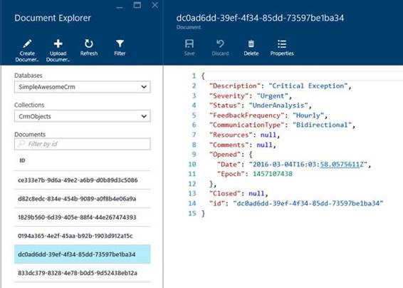

图 15:Azure 中的 FindByDescription 结果

现在我们来考察一下方法`FindByDateOpenedAfter`。这将从文档数据库中检索任何打开时`DateTime`等于或大于用于搜索的参数的文档。

代码清单 14: FindByDateOpenedAfter 包装器

```cs
  public static void FindByDateOpenedAfter(DateTime opened)
  {

  using (Incident inc = new Incident())

  {

      IEnumerable<IncidentInfo> issues = 

  inc.FindByDateOpenedAfter(opened);

  Console.WriteLine("FindByDateOpenedAfter:
  " + 

  opened.ToString(cStrDateTimeFormat));

  if (issues.Count() > 0)

  {

      Console.Write(Environment.NewLine);

  foreach (var
  issue in issues)

  {

      OutputCaseDetails(issue);

  Console.Write(Environment.NewLine);

  }

  }

  Console.WriteLine(cStrTotalResults +
  issues.Count().ToString());

  }
  }

```

代码清单 15 描述了从主程序调用`FindByDateOpenedAfter`。

代码清单 15:调用后查找

```cs
  CrmExample.FindByDateOpenedAfter(new DateTime(2016, 3, 4, 16, 03, 58, DateTimeKind.Utc));

```

该操作产生图 16 和 17 中的结果。

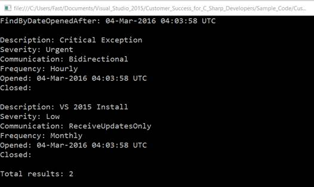

图 16:在屏幕上显示结果后查找


图 17:在 Azure 中找到结果后的查找时间

接下来我们来考察一下方法`FindBySeverity`。这将从文档数据库中检索分配了特定`IncidentSeverity`的任何文档。

代码清单 16:查找比永久包装器

```cs
  public static void FindBySeverity(IncidentSeverity severity)
  {

  using (Incident inc = new Incident())

  {

      IEnumerable<IncidentInfo> issues = inc.FindBySeverity(severity);

  Console.WriteLine("FindBySeverity: " + 

  EnumUtils.stringValueOf(severity));

  if (issues.Count() > 0)

  {

      Console.Write(Environment.NewLine);

  foreach (var
  issue in issues)

  {

      OutputCaseDetails(issue);

  Console.Write(Environment.NewLine);

  }

  }

  Console.WriteLine(cStrTotalResults +
  issues.Count().ToString());

  }
  }

```

代码清单 17 描述了从主程序调用`FindBySeverity`。

代码清单 17:findbyeverity 调用

```cs
  CrmExample.FindBySeverity(IncidentSeverity.Urgent);

```

图 18 显示了结果。

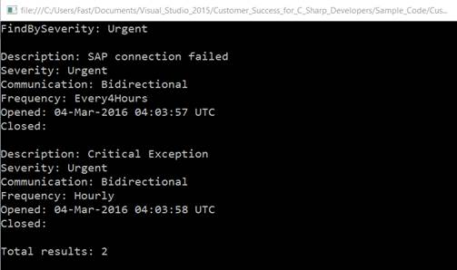

图 18:屏幕上的查找结果

我们已经看到了使用围绕着`CrmExample`的`Incident`类的一些`Find`方法从文档数据库中检索文档是多么容易。请注意，`Find`方法的关键区别在于它们在每个 LINQ 查询中的内部差异。

在这个阶段，我们知道如何打开事件，并在整个`Find`方法中使用不同的 LINQ 搜索查询找到它们。`IncidentInfo`旨在使任何事件的分配评论和资源从无到多不等。

注释和资源都是`Comments`和`AllocatedResource`类的数组。当一个新的事件被打开时，两者都是空的，所以要添加注释和资源，我们必须定义一个方法来添加它们。

一个`Comment`实例将包括一个`Description`、`UserId`(提交评论的人)、`AttachmentUrl`(与评论相关的附件的网址位置)和`When` ( `DateTime`已提交)。

让我们探索如何在`Incident`类中实现一个方法，以便为事件添加注释。

代码清单 18:添加注释实现

```cs
  public async Task<IncidentInfo> AddComment(string id, string userId, 
  string comment, string attachUrl)
  {

  if (client == null) Connect2DocDb();

  if (info != null && client != null)

  {

      var cases =

      from c in
  client.CreateDocumentQuery(docDbUrl)

  where
  c.Id.ToUpper().Contains(id.ToUpper())

  select c;

  IncidentInfo issue = null;

  Document oDoc = null;

  foreach (var
  cs in cases)

  {

      var it = await client.ReadDocumentAsync(cs.AltLink);

  oDoc = it;

  issue = (IncidentInfo)(dynamic)it.Resource;

  break;

  }

  if (oDoc != null)

  {

  Comment c = new
  Comment();

  c.AttachmentUrl = attachUrl;

  c.Description = comment;

  c.UserId = userId;

  c.When = new DateEpoch(DateTime.UtcNow);

  List<Comment> cMts = new List<Comment>();

  if (issue?.Comments?.Length > 0) {

      cMts.AddRange(issue.Comments);

  cMts.Add(c);

  oDoc.SetPropertyValue(cStrComments, cMts.ToArray());

  }

  else {

      cMts.Add(c);

  oDoc.SetPropertyValue(cStrComments, cMts.ToArray());

  }

  var updated = await client.ReplaceDocumentAsync(oDoc);

  issue = (IncidentInfo)(dynamic)updated.Resource;

     }

  return issue;

  }

  else

      return null;
  }

```

`AddComment`首先检查是否有到 DocumentDB 的连接，如果没有，则通过调用`Connect2DocDb`建立连接。

连接到文档数据库后，接下来使用`CreateDocumentQuery`执行 LINQ 查询。这是通过使用我们想要添加注释的事件的标识来完成的。

方法`CreateDocumentQuery`返回一个`IOrderedQueryable<Document>`实例，我们需要循环遍历该实例(即使`IOrderedQueryable<Document>`上的计数可能是 1)，以便执行`ReadDocumentAsync`并检索与被查询的标识对应的特定`Document`实例。

`ReadDocumentAsync`方法需要从 DocumentDB 中读取的文档的`AltLink`(替代 URL 链接)。`AltLink` 是`Document`实例的一个属性，它表示我们想要获取的 DocumentDB 集合中的文档的 URL。

有趣的是:要从调用`ReadDocumentAsync`返回的结果中获取`IncidentInfo`实例，我们必须将结果转换为`issue = (IncidentInfo`)(动态)它。资源；这将被转换成一个`IncidentInfo`实例。

随后，创建一个`Comment`的数组实例，并将其添加到现有的`Document`实例中，该实例表示正在查询的文档数据库文档(事件)。使用属性`SetPropertyValue`通过`Document`对象的实例添加`Comment`的数组实例。

一旦将`Comment`对象添加到`Document`实例中，就调用`ReplaceDocumentAsync`，并将添加了`Comment`的文档写回 DocumentDB 集合(在 Azure 中更新)。代表该更新文档的更新的`IncidentInfo`对象被返回给`AddComment`的调用者。

为了实现`AddComment` `,`，我们需要在`CrmExample`中创建一个包装器。让我们看看这是如何做到的。

代码清单 19:添加注释包装器

```cs
  public static async void
  AddComment(string id, string userId, string 

  comment, string attachUrl)
  {

  using (Incident inc = new Incident())

  {

      await Task.Run(

  async () =>

  {

      IncidentInfo ic = await inc.AddComment(id, userId, comment, 

  attachUrl);

  OutputCaseDetails(ic);

  });

  }
  }

```

代码清单 20 描述了如何从主程序调用它。

代码清单 20:添加注释调用

```cs
  CrmExample.AddComment("4b992d62-4750-47d2-ac4a-dbce2ce85c12", "efreitas", "Request
  for feedback", "https://eu3.salesforce.com/...");

```

结果如图 19 所示。

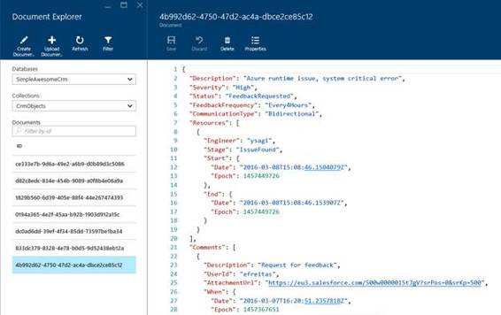

图 19:在 Azure 中添加注释结果

为了给事件增加资源，我们需要采取与`AddComment`方法相同的方法。这意味着我们将在`Incident`类中实现一个`AddResource`方法，并在`CrmExample`中创建一个包装器。

代码清单 21:添加资源实现

```cs
  public async Task<IncidentInfo> AddResource(string id, IncidentStatus stage, string engineer, DateTime
  st, DateTime end)
  {

  if (client == null) Connect2DocDb();

  if (info != null && client != null)

  {

  var cases =

      from c in
  client.CreateDocumentQuery(docDbUrl)

  where
  c.Id.ToUpper().Contains(id.ToUpper())

  select c;

  IncidentInfo issue = null;

  Document oDoc = null;

  foreach (var
  cs in cases)

  {

      var it = await client.ReadDocumentAsync(cs.AltLink);

  oDoc = it;

  issue = (IncidentInfo)(dynamic)it.Resource;

  break;

  }

  if (oDoc != null)

  {

      AllocatedResource rc = new
  AllocatedResource();

  rc.End = new DateEpoch((end != null) ? end.ToUniversalTime() 

  : DateTime.UtcNow);

   rc.Engineer = engineer;

  rc.Stage = EnumUtils.stringValueOf(stage);

  rc.Start = new DateEpoch((st != null) ? st.ToUniversalTime() 

  : DateTime.UtcNow);

  List<AllocatedResource> rRsc = new List<AllocatedResource>();

  if (issue?.Resources?.Length > 0)

  {

       rRsc.AddRange(issue.Resources);

  rRsc.Add(rc);

  oDoc.SetPropertyValue(cStrResources, rRsc.ToArray());

  }

  else

       {

      rRsc.Add(rc);

  oDoc.SetPropertyValue(cStrResources, rRsc.ToArray());

  }

  var updated = await client.ReplaceDocumentAsync(oDoc);

  issue = (IncidentInfo)(dynamic)updated.Resource;

     }

  return issue;

  }

  else

  return null;
  }

```

可以看到`AddResource`的实现和`AddComment`的实现几乎一样。

`AddResource`首先检查是否有到 DocumentDB 的连接，如果没有，则通过调用`Connect2DocDb`建立连接。

连接到文档数据库后，接下来使用`CreateDocumentQuery`执行 LINQ 查询。这是通过使用我们要添加资源的事件的标识来完成的。

方法`CreateDocumentQuery`返回一个`IOrderedQueryable<Document>`集合，我们需要循环通过该集合来执行一个`ReadDocumentAsync`并检索与被查询文档的标识相对应的特定`Document`实例。

`ReadDocumentAsync`方法期望提供`AltLink`。

要从调用`ReadDocumentAsync`的返回结果中获取`IncidentInfo`实例，我们必须将结果转换为`issue = (IncidentInfo`)(动态)它。资源；这将被转换成一个`IncidentInfo`实例。

创建`AllocatedResource`的数组实例，并将其添加到现有的`Document`实例中，该实例表示正在查询的文档数据库文档(事件)。使用`SetPropertyValue`方法通过`Document`的实例添加`AllocatedResource`的数组实例。

一旦`AllocatedResource`属性被添加到`Document`实例中，就调用`ReplaceDocumentAsync`，并且添加了`AllocatedResource`的文档被写回文档数据库集合。代表该更新文档的更新的`IncidentInfo`对象被返回给`AddResource`的调用者。

要做到这一点，`AddResource`需要从`CrmExample`类进行包裹和暴露。

代码清单 22:添加资源包装器

```cs
  public static async void AddResource(string id, IncidentStatus stage, 

  string engineer, DateTime st, DateTime end)
  {

  using (Incident inc = new Incident())

  {

      await Task.Run(

  async () =>

  {

  IncidentInfo ic = await inc.AddResource(id, stage, 

  engineer, st, end);

  OutputCaseDetails(ic);

  });

  }
  }

```

最后，如代码清单 23 所示，可以从主程序中调用`AddResource`。

代码 

```cs
  CrmExample.AddResource("4b992d62-4750-47d2-ac4a-dbce2ce85c12", IncidentStatus.IssueFound, "bob smith", DateTime.Now, DateTime.Now);

```

其输出也可以在图 19 中看到。

虽然知道如何删除注释和分配资源在某些时候可能会有用，但我们不会在这本电子书中实现该功能。

到目前为止，我们已经实现了简单可怕的客户关系管理系统，这样就可以提交和查询事件，以及添加评论和分配资源——所有这些都是为了完成一项工作。

更改现有文档(`IncidentInfo`实例)属性的能力至关重要，因为可能需要更改文档中的`IncidentStatus`、`IncidentSeverity`或任何其他属性。

让我们在`IncidentInfo`类内实现`ChangePropertyValue`方法。

代码清单 24:变更属性值实现

```cs
  public async Task<IncidentInfo> ChangePropertyValue(string id, string 

  propValue, string propName)
  {

  if (client == null) Connect2DocDb();

  if (info != null && client != null)

  {

      var cases =

      from c in
  client.CreateDocumentQuery(docDbUrl)

  where
  c.Id.ToUpper().Contains(id.ToUpper())

  select c;

  IncidentInfo issue = null;

  Document oDoc = null;

  foreach (var
  cs in cases)

  {

      var it = await client.ReadDocumentAsync(cs.AltLink);

  oDoc = it;

  issue = (IncidentInfo)(dynamic)it.Resource;

  break;

  }

  if (oDoc != null)

  {

      switch (propName)

  {

      case cStrSeverityProp:

      oDoc.SetPropertyValue(cStrSeverityProp, propValue);

  break;

  case cStrStatusProp:

      oDoc.SetPropertyValue(cStrStatusProp, propValue);

  break;

  case cStrFrequencyProp:

  oDoc.SetPropertyValue(cStrFrequencyProp, propValue);

  break;

  case cStrCTProp:

      oDoc.SetPropertyValue(cStrCTProp, propValue);

  break;

  case cStrClosedProp:

      oDoc.SetPropertyValue(cStrClosedProp, issue.Closed);

  break;

  }

    var updated = await client.ReplaceDocumentAsync(oDoc);

  issue = (IncidentInfo)(dynamic)updated.Resource;

  }

  return issue;

  }

  else

      return null;
  }

```

就像`AddComment`和`AddResource`一样，`ChangePropertyValue`也遵循同样的逻辑。它试图通过`Connect2DocDb`和调用`CreateDocumentQuery`并查询特定的标识来连接到文档数据库。被查询单据的标识返回`IOrderedQueryable<Document>`。

然后通过调用`ReadDocumentAsync`返回特定的`Document`实例，并使用`SetPropertyValue`更改各自的属性。

接下来，通过调用`ReplaceDocumentAsync`，在 DocumentDB 集合上更新当前的`Document`。

为了做到这一点——为了从主程序中调用它——我们需要将`ChangePropertyValue`包装在`CrmExample`中，如代码清单 25 所示。

代码清单 25:变更属性值包装器

```cs
  public static async void
  ChangePropertyValue(string id, string propValue, 

  string propName)
  {

  using (Incident inc = new Incident())

  {

      await Task.Run(

  async () =>

  {

      IncidentInfo ic = await inc.ChangePropertyValue(id, 

  propValue, propName);

  OutputCaseDetails(ic);

  });

   }
  }

```

如代码清单 26 所示，这可以从主程序中调用。

代码清单 26:变更属性值调用

```cs
  CrmExample.ChangePropertyValue("4b992d62-4750-47d2-ac4a-dbce2ce85c12", EnumUtils.stringValueOf(IncidentStatus.FeedbackRequested), "Status");

```

在这一章中，我们已经看到了如何使用 DocumentDB 和 C#来实现一个简单而有效的客户关系管理应用编程接口，您可以根据自己的需求进行建模。

鉴于其可靠性、稳定性、健壮性和易用性，DocumentDB 是我们的首选。它的应用编程接口很容易理解，只需要很少的文档，并且它非常适合构建一个简单的客户关系管理应用编程接口的概念，这使得我们能够迎合[第 1 章](1.html#_Chapter_1_)中解释的概念。

这里展示的客户关系管理示例代码足以让您入门，并且应该很容易通过添加功能进行扩展。

我们邀请您将自己的想法添加到这个代码库中，并扩展第 1 章中解释的概念——请随意继续改进它。

在接下来的几章中，我们将探索客户服务可以帮助您的业务增长和增加其价值的一些方法。我们还将了解简单的逆向工程如何成为更快解决问题的宝贵资产。