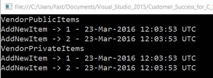
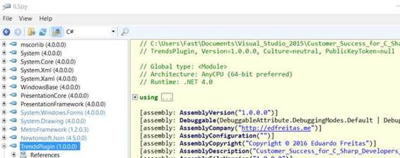

中的[反射](https://en.wikipedia.org/wiki/Reflection_(computer_programming))机制。NET 框架是一个极其强大的特性。然而，大多数开发人员发现他们会问自己什么时候会使用它，为什么要使用它。

乍一看，Reflection 可能看起来很可怕，因为它大部分属于[逆向工程](https://en.wikipedia.org/wiki/Reverse_engineering)的范畴——这是一种经常被编写[反编译程序](https://en.wikipedia.org/wiki/Decompiler)和其他开发工具的人使用的技术。

尽管这种看法是有道理的，但是反射提供了许多非常有用的特性，并且它可以被证明对于现有应用程序的故障排除或编写插件是无价的。

其中一些功能包括发现[组件](https://en.wikipedia.org/wiki/Assembly_(CLI))中的类型，动态加载配置，以及更好地理解如何加载。NET 程序集在内部工作。通过更好地了解这些项目，我们可以更好地排除故障，从而获得更快、更好的客户服务。更快的事件周转和解决是最终目标。

我们还将探索当我们手头没有源代码时，如何使用围绕反射构建的一些工具来检查代码，这对于实现更快的事件解决至关重要。例如，通过检查有问题的动态链接库的代码，我们可以更快地缩小问题在代码中的位置。

本章的目标是探索 Reflection 的实用部分，重点是安全性、灵活性、性能和适当的道德使用，以便您可以将这一极其强大的功能投入使用，并获得更快诊断问题、加快事件解决时间以及让您更好地了解如何为现有应用程序构建插件的好处。

英寸 NET 中，反射包括以编程方式检查. NET 程序集中的元数据和编译代码。为了更好地理解这一点，我们需要分别研究这些概念。

中的程序集。NET 世界是执行、部署和重用的逻辑单元。可以是库( [DLL](https://en.wikipedia.org/wiki/Dynamic-link_library) )也可以是[可执行文件](https://en.wikipedia.org/wiki/Executable) (EXE)。组件内部是一个或多个独立的单元，称为模块。

程序集的主模块包含所谓的程序集[清单](https://en.wikipedia.org/wiki/Manifest_(CLI))，其中包括程序集名称、版本、区域性以及程序集本身的所有模块部分的列表等信息。

模块的元数据包含所有公开类型的完整描述，包括可用的方法、属性、字段、参数、构造函数等。这个元数据的一个重要部分是从源代码编译而来的[通用中间语言](https://en.wikipedia.org/wiki/Common_Intermediate_Language) (CIL)。程序集还可以包含资源，这些资源可以包括用于本地化的图像、文本文件和字符串。

可以从许多角度讨论程序集，但是因为反射使用元数据和 CIL，所以这是我们将关注的。

程序集本质上是自描述的，它们包含。NET 运行时来执行代码。这包含有关正在执行的程序集、该程序集引用的其他程序集、该程序集内的所有类型以及 CIL 代码的信息。

使用名为 [ILSpy](http://ilspy.net/) 的免费工具，我们可以深入任何程序集的细节，探索其元数据，并自动将其源代码从 CIL 反编译为其原始的高级代码。NET 语言。Visual Studio 附带了一个 Spy++程序，但是请注意，ILSpy 与非常相似。NET 反射器来自红门软件，使用简单直观。

CIL 代码是程序集的实际可运行部分。而不是将高级的、人类可以理解的语言如 C#编译成机器代码。NET 采取了一个中间步骤，编译器生成位于人类可读代码和机器代码之间的 CIL 代码。CIL 对其他低级语言有些熟悉。

英寸 NET 中，程序集被编译[及时](https://en.wikipedia.org/wiki/Just-in-time_compilation) (JIT)，这意味着编译实际上是在程序执行期间完成的，而不是在执行之前。本质上，直到应用程序被执行，实际的机器代码才被生成。那个。NET 运行时负责将 CIL 转换成中央处理器能够理解的操作系统指令。这是有利的，因为代码是为运行它的机器编译的(它实际上可以针对特定的机器进行优化)，并且因为只有部分实际运行的代码得到编译。因此，应用程序中未使用的部分将保留在 CIL，直到被执行。

ILSpy 不需要安装。它是一个压缩的档案，包含一个可执行文件和一组未压缩的动态链接库，这意味着它可以用来检查任何。NET 程序集。


图 20:下载并解压后的 ILSpy

借助 ILSpy，让我们快速检查一下我们之前在 Simple Awesome CRM 项目中使用的`Newtonsoft.Json`程序集的元数据。


图 21:使用 ILSpy 看到的程序集元数据属性

基于元数据，反射允许我们动态创建类型、调用方法、获取和设置属性值以及检查属性。`System.Reflection`命名空间提供了所有必要的功能。NET 类和方法来执行所有这些操作。

可以说`System.Reflection`命名空间最重要的特性是`Type`类。这个类有 150 多个成员，包括静态实例成员和属性。`Type`类中最常见的一些方法包括`Get`方法，如`GetType`、`GetMemberInfo`、`GetPropertyInfo`、`GetFieldInfo` `,`等。

`Activator`类是`System.Reflection`命名空间中另一个极其重要的类。`Activator`类有一组静态方法，可以用来创建任何特定类型的实例，比如`CreateInstance`方法。

`Assembly`类可用于从文件或当前程序上下文加载程序集。一旦程序集被加载，我们就可以使用反射来查看哪些类型可用。`Assembly`类包含各种有用的方法，如`Load`、`LoadFrom`、`GetTypes`、`GetName`、`GetFiles`等。

还有一个`ILGenerator`类可以用来创建我们自己的 CIL 代码。虽然知道这个类的存在是有用的，但是这个主题远远超出了本章和电子书的范围。

接下来，我们将重点关注反射的一些方面，这些方面在日常应用程序开发中非常有用，并且有助于故障排除。我们不会特别关注更适合创建高级软件开发或反向工程工具(如混淆)的特性。

反射非常适合日常应用程序开发和故障排除。但是能做什么和应该做什么并不总是一回事。

在引入`dynamic`关键字之前。NET 4.0 中，与 COM 对象上的属性交互的唯一方法是对对象本身进行反射。那么在此之前，反射可以做些什么呢？NET 4.0 中获取一个 COM 对象属性的值应该不再进行了。NET 4.0 及更高版本。

对私有字段(但这通常不是一个好主意)和任何特定的方法执行反射也是可行的。

您还可以基于类型名称获取 CLR 类型(使用`Type`类)，创建类型的实例(使用`Activator`类)，基于文件名加载程序集(使用`Assembly`类，这在设计允许插件的应用程序时通常使用)，获取程序集上公开的类型(使用`Assembly`类)，或者检查`Type`是否实现了`Interface`(使用`Type`类)。

这里需要理解的关键点是，您应该只在真正需要的时候使用反射。让我们探索几个例子，它们显示了使用反射时速度和准确性方面的一些缺点。我们将通过分析如何在有和没有反射的情况下创建`List`来做到这一点。然后我们将比较两者的速度。

代码清单 27:有和没有反射的速度比较

```cs
  using System.Diagnostics;
  using System;
  using System.Collections.Generic;

  namespace ReflectionExamples
  {

  class Program

  {

  static void
  Main(string[] args)

  {

  CreateListNormally();

  CreateListReflection();

  Console.ReadLine();

  }

  public static void CreateListNormally()

  {

  Stopwatch sw = Stopwatch.StartNew();

  for(int
  i = 0; i <= 1000; i++)

  {

  List<string> l = new List<string>(); 

  }

           sw.Stop();

  Console.WriteLine("CreateListNormally ->
  Time taken: {0}ms",

  sw.Elapsed.TotalMilliseconds);

  }

  public static void CreateListReflection()

  {

  Stopwatch sw = Stopwatch.StartNew();

  Type lType = typeof(List<int>);

  for (int
  i = 0; i <= 1000; i++)

  {

  var l = Activator.CreateInstance(lType);

  }

  sw.Stop();

  Console.WriteLine("CreateListReflection ->
  Time taken: 

  {0}ms",
  sw.Elapsed.TotalMilliseconds);

  }

  }
  }

```

这产生了如图 22 所示的输出。


图 22:有和没有反射的速度比较的输出

在本例中，使用反射比使用标准代码花费的时间长 4.298 倍。在运行时使用`CreateInstance`创建所需`Type`的能力是以性能为代价的。

现在让我们来看看反射的另一个大缺点——一致性。

我们不能期望通过执行私有方法和属性得到与公共方法和属性相同的结果。

代码清单 28 显示了我们在应用程序中引用的一个库。让我们假设这是一个我们无法控制的供应商库，但是我们需要它来解决客户提出的特定问题。

供应商只是提供了我们可以在应用程序中引用的程序集。

代码清单 28:供应商库源代码

```cs
  using System;
  using System.Collections.Generic;

  namespace ReflexionVendorSampleAssembly
  {

  public class VendorAssembly

  {

  private const string cStr = "dd-MMM-yyyy hh:mm:ss
  UTC";

  private DateTime dtDate;

  private List<string> pItems;

  public string Info

  {

  get { return dtDate.ToString(cStr); }

  }

  public List<string> Items

  {

  get { return pItems; }

  set { pItems = value; }

  }

  public VendorAssembly()

  {

  pItems = new List<string>();

  AddNewItem();

  }

  public void
  AddNewItem()

  {

  dtDate = DateTime.UtcNow;

  pItems.Add(dtDate.ToString(cStr));

  Console.WriteLine("AddNewItem -> " + 

  pItems.Count.ToString() + " - " + dtDate.ToString(cStr));

  }

  private void
  AddNewItemPriv()

  {

  Console.WriteLine("AddNewItemPriv -> " + 

  pItems.Count.ToString() + " - " + dtDate.ToString(cStr));

  }

  }
  }

```

现在让我们通过标准方式(假设我们有源代码)和使用反射(假设我们没有源代码)来调用这个供应商库。

代码清单 29:调用有反射和没有反射的供应商库

```cs
  using System.Diagnostics;
  using System;
  using System.Collections.Generic;

  using ReflexionVendorSampleAssembly; //If we have the vendor’s code. 
  using System.Reflection;

  namespace ReflectionExamples
  {

  class Program

  {

  static void
  Main(string[] args)

  {

  VendorPublicItems();

     VendorPrivateItems();

  Console.ReadLine();

  }

  public static void VendorPublicItems()

  {

  Console.WriteLine("VendorPublicItems");

  VendorAssembly publicVendor = new VendorAssembly();

  publicVendor.AddNewItem();

  }

  public static void VendorPrivateItems()

  {

  Console.WriteLine("VendorPrivateItems");

  Type vendorType = typeof(VendorAssembly);

  var act = Activator.CreateInstance(vendorType);

  VendorAssembly pv = (VendorAssembly)act;

  MethodInfo dMet = vendorType.GetMethod("AddNewItemPriv", 

  BindingFlags.NonPublic | BindingFlags.Instance);

  dMet.Invoke(pv, null);

  }

  }
  }

```

使用`VendorPublicItems`方法，我们假设我们有供应商的库源代码，这意味着我们可以像往常一样创建一个`VendorAssembly`类的实例，然后调用`AddNewItem`方法。

对于`VendorPrivateItems`方法，我们假设我们没有供应商的库源代码，这意味着我们必须使用反射来调用`AddNewItemPriv`方法。在这个特定的例子中，我们将在供应商的程序集中显式地调用一个私有方法，以表明尽管这在技术上是可能的，但不一定是一个好的实践。

这个例子的代码执行产生了如图 23 所示的输出。


图 23:供应商库的输出

让我们仔细检查一下。

运行`VendorPublicItems`时，我们看到`AddNewItem`被构造函数调用，并在`VendorAssembly`的实例创建后立即被调用。这导致在`VendorAssembly.Items`列表中有两个项目。

但是当调用`VendorPrivateItems`时，`VendorAssembly.Items`列表中只增加了一个单品。

出现这种情况是因为在调用`CreateInstance`之后，`GetMethod`是引用`AddNewItemPriv`执行的，实际上并没有给`VendorAssembly.Items`列表添加任何元素。相反，它只是显示已经存在的项目。

即使反射允许我们在程序集中执行私有方法，我们也应该避免遵循这种做法。通常，私有方法和属性不会执行与公共方法和属性相同的逻辑。它们被标记为私有是有充分理由的。

通过反射执行私有方法或属性(对于可能没有源代码的程序集)，我们无法确保预期结果与执行公共对应方法或属性时得到的结果相同。

为了说明这一点，我们在供应商的代码中清楚地表明`AddNewItem`和`AddNewItemPriv`之间的逻辑是不同的。

在现实场景中，您可能手头没有供应商的库源代码，因此根据经验，在使用反射时，请确保调用公共方法和属性。这将保证您获得与手头有源代码时相同的结果，并正常实例化该类(不使用反射)。

让我们将`VendorPrivateItems`方法改为调用公共`AddNewItem`方法。

代码清单 30: VendorPrivateItems 调整为调用 AddNewItem 方法

```cs
  using System.Diagnostics;
  using System;
  using System.Collections.Generic;

  using ReflexionVendorSampleAssembly; //If we have the vendor’s code. 
  using System.Reflection;

  namespace ReflectionExamples
  {

  class Program

  {

  static void
  Main(string[] args)

  {

       VendorPublicItems();

  VendorPrivateItems();

  Console.ReadLine();

  }

  public static void VendorPublicItems()

  {

  Console.WriteLine("VendorPublicItems");

  VendorAssembly publicVendor = new VendorAssembly();

  publicVendor.AddNewItem();

  }

  public static void VendorPrivateItems()

  {

  Console.WriteLine("VendorPrivateItems");

  Type vendorType = typeof(VendorAssembly);

  var act = Activator.CreateInstance(vendorType);

  VendorAssembly pv = (VendorAssembly)act;

  MethodInfo dMet = vendorType.GetMethod("AddNewItem", 

  BindingFlags.Public | BindingFlags.Instance);

      dMet.Invoke(pv, null);

  }

  }
  }

```

请注意，两种方法`VendorPrivateItems`(使用反射)和`VendorPublicItems`(不使用反射)产生完全相同的结果。



图 24:调整后供应商库的输出

唯一采取的行动是将`GetMethod`检索的方法名称从`AddNewItemPriv`更改为`AddNewItem`，并将`BindingFlags.NonPublic`更改为`BindingFlags.Public`。

在前面的例子中，我们的结果不一致的主要原因是我们违反了封装的原则。

类是黑盒，它向外部世界公开了明确定义的输入(公共方法和属性)。它们还具有通过属性或方法返回值公开的明确定义的输出。

只要我们坚持封装的基本规则，并使用与我们交互的类的公开输入和输出，我们就没事。然而，如果我们试图挖掘盒子内部，我们可能会遇到意想不到的行为，这正是在前面的演示中发生的情况。

我们不应该偷看盒子里面。相反，我们应该使用公开的接口、公共方法和属性。在反射中，这意味着我们不应该与任何类的任何非公共成员进行交互。

我们还看到，当我们使用反射时，我们的速度会降低。这可以通过编程为抽象类型而不是具体类型来缓解，或者换句话说，通过编写代码以接口为目标而不是使用特定的类来缓解。

当您的代码通过反射而不是动态创建的类型使用接口时，性能将会提高。

这里有一个使用反射时应该考虑的策略——如果您想要在运行时选择功能的灵活性，您应该只动态加载程序集一次(在应用程序启动时)。再次—确保该程序集仅加载一次。在启动时从这些程序集中动态加载任何类型也很重要。

最重要的是，一旦有了动态加载的类型，就应该将其转换为应用程序已经知道的接口。这样做将确保您的应用程序将通过接口进行所有方法调用(不使用`MethodInfo.Invoke`，这将有助于减少使用反射时的性能冲击。

因为接口只有公共成员，所以您将避免与类的任何私有成员进行交互，也避免遇到由于破坏封装而导致的意外行为。

表 7 总结了建议的反射策略。

表 7:建议的反思策略

| `Strategic Item` | `Remark` |
| 动态加载程序集 | 在应用程序启动期间 |
| 动态加载类型 | 在应用程序启动期间 |
| 将类型转换为已知接口 | 所有方法调用都通过接口 |
| 没有使用 MethodInfo。引起 |
| 坚持封装 | 不要与私人成员互动 |

遵循这个策略将把反射的使用限制在您特别需要的地方。您还将最大限度地提高性能和准确性，同时保持灵活性。

这对于 web (ASP)都是有效的。NET、MVC 和 WebForms)、控制台和用 C#编写的桌面(Windows 窗体和 WPF)应用程序。但是，由于 Windows Store 应用程序是沙箱化的，反射功能受到限制。

不允许访问非公共方法或类型(这是一件好事)，也没有从文件系统动态加载可用的程序集。这是因为窗口存储应用程序需要的所有程序集都必须作为包提交给窗口存储。

了解了反射可以做什么之后，让我们按照我们概述的策略来研究如何在我们的应用程序中利用它。

假设我们正在使用一个浏览特定工作网站的应用程序来获取市场技能趋势的数据。我们实际上不会构建从网站收集数据的具体逻辑，但我们将展示如何按照建议策略中概述的原则创建可插拔架构。

为了实现这一点，必须创建一个抽象层，它应该由遵循公共接口的可插拔代理组成。每个可插入代理将从不同的工作网站收集信息，但是所有的插件将共享相同的公共抽象以便插入主系统。

首先，让我们创建界面。我们将保持简单，只使用所有插件都应该实现的方法`NavigateToSite`。

代码清单 31:插件接口

```cs
  namespace TrendsAgent
  {

  public interface IPluginInterface

  {

  string[] NavigateToSite(string url);

  }
  }

```

该方法将由所有可插拔代理实现，它将简单地接收网站的网址作为参数，并返回一个字符串数组，其中包含检索到的网页的所有 HTML 行。

定义了这个接口后，我们将使用`Type`类中的`GetType(string typeName)`，其中`typeName`是程序集限定的类型名，来正确实现我们的反射策略。

一旦我们有了`Type`对象，我们就可以使用`Activator`类的`CreateInstance(Type type)`方法来创建一个通过`GetType(string typeName)`获得的`Type`的实例。

程序集限定的类型名包含五个部分:

*   完全限定的类型名称(命名空间和类型)。
*   程序集名称。
*   装配版本。
*   汇编文化。
*   程序集公共(对于强名称程序集)。

事实上。NET 允许我们指定程序集版本和区域性，这很好，因为这允许我们在运行时使用不同版本的程序集或特定于某个区域设置的版本(当需要本地化时很好)。

将反射的使用限制在加载和创建可插拔代理将有助于提高性能，但是我们不会使用反射来动态调用成员。相反，我们将获取创建的实例，并使用`IPluginInterface`与之交互。通过与接口的交互，我们将能够直接调用`NavigateToSite`方法。

为了完全分离关注点(因此我们可以使用反射从主应用程序加载可插拔代理的程序集)，代理的代码应该在单独的 Visual Studio 项目中定义，而不是在用于`IPluginInterface`的项目中定义。

包含`IPluginInterface`的 Visual Studio 项目是将加载可插拔代理的宿主应用程序。

让我们跳到一些代码中，看看如何实现可插拔代理。

代码清单 32:可插拔代理

```cs
  using System.Net;
  using TrendsAgent;

  namespace TrendsPlugin
  {

  public class PluginDemo : IPluginInterface

  {

  public string[] NavigateToSite(string url)

  {

  string[] p = null;

  using (var
  client = new WebClient())

  {

  client.Headers["User-Agent"] =

  "Mozilla/4.0
  (Compatible; Windows NT 5.1; MSIE 6.0) " 

  +

  "(compatible;
  MSIE 6.0; Windows NT 5.1; " +

  ".NET CLR
  1.1.4322; .NET CLR 2.0.50727)";

  using (var
  stream = client.OpenRead(url))

  {

  string value = client.DownloadString(url);

  p = value.Split('\r');

  }

  }

  return p;

  }

  }
  }

```

这里可以看到`TrendsPlugin`的`PluginDemo`类是如何从宿主程序中实现`IPluginInterface`的。

在这个`PluginDemo`类中，`NavigateToSite`获取给定 URL 的 HTML 内容，并将其作为字符串数组返回。

现在让我们使用主程序的有限反射来检查可插拔代理`PluginDemo`是如何被调用的。

代码清单 33:使用反射从主方法调用可插拔代理

```cs
  using System;

  namespace TrendsAgent
  {

  class Program

  {

  static void
  Main(string[] args)

  {

  LoadRunPlugin();

  Console.ReadLine();

  }

  public static void LoadRunPlugin()

  {

  string pluginName = "TrendsPlugin.PluginDemo,
  TrendsPlugin, 

  Version=1.0.0.0, Culture=neutral, PublicKeyToken=null";

  Type pluginType = Type.GetType(pluginName);

  object pluginInstance = Activator.CreateInstance(pluginType);

  IPluginInterface plugin = pluginInstance as IPluginInterface;

  string[] l = plugin.NavigateToSite("http://google.com");

  Console.WriteLine("Lines fetched: " + l.Length.ToString());

  }

  }
  }

```

让我们用程序集限定的类型名`TrendsPlugin.PluginDemo, TrendsPlugin, Version=1.0.0.0, Culture=neutral, PublicKeyToken=null`来仔细看看。

我们能够将程序集的类型加载到主程序中(使用`LoadRunPlugin`方法)。然而，要实现这一点，TrendsPlugin.dll(包含`PluginDemo`类)必须在执行主程序的同一个文件夹中。

获取程序集限定类型名的一个简单方法是在 ILSpy 中打开 TrendsPlugin.dll。这在 ILSpy 屏幕的绿色顶部清晰可见。



图 25:使用 ILSpy 获取程序集限定的类型名

有了`pluginType`，接下来我们使用`Activator.CreateInstance`创建它的一个实例。这将返回一个`object`可以被转换成`IPluginInterface`实例，在这个实例上`NavigateToSite`可以被调用。

通过这样做，我们能够使用反射的最少特性，坚持正确的策略，并遵循封装规则来加载和执行可插拔代理。

我们已经看到了如何使用反射来检查程序集，以及如何使用它来调用我们可能没有源代码的类的成员。

本质上，在这本电子书中使用 Reflection 的目的是简单地说明这项技术的强大功能，以及它如何使我们在排除故障时更有效率，尤其是在与第三方库打交道时。

反射确实被广泛使用，尤其是用于开发工具的创建(ILSpy 就是这种工具的一个很好的例子)。

所以。NET 代码真的安全吗？

坦率地说，它与其他编译语言没有太大区别。如果有人可以访问编译后的文件，这可以使用反射或市场上可用的任何工具来逆转，包括。NET 反射器，dotPeek，ILDASM，just 反编译，Moq，Unity 和 ILSpy。

对于 Java 应用程序和本机 Win32/64 可执行文件的反汇编器，还有许多其他类似的工具。例如:对于 Java 是 Procyon、Krakatau 和 CFT，对于 Win32/64 可执行文件是 Boomerang、ExeToC 和 IDA。

如果文件在用户的机器上，它们可以被反转和检查。然而，这并不意味着我们没有希望。有几件事可以做，以尽量减少风险。

让我们探索一些可以做到这一点的方法。

限制客户端机器上实际运行的内容和在服务器上保留专有代码(这给我们带来了竞争优势)是将风险降至最低的两种方法。

表 8:客户端与服务器执行

| `Client Machine` | `Server` |
| 非机密代码在这里运行 | 专有代码在这里运行 |
| 呼叫服务器获取机密 | 向客户端返回结果 |

当客户机向服务器请求它需要的信息时，应该在服务器的代码中内置一些验证过程，以验证请求是否来自有效的客户机。

一旦验证完成，服务器会将结果返回给客户端。这些应该被加密并返回。这种非常常见的架构被称为[面向服务的架构](https://en.wikipedia.org/wiki/Service-oriented_architecture) (SOA)，你可能听说过。

运行服务器服务是组件思维不可或缺的一部分，很明显，分布式架构是实现面向服务架构的早期尝试。

大多数时候，网络服务被误认为是与 SOA 相同的东西，但是网络服务是更广泛的 SOA 的一部分。

Web 服务为我们提供了某些体系结构特征和好处——特别是平台独立性、松散耦合、自我描述和发现——并且由于接口的形式化，它们可以实现提供者和消费者之间的正式分离。

服务是重要的概念。Web 服务是一组协议，通过这些协议，可以以技术中立和标准的方式发布、发现和使用服务。

网络服务不一定是 SOA 的强制组成部分，尽管它们已经变得越来越重要。SOA 的范围比简单地定义服务实现要广得多。它从提供者(服务器)和消费者(客户端应用程序)的角度解决服务质量问题。

表 9: SOA 与网络服务的对比

| `SOA` | `Web Services` |
| 服务是从实现中抽象出来的 | 服务是可消费和可发现的 |
| 发布的服务接口 | 服务本身的使用—不从服务器复制到客户端 |
| 消费者和供应商之间的合同 | 独立于端点和平台 |

一个良好的服务为我们提供了一个与业务使用相关的管理单元。

客户机向服务器请求它需要的东西，为我们了解服务的生命周期成本以及生命周期在业务中的使用方式提供了基础。

有了这些信息，我们可以设计更好的应用程序，并且可以设计得更符合企业的现实和期望。

当使用像 ILSpy 这样的工具打开一个程序集时，包含在该程序集内的任何字符串都很容易显示出来。

密码和敏感字符串都不应该硬编码。您可以通过使用链接到用户身份验证的密码来避免这种情况。然而，这并不总是可能的或实际的。

另一种选择是让客户端应用程序从服务器请求应用程序令牌，或者让它在服务器上运行需要密码的代码。

在绝对最坏的情况下，密码或令牌需要存储在客户端应用程序中，它必须被混淆到在反编译代码时无法暴露的程度。

混淆是一种降低 CIL 代码可读性的方法。我们不能阻止反思；但是，我们可以将私有变量、字段、属性、参数、方法和常量重命名为无意义的名称，这将使代码在反编译时更难阅读。

代码仍在继续工作，但人类将更难理解。当混淆发生时，反射可能不再适用于私有成员(反编译程序无法跟踪代码)。但是，公共成员名称通常保持不变。

在某种程度上，混淆类似于 JavaScript 缩小。主要区别在于，迷你化的目的是为了更快地将 JavaScript 库下载到浏览器中。缩小通过删除 JavaScript 代码中所有不必要的字符来减少下载负载。

还有一些高级混淆器更进一步，试图阻止任何反汇编。这通常是通过在将私有变量、字段、属性、参数、方法和常量重命名为无义名称时使用不可打印的字符(这仍然是有效的 CIL)来实现的。

请记住，这最终是混淆器和反编译程序之间正在进行的战斗。一个进化，另一个也进化。

一些著名的混淆器包括 Dotfuscator(Visual Studio 附带的一个功能相当有限的免费版本)和两个商业产品——Eazfuscator 和深海混淆器。还有很多。

混淆是一个非常广泛的话题，我们不会在这本电子书中涉及，但回顾和理解它肯定是值得的。

在本章中，我们探讨了反射如何帮助我们理解我们可能无法访问的代码。

有时，当试图复制生产问题或试图分析软件问题时，我们可能会面临理解应用程序使用的第三方库的挑战。这是反思可以帮助我们的地方。

在这本电子书中，我们颠覆了软件公司服务台的概念。我们还制定了提高客户忠诚度和认知度的指导方针。

以下是客户忠诚度如此重要的关键原因:

`Incrementing Referrals`:客户生命周期变得更加复杂，因为客户甚至在直接接触您的产品和品牌之前就开始了他们的购买之旅。

因此，客户关系管理应该从第一次接触开始。这就是为什么在你的产品中嵌入一个简单的令人敬畏的客户关系管理工具作为一种策略是非常宝贵的。

`Reduced Costs`:通过培养客户忠诚度，你的企业可以打造一个强大的福音传播者军团，他们比你最好的营销努力更出彩。这些传播者可以帮助您的公司节省巨大的广告和营销成本，因为口碑是一种强大且经济高效的营销工具。

此外，留住客户的努力比获得新客户更便宜。建立忠诚度形成了一个坚实的客户基础，有助于您的业务增长，甚至可能呈指数级增长。

`Repeat Business`:因为您的组织可能已经通过应用这些技术赢得了忠实客户的信任，所以与新客户相比，向这些客户交叉销售和追加销售更容易。

如果你与忠诚的客户保持开放的沟通渠道，他们通常会提供诚实的反馈来帮助提升你的品牌。因为他们会公开发表意见，你的团队可以齐心协力迅速解决提出的问题，这将提高客户满意度。

忠诚的客户很可能保证重复经营，这对你公司的长期生存至关重要。

`Insulation from Competitors`:忠诚的客户会坚守你的品牌，因为他们信任你。

如果你的组织有一个忠实的客户群，你应该对竞争和经济变化都相当免疫。这有助于保护你的底线。

客户忠诚度可以增强你的产品和品牌形象，并建立资产。一个真正正面的声誉可以帮助你的企业发展到更高的高度。你的团队应该专注于更好地对待客户，奖励他们的忠诚。毕竟，客户是你的企业能够拥有的最大资产。

本电子书中的代码示例是使用 Visual Studio 2015 和创建的。NET 4.5.2，可以在这里找到:

[https://bitbucket . org/syncfusiontech/customer-success-for-c-developers-简洁地](https://bitbucket.org/syncfusiontech/customer-success-for-c-developers-succinctly)

我希望这本书能激励你开始一段旅程，取得更大的客户成功。

谢谢你。