# 第一部分：Direct2D

Direct2D 是一个图形应用编程接口(Application Programming Interface)，旨在渲染二维矢量和光栅图形。它建立在 Direct3D 应用编程接口之上，而 Direct3D 应用编程接口又建立在 DXGI (DirectX 图形基础设施)之上。它可以与 Direct3D 结合使用，渲染场景的任何二维部分。它具有高性能，利用图形处理器实现高效、复杂的二维图形。

|  | 注:在这本书里，我会多次提到图形处理器(图形处理单元的简称)。GPU 这个术语通常指的是一个专用的图形卡，然而，我将更一般地使用这个术语来指在计算机中执行大多数图形处理的硬件。这包括专用显卡、板载显卡或 WinRT 设备中 NVidia Tegra 芯片中的执行单元。 |

该应用编程接口由许多接口(组件对象)组成，用于与图形硬件通信。它可以渲染矢量图元，如直线和椭圆，还可以用纯色或渐变填充形状，以及显示光栅图像。光栅图形由像素组成，屏幕(或图像)上的每个点对应一个像素。每个像素都有决定其颜色的值，它们共同排列在一个大网格中。

Direct2D 对于可视化数据很重要，因为许多图表类型(折线图、散点图等)都是如此。)在设计上基本上是二维的。使用 Direct2D 和使用 Direct3D 渲染二维图形最重要的区别是简单。Direct3D 比 Direct2D 快几个数量级，但编程更复杂。除此之外，Direct2D 项目模板是标准 Windows 8 XAML 和 Direct2D 的完美结合。这允许程序员使用标准的 Windows 8 控件和 XAML 页面来处理用户输入，而 Direct2D 处理所有的图形处理。DirectX 和 XAML 的这种结合是仅在 Windows 8 应用程序中可用的功能。

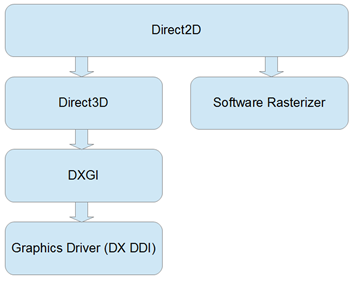

图 1:主要 DirectX 组件之间的关系

图形驱动程序是描述的最低级别；它直接控制硬件。这上面是 DirectX 图形基础设施(DXGI)，然后是 Direct3D，最后是 Direct2D。软件光栅化器用于代替图形硬件，当专用图形处理器不可用时，它使用中央处理器来渲染图形。

## 第 1 章:Direct2D (XAML)模板

我们将首先创建一个标准的 Direct2D (XAML)模板项目，并熟悉其结构。打开 Visual Studio 2012，在**文件菜单**上，点击**新建项目**。

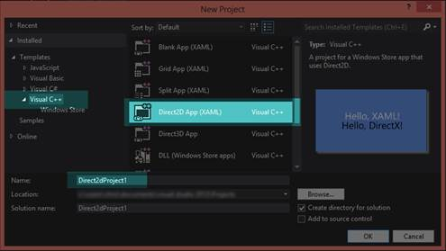

图 2:创建新的 Direct2D 应用程序(XAML)

点击左侧面板的 **Visual C++** ，然后从中间面板的项目模板中选择 **Direct2D App (XAML)** 。在**名称**框中输入项目名称，然后点击**确定**。

Visual Studio 将为新项目创建许多文件，其中包含样板代码和一些其他有用的帮助方法。解决方案资源管理器应该如图 3 所示。

要在调试模式下运行应用程序，请按 F5，或在**文件**菜单上单击**调试** > **开始调试**。在 Visual Studio 生成并链接您的项目文件后，它将执行应用程序。

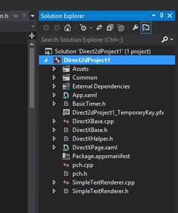

图 3: Direct2D 应用程序(XAML)解决方案资源管理器


图 Direct2D 应用程序(XAML)模板的输出

资产文件夹

该文件夹包含新应用程序的多个巴布亚新几内亚图像:

*   Logo.png:此图像显示为 Windows 8 起始页上的图块。它类似于以前版本的 Windows 中的桌面图标。
*   SmallLogo.png:这是应该显示较小图标时使用的图标图像，例如当用户在 Windows 8 中搜索“所有应用程序”时。
*   SplashScreen.png:在执行应用程序时，闪屏会短暂出现。
*   这是你的应用出现在视窗商店的标志。

普通的

该文件夹包含一个 XAML 文件，描述了 XAML 文件之间的常见设置。

外部依赖关系:

此文件夹包含项目可能依赖的大量外部文件。有些是按项目生成的，有些是标准的 Windows C++头文件。您不应该更改此列表中的文件，尤其是标准的窗口标题。

应用

App.xaml、App.cpp 和 App.h 文件定义了您的应用程序。XAML 文件包含整个应用程序的一些全局设置。CPP 和 H 文件定义了一个类，该类具有执行程序的起始点。这个类拥有一个名为 m_directXPage 的成员变量，它是主要的 Direct2D 渲染类。它还控制一些重要的系统级操作，如在程序暂停时保存和恢复应用程序的状态。

巴斯蒂米尔

基本定时器头定义了一个类，可以用于任何基于时间的任务，如物理或动画。

xxx_TemporaryKey.pfx

这是您的应用程序的 ClickOnce 数字证书。它用于帮助确保应用程序不是恶意软件。如果应用程序没有签名，Windows 将警告用户该应用程序“来自未知的发行商”，并询问他们是否确定要运行该程序。

DirectXBase

DirectXBase 类定义在两个文件中:DirectXBase.h 和 DirectXBase.cpp。这个类包含了启动和运行 Direct2D 的大部分样板代码。它包含初始化设备、工厂、设备上下文和许多其他东西的代码。它可以用于二维和三维图形。它有许多助手功能，使我们能够快速开始 DirectX 编程，而无需键入极其冗长的样板代码。我们鼓励读者彻底调查这个文件，因为它确切地显示了 DirectX 应该如何初始化。

DirectXHelper

这个文件由一个函数组成，DX::ThrowIfFailed。这是一个将 HRESULT 转换为托管 C++异常的助手函数。DirectX 函数调用返回一个 HRESULT。我们将检查的许多代码都围绕着对这个方法的调用来调用 DirectX 函数，这样程序员就有机会检查 DirectX 抛出的任何错误。如果您在这一行设置了断点，Visual Studio 将在抛出异常时中断，并允许您检查出了什么问题。错误会给你一个错误号，你可以研究它的含义，或者使用 DirectX SDK 附带的错误搜索应用程序来查找它。

DirectXPage

这是你申请的 XAML 主页。Direct2D (XAML)模板应用程序包含一个简单的页面，其中两个句子写在 XAML 表单上。上面一句是用 XAML 写的，下面一句是用 DirectX 写的。这是呈现最上面一行代码的类。

Package.appxmanifest

这是您的应用程序的主要清单。它包含关于您的应用程序的所有信息，包括发行者是谁，以及应用程序需要什么功能(互联网访问、网络摄像头访问等)。).

预编译头文件

预编译头文件(pch.h)包含编译成中间格式的头文件，以便在重新编译整个项目时节省时间。为了正确工作，您添加到项目中的大多数类都将包含此文件。

简单文本渲染器

这是这个 DirectX 应用程序的核心类。这个类在屏幕上呈现下面的句子。因为 SimpleTextRenderer 类是控制 DirectX 在屏幕上显示什么的主要类，所以我们将详细研究它。

### 简单文本渲染器类

这个类使用 Direct2D 向屏幕呈现一行文本。在这一节中，我们要研究的不是类本身，而是它的运行方式。我们将在未来章节中构建的图形渲染器类将主要基于这个类。打开 SimpleTextRenderer.h 文件。

该类从 DirectXBase 类派生。它包含一个默认构造函数和几个方法，在资源分配过程中调用(`CreateDeviceIndependentResources`、`CreateDeviceResources`和`CreateWindowSizeDependentResources`)。

|  | 注意:Resources 是一个通用术语，指的是存储在内存(系统内存或图形处理器的专用内存)中并由 DirectX 使用的许多不同类型的对象和结构。资源在使用之前必须被创建和初始化。我们将研究的大多数资源都是在主 DirectX 对象之后不久创建的。当应用程序关闭时，这些资源会被销毁。资源可以在初始化主 DirectX 对象后的任何时候创建和销毁，因为资源创建方法属于这些对象。 |

渲染方法是 DirectX 进行所有渲染的地方。此类还定义了一个更新方法，可用于执行计算，以确定对象应该移动到场景中的什么位置。`UpdateTextPosition`、`BackgroundNextColor`、`BackgroundPreviousColor`功能是这个模板特有的，自己开发的时候不需要。它们允许用户操纵 DirectX 绘制的文本的位置，以及在一些预定义的背景颜色之间循环。

使用`SaveInternalState`和`LoadInternalState`方法保存和恢复应用程序的状态；例如，当 WinRT 平板电脑进入睡眠状态，然后被唤醒。

这些方法后面有几个成员变量，用于维护和操作文本的位置。除了`m_renderNeeded`变量之外，这些变量大多数都是特定于应用程序的，并且很可能不是您的应用程序所必需的。应用程序使用`m_renderNeeded`变量来确定是否应该调用渲染方法。如果场景中没有任何变化，那么再次渲染就没有意义了。下图描述了这个应用程序中最重要的类之间的关系。以菱形结束的线条表示所有权(AppXAML 类拥有 DirectXPage 类型的成员)，以三角形结束的线条表示继承(SimpleTextRenderer 从 DirectXBase 类继承)。

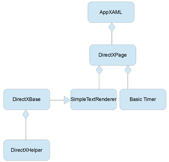

图 Direct2D 应用程序(XAML)模板的类关系

实时图形应用程序通常以某个预定义的时间间隔渲染帧，该时间间隔用每秒显示的帧数(FPS)来描述。帧是游戏或电影的单个静止图像。为了创建平滑动画的错觉，稍微不同的帧被连续显示给观众。DirectX 应用程序通常以固定的刷新率渲染帧，例如 60fps 甚至 100fps。不太可能每隔 60 <sup>秒</sup>或 100 <sup>秒</sup>重新渲染一次制图应用程序的帧。它们通常长时间保持完全相同。用户可以平移或缩放图表，这将需要场景的重新渲染，但是这个动作不像更新实时游戏的帧那样对时间很关键。

|  | 注意:这个模板中这个类和其他类的成员变量有一个“m_”前缀。这意味着它们是成员变量，而不是函数的局部变量。没有必要，但是用这个前缀命名所有成员变量是个好主意。 |

接下来，在解决方案资源管理器中打开 SimpleTextRenderer.cpp 文件。在文件的顶部，您将看到预编译头(`pch.h`)的`#include`指令。下面是`SimpleTextRenderer.h,`的`#include`和该类使用的名称空间列表。在使用指令下，您将看到预定义的背景颜色顺序，用户可以在运行应用程序时循环使用这些颜色。

```cpp
    static const ColorF BackgroundColors[] = { …  }

```

用户可以通过在屏幕上右键单击鼠标，或者在使用触摸屏设备时滑动指针，并选择**下一步**或**上一步**来循环切换颜色和更改应用程序的背景。这是一个特定于应用程序的数组，其他应用程序不太可能使用它。在下面，我们看到了类的默认构造函数。

```cpp
    SimpleTextRenderer::SimpleTextRenderer():m_renderNeeded(true),     m_backgroundColorIndex(0),m_textPosition(0.0f, 0.0f) { }

```

默认构造函数初始化几个变量；它通过选择索引 0 将`backcolor`设置为`CornflowerBlue`(这是对前面代码示例中定义的`BackgroundColors`数组的引用)。它还初始化文本位置，并将 m_ `renderNeeded`布尔值设置为真，这样第一帧将被绘制到屏幕上。此时不会创建或分配资源；DirectX 工厂和上下文也不存在。

接下来是三种资源分配方法。首先是`CreateDeviceIndependentResources`法。

```cpp
    void SimpleTextRenderer::CreateDeviceIndependentResources() {
         DirectXBase::CreateDeviceIndependentResources();
         DX::ThrowIfFailed(
              m_dwriteFactory->CreateTextFormat(
                    L"Segoe UI", nullptr, DWRITE_FONT_WEIGHT_NORMAL,
                    DWRITE_FONT_STYLE_NORMAL, DWRITE_FONT_STRETCH_NORMAL,
                    42.0f, L"en-US", &m_textFormat));
         DX::ThrowIfFailed(
              m_textFormat->SetTextAlignment(DWRITE_TEXT_ALIGNMENT_LEADING)
              );
    }

```

`CreateDeviceIndependentResources`方法用于创建和初始化任何独立于设备的 Direct2D 对象。这个方法从调用基类的同名方法开始。基类方法创建 DirectX 工厂，比如下一行使用的`m_dwriteFactory`，应用程序可以使用它来创建更多的 DirectX 对象。

|  | 注意:DirectX 中的资源都来自两大类之一:设备资源或与设备无关的资源。设备是显卡，设备资源驻留在显卡本身。独立于设备的资源驻留在系统内存中，渲染速度往往较慢，因为它们需要 CPU 周期来传输到显卡。 |

```cpp
    void SimpleTextRenderer::CreateDeviceResources() {
         DirectXBase::CreateDeviceResources();
         DX::ThrowIfFailed(
              m_d2dContext->CreateSolidColorBrush(
                    ColorF(ColorF::Black), &m_blackBrush));
         Platform::String^ text = "Hello, DirectX!";
         DX::ThrowIfFailed(m_dwriteFactory->CreateTextLayout(
                    text->Data(), text->Length(),
                    m_textFormat.Get(),
                    700, // maxWidth.
                    1000, // maxHeight.
                    &m_textLayout));
         DX::ThrowIfFailed(m_textLayout->GetMetrics(&m_textMetrics));
    }

```

`CreateDeviceResources`方法创建并初始化设备相关资源。该方法调用同名的基类方法，该方法创建 Direct3D 设备的实例和应用程序使用的上下文(`m_d3dcontext`和`m_d3dDevice`)。

|  | 注意:设备和上下文是 DirectX 中的两个重要术语。设备可以看作是显卡本身；这个类用于初始化硬件，查询其功能，并创建资源，如纹理和着色器。上下文是设备的特定用途；它使用设备上的资源将内容呈现到屏幕上。通常有一个设备，但可能有多个上下文。例如，打印示例使用三个上下文:一个用于渲染，另一个用于打印预览，第三个用于打印本身。图 6 显示了这些类各自负责的一些任务。 |

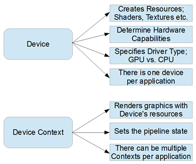

图 6:设备与环境

画笔是设备资源；此方法创建一个黑色画笔来绘制文本。要写入屏幕的实际字符串在设备上使用`CreateTextLayout`方法创建为`TextLayout`对象。之后，使用`GetMetrics`方法将弦的尺寸和比例保存到`m_textMetrics`中。

|  | 注意:CreateTextLayout 方法创建 IDWriteTextLayout 设备资源。此资源包含有关要打印的字符串、打印该字符串的边界框及其位置的信息。CreateTextFormat 方法(在 CreateDeviceIndependentResources 方法中)创建一个 IDWriteTextFormat 对象，该对象用于指定要呈现的文本的字体、大小和属性。 |

```cpp
    void SimpleTextRenderer::CreateWindowSizeDependentResources() {
         DirectXBase::CreateWindowSizeDependentResources();
         // Add code to create window size dependent objects here.
    }

    void SimpleTextRenderer::Update(float timeTotal, float timeDelta) {
         (void) timeTotal; // Unused parameter.
         (void) timeDelta; // Unused parameter.
         // Add code to update time dependent objects here.
    }

```

前面两个方法在模板中是空的。`CreateWindowSizeDependentResources`方法用于创建其设置取决于屏幕大小或方向的任何对象(设备或独立设备)。`Update`法也是空的；它控制应用程序的物理或其他逻辑，通常是依赖于时间的东西。以下代码是模板的`Render`方法的示例。

```cpp
    void SimpleTextRenderer::Render() {
         m_d2dContext->BeginDraw();
         m_d2dContext->Clear(ColorF(BackgroundColors[m_backgroundColorIndex]));
         // Position the rendered text.
         Matrix3x2F translation = Matrix3x2F::Translation(
              m_windowBounds.Width / 2.0f –
              m_textMetrics.widthIncludingTrailingWhitespace / 2.0f +
              m_textPosition.X,
              m_windowBounds.Height / 2.0f –
              m_textMetrics.height / 2.0f + m_textPosition.Y
              );

         // Note that the m_orientationTransform2D matrix is post-multiplied here
         // in order to correctly orient the text to match the display orientation.
         // This post-multiplication step is required for any draw calls that are
         // made to the swap chain's target bitmap. For draw calls to other targets,
         // this transform should not be applied.
         m_d2dContext->SetTransform(translation * m_orientationTransform2D);
         m_d2dContext->DrawTextLayout(Point2F(0.0f, 0.0f),
              m_textLayout.Get(),  m_blackBrush.Get(),
              D2D1_DRAW_TEXT_OPTIONS_NO_SNAP);

         // Ignore D2DERR_RECREATE_TARGET. This error indicates that the device
         // is lost. It will be handled during the next call to Present.
         HRESULT hr = m_d2dContext->EndDraw();
         if (hr != D2DERR_RECREATE_TARGET) {
              DX::ThrowIfFailed(hr);
         }
         m_renderNeeded = false;
    }

```

场景的实际绘制就是在渲染方法中进行的。场景的大部分绘制都是由 m_d2dContext 对象完成的。渲染方法从陈述`m_d2dcontext->BeginDraw`开始；这条线耦合到底部附近的`m_d2dContext->EndDraw`方法调用。您应该将所有的 Direct2D 绘图放在这两个函数调用之间。BeginDraw 用于指定一些代码的开始，这些代码为渲染目标构建一批渲染命令。EndDraw 指定该批命令已经完成，可以进行渲染。

下一行调用`Clear`方法，传递用户当前选择的颜色。这导致屏幕被清除为纯色，这是先前定义的`BackgroundColors`数组，用户可以在其中循环。

|  | 提示:在渲染方法中将屏幕清除为黑色以外的颜色是一个好主意，即使您的后续绘图将完全覆盖清除的屏幕。如果您不这样做，并且程序有问题，您可能会盯着黑屏(或随机闪烁的颜色或像素)，根本无法知道渲染方法是否正在被调用。 |

在调用`Clear`之后，建立一个矩阵。诸如缩放、旋转和平移(或平移，这就是我们在这里所做的)等变换都由矩阵控制。这个特定的矩阵是一个翻译矩阵；它移动文本，以便用户可以在屏幕上拖动它。这个矩阵定义中的计算将文本放在屏幕中间，当用户拖动它时会有一些偏移。它使用`TextMetrics`对象和`WindowBounds`对象来找到文本应该去的地方。

一旦定义，翻译矩阵必须应用于上下文。这发生在调用`SetTransform`的下一行。在应用了适当的转换之后，可以呈现文本本身。这发生在呼叫`DrawTextLayout`的下一条线路上。然后调用`EndDraw`结束绘制，图像呈现给用户。

|  | 提示:当 m_renderer 对象在其 OnRendering 事件处理程序方法中调用 Present()时，渲染场景的实际屏幕刷新发生在 DirectXPage.xaml.cpp 文件中。非常重要的一点是，DirectXPage 类呈现了场景。当您添加调用 Present()本身的更复杂的呈现类时，从 DirectXPage 类中移除 Present()调用是很重要的。否则，您可能会出现()两次，这将导致首先将实际场景翻转到屏幕上，但立即用其他图像覆盖它。 |

剩下的方法是事件处理程序和其他特定于此的东西。我建议刚刚使用 Visual Studio 2012 熟悉 DirectX 的程序员在继续下一节之前花一些时间来改变这个模板的工作方式。熟悉这个模板对于理解本书 Direct2D 部分的其余章节至关重要。

|  | 提示:Direct2D 设计用于在渲染几何图形时自动使用 CPU 的多个内核。如果在 DirectXBase.cpp 文件中创建设备上下文时使用 d2d 1 _ DEVICe _ CONTENT _ OPTIONS _ ENable _ 多线程 _OPTIMIZATIONS 选项，自动多线程可能会大大提高代码的速度，但代价是占用更多的系统内核。 |

### 同步、交换链和缓冲

电脑显示器以固定的速度更新显示。每秒 60 次是常见的，称为 60 Hz，但也有其他类似的 75 Hz 和 100 Hz。像素数据存储在图形处理器的缓冲区中，称为前缓冲区。监视器上的图像每秒钟被来自该缓冲区的数据刷新 60 次。在显示器刷新显示的同时，图形处理器正忙于渲染要显示的帧。图形处理器将像素数据写入缓冲区。

这个系统有一个问题，导致了令人不快的伪像。问题是 GPU 和显示器不一定以相同的速度更新帧。这导致了一种叫做撕裂的假象(见图 7)。显示器将一帧的一半绘制到屏幕上，将前一帧的一半绘制到屏幕上，因为当显示器部分通过更新其显示时，GPU 会更新前缓冲区中的帧。

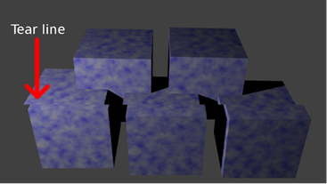

图 7:撕裂

为了避免这种情况，GPU 不会渲染到前缓冲区。相反，它呈现到后缓冲区，除了没有呈现到屏幕上之外，它在各个方面都与前缓冲区相同。

监视器通过将屏幕左上角的像素渲染到右下角来刷新显示，然后重置并重复该操作。它从右下角重置回顶部的时间段称为垂直回扫。为了避免撕裂伪影，图形处理器等待监视器处于垂直回扫阶段，然后翻转缓冲器(通过复制像素数据或交换指针来交换前后缓冲器)。这被简称为垂直同步或垂直同步。当显示器完成自我重置时，图形处理器可以将整个帧复制到前缓冲区。这样就不会撕裂，显示器永远不会显示一帧的一半和另一帧的一半。

使用交换链对象协调缓冲区。这是一个专用于控制缓冲区交换的类。在我们的应用中，有两个缓冲区:前缓冲区和后缓冲区。有时，使用多个后台缓冲区并逐个渲染帧，对要显示的帧进行排队是有益的。

## 第 2 章:使用 WinRT 设备进行调试

本书中的所有代码都适用于 Windows 8 电脑以及 WinRT 设备。如果您正在为 WinRT 平板电脑创作软件，并且有一个真实的设备，那么使用它来调试和测试您的应用程序而不是仿真器(通常是默认的)是非常有益的。C++和 DirectX 中的大部分代码在 Windows 8 PC 以及 WinRT 设备(为 ARM 目标编译)上运行良好。模拟器很好，但永远无法与真实设备的确切特征相匹配。

安装远程工具

将 Visual Studio 2012 的远程工具安装到设备上。这可从微软网站上获得(可从[http://www . Microsoft . com/visualstudio/eng/downloads # d-additional-software](http://www.microsoft.com/visualstudio/eng/downloads#d-additional-software)获得)。它是一种与 Visual Studio 开发机器连接的服务，用于在设备上运行和调试应用程序。Visual Studio 提供了所有常规调试机制，如断点、检查 ARM 寄存器和内存窗口。您需要知道设备的名称，以便在其上部署应用程序。您还需要让设备运行前面提到的安装附带的删除调试监视器。每个构建配置(发布 x86、调试 x86、发布 ARM 等。)您希望设备运行的项目设置中必须有该设备的名称。

将应用程序更改为 ARM

如果您要部署到的 WinRT 设备是基于 ARM 的，例如微软 Surface，您可以通过选择 **ARM** 从主菜单中更改项目的配置。


图 8:配置

将调试更改为远程计算机

如果尚未设置，您应该将调试更改为远程计算机。

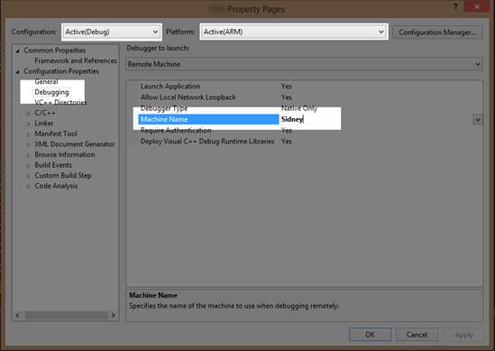

图 9:机器名称

指定远程计算机的名称

从 Visual Studio 的主菜单中打开**项目** > **【名称】属性**页面，或者在解决方案资源管理器中右键单击项目名称，然后在上下文菜单中单击**属性**。这将打开项目的属性页。点击左侧面板的**调试**，在标有**机器名称**的空白处输入您的远程机器名称。

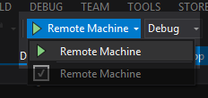

图 10:远程机器

运行远程调试器

在设备上运行远程调试服务，您应该可以像往常一样从 Visual Studio 2012 开始调试(按 F5 或单击开始调试按钮)。您将在设备(Visual Studio 远程调试器的窗口)上看到的第一件事是，它已连接到开发计算机，并显示如下消息:

`3/01/2013 2:48:40 PM [MachineName]\[ComputerName] connected`

此后不久，您将在 Visual Studio 的输出窗口中看到一条消息，称它正在将程序上传到设备。这需要一些时间，但是一旦上传完成，应用程序应该会运行。

如果您无法从设备调试应用程序，或者应用程序没有按预期运行，以下是一些想法:

*   确保设备上安装了正确的远程调试工具。安装 Visual Studio 2012 的工具。请务必直接从 Microsoft 网站下载此文件，并下载任何可用的更新，以确保当前的远程调试支持您的特定设备。
*   请确保在项目属性中正确拼写了远程计算机的名称。远程计算机名是在首次安装 Windows RT 时选择的。如果您忘记或不确定远程计算机的名称，可以在“远程调试器”窗口中看到远程计算机的名称。目前，项目属性中名称的大小写无关紧要，但是机器使用所有大写字母，因此您可能会尝试匹配机器使用的确切大小写。
*   确保当前配置具有在属性页的调试字段中指定的远程计算机的名称。您需要在每个配置中输入设备的名称。例如，如果您使用调试和发布，您需要在两者中指定远程机器的名称。

最后，如果应用程序没有按预期执行而是正在运行，请确保您使用的代码完全可移植到 WinRT。请注意，这些设备没有专用显卡。它们依赖于缩小规模、便携且节能的中央处理器/图形处理器组合。在这些设备上运行的 DirectX 11 版本也在缩小。它不包含 DirectX 11 标准的全部功能。操作系统本身(Windows RT)是完整 Windows 8 的缩小版本，许多功能缺失(例如，自由访问文件结构)。

## 第 3 章:开始图形渲染应用

图 11 是一个基本的条形图。这个特殊的是使用开放办公室计算与随机数据生成的。它由标题、背景、轴标签、网格、键和代表数据的条组成。

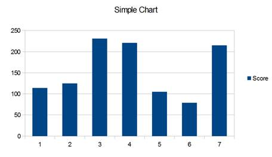

图 11:条形图

图表的每个部分都可以被认为是一个独特的对象。每个对象一个接一个地呈现，从背景开始，然后是网格、数据，然后是标签。图形本身由几个对象组成，它一个接一个地绘制这些对象，以构建数据的完整图形表示。上一张图表的许多内容是通用的，适用于不同的图表类型。例如，网格可以用于散点图、折线图或直方图，就像这里使用的一样。

我们的制图应用程序将以同样的方式工作。我们将开发一个图表对象的集合，可以随意在图表中添加和删除。这些对象将是非常基本的，以维护一个通用的和可用的 Direct2D 图表应用程序的基础。图形本身将是一个名为 GraphRenderer 的类，它将基于我们刚刚检查的 SimpleTextRenderer 类。构成图形渲染器的每个对象都是简单文本渲染器的缩小版本。

在 Visual Studio 2012 中为 Windows 8 创建新的 Direct2D (XAML)应用程序。这将成为我们应用的起点。我已经调用了我的应用程序 graph 标绘。如果复制代码进行测试，您需要将对此命名空间的任何引用更改为应用程序的名称。

首先，我们可以删除表单上的 XAML 文本。通过在解决方案资源管理器中双击其名称，打开 DirectXPage.xaml 文件。这将在可视化设计器中显示页面。选择**你好，XAML！**并右键单击。点击上下文菜单中的**删除**。


图 12:删除文本

在这个面板的下侧还有一个隐藏栏，可以删除。它是当用户在屏幕上右键单击时出现的条，允许背景颜色改变。该栏在设计器中不可见，因此从 XAML 代码中删除它是最容易的。我已经突出显示了要删除的行。

```cpp
    <Page
        x:Class="GraphPlotting.DirectXPage"

        xmlns:x="http://schemas.microsoft.com/winfx/2006/xaml"
        xmlns:local="using:GraphPlotting"
        xmlns:d="http://schemas.microsoft.com/expression/blend/2008"
        xmlns:mc="http://schemas.openxmlformats.org/markup-compatibility/2006"
        mc:Ignorable="d">
        <SwapChainBackgroundPanel x:Name="SwapChainPanel" PointerMoved="OnPointerMoved" PointerReleased="OnPointerReleased"/>

          <Page.BottomAppBar>
              <AppBar Padding="10,0,10,0">
                  <Grid>
                … Lots of XAML code here…!!!
                  </Grid>
              </AppBar>
          </Page.BottomAppBar>

```

打开 **DirectXPage.xaml.cpp** 文件。删除`OnPreviousColorPressed`和`OnNextColorPressed`事件处理程序。在这个类的构造函数中，创建了一个 SimpleTextRenderer 对象。我们需要将它改为一个 GraphRenderer 构造函数调用。也可以删除状态保存方式，`SaveInternalState`和`LoadInternalState`。GraphRenderer 类使用了一个名为`PointerMoved`的方法，而不是`UpdateTextPosition`。该方法在代码列表中已被重命名。整个 DirectXPage.xaml.cpp 文件应该如下所示:

```cpp
    // DirectXPage.xaml.cpp
    #include "pch.h"
    #include "DirectXPage.xaml.h"
    using namespace GraphPlotting;
    using namespace Platform;
    using namespace Windows::Foundation;
    using namespace Windows::Foundation::Collections;
    using namespace Windows::Graphics::Display;
    using namespace Windows::UI::Input;
    using namespace Windows::UI::Core;
    using namespace Windows::UI::Xaml;
    using namespace Windows::UI::Xaml::Controls;
    using namespace Windows::UI::Xaml::Controls::Primitives;
    using namespace Windows::UI::Xaml::Data;
    using namespace Windows::UI::Xaml::Input;
    using namespace Windows::UI::Xaml::Media;
    using namespace Windows::UI::Xaml::Navigation;

    DirectXPage::DirectXPage() : m_renderNeeded(true), m_lastPointValid(false) {
         InitializeComponent();
         m_renderer = ref new GraphRenderer();
         m_renderer->Initialize(Window::Current->CoreWindow,     SwapChainPanel,
              DisplayProperties::LogicalDpi);

         Window::Current->CoreWindow->SizeChanged +=
              ref new TypedEventHandler<CoreWindow^,
                    WindowSizeChangedEventArgs^>(this,
                    &DirectXPage::OnWindowSizeChanged);

         DisplayProperties::LogicalDpiChanged +=
              ref new DisplayPropertiesEventHandler(this,
                    &DirectXPage::OnLogicalDpiChanged);

         DisplayProperties::OrientationChanged +=
            ref new DisplayPropertiesEventHandler(this,
              &DirectXPage::OnOrientationChanged);

         DisplayProperties::DisplayContentsInvalidated +=
              ref new DisplayPropertiesEventHandler(this,
                    &DirectXPage::OnDisplayContentsInvalidated);

         m_eventToken = CompositionTarget::Rendering::add(ref new
              EventHandler<Object^>(this, &DirectXPage::OnRendering));
         m_timer = ref new BasicTimer();
    }

    void DirectXPage::OnPointerMoved(Object^ sender, PointerRoutedEventArgs^ args) {
         auto currentPoint = args->GetCurrentPoint(nullptr);
         if (currentPoint->IsInContact) {
              if (m_lastPointValid) {
                    Windows::Foundation::Point delta(
                         currentPoint->Position.X - m_lastPoint.X,
                         currentPoint->Position.Y - m_lastPoint.Y
                         );
                    m_renderer->PointerMoved(delta);
                    m_renderNeeded = true;
              }
              m_lastPoint = currentPoint->Position;
              m_lastPointValid = true;
         }
         else {
              m_lastPointValid = false;
         }
    }

    void DirectXPage::OnPointerReleased(Object^ sender, PointerRoutedEventArgs^ args) {
         m_lastPointValid = false;
    }

    void DirectXPage::OnWindowSizeChanged(CoreWindow^ sender,
              WindowSizeChangedEventArgs^ args) {
         m_renderer->UpdateForWindowSizeChange();
         m_renderNeeded = true;
    }
    void DirectXPage::OnLogicalDpiChanged(Object^ sender) {
         m_renderer->SetDpi(DisplayProperties::LogicalDpi);
         m_renderNeeded = true;
    }
    void DirectXPage::OnOrientationChanged(Object^ sender) {
         m_renderer->UpdateForWindowSizeChange();
         m_renderNeeded = true;
    }
    void DirectXPage::OnDisplayContentsInvalidated(Object^ sender) {
         m_renderer->ValidateDevice();
         m_renderNeeded = true;
    }
    void DirectXPage::OnRendering(Object^ sender, Object^ args) {
         if (m_renderNeeded)  // Comment out this line to make real-time updating
         {
              m_timer->Update();
              m_renderer->Update(m_timer->Total, m_timer->Delta);
              m_renderer->Render();
              m_renderer->Present();
              m_renderNeeded = false;
         }
    }

```

打开 DirectXPage.xaml.h 文件，删除我们从 CPP 文件中删除的`OnPreviousColorPressed`和`OnNextColorPressed`事件处理程序的声明，并将 include 从 SimpleTextRenderer.h 更改为 GraphRenderer.h，并将成员变量声明从 SimpleTextRenderer^更改为 GraphRenderer^.同时删除 SaveInternalState 和 LoadInternalState 方法的声明。该文件应该如下所示(因为我们还没有声明 GraphRenderer 类，所以 Visual Studio 将用红色下划线标出引用)。

```cpp
    // DirectXPage.xaml.h
    #pragma once
    #include "DirectXPage.g.h"
    #include "GraphRenderer.h"
    #include "BasicTimer.h"
    namespace GraphPlotting{
        [Windows::Foundation::Metadata::WebHostHidden]
          public ref class DirectXPage sealed {
          public:
                DirectXPage();
          private:
                void OnPointerMoved(Platform::Object^ sender,
                      Windows::UI::Xaml::Input::PointerRoutedEventArgs^ args);
                void OnPointerReleased(Platform::Object^ sender,
                      Windows::UI::Xaml::Input::PointerRoutedEventArgs^ args);
                void OnWindowSizeChanged(Windows::UI::Core::CoreWindow^ sender,
                      Windows::UI::Core::WindowSizeChangedEventArgs^ args);
                void OnLogicalDpiChanged(Platform::Object^ sender);
                void OnOrientationChanged(Platform::Object^ sender);
                void OnDisplayContentsInvalidated(Platform::Object^ sender);
                void OnRendering(Object^ sender, Object^ args);
                Windows::Foundation::EventRegistrationToken m_eventToken;
                GraphRenderer^ m_renderer;
                bool m_renderNeeded;
                Windows::Foundation::Point m_lastPoint;
                bool m_lastPointValid;      
                BasicTimer^ m_timer;
          };
    }

```

打开 **App.xaml.cpp** 文件，删除对`LoadInternalState`和`SaveInternalState`方法的两个引用:

```cpp
    // App.xaml.cpp
    // Implementation of the App class.
    #include "pch.h"
    #include "DirectXPage.xaml.h"
    using namespace GraphPlotting;
    using namespace Platform;
    using namespace Windows::ApplicationModel;
    using namespace Windows::ApplicationModel::Activation;
    using namespace Windows::Foundation;
    using namespace Windows::Foundation::Collections;
    using namespace Windows::Storage;
    using namespace Windows::UI::Xaml;
    using namespace Windows::UI::Xaml::Controls;
    using namespace Windows::UI::Xaml::Controls::Primitives;
    using namespace Windows::UI::Xaml::Data;
    using namespace Windows::UI::Xaml::Input;
    using namespace Windows::UI::Xaml::Interop;
    using namespace Windows::UI::Xaml::Media;
    using namespace Windows::UI::Xaml::Navigation;

    App::App() {
          InitializeComponent();
          Suspending += ref new SuspendingEventHandler(this, &App::OnSuspending);
    }

    void App::OnLaunched(LaunchActivatedEventArgs^ args) {
          m_directXPage = ref new DirectXPage();
          // Place the page in the current window and ensure that it is active.
          Window::Current->Content = m_directXPage;
          Window::Current->Activate();
    }

    void App::OnSuspending(Object^ sender, SuspendingEventArgs^ args) {
          (void) sender; // Unused parameter.
          (void) args; // Unused parameter.
    }

```

下面的 GraphRenderer 类将代替 Direct2D (XAML)模板中提供的 SimpleTextRenderer，这样我们就可以从项目中删除 SimpleTextRenderer。在解决方案资源管理器中选择定义简单文本渲染器的两个文件。要删除它们，右键单击并从上下文菜单中选择**删除**。

向项目中添加两个文件，GraphRenderer.h 和 GraphRenderer.cpp。随着图表的发展，这些文件会经常变化，但下面是它们的初始列表。

```cpp
    // GraphRenderer.h
    #pragma once
    #include "DirectXBase.h"
    //
    // Additional headers for graph objects here
    //

    // This class represents a graph
    ref class GraphRenderer sealed : public DirectXBase{
    public:
          // Public constructor
          GraphRenderer();

          // DirectXBase methods.
          virtual void CreateDeviceIndependentResources() override;
          virtual void CreateDeviceResources() override;
          virtual void CreateWindowSizeDependentResources() override;
          virtual void Render() override;

          // Capture the pointer movements so the user can pan the chart
          void PointerMoved(Windows::Foundation::Point point);

          // Method for updating time-dependent objects.
          void Update(float timeTotal, float timeDelta);

    private:
          // Global pan value for moving the chart with the mouse
          Windows::Foundation::Point m_pan;
    };
    // GraphRenderer.cpp
    #include "pch.h"
    #include "GraphRenderer.h"

    using namespace D2D1;
    using namespace DirectX;
    using namespace Microsoft::WRL;
    using namespace Windows::Foundation;
    using namespace Windows::Foundation::Collections;
    using namespace Windows::UI::Core;

    GraphRenderer::GraphRenderer() {
    }

    void GraphRenderer::CreateDeviceIndependentResources() {
    DirectXBase::CreateDeviceIndependentResources();
    }

    void GraphRenderer::CreateDeviceResources() {
    DirectXBase::CreateDeviceResources();
    }

    void GraphRenderer::CreateWindowSizeDependentResources() {
    DirectXBase::CreateWindowSizeDependentResources();
    }

    void GraphRenderer::Update(float timeTotal, float timeDelta) {
    }

    void GraphRenderer::PointerMoved(Windows::Foundation::Point point)
    {
    // Allow the user to set the current pan value with the mouse or pointer
    m_pan.X += point.X;
    m_pan.Y += point.Y;
    }

```

此时编译并测试您的应用程序。你会看到整个屏幕变成浅蓝色。

## 第四章:图形背景

我们定义的第一个图形对象是背景。图表的背景充当画布，在其上呈现其他对象。它可以是简单的单一颜色、渐变，甚至是图像。图表通常是为了清晰地描述信息，背景不应该掩盖数据。

### 纯色背景

最简单的图表背景是单一的纯色，通常是白色或一些其他不饱和色素。这些是常见的，因为它们不会将观众的注意力从所表示的数据上引开，并且它们快速且易于呈现。

|  | 注意:我们可以将呼叫中的颜色从`CornflowerBlue`更改为其他颜色。相反，我们将在一个单独的类中封装背景的呈现。一旦我们的图表清除了屏幕，您就可以删除清除到文本蓝色。 |

下面的代码定义了一个呈现纯色背景的类。

```cpp
    // SolidBackground.h
    #pragma once
    #include "DirectXBase.h"
    // Defines a background consisting of a solid color
    class SolidBackground {
    private:
          D2D1::ColorF color;     // The color of this background
    public:
          // Creates a new SolidBackground set to the specified color
          SolidBackground(D2D1::ColorF color);
          // Draw the background
          void Render(Microsoft::WRL::ComPtr<ID2D1DeviceContext> context);
    };

```

```cpp
    // SolidBackground.cpp
    #include "pch.h"
    #include "SolidBackground.h"

    SolidBackground::SolidBackground(D2D1::ColorF col):  color(col) { }

    void SolidBackground::Render(
          Microsoft::WRL::ComPtr<ID2D1DeviceContext> context) {
    context->Clear(color); // Clear the screen to the color
    }

```

此类在其构造函数中接受一个颜色参数，将其保存到一个成员变量中，并使用它在其呈现方法中清除屏幕。为了创建一个实体背景的实例，我们需要将它添加到 GraphRenderer 类中。打开 GraphRenderer.h，为 SolidBackground.h 文件添加一个#include(我已经用蓝色突出显示了添加或更改的行)。

```cpp
    // GraphRenderer.h
    #pragma once
    #include "DirectXBase.h"
    //
    // Additional headers for graph objects here
    //

      #include "SolidBackground.h"

```

在 GraphRenderer.h 文件的底部声明一个成员变量。

```cpp
    private:
          // Global pan value for moving the chart with the mouse
          Windows::Foundation::Point m_pan;

            SolidBackground* m_solidBackground;

```

};

打开 GraphRenderer.cpp 文件，使用“new”在 GraphRenderer 类构造函数中创建`m_solidBackground`的实例。

```cpp
    GraphRenderer::GraphRenderer() {

      m_solidBackground = new SolidBackground(D2D1::ColorF::Bisque);

```

}

最后，必须更改 GraphRenderer 的呈现方法，以调用新的 m_solidBackground 的呈现方法。不再需要调用 m_d2dContext 的 Clear 方法，可以将其删除。

```cpp
    void GraphRenderer::Render(){
    m_d2dContext->BeginDraw();
    // Clear to some color other than blank

      // m_d2dContext->Clear(D2D1::ColorF(ColorF::CornflowerBlue));

```

//平移图表

matrix 3 x2f panMatrix = matrix 3 x2f::Translation(m _ pan。x，m_pan。y)；

m _ D2 dconte-> settlement(panmatrix * m _ orientation transform 2d)；

//

//在此绘制对象

//

m_solidBackground->渲染(m _ D2 dconte)；

//忽略 D2DERR_RECREATE_TARGET 错误

hresult HR = m _ D2 dcocontext-> end raw()；

if (hr！= D2DERR _ RECREATE _ TARGET)DX::ThrowIfFailed(HR)；

}

您可以删除渲染方法中对`m_d2dContext::Clear()`的调用，因为它不再需要。现在是编译和运行应用程序的好时机。

### DirectX 颜色

可以使用`D2D1::ColorF`枚举来指定颜色，该枚举定义了大约 140 种预定义颜色的列表。

```cpp
    D2D_COLOR_F copyOfPredefinedColor = D2D1::ColorF(D2D1::ColorF::AliceBlue);
    // Alternative syntax using the derived helper class would be:
    D2D1::ColorF copyOfPredefinedColor2 = D2D1::ColorF(D2D1::ColorF::AliceBlue);

```

|  | 注意:有关 D2D1::ColorF 枚举中可用的预定义颜色的完整列表，请右键单击 AliceBlue 或其他颜色标识符，然后从上下文菜单中选择“转到定义”。这将打开定义预定义颜色列表的 Direct2DHelper.h 文件。 |

|  | 注意:D2D1::ColorF 类继承自 D2D_COLOR_F 类。它是相同的，但是它定义了一些有用的函数和预定义颜色的枚举。 |

您也可以通过将颜色的红、绿和蓝的数量指定为浮点值来创建自己的颜色:

```cpp
    D2D1::ColorF brightMagenta = D2D1::ColorF(1.0f, 0.0f, 1.0f);

```

ColorF 类的构造函数采用三个参数，第四个参数可选(默认为 1.0f，表示不透明度或 alpha 通道)。前三个参数是颜色中红色、绿色和蓝色的数量。这里我定义了 100%红色、0%绿色和 100%蓝色。这种组合产生了明亮的洋红色。在此颜色模型中，组件的范围是从 0.0f 到 1.0f，其中 0.0f 表示完全没有，1.0f 表示完全饱和或 100%。

您经常会看到颜色初始化如下:

`D2D1::ColorF myColor = D2D1::ColorF(D2D1::ColorF::**PredefinedColor**);`

预定义颜色是 D2D1Helper.h 文件中定义的颜色枚举中的一种颜色。这是对 ColorF 类的复制构造函数的调用。预定义颜色的嵌套引用是要复制的值。

您也可以使用十六进制表示以类似于 HTML 颜色的样式定义颜色。

```cpp
    D2D1::ColorF coffee = 0xCEAA7A;

```

这里，该值是一个无符号整数，通常写成六个十六进制数字，每个数字代表三个无符号字节，范围从 0 到 255。最低的两位数字表示蓝色的量(示例中的 7A)，它们的范围可以从 00(无)到 FF (255 或 100%饱和度)。接下来的两位数(示例中的 AA)以类似的方式表示绿色的量，最高的两位数(示例中的 CE)是红色的量。

红色、绿色和蓝色的示例颜色模型称为 RGB。有时还有一个称为 alpha 通道的附加通道，通常用于表示颜色的不透明度。0%的 alpha 值表示完全透明，100%表示完全不透明。带有附加 alpha 通道的 RGB 颜色系统称为 ARGB 颜色系统，因为 32 位无符号整数的最高位用于存储 alpha 通道。

|  | 提示:小端系统(如 x86 和 ARM)上的 RGB 颜色模型导致像素颜色的字节顺序实际上是 BGR，相反，当存储在内存中时。蓝色字节是内存中最低的，红色字节是最高的。使用 ARGB 模型时，字节顺序是 BGRA。 |

### 渐变背景

扎实的背景介绍了清除屏幕；下一个背景将介绍 Direct2D 的渐变画笔。我们在 Direct2D 中绘制的几乎所有东西都是使用画笔完成的。有几种不同类型的刷子。我们之前看到使用纯色画笔渲染文本。在渲染数据之前，可以通过使用线性渐变画笔为整个渲染目标着色来创建渐变背景。若要创建 GradientBackground 类，请向项目中添加两个文件，`GradientBackground.h`和`GradientBackground.cpp`。

```cpp
    // GradientBackground.h
    #pragma once
    #include "DirectXBase.h"
    // Gradient background
    class GradientBackground {
    private:
          D2D1_COLOR_F *colors;   // The colors in the gradient
          float *stops;// Positions of the colors
          int count;  // The number of different colors used
          D2D1_RECT_F m_ScreenRectangle;     // The size of the rectangle we're filling

          // The linear gradient brush performs the painting
          Microsoft::WRL::ComPtr<ID2D1LinearGradientBrush> m_linearGradientBrush;

    public:
          // Creates a new gradient background
          GradientBackground(D2D1_COLOR_F colors[], float stops[], int count);  
          // Release dynamic memory
          ~GradientBackground();
          void CreateWindowSizeDependentResources
                (Microsoft::WRL::ComPtr<ID2D1DeviceContext> context);
          void Render(Microsoft::WRL::ComPtr<ID2D1DeviceContext> context);
    };

```

```cpp
    // GradientBackground.cpp
    #include "pch.h"
    #include "GradientBackground.h"

    GradientBackground::GradientBackground(D2D1_COLOR_F colors[],
         float stops[], int count) {
    // The constructor just saves the colors and stops
    this->count = count;
    this->colors = new D2D1_COLOR_F[count];
    this->stops = new float[count];

    for(int i = 0; i < count; i++) {
          this->colors[i] = D2D1_COLOR_F(colors[i]);
          this->stops[i] = stops[i];
          }
    }
    void GradientBackground::CreateWindowSizeDependentResources
          (Microsoft::WRL::ComPtr<ID2D1DeviceContext> context)
    {
    // Create a gradient stops array from the colors and stops
    D2D1_GRADIENT_STOP *gradientStops = new D2D1_GRADIENT_STOP[count];
    for(int i = 0; i < count; i++) {
          gradientStops[i].color = colors[i];
          gradientStops[i].position = stops[i];
          }    
    // Create a Stop Collection from this using the
    // context's create method:
    ID2D1GradientStopCollection *gradientStopsCollection;
    DX::ThrowIfFailed(
          context->CreateGradientStopCollection (
                gradientStops,    // Stops
                count,                  // How many?
                &gradientStopsCollection     // Output object
                ));
    // Create a linear gradient brush from this:
    DX::ThrowIfFailed(
          context->CreateLinearGradientBrush(
          D2D1::LinearGradientBrushProperties (
                D2D1::Point2F(0, 0),// Start point of gradient
                D2D1::Point2F(    // Finish point of gradient
                      context->GetSize().width,
                      context->GetSize().height
                      )),
          gradientStopsCollection,
          &m_linearGradientBrush));

    // Also save the rectangle we're filling
    m_ScreenRectangle = D2D1::RectF(0, 0, context->GetSize().width,
         context->GetSize().height);
    }

    void GradientBackground::Render(Microsoft::WRL::ComPtr<ID2D1DeviceContext> context) {
    // The fill the whole screen with the gradient
    context->FillRectangle(&m_ScreenRectangle, m_linearGradientBrush.Get());
    }

    GradientBackground::~GradientBackground() {
    delete[] colors;
    delete[] stops;
    }

```

这个类的构造函数只不过是将作为参数传递的值保存到成员变量中，这样它们就可以在资源分配方法中用来创建画笔。最重要的方法是创建窗口大小相关的资源。我们希望我们的渐变填充整个渲染目标，所以我们应该把它放在窗口大小相关的资源方法。在代码示例中，您将看到在对 CreateLinearGradientBrush 的方法调用中指定的两个点。

```cpp
                D2D1::Point2F(0, 0), // Start point of gradient
              D2D1::Point2F(       // Finish point of gradient
                    context->GetSize().width,
                    context->GetSize().height
                    )),

```

当我们创建渐变画笔时，我们首先创建一个停靠点的集合，这些停靠点是混合颜色的位置，然后我们从这里创建渐变画笔本身。我还将渲染目标大小保存到了一个成员变量中，这样就不会在渲染方法中计算它了。

我使用了屏幕坐标(0，0)和(宽度，高度)，使得渐变从左上角延伸到右下角。如果你想要一个从屏幕顶部到底部的垂直渐变，你可以用 0 代替屏幕宽度作为第二个点的第一个参数。同样，如果你想要一个水平延伸的渐变，你可以用 0 替换`context->GetSize().height`。

创建线性渐变画笔需要指定颜色列表和颜色变化的位置列表。如果颜色为红色、绿色和蓝色，色标为 0.0f、0.2f 和 1.0f，渐变的颜色将混合如下:


梯度为 0%时为红色，梯度为 20%时为绿色，梯度为 100%时为蓝色。您可以根据需要添加任意多的停靠点和颜色。停靠点可以高于 100% (1.0f)。这意味着渐变的混合比可见区域延伸得更远。如果停止点不是从 0.0f 开始，渐变的开始将采用第一种颜色。同样，如果停靠点不以 1.0f 结尾，渐变画笔的其余部分将使用最后一种颜色。

为了创建一个实例并渲染渐变背景，我们遵循与纯色背景相似的模式。然而，实心背景不需要任何资源，而渐变背景在设备上创建一个笔刷，所以我们需要调用`CreateWindowSizeDependentResources`方法让渐变背景创建这个笔刷。

|  | 注意:我们正在检查线性渐变，但是 Direct2D 中也有径向渐变画笔。它们从同心圆的中心点向外辐射梯度。 |

用对 GraphRenderer.h 文件中新 GradientBackground.h 头的引用替换对 SolidBackground.h 头的引用。

```cpp
    //
    // Additional headers for graph objects here
    //

      #include "GradientBackground.h"

```

用新的 GradientBackground 的声明替换 SolidBackground 成员变量的声明。

```cpp
    private:
          // Global pan value for moving the chart with the mouse
          Windows::Foundation::Point m_pan;

            GradientBackground* m_gradientBackground;

```

};

将对 SolidBackground 构造函数的调用替换为对 GraphRenderer 的构造函数中的新 GradientBackground 构造函数的调用。

```cpp
    GraphRenderer::GraphRenderer() {

      D2D1_COLOR_F colors[] = {
            D2D1::ColorF(ColorF::PaleGoldenrod),
            D2D1::ColorF(ColorF::PaleTurquoise),
            D2D1::ColorF(0.7f, 0.7f, 1.0f, 1.0f)
            };

      float stops[] = {
            0.0f,
            0.5f,
            1.0f
            };

      m_gradientBackground = new GradientBackground(colors, stops, 3);

```

}

|  | 注意:标准颜色，如 ColorF::Red，在枚举中声明为整数 RGBA 值。我们的 GradientBackground 类需要一个 D2D1_COLOR_F 结构的数组，每个结构将一种颜色表示为四个不同的浮点值。这就是在对 D2D1::ColorF()的调用中包装标准颜色的原因。 |

调用方法在 GraphRenderer 的`CreateWindowSizeDependentResources`方法中创建背景的窗口大小相关资源。

```cpp
    void GraphRenderer::CreateWindowSizeDependentResources() {
    DirectXBase::CreateWindowSizeDependentResources();

      m_gradientBackground->CreateWindowSizeDependentResources(m_d2dContext);

```

}

最后，用渲染我们的新 GradientBackground 的调用替换渲染 SolidBackground 的调用。

```cpp
    void GraphRenderer::Render() {
    m_d2dContext->BeginDraw();

      // Reset the transform matrix so our gradient does not pan
      m_d2dContext->SetTransform(m_orientationTransform2D);
      m_gradientBackground->Render(m_d2dContext);

```

//平移图表

matrix 3 x2f panMatrix = matrix 3 x2f::Translation(m _ pan。x，m_pan。y)；

m _ D2 dconte-> settlement(panmatrix * m _ orientation transform 2d)；

//

//在此绘制对象

//

//忽略 D2DERR_RECREATE_TARGET 错误

hresult HR = m _ D2 dcocontext-> end raw()；

if (hr！= D2DERR _ RECREATE _ TARGET)DX::ThrowIfFailed(HR)；

}

我假设渐变背景不受图表平移(平移)的影响。这只是为了平移数据。为此，我添加了在重置转换矩阵后立即呈现的调用。

集合中的梯度数量可以非常大，并且可以生成而不是存储，或者硬编程到代码中。下面创建的渐变背景产生了一个随机的彩色彩虹，这可以替换我们放入 GraphRenderer 的构造函数中的代码:

```cpp
    const int count = 500;   
    D2D1_COLOR_F *cols = new D2D1_COLOR_F[count];
    float* stops = new float[count];

    for(int i = 0; i < count; i++) {
         cols[i] = D2D1::ColorF(
              0.75f+(float)(rand()%192)/192.0f, // Random pastels
              0.75f+(float)(rand()%192)/192.0f,
              0.75f+(float)(rand()%192)/192.0f);
         stops[i] = (float)i / (count - 1);
         }

    m_gradientBackground = new GradientBackground(cols, stops, count);

```

示例代码产生了一个相当令人满意的渐变，看起来应该如图 13 所示。


图 13:彩虹渐变

渐变背景非常适合绘制图表，尤其是在资源有限的设备上，因为它们比标准的纯色背景更吸引人。它们比位图背景渲染和初始化更快，并且不会占用任何磁盘空间，也不会因为存储图像而使应用程序膨胀。

### 位图背景

接下来，我们将通过创建位图背景来检查图像的加载和显示。您可以使用 WIC(窗口成像组件)加载位图图像(或其他几种标准图像格式)并将其显示为背景。位图背景提供了最大的灵活性，但在渲染性能方面成本更高。

|  | 注意:由于 WIC 解码器的灵活性，这个类将能够加载许多标准的图像文件格式。Windows 8 附带了 JPEG、TIFF、PNG、BMP 和其他格式的解码器。代码没有变化，我们的图表应该能够加载任何这些图像格式。 |

首先要做的是向项目中添加一个图像文件。在解决方案资源管理器中右键单击项目名称，然后单击**添加现有项目...**如图 14 所示。

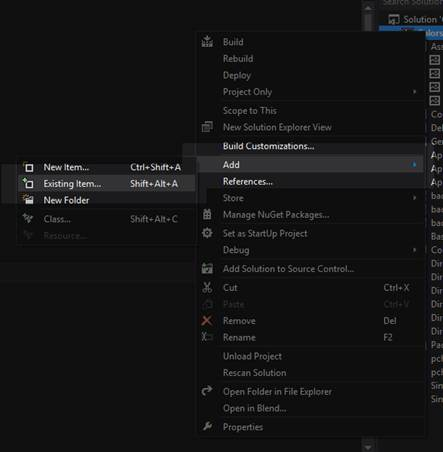

图 14:添加现有项目

在出现的**添加现有项目**窗口中找到您想要使用的图像文件。在这个例子中，我将使用一个名为 background5.jpg 的图像文件。选择文件后，按图 15 点击**添加**。

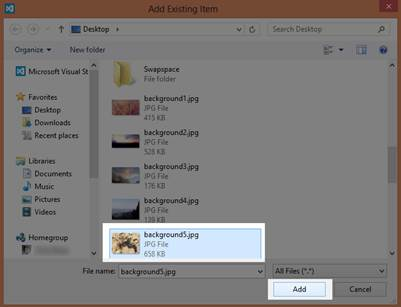

图 15:添加图像

现在我们已经向项目中添加了位图，我们可以通过添加 BitmapBackground.h 和 BitmapBackground.cpp 文件来创建 BitmapBackground 类。

```cpp
    // BitmapBackground.h
    #pragma once
    #include "DirectXBase.h"

    // Defines a background consisting of a bitmap image
    class BitmapBackground {
    private:
          ID2D1Bitmap * m_bmp; // The image to draw
          D2D1_RECT_F m_screenRectangle; // Destination rectangle

    public:
          // Constructor for bitmap backgrounds
          BitmapBackground();

          // Release dynamic memory
          ~BitmapBackground();

          void CreateDeviceDependentResources
                (Microsoft::WRL::ComPtr<ID2D1DeviceContext> context,
                IWICImagingFactory2 *wicFactory, LPCWSTR filename);
          void CreateWindowSizeDependentResources(
         Microsoft::WRL::ComPtr<ID2D1DeviceContext> context);
          void Render(Microsoft::WRL::ComPtr<ID2D1DeviceContext> context);
    };

```

|  | 提示:id2d 1 位图是设备相关资源。很多 WinRT 设备没有专用的 GPU RAM，所以位图会存储在有限的系统内存中。为了减少对系统资源的压力，最好只加载相对较小的位图，或者如果您希望应用程序在这些设备上平稳运行，最好只加载少量位图。 |

```cpp
    // BitmapBackground.cpp
    #include "pch.h"
    #include "BitmapBackground.h"

    // This constructor must be called at some point after the
    // WIC factory is initialized!
    BitmapBackground::BitmapBackground() { }

    BitmapBackground::~BitmapBackground(){
    m_bmp->Release();
    }

    void BitmapBackground::CreateDeviceDependentResources
          (Microsoft::WRL::ComPtr<ID2D1DeviceContext> context,
         IWICImagingFactory2 *wicFactory, LPCWSTR filename) {
    // Create a WIC decoder
    IWICBitmapDecoder *pDecoder;

    // Decode a file, and make sure you've added the file to the project first:
    DX::ThrowIfFailed(wicFactory->CreateDecoderFromFilename(filename,
          nullptr, GENERIC_READ, WICDecodeMetadataCacheOnDemand, &pDecoder));

    // Read a frame from the file (png, jpg, bmp, and other images only have one frame so
    // the index is always 0):
    IWICBitmapFrameDecode *pFrame = nullptr;
    DX::ThrowIfFailed(pDecoder->GetFrame(0, &pFrame));

    // Create format converter to ensure data is the correct format despite the
    // file's format.
    // It's likely the format is already perfect but we can't be sure:
    IWICFormatConverter *m_pConvertedSourceBitmap;
    DX::ThrowIfFailed(wicFactory->CreateFormatConverter(&m_pConvertedSourceBitmap));
    DX::ThrowIfFailed(m_pConvertedSourceBitmap->Initialize(
          pFrame, GUID_WICPixelFormat32bppPRGBA,
          WICBitmapDitherTypeNone, nullptr,
          0.0f, WICBitmapPaletteTypeCustom));

    // Create a Direct2D bitmap from the converted source
    DX::ThrowIfFailed(context->CreateBitmapFromWicBitmap(
         m_pConvertedSourceBitmap, &m_bmp));

    // Release the dx objects we used to create the bmp
    pDecoder->Release();
    pFrame->Release();
    m_pConvertedSourceBitmap->Release();
    }

    void BitmapBackground::CreateWindowSizeDependentResources(
         Microsoft::WRL::ComPtr<ID2D1DeviceContext> context) {
    // Save a rectangle the same size as the area to draw the background
    m_screenRectangle = D2D1::RectF(0, 0, context->GetSize().width, context->GetSize().height);
    }

    void BitmapBackground::Render(Microsoft::WRL::ComPtr<ID2D1DeviceContext> context) {
    context->DrawBitmap(m_bmp, &m_screenRectangle);
    }

```

构造函数是空的，析构函数只是释放位图。这个背景的大部分代码都围绕着用 WIC 工厂和相关组件加载和解码图像。这是通过`BitmapBackground::CreateDeviceDependentResources`方法完成的。我们首先使用威驰工厂的`CreateDecoderFromFile`方法创建一个解码器。然后我们用它从文件中读取一个帧。JPEG、PNG 或位图图像中只有一帧，因此我们传递的帧索引为 0(在对 pDecoder 的`GetFrame`方法的调用中)。有可能我们刚刚读取的帧格式不是我们想要使用的标准 RGB 像素。使用 WIC 格式转换器转换数据，最后，创建一个`ID2D1Bitmap`对象。然后，我们可以将转换后的帧渲染到屏幕上。

这个类的构造函数是空的，位图的创建委托给`CreateDeviceDependentResources`方法，因为我们需要使用 WIC 解码器，但是当调用图形渲染器的构造函数时，WIC 解码器没有初始化。

|  | 注意:在 GraphRenderer 类中，调用构造函数和方法来创建资源的顺序是构造函数、创建设备独立资源、创建设备资源，然后创建窗口大小依赖资源。这个顺序是在 DirectXBase.cpp 文件中指定的。DirectXPage 也通过调用构造函数在这个排序中发挥作用。 |

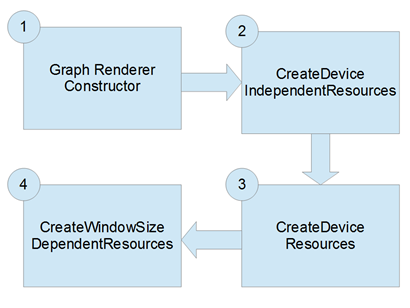

图 16:资源创建方法的顺序

要创建我们类的新实例并呈现位图背景，请在 GraphRenderer.h 文件中将 GradientBackground.h 头的#include 替换为新的 BitmapBackground.h 头的#include。

```cpp
    //
    // Additional headers for graph objects here
    //

      #include "BitmapBackground.h"

```

用 GraphRenderer.h 文件底部名为`m_bitmapBackground`的新 BitmapBackground 成员变量的定义替换 GradientBackground 成员变量的定义。

```cpp
    private:
          // Global pan value for moving the chart with the mouse
          Windows::Foundation::Point m_pan;

            BitmapBackground* m_bitmapBackground;

```

};

用对我们的新类的构造函数的调用来替换 GraphRenderer 的构造函数中用于构造渐变背景的代码。

```cpp
    GraphRenderer::GraphRenderer() {

      m_bitmapBackground = new BitmapBackground();

```

}

在 Graph Renderer 的同名方法中调用新位图背景的`CreateDeviceResources`方法(记得将文件名改为你使用的实际图像)。

```cpp
    void GraphRenderer::CreateDeviceResources() {
    DirectXBase::CreateDeviceResources();

      // Load the bitmap for our background
      m_bitmapBackground->CreateDeviceDependentResources(
            m_d2dContext,
            m_wicFactory.Get(),
            L"Background5.jpg");

```

}

将对 GraphRenderer 的`CreateWindowSizeDependentResources`方法中的`m_gradientBackground->CreateWindowSizeDependentResources`方法的调用替换为对新类的`CreateWindowSizeDependentResources`的调用。

```cpp
    void GraphRenderer::CreateWindowSizeDependentResources() {
    DirectXBase::CreateWindowSizeDependentResources();
    m_bitmapBackground->CreateWindowSizeDependentResources(m_d2dContext);
    }

```

最后，在应用平移矩阵之前，将对 GradientBackground 的渲染方法的调用替换为对图形渲染器的渲染方法中新的 BitmapBackground 的渲染方法的调用。

```cpp
    void GraphRenderer::Render() {
    m_d2dContext->BeginDraw();

    // Reset the transform matrix so our background does not pan
    m_d2dContext->SetTransform(m_orientationTransform2D);

      m_bitmapBackground->Render(m_d2dContext);

```

//平移图表

matrix 3 x2f panMatrix = matrix 3 x2f::Translation(m _ pan。x，m_pan。y)；

m _ D2 dconte-> settlement(panmatrix * m _ orientation transform 2d)；

//

//在此绘制对象

//

|  | 注意:使用位图背景的缺点是会增加应用程序的占用空间。图像会占用硬盘空间，但根据格式的不同，这可能可以忽略不计。然而，一旦图像被解码并作为 id2d 1 位图加载到我们的应用程序中，它将不再使用文件格式的压缩算法。例如，一个 2247 × 1345 像素的 JPEG 只消耗不到 1 MB 的磁盘空间，但是当加载到应用程序中时，它会增加将近 9 MB 的内存使用。这 9 MB 是因为图像中有 2247 × 1345 个像素，每个像素存储为红色、绿色和蓝色字节。所以整个图像是 2247 × 1345 × 3 字节，约 8.6 MB。 |

## 第 5 章:二维数据图

我们现在将通过研究如何绘制一些数据来继续在 Direct2D 中渲染一些形状。这将是一个在 Direct2D 中渲染矢量图形的小介绍。为了保持示例代码的简单性，我将使用随机生成的值数组作为将要绘制的数据。当在实际应用程序中使用时，这些数据可能来自数据库或其他实际数据源。

图形变量基类

我们将在以下部分创建散点图和折线图。散点图和折线图都有许多共同的特征，所以我们将实现一个小的类层次结构。散点图和折线图都将继承自下面的基类，称为 GraphVariable 类。向项目中添加两个文件来定义这个基类，GraphVariable.h 和 GraphVariable.cpp。

```cpp
    // GraphVariable.h
    #pragmaonce

    #include "DirectXBase.h"

    // This class represents a generic plottable variable
    // It is the base class for the ScatterPlot and the LineChart
    // classes.
    class GraphVariable abstract
    {
    protected:
         D2D1_POINT_2F* m_points; // These are the x values and y values of each node
         int m_nodeCount;     // This is a record of the total number of nodes

         // Record of smallest point
         float m_minX, m_minY; // Used to auto pan
    public:
         // Getters for min values
         float GetMinX() { return m_minX; }
         float GetMinY() { return m_minY; }

         GraphVariable(float* x, float* y, int count);

         virtual void CreateDeviceDependentResources
    (Microsoft::WRL::ComPtr<ID2D1DeviceContext> context) = 0;
         virtual void Render(Microsoft::WRL::ComPtr<ID2D1DeviceContext> context)
     = 0;
    };

```

该类由作为 D2D1_POINT_2F 结构的数组的节点，以及节点集合中最小 x 和 y 值的计数和记录组成。我们记录最小的 x 和 y 值的原因是为了以后自动平移数据，以便在图表的初始视图中可以看到一些数据。

```cpp
    // GraphVariable.cpp
    #include "pch.h"
    #include "GraphVariable.h"

    GraphVariable::GraphVariable(float* x, float* y, int count)
    {
    this->m_nodeCount = count;

    // Assume the minimum is the first value
    m_minX = x[0]; m_minY = y[0];

    // Create an array of points from the *x and *y.
    // We can't assume that the *x and *y are permanent so
    // allocate seperate heap space for a copy of the data
    // as D2D1::Point2F's:
    m_points = new D2D1_POINT_2F[count];
    for(int i = 0; i < count; i++)
         {
         m_points[i] = D2D1::Point2F(x[i], y[i]);

         // Check if the point is lower than the current minimum
         if(x[i] < m_minX) m_minX = x[i];
         if(y[i] < m_minY) m_minY = y[i];
         }
    }

```

为此基类定义的唯一方法是将两个浮点数组(*x 和*y)复制到成员变量 m_points 的构造函数。它还会查找并记录*x 和*y 数组中的最小值，以便以后自动平移。

### 散点图

散点图是二维数据最常见和最有用的描述之一。它通常在图表上表示为节点的集合，每个节点都绘制为一个基本形状，如圆形、正方形或三角形。每个节点代表二维空间中的某个点，每个节点都有各种属性，包括位置、颜色和大小。散点图通常用于表示二维数据，其中每个维度都是参数化的(如重量和高度)。这些值不是按 x 轴排序的，它们不会像折线图那样显示连续性。散点图需要两个变量:一个变量的值决定一个节点向左或向右多远，而另一个变量的值决定一个节点向上或向下多远。散点图非常适合显示可能相关的数据，因为相关数据看起来像是围绕一条直线收集的，或者像是一簇簇节点。

如果您不需要保持稳定的 60 帧/秒(由视频同步决定)，您可以将交换链的同步间隔更改为 2、3 或 4。默认情况下，交换链将尝试在视频同步后以 60 帧/秒的速度出现。将调用的第一个参数的值更改为以下值:

`HRESULT hr = m_swapChain->Present1(1, 0, &parameters);`

将 DirectXBase.cpp 文件中调用的第一个参数的值更改为 2、3 或 4 将导致交换链最多休眠应用程序 4 次 V-syncs，而不是通常的 1 次。这将以平滑帧速率为代价，获得更好的功耗。输入 1 表示 60 fps，2 表示 30 fps，3 表示 20 fps，4 表示 15 fps。充分绘制数据所需的每秒帧数通常不是 60 fps。对于大多数应用，30 fps 或 20 fps 应该可以。即使 15 fps 在图表应用程序中看起来也相当流畅。

下面的散点图继承了之前定义的 GraphVariable 基类。向您的项目中添加两个文件，散点图. h 和散点图. cpp。

```cpp
    // ScatterPlot.h
    #pragmaonce

    #include "DirectXBase.h"
    #include "GraphVariable.h"

    // Two different example shapes
    enum NodeShape { Circle, Square };

    // This class represents data to be drawn as a scatter plot
    class ScatterPlot: public GraphVariable {
         float m_HalfNodeSize;// Half size of the nodes
         D2D1::ColorF m_NodeColor; // The color of the nodes
         ID2D1SolidColorBrush* m_brush; // Solid brush for painting nodes
         NodeShape m_NodeShape;    // The shape of the nodes

    public:
         // Public constructor
         ScatterPlot(float* x, float* y, float nodeSize,
              D2D1::ColorF nodeColor, NodeShape nodeShape, int count);

         virtual void CreateDeviceDependentResources(Microsoft::WRL::ComPtr<ID2D1DeviceContext> context) override;
         virtual void Render(Microsoft::WRL::ComPtr<ID2D1DeviceContext> context) override;
    };

```

```cpp
    // ScatterPlot.cpp
    #include "pch.h"
    #include "ScatterPlot.h"

    using namespace D2D1;
    using namespace DirectX;

    ScatterPlot::ScatterPlot(float* x, float* y, float nodeSize,
         D2D1::ColorF nodeColor, NodeShape nodeShape, int count):
              m_NodeColor(0), GraphVariable(x, y, count) {
    // Save half the node size. The nodes are drawn with
    // the point they're representing at the middle of the shape.
    this->m_HalfNodeSize = nodeSize / 2;

    this->m_NodeShape = nodeShape;
    this->m_NodeColor = nodeColor;
    }

    void ScatterPlot::Render(
         Microsoft::WRL::ComPtr<ID2D1DeviceContext> context) {
    switch(m_NodeShape) {    
         // Draw as circle nodes
         case NodeShape::Circle:
              for(int i = 0; i < m_nodeCount; i++) {
                    context->FillEllipse(D2D1::Ellipse(m_points[i], m_HalfNodeSize,
                         m_HalfNodeSize), m_brush);
                    }
              break;

         // Draw as square nodes
         case NodeShape::Square:
              for(int i = 0; i < m_nodeCount; i++) {
                    context->FillRectangle(D2D1::RectF(m_points[i].x -
                         m_HalfNodeSize,
                    m_points[i].y - m_HalfNodeSize, m_points[i].x + m_HalfNodeSize,
                    m_points[i].y + m_HalfNodeSize), m_brush);
                    }
              break;

         // Additional shapes could follow

         default:
              break;
         }
    }

    void ScatterPlot::CreateDeviceDependentResources
         (Microsoft::WRL::ComPtr<ID2D1DeviceContext> context) {
    // Create a brush of the specified color for painting the nodes
    DX::ThrowIfFailed(context->CreateSolidColorBrush(ColorF(m_NodeColor),
          &m_brush));
    }

```

构造函数将颜色和节点形状设置保存到成员变量中。这个类的 Render 方法显示了如何呈现两个基本形状，椭圆和矩形。这些形状是用上下文的 FillXXX 方法绘制的，其中 XXX 是一些原始形状。这些方法需要画笔(在`CreateDeviceDependentResources`方法中创建)，以及要绘制的形状。

FillEllipse 方法将椭圆作为其第一个参数。这可以预先生成或动态计算。椭圆有一个位置和 x、y 半径。例如，要创建一个中心位于像素(100，150)，宽 60 度，高两倍的椭圆，可以使用 D2D1::Ellipse(100，150，60，120)。我通过指定 x 和 y 半径为相同的值来创建圆。

FillRectangle 方法将矩形作为其第一个参数。这需要指定矩形左上角的 x 坐标和 y 坐标，以及宽度和高度。

ID2D1DeviceContext 接口有两个版本的每种图元绘制方法；一个填充形状(圆角、填充矩形等)。)而另一个只呈现一个空形状的轮廓(上下文的 DrawEllipse 或 DrawRectangle 方法)。

我们现在将向我们的 GraphRenderer 添加散点图，但是我们的图表应用程序有一些大问题，这些问题将因此变得很明显，并将很好地引导到下一部分。

将#include 添加到 GraphRenderer.h 文件的顶部(我还包含了一个渐变背景)。

```cpp
    //
    // Additional headers for graph objects here
    //

      #include "GradientBackground.h"
      #include "ScatterPlot.h"

```

向图形渲染器类添加一个`GraphVariable`指针成员。这将作为本章中的`ScatterPlot`，但也将作为后面的`LineChart`。

```cpp
    private:
          // Global pan value for moving the chart with the mouse
          Windows::Foundation::Point m_pan;

            // Background
            GradientBackground *m_gradientBackground;
           // Plottable data
      GraphVariable* m_graphVariable;

```

在 GraphRenderer.cpp 文件的`GraphRenderer's`构造函数中调用`GradientBackground`和新`ScatterPlot`的构造函数。

```cpp
    GraphRenderer::GraphRenderer()
    {

      // Create the gradient background:
      D2D1_COLOR_F colors[] = {
           D2D1::ColorF(ColorF::PaleGoldenrod),
           D2D1::ColorF(ColorF::PaleTurquoise),
           D2D1::ColorF(0.7f, 0.7f, 1.0f, 1.0f)
           };
      float stops[] = { 0.0f, 0.5f, 1.0f };
      m_gradientBackground = new GradientBackground(colors, stops, 3);

      // Create the scatter plot:
      const int count = 500;    // Create 500 nodes
      float* x = new float[count];
      float* y = new float[count];

      // Create random points to plot, these
      // would usually be read from some data source:
      for(int i = 0; i < count; i++) {
           x[i] = (float)(rand() % 2000);
           y[i] = (float)(rand() % 1000);
           }

      m_graphVariable = new ScatterPlot(x, y, 10.0f,
           D2D1::ColorF::Chocolate,
           NodeShape::Circle, count);

      delete[] x;
      delete[] y;

```

}

调用`ScatterPlot's` `CreateDeviceDependentResources`方法和`GradientBackground's` `CreateWindowSizeDependentResources`方法。在下面的代码中，我还设置了`m_pan`成员变量的初始值，这样当应用程序启动时，数据将是可见的。否则，数据将从屏幕上消失。

```cpp
    void GraphRenderer::CreateDeviceResources() {
    DirectXBase::CreateDeviceResources();

      // Call the create device resources for our graph variable
      m_graphVariable->CreateDeviceDependentResources(m_d2dContext);

```

}

void graph renderer::createwindowsize dependent resources(){ 0

DirectXBase::createwindowsize dependent resources()；

//为渐变背景创建窗口大小资源

m _ gradientbackground-> createwindowsize dependents(m _ D2 dcontext)；

//设置初始平移值，使最低节点在角落可见

m_pan。X = -m_graphVariable->GetMinX（）;

m_pan(消歧义)。y =-m _ D2 dcocontext-> get size()。height-m _ graph variable-> getminy()；

}

最后，在`GraphRenderer::Render`方法中渲染`GradientBackground`和`ScatterPlot`。

```cpp
    void GraphRenderer::Render()
    {
    m_d2dContext->BeginDraw();

      // Reset the transform matrix so our background does not pan
      m_d2dContext->SetTransform(m_orientationTransform2D);
      // Render the background
      m_gradientBackground->Render(m_d2dContext);

```

//平移图表

matrix 3 x2f panMatrix = matrix 3 x2f::Translation(m _ pan。x，m_pan。Y + m_d2dContext->GetSize()。高度)；

m _ D2 dconte-> settlement(panmatrix * m _ orientation transform 2d)；

//

//在此绘制对象

//

//渲染图形变量

m _ graph variable-> Render(m _ d2d context)；

//忽略 D2DERR_RECREATE_TARGET 错误

hresult HR = m _ D2 dcocontext-> end raw()；

if (hr！= D2DERR _ RECREATE _ TARGET)DX::ThrowIfFailed(HR)；

}

运行应用程序时，您应该会看到类似于图 17 的内容。


图 17:散点图截图

我们图表的问题是，这看起来像散点图，但实际上 y 轴是反的。在计算机图形学中，点(0，0)是指屏幕左上角的像素。y 值在屏幕下方增加，而 x 值在屏幕右侧增加。y 轴中的这种行为与图表通常呈现的方式完全相反。通常左下角的点用来表示原点(0，0)。如果数据从随机变为 x 轴和 y 轴的坐标递增，您将看到一条从左上角向右下角延伸的节点对角线。

```cpp
    // Create the scatter plot:
    const int count = 500;    // Create 500 nodes
    float* x = new float[count];
    float* y = new float[count];

    // Create random points to plot, these
    // would usually be read from some data source:
    for(int i = 0; i < count; i++) {
         x[i] = i; //(float)(rand() % 2000);
         y[i] = i; //(float)(rand() % 1000);
         }

    m_graphVariable = new ScatterPlot(x, y, 10.0f,
         D2D1::ColorF::Chocolate,
         NodeShape::Circle, count);

```

运行应用程序时，您应该会看到类似图 18 的内容。


图 18:以直线渲染的散点图

这是一张 500 个节点排成一行的图像，它们靠得很近，完全没有间隙。问题是整个 y 轴需要翻转。通过将散点图的每个 y 值乘以-1 并考虑屏幕高度，我们可以相当容易地做到这一点。我们可以在创建散点图数据或渲染节点时这样做。然而，还有一个更好的方法。通过应用一个变换，GPU 只需几行代码就可以轻松地为我们翻转 y 轴。

### 二维变换

DirectX 场景的移动、旋转、缩放和许多其他方面都可以使用变换矩阵来实现。通过创建可以控制渲染几乎所有方面的矩阵来应用变换:从对象的大小和旋转设置，到它在屏幕上的位置和最终像素。

|  | 注意:显卡是专门为执行这种操作而构建的。它将矩阵变换应用于点或顶点的集合比中央处理器更有效。它是一个固有的并行设备，有许多低功耗执行单元(可能有数百个内核)，而多核 CPU 只有几个高功耗内核。 |

矩阵使图形编程变得更加容易。矩阵乘法是累积的，所以如果你用一个旋转矩阵乘以一个平移矩阵，就会得到一个既平移又旋转的矩阵。当我们使用 DirectX 渲染时，这正是各种变换应用于我们的对象的方式。

图形编程是引入矩阵运算的绝佳方式。使用结果绘制场景时，很容易看到矩阵相乘的效果。二维和三维图形中使用的矩阵通常非常小，可能由 3 到 16 个组件组成。矩阵乘法的步骤可以在网上很多地方找到，本书不做考查。

我不会详细描述矩阵乘法，但是矩阵乘法和常规算术最重要的区别之一是矩阵乘法不可交换。如果我们有两个矩阵，一个用于平移，另一个用于旋转，它们相乘的顺序非常重要:

*   平移*旋转←先平移再旋转
*   旋转*平移←先旋转再平移

顶部产品首先平移，然后围绕平移点旋转。下积将围绕原点旋转，然后沿旋转方向平移点。此外，当两个矩阵相乘时，结果是一个矩阵，它做了两个原始矩阵所做的事情。

`Matrix3x2F`类中有静态助手函数，可以用来创建公共转换。功能有`Translation`、`Rotation`、`Scale`、`Skew`、`Identity`。要应用变换矩阵的集合，用适当的辅助函数创建矩阵，将它们相乘，并将结果矩阵作为参数提供给`SetTransform`方法。`SetTransform`是属于`ID2D1DeviceContext`的方法，用于设置上下文当前的变换矩阵。例如，为了平移和平移，或者缩放和旋转，为每个变换创建三个矩阵。调用`SetTranform`方法时，将三个矩阵相乘。乘法运算产生了一个矩阵，它可以完成平移、缩放和旋转这三个任务。

```cpp
    // Define each of the transformations
    Matrix3x2F pan = Matrix3x2F::Translation(10.0f, 15.0f); // Pan 10 × 15 pixels
    Matrix3x2F scale = Matrix3x2F::Scale(10.0f, 10.0f); // Scale 10 times the size
    Matrix3x2F rotate = Matrix3x2F::Rotation(25.0f);// Rotate 25 degrees

    // Apply them all by multiplying together
    m_d2dContext->SetTransform(pan * scale * rotate);

```

对于下面的讨论，我将使用一个新的 Direct2D (XAML)模板项目进行说明。之后，我们将把转换应用到我们的制图应用程序中。被修改的代码在`SimpleTextRenderer::Render`方法中。我们感兴趣的行已经在以下代码中突出显示:

```cpp
    void SimpleTextRenderer::Render()
    {
         m_d2dContext->BeginDraw();

         m_d2dContext->Clear(ColorF(BackgroundColors[m_backgroundColorIndex]));

           // Position the rendered text.
           Matrix3x2F translation = Matrix3x2F::Translation(
                m_windowBounds.Width / 2.0f - m_textMetrics.widthIncludingTrailingWhitespace / 2.0f + m_textPosition.X,
                m_windowBounds.Height / 2.0f - m_textMetrics.height / 2.0f + m_textPosition.Y
                );

           // Note that the m_orientationTransform2D matrix is post-multiplied here
           // in order to correctly orient the text to match the display orientation.
           // This post-multiplication step is required for any draw calls that are
           // made to the swap chain's target bitmap. For draw calls to other targets,
           // this transform should not be applied.
           m_d2dContext->SetTransform(translation * m_orientationTransform2D);

```

m _ d2dcontext->

点 2F(0.0f，0.0f)，

m_textLayout.Get()，

m_blackBrush。Get()，

D2D1_DRAW_TEXT_OPTIONS_NO_SNAP

);

//忽略 D2DERR_RECREATE_TARGET。此错误表明设备

//丢失。它将在下一次呼叫 Present 时处理。

hresult HR = m _ D2 dcocontext-> end raw()；

if (hr！= D2DERR_RECREATE_TARGET)

{

DX::ThrowIfFailed(HR)；

}

m _ renderNeeded = false

}

翻译转换

平移变换应用于矩阵，矩阵用于变换一组点。这是一个移动变换，可以用来平移我们的图表。打开一个新的 Direct2D (XAML)项目，并打开 SimpleTextRenderer.cpp 文件。向下滚动到`Render`方法，在第 103 行，您将看到一个翻译矩阵正在创建。这个特殊的矩阵计算文本的 x 和 y 值，这样它就开始居中，并且可以用指针拖动。DirectX XAML 页面捕获指针移动，记录`m_textPosition`成员变量中的 x 和 y 位置。

```cpp
    // Position the rendered text.
    Matrix3x2F translation = Matrix3x2F::Translation(
         m_windowBounds.Width / 2.0f -
              m_textMetrics.widthIncludingTrailingWhitespace / 2.0f + m_textPosition.X,
         m_windowBounds.Height / 2.0f - m_textMetrics.height / 2.0f + m_textPosition.Y
         );

```

矩阵由两部分组成，x 轴或水平轴的平移量和 y 轴或垂直轴的平移量。

```cpp
    Matrix3x2F translation = Matrix3x2F::Translation (
         amountToMoveInHorizontal, // X-axis 0 is far left
         amountToMoveInVertical         // Y-axis 0 is top of screen
         );

```

要将文本放在屏幕左上角，您可以将这两个值都设置为`0.0f`。这意味着根本不要平移轴。

```cpp
    // Position the rendered text.
    Matrix3x2F translation = Matrix3x2F::Translation(
         0.0f, 0.0f
         );

```

这将产生类似于图 19 的结果，文本将不再随着指针移动。


图 19:无翻译

在这个特殊的程序中，我们还看到先前定义的矩阵乘以一个名为`m_orientationTransform2D`的矩阵(在上下文中称为`SetTransform)`)。当程序在 WinRT 设备上运行时，方向矩阵会更新，这样，如果用户转动屏幕，文本可以自动更正，并始终垂直显示。方向矩阵的值是在 DirectXBase 类中设置的。请记住，两个或多个矩阵可以相乘产生一个包含原始矩阵所有变换的矩阵。

旋转变换

Direct2D 中的旋转变换允许对象围绕某个定义的点顺时针或逆时针旋转。如果您在平移矩阵之后定义旋转变换，然后用这个新矩阵乘以平移和方向矩阵，您将看到文本顺时针旋转了 45 度。

```cpp
         // Position the rendered text.
         Matrix3x2F translation = Matrix3x2F::Translation(
              m_windowBounds.Width / 2.0f - m_textMetrics.widthIncludingTrailingWhitespace / 2.0f + m_textPosition.X,
              m_windowBounds.Height / 2.0f - m_textMetrics.height / 2.0f + m_textPosition.Y
              );
    // Rotate text about the middle
    Matrix3x2F rotation = Matrix3x2F::Rotation (
         45.0f,    // Angle to rotate in degrees, clockwise is positive
         D2D1::Point2F (
         m_textMetrics.widthIncludingTrailingWhitespace / 2.0f, // X position of origin
              m_textMetrics.height / 2.0f    // Y position of origin
              )
         );

    // Apply the rotation, then the translation, and then the orientation matrix
    m_d2dContext->SetTransform(rotation * translation * m_orientationTransform2D);

```


图 20:旋转

图 20 中的文本围绕其中心点旋转，因为这是旋转矩阵中指定的原点。矩阵中指定的原点是旋转将要发生的点；这一点将保持不变。相反，如果我们指定原点作为旋转点(0，0)，文本将围绕其左上角旋转(输出如图 21 所示)。

```cpp
    // Position the rendered text.
    Matrix3x2F translation = Matrix3x2F::Translation(
         m_windowBounds.Width / 2.0f - m_textMetrics.widthIncludingTrailingWhitespace / 2.0f + m_textPosition.X,
         m_windowBounds.Height / 2.0f - m_textMetrics.height / 2.0f + m_textPosition.Y
         );

         // Rotate text about the middle
         Matrix3x2F rotation = Matrix3x2F::Rotation (
              45.0f,    // Angle to rotate in degrees
              D2D1::Point2F (
                    0.0f, // X position of origin
                    0.0f // Y position of origin
                    )
              );
         // Apply the rotation then the translation then the orientation matrix
         m_d2dContext->SetTransform(rotation * translation *
          m_orientationTransform2D);

```


图 21:旋转

另一个需要重申的极其重要的一点是，矩阵乘法是不可交换的。如果我们在调用`SetTransform`时，通过将旋转作为矩阵乘法字符串中的第二个操作数来应用平移后的旋转，我们会看到效果非常不同。

```cpp
         m_d2dContext->SetTransform(translation * rotation * m_orientationTransform2D);

```

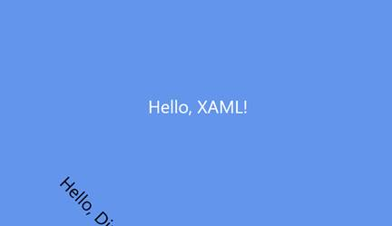

图 22:旋转


图 23:转换的顺序

在图 22 中，文本几乎完全旋转出屏幕。旋转的原点是(0，0)，屏幕的左上角(创建矩阵的调用中的第二个参数)。图 23 说明了导致文本从屏幕上旋转一半的转换顺序:

比例变换

缩放将乘数应用于一个或两个轴，以便缩小或放大渲染的形状。缩放变换需要三个参数，一个 x 乘数、一个 y 乘数和一个要缩放的原点。这段代码的输出应该如图 24 所示。

```cpp
    // Position the rendered text.
    Matrix3x2F translation = Matrix3x2F::Translation(
         m_windowBounds.Width / 2.0f - m_textMetrics.widthIncludingTrailingWhitespace / 2.0f + m_textPosition.X,
         m_windowBounds.Height / 2.0f - m_textMetrics.height / 2.0f + m_textPosition.Y
         );
    // This will make the text 3 times wider and half as high!
    Matrix3x2F scale = Matrix3x2F::Scale (
         3.0f, // Multiply x by 3
         0.5f, // Halve the y values

           D2D1::Point2F(  // Make the origin the middle of the text
                m_textMetrics.widthIncludingTrailingWhitespace / 2.0f,
                m_textMetrics.height / 2.0f)

```

);

//应用比例、平移和方向

m _ d2d context-> SetTransform(scale * translation * m _ orientationontransform2d)；


图 24:缩放

标尺的原点是这样计算的，即文本从其中心点(字母 d)开始增大和缩小。我用蓝色标记了计算原点的代码。首先移动文本，然后应用比例会产生非常不同的结果，类似于旋转和平移:

```cpp
    // Position the rendered text.
    Matrix3x2F translation = Matrix3x2F::Translation(
         m_windowBounds.Width / 2.0f - m_textMetrics.widthIncludingTrailingWhitespace / 2.0f + m_textPosition.X,
         m_windowBounds.Height / 2.0f - m_textMetrics.height / 2.0f + m_textPosition.Y
         );

         // This will make the text 3 times wider and half as high!
    Matrix3x2F scale = Matrix3x2F::Scale (
         3.0f, // Multiply x by 3
         0.5f, // Halve the y values
         D2D1::Point2F(  // Make the origin the middle of the text
              m_textMetrics.widthIncludingTrailingWhitespace / 2.0f,
              m_textMetrics.height / 2.0f)
         );

         m_d2dContext->SetTransform(translation * scale * m_orientationTransform2D);

```

首先使用`translation`矩阵将文本翻译到屏幕中心。应用`scale`矩阵时，文本的当前位置在 x 轴乘以 3.0f，在 y 轴减半(乘以 0.5f)。这导致文本完全离开屏幕。我已经在图 25 中将屏幕右侧之外的区域描绘成深蓝色，因此我们可以看到我们的文本去了哪里。

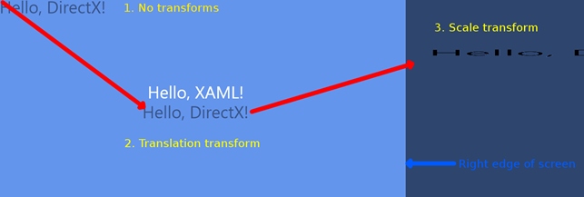

图 25:转换顺序 2

像旋转矩阵一样，比例矩阵需要指定原点。原点是在整个生长和收缩过程中保持不变的点。在前面的例子中，它是文本的中心，但是它可以是任何点，甚至是文本边界之外的点。例如，如果我们将原点更改为文本的右上角，我们可以看到它不再从中心开始增长和收缩，而是向左和向下。

```cpp
    // Position the rendered text.
    Matrix3x2F translation = Matrix3x2F::Translation(
         m_windowBounds.Width / 2.0f - m_textMetrics.widthIncludingTrailingWhitespace / 2.0f + m_textPosition.X,
         m_windowBounds.Height / 2.0f - m_textMetrics.height / 2.0f + m_textPosition.Y
         );
         // This will make the text 3 times wider and half as high!
         Matrix3x2F scale = Matrix3x2F::Scale (
              3.0f, // Multiply X by 3
              0.5f, // Halve the y values
              D2D1::Point2F(  // Make the origin the top right corner
                    m_textMetrics.widthIncludingTrailingWhitespace,
                    0.0f)
              );

         // Apply the scale, then the transform, and then the orientation
         m_d2dContext->SetTransform(scale * translation * m_orientationTransform2D);

```


图 26:缩放

原点在图 26 中保持不变。文本沿 y 轴挤压，沿 x 轴拉伸。如果您在平移后应用缩放，那么平移也会被缩放。

|  | 注意:Direct2D 中还有其他变换可以用来产生各种效果。Matrix3x2F::Identity()是具有原始值或默认值的矩阵。它可以用来重置转换。偏斜矩阵也很有趣；它可以用来在二维数据上产生一些简单的透视变换。 |

### 翻译散点图

既然我们已经了解了如何变换我们正在绘制的对象，我们就可以修复散点图了。默认情况下，计算机将假设左上角是原点，y 轴向下向右增加。我们希望我们的原点在屏幕的左下角，我们希望 y 轴值在屏幕上向上增加。

为了修正散点图，我们可以应用两个矩阵，一个比例矩阵和一个平移。比例矩阵将所有 y 值乘以-1.0f，从而反转 y 轴。在翻转 y 轴时，我们已经将屏幕上方的所有数据向上翻转。平移矩阵可以用来增加屏幕的高度，所以我们再次查看数据。

```cpp
    void GraphRenderer::Render()
    {
    m_d2dContext->BeginDraw();

    // Reset the transform matrix so our background does not pan
    m_d2dContext->SetTransform(m_orientationTransform2D);
    // Render the background
    m_gradientBackground->Render(m_d2dContext);

      // The scale matrix inverts the y-axis
      Matrix3x2F scale = Matrix3x2F::Scale(1.0f, -1.0f, D2D1::Point2F(0.0f, 0.0f));

      // The pan matrix still pans but it also adds the height of the screen
      Matrix3x2F panMatrix = Matrix3x2F::Translation(m_pan.X, m_pan.Y +
           m_d2dContext->GetSize().height);

      // Apply the scale first
      m_d2dContext->SetTransform(scale*panMatrix*m_orientationTransform2D);

```

//

//在此绘制对象

//

//渲染图形变量

m _ graph variable-> Render(m _ d2d context)；

//忽略 D2DERR_RECREATE_TARGET 错误

hresult HR = m _ D2 dcocontext-> end raw()；

if (hr！= D2DERR _ RECREATE _ TARGET)DX::ThrowIfFailed(HR)；

}

在运行应用程序之前，我们还需要调整`m_pan`成员变量的初始起始位置。这是在`GraphRenderer:CreateWindowSizeDependentResources`方法中指定的，x 值可以保持不变，但是 y 值必须改变，因为我们翻转了轴。

```cpp
    void GraphRenderer::CreateWindowSizeDependentResources() {
    DirectXBase::CreateWindowSizeDependentResources();

    // Create window size resources for gradient background
    m_gradientBackground->CreateWindowSizeDependentResources(m_d2dContext);

    // Set the initial pan value so the lowest node is visible in the corner
    m_pan.X = -m_graphVariable->GetMinX();

      m_pan.Y = m_graphVariable->GetMinY();

```

}

运行应用程序后，您现在应该看到原点在左下角，y 轴向上增加，与普通图形完全相同。


图 27:翻转 Y 轴的散点图

## 第六章:无限的线和轴

在本节中，我们将介绍一种渲染无限线的方法。我将使用渲染在原点相交的图表轴的例子。散点图和折线图通常有原点的概念，即图表坐标中的点(0，0)。有时这个点非常重要，我们会在图表上显示为两条相交的线:一条代表 x 轴的 0 点，另一条代表 y 轴的 0 点。

向项目中添加两个文件，Axis . h 和 Axes.cpp。

```cpp
    // Axes.h
    #pragmaonce
    #include "DirectXBase.h"
    // This class represents a graph's axes as two perpendicular lines
    class Axes {
         ID2D1SolidColorBrush* m_solidBrush; // Brush to draw with
         float m_lineThickness;    // Thickness in pixels
         float m_opacity;          // Opacity, 0.0f is invisible 1.0f is solid
         D2D1::ColorF m_color;     // The color of the lines

    public:
         // Public constructor
         Axes(D2D1::ColorF col, float thickness, float opacity);

         // Create the solid brush to draw with
         void CreateDeviceDependentResources
              (Microsoft::WRL::ComPtr<ID2D1DeviceContext> context);

         // The render method needs to know the panning and scaling
         void Render(Microsoft::WRL::ComPtr<ID2D1DeviceContext> context,
              float panX, float panY, float scaleX, float scaleY);
    };

```

```cpp
    // Axes.cpp
    #include "pch.h"
    #include "Axes.h"
    using namespace D2D1;
    using namespace DirectX;
    Axes::Axes(D2D1::ColorF col, float thickness = 3.0f, float opacity = 1.0f): m_color(0)
    {
    // Save these settings to member variables so
    // they can create the brush later:
    this->m_color = col;
    this->m_lineThickness = thickness;
    this->m_opacity = opacity;
    }

    void Axes::CreateDeviceDependentResources(
    Microsoft::WRL::ComPtr<ID2D1DeviceContext> context){
    // Create the solid color brush
    DX::ThrowIfFailed(context->CreateSolidColorBrush(
         m_color, D2D1::BrushProperties(m_opacity), &m_solidBrush));
    }

    void Axes::Render(Microsoft::WRL::ComPtr<ID2D1DeviceContext> context, float panX, float panY, float scaleX, float scaleY) {
    // Draw infinite vertical line with 0.0f as the x-coordinate
    context->DrawLine(
         D2D1::Point2F(
              0.0f,           // Horizontal axis
              (-context->GetSize().height - panY) / scaleY // Top of the screen
              ),
         D2D1::Point2F(
              0.0f,           // Horizontal axis
              (-panY) / scaleY     // Bottom of the screen
              ),
         m_solidBrush,
         m_lineThickness/scaleX);

    // Draw infinite horizontal line with 0.0f as the y-coordinate
    context->DrawLine(
         D2D1::Point2F(
              -(panX)/scaleX, // Left side of screen
              0.0f                      // Vertical axis
              ),
         D2D1::Point2F(
              (context->GetSize().width - panX)/scaleX, // Right side of screen
              0.0f                      // Vertical axis
              ),
         m_solidBrush,
         m_lineThickness/scaleY);
    }

```

构造函数将一些设置保存到成员变量中。`CreateDeviceDependentResources`方法创建一个画笔来绘制线条。

轴线理论上是无限长的。用户在图形平面上向左、向右、向上或向下平移多远并不重要，这些线的端点永远不应该可见。为了达到这个效果，我们画了两条线，一条用于 x 轴，另一条用于 y 轴。水平线(标记 y 轴的 0 点)与屏幕宽度相同，垂直线(标记 x 轴的 0 点)与屏幕高度相同。这样，无论图表平移多远，如果轴线可见，它将始终绘制在整个屏幕上。当实际上这些线很短时，这将显示为无限长。

线条的实际绘制是通过使用上下文的`DrawLine`方法来实现的。这个方法需要两点，一个笔刷和一个线条粗细。这条线是用来连接这两点的。

线条的粗细是静态的。我假设即使用户缩小了几千个单位，原点线仍然应该是可见的。同样，如果用户放大原点周围的微小点，它不应该缩放到缩放比例并占据整个屏幕。我通过用当前比例或缩放比例除以厚度，使我们的原点成为一个标准的像素厚度，而不管缩放系数如何。在代码中，我已经手动取消了平移和缩放来实现这一点。

|  | 注意:当绘制厚度不是 1.0f 的线时，线的中心(纵向)将位于指定的坐标。这与左上角绘制在指定坐标的位图不同。这意味着，如果绘制一条从(0，0)到(100，0)的厚度为 30 的线，该线的上边缘将绘制在(0，(-30/2))处，下边缘将绘制在(0，(30/2))处。 |

我还加了一个保证金。这是距离屏幕边缘的距离，以像素为单位。它可以用来产生十字准线原点，而不是无限长的轴。要实例化我们新的`Axes`类的一个对象，将头部添加到 GraphRenderer.h 文件中。我在下面的代码中包含了一个渐变背景和散点图，并且我用蓝色突出显示了处理原点的代码。

```cpp
    //
    // Additional headers for graph objects here
    //
    #include "GradientBackground.h"
    #include "ScatterPlot.h"

      #include "Axes.h"

```

另外，向该文件添加一个 Axes 成员变量。

```cpp
    private:
          // Global pan value for moving the chart with the mouse
          Windows::Foundation::Point m_pan;
          // Background
          GradientBackground *m_gradientBackground;

            // Axes
            Axes* m_axes;

```

//数据

scatterplot * m _ scatterplot

在 GraphRenderer 的构造函数中创建图表对象。这些可以以任何顺序创建。我最后创造了斧头。

```cpp
    GraphRenderer::GraphRenderer() {
    // Create the gradient background:
    D2D1_COLOR_F colors[] = {
          D2D1::ColorF(ColorF::PaleGoldenrod), D2D1::ColorF(ColorF::PaleTurquoise),
          D2D1::ColorF(0.7f, 0.7f, 1.0f, 1.0f) };

    float stops[] = { 0.0f, 0.5f, 1.0f };
    m_gradientBackground = new GradientBackground(colors, stops, 3);

    // Create the scatter plot:
    const int count = 25;

    float* x = new float[count];
    float* y = new float[count];

    // Create random points to plot, these
    // would usually be read from some data source:
    for(int i = 0; i < count; i++) {
          x[i] = (float)((rand() % 2000) - 1000);
          y[i] = (float)((rand() % 1000) - 500);
          }

    m_scatterPlot = new ScatterPlot(x, y, 10.0f, D2D1::ColorF::Chocolate, NodeShape::Circle, count);

    delete[] x;
    delete[] y;

      // Create the Axes
      m_axes = new Axes(D2D1::ColorF::Black, 5.0f, 0.75f);

```

}

调用 Axes 的`CreateDeviceResources`方法，这样它就可以初始化它的纯色画笔。

```cpp
    void GraphRenderer::CreateDeviceResources() {
    DirectXBase::CreateDeviceResources();

    // Create the brush for the scatter plot:
    m_scatterPlot->CreateDeviceDependentResources(m_d2dContext);

      // Create the brush for the Axes
      m_axes->CreateDeviceDependentResources(m_d2dContext);

```

}

最后，在 GraphRenderer 的`Render`方法中调用原点的渲染方法。

```cpp
    void GraphRenderer::Render() {
    m_d2dContext->BeginDraw();
    // Clear to some color other than blank
    m_d2dContext->Clear(D2D1::ColorF(ColorF::CornflowerBlue));
    // Reset the transform matrix so our background does not pan
    m_d2dContext->SetTransform(m_orientationTransform2D);
    // Draw the background
    m_gradientBackground->Render(m_d2dContext);
    // The scale matrix inverts the y-axis
    Matrix3x2F scale = Matrix3x2F::Scale(1.0f, -1.0f, D2D1::Point2F(0.0f, 0.0f));
    // The pans added to the screen height so origin is at lower left
    Matrix3x2F panMatrix = Matrix3x2F::Translation
          (m_pan.X, m_pan.Y + m_d2dContext->GetSize().height);
    // Apply the scale and the pan
    m_d2dContext->SetTransform(scale*panMatrix*m_orientationTransform2D);

      // Draw the axes
      m_axes->Render(m_d2dContext, m_pan.X, m_pan.Y, 1.0f, -1.0f);

```

//

//在此绘制对象

//

m _ scatter plot-> render(m _ D2 dconte)；

//忽略 D2DERR_RECREATE_TARGET 错误

hresult HR = m _ D2 dcocontext-> end raw()；

if (hr！= D2DERR _ RECREATE _ TARGET)DX::ThrowIfFailed(HR)；

}

运行应用程序并向右上方平移一点，您将看到原点和散点图。这是我们的图表世界坐标中的(0，0)点，如图 28 所示。

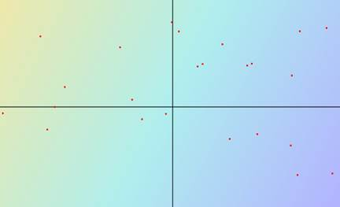

图 28:轴线

## 第 7 章:显示 FPS(每秒帧数)

每秒帧数(FPS)是 DirectX 刷新或渲染场景的速率。在本节中，我们将研究如何在图表的左上角显示 FPS。这将提供一个计算 FPS 以及渲染文本的例子。文本在图表应用程序中非常重要，可以用来呈现购物车的标题、节点位置、轴标签和许多其他东西。文本渲染非常慢，所以尽量减少文本量，使其少于 200 个左右的字符串。坐标轴的标签、图表标题、节点值和许多其他东西都可以用文本来呈现，但是如果您呈现成千上万个字符串，FPS 将很快下降。

我们将建立在上一章的图表上，该图表显示了轴线。当运行`GraphRenderer::Update`方法时，向`GraphRenderer`类添加两个成员变量浮点数，用于记录`BasicTimer`中的时间。此外，添加一个`IDWriteTextFormat`对象，它将保存我们的 FPS 输出格式，以及一个黑色画笔，它将用于绘制文本。

```cpp
    private:
          // Global pan value for moving the chart with the mouse
          Windows::Foundation::Point m_pan;

            // Member variables for displaying FPS
            float m_timeDelta;      // Time since last update call
            float m_timeTotal;      // Total time of application
            Microsoft::WRL::ComPtr<IDWriteTextFormat> m_textFormat;
            Microsoft::WRL::ComPtr<ID2D1SolidColorBrush> m_blackBrush;

```

在`GraphRenderer::CreateDeviceIndependentResources`资源方法中创建文本格式实例。文本格式用于指定字体、大小和其他几种文本格式选项。

```cpp
    void GraphRenderer::CreateDeviceIndependentResources() {
    DirectXBase::CreateDeviceIndependentResources();

      DX::ThrowIfFailed(
            m_dwriteFactory->CreateTextFormat(
                  L"Segoe UI",
                  nullptr,
                  DWRITE_FONT_WEIGHT_NORMAL,
                  DWRITE_FONT_STYLE_NORMAL,
                  DWRITE_FONT_STRETCH_NORMAL,
                  42.0f,
                  L"en-US",
                  &m_textFormat
                  )
            );

```

}

用`CreateDeviceDependentResources`方法创建用于绘制文本的画笔。

```cpp
    void GraphRenderer::CreateDeviceResources() {
    DirectXBase::CreateDeviceResources();

    // Call the create device resources for our graph variable
    m_graphVariable->CreateDeviceDependentResources(m_d2dContext);

    // Create the brush for the origin
    m_axes->CreateDeviceDependentResources(m_d2dContext);

      // Create the solid brush for the text
      DX::ThrowIfFailed(
           m_d2dContext->CreateSolidColorBrush(ColorF(ColorF::Black),&m_blackBrush));

```

}

向 GraphRenderer 的代码文件中添加一个`#include <string>`。这为我们提供了将浮点数附加到字符串中以显示每秒帧数的功能。

```cpp
    // GraphRenderer.cpp
    #include "pch.h"

    #include <string>

```

#包括“GraphRenderer.h”

在 GraphRenderer 的代码文件中记录作为参数传递给`Update`方法的时间(`m_timeTotal`和`m_timeDelta`)。`m_timeTotal`是程序启动后经过的总毫秒数，`timeDelta`是最后一次调用`Update`后经过的时间。

```cpp
    void GraphRenderer::Update(float timeTotal, float timeDelta) {

            // Record the times for displaying:
            m_timeDelta = timeDelta;
            m_timeTotal = timeTotal;

```

}

在`GraphRenderer::Render`方法中，通过将时间附加到标签(总时间和 FPS)来创建字符串。m_timeDelta ( `1.0f/m_timeDelta`)的倒数是上次更新的速度。我已经将这个值四舍五入为整数。在绘制完所有图形对象后渲染我们的新 FPS 字符串是一个好主意，这样它就不会被遮挡。

```cpp
    //
    // Draw objects here
    //
    // Render the graph variable
    m_graphVariable->Render(m_d2dContext);

      // Reset the transform matrix so the time and FPS does not pan or zoom
      m_d2dContext->SetTransform(m_orientationTransform2D);
      // Set up the string to print:
      std::wstring s = std::wstring(
           L"Total Time: ") + std::to_wstring(m_timeTotal) +
           std::wstring(L" FPS: ") + std::to_wstring(
                (int)(0.5f+1.0f/m_timeDelta)); // FPS rounded to nearest int
      // Render the string in the top left corner
      m_d2dContext->DrawText(s.c_str(), s.length(), m_textFormat.Get(),
           D2D1::RectF(0, 0, 600, 32), m_blackBrush.Get());

```

//忽略 D2DERR_RECREATE_TARGET 错误

运行应用程序时，您会注意到计时器仅在平移图形时更新。这对于在 WinRT 设备上省电是一件非常好的事情，但是为了测试我们的图表渲染的性能，我们希望将应用程序切换到实时。要切换到实时(重复更新)，打开 DirectXPage.cpp 文件，注释掉导致程序基于`m_renderNeeded`成员变量更新的“if”条件。当`CompositionTarget::Rendering`事件触发时，调用`DirectXPage`的`OnRendering`方法。`CompositionTarget`是 XAML 控制被渲染到的表面。

```cpp
    void DirectXPage::OnRendering(Object^ sender, Object^ args) {

            // if (m_renderNeeded)

```

{

m _ timer-> Update()；

m _ 渲染器->更新(m_timer->总计，m_timer->增量)；

m _ renderer-> Render()；

m _ renderer-> Present()；

m _ renderNeeded = false

}

}

现在，当您运行应用程序时，它应该会持续更新。FPS 每秒更新多次，有点难读。我们可以通过在 GraphRenderer 的更新中添加一个静态计数器和“if”条件来降低速度并只每 16 帧更新一次计数器。

```cpp
    void GraphRenderer::Update(float timeTotal, float timeDelta) {

      static int fpsCounter = -1;  // Start at -1 so frame 0 updates timers
      fpsCounter++;
      if((fpsCounter & 15) == 0) { // Update every 16 frames

```

//记录在渲染方法中显示的时间:

m _ 时间差=时间差；

m _ timeTotal = timeTotal

}

}

|  | 提示:尽可能使用布尔运算和移位来代替整数除法。CPU 需要非常快速地运行更新方法。最好在更新和渲染方法中最小化除法、模数、平方根、三角学和所有其他复杂函数。其中一些复杂函数的执行速度比简单的布尔指令慢几百倍。优化编译器很可能足够聪明，能够意识到“x%16”和“x&15”是一样的，但是每个编译器都是不同的，当有这样一个简单的优化时，最好不要信任编译器。 |

## 第八章:折线图

我们在原点稍微看了一下渲染线，但是现在我们将检查渲染许多线，我们将使用折线图作为示例。折线图将数据显示为一系列相连的线条。这些线连接连续的节点或点，并以散点图没有的方式描绘数据的连续性或时间顺序。通常，x 轴被视为时间，从左边的早期点到右边的后期点，如图 29 所示。

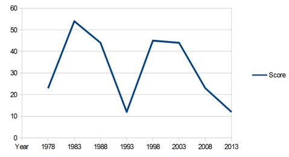

图 29:折线图

图 29 是一个简单的折线图，使用年份作为 x 轴。它从 1978 年发展到 2013 年，每年都会绘制一个得分变量，并与前一点连成一条直线。重要的区别在于，在渲染线之前，数据必须按 x 轴排序；否则，可能会发生类似图 30 的情况。

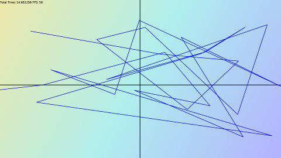

图 30:带有无序 X 轴的折线图

图 30 当然是一个折线图，但是这条线是相对于 x 轴值前后绘制的，因为节点是以随机顺序创建的。要正确呈现 x 轴无序数据的折线图，必须对数据进行排序。我在下面的代码中使用了 STL(标准模板库)稳定排序。

|  | 提示:始终在更新和渲染方法之外对数据进行排序。如果在这些关键方法之外对数据进行排序，排序算法的速度在很大程度上可以忽略不计。现代硬件可以在几秒钟内轻松地对 1，000，000 个节点进行排序，但是我们的 Update 或 Render 方法无法承受几秒钟的时间。 |

向项目中添加两个文件，LineChart.h 和 LineChart.cpp。

```cpp
    // LineChart.h
    #pragmaonce
    #include "DirectXBase.h"
    #include "GraphVariable.h"

    // This class represents a variable rendered as a line
    class LineChart: public GraphVariable {
         ID2D1SolidColorBrush* m_solidBrush; // Brush to draw with
         float m_lineThickness;    // Thickness in pixels
         D2D1::ColorF m_color;     // The color of the line

         // Method to stable-sort the data by the x-axis
         void SortData();

    public:
         // Public constructor
         LineChart(float* x, float *y, int count, D2D1::ColorF col, float thickness);

         // Create the solid brush to draw with
         virtual void CreateDeviceDependentResources
              (Microsoft::WRL::ComPtr<ID2D1DeviceContext> context) override;

         // The main render method of the line class
         virtual void Render(Microsoft::WRL::ComPtr<ID2D1DeviceContext> context) override;
    };

```

```cpp
    // LineChart.cpp
    #include "pch.h"
    #include "LineChart.h"
    #include <vector>
    #include <algorithm>
    using namespace D2D1;
    using namespace DirectX;
    // Comparison method used by the stable-sort below
    bool ComparePoints(D2D1_POINT_2F a, D2D1_POINT_2F b) {
    return a.x < b.x; // Sort on x values
    }

    LineChart::LineChart(float* x, float *y, int count,
         D2D1::ColorF col, float thickness = 3.0f): m_color(0), GraphVariable(x, y, count) {
    // Save these settings to member variables to
    // create the brush later:
    this->m_color = col;
    this->m_lineThickness = thickness;

    // Sort the data by the x-axis
    SortData();
    }

    void LineChart::SortData()
    {
    // Sort the data by the x-axis
    std::vector<D2D1_POINT_2F> sortedNodes(m_points, m_points + m_nodeCount);

    // Note the use of the stable sort, using an unstable sort
    // like Quicksort will produce unexpected results!
    std::stable_sort(sortedNodes.begin(), sortedNodes.end(), ComparePoints);

    // Copy the sorted points back to the m_pointsArray
    int counter = 0;
    for(std::vector<D2D1_POINT_2F>::iterator nodeIterator = sortedNodes.begin();
         nodeIterator != sortedNodes.end(); nodeIterator++, counter++) {
         m_points[counter].x = (*nodeIterator).x;
         m_points[counter].y = (*nodeIterator).y;
         }
    }

    void LineChart::CreateDeviceDependentResources(
         Microsoft::WRL::ComPtr<ID2D1DeviceContext> context) {
    // Create the solid color brush
    DX::ThrowIfFailed(context->CreateSolidColorBrush(
         m_color, D2D1::BrushProperties(1.0f), &m_solidBrush));
    }

```

为了创建和渲染折线图，我们可以替换用来创建散点图的代码。在折线图顶部渲染散点图节点也很常见，所以我也将包含散点图对象。散点图节点将用于强调折线图。将标题添加到 GraphRenderer.h 文件中。

```cpp
    //
    // Additional headers for graph objects here
    //
    #include "GradientBackground.h"
    #include "ScatterPlot.h"

      #include "LineChart.h"

```

#包括“轴. h”

向 GraphRenderer 类添加一个名为 m_lineChart 的成员变量。

```cpp
         // Member variables for displaying FPS
         float m_timeDelta;   // Time since last update call
         float m_timeTotal;   // Total time of application
         Microsoft::WRL::ComPtr<IDWriteTextFormat> m_textFormat;
         Microsoft::WRL::ComPtr<ID2D1SolidColorBrush> m_blackBrush;

         // Solid background
         GradientBackground* m_gradientBackground;

         // Plottable data
         GraphVariable* m_graphVariable;

           GraphVariable* m_lineChart;

```

//轴

轴* m _ axes

在 GraphRenderer 构造函数中调用 LineChart 对象的构造函数。我正在用相同的数据和颜色绘制线图和散点图。

```cpp
    GraphRenderer::GraphRenderer()
    {
    // Create the gradient background:
    D2D1_COLOR_F colors[] = {
         D2D1::ColorF(ColorF::PaleGoldenrod),
         D2D1::ColorF(ColorF::PaleTurquoise),
         D2D1::ColorF(0.7f, 0.7f, 1.0f, 1.0f)
         };
    float stops[] = { 0.0f, 0.5f, 1.0f };
    m_gradientBackground = new GradientBackground(colors, stops, 3);

    // Create the scatter plot:
    const int count = 25;     // Create 25 nodes
    float* x = new float[count];
    float* y = new float[count];

    // Create random points to plot, these
    // would usually be read from some data source:
    for(int i = 0; i < count; i++) {
         x[i] = (float)(rand() % 2000) - 1000;
         y[i] = (float)(rand() % 1000) - 500;
         }

    m_graphVariable = new ScatterPlot(x, y, 10.0f,
         D2D1::ColorF::Chocolate,
         NodeShape::Circle, count);

      // Create the line chart
      m_lineChart = new LineChart(x, y, count, D2D1::ColorF::Chocolate, 5.0f);

```

删除[]x；

删除[]y；

//创建轴线

m_axes =新 Axes(D2D1::ColorF::Black，5.0f，0.75 f)；

}

调用折线图的`CreateDeviceDependentResources`方法创建画线时使用的画笔。

```cpp
    void GraphRenderer::CreateDeviceResources() {
    DirectXBase::CreateDeviceResources();

    // Call the create device resources for our graph variable
    m_graphVariable->CreateDeviceDependentResources(m_d2dContext);

      // Create device resources for the line chart
      m_lineChart->CreateDeviceDependentResources(m_d2dContext);

```

//为轴创建画笔

m _ axes-> create device dependents resources(m _ D2 dcontet)：

//为文本创建实心画笔

DX::throwifffailed(

m _ D2 dconte-> createsolidcolorbrush(color f::black)，& m _ black rush)；

}

最后，在绘制散点图节点之前，调用`GraphRenderer::Render`方法中的`m_lineChart::Render`方法。

```cpp
    //
    // Draw objects here
    //
    // Render the graph variable(s)

      m_lineChart->Render(m_d2dContext);

```

m _ graph variable-> Render(m _ d2d context)；

运行应用程序时，您应该会看到类似图 31 的内容。

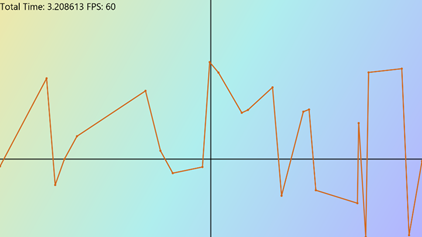

图 31:折线图

x 轴上的数据可能已经排序了(因为它可能是按时间顺序收集的)，在这种情况下，它根本不需要排序。`LineChart`类应该是相当不言自明的。我们已经根据传递给构造函数的数据和 render 方法创建了一个点列表，并将这些点与一组线连接起来。

## 第 9 章:在多个 XAML 页面之间导航

到目前为止，我们的图表只有一个 XAML 页面，由 Direct2D 绘制。通常需要包含多个 XAML 页面。我将使用一个设置页面的例子，用户可以在其中为折线图选择一些选项。这将是一个完全独立于主 XAML 页面的页面，每个图表对象都可以有自己的设置 XAML 页面，可以用同样的方式制作。

在一个简单的 XAML 项目中，程序员可以使用简单的`Frame->Navigate(destination)`语法。这在带有 Direct2D 的应用程序中是不可能的，因为 Frame 成员变量将为空(框架根本不会设置它)。程序员可以使用以下语法手动导航，而不是使用框架。

```cpp
    Window::Current->Content = ref new SomeOtherXAMLPage();// Reference another page
    Window::Current->Activate();

```

第一行将当前窗口的内容设置为另一个 XAML 页面，第二行激活它。激活一个 XAML 页面意味着把它带到前面，给它焦点，让它接收输入事件。

这个新的 XAML 子页面很可能需要返回到原始页面。例如，如果它正在更改图表中的某些设置，我们将需要在用户更改设置后再次显示图表。我们可以使用前面的代码创建原始页面的另一个副本(当用户关闭子页面时执行)，但是这将是浪费的，并且可能导致崩溃(因为我们将重复地重新创建主 DirectX 页面，并且永远不会关闭它们)。我们希望恢复原始页面并赋予其焦点，而不是创建多个副本。有很多方法可以做到这一点。其中一个最简单的方法是给新页面的构造函数一个父 XAML 页面的句柄。

```cpp
    Window::Current->Content=ref new SomeOtherXAMLPage(this);//Reference parent page

```

第二页将传递到其构造函数中的“this”指针保存为`m_myParent`，当第二页关闭时，它不会重新创建父级，而是从这个父级句柄恢复它。

```cpp
    Window::Current->Content = m_myParent; // Give the parent the focus
    Window::Current->Activate();

```

传递给子页的“this”指针可以具有尽可能通用的类型，以允许几乎任何窗口打开任何子窗口。`Windows::UI::Xaml::UIElement^`是个不错的选择。

我们现在将通过创建一个允许用户编辑折线图设置的 XAML 页面来检查添加第二个页面，然后将控制返回到主`DirectXPage`类来绘制更新的图表。要向您的解决方案添加新的空白 XAML 页面，请右键单击该解决方案并单击**添加**，然后单击上下文菜单上的**新项目**。

点击左侧面板的 **Windows Store** ，然后点击中间面板的**空白页**，输入新页面的名称。在这个例子中，我使用了编辑线，如图 32 所示。


图 32:添加空白页

一旦 Visual Studio 创建了新的 XAML 页面，打开标题(本例中为`EditLine.xaml.h`)并向构造函数添加一个参数，指定它需要一个`Windows::UI::Xaml::UIElement^`。另外，添加一个名为`m_myParent`的相同类型的成员变量。

```cpp
    //
    // EditLine.xaml.h
    // Declaration of the EditLine class
    //
    #pragma once
    #include "EditLine.g.h"
    namespace GraphPlotting
    {
         /// <summary>
         /// Empty page that can be used on its own or navigated to within a Frame.
         /// </summary>
         [Windows::Foundation::Metadata::WebHostHidden]
         public ref class EditLine sealed{
         public:

                EditLine(Windows::UI::Xaml::UIElement^ myParent);

```

受保护:

虚拟空间

(windows::ui::xaml::navigation::navigationeventargs^ e)超越；

私人:

windows::ui::xaml::uielement ^ m _ my parent；

};

}

在解决方案资源管理器中双击新的 xaml 页面(本例中为 EditLine.xaml 文件)，Visual Studio 将打开 XAML 设计器的空白页。在左上角添加一个按钮。这将是我们的后退按钮，将允许用户导航回主 DirectX 页面，见图 33。

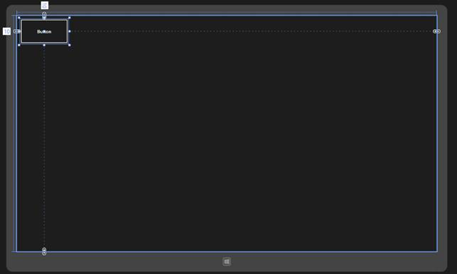

图 33:添加按钮

在 XAML 代码部分，您可以设置新按钮的名称、内容和字体大小。

```cpp
    <Page
        x:Class="GraphPlotting.EditLine"

        xmlns:x="http://schemas.microsoft.com/winfx/2006/xaml"
        xmlns:local="using:GraphPlotting"
        xmlns:d="http://schemas.microsoft.com/expression/blend/2008"
        xmlns:mc="http://schemas.openxmlformats.org/markup-compatibility/2006"
        mc:Ignorable="d">

        <Grid Background="{StaticResource ApplicationPageBackgroundThemeBrush}">
            <Button Name="btnBack" Content="Back" FontSize="32"
              HorizontalAlignment="Left" Height="82" Margin="10,10,0,0"
              VerticalAlignment="Top" Width="157"/>

        </Grid>
    </Page>

```

双击设计器中的新建按钮，Visual Studio 将编写`OnClicked`事件并带我们进入代码。我们希望当用户单击后退按钮时，父级被激活。

```cpp
    void GraphPlotting::EditLine::btnBack_Click(Platform::Object^ sender,
              Windows::UI::Xaml::RoutedEventArgs^ e){

           Window::Current->Content = m_myParent; // Give the parent the focus
           Window::Current->Activate();

```

}

更改页面的构造函数，使其采用新的父 UIElement 作为参数，这是我们在标题中指定的。将句柄保存为类的`m_myParent`成员变量。

```cpp
    EditLine::EditLine(Windows::UI::Xaml::UIElement^ myParent){
         InitializeComponent();

           this->m_myParent = myParent;

```

}

现在我们已经设置了打开和关闭子页面，我们可以设计用户请求编辑折线图的方法(本例中是应用程序栏中的一个按钮)。在解决方案资源管理器中双击该文件，将其打开。这将把你带到 XAML 设计师的主 DirectXPage。将带有按钮的应用程序栏添加到 DirectXPage XAML 文件中。

```cpp
    <Page
        x:Class="GraphPlotting.DirectXPage"

        xmlns:x="http://schemas.microsoft.com/winfx/2006/xaml"
        xmlns:local="using:GraphPlotting"
        xmlns:d="http://schemas.microsoft.com/expression/blend/2008"
        xmlns:mc="http://schemas.openxmlformats.org/markup-compatibility/2006"
        mc:Ignorable="d">
        <SwapChainBackgroundPanel x:Name="SwapChainPanel" PointerMoved="OnPointerMoved"
              PointerReleased="OnPointerReleased">
        </SwapChainBackgroundPanel>

          <Page.BottomAppBar>
              <AppBar Padding="10, 0, 10, 0">
                  <Button Name="btnEditLine" Content="Edit Line" FontSize="24"
                      HorizontalAlignment="Center" Width="240"/>
              </AppBar>
          </Page.BottomAppBar>

```

|  | 提示:在 XAML 代码窗口中使用 AppBar 和其他几种对象类型比在主设计器窗口中容易得多，因为这些控件在设计器中通常是不可见的。要让设计器窗口显示一个不可见的控件，可以在 XAML 代码中选择该控件的开始标记。 |

双击设计器(btnEditLine)中的新建按钮，Visual Studio 将添加`OnClicked`事件并带我们进入代码。首先要做的是在这个文件的顶部#包含对 EditLine.xaml.h 头的引用。

```cpp
    // DirectXPage.xaml.cpp
    #include "pch.h"
    #include "DirectXPage.xaml.h"

      #include "EditLine.xaml.h"

```

接下来，向下滚动到按钮点击事件，这样我们就可以添加代码来创建和激活编辑行窗口。

```cpp
    void GraphPlotting::DirectXPage::btnEditLine_Click(Platform::Object^ sender,
              Windows::UI::Xaml::RoutedEventArgs^ e){
         Window::Current->Content = ref new EditLine(this);
         Window::Current->Activate();
         }

```

运行应用程序后，您应该能够通过右键单击(或在触摸屏设备上用指针滑动)调出应用程序栏。单击按钮后，您将看到“编辑线条”页面，您可以从该页面单击“上一步”按钮返回图形渲染器。

作为使用新的 XAML 页面更改图形对象值的示例，我们将允许用户设置折线图的厚度。为 LineChart.h 文件中的线条粗细向`LineChart`类添加一个公共的 getter 和 setter。

```cpp
    // Public constructor
         LineChart(float* x, float *y, int count, D2D1::ColorF col, float thickness);

         // Create the solid brush to draw with
         virtual void CreateDeviceDependentResources
              (Microsoft::WRL::ComPtr<ID2D1DeviceContext> context) override;

         // The main render method of the line class
         virtual void Render(Microsoft::WRL::ComPtr<ID2D1DeviceContext> context) override;

           // Getters and setters for line thickness
           void SetLineThickness(float newThickness) {
                m_lineThickness = newThickness;
                }

           float GetLineThickness() {
                return m_lineThickness;
                }

```

向 GraphRenderer.h 文件添加一个公共内部 getter，该文件返回类的折线图成员变量。

```cpp
    public:
         // Public constructor
         GraphRenderer();

         // DirectXBase methods.
         virtual void CreateDeviceIndependentResources() override;
         virtual void CreateDeviceResources() override;
         virtual void CreateWindowSizeDependentResources() override;
         virtual void Render() override;

         // Capture the pointer movements so the user can pan the chart
         void PointerMoved(Windows::Foundation::Point point);

         // Method for updating time-dependent objects.
         void Update(float timeTotal, float timeDelta);

      internal:
           LineChart* GetLine() {
                return (LineChart*) m_lineChart;
                }

```

在 EditLine.xaml.h 文件的折线图标题中添加#include。向构造函数添加一个指向折线图的新参数，将构造函数标记为内部，然后添加一个新的折线图指针成员变量来存储该参数。

```cpp
    //
    // EditLine.xaml.h
    // Declaration of the EditLine class
    //

    #pragmaonce
    #include "EditLine.g.h"

    #include "LineChart.h"

```

命名空间图表绘制[

///

 <summary>///可以单独使用或在框架内导航到的空白页面。

///

[Windows::Foundation::Metadata::WebHostHidden]

公共引用类编辑行已密封

{

公共:

内部:

editline(windows::ui::xaml::uielement ^ my parent，line chart * my line)；

受保护:

虚拟空间

(windows::ui::xaml::navigation::navigationeventargs^ e)超越；

私人:

windows::ui::xaml::uielement ^ m _ my parent；

折线图* m_myLine：

作废 btnback_click(platform::object^寄件人，

windows::ui::xaml::route deventrgs ^ e；

};

}

添加对 m_renderer::GetLine 方法的调用，并将其作为一个参数传递给 DirectXPage.xaml.cpp 文件的:btnEditLine _ Click 事件。

```cpp
    void GraphPlotting::DirectXPage::btnEditLine_Click(Platform::Object^ sender, Windows::UI::Xaml::RoutedEventArgs^ e) {
         Window::Current->Content = ref new EditLine(this, m_renderer->GetLine());
         Window::Current->Activate();
         }

```

向 EditLine.xaml 文件中添加滑块控件。这将用于设置线条的粗细。我称之为`sldLineThickness`。我还在下面的代码中向网格添加了一个文本块，用于为用户标记滑块。EditLine.xaml 文件的网格的完整代码如下:

```cpp
        <Grid Background="{StaticResource ApplicationPageBackgroundThemeBrush}">
            <Button Name="btnBack" Content="Back" FontSize="32" HorizontalAlignment="Left" Margin="10,10,0,0" VerticalAlignment="Top" Click="btnBack_Click"/>

          <Slider Name="sldLineThickness" HorizontalAlignment="Left" Margin="420,302,0,0"
                VerticalAlignment="Top" Width="573" Height="47" Minimum="1" Maximum="12"/>

          <TextBlock FontSize="32" HorizontalAlignment="Left" Margin="185,302,0,0"
                      TextWrapping="Wrap" Text="Line Thickness"
                      VerticalAlignment="Top"/>

```

修改 EditLine.xaml.cpp 文件中的构造函数代码，取一个`LineChart`参数，保存到`m_` `myLine`成员变量中。我还将滑块的初始值设置为与`myLine`参数的当前厚度相同。

```cpp
    EditLine::EditLine(Windows::UI::Xaml::UIElement^ myParent, LineChart* myLine)
    {
         InitializeComponent();
         this->m_myParent = myParent;

           this->m_myLine = myLine;
           this->sldLineThickness->Value = (int)myLine->GetLineThickness();

```

}

最后，在 EditLine.xaml.cpp 文件中的`btnBack_Click`事件方法中，就在将控制权交还给父窗口之前，我们可以调用折线图的设置线条粗细方法，将线条粗细设置为`sldLineThickness->Value`。

```cpp
    void GraphPlotting::EditLine::btnBack_Click(Platform::Object^ sender,
              Windows::UI::Xaml::RoutedEventArgs^ e)    {

           m_myLine->SetLineThickness((float)sldLineThickness->Value);

```

window::Current-> Content = m _ myParent；//给家长焦点

窗口::当前->激活()；

}

运行应用程序后，您应该能够通过移动滑块来设置折线图的厚度。本示例仅允许更改线条的粗细，但可以向页面添加其他控件，以允许编辑线条的其他方面。可以添加新的 XAML 页面来改变图表的任何方面。

## 第十章:打印 Direct2D

在本章中，我们将介绍如何将打印添加到标准的 Direct2D (XAML)应用程序中，用户可以通过选择设备图标从魅力栏激活该应用程序。我已经描述了如何将打印添加到一个新的 Direct2D (XAML)项目中，而不是将功能添加到我们现有的应用程序中，因为打印 Direct2D 适用于图形和图表数据之外。

|  | 注意:我在这里展示的大部分代码要么是基于微软的 Direct2Dapp 打印示例，要么是直接取自这个示例。微软示例被设计为独立的应用程序。在这个演练中，我们将研究如何向 Direct2D (XAML)应用程序添加打印，而不是编写一个全新的应用程序。如果您正从头开始一个新项目，那么在名为“Direct2Dapp 打印示例”的 Microsoft 示例之后，对应用程序的结构进行更紧密的建模可能是有益的请参阅附录 A，获取微软使用其示例代码的许可。 |

创建新的 Direct2D XAML 项目

创建新的 Direct2D (XAML)应用程序。即使您正在向现有项目添加打印功能，建议您使用新的 Direct2D (XAML)应用程序逐步完成此过程，以便熟悉 Direct2D 打印应用程序的结构。

打开文件，删除写着“你好，xaml”的文字本示例不会打印出 XAML 控件的内容。

|  | 注意:在本例中，XAML 控件与我们将要打印的 Direct2D 图形无关。如果您希望打印 XAML 控件，微软有一个单独的示例应用程序，名为“快速启动:从您的应用程序打印(使用 C#/VB/C++和 XAML 的 Windows Store 应用程序)。” |

**让你的应用程序多线程化**

Direct2D 打印发生在具有另一个设备上下文的单独线程上。还有一个单独的线程用于呈现打印预览。屏幕、预览和打印可以同时进行，而不会相互干扰。主 Direct2D 工厂必须是多线程创建的。创建多线程应用程序的选项是在 DirectXBase.cpp 文件的`CreateDeviceIndependentResources`方法中的 DirectXBase 类中设置的。

```cpp
    // These are the resources required independent of the device.
    void DirectXBase::CreateDeviceIndependentResources(){
         D2D1_FACTORY_OPTIONS options;
         ZeroMemory(&options, sizeof(D2D1_FACTORY_OPTIONS));
    #if defined(_DEBUG)
          // If the project is in a debug build, enable Direct2D debugging via SDK Layers.
         options.debugLevel = D2D1_DEBUG_LEVEL_INFORMATION;
    #endif
         DX::ThrowIfFailed(
              D2D1CreateFactory(

                      D2D1_FACTORY_TYPE_MULTI_THREADED,

```

__uuidof(ID2D1Factory1)，&options，&m_d2dFactory

)

);

**添加打印管理器**

在 DirectXPage.cpp 文件中的 DirectXPage 类顶部添加一个“使用命名空间”指令，以使用 Printing 命名空间。必须对此类进行其他几项更改。有关 DirectXPage 类的完整列表，请参见附录 B。

```cpp
    using namespace Windows::UI::Xaml::Media;
    using namespace Windows::UI::Xaml::Navigation;

      using namespace Windows::Graphics::Printing;

```

DirectXPage::DirectXPage():

将打印管理器成员变量添加到 DirectXPage.h 文件中的 DirectXPage 类中。

```cpp
    BasicTimer^ m_timer;     

           Windows::Graphics::Printing::PrintManager^ m_printManager;

```

};

**初始化打印管理器**

在 DirectXPage.cpp 文件中的 DirectXPage 类的构造函数中初始化打印管理器。这可能发生在另一个代码之后。我把它直接放在了 m_timer 的初始化下面。要初始化它，我们需要做两件事:获取当前程序的打印管理器，并注册一个事件处理程序，这样我们就知道用户何时请求打印什么。

```cpp
    m_timer = ref new BasicTimer();

      // Grab the print manager for the current view
      m_printManager = Windows::Graphics::Printing::PrintManager::GetForCurrentView();
      // Add an event handler to capture when the user requests a print task
      m_printManager->PrintTaskRequested +=
           ref new TypedEventHandler<PrintManager^, PrintTaskRequestedEventArgs^>(this,
           &DirectXPage::SetPrintTask);

```

在这段代码中，我们指定了一个名为 SetPrintTask 的处理程序方法，打印管理器将使用它来执行新的打印任务。

**创建设置打印任务方法**

这个方法非常重要，因为它决定了用户何时请求从魅力栏打印东西。当用户从魅力栏中选择设备时，它将被调用，根据事件的内容，它将使应用程序能够打印，或者魅力栏将显示“该应用程序目前无法发送到其他设备。”将 SetPrintTask 原型添加到 DirectXPage.h 标头中。

```cpp
         BasicTimer^ m_timer;     
         Windows::Graphics::Printing::PrintManager^ m_printManager;

      internal:
           // Print task requested event handler method
           void SetPrintTask(_In_ Windows::Graphics::Printing::PrintManager^ sender,
                _In_ Windows::Graphics::Printing::PrintTaskRequestedEventArgs^ args);

```

};

|  | 注意:SetPrintTask(以及本示例中的许多其他方法)的声明必须标记为内部，因为它在其原型中包含本机数据类型，并且该类标记为 ref，这意味着它是一个. NET Framework Reference 类。引用类不能包含基于本机类型的公共方法或数据。 |

下面的列表是 SetPrintTask 方法的方法体。我把它放在 LoadInternalState 方法之后，作为 DirectXPage.cpp 文件中的最后一个方法。

```cpp
    void DirectXPage::LoadInternalState(IPropertySet^ state) {
          m_renderer->LoadInternalState(state);
    }

      void DirectXPage::SetPrintTask(_In_ PrintManager^ sender,
           _In_ PrintTaskRequestedEventArgs^ args){
      // Create a new source requested handler
      PrintTaskSourceRequestedHandler^ sourceRequestedHandler = ref new PrintTaskSourceRequestedHandler(
           [this](PrintTaskSourceRequestedArgs^ args)-> void {
                Microsoft::WRL::ComPtr<CDocumentSource> documentSource;
                DX::ThrowIfFailed (
                      Microsoft::WRL::MakeAndInitialize<CDocumentSource>(
                           &documentSource,reinterpret_cast<IUnknown*>(m_renderer)
                           )
                      );

                      // Cast the document to an object
                      IPrintDocumentSource^ objSource(               reinterpret_cast<IPrintDocumentSource^>(documentSource.Get())
                      );
                args->SetSource(objSource);
                });
      // Create the print task
      PrintTask^ printTask = args->Request->CreatePrintTask(L"Direct 2D Printing Example",
                sourceRequestedHandler);
      }

```

|  | 注意:这个方法对 lambda 表达式使用新的(C++11)语法，因为新的事件处理程序需要访问外部 DirectXPage 类的数据成员。这些表达式在功能上类似于 Java 中的匿名内部类型。代码来自微软。本代码的许可和复用请参考[附录 A](4.html#sigil_toc_id_46) 。 |

DirectX (XAML)模板有几个对`SimpleTextRenderer`中方法的引用，当我们重写类时，这些引用将被删除。它还引用了微软的`CDocumentClass`，我已经把它作为[附录 C](6.html#sigil_toc_id_50) 包含在内了。它创建并注册一个`PrintTaskSourceRequestedHandler`事件处理程序。当打印任务请求打印文档时，会触发此事件。必须调用它才能完成`PrintTask`对象的初始化。如前所述，关于没有这些方法的最终修改的 DirectXPage 类的完整列表，请参考[附录 B](5.html#sigil_toc_id_49) 。

**添加文档源类**

接下来，我们将创建前面代码中引用的文档源类。在 DirectXPage.cpp 文件的顶部添加#include，以包含名为 DocSource.h 的新类的标头。

```cpp
    #include "pch.h"
    #include "DirectXPage.xaml.h"

      #include "DocSource.h"

```

为名为 DocSource.h 和 DocSource.cpp 的新文档源类添加一个标题和一个代码文件。文档源类的完整代码列表(来自微软的打印示例)包含在[附录 C](6.html#sigil_toc_id_50) 中。

**拆分简单文本渲染器**

下一步是允许多次创建 SimpleTextRenderer 类来创建多个上下文。多个设备上下文将并行运行。渲染方法本身也必须更新，以考虑输出的格式。电脑显示器的尺寸通常不同于标准的 A4 纸。该类的渲染方法现在必须考虑这些维度的差异，并根据需要更改图像的布局。没有标准的方式来格式化显示器的输出，使其完全适合一张物理纸。一些建议是，打印时不要对背景进行着色，因为打印纯色背景非常慢，而且会浪费大量墨水。

|  | 提示:打印页面的标准方向是纵向。如果将打印页面的方向更改为横向，它可能会更好地匹配显示器上的图像。 |

SimpleTextRenderer 类包含许多特定于此 Visual Studio 模板的代码。改变颜色的背景，内部状态的加载和保存，以及显示“你好 DirectX”的成员变量因为它们与打印无关。这两个文件的最终列表包含在[附录 D](7.html#sigil_toc_id_51) 中。以下大部分代码来自微软；[附录 A](4.html#sigil_toc_id_46) 是使用微软代码的许可协议。

实际图纸与我们之前检查的完全相同；它由完全正常的 Direct2D 上下文方法调用组成。在示例代码中，该方法称为“绘制”。我用绿色突出显示了它。还必须更新应用程序类，并且可以删除处理加载和保存内部状态的 Visual Studio 模板方法。

App.xaml.cpp 的最终列表如下。

```cpp
    //
    // App.xaml.cpp
    // Implementation of the App class.
    //
    #include "pch.h"
    #include "DirectXPage.xaml.h"
    using namespace DXPrinting;
    using namespace Platform;
    using namespace Windows::ApplicationModel;
    using namespace Windows::ApplicationModel::Activation;
    using namespace Windows::Foundation;
    using namespace Windows::Foundation::Collections;
    using namespace Windows::Storage;
    using namespace Windows::UI::Xaml;
    using namespace Windows::UI::Xaml::Controls;
    using namespace Windows::UI::Xaml::Controls::Primitives;
    using namespace Windows::UI::Xaml::Data;
    using namespace Windows::UI::Xaml::Input;
    using namespace Windows::UI::Xaml::Interop;
    using namespace Windows::UI::Xaml::Media;
    using namespace Windows::UI::Xaml::Navigation;
    App::App(){
         InitializeComponent();
         Suspending += ref new SuspendingEventHandler(this, &App::OnSuspending);
    }

    void App::OnLaunched(LaunchActivatedEventArgs^ args){
         m_directXPage = ref new DirectXPage();
         // Place the page in the current window and ensure that it is active.
         Window::Current->Content = m_directXPage;
         Window::Current->Activate();
    }

    void App::OnSuspending(Object^ sender, SuspendingEventArgs^ args){
         (void) sender; // Unused parameter.
         (void) args; // Unused parameter.
    }

```

实现本章和附录中的代码后，您应该能够运行应用程序并打印一个圆形图案(在 Draw 方法中呈现)。相同图案的彩色圆圈可以绘制到屏幕上，打印预览，或使用魅力栏打印到页面上。

这一章的代码很长，主要取自微软 Direct2D 打印示例。与打印机交互是一项复杂的任务，此类活动的所有样板代码都应该取自微软示例。打印 DirectX 真的是操作系统的工作，和 DirectX 关系很小。与微软示例中提供的标准代码的微小偏差将不起作用。

## 第十一章:利润

我们现在返回到我们的图表应用程序，我们将在边缘添加一个边距。我将添加到代码中，就像在“[在多个 XAML 页面之间导航](#sigil_toc_id_22)”一章之后一样。向图表添加边距很重要，因为它可以用来将标题、轴标签和网格图形与正在绘制的数据分开。下面的边距类由四个矩形和一个纯色画笔组成。矩形在可见的图表区域周围形成边框。向项目中添加一个 Margin.h 和 Margin.cpp 文件。

```cpp
    // Margin.h
    #pragma once
    #include "DirectXBase.h"
    enum MarginStyle { Absolute, WindowSizeDependent };

    class Margin {
         ID2D1SolidColorBrush* m_solidBrush; // Brush to draw margin
         D2D1::ColorF m_color;     // The color of the margin    
         D2D1_RECT_F m_leftRect;   // Rectangles which make the margin
         D2D1_RECT_F m_rightRect;
         D2D1_RECT_F m_topRect;
         D2D1_RECT_F m_bottomRect;
         MarginStyle m_style; // Style is Absolute or Window size dependent
         // The size of the margin
         float m_left, m_right, m_top, m_bottom;
    public:
         // Public constructor
         Margin(float left, float right, float top, float bottom,
         D2D1::ColorF color, MarginStyle style);

         // Create the rectangles to draw the margin
         void CreateWindowSizeDependentResources
              (Microsoft::WRL::ComPtr<ID2D1DeviceContext> context);

         // Create the solid brush to draw with
         void CreateDeviceDependentResources
              (Microsoft::WRL::ComPtr<ID2D1DeviceContext> context);

         // The render method needs to know the panning and scaling
         void Render(Microsoft::WRL::ComPtr<ID2D1DeviceContext> context);
         };

```

```cpp
    // Margin.cpp
    #include "pch.h"
    #include "Margin.h"
    Margin::Margin(float left, float right, float top, float bottom,
         D2D1::ColorF color, MarginStyle style)    : m_color(0) {
    // Save the parameters for the create resources methods
    this->m_color = color; m_style = style; this->m_left = left; this->m_right = right;
    this->m_top = top; this->m_bottom = bottom;
    }

    void Margin::CreateWindowSizeDependentResources(
         Microsoft::WRL::ComPtr<ID2D1DeviceContext> context) {
    // If the sizes of the margin passed were percentages of the screen
    // we have to multiply the values before creating the rectangles:
    if(m_style == MarginStyle::WindowSizeDependent) {
         m_left = context->GetSize().width * m_left;
         m_right = context->GetSize().width * m_right;
         m_top = context->GetSize().height * m_top;
         m_bottom = context->GetSize().height * m_bottom;
         }

    // Left rectangle
    m_leftRect.left = 0; m_leftRect.right = m_left;
    m_leftRect.top = 0; m_leftRect.bottom = context->GetSize().height;

    // Right rectangle
    m_rightRect.left = context->GetSize().width - m_right;
    m_rightRect.right = context->GetSize().width;
    m_rightRect.top = 0; m_rightRect.bottom = context->GetSize().height;

    // Top margin
    m_topRect.left = m_left;
    m_topRect.right = context->GetSize().width - m_right;
    m_topRect.top = 0; m_topRect.bottom = m_top;

    // Bottom margin
    m_bottomRect.left = m_left;
    m_bottomRect.right = context->GetSize().width - m_right;
    m_bottomRect.top = context->GetSize().height - m_bottom;
    m_bottomRect.bottom = context->GetSize().height;
    }

    void Margin::CreateDeviceDependentResources
         (Microsoft::WRL::ComPtr<ID2D1DeviceContext> context) {
    // Create the brush
    DX::ThrowIfFailed(context->CreateSolidColorBrush(m_color, &m_solidBrush));
    }

    void Margin::Render(Microsoft::WRL::ComPtr<ID2D1DeviceContext> context) {
    // Draw the left margin
    context->FillRectangle(m_leftRect, m_solidBrush);
    // Draw the right margin
    context->FillRectangle(m_rightRect, m_solidBrush);
    // Draw the top margin
    context->FillRectangle(m_topRect, m_solidBrush);
    // Draw the bottom margin
    context->FillRectangle(m_bottomRect, m_solidBrush);
    }

```

要添加 margin 对象，我们需要向图形渲染器添加一个成员变量。在适当的时候加载它的资源并渲染它。

|  | 注意:margin 类将 MarginStyle 枚举作为构造函数的参数之一。我添加了这个功能，以便根据运行应用程序的设备的大小和/或分辨率来创建边距。使用绝对作为该参数会导致边距的厚度参数被解释为像素。使用 WindowSizeDependent 意味着传入的参数被解释为上下文宽度和高度的百分比。 |

将 Margin.h 文件添加到图形渲染器. h 标题部分:

```cpp
    //
    // Additional headers for graph objects here
    //
    #include "GradientBackground.h"
    #include "ScatterPlot.h"
    #include "LineChart.h"
    #include "Axes.h"

      #include "Margin.h"

```

将成员变量添加到 GraphRenderer.h 文件中。

```cpp
    // Plottable data
         GraphVariable* m_graphVariable;
         GraphVariable* m_lineChart;

         // Axes
         Axes* m_axes;

           // Margin
           Margin* m_margin;

```

调用`GraphRenderer`构造函数中保证金的构造函数；这可以在任何时候完成。我在构造`m_axes`对象后放置了它。

```cpp
    // Create the line chart
    m_lineChart = new LineChart(x, y, count, D2D1::ColorF::Chocolate, 5.0f);

    delete[] x;
    delete[] y;

    // Create the Axes
    m_axes = new Axes(D2D1::ColorF::Black, 5.0f, 0.75f);

      // Create the margin
      m_margin = new Margin(0.1f, 0.1f, 0.1f, 0.1f,  // 10% of window size
           D2D1::ColorF(0.38f, 0.66f, 0.74f, 1.0f), MarginStyle::WindowSizeDependent);

```

}

在`GraphRenderer::CreateDeviceResources`方法中为新的 m_margin 对象调用`CreateDeviceDependentResources`方法(这将创建 margin 的画笔)。

```cpp
    void GraphRenderer::CreateDeviceResources() {
    DirectXBase::CreateDeviceResources();

    // Call the create device resources for our graph variable
    m_graphVariable->CreateDeviceDependentResources(m_d2dContext);

    // Create device resources for the line chart
    m_lineChart->CreateDeviceDependentResources(m_d2dContext);

    // Create the brush for the Axes
    m_axes->CreateDeviceDependentResources(m_d2dContext);

    // Create the solid brush for the text
    DX::ThrowIfFailed(
         m_d2dContext->CreateSolidColorBrush(ColorF(ColorF::Black),&m_blackBrush));

      // Create the margin's device dependent resources
      m_margin->CreateDeviceDependentResources(m_d2dContext);

```

}

调用`GraphRenderer::CreateWindowSizeDependentResources`方法中的`CreateWindowSizeDependentResources`方法来填充边距(这将创建填充边距的矩形)。

```cpp
    void GraphRenderer::CreateWindowSizeDependentResources() {
    DirectXBase::CreateWindowSizeDependentResources();

    // Create window size resources for gradient background
    m_gradientBackground->CreateWindowSizeDependentResources(m_d2dContext);

    // Set the initial pan value so the lowest node is visible in the corner
    m_pan.X = -m_graphVariable->GetMinX();
    m_pan.Y = m_graphVariable->GetMinY();

      // Create window size dependent resources for the margin
      m_margin->CreateWindowSizeDependentResources(m_d2dContext);

```

}

最后，在`GraphRenderer::Render`方法中调用边缘渲染。我已经在转换矩阵重置后立即渲染了边距，就在渲染 FPS 计数器之前。我们最初添加此重置是为了确保 FPS 计数器不受平移和缩放的影响，但我们也可以使用它来确保边距不会被转换。

```cpp
    //
    // Draw objects here
    //
    // Render the graph variable(s)
    m_lineChart->Render(m_d2dContext);
    m_graphVariable->Render(m_d2dContext);

    // Reset the transform matrix so the time and FPS do not pan or zoom
    m_d2dContext->SetTransform(m_orientationTransform2D);

      // Render the margin
      m_margin->Render(m_d2dContext);

```

//设置要打印的字符串:

std::wstring s = std::wstring(

l "总时间:")+ std::to_wstring(m_timeTotal) +

STD::wstring(L " FPS:")+STD::to _ wstring(

(int)(0.5f+1.0f/m _ time delta))；// FPS 四舍五入到最接近的整数

在调试应用程序时，您应该会看到窗口周围有一个暴风雨般的青色边距，如图 34 所示。


图 34:边距

## 第十二章:缩放

如变换部分所述，可以使用简单的比例矩阵放大或缩小整个视图。我们将在 DirectXRenderer 页面上附加一个事件，捕获鼠标滚轮(如果用户使用的是 Windows 8 桌面)，并允许滚轮改变图表的缩放比例。

我们已经有一个应用于数据的比例矩阵，但是它的任务是翻转 y 轴，所以我们没有颠倒绘制图表。为了创建缩放功能，我们可以在这个矩阵的参数值上再增加一个乘法。我使用了两个成员浮点来保存缩放系数，并且我使用了#define 来指定一些限制，避免放大太远，并避免在缩小到 32 位浮点不足时可能出现的除以零的错误。我已经对 GraphRenderer.h 文件进行了更改。

```cpp
    // Member variables for displaying FPS
         float m_timeDelta;   // Time since last update call
         float m_timeTotal;   // Total time of application  

           // Member variables and constants for zooming
           #define MIN_ZOOM (0.01f)  // Smallest zoom value is 1%
           #define MAX_ZOOM (100.0f) // Largest zoom value is 10,000%
           float m_zoomX;  // The amount the x-axis is scaled by
           float m_zoomY;  // The amount the y-axis is scaled by

```

微软::wrl::comptr<id2d1solidcolorbrush>m _ black rush；</id2d1solidcolorbrush>

Microsoft::wrl::comptr<idwritetextformat>m _ text format；</idwritetextformat>

初始化我们刚刚在 GraphRenderer.cpp 文件中`GraphRenderer`的构造函数中定义的浮点数。

```cpp
    GraphRenderer::GraphRenderer():

           m_zoomX(1.0f),
           m_zoomY(1.0f)

```

{

向 GraphRenderer 类添加一个公共的内部 Zoom 方法原型，这样我们就可以从 DirectXPage 类中调用它。我已经将这个原型直接放在了 GetLine 方法原型之后。

```cpp
    internal:
         LineChart* GetLine() {
              return (LineChart*) m_lineChart;
              }

           // Zooming method
           void Zoom(float amount);

```

GraphRenderer.cpp 文件中函数的主体非常基本。我们将轴缩放乘以参数路径，并确保它们在最大缩放和最小缩放的限制范围内。将以下代码放入 GraphRenderer.cpp 文件中。它可以放在渲染方法之后的末尾。

```cpp
    void GraphRenderer::Zoom(float amount) {
    // Multiply the zooms
    m_zoomX *= amount;
    m_zoomY *= amount;

    // Make sure the new zooms are still within the limits:
    if(m_zoomX < MIN_ZOOM) m_zoomX = MIN_ZOOM;
    else if(m_zoomX > MAX_ZOOM) m_zoomX = MAX_ZOOM;

    if(m_zoomY < MIN_ZOOM) m_zoomY = MIN_ZOOM;
    else if(m_zoomY > MAX_ZOOM) m_zoomY = MAX_ZOOM;
    }

```

接下来，我们需要添加一个事件处理程序来捕获鼠标滚轮何时改变。打开 DirectXPage.xaml 文件，找到描述 SwapChainBackground 面板的那一行，并在 xaml 代码中添加一个`PointerWheelChanged`事件。

```cpp
    <SwapChainBackgroundPanel x:Name="SwapChainPanel"
         PointerWheelChanged="OnPointerWheelChanged" PointerMoved="OnPointerMoved"
         PointerReleased="OnPointerReleased">

```

右键单击 XAML 代码中的事件名称(我使用过`OnPointerWheelChanged`)，然后在出现的上下文菜单中单击**导航到事件处理程序**。


Visual Studio 将为我们编写事件处理程序代码，并将我们直接带到那里，这样我们就可以指定当鼠标滚轮发生变化时会发生什么。我们所需要做的就是检查车轮旋转的方向，并用合适的值调用`GraphRenderer::Zoom`方法。我用`1.2f`放大，`0.8f`缩小。这些值意味着缩放将在 20%左右相当平滑。这是`DirectXPage::OnPointerWheelChangedEvent`的代码。

```cpp
    void DirectXPage::OnPointerWheelChanged(Platform::Object^ sender,
              Windows::UI::Xaml::Input::PointerRoutedEventArgs^ e) {
         Windows::UI::Input::PointerPoint ^p = e->GetCurrentPoint(this);
         if(p->Properties->MouseWheelDelta > 0)
              m_renderer->Zoom(1.2f);
         else
              m_renderer->Zoom(0.8f);
         }

```

在`GraphRenderer::Render`方法中，将我们新的轴缩放值的额外乘法添加到`scale`矩阵中。

```cpp
    // The scale matrix inverts the y-axis
    Matrix3x2F scale = Matrix3x2F::Scale(
         1.0f * m_zoomX, // Multiply by x-axis zoom
         -1.0f * m_zoomY,     // Flip and multiply by y-axis zoom
         D2D1::Point2F(0.0f, 0.0f));

```

运行应用程序后，您会发现现在可以使用鼠标滚轮放大和缩小图表。轴类不再正确渲染。首先，轴线的厚度被比例矩阵改变。当用户放大时，轴线变粗。当用户缩小时，它们会变薄并完全消失。图 35 是放大到坐标轴的交点，即原点的屏幕截图。


图 35:放大原点

另一个问题是，当图表缩小时，坐标轴不再横跨整个窗口。这破坏了它们是无限的错觉，因为末端清晰可见。参见图 36。


图 36:缩小

我们可以通过在`m_axes::Render`方法调用中乘以 m_zoomX 和 m_zoomY 来修复这两个问题。

```cpp
    // The pan matrix still pans but it also adds the height of the screen
    Matrix3x2F panMatrix = Matrix3x2F::Translation(m_pan.X, m_pan.Y +
         m_d2dContext->GetSize().height);

    // Apply the scale first
    m_d2dContext->SetTransform(scale*panMatrix*m_orientationTransform2D);

    // Draw the axes
    m_axes->Render(m_d2dContext, m_pan.X, m_pan.Y, m_zoomX*1.0f, m_zoomY*-1.0f);

    //
    // Draw objects here
    //

```

进行此更改后，您应该能够运行应用程序并放大和缩小，而不会改变轴线的粗细，也不会使其端点可见。参见图 37。

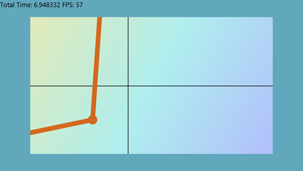

图 37:使用缩放轴进行缩放

## 第 13 章:命中测试或选择

在图表应用程序中，确定用户是否在图表中的节点或其他对象上单击了鼠标通常很有用。这被称为命中测试或挑选。

|  | 提示:Direct2D 几何图形有一个名为 FillContainsPoint 的方法，该方法返回一个 BOOL，指示填充的几何图形是否包含指定的点。这种方法对于简单原语集合的命中测试并不有用，因为几何图形与设备无关，并且在这种类型的任务中非常慢。几何图形可以很快确定一个点是否位于复杂的形状中，但是它们不擅长分辨一大堆节点中哪一个离给定点最近。 |

我们将在接下来的几何部分使用 Direct2D 检查实际命中测试(确定一个点是否位于一个形状内)。本节将集中讨论用指针选择节点的更有效的方法。我们将创建的特殊机制在绘图软件中很常见；它允许图表用户在选择节点时有一点自由。指针不需要正好在一个小节点的上面，只要足够近就可以了。这种机制使得用户从众多节点中选择一个小节点变得更加容易。

我们要做的就是找出哪个节点离指针最近，然后看指针是否离节点足够近。例如，如果指针远离所有节点，则不应拾取任何节点。如果我们想知道指针离哪个节点最近，我们可以非常快速地检查所有节点并计算到每个节点的距离，确定哪个是最小的。我们将编辑`ScatterPlot`类，并让它通过放大所选节点向用户显示正在选择哪个节点。构成散点图的椭圆和点都是独立于设备的资源，因此由中央处理器控制。打开散点图. h 文件，添加一个名为 PickPoint 的公共方法原型。该方法将光标的 x 和 y 位置作为参数。我在课程结束时添加了这个原型。

```cpp
    virtual void CreateDeviceDependentResources(Microsoft::WRL::ComPtr<ID2D1DeviceContext> context) override;
         virtual void Render(Microsoft::WRL::ComPtr<ID2D1DeviceContext> context) override;

           // Method to select a node
           void PickPoint(float x, float y);

```

};

向同一类添加私有成员变量。这将用于跟踪所选节点的索引。

```cpp
    NodeShape m_NodeShape;    // The shape of the nodes

           // Selected node index
           int m_selectedNode;

```

公共:

在`ScatterPlot`构造函数中将 m_selectedNode 初始化为-1。

```cpp
    ScatterPlot::ScatterPlot(float* x, float* y, float nodeSize,
         D2D1::ColorF nodeColor, NodeShape nodeShape, int count):
            m_NodeColor(0), GraphVariable(x, y, count), m_selectedNode(-1)
    {
    // Save half the node size. The nodes are drawn with
    // the point they're representing at the middle of the shape.
    this->m_HalfNodeSize = nodeSize / 2;

    this->m_NodeShape = nodeShape;
    this->m_NodeColor = nodeColor;
    }

```

将`PickPoint`方法的主体添加到散点图. cpp 文件的末尾。

```cpp
    void ScatterPlot::PickPoint(float x, float y) {
    float smallestDistance = (x - m_points[0].x) * (x - m_points[0].x) +
         (y - m_points[0].y) * (y - m_points[0].y);

    int indexOfSmallest = 0;  // Assume closest node is the first one

    // Run through all nodes and see if any are closer
    for(int i = 1; i < m_nodeCount; i++) {   
         // Approximate the distance, don't take the sqrt()!
         float thisDistance = ((x - m_points[i].x) * (x - m_points[i].x) +
              (y - m_points[i].y) * (y - m_points[i].y));

         // If this one's closer, update the index and dist
         if(thisDistance < smallestDistance) {
              smallestDistance = thisDistance;
              indexOfSmallest = i;
              }
         }

    // Calculate the sqrt to get the real Euclidean distance
    smallestDistance = sqrt(smallestDistance);

    // If the distance is greater than a threshhold (50.0f), assume
    // no points are selected at all:
    if(smallestDistance > 50.0f)
         m_selectedNode = -1; // Nothing is selected
    // Otherwise, select the node that's closest to the pointer
    else
         m_selectedNode = indexOfSmallest;
    }

```

为了计算出哪个节点离我们的指针最近，我们必须计算每个节点到指针的距离(我已经使用了欧几里德距离)，并决定哪个节点最近。最初，我假设指针最接近第一个节点。然后，我遍历所有其他节点，检查到指针的距离。如果指针比我们当前的最短距离更接近一个节点，更新最短距离和节点的索引。这样，当我们到达最后一个节点时，我们将拥有最接近指针的节点的索引。

最后，更改`ScatterPlot`类的渲染方法(在散点图. cpp 文件中)，使其以不同的颜色和大小渲染选定的节点。我只包含了圆形节点的示例代码，但是这个想法可以扩展到正方形。

```cpp
    void ScatterPlot::Render(
         Microsoft::WRL::ComPtr<ID2D1DeviceContext> context) {
    switch(m_NodeShape) {    

           // Draw as circle nodes
           case NodeShape::Circle:
                for(int i = 0; i < m_nodeCount; i++) {
                           context->FillEllipse(D2D1::Ellipse(m_points[i],
                                m_HalfNodeSize, m_HalfNodeSize), m_brush);
                      }
                if(m_selectedNode != -1) // If a node is selected, render it larger
                           context->FillEllipse(
                                D2D1::Ellipse(m_points[m_selectedNode],
                                m_HalfNodeSize*2.0f, m_HalfNodeSize*2.0f), m_brush);
                break;

```

//绘制为方形节点

案例节点形状::正方形:

for(int I = 0；i < m _ nodeCounti++){ 0

context-> fill rectangle(d2d 1::RectF(m _ points[I])。x -

m_HalfNodeSize，

m_points[i]。y - m_HalfNodeSize，m_points[i]。x + m_HalfNodeSize，

m_points[i]。y + m_HalfNodeSize)、m _ brush)；

}

打破；

//可能会出现其他形状

默认值:

打破；

}

}

我们希望当指针在 GraphRenderer 类拥有一个 PointerMoved 方法时移动时，PickPoint 方法执行。但是，只有当指针被按下时，或者当鼠标按钮被按下或者用户滑动他或她的手指时，才调用它。

向名为 UpdatePointerPosition 的 GraphRenderer 类添加一个新的公共成员方法。我已经将原型放在 GraphRenderer.h 文件中的 PointerMoved 方法之后。

```cpp
         // Capture the pointer movements so the user can pan the chart
         void PointerMoved(Windows::Foundation::Point point);

           // Record pointers x and y value
           void UpdatePointerPosition(Windows::Foundation::Point point);

```

//更新时间相关对象的方法。

void Update(float timeTotal，float time delta)；

向`GraphRenderer`类添加两个私有成员变量，用于记录指针的位置。

```cpp
         float m_zoomX;  // The amount the x-axis is scaled by
         float m_zoomY;  // The amount the y-axis is scaled by

           float m_pointerX; // X position of pointer in pixels
           float m_pointerY; // Y position of pointer in pixels

```

Microsoft::wrl::comptr<idwritetextformat>m _ text format；</idwritetextformat>

微软::wrl::comptr<id2d1solidcolorbrush>m _ black rush；</id2d1solidcolorbrush>

将`UpdatePointerPosition`方法的主体添加到 GraphRenderer.cpp 文件中。我在最后加了。

```cpp
    void GraphRenderer::UpdatePointerPosition(Windows::Foundation::Point point)
    {
    m_pointerX = point.X;
    m_pointerY = point.Y;
    }

```

最后，我们需要调用`m_graphVariable->PickPoint`方法。我们可以在每次指针移动时调用`UpdatePosition`方法，但是`PickPoint`是一个缓慢的方法，所以我们应该不那么频繁地调用它。我已经在新的条件下调用了`GraphRenderer::Update`方法，这将导致它每 32 帧执行一次。

```cpp
    void GraphRenderer::Update(float timeTotal, float timeDelta) {
    static int fpsCounter = -1;    // Start at -1 so frame 0 updates timers
    fpsCounter++;
    if((fpsCounter & 15) == 0) { // Update every 16 frames
         // Record the times for display in the render method:
         m_timeDelta = timeDelta;
         m_timeTotal = timeTotal;
         }

      if((fpsCounter & 31) == 0) {
           ((ScatterPlot*)m_graphVariable)->PickPoint(
                (m_pointerX-m_pan.X)/m_zoomX,
                (-m_pointerY + m_d2dContext->GetSize().height + m_pan.Y)/m_zoomY
                );
           }

```

}

成员变量`m_pointerX`和`m_pointerY`是指针的屏幕坐标，所以当我们使用它们作为`PickPoint`方法的参数时，我们必须将它们转换成图形的坐标。

|  | 提示:避免在紧密循环中使用 sqrt。在前面的代码示例中，我已经从循环体中删除了 sqrt 函数(用于正确计算指针和节点之间的欧几里德距离)。我们不需要知道这个环中间的实际距离。我们只需要知道距离最短的节点的索引。我只在循环后使用平方根计算过一次实际距离。从循环中去掉平方根可以让它的执行速度快 100 倍左右。 |

我在之前的代码(50.0f)中包含了一个阈值。如果光标距离所有节点都超过 50.0 个单位，我们得出结论，它太远，没有选择任何节点，将所选节点设置为-1。如果光标在一个或多个节点的 50.0f 范围内，该函数将设置最近节点的索引。如果阈值等于圆形节点集合的半径(我们的散点图类中的`m_halfNodeSize`成员变量)，那么这个方法就变成了命中测试，光标必须正好在一个节点上才能选中它，而不是在附近。

下一节包含另一种有趣而灵活的方法来执行命中测试，这次是使用几何图形。这些几何图形能够在像素级别上进行真正的命中测试，而不是我之前介绍的简单的最近邻搜索。几何图形的使用可能比我们刚刚检查的手动命中测试慢得多。原因是几何形状本身是复杂的、与器件无关的结构；它们非常灵活，但也很重。

我们现在已经到了开发绘图应用程序的最后阶段。本书的剩余部分是对一些额外主题和工具的讨论，这些主题和工具不会应用于当前的应用程序。

## 第 14 章:直接二维几何

几何图形允许我们为剪辑区域、点击测试和动画路径指定形状。它们是独立于设备的资源，应该在任何紧密循环之外创建。最基本的几何图形是那些基本形状，椭圆，矩形和圆角矩形。本章中的信息并不是为了扩展我们目前正在开发的绘图应用程序。它是一些更高级主题的语法和概念的介绍。下面的代码示例可以很容易地添加到我们的绘图应用程序中，但是我假设该项目是一个新的 DirectX (XAML)项目，并且渲染类被称为`SimpleTextRenderer`。

### 简单几何图形

要在项目中渲染几何图形，请将这三个成员变量添加到渲染类中。

```cpp
         ID2D1RectangleGeometry *m_rectangle;
         ID2D1EllipseGeometry *m_ellipse;
         ID2D1RoundedRectangleGeometry *m_roundedRectangle;

```

调用设备无关资源创建方法中的`m_d2dFactory`创建几何方法(`CreateDeviceIndependentResources`()在 SimpleTextRenderer 类中)。

```cpp
    m_d2dFactory->CreateRectangleGeometry(
         D2D1::RectF(0, 0, 100, 100),
         &m_rectangle); // 100 × 100 rectangle

    m_d2dFactory->CreateEllipseGeometry(
         D2D1::Ellipse(D2D1::Point2F(100, 10), 150, 100),
         &m_ellipse); // 150 × 100 ellipse

    m_d2dFactory->CreateRoundedRectangleGeometry(
         D2D1::RoundedRect(
              D2D1::RectF(-100, -100, 100, 100),
              25, 25), &m_roundedRectangle); // 200 × 200 rectangle w/ rounded corners

```

制作几何类型的创建方法与创建相应形状的方法几乎相同。例如，`CreateEllipseGeometry`语法与`m_d2dContext::DrawEllipse`方法非常相似。要渲染先前创建的几何图形，请在渲染方法中调用上下文的渲染几何图形方法。

```cpp
         // I've assumed the m_blackBrush brush exists!
         m_d2dContext->DrawGeometry(
              m_rectangle, m_blackBrush.Get());
         m_d2dContext->DrawGeometry(
              m_ellipse, m_blackBrush.Get());
         m_d2dContext->DrawGeometry(
              m_roundedRectangle, m_blackBrush.Get());

```

如前所述，几何图形渲染非常慢(与图元相比)。但是，几何图形非常灵活，不仅可以用于渲染形状。例如，它们有许多有趣的方法，如`ComputeLength`和`ComputeArea,`，它们返回形状的长度和面积，并将变换矩阵视为计算的一部分。也就是说，他们考虑缩放和倾斜。它们也可以用来建立几何下沉和使用`FillContainsPoint`方法进行命中测试。所有这些功能和其他功能使几何成为一个非常灵活的类，但是除非你需要这些特殊的能力，否则它对于计算机来说操作和渲染是比较慢的。

创建几何图形后，可以使用上下文的`FillGeometry`方法，使用纯色画笔渲染填充的形状。上下文的`DrawGeometry`方法只能用于渲染几何图形的轮廓。

变换几何

变换几何允许我们将矩阵变换附加到几何上。这对于创建缩放和平移的形状很有用，但笔画粗细(笔的粗细)保持不变。变换后的几何基本上只是一个规则的几何，但它有自己的变换矩阵。使用绘图渲染的几何图形几何图形使用上下文中的变换矩阵进行变换。

```cpp
         m_d2dFactory->CreateTransformedGeometry(
              m_rectangle,    // Pointer to original geometry
              Matrix3x2F::Scale(1.0f, 12.0f), // Tranformation Matrix
              &m_transformed);     // Pointer to our transformed geometry

```

该代码示例使用工厂创建了一个从章节开始的变换几何图形`m_rectangle`。提供的变换矩阵沿 x 轴的比例为 1.0f，沿 y 轴的比例为 12.0f，因此形状将被拉伸 12 个单位。需要注意的重要一点是，渲染形状时不会拉伸笔画，只会拉伸形状本身。

要渲染变换后的几何图形，可以使用上下文的常规`DrawGeometry`方法。

```cpp
          m_d2dContext->DrawGeometry(
              m_transformed, m_blackBrush.Get());

```

|  | 提示:在我们最初的折线图中，当 x 轴和 y 轴按不同的值缩放时，线条的缩放方式很奇怪。根据线条的角度，笔画的粗细也被拉长了。这会产生类似书法笔的效果，对于折线图来说是不理想的。对我们的折线图使用 TransformedGeometry 可能更好，因为线条可以用静态笔画宽度进行缩放。 |

### 复杂的几何图形

几何图形的强大功能之一是简单的形状可以组合在一起形成更复杂的几何图形。生成的几何图形具有原始几何图形的所有能力，计算面积、长度和命中测试。要将几个几何图形组合在一起，请使用几何图形的`CombineWithGeometry`方法。

要从线的集合中创建自定义几何图形，可以使用`PathGeometry`类。这允许我们指定一组点，用线连接它们，并渲染最终的形状。id2d 1 几何链接是一个对象，用于描述由直线、圆弧和其他几何直线图元构建的路径。路径几何使用 id2d 1 几何链接来构建形状，一旦构建完成，就可以使用上下文的`DrawGeometry`或`FillGeometry`方法来渲染形状。在下面的例子中，我设置了一个随机点的集合，并指定这些点创建一个封闭的形状。我已经指出几何形状是交替填充的。首先，向渲染类添加一个路径几何成员变量。

```cpp
    Microsoft::WRL::ComPtr<ID2D1PathGeometry> m_pathGeometry;

```

与其他几何图形一样，路径几何图形是独立于设备的资源，因此您可以在渲染器的`CreateDeviceIndependentResources`方法中指定形状。

```cpp
         // Create or load some data into a points array.
         int count = 25;
         D2D1_POINT_2F * points = new D2D1_POINT_2F[count*2];
         for(int i = 0; i < count; i++) {
              points[i].x = 50;
              points[i].y = i * 10;
              points[i+count].x = (count * 10)-(i * 10);
              points[i+count].y = 50;
              }   
         // Create the path geometry:
         DX::ThrowIfFailed(m_d2dFactory->CreatePathGeometry(&m_pathGeometry));   
         // Use the path geometry to create a geometry sink:
         ID2D1GeometrySink *geometrySink;
         DX::ThrowIfFailed(m_pathGeometry->Open(&geometrySink));
         // Set the fill mode:
         geometrySink->SetFillMode(D2D1_FILL_MODE::D2D1_FILL_MODE_ALTERNATE);
         // Set the start point and specify the figure is to be filled
         geometrySink->BeginFigure(points[0], D2D1_FIGURE_BEGIN_FILLED);    
         // Add the other points
         for(int i = 1; i < count; i++) {
              // Add a line to the sink connecting the current point to the last:
              geometrySink->AddLine(points[i+count]);       
              geometrySink->AddLine(points[i]);
              }   
         // End the figure, connect the final point to first
         geometrySink->EndFigure(D2D1_FIGURE_END_CLOSED);   
         // Release the geometry sink from RAM
         geometrySink->Close();
         geometrySink->Release(); 
         delete[] points;

```

|  | 注意:几何图形接收器是一种临时的几何图形构建工具。一旦构建了几何图形，就不需要它了，所以我使用了一个局部指针，并在创建完几何图形后释放了它。 |

最后，通过调用`FillGeometry`或`DrawGeometry`，可以在渲染方法中渲染几何图形。

```cpp
         m_d2dContext->DrawGeometry(m_pathGeometry.Get(), m_blackBrush.Get());

```

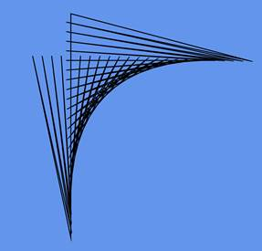

图 38:未填充的几何体

图 38 是绘制的(未填充的)几何图形的输出。如果您使用上下文的`FillGeometry`方法渲染几何图形，您将得到如下内容。

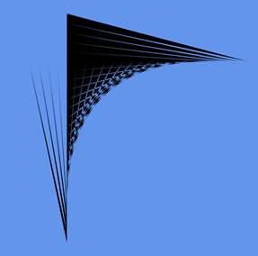

图 39:填充几何图形

图 39 是与前一个相同的几何图形，只有由几何图形中的线条创建的每一秒形状都被填充。这是由于几何下沉中指定的替代`FILL_MODE`。您也可以将填充模式设置为`D2D1_FILL_MODE_WINDING`。

填充模式的实现如下。对于交替填充模式的情况:对于形状中的每个像素，在任意方向上绘制一条假想线(无论方向是什么，只要线是无限的，结果都是一样的)。如果这条线与几何图形中奇数条线相交，则像素被填充。否则，它是透明的。

在缠绕填充模式的情况下，对于每个像素，在任意方向绘制一条无限长的线。如果几何图形中从左到右穿过这条假想线的线与从右到左穿过的线一样多(从假想线的角度来看)，则形状不会被填充。否则就是。

如前所述，几何图形能够做的不仅仅是渲染形状。例如，您可以计算长度和面积，或者用下面的代码轻松地执行命中测试。这个代码最好在`Render()`方法之外调用，因为它非常慢。本代码中使用的`scale`和`translation`矩阵可以是`SimpleTextRenderer`类的成员变量。

```cpp
    // Compute the area of the geometry
    float area;
    m_pathGeometry->ComputeArea(scale * translation *
         m_orientationTransform2D, &area);
    // Compute the length of the geometry
    float length;
    m_pathGeometry->ComputeLength(scale * translation *
         m_orientationTransform2D, &length);
    // Specify a point for hit test:
    D2D1_POINT_2F point = D2D1::Point2F(120.0f, 150.0f);
    BOOL result = false;
    m_pathGeometry->FillContainsPoint(point, scale *
         translation * m_orientationTransform2D, &result);

```

|  | 提示:在这些例子中，我假设有变换几何的平移、缩放和方向矩阵，并且这些在计算中被考虑。例如，如果 x 轴和 y 轴上的当前比例矩阵为 3.0f，则计算长度方法报告的长度将是形状原始长度的三倍。如果希望在不进行缩放或其他变换的情况下获得形状的面积或长度，可以使用 matrix x2f::Identity()作为变换矩阵。 |

|  | 注意:Direct2D 使用点和几何接收器创建线集合的方式与 Direct3D 使用顶点和索引缓冲区的方式非常相似。点在数组中指定，然后可以使用它们在数组中的索引在任意两点之间创建线。在检查顶点和索引缓冲区之前，确保您已经很好地掌握了这个概念；它在二维中比在三维中更简单，但它是完全相同的概念。 |

在前面的例子中，我们看了渲染直线。虽然我们使用了一个几何下沉，我们可以使用一个简化的几何下沉，因为在我们渲染的路径中没有曲线。如果需要向路径中添加贝塞尔曲线或圆弧段，可以使用几何下沉的`AddBezier`、`AddQuadraticBezier`和`AddArc`方法。

在以下示例中，使用`AddBezier`方法从加载到几何图形中的点集合中渲染一组行进形状。本示例假设代码来自上一个示例。例如，有一个名为`m_pathGeometry`的成员变量和一个来自 SimpleTextRenderer 示例的黑色画笔，等等。

```cpp
         // Create or load some data into a points array.
         int count = 50;
         D2D1_POINT_2F * points = new D2D1_POINT_2F[count];
         for(int i = 0; i < count; i++) {
              points[i].x = (i*i);
              points[i].y = (i%2)*(i*10+i*10);
              }

```

使用点将贝塞尔曲线添加到几何图形中。

```cpp
    // Set the fill mode:
    geometrySink->SetFillMode(D2D1_FILL_MODE::D2D1_FILL_MODE_ALTERNATE);
    // Set the start point and specify the figure is to be filled
    geometrySink->BeginFigure(points[0], D2D1_FIGURE_BEGIN_FILLED);
    // Add the other points
    for(int i = 1; i < count-1; i++) {
          // Create Beziers from the points:
          geometrySink->AddBezier(D2D1::BezierSegment(
                points[i-1],points[i],    points[i+1]));
         }

```

并在渲染方法中渲染几何图形。

```cpp
         m_d2dContext->FillGeometry(m_pathGeometry.Get(), m_blackBrush.Get());

```

运行应用程序时，您应该会看到类似图 40 的内容。

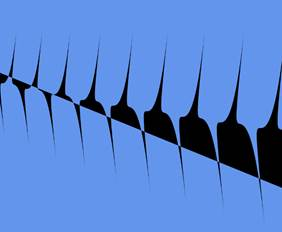

图 40:曲线几何

|  | 提示:曲线可以是折线图中近似中间值的简单方法。折线图中的节点可以渲染为曲线，而不是用直线连接。节点之间的任何点都可以用曲线来近似，此外，曲线看起来比通常用于渲染图表的锯齿状直线更有吸引力。实际的中间值可能并不比直线更接近曲线，但是(特别是对于高度相关或表现良好的数据集)曲线可能更接近近似值。 |</summary>