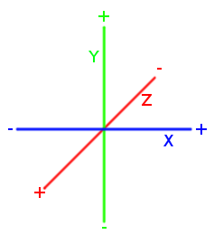
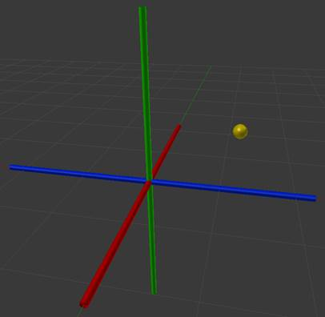

# 第二部分：Direct3D

本书的剩余部分致力于探索 Direct3D 的一些基础知识。这里我们只考察 Direct3D 的一些基础知识。我们将在 [*Direct3D 简洁地*](https://www.syncfusion.com/resources/techportal/details/ebooks/direct3d) 电子书中更深入地探讨这个话题。Direct3D API 比 Direct2D 强大得多。它显然可以渲染三维图形，但它也能够比 Direct2D 更快地渲染二维图形。Direct2D 应用编程接口建立在 Direct3D 应用编程接口之上。Direct3D API 更接近硬件，用于编程 Direct3D 的指令和方法让程序员可以更好地控制 GPU 做什么以及如何做。Direct3D 是一个巨大的话题，它的绝大多数功能在绘制图表方面几乎没有应用。

## 第十五章:渲染管道

渲染管道，有时称为图形管道或简称管道，是将顶点和其他结构从浮点值集合转换为三维图形的一组步骤。为了创建图形，程序员使用代码和数据来创建点、三角形、顶点等的集合。它们必须由硬件转换和操纵，以便在用户的二维屏幕上显示三维场景。

每个应用编程接口和每个应用编程接口的每一代都有自己的渲染管道。Direct3D 渲染管道(虽然在某些方面有关联)不同于 OpenGL 管道。Direct3D 9 管道与 Direct3D 11 管道非常不同。随着硬件能力的扩展，事情逐渐变得更加灵活。目前的流水线有几个可编程的阶段。这意味着程序员能够直接为显卡编写指令。管道中的其他步骤是自动化的，或者至少是半自动的。程序员可以选择一些设置，但不能直接指定图形处理器要做什么。流水线的每一级都接受前一级的输入，并将输入提供给下一级。几个阶段是可选的。以下是当前(DirectX 11)渲染管道的步骤:

1.  输入汇编程序
2.  顶点明暗器
3.  Hull 明暗器
4.  镶嵌师
5.  域着色器
6.  几何着色器
7.  光栅化器
8.  像素着色器
9.  产出合并

输入汇编程序

管道的这个阶段是我们设置资源、顶点、颜色等的地方——任何我们需要图形处理器渲染的东西。

顶点明暗器

这个阶段是完全可编程的。顶点着色器是为前一阶段的每个顶点运行的一小块代码。

外壳着色器、镶嵌器、域着色器

接下来的三个着色器是 DirectX 11 的新功能，它们用于镶嵌。镶嵌可以根据运行应用程序的硬件来提高和降低多边形的细节级别。这本书不会涉及镶嵌的话题。

几何着色器

几何着色器是 DirectX 10 的新功能。它是一个可编程的着色器，可以处理整个形状，而顶点着色器只处理单个顶点。它是可选的，我们不会在这本书里讨论几何着色器。

光栅化器

光栅化器获取前一阶段的顶点，并确定哪些像素可见。这非常重要，因为如果一个像素不可见，那么计算它的最终颜色就没有意义。光栅化器剪辑场景并执行背面剔除。背面剔除是指移除背向相机的多边形，因此不可见。

像素着色器

像素着色器是流水线中的另一个可编程阶段。场景中的每个可见像素都会执行一次像素着色器。场景中可见的像素可能远远超过一百万，因此保持像素着色器非常高效非常重要。

产出合并

这个阶段将所有信息放在一起并显示图像。

|  | 注意:由于这只是对 Direct3D 的简短介绍，我们将使用的着色器只有顶点着色器和像素着色器。在后续的书中， [*Direct3D 简洁地*](https://www.syncfusion.com/resources/techportal/details/ebooks/direct3d) ，我们将更详细地考察 API。 |

## 第 16 章:启动 Direct3D 项目

要开始一个新的 Direct3D 应用，在 Visual Studio 主菜单中点击**文件** > **新项目**。您将看到“新项目”屏幕。点击左侧面板的 **Visual C++** ，然后点击中间面板的 **Direct3D App** 。给你的新项目起个名字。我的叫做 Direct3DTesting，如图 41 所示。


图 41:创建 Direct3D 应用程序

一旦 Visual Studio 创建了项目，您可以单击**开始调试**，您应该会看到一个旋转的彩色立方体(如图 41 的预览窗格所示)。

### 术语和概念

三维坐标

我们将使用标准的笛卡尔 x，y 和 z 系统来描述我们的三维例子中的点。每个 x、y 和 z 值都指三维空间中的一个点。每个轴都可以看作是一个垂直于另外两个轴的无限平面。它们通常被总结为三行，如图 42 所示。



图 42:三维轴

我们将使用坐标的 x 值来表示一个点向左或向右有多远，y 值来表示坐标有多高或多低，z 值来表示坐标进入或离开屏幕有多远。此外，当对象的 x 值增加时，对象会向右移动。随着对象的 y 值增加，它会向上移动。随着对象 z 值的增加，对象会移近相机(或移出屏幕)。

头顶

顶点是三维空间中的一个点，用于表示对象、形状的角或线的端点。为了指定一个三维顶点，我们需要提供前面提到的三个坐标。坐标几乎总是 32 位浮点值。每个元素(x、y 或 z)指定了沿维度的位置，它们共同描述了三维空间中一个精确且唯一的点。

|  | 注意:我将使用 x，y，然后 z 作为描述顶点时元素的顺序。所以类似(9.0f，8.0f，5.0f)的意思是 x 轴 9，y 轴 8，z 轴 5。 |

在图 43 中，黄色的球代表一个顶点。现实中，顶点没有物理形态；它代表一个无限小的点。顶点在位置(1.2f，0.4f，0.7f)。这意味着它位于蓝色 x 轴原点右侧 1.2 个单位，绿色 y 轴原点上方 0.4 个单位，距离红色 z 轴原点 0.7 个单位。



图 43:一个点

在 Direct3D 中，顶点比空间中的简单点灵活得多。顶点可以携带关于一个点的光照和颜色信息，以及任何其他所需的信息。在它们最基本的形式(以及我们将使用它们的方式)中，它们由一个位置和颜色组成，每个位置和颜色用三个或四个浮点值来描述。

线

三维线可以由任意两个顶点组成。它们与二维空间中的线完全相同，只是定义端点的点各有三维。线条在 DirectX 中很重要，因为其中三条构成了一个三角形(正如我们将看到的，三维图形几乎只是渲染大量的三角形)。线条还允许我们将三维对象渲染为线框，因此我们可以轻松地看到制作对象的三角形。

三角形

对象通常被总结并描述为小三角形的集合，而不是用数十亿个点来描述三维对象。三角形共同形成一个网状结构。每个三角形由三个顶点和三条线组成。任何三个不同的顶点都可以用来组成一个三角形，如果有足够的三角形，几乎任何可以想象的形状都可以近似。现代显卡在渲染三角形方面效率惊人。

矩阵

从对象的缩放、放置和旋转，一切都由 Direct3D 中的矩阵控制。显示三维图形包括将顶点和三角形的大数据集乘以变换矩阵。有一些矩阵几乎总是被使用；它们在三维图形中有着特殊的用途，因此被称为世界矩阵、视图矩阵和投影矩阵。

*   **世界矩阵:**当我们在三维空间定义对象时，我们通常用它们自己的原点、比例和旋转来单独定义它们。例如，当我们使用三维建模程序创建模型时，我们可能会使用原点，并根据其自身的局部坐标定义模型。当模型被添加到虚拟三维世界时，它可能不会被放置在原点。也许它正在虚拟世界中四处移动。它有自己的坐标系，但是当我们把它放入一个场景时，这些坐标必须被转换到世界空间。也就是物体在世界上所处的位置。世界矩阵执行这个操作。
*   **视图矩阵:**一旦世界矩阵已经定位了所有可能需要(也可能不需要)渲染的对象，我们就必须在场景中定位一只眼睛或摄像机。通过在场景中放置摄像机，我们定义了另一种起源。世界矩阵及其所有对象都必须旋转、缩放和平移，以使其看起来好像摄像机已经被放置在三维对象中的某个点上，并且正在观看虚拟世界。视图矩阵完成这个操作。
*   **投影矩阵:**一旦世界及其三维物体相对于某个相机定位，整个场景就可以从三维坐标和颜色向量转换为像素，显示在二维监视器上。这包括计算出哪些对象相对于相机出现在其他对象的前面，哪些对象离相机太近或太远而看不到，以及哪些对象离相机太远。投影矩阵是将场景转换为像素所涉及的最终矩阵。

## 第 17 章:用 Direct3D 渲染三角形

回到 Visual Studio 的 Direct3D 模板，我们现在来看看如何定义三角形。打开 CubeRenderer.cpp 文件并检查其内容。这个文件创建立方体，颜色，旋转它，定位眼睛，并做几乎所有的运行时工作。向下滚动到`CreateDeviceResources`方法的定义(应该在立方体渲染器. cpp 文件的第 15 行)。首先，您将看到创建了几个着色器(稍后将详细介绍这些着色器)，但接下来在第 69 行，您将看到一组名为`cubeVertices`的`VertexPositionColor`结构。程序就是在这里设置立方体八个角的位置和颜色的。

```cpp
         auto createCubeTask = (createPSTask &&createVSTask).then([this]()
    {
              VertexPositionColor cubeVertices[] = {
                    {XMFLOAT3(-0.5f, -0.5f, -0.5f), XMFLOAT3(0.0f, 0.0f, 0.0f)},
                    {XMFLOAT3(-0.5f, -0.5f,  0.5f), XMFLOAT3(0.0f, 0.0f, 1.0f)},
                    {XMFLOAT3(-0.5f,  0.5f, -0.5f), XMFLOAT3(0.0f, 1.0f, 0.0f)},

```

`VertexPositionColor`结构类型在立方体渲染器. h 文件的顶部声明为包含两个`XMFLOAT3`类型，一个用于位置，另一个用于顶点的颜色。该数组中每个项目的第一个元素是顶点的位置，第二个元素是归一化的 RGB 颜色规格。

要渲染单个三角形而不是立方体，请将位置更改为以下内容。

```cpp
    auto createCubeTask = (createPSTask && createVSTask).then([this] () {
              VertexPositionColor cubeVertices[] = {
                    {XMFLOAT3(-0.5f, -0.5f, -0.5f), XMFLOAT3(1.0f, 0.0f, 0.0f)},
                    {XMFLOAT3(0.0f, 0.5f,  -0.5f), XMFLOAT3(0.0f, 1.0f, 0.0f)},
                    {XMFLOAT3(0.5f,  -0.5f, -0.5f), XMFLOAT3(0.0f, 0.0f, 1.0f)},
              };

```

这三个顶点描述了一个有红色、绿色和蓝色角的三角形。三角形距离摄像机 2.0f 单位。在`Update`方法中，摄像机目前位于 z 轴的 1.5f 处。向下滚动代码到第 89 行，你会看到另一个局部数组，这个叫做`cubeIndices`。该数组由无符号短整数组成。它用于初始化索引缓冲区。更改数组中的值，以匹配新三角形的索引。

```cpp
               unsigned short cubeIndices[] =      {
                    0,1, 2, // A triangle from 3 points
              };

```

现在，您应该能够运行应用程序并查看美丽的彩虹色三角形，如图 44 所示。


图 44:三角形

你会注意到，像立方体一样，我们的三角形绕着 y 轴旋转。你还会看到，当它转过身来，背面正对着我们的相机时，Direct3D 什么也画不出来。这是背面剔除的结果。

### 顶点和索引缓冲区

在示例代码中，我们描述了三个彩色顶点。在定义了顶点数组之后，有一个对 d3dDevice 的`CreateBuffer`方法的调用。这种方法采用我们的数组，并将数据复制到设备(图形处理器)内存中。因此，顶点缓冲区是一种设备资源。

```cpp
              D3D11_SUBRESOURCE_DATA vertexBufferData = {0};
              vertexBufferData.pSysMem = cubeVertices;
              vertexBufferData.SysMemPitch = 0;
              vertexBufferData.SysMemSlicePitch = 0;
              CD3D11_BUFFER_DESC vertexBufferDesc(sizeof(cubeVertices),
                    D3D11_BIND_VERTEX_BUFFER);
              DX::ThrowIfFailed(
                    m_d3dDevice->CreateBuffer(
                         &vertexBufferDesc,&vertexBufferData,
                         &m_vertexBuffer));

```

我们不能直接访问图形处理器的内存。例如，我们不能在 C++中创建一个指向 GPU RAM 中某个地址的指针，并随意更改该值。这就是为什么我们首先在系统 RAM 中创建数组，然后使用`CreateBuffer`方法将数据复制到 GPU。

顶点缓冲区是显卡上用于存储顶点的内存区域。顶点通常由中央处理器在系统内存中创建，然后复制到显卡的板载内存中，因为显卡的板载内存通常比系统内存快得多。从用三维建模软件创建的模型文件中加载顶点也很常见。一旦缓冲区被复制到图形卡，它就不再需要在系统内存中，除非它被中央处理器改变，在某个时候重新加载到图形处理器上，或者两者都需要。

索引缓冲区引用顶点缓冲区中的顶点。每个三角形都是由顶点缓冲区中的三个点组成的，但是显卡并不只是猜测附近的点来自同一个三角形。我们必须准确地告诉它哪些点创建了我们想要渲染的每个三角形。我们通过创建索引缓冲区来实现这一点。索引缓冲区是整数数组，其元素通过引用顶点缓冲区中的点来指定三角形。每三个整数(通常使用无符号短整数)从顶点缓冲区中的三个顶点创建一个三角形。分离顶点缓冲区和索引缓冲区的目的是避免重复点。同一个点可以被多个顶点使用。

### 背面剔除

为三角形定义顶点的顺序决定了三角形的哪条边是前面，哪条边是后面。索引缓冲区通过指定顶点缓冲区中用于构建我们的形状的点的顺序来描述这个顺序(这与我们在 Direct2D 几何图形中使用几何下沉的方式非常相似)。我们说三角形的第一个点是 0，然后是 1，然后是 2(这些是我们刚才描述的顶点缓冲区中顶点的索引)。非常重要的一点是，当只从一边看时，这是以顺时针顺序描述三角形的。从正面看时，点按顺时针顺序排列；当从后面看时，它们以逆时针顺序排列。


图 45:指数

三角形绕 y 轴旋转，从后面我们可以直接看到它。这是一个叫做背面剔除的过程的结果。通常，三维场景中的三角形只能从一边观看。考虑一下我们最初的立方体:它由 12 个三角形组成(每边两个)，相机正在观察它的外部。如果相机进入立方体，我们会看到 DirectX 实际上并没有费心画三角形的其他边；假设我们的立方体是实心的，我们只会看它的外部。这个假设为 GPU 节省了大量处理时间。你可以想象，在一个复杂的三维场景中，大约一半的三角形(可能由成千上万个三角形组成)将面向三维对象的内部，图形处理器根本不需要渲染它们。

DirectX 根据索引缓冲区中点的顺时针或逆时针顺序确定任何特定三角形的正面。用顺时针方向的点描述的面是正面，由图形处理器渲染。逆时针方向的一面是背面，它被剔除或没有渲染。

如果我们想让我们的三角形从两边都可见，我们可以告诉 DirectX 用相同的顶点缓冲区渲染两个三角形。一个是正面，使用顺序为 0，1，然后 2 的三个点，另一个是背面，使用顺序相反的点，0，2，然后 1。注意，我们不需要改变顶点缓冲区，只需要改变索引缓冲区。

```cpp
              unsigned short cubeIndices[] = {
                    0,1,2,    // The front face
                    0,2,1      // The back face
              };

```

运行应用程序后，您会看到三角形现在旋转，并且从两侧都可以看到。此时应该很清楚，顶点缓冲区中的顶点可以多次使用。索引缓冲区中的索引引用顶点缓冲区中的元素，并描述它们用于创建三角形的顺序。

### 定位眼睛

眼睛(或场景的观察者)位于`CubeRenderer`类的`Update`方法中。

```cpp
    void CubeRenderer::Update(float timeTotal, float timeDelta) {
         (void) timeDelta; // Unused parameter.
         XMVECTOR eye = XMVectorSet(0.0f, 0.7f, 1.5f, 0.0f);
         XMVECTOR at = XMVectorSet(0.0f, -0.1f, 0.0f, 0.0f);
         XMVECTOR up = XMVectorSet(0.0f, 1.0f, 0.0f, 0.0f);
         XMStoreFloat4x4(&m_constantBufferData.view,
              XMMatrixTranspose(XMMatrixLookAtRH(eye, at, up)));
         XMStoreFloat4x4(&m_constantBufferData.model,
              XMMatrixTranspose(XMMatrixRotationY(timeTotal *XM_PIDIV4)));
    }

```

这里描述的三个 XMVECTORs 是眼睛的位置、旋转和向上向量。第一个向量是眼睛的位置。它位于 x 轴上，y 轴上方 0.7 个单位，距离 z 轴原点 1.5 个单位。

第二个 XMVECTOR 描述了眼睛正在看的点；它正在观察 y 轴下方 0.1 的一个点(这恰好是我们前面描述的立方体或三角形的正下方)。

三个 XMVECTORs 中的最后一个是眼睛的向上向量；这指定了相对于眼睛向上的方向。这里，y 轴方向为 1.0。也就是说，我们眼睛认为向上的方向与 y 轴上的正值相同。

|  | 注意:向上向量很重要，因为虽然我们已经定位了眼睛并描述了它正在看的点，但眼睛仍然可以自由滚动。它可以呆在同一个地方，看着同一个像素，但却是颠倒的。向上向量可以用来指定眼睛是上下颠倒的、侧躺的，或者是向上的正确方向。例如，向上向量(0.0f，-1.0f，0.0f，0.0f)意味着眼睛是颠倒的，它的顶部指向 y 轴的负值。将所有元素的向上向量设置为(0.0f，0.0f，0.0f)是没有意义的，并且会导致崩溃。在向上向量的规范中，所有负数被读取为-1.0，所有正数被读取为 1.0，0.0 被读取为 0.0。 |

两个矩阵存储在`constantBufferData`中，一个是我们刚刚看到的眼睛(视图成员)，另一个是模型矩阵。模型矩阵包含绕 y 轴的旋转。如果你想让你的三角形停止旋转，你可以用`Identity`矩阵代替旋转矩阵的乘法。

```cpp
       XMStoreFloat4x4(&m_constantBufferData.model, XMMatrixIdentity());
            //XMMatrixTranspose(XMMatrixRotationY(timeTotal * XM_PIDIV4)));

```

这将导致我们的模型在世界空间中的定位与它自己的模型空间中所描述的完全一样。您也可以将 y 旋转更改为另一种类型的旋转，并检查围绕不同轴的动画旋转的效果。还要记住，矩阵乘法是累积的，所以你可以通过将旋转矩阵相乘来围绕所有轴旋转三角形。

```cpp
         XMStoreFloat4x4(&m_constantBufferData.model,
              XMMatrixTranspose(
                    XMMatrixRotationX(timeTotal * XM_PIDIV4)
                    *XMMatrixRotationY(timeTotal * XM_PIDIV4)
                    *XMMatrixRotationZ(timeTotal * XM_PIDIV4)
                    ));

```

|  | 注意:上一次旋转(以及 Direct3D 中的其他位置)中的角度以弧度为单位。弧度是与常数π(π)相关联的角度度量。一弧度等于(180/π)度。2π弧度等于 360 度。通过将 2π弧度(整个 360 度)乘以旋转量，可以用弧度指定任意旋转角度。例如，要旋转 50% (180 度)，我们可以使用 0.5*(2π)，要旋转 67.58%，我们可以使用 0.6758*(2π)。DirectXMath.h 有一些有用的常量(我们可以在下表 XM_PIDIV4 中看到其中一个)。 |

| 常数 | 价值 | 意义 | 度 |
| XM_PI | 3.141592654 | 产品改进(Product Improve) | one hundred and eighty  |
| XM_2PI | 6.283185307 | 2*PI | Three hundred and sixty |
| S7-1200 可编程控制器 | 0.318309886 | 1/PI | Eighteen point two four |
| XM_1DIV2PI(双曲馀弦) | 0.159154943 | 1/(2*PI) | Nine point one two |
| xm _ pidiv 2 型导弹 | 1.570796327 | PI/2 | Ninety |
| xm _ pidiv 4 型式 | 0.785398163 | PI/4 | Forty-five |

|  | 注意:XMVector 是来自 DirectXMath 库的向量类型(头是 DirectXMath.h)。这个库由一组帮助函数组成，以实现许多标准的数学运算。XMVector 是一个简单的结构，有四个浮点值或整数，对齐 16 个字节。DirectXMath 库已经优化了处理这种数据类型的方法(取决于硬件，库使用 SIMD 扩展来并行执行操作)。XMVector 用于许多不同的事情，包括存储和指定顶点的位置及其颜色。 |

### 原始拓扑

图元的拓扑是图形处理器用顶点集合渲染的基本图元类型。通过分别使用`POINTLIST`、`LINELIST`或`TRIANGLELIST`拓扑，可以将顶点集合渲染为点、线或三角形。图形处理器还可以使用`LINESTRIP`或`TRIANGLESTRIP`将相邻的图元连接在一起(因此第一个图元连接到第二个图元，第二个图元连接到第三个图元，以此类推)。下面的代码示例列出了一些常见的基本拓扑。这不是一个完整的列表；完整的列表在 direct3dcommon.h 文件中描述。

```cpp
    D3D11_PRIMITIVE_TOPOLOGY_POINTLIST   = D3D_PRIMITIVE_TOPOLOGY_POINTLIST,
     D3D11_PRIMITIVE_TOPOLOGY_LINELIST   = D3D_PRIMITIVE_TOPOLOGY_LINELIST,
     D3D11_PRIMITIVE_TOPOLOGY_LINESTRIP  = D3D_PRIMITIVE_TOPOLOGY_LINESTRIP,
     D3D11_PRIMITIVE_TOPOLOGY_TRIANGLELIST = D3D_PRIMITIVE_TOPOLOGY_TRIANGLELIST,
     D3D11_PRIMITIVE_TOPOLOGY_TRIANGLESTRIP = D3D_PRIMITIVE_TOPOLOGY_TRIANGLESTRIP,

```

使用 D3D 上下文的`IASetPrimitiveTopology`方法设置拓扑。这为在渲染实体形状(三角形和三角形条)和渲染线框(线条和线条条)之间切换提供了一种非常快速和简单的方法。

当顶点被渲染为点列表时，每个顶点将被渲染为单个点或像素。线列表将点渲染为线。每对点都用来渲染一条线。线路不一定连接(取决于索引缓冲区，它们可能连接也可能不连接，但不会自动连接)。

线带状拓扑呈现一个线列表，但它也将相邻的线连接在一起。这将创建一条连接顶点缓冲区中所有点的长连续线。这对于渲染线框网格很有用。

三角形列表从点列表中选取每组三个点，并将其渲染为实心三角形。三角形不一定是连接的(同样，它们可以使用索引缓冲区连接，但不会自动连接)。

三角形条与三角形列表相同，但所有三角形都是相连的。相邻三角形共享顶点。

## 第十八章:绘制高度图

现在，我们将研究一种非常常见的渲染三维数据的方法，即高度图。高度图是三维数据集(至少有三个参数变量的数据)的重要可视化工具。它们经常在游戏中用于地形生成，因为它们可以被制作成看起来像山地地形。它们可以被认为是折线图的三维等价物；渲染的不是一条线来表示数据，而是一个多山的表面。

我们将渲染的高度图将是由实心三角形连接的点的集合。x 和 z 值将形成网格或表面，y 值将呈现为网格中元素的高度。如果研究人员想要可视化两个变量(x 和 z)对第三个变量(y)的影响，可以使用这种类型的高度图。

为了创建一个高度图，我们可以在标准的 Direct3D 模板中改变立方体的顶点。创建一个新的 Direct3D 应用程序，并打开立方体渲染器. cpp 文件。用`VertexPositionColor cubeVertices[] =`找到直线，用以下内容替换顶点的定义。我已经注释掉了下面代码清单中要替换的行，以显示新代码的去向。

```cpp
         /*VertexPositionColor cubeVertices[] =
              {
                    {XMFLOAT3(-0.5f, -0.5f, -0.5f), XMFLOAT3(0.0f, 0.0f, 0.0f)},
                    {XMFLOAT3(-0.5f, -0.5f,  0.5f), XMFLOAT3(0.0f, 0.0f, 1.0f)},
                    {XMFLOAT3(-0.5f,  0.5f, -0.5f), XMFLOAT3(0.0f, 1.0f, 0.0f)},
                    {XMFLOAT3(-0.5f,  0.5f,  0.5f), XMFLOAT3(0.0f, 1.0f, 1.0f)},
                    {XMFLOAT3( 0.5f, -0.5f, -0.5f), XMFLOAT3(1.0f, 0.0f, 0.0f)},
                    {XMFLOAT3( 0.5f, -0.5f,  0.5f), XMFLOAT3(1.0f, 0.0f, 1.0f)},
                    {XMFLOAT3( 0.5f,  0.5f, -0.5f), XMFLOAT3(1.0f, 1.0f, 0.0f)},
                    {XMFLOAT3( 0.5f,  0.5f,  0.5f), XMFLOAT3(1.0f, 1.0f, 1.0f)},
              };*/
         const int mapSize = 10;
         VertexPositionColor cubeVertices[mapSize*mapSize];
         float height = 0.0f;
         for(int z = 0; z < mapSize; z++)     {
              for(int x = 0; x < mapSize; x++)     {
                    height = (float)(rand()%100) / 100.0f;

                    cubeVertices[x+(z * mapSize)].pos = XMFLOAT3(x, height, z);
                    cubeVertices[x+(z * mapSize)].color = XMFLOAT3(0.0f, height,
                         0.0f);
                    }
              }

```

这段代码定义了一个从左到右进入屏幕的二维网格。y 值是我们将要绘制的数据点。在本例中，它们是从 0.0f 到 1.0f 的随机值，但是您通常会从数据源加载这些值。这是我们在系统内存中的顶点缓冲区。

现在我们已经在顶点缓冲区中存储了要为高度图渲染的点，我们需要构建一个描述相邻点的三角形列表。顶点缓冲区不描述任何形状，它只是一个点的列表。我们希望指定一个连接相邻点的平面三角形的集合，以便在渲染数据时，来自前面代码中循环嵌套的每个 y 值都变成小山脉和裂缝。下面的代码为此目的创建了一个索引缓冲区(同样，我已经注释掉了最初的`cubeIndices`定义，我们正在替换它):

```cpp
         /*unsigned short cubeIndices[] =
              {
                    0,2,1, // -x
                    1,2,3,

                    4,5,6, // +x
                    5,7,6,

                    0,1,5, // -y
                    0,5,4,

                    2,6,7, // +y
                    2,7,3,

                    0,4,6, // -z
                    0,6,2,

                    1,3,7, // +z
                    1,7,5,
              };*/
    // There's (mapSize-1)*(mapSize-1) squares and 2 triangles per square,
    // so 6 points each.
    unsigned short cubeIndices[(6*(mapSize-1))*(mapSize - 1)];
    int idx = 0; // Index counter to keep track of which square we're defining
    // Step through the points and define the indices that create adjacent squares
    // from them.
    for(int z = 0; z < (mapSize-1); z++){
         for(int x = 0; x < (mapSize-1); x++){
              unsigned short farLeftPoint = x + z * mapSize; // Far left point
              unsigned short farRightPoint = farLeftPoint+1; // Far right point
              unsigned short nearLeftPoint = x + (z+1)*mapSize;// Near left point
              unsigned short nearRightPoint = nearLeftPoint+1; // Near right point

              // Define 6 points that create 2 triangles that are the square
              cubeIndices[idx++] = farLeftPoint;
              cubeIndices[idx++] = nearRightPoint;
              cubeIndices[idx++] = nearLeftPoint;

              cubeIndices[idx++] = farLeftPoint;
              cubeIndices[idx++] = farRightPoint;
              cubeIndices[idx++] = nearRightPoint;
              }
         }

```

如前所述，索引缓冲区多次引用相同的顶点来描述相邻的三角形是正常的。如果两个三角形直接在彼此旁边，并且它们共享一条线，我们不需要存储六个顶点(两个三角形中的每一个对应一个点)。我们可以存储四个顶点，并使用索引缓冲区描述两个相邻的三角形，重用两个顶点:


图 46:形成正方形的三角形

在图 46 中，有两个三角形是由四个点画线形成的。我们的顶点缓冲区保存四个点，索引缓冲区保存创建三角形的索引:{ 0，1，3，1，2，3}。索引缓冲区中的前三个整数描述了创建黄色三角形{ 0，1，3 }的行。接下来的三个索引描述了构成绿色三角形{ 1，2，3 }的线条。这样，顶点 1 和 3 被重复使用，并且在 GPU 上提高了内存使用和处理时间。

在这个高度图代码中，我们一次一个点地遍历这些点，用每个点定义三角形。两个三角形组成一个正方形，我们进入地图大小-1，因为地图边缘的最终点是正方形的右侧。换句话说，比点数少一个平方。当您执行程序时，您应该会看到一个旋转的绿色高度图。较高的值比较低的值呈现更多的绿色。

在`Render`方法中，有一个对`IASetPrimitiveTopology`的调用，它要求 GPU 将点渲染为三角形。渲染高度图的另一个好方法是使用线条。您可以将此方法的参数从`D3D11_PRIMITIVE_TOPOLOGY_TRIANGLELIST`更改为`D3D11_PRIMITIVE_TOPOLOGY_LINELIST`，您的高度图将呈现为彩色线条的集合。

|  | 提示:在前面的例子中，我使用局部数组将索引和顶点存储在系统内存中；即使是中等大小的高度图，这也会很快导致栈溢出。函数的本地参数存储在栈上，这样，当函数返回时，为它们分配的内存将自动清除。如果需要更大的高度图，应该考虑将堆与“new”运算符一起使用。 |

## 第十九章:投射选项

场景投影是将场景从内存中的三维数据点转换为二维投影以显示在监视器上的方法。台式电脑有显示图形的二维显示器；三维图形是通过将一组三维坐标投影到二维表面(计算机显示器)上而模拟的幻觉。

### 透视投影

投影矩阵是在立方体渲染器. cpp 文件的`CreateWindowSizeDependentResources`方法中定义的。默认定义如下。

```cpp
    float aspectRatio = m_windowBounds.Width / m_windowBounds.Height;
         float fovAngleY = 70.0f * XM_PI / 180.0f;
    // Note that the m_orientationTransform3D matrix is post-multiplied here
    // …
    // this transform should not be applied.
         XMStoreFloat4x4(
              &m_constantBufferData.projection,
              XMMatrixTranspose(
                    XMMatrixMultiply(
                         XMMatrixPerspectiveFovRH(
                              fovAngleY,aspectRatio,
                              0.01f,    100.0f    ),
                         XMLoadFloat4x4(&m_orientationTransform3D)
                         )));

```

XMMatrixPerspectiveFovRH

在前面的代码中，我们定义了透视视场(FOV)。物体离相机越远，它们看起来就越小。透视有利于模仿现实，因为我们自己的视觉系统使用类似的算法(结合双目深度感知)来描述距离。这里使用的矩阵是视场。后续书籍 [*Direct3D 简洁地*](https://www.syncfusion.com/resources/techportal/details/ebooks/direct3d) 中提供了右手与左手坐标的详细讨论。

长宽比

此参数是投影的纵横比。这通常与我们在这里看到的屏幕纵横比相同。这是屏幕的宽度除以高度。如果该值大于屏幕的宽高比，对象在投影时会显得高很多；如果它小于屏幕，对象将显示为被压扁。

视野(FOV)角度

这是视野的角度。该参数需要弧度，因此该变量定义中的 70 度通过将其乘以 pi/180 转换为弧度。这是从相机可见物体的角度。对于人类来说，它大约是 180 度，但是我们所能看到的大部分侧面都非常模糊。在投影矩阵中，通常使用小于 180 度的值。值 70 表示相机可以看到中心左侧 35 度和右侧 35 度的东西。

近剪裁平面

将对象剪辑得离相机太近是很常见的，因为如果渲染它们，它们会遮挡场景的其余部分。一个物体离相机越近，用透视渲染时它会显得越大。作为近剪裁平面给出的值是对象在不再渲染之前最接近的值。这里，值 0.01f 用于表示任何比 0.01 单位更接近相机的东西都应该被剪裁或不被渲染。

远剪裁平面

为了节省处理时间，可能不需要渲染远离相机的对象。给定的远剪裁平面值是对象在不再渲染之前离相机最远的距离。它是以单位表示的观看距离。它应该比近剪裁平面大一些，否则相机将看不到任何东西。对于制图应用程序，远裁剪平面通常足够远，以便所有数据始终可见。

### 正投影

默认情况下，Direct3D 模板呈现用透视渲染的立方体。有时，当数据不以这种方式呈现时，更容易理解数据。毕竟透视是一种扭曲效应，可能会模糊数据的含义。正投影与透视投影相同，不同的是，尽管对象与相机相距很远，但它们的外观尺寸保持不变。这看起来有点不自然，但这可能是一种非常清晰的数据呈现方式。距离较远的数据点不会比距离较近的数据点显得更小，也更容易比较。远处的数据和近处的数据一样清晰，而通过透视投影，远处的数据在接近地平线上的一个点时被挤压在一起。有关这些投影之间差异的描述，请参见图 47。


图 47:投影选项

要使用正投影，用以下内容替换`XMMatrixPerspectiveFovRH`(在立方体渲染器的`CreateWindowSizeDependentResources`方法中)。

```cpp
          XMMatrixOrthographicRH(
              25.0f,    // Horizontal units visible
              25.0f,    // Vertical units visible
              0.01f,    // Distance to closest renderable point
              500.0f),  // Distance to farthest renderable point

```

视图宽度

这是水平轴上可见的单位数。例如，如果您渲染了一个 20 × 20 的高度图，您可以将此值设置为 25.0f，以使所有数据点可见，并在侧面增加 2.5 个单位(5.0 的一半)的额外填充。

视图高度

这是垂直轴上可见的单位数。例如，要查看数据范围从 0.0f 到 20.0f 的高度图，可以将该值设置为 25.0f，以允许所有数据都可见，并有一点额外的填充。

近剪裁平面和远剪裁平面

这些值在正投影和透视投影中具有相同的含义。它们代表一个物体离摄像机最近和最远的点，并且仍然可以被渲染。

### 直接三维散点图

作为使用 Direct3D 渲染数据的最后一个例子，我们将研究渲染一组不相连的三角形(像散点图中的节点)。我们之前检查的基本散点图在渲染数千个节点方面相当不错，但是当计数达到数万或数十万个节点时，这种技术就不再有用了；太慢了。问题在于渲染循环。这个循环由中央处理器执行。每次迭代都有一个节点被绘制到渲染目标，这是一个严重的瓶颈。中央处理器正在循环运行，并将绘图指令转发给图形处理器。请记住，Direct2D 是 Direct3D 之上的一个额外的抽象层。完全排除中央处理器和循环，只使用图形处理器并行渲染节点，效率要高得多。

在 Direct3D 中绘制成千上万个三角形节点效率极高。我们可以简单地将节点存储为图形处理器上的三角形集合，并直接使用 Direct3D 渲染，而不是使用“for 循环”将节点渲染为圆形。一旦将节点加载到显卡上，CPU 就不需要执行任何计算。通过使用图形处理器渲染三角形，而不是使用 Direct2D 渲染圆形，获得了巨大的性能。例如，最初的 Direct2D 散点图可以在我正在使用的机器上舒适地渲染大约 10，000 个节点。这种新方法可以以每秒 60 帧的稳定速度轻松渲染 1，000，000。这台机器只有一个中等功能的 GPU (nVidia GT 430)，它没有任何问题。只有在大约 10，000，000 个节点时，它才会变得非常不稳定。

为此，我们将使用一个新的 Direct3D 多维数据集模板。打开一个新的 Direct3D 应用程序，并将设备资源加载方法更改为以下内容。

```cpp
    void CubeRenderer::CreateDeviceResources() {
          Direct3DBase::CreateDeviceResources();

          auto loadVSTask = DX::ReadDataAsync("SimpleVertexShader.cso");
          auto loadPSTask = DX::ReadDataAsync("SimplePixelShader.cso");
          auto createVSTask = loadVSTask.then([this](Platform::Array<byte>^ fileData) {
                DX::ThrowIfFailed(
                      m_d3dDevice->CreateVertexShader(
                            fileData->Data,fileData->Length,   nullptr,
                            &m_vertexShader));

                const D3D11_INPUT_ELEMENT_DESC vertexDesc[] = {
                      { "POSITION", 0,
                     DXGI_FORMAT_R32G32B32_FLOAT,0,0,D3D11_INPUT_PER_VERTEX_DATA, 0 },
                      { "COLOR",    0,
               DXGI_FORMAT_R32G32B32_FLOAT,0,12,D3D11_INPUT_PER_VERTEX_DATA, 0 },
                };

                DX::ThrowIfFailed(
                      m_d3dDevice->CreateInputLayout(
                            vertexDesc,ARRAYSIZE(vertexDesc),
                            fileData->Data,fileData->Length,&m_inputLayout
                            ));
          });

          auto createPSTask = loadPSTask.then([this](Platform::Array<byte>^ fileData) {
                DX::ThrowIfFailed(
                      m_d3dDevice->CreatePixelShader(
                            fileData->Data,fileData->Length,
                            nullptr,&m_pixelShader
                            ));

                CD3D11_BUFFER_DESC
                      constantBufferDesc(sizeof(ModelViewProjectionConstantBuffer),
                     D3D11_BIND_CONSTANT_BUFFER);
                DX::ThrowIfFailed(
                      m_d3dDevice->CreateBuffer(
                            &constantBufferDesc,    nullptr,
                            &m_constantBuffer)
                      );
          });

          auto createCubeTask = (createPSTask && createVSTask).then([this] () {
                int count = 100;
                float x, y, r, g, b;
                m_CubeVertices = new VertexPositionColor[count * 3];      
                float sze = 0.01f;
                float z = 0.0f;
                for(int i = 0; i < count; i++){
                      x = (float(rand() % 5000)/5000.0f)-0.5f;
                      y = (float(rand() % 5000)/5000.0f)-0.5f;

                      r = (float(rand() % 10)/10.0f);
                      g = (float(rand() % 10)/10.0f);
                      b = (float(rand() % 10)/10.0f);

                      m_CubeVertices[(i*3)+0].pos = XMFLOAT3(x, y, z);
                      m_CubeVertices[(i*3)+0].color = XMFLOAT3(r, g, b);

                      m_CubeVertices[(i*3)+1].pos = XMFLOAT3(x-sze, y+sze, z);
                      m_CubeVertices[(i*3)+1].color = XMFLOAT3(r, g, b);

                      m_CubeVertices[(i*3)+2].pos = XMFLOAT3(x+sze, y+sze, z);
                      m_CubeVertices[(i*3)+2].color = XMFLOAT3(r, g, b);

                      z+= 0.0000001f;
                      }

                D3D11_SUBRESOURCE_DATA vertexBufferData = {0};
                vertexBufferData.pSysMem = m_CubeVertices;
                vertexBufferData.SysMemPitch = 0;
                vertexBufferData.SysMemSlicePitch = 0;
                CD3D11_BUFFER_DESC vertexBufferDesc(
                     count*2*3*sizeof(XMFLOAT3), D3D11_BIND_VERTEX_BUFFER);
                DX::ThrowIfFailed(
                      m_d3dDevice->CreateBuffer(
                            &vertexBufferDesc,&vertexBufferData,
                            &m_vertexBuffer)
                      );

                m_CubeIndices = new unsigned short[count * 3];
                for(int i = 0; i < count * 3; i++){
                      m_CubeIndices[i] = i;
                      }

                m_indexCount = count * 3;

                D3D11_SUBRESOURCE_DATA indexBufferData = {0};
                indexBufferData.pSysMem = m_CubeIndices;
                indexBufferData.SysMemPitch = 0;
                indexBufferData.SysMemSlicePitch = 0;
                CD3D11_BUFFER_DESC indexBufferDesc(2*count * 3, D3D11_BIND_INDEX_BUFFER);
                DX::ThrowIfFailed(
                      m_d3dDevice->CreateBuffer(   &indexBufferDesc,
                            &indexBufferData,&m_indexBuffer
                            ));
          });

          createCubeTask.then([this] () {
                m_loadingComplete = true;
          });
    }

```

将 m _ 立方体顶点和 m _ 立方体索引数组添加到立方体渲染器. h 文件中。

```cpp
          VertexPositionColor *m_CubeVertices;
          unsigned short *m_CubeIndices;

```

这些代码大部分应该都很熟悉。我已经创建了一个顶点缓冲区，一个索引缓冲区，并渲染了数据。这是渲染 100 个彩色三角形的演示。可以通过更改包含 count = 100 的行来增加数量。您应该会发现，您可以增加的三角形数量远远超过您可以使用 Direct2D 几何图形绘制的三角形数量。

|  | 提示:我为代码示例中的每个三角形添加了一个缓慢递增的 z 值。这样做是为了不让两个三角形处于完全相同的位置。如果两个三角形位于完全相同的位置，图形处理器有时会先渲染一个，有时会先渲染另一个三角形。这导致令人不快的闪烁伪像。通过在稍微不同的 z 平面上创建每个三角形，我们消除了这种闪烁。 |