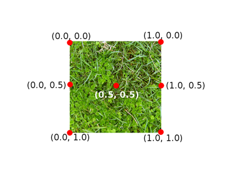
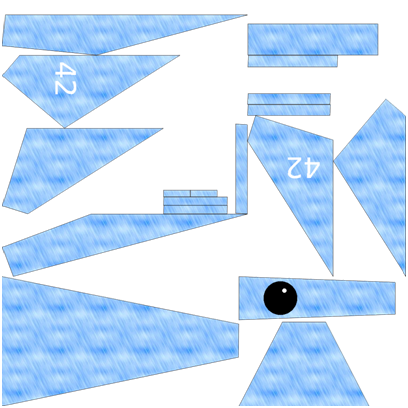
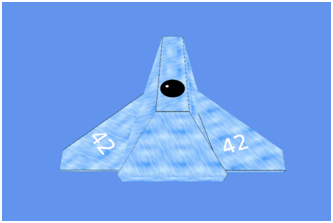

# 第六章纹理映射

通过应用纹理，可以使模型看起来更加逼真。纹理是包裹在多边形周围的平面图像文件。例如，一张桌子的模型可以应用木质纹理，角色可以应用皮肤和面部特征纹理，三维场景中的地面可以应用草地纹理。

将三维模型包裹在纹理中的过程称为纹理映射。术语的映射部分是因为二维图像的像素必须映射到三维模型中它们对应的顶点。大多数模型比基本矩形更复杂，三维建模应用程序通常用于生成映射到顶点的纹理坐标。

## 纹理元素或紫外线坐标

二维图像包裹在网格周围，以创建复杂的彩色对象的错觉。二维图像中的像素通常使用所谓的纹理元素或紫外坐标来引用。不使用 X 和 Y，用 U 和 V 分量描述纹理元素坐标。U 分量与 X 相同，因为它代表水平轴，V 分量类似于 Y 轴，代表垂直轴。紫外坐标和标准笛卡尔 XY 坐标的主要区别在于，紫外坐标将图像中的参考位置作为 0.0 到 1.0 之间的归一化值。点(0.0，0.0)引用图像的左上角，点(1.0，1.0)引用图像的右下角。图像中的每个点都有一个介于(0.0，0.0)和(1.0，1.0)之间的紫外坐标。*图 6.1* 是一种可以应用于视频游戏地面的草状纹理。纹理中的几个点被高亮显示，以显示紫外线值的坐标。



图 6.1:纹理元素/紫外线坐标

纹理元素坐标不引用图像中的特定像素；它们是标准化的位置。图形处理器对以这种方式引用的像素或像素集合进行采样非常有效。如果纹理非常详细，可以读取纹理中多个像素的纹理元素坐标，并对屏幕上的最终颜色进行平均。反之亦然也很常见；纹理可能很小，并且最终图像中的每个像素缺少单独的颜色。在这种情况下，纹理的颜色将被拉伸到纹理映射到的面上。

## 紫外线布局

将矩形或正方形纹理映射到三维矩形对象很容易，但是将二维纹理映射到网格，就像我们上一章的宇宙飞船一样，有点棘手。最好使用三维建模应用程序从网格导出紫外线布局。三维建模软件还能够生成和导出参考布局的紫外坐标。我们在上一章的目标文件代码中看到了这些坐标。我已经使用 Blender 导出了我们飞船模型的 UV 布局，如图*图 6.2*；这是 spaceship.png 紫外线布局。UV 布局是模型中面轮廓的集合。我们可以使用标准的二维图像编辑器来绘制这些形状。这些形状在宇宙飞船. obj 文件中被引用为 VT 坐标。


图 6.2:飞船紫外线布局

*图 6.2* 中的每一个形状都对应着飞船中的一张脸。我已经使用 Gimp 2.8.4 创建了本书中的纹理。Gimp 可从([http://www.gimp.org/](http://www.gimp.org/)获得。如果你想为宇宙飞船创建你自己的纹理，把上面的图像复制到一个二维图像应用程序中，比如 Gimp，并把它保存为 spaceship.png。在*图 6.3 中，*我使用蓝色金属纹理给形状上色。

|  | 注意:本书中的纹理是作为 PNG 图像文件导出的。PNG 很好，因为它使用无损压缩，所以纹理不会像 JPEG 那样被压缩伪像损坏，但是它们比标准位图文件小。巴布亚新几内亚也支持透明度。当你从书中复制图像时，你可能会发现颜色不同。例如，背景可以是黑色的，而不是透明的。背景没有被 OBJ 文件中的紫外坐标映射或引用，也不可见。 |



图 6.3:纹理化紫外线布局

在*图 6.3* 中，我已经把 UV 涂成了蓝钢质感。从*图 6.3* 复制并保存新的纹理化紫外线布局，或者根据*图 6.2* 中的紫外线布局创建自己的纹理化紫外线布局。将纹理设计或保存为**spaceship.png**后，在解决方案资源管理器中右键单击项目名称，选择**添加现有项目**，定位 PNG 文件，将图像导入到我们的 Visual Studio 项目中。

|  | 注意:图 6.3 的原始纹理是从 Blender 导出到 1024x1024 PNG 图像的。二维纹理使用 alpha 通道消耗宽度*高度*3 字节的内存或宽度*高度*4 字节的内存。适中的 128x128 或 256x256 PNG 应该足够大，以保持纹理的细节，但又足够小，以免消耗运行应用程序的便携式设备的所有内存。UV 坐标使用从 0.0 到 1.0 的百分比，因此纹理可以缩放以适应目标设备的内存限制，并且模型网格中引用的 UV 坐标不需要更改。 |

## 从文件中读取纹理

现在我们已经将 PNG 文件添加到我们的项目中，我们需要将纹理读入我们的应用程序，并从中创建一个 id3d 11 纹理 2D。这是代表二维纹理的 Direct3D 对象。我们使用的是标准的 PNG 文件，Windows 8 有解码器，所以我们可以使用 Windows 图像组件(WIC)来读取文件，并将其转换为 RGBA 颜色值的数组。然后，我们可以根据这个数组在设备上创建纹理。我们将在一个名为纹理的新类中包装这个功能。向项目添加两个新文件， **Texture.h** 和 **Texture.cpp** 。下面两个代码表给出了这个类的代码清单。

```cpp
    // Texture.h
    #pragma once

    #include <Windows.h>
    #include <string>
    #include "Model.h"

    using namespace DirectX;

    // This class reads an image from a file and creates an
    // ID3D11Texure2D and a ID3D11ShaderResourceView from it
    class Texture
    {
    Microsoft::WRL::ComPtr<ID3D11Texture2D> m_texture;
    Microsoft::WRL::ComPtr<ID3D11ShaderResourceView> m_resourceView;
    public:
    // Read a texture and create device resources
    void ReadTexture(ID3D11Device* device, IWICImagingFactory2* wicFactory, LPCWSTR filename);

    // Getters
    Microsoft::WRL::ComPtr<ID3D11Texture2D> GetTexure() { return m_texture; }
    Microsoft::WRL::ComPtr<ID3D11ShaderResourceView> GetResourceView() { return m_resourceView; }
    };

```

```cpp
    // Texture.cpp.cpp
    #include "pch.h"
    #include "Texture.h"

    void Texture::ReadTexture(ID3D11Device* device, IWICImagingFactory2* wicFactory, LPCWSTR filename)
    {
    // Create a WIC decoder from the file
    IWICBitmapDecoder *pDecoder;
    DX::ThrowIfFailed(wicFactory->CreateDecoderFromFilename(filename,
    nullptr, GENERIC_READ, WICDecodeMetadataCacheOnDemand, &pDecoder));

    // Create a frame, this will always be 0, PNG have only 1 frame
    IWICBitmapFrameDecode *pFrame = nullptr;
    DX::ThrowIfFailed(pDecoder->GetFrame(0, &pFrame));

    // Convert the format to ensure it's 32bpp RGBA
    IWICFormatConverter *m_pConvertedSourceBitmap;
    DX::ThrowIfFailed(wicFactory->CreateFormatConverter(&m_pConvertedSourceBitmap));
    DX::ThrowIfFailed(m_pConvertedSourceBitmap->Initialize(
    pFrame, GUID_WICPixelFormat32bppPRGBA, // Pre-multiplied RGBA
    WICBitmapDitherTypeNone, nullptr,
    0.0f, WICBitmapPaletteTypeCustom));

    // Create a texture2D from the decoded pixel data
    UINT width = 0;
    UINT height = 0;
    m_pConvertedSourceBitmap->GetSize(&width, &height);
    int totalBytes = width * height * 4; // Total bytes in the pixel data

    // Set up a rectangle which represents the size of the entire image:
    WICRect rect;
    rect.X = 0; rect.Y = 0; rect.Width = width; rect.Height = height;

    // Copy the entire decoded bitmap image to a buffer of bytes:
    BYTE *buffer = new BYTE[totalBytes];
    DX::ThrowIfFailed(m_pConvertedSourceBitmap->CopyPixels(&rect, width * 4, totalBytes, buffer));

    // Describe the texture we will create:
    D3D11_TEXTURE2D_DESC desc;
    ZeroMemory(&desc, sizeof(D3D11_TEXTURE2D_DESC));
    desc.Width = width;
    desc.Height = height;
    desc.MipLevels = 1;
    desc.ArraySize = 1;
    desc.Format = DXGI_FORMAT_R8G8B8A8_UNORM;
    desc.SampleDesc.Count = 1;
    desc.SampleDesc.Quality = 0;
    desc.Usage = D3D11_USAGE_IMMUTABLE;
    desc.BindFlags = D3D11_BIND_SHADER_RESOURCE;
    desc.CPUAccessFlags = 0;
    desc.MiscFlags = 0;

    // Create the sub resource data which points to our BYTE *buffer
    D3D11_SUBRESOURCE_DATA subresourceData;
    ZeroMemory(&subresourceData, sizeof(D3D11_SUBRESOURCE_DATA));
    subresourceData.pSysMem = buffer;
    subresourceData.SysMemPitch = (width * 4);
    subresourceData.SysMemSlicePitch = (width * height * 4);

    // Create the texture2d
    DX::ThrowIfFailed(device->CreateTexture2D(&desc, &subresourceData, m_texture.GetAddressOf()));

    // Create a resource view for the texture:
    D3D11_SHADER_RESOURCE_VIEW_DESC rvDesc;
    rvDesc.Format = desc.Format; // Use format from the texture
    rvDesc.ViewDimension = D3D11_SRV_DIMENSION_TEXTURE2D; // Resource is a 2D texture
    rvDesc.Texture2D.MostDetailedMip = 0;
    rvDesc.Texture2D.MipLevels = 1;

    // Create resource view:
    DX::ThrowIfFailed(device->CreateShaderResourceView(
    m_texture.Get(), &rvDesc,
    m_resourceView.GetAddressOf()));

    // Delete the WIC decoder
    pDecoder->Release();
    pFrame->Release();
    m_pConvertedSourceBitmap->Release();

    // Delete the pixel buffer
    delete[] buffer;
    }

```

上一个类使用 WIC 解码器从文件中读取图像。WIC 解码器能够读取几种常见的图像格式。一旦解码器读取并解压缩 PNG 图像，像素数据被复制到`BYTE* buffer`。我们使用`D3D11_TEXTURE2D_DESC`结构描述正在创建的纹理，使用`D3D11_SUBRESOURCE_DATA`结构指向系统内存中的纹理像素数据，然后使用设备的`CreateTexture2D`方法创建纹理。这将在图形处理器上复制像素数据。一旦像素数据在图形处理器上，我们就不需要在系统内存中维护副本。

我们还需要创建一个`ID3D11ShaderResourceView`。一个资源可以由多个子资源组成；一个`ID3D11ShaderResourceView`用于指定着色器可以使用哪些子资源，以及如何读取资源中的数据。

|  | 注意:您将在上面的代码表中看到对 MIP 映射的引用。MIP 贴图，源自拉丁语“parvo 中的 multum”或多或少，是由相同纹理在几个细节层次上组成的纹理。MIP 级别用于提高性能。当三维物体的观察者非常靠近物体时，可以应用最详细的纹理，而当观察者远离物体时，可以使用不太详细的纹理。MIP 地图比我们在这里做的更高级，但是在渲染复杂场景时，它们的性能要好得多。 |

## 应用纹理 2D

我们已经加载了一个模型，我们有一个类来将纹理加载到图形处理器上。我们需要对`Model`类和`Vertex`结构进行一些更改，以便用纹理坐标而不是颜色来合并新的`Vertex`类型。模型文件中的`Vertex`结构不包括纹理坐标；目前只是位置和颜色。我们不再需要颜色了，因为我们新的`Vertex`结构将包含紫外线坐标。下面的代码表突出显示了顶点结构中的变化。旧的`color`元素已经被注释掉了，但是这一行可以被定义结构的`uv`元素的新的一行代替。

```cpp
    // Definition of our vertex types
    struct Vertex
    {
    DirectX::XMFLOAT3 position;
    // DirectX::XMFLOAT3 color;
    DirectX::XMFLOAT2 uv;
    };

```

目前，我们的`ModelReader`正在忽略它读取的 OBJ 文件中的`vt`纹理坐标规格。更改 ModelReader.cpp 文件以读取纹理坐标。这些更改已在下面的代码表中突出显示。

```cpp
    Model* ModelReader::ReadModel(ID3D11Device* device, char* filename)
    {
    // Read the file
    int filesize = 0;
    char* filedata = ReadFile(filename, filesize);

    // Parse the data into vertices and indices
    int startPos = 0;
    std::string line;

    // Vectors for vertex positions
    std::vector<float> vertices;
    std::vector<int> vertexIndices;
    // Vectors for texture coordinates
    std::vector<float> textureCoords;
    std::vector<int> textureIndices;

    int index; // The index within the line we're reading

    while(startPos < filesize) {
    line = ReadLine(filedata, filesize, startPos);
    if(line.data()[0] == 'v' && line.data()[1] == ' ') {
    index = 2;
    // Add to vertex buffer
    vertices.push_back(ReadFloat(line, index)); // Read X
    vertices.push_back(ReadFloat(line, index)); // Read Y
    vertices.push_back(ReadFloat(line, index)); // Read Z
    // If there's a "W" it will be ignored
    }
    else if(line.data()[0] == 'f' && line.data()[1] == ' ') {
    index = 2;
    // Add triangle to index buffer
    for(int i = 0; i < 3; i++) {
    // Read position of vertex
    vertexIndices.push_back(ReadInt(line, index));
    // Read the texture coordinate
    textureIndices.push_back(ReadInt(line, index));

    // Ignore the normals
    ReadInt(line, index );
    }
    }
    else if(line.data()[0]=='v'&& line.data()[1] == 't' && line.data()[2] == ' ')
    {
    index = 3;
    // Add to texture
    textureCoords.push_back(ReadFloat(line, index)); // Read U
    textureCoords.push_back(ReadFloat(line, index)); // Read V
    }
    }

    // Deallocate the file data
    delete[] filedata; // Deallocate the file data

    // Subtract one from the vertex indices to change from base 1
    // indexing to base 0:
    for(int i = 0; i < (int) vertexIndices.size(); i++) {
    vertexIndices[i]--;
    textureIndices[i]--;
    }

    // Create a collection of Vertex structures from the faces
    std::vector<Vertex> verts;
    int j = vertexIndices.size();
    int qq = vertices.size();
    for(int i = 0; i < (int) vertexIndices.size(); i++) {
    Vertex v;

    // Create a vertex from the referenced positions
    v.position = XMFLOAT3(
    vertices[vertexIndices[i]*3+0],
    vertices[vertexIndices[i]*3+1],
    vertices[vertexIndices[i]*3+2]);

    // Set the vertex's texture coordinates
    v.uv = XMFLOAT2(
    textureCoords[textureIndices[i]*2+0],
    1.0f-textureCoords[textureIndices[i]*2+1] // Negate V
    );

    verts.push_back(v); // Push to the verts vector
    }

    // Create a an array from the verts vector.
    // While we're running through the array reverse
    // the winding order of the vertices.
    Vertex* vertexArray = new Vertex[verts.size()];
    for(int i = 0; i < (int) verts.size(); i+=3) {
    vertexArray[i] = verts[i+1];
    vertexArray[i+1] = verts[i];
    vertexArray[i+2] = verts[i+2];
    }

    // Construct the model
    Model* model = new Model(device, vertexArray, verts.size());

    // Clear the vectors
    vertices.clear();
    vertexIndices.clear();
    verts.clear();
    textureCoords.clear();
    textureIndices.clear();
    // Delete the array/s
    delete[] vertexArray;

    return model; // Return the model
    }

```

接下来，我们可以更改顶点和像素着色器 HLSL 文件。这些文件中定义的结构应该用纹理坐标而不是颜色来匹配新的`Vertex`类型的结构。这些着色器的更改代码显示在以下顶点着色器的代码表和像素着色器的第二个代码表中。

```cpp
    // VertexShader.hlsl

    // The GPU version of the constant buffer
    cbuffer ModelViewProjectionConstantBuffer : register(b0)
    {
    matrix model;
    matrix view;
    matrix projection;
    };

    // The input vertices
    struct VertexShaderInput
    {
    float3 position : POSITION;
    float2 tex : TEXCOORD0;
    };

    // The output vertices as the pixel shader will get them
    struct VertexShaderOutput
    {
    float4 position : SV_POSITION;
    float2 tex : TEXCOORD0;
    };

    // This is the main entry point to the shader:
    VertexShaderOutput main(VertexShaderInput input)
    {
    VertexShaderOutput output;
    float4 pos = float4(input.position, 1.0f);

    // Use constant buffer matrices to position the vertices:
    pos = mul(pos, model); // Position the model in the world
    pos = mul(pos, view); // Position the world with respect to a camera
    pos = mul(pos, projection);// Project the vertices
    output.position = pos;

    // Pass the texture coordinates unchanged to pixel shader
    output.tex = input.tex;

    return output;
    }

```

```cpp
    // PixelShader.hlsl

    Texture2D shaderTexture; // This is the texture
    SamplerState samplerState;

    // Input is exactly the same as
    // vertex shader output!
    struct PixelShaderInput
    {
    float4 position : SV_POSITION;
    float2 tex: TEXCOORD0;
    };

    // Main entry point to the shader
    float4 main(PixelShaderInput input) : SV_TARGET
    {
    float4 textureColor =
    shaderTexture.Sample(samplerState, input.tex);

    // Return the color unchanged
    return textureColor;
    }

```

顶点着色器只是将紫外线坐标传递给像素着色器。像素着色器需要一些额外的资源；它需要纹理(`shaderTexture`)并且它需要纹理采样器状态。我称之为`samplerState`。像素着色器使用`Sample`方法查找纹理中的像素。它将`samplerState`和坐标`input.tex`作为参数传递给该方法。此方法返回像素的颜色，然后着色器可以返回该颜色。像素着色器仍然负责为每个像素提供颜色。现在，它通过对纹理进行采样来确定每个像素的颜色。

接下来，我们需要从文件中加载我们的纹理，并将其分配给我们的`Model`、`m_model`。在 SimpleTextRenderer.h 文件的`SimpleTextRenderer`类中添加一个纹理头的包含。下面的代码表显示了新包含的文件。

```cpp
    // SimpleTextRenderer.h
    #pragma once

    #include "DirectXBase.h"
    #include "Model.h"
    #include "VertexShader.h"
    #include "PixelShader.h"
    #include "ModelReader.h"
    #include "Texture.h"

```

向该类添加成员变量；我已经在代码中调用了我的`m_texture`。下面的代码表突出显示了 SimpleTextRenderer.h 文件中的这一修改。

```cpp
    private:
    Model *m_model;
    Microsoft::WRL::ComPtr<ID3D11Buffer> m_constantBufferGPU;
    ModelViewProjectionConstantBuffer m_constantBufferCPU;
    Texture m_texture;

    // Shaders
    VertexShader m_vertexShader;
    PixelShader m_pixelShader;

```

纹理是一种设备资源，因此应该使用`SimpleTextRenderer::CreateDeviceResources`方法创建。打开 **SimpleTextRenderer.cpp** 文件，加载纹理。我已经在`m_model`成员变量初始化后直接放置了这段代码。下面的代码表突出显示了这些更改。

```cpp
    DirectXBase::CreateDeviceResources();

    // Read the spaceship model
    m_model = ModelReader::ReadModel(m_d3dDevice.Get(), "spaceship.obj");

    // Read the texture:
    m_texture.ReadTexture(m_d3dDevice.Get(), m_wicFactory.Get(), L"spaceship.png ");

    // Create the constant buffer on the device

```

我们还需要改变我们的`VertexShader`类，因为目前它仍然期望数据包含`COLOR`值而不是`TEXCOORD`。打开**文件并修改`vertexDesc`。这些更改在下面的代码表中突出显示。**

```cpp
    // Describe the layout of the data
    const D3D11_INPUT_ELEMENT_DESC vertexDesc[] =
    {
    { "POSITION", 0, DXGI_FORMAT_R32G32B32_FLOAT, 0, 0,
    D3D11_INPUT_PER_VERTEX_DATA, 0 },
    { "TEXCOORD", 0, DXGI_FORMAT_R32G32_FLOAT, 0, 12,
    D3D11_INPUT_PER_VERTEX_DATA, 0 },
    };

```

请确保您在此处进行了两项更改；语义名称为`TEXCOORD`，但同样重要的是类型为`DXGI_FORMAT_R32G32_FLOAT`的事实，现在只有两个元素，而不是三个。

接下来我们可以创建一个`ID3D11SamplerState`成员变量`m_samplerState`。采样器状态是一个保存当前采样器信息的对象。首先，将一个`m_samplerState`成员变量添加到**简单文本渲染器. h** 文件中。新成员变量的声明在下面代码表的代码中突出显示。

```cpp
    private:
    Model *m_model;
    Microsoft::WRL::ComPtr<ID3D11Buffer> m_constantBufferGPU;
    ModelViewProjectionConstantBuffer m_constantBufferCPU;
    Texture m_texture;
    ID3D11SamplerState *m_samplerState;

```

|  | 注意:根据微软的说法，您不需要使用采样器状态。如果代码不包含自己的状态，将会假定有一个默认状态。问题是，包括 Windows RT Surface 在内的一些机器默认情况下似乎不包含任何采样器状态，如果您自己不指定采样器状态，那么在某些设备上调试时，您最终可能会看到一个黑色的、未经纹理处理的模型。 |

采样器状态是设备资源。打开 **SimpleTextRenderer.cpp** 文件，在`CreateDeviceResources`方法结束时创建采样器状态。下面的代码表中突出显示了附加代码。

```cpp
    // Load the shaders from files (note the CSO extension, not hlsl!):
    m_vertexShader.LoadFromFile(m_d3dDevice.Get(), "VertexShader.cso");
    m_pixelShader.LoadFromFile(m_d3dDevice.Get(), "PixelShader.cso");

    // Create the sampler state
    D3D11_SAMPLER_DESC samplerDesc;
    ZeroMemory(&samplerDesc, sizeof(D3D11_SAMPLER_DESC));
    samplerDesc.Filter = D3D11_FILTER_MIN_MAG_MIP_LINEAR;
    samplerDesc.AddressU = D3D11_TEXTURE_ADDRESS_WRAP;
    samplerDesc.AddressV = D3D11_TEXTURE_ADDRESS_WRAP;
    samplerDesc.AddressW = D3D11_TEXTURE_ADDRESS_WRAP;
    samplerDesc.MipLODBias = 0.0f;
    samplerDesc.MaxAnisotropy = 1;
    samplerDesc.ComparisonFunc = D3D11_COMPARISON_ALWAYS;
    samplerDesc.BorderColor[0] = 0;
    samplerDesc.BorderColor[1] = 0;
    samplerDesc.BorderColor[2] = 0;
    samplerDesc.BorderColor[3] = 0;
    samplerDesc.MinLOD = 0;
    samplerDesc.MaxLOD = D3D11_FLOAT32_MAX;

    DX::ThrowIfFailed(m_d3dDevice->CreateSamplerState
    (&samplerDesc, &m_samplerState ));
    }

```

检查前面的代码表应该可以很好地了解采样器状态是什么。这是一种指定如何读取纹理的方式。上面的采样器状态指定我们要线性插值(`D3D11_FILTER_MIN_MAG_MIP_LINEAR`)；这将平滑纹理，并使其在近距离观看时显得不那么像素化。我们还指定了纹理在每个轴上以`Addressxx`设置环绕。这意味着采样器将纹理视为无限的、重复的、平铺的图案。

我们需要做的下一件事是将着色器的资源设置为活动的。打开 **SimpleTextRenderer.cpp** 文件中的`Render`方法，用我们刚刚创建的资源调用`m_d3dContext`的 set 方法。这告诉图形处理器哪些着色器和其他资源是活动的。一旦图形处理器知道渲染哪个顶点，使用哪个着色器，使用哪个采样器状态，我们就可以使用`m_d3dContext``Draw`方法渲染模型。下面的代码表显示了对`Render`方法的这些更改。

```cpp
    // Set the vertex buffer
    m_d3dContext->IASetVertexBuffers(0, 1, m_model->GetAddressOfVertexBuffer(), &stride, &offset);

    // Set the sampler state for the pixel shader
    m_d3dContext->PSSetSamplers(0, 1, &m_samplerState);

    // Set the resource view which points to the texture
    m_d3dContext->PSSetShaderResources(0, 1, m_texture.GetResourceView().GetAddressOf());

    // Render the vertices
    m_d3dContext->Draw(m_model->GetVertexCount(), 0);

```

此时，您应该能够运行应用程序并看到一个改进的模型宇宙飞船，带有我们之前绘制的蓝色纹理(图 6.4 )。



图 6.4:纹理飞船