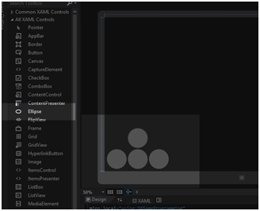
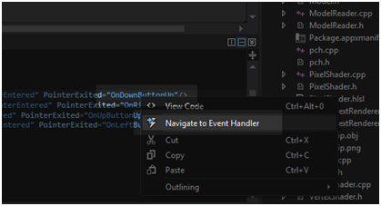

# 九、用户输入

处理用户输入对游戏很重要。过去，DirectX 中包含一个名为 DirectInput 的组件，但现在不再推荐使用。根据经验，尝试用完善的设计方法创建用户输入。尽可能使用窗口控件或具有相同功能的控件。用户一般都熟悉 Windows 的工作方式。它的用户界面不是一个人在短时间内开发出来的。它们是由可能成千上万的人多年来设计和开发的，操作系统控制的当前状态非常可靠、灵活和用户友好。

在设计界面时，我们经常希望游戏玩家能够在完全没有指令的情况下玩游戏。他们应该仅仅通过看比赛就知道如何比赛。有时这是不可能或不可取的，但通常这是用户界面应该达到的目标。

### 控制类型

用户通常使用几种不同的方法与计算机进行交互。键盘、电脑鼠标、触摸屏和游戏控制器是最常见的。在本章中，我们将检查除了游戏控制器之外的所有这些处理。

从我们的角度来看，鼠标和触摸屏将是相同的输入法。这两种输入法有很多不同之处。鼠标有几个按钮，触摸屏有其他指标，如按下指针的力度。我将把这两种方法都称为指针。

重要的是要知道，您的游戏应该完全支持键盘和鼠标或触摸屏输入方法。如果应用程序不完全支持这两种用户控件，微软可能不允许将应用程序上载到 Windows Store。鼠标控制和触摸屏可以用几乎相同的方式来处理，在本章中，我们将两者都简称为指针。

#### 键盘

通常在电子游戏中，我们感兴趣的是知道键盘上的一个键是向下还是向上。这与文字处理应用程序不同，在文字处理应用程序中，击键很重要。按下某个键时，会引发按键事件。只要按键保持按下状态，按键就会反复按下。这意味着，如果我们打开一个文字处理器，按住“a”键，第一个“a”将立即出现，然后在短时间后，更多的“a”将快速连续出现。重复延迟可从窗口控制面板设置。这不是控制视频游戏的理想方法；初始按键事件和重复按键事件之间的延迟使得读取按键事件对于控制视频游戏不切实际。

我们读取按键事件和按键事件，而不是按键事件。记录哪些键按下的最简单方法是创建一个布尔值数组，键盘上的每个键对应一个布尔值。这个数组是键状态数组，或者键盘上每个键的状态。最初，数组中的每个元素都被设置为 false，这意味着所有键都打开了。当用户按下一个键时，相应的数组元素被设置为 true。当用户释放一个键时，相应的数组元素被设置为 false。我们可以从我们的更新方法中读取任何特定按键的按键状态，并对用户按下的按键做出响应。

首先要做的是添加一个带有键状态数组的类。添加两个文件， **Keyboard.h** 和 **Keyboard.cpp** 。这些新文件的代码显示在下面两个代码表中。

```cpp
    // Keyboard.h
    #pragma once
    // This class records the keystates
    class Keyboard
    {
    private:
    bool m_keystates[256];

    public:
    // Public constructor
    Keyboard();

    // Set all keys to up
    void Reset();

    // Register keydown event
    void KeyDown(Windows::System::VirtualKey key);

    // Register keyup event
    void KeyUp(Windows::System::VirtualKey key);

    // Query a keystate
    bool IsKeyDown(Windows::System::VirtualKey key);
    };

```

```cpp
    // Keyboard.cpp
    #include "pch.h"
    #include "Keyboard.h"

    Keyboard::Keyboard(){
    Reset();
    }

    void Keyboard::Reset(){
    for(int i = 0; i < 256; i++) m_keystates[i] = false;
    }

    void Keyboard::KeyDown(Windows::System::VirtualKey key){
    m_keystates[(unsigned char) key] = true;
    }

    void Keyboard::KeyUp(Windows::System::VirtualKey key){
    m_keystates[(unsigned char) key] = false;
    }

    bool Keyboard::IsKeyDown(Windows::System::VirtualKey key){
    return m_keystates[(unsigned char) key];
    }

```

这个类相当简单；它由一个名为`m_keystates`的`bool`阵列和几个用于按下和释放按键的吸气器和设置器组成。

要将对 **Keyboard.h** 文件的引用添加到 **SimpleTextRenderer.h** 文件，请参见下面的代码表。

```cpp
    // SimpleTextRenderer.h
    #pragma once

    #include "DirectXBase.h"
    #include "Model.h"
    #include "VertexShader.h"
    #include "PixelShader.h"
    #include "ModelReader.h"
    #include "Texture.h"
    #include "Keyboard.h"

    // This class renders simple text with a colored background.

```

将`KeyUp`和`KeyDown`成员方法的定义添加到`SimpleTextRenderer,`中，并将名为`m_keyboard`的键盘成员变量添加到类中。这些更改在下面的代码表中突出显示。当一个键在键盘上被按下或释放时，我们将把它路由到`KeyUp`和`KeyDown`方法，以便`SimpleTextRenderer`能够响应用户输入。

```cpp
    // Method for updating time-dependent objects.
    void Update(float timeTotal, float timeDelta);

    // Keyboard methods:
    void KeyDown(Windows::System::VirtualKey key);
    void KeyUp(Windows::System::VirtualKey key);

    private:
    Model *m_model;
    Microsoft::WRL::ComPtr<ID3D11Buffer> m_constantBufferGPU;
    ModelViewProjectionConstantBuffer m_constantBufferCPU;
    Texture m_texture;
    ID3D11SamplerState *m_samplerState;

    // Shaders
    VertexShader m_vertexShader;
    PixelShader m_pixelShader;

    // Keyboard member variable
    Keyboard m_keyboard;
    };

```

接下来，我们需要记录一个键被按下或释放的时间。这可以通过将事件附加到`DirectXPage`类来实现。打开**文件并添加方法原型来捕获这个事件。这些更改在下面的代码表中突出显示。**

```cpp
    void OnOrientationChanged(Platform::Object^ sender);
    void OnDisplayContentsInvalidated(Platform::Object^ sender);
    void OnRendering(Object^ sender, Object^ args);

    // Keyboard events
    void OnKeyDown(Object^ sender,
    Windows::UI::Xaml::Input::KeyRoutedEventArgs^ e);
    void OnKeyUp(Object^ sender,
    Windows::UI::Xaml::Input::KeyRoutedEventArgs^ e);

    Windows::Foundation::EventRegistrationToken m_eventToken;

```

将这些事件的主体添加到文件中。这些事件将按键传递到我们刚刚创建的`m_renderer`成员变量。这些更改显示在下面的代码表中。我已经将这些事件处理程序添加到了**文件的底部。**

```cpp
    void DirectXPage::OnRendering(Object^ sender, Object^ args)
    {
    m_timer->Update();
    m_renderer->Update(m_timer->Total, m_timer->Delta);
    m_renderer->Render();
    m_renderer->Present();
    }

    void DirectXPage::OnKeyDown(Object^ sender,
    Windows::UI::Xaml::Input::KeyRoutedEventArgs^ e) {
    m_renderer->KeyDown(e->Key);
    }

    void DirectXPage::OnKeyUp(Object^ sender,
    Windows::UI::Xaml::Input::KeyRoutedEventArgs^ e) {
    m_renderer->KeyUp(e->Key );
    }

```

将事件附加到构造函数中的 **DirectXPage.xaml.cpp** 文件中。下面的代码表说明了这些变化。

```cpp
    m_eventToken = CompositionTarget::Rendering::add(ref new EventHandler<Object^>(this, &DirectXPage::OnRendering));

    m_timer = ref new BasicTimer();

    // Attach the keyboard events
    this->KeyUp += ref new KeyEventHandler(this,
    &DirectXPage::OnKeyUp);
    this->KeyDown += ref new KeyEventHandler(this,
    &DirectXPage::OnKeyDown);
    }

```

SimpleTextRenderer.cpp 文件中方法的主体(`KeyDown`和`KeyUp`)非常简单，它只是将键路由到`m_keyboard`成员变量。这些函数的代码在下面的代码表中突出显示。我把这些函数放在了 SimpleTextRenderer.cpp 文件的末尾，在`Render`方法之后。

```cpp
    HRESULT hr = m_d2dContext->EndDraw();
    if (hr != D2DERR_RECREATE_TARGET) {
    DX::ThrowIfFailed(hr);
    }
    }

    void SimpleTextRenderer::KeyDown(Windows::System::VirtualKey key) {
    m_keyboard.KeyDown(key);
    }

    void SimpleTextRenderer::KeyUp(Windows::System::VirtualKey key) {
    m_keyboard.KeyUp(key);
    }

```

此时，您应该能够运行该应用程序。按键还不会做任何事情，但是应用程序正在通过`m_keyboard`变量读取和路由所有的按键上下事件。

### 鼠标触摸屏指针

许多移动设备有触摸屏，台式电脑有鼠标。从我们的角度来看，这些输入法将是相同的。我们可以使用标准的 Windows XAML 控件对触摸屏或鼠标控件进行编程。在本节中，我们将为上、下、左、右添加一个方向板(dpad)。我们将在下一章里移动宇宙飞船。现在，我们将只捕获控件。

双击**直接打开页面。XAML** 并在 XAML 页面添加四个`Ellipse`控件(见*图 9.1* )。这些将是我们的 dpad 添加省略号的位置或省略号的大小并不重要，因为我们将在 XAML 代码视图中更改这些设置。



图 9.1:为 DPad 添加椭圆

|  | 注意:我在我们的 DPad 中使用了椭圆控件而不是 XAML 按钮。XAML 按钮的后台已经写了很多代码。例如，它们具有处理被按下和释放的指针的功能。这些事件是自动处理的，不会传递给我们的自定义事件处理程序。使用椭圆控件很容易捕捉指针的按压和释放。 |

现在我们已经添加了省略号，可以在 XAML 代码视图中更改设置。这些更改在下面的代码表中突出显示。

```cpp
    <SwapChainBackgroundPanel x:Name="SwapChainPanel" PointerMoved="OnPointerMoved" PointerReleased="OnPointerReleased">
    <Ellipse Fill="#FFF4F4F5" HorizontalAlignment="Left" Height="100" Margin="115,0,0,10" Stroke="Black" VerticalAlignment="Bottom" Width="100" Opacity="0.25" PointerPressed="OnDownButtonDown" PointerEntered="OnDownButtonPointerEntered" PointerReleased="OnDownButtonUp" PointerExited="OnDownButtonUp"/>
    <Ellipse Fill="#FFF4F4F5" HorizontalAlignment="Left" Height="100" Margin="220,0,0,10" Stroke="Black" VerticalAlignment="Bottom" Width="100" Opacity="0.25" PointerPressed="OnRightButtonDown" PointerEntered="OnRightButtonPointerEntered" PointerReleased="OnRightButtonUp" PointerExited="OnRightButtonUp"/>
    <Ellipse Fill="#FFF4F4F5" HorizontalAlignment="Left" Height="100" Margin="115,0,0,115" Stroke="Black" VerticalAlignment="Bottom" Width="100" Opacity="0.25" PointerPressed="OnUpButtonDown" PointerEntered="OnUpButtonPointerEntered" PointerReleased="OnUpButtonUp" PointerExited="OnUpButtonUp"/>
    <Ellipse Fill="#FFF4F4F5" HorizontalAlignment="Left" Height="100" Margin="10,0,0,10" Stroke="Black" VerticalAlignment="Bottom" Width="100" Opacity="0.25" PointerPressed="OnLeftButtonDown" PointerEntered="OnLeftButtonPointerEntered" PointerReleased="OnLeftButtonUp" PointerExited="OnLeftButtonUp"/>
    </SwapChainBackgroundPanel>

```

这个 XAML 代码指定省略号固定在屏幕的左下角，这是触摸屏上 dpad 最常见的位置。它们是直径为 100 像素的圆形。它们几乎是透明的；这是为了不让他们掩盖运动场。

我捕捉到的事件有`PointerPressed`和`PointerReleased`。如果你是为鼠标编程的话，我捕捉到的另外两个事件`PointerEntered`和`PointerExited`，意义不大。我捕捉到了这些事件，因此如果用户用触摸屏按住指针，并将手指滑动到另一个椭圆上，则`PointerPressed`事件不会触发。这对触摸屏没有好处。这个硬币的另一面是，如果鼠标光标没有被按下，而是进入或退出省略号，`PointerEntered`和`PointerExited`事件不应触发。我已经捕获了事件，并区分了事件处理程序中的指针类型。我已经通过与`PointerReleased`相同的处理程序路由了`PointerExited`事件，因为它们做完全相同的事情。要创建事件处理程序，右键单击 XAML 代码中的方法名称，并从上下文菜单中选择**导航到事件处理程序**。Visual Studio 将编写事件处理程序，并在代码中带我们找到它(参见*图 8.2* )。



图 8.2:添加事件处理程序

接下来，我们将填充事件处理程序的主体。对 DirectXPage.xaml.cpp 文件的更改在下面的代码表中突出显示。

```cpp
    void DirectXPage::OnDownButtonDown(Platform::Object^ sender, Windows::UI::Xaml::Input::PointerRoutedEventArgs^ e) {
    m_renderer->KeyDown(Windows::System::VirtualKey::Down);
    }

    void DirectXPage::OnRightButtonDown(Platform::Object^ sender, Windows::UI::Xaml::Input::PointerRoutedEventArgs^ e) {
    m_renderer->KeyDown(Windows::System::VirtualKey::Right);
    }

    void DirectXPage::OnUpButtonDown(Platform::Object^ sender, Windows::UI::Xaml::Input::PointerRoutedEventArgs^ e) {
    m_renderer->KeyDown(Windows::System::VirtualKey::Up);
    }

    void DirectXPage::OnLeftButtonDown(Platform::Object^ sender, Windows::UI::Xaml::Input::PointerRoutedEventArgs^ e) {
    m_renderer->KeyDown(Windows::System::VirtualKey::Left);
    }

    void DirectXPage::OnDownButtonUp(Platform::Object^ sender, Windows::UI::Xaml::Input::PointerRoutedEventArgs^ e) {
    m_renderer->KeyUp(Windows::System::VirtualKey::Down);
    }

    void DirectXPage::OnRightButtonUp(Platform::Object^ sender, Windows::UI::Xaml::Input::PointerRoutedEventArgs^ e) {
    m_renderer->KeyUp(Windows::System::VirtualKey::Right);
    }

    void DirectXPage::OnUpButtonUp(Platform::Object^ sender, Windows::UI::Xaml::Input::PointerRoutedEventArgs^ e) {
    m_renderer->KeyUp(Windows::System::VirtualKey::Up);
    }

    void DirectXPage::OnLeftButtonUp(Platform::Object^ sender, Windows::UI::Xaml::Input::PointerRoutedEventArgs^ e) {
    m_renderer->KeyUp(Windows::System::VirtualKey::Left);
    }
    void DirectXPage::OnDownButtonPointerEntered(Platform::Object^ sender,
    Windows::UI::Xaml::Input::PointerRoutedEventArgs^ e) {
    if(e->Pointer->PointerDeviceType == Windows::Devices::Input::PointerDeviceType::Touch)
    m_renderer->KeyDown(Windows::System::VirtualKey::Down);
    }

    void DirectXPage::OnRightButtonPointerEntered(Platform::Object^ sender,
    Windows::UI::Xaml::Input::PointerRoutedEventArgs^ e) {
    if(e->Pointer->PointerDeviceType == Windows::Devices::Input::PointerDeviceType::Touch)
    m_renderer->KeyDown(Windows::System::VirtualKey::Right);
    }

    void DirectXPage::OnUpButtonPointerEntered(Platform::Object^ sender,
    Windows::UI::Xaml::Input::PointerRoutedEventArgs^ e) {
    if(e->Pointer->PointerDeviceType == Windows::Devices::Input::PointerDeviceType::Touch)
    m_renderer->KeyDown(Windows::System::VirtualKey::Up);
    }

    void DirectXPage::OnLeftButtonPointerEntered(Platform::Object^ sender,
    Windows::UI::Xaml::Input::PointerRoutedEventArgs^ e) {
    if(e->Pointer->PointerDeviceType == Windows::Devices::Input::PointerDeviceType::Touch)
    m_renderer->KeyDown(Windows::System::VirtualKey::Left);
    }

```

以上方法向我们的`Keyboard`班发送`KeyUp`和`KeyDown`信号。注意`PointerDeviceType`的测试；这区分了鼠标和触摸屏。用鼠标控制屏幕上的 dpad 实际上非常麻烦，但是能够区分输入类型可能会很有用，所以我一直把它保存在代码中。

此时，您应该能够运行该应用程序。再一次，它将看起来和以前完全一样，只是现在我们可以用键盘、鼠标或触摸屏引起`KeyUp`和`KeyDown`事件。