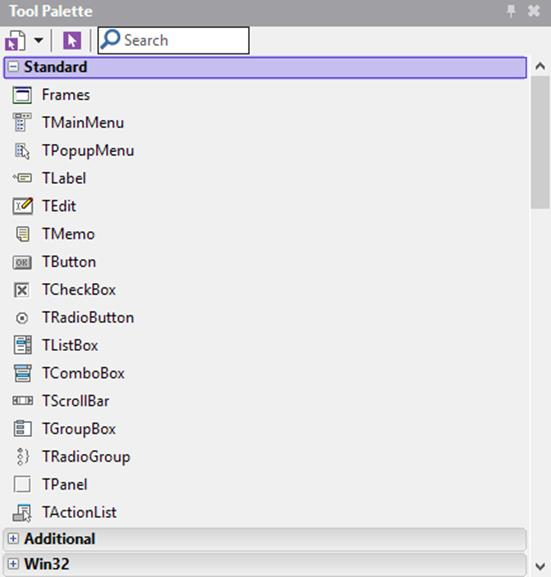
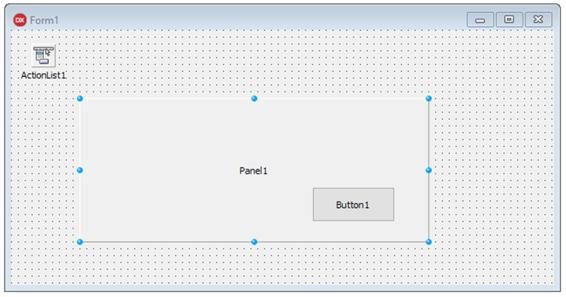
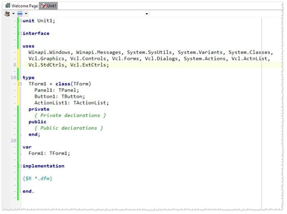
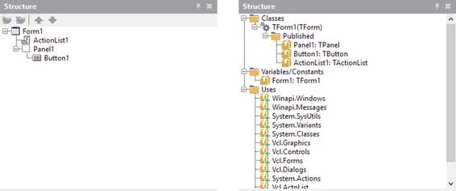
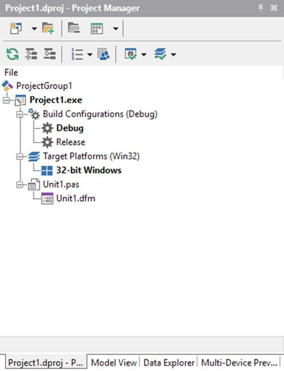
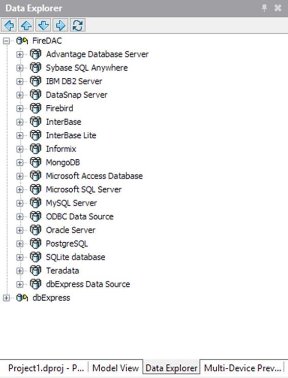
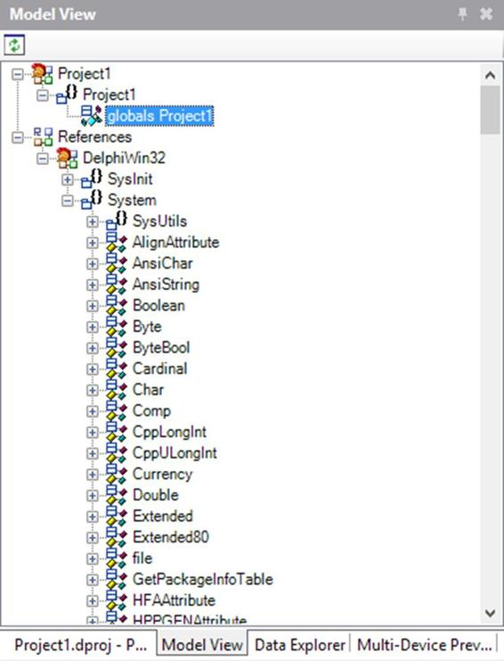
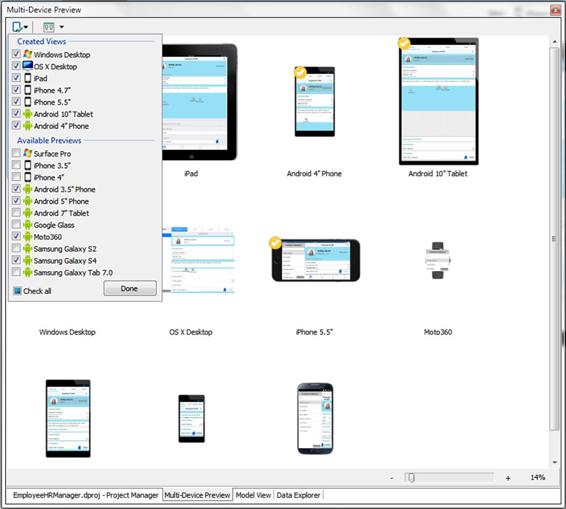
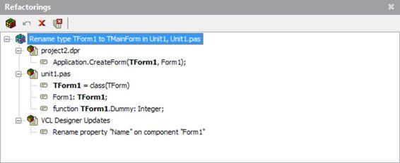

# 三、探索 IDE

在我们深入研究您可以用 Delphi 构建的每一种项目之前，您应该接触一下 IDE 中可用的基本工具，看看它们在具体环境中是如何工作的。

图 7:德尔福集成开发环境

工具选项板包含所有可用的组件和视觉控件。

图 8:工具面板

您可以将组件从工具选项板拖到表单设计器中，以向应用程序添加功能，或者拖放可视控件以构建用户界面。其中一些是用 Delphi“开箱即用”安装的，但您也可以安装来自第三方的新组件，或者自己构建和安装组件。

工具选项板中的所有项目都根据其使用上下文或所属的库进行分类。只需单击您想要查看其包含的组件和控件列表的类别名称。

|  | 提示:工具面板支持“增量搜索”当面板处于焦点并且光标在搜索框内闪烁时，开始键入所需组件的名称。调色板仅显示与您输入的文本匹配的项目。 |

窗体设计器占据了集成开发环境窗口的主要区域，它是设计应用程序的大部分动作发生的地方。这里是您放置组件和视觉控件的地方，就像您刚才在“Hello World”示例中所做的那样。

图 9:表单设计器

每个控件在放置时都有默认的大小和位置。您可以通过单击控件并拖动它来更改后者，或者使用单击蓝点时出现的手柄来调整控件的大小。

一些控件可以作为其他控件的父控件。自己尝试一下，将`TButton`控件从工具选项板拖到之前放下的面板上。如果您四处移动面板，按钮将跟随它，保持其相对位置。

现在尝试添加一个非可视组件:选择并拖动`TActionList`组件到您的表单中。任何组件在设计时都会在表单上显示为图标，但是在运行时您将永远看不到它，因为它只提供业务逻辑和行为，因此它没有可视化表示。

|  | 提示:有时您的表单上会有很多组件，这可能会使您很难使用可视化控件，因为组件会不断妨碍您。出现这种情况时，您可以从主菜单中选择[编辑&#124;隐藏非可视组件]，或者按 CTRL+H 从视图中隐藏它们。完成后，选择该菜单项或再次按快捷键来恢复它们。 |

如果点击表单设计器并从主菜单中选择`[View|Toggle Form/Unit]`(或按下`F12`)，Delphi 会立即切换到代码编辑器窗口。

图 10:代码编辑器

这里是您编写应用程序源代码的地方。每个表单通常都链接到一个源代码文件，该文件包含表单本身的类型声明。Delphi 在设计时保持声明与您的更改同步，为您编写代码，同时您可以手动添加自定义代码作为对事件的响应，修改应用程序的行为。

代码编辑器也用于未绑定到表单的帕斯卡代码单元，更一般地说，用于编辑任何类型的文本文件。

如果按下`F12`键或选择`[View|Toggle Form/Unit]`，德尔福再次切换到表单设计器。

|  | 提示:工具面板支持“增量搜索”这意味着当面板处于焦点并且光标在搜索框内闪烁时，调色板仅显示与您输入的文本匹配的项目。 |

“结构视图”显示一个树形图，该图会根据活动文档而变化。

图 11:结构视图

使用窗体设计器时，“结构视图”显示放置在窗体上的所有组件和可视控件，您可以从该视图中选择它们。

如果切换到代码编辑器，您将看到类、类型、变量、常数等的层次结构，并且您可以双击树中的一个节点来快速移动到代码文件中定义该项的位置。

对象检查器是一个面板，您可以在其中编辑选定表单、组件和视觉控件的所有属性。

图 12:对象检查器

从表单设计器或使用结构视图选择组件或控件后，对象检查器会列出设计时可用的所有属性。

例如，您可以通过选择`TButton`控件，单击`Caption`属性，并在按钮内写入您想要显示的新文本来更改该控件的标题。

属性可以影响组件和可视控件的行为，并改变后者的可视方面。

对象检查器的顶部有一个实例列表。您可以从该列表中选择要更改属性值的组件，就像您已经使用窗体设计器或结构视图所做的那样。

您甚至可以使用`Search`框并输入属性(或部分属性)的名称来过滤属性列表。

在底部，你可以找到`Quick Action`面板。当您选择一个具有相关快速操作的组件时，您可以单击一个超链接，该超链接会触发一个向导或自动过程，在几秒钟内执行复杂的设置。

对象检查器有以下选项卡:

*   `Properties`:用它来设置影响控件和组件的视觉方面或行为的属性值。
*   `Events`:用这个把引用赋给一个处理程序方法；双击一行以创建新的空处理程序。

项目管理器显示属于项目或一组项目的文件，以分层形式显示它们，并包括一些“特殊节点”，这些节点指的是构建配置、目标平台和其他资源。

图 13:项目经理

此面板有一个工具栏，可让您向项目中添加新文件、更改树中列出的项目的排列、更改应用程序的目标平台或快速激活不同的构建配置—只需指向工具栏即可查看每个按钮的功能。

|  | 注意:如果您仔细查看项目树，您会注意到主窗体有两个链接在一起的文件。一个文件包含表单的定义，即您在对象检查器中为表单及其内部组件设置的值。另一个文件包含指导其行为的 Pascal 代码(可以使用代码编辑器查看和编辑的代码)。 |

集成开发环境中还有许多其他面板可用。其中一些是隐藏的，除非有相关内容显示。其他人共享我们已经讨论过的面板的相同选项卡组。

数据资源管理器显示随时可用的数据库连接，并允许您在设计时实时访问数据。

您可以添加新连接，也可以编辑和删除现有连接。

图 14:数据浏览器

在接下来的章节中，我们将深入研究 Delphi 支持的数据访问库。

“模型视图”面板允许您向项目添加对建模的支持。这将创建其内容的逻辑表示，其中项目是一个具有根命名空间的包，每个类型都是一个元素节点。

图 15:模型视图

您可以使用这个视图将 UML 图添加到您的项目中，自动生成代码，反之亦然，保持它们的协调。

“类资源管理器”面板显示项目中类的分层视图，类似于“结构视图”，但功能更强大。例如，您可以应用几个重构选项，向类(即方法、字段、属性)添加新成员，以及搜索符号的用法。

图 16:类浏览器

该面板允许您处理完成工作所需的任务。

在这里，您可以看到在代码中使用// TODO 注释定义的任务列表，并手动将新的全局任务添加到您的项目中，保存在单独的”。todo”文件。

图 17:待办事项列表

完成任务后，只需添加一个复选标记，将其标记为已完成。

多设备预览版是该产品的最新独家配件之一，仅适用于多设备应用程序。

你可以把它想象成一个虚拟桌面，所有最受欢迎的设备(桌面和移动设备)都在这里摆放，看看你的应用在上面会是什么样子。这包括每个设备的不同外形，因此您可以微调您的用户界面，并确保它在您选择的目标设备上有效工作。

图 18:多设备预览

默认情况下，“消息”面板是隐藏的，但是当您构建项目后出现错误时，它会变得可见，并显示需要您注意的警告或提示。

图 19:消息

默认情况下，该面板通常是隐藏的，当您对代码应用重构时，Delphi 会将其展开，显示所有预期更改的预览。然后，您可以选择继续应用它们或取消操作。

图 20:重构预览

在本章中，我们给出了 IDE 中可用面板的用途。

您可以使用工具选项板来选择组件和控件，并将它们拖到窗体设计器中的可视窗体上。您可以通过对象检查器更改设计时属性，切换到代码编辑器来编写业务逻辑。

您可以在“项目管理器”窗口中找到项目文件，然后打开它们，并使用“结构视图”提供的分层树导航其内容。

大多数面板都有工具栏，您可以右键单击它们来显示菜单。使用[查看]菜单项使工具栏可见，并随意尝试任何可用的命令和选项，因为您将一直使用它们！