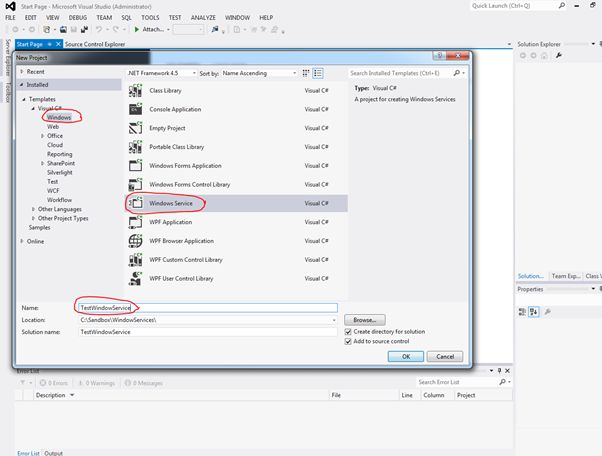
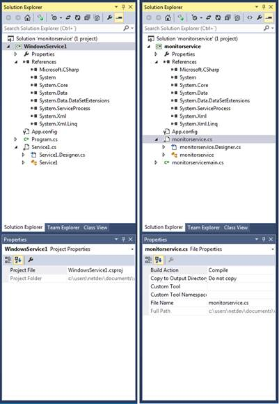

# 一、使用 .NET 的 Windows 服务开发

## 开始

### 如何在 Visual Studio 中创建项目

在加载 Microsoft Visual Studio 后，开发 Windows 服务的第一步是创建一个 Windows 服务类型项目。下图显示了 Visual Studio 中的这种项目对话框。



图 Visual Studio 窗口服务项目类型

### Windows 服务项目基线

窗口服务项目的基线由两个程序组成；其中一个名为 **Program.cs** 的管理应用入口点。另一个是 **Service1.cs** ，封装了服务类定义。开发人员可以根据需要添加任意多个程序，以便轻松维护代码或向项目添加特殊功能。

#### 定制项目基线

可以定制项目基线，以适应开发人员自己的需求。要这样做，必须重命名**解决方案**、**项目**、 **Program.cs** 、 **Service1.cs** 节点。就本书而言，视窗服务项目将被命名为**监控服务。**下图为定制前后的 Visual Studio 解决方案资源管理器。



图 3:项目定制前后的解决方案资源管理器

|  | 提示:您可以通过右键单击所需节点并从上下文弹出式菜单中应用“重命名”命令来快速重命名解决方案资源管理器树中的元素。重命名操作后，将触发 Visual Studio 重构代码工具。 |

## 应用入口点

像许多 Visual Studio 应用程序一样，Windows 服务需要一个入口点才能执行。下面的代码示例显示了项目的入口点。

代码示例 1

```cs
          using System;
          using System.Collections.Generic;
          using System.Linq;
          using System.ServiceProcess;
          using System.Text;
          using System.Threading.Tasks;

          namespace monitorservice
          {
              static class monitorservicemain
              {
                  /// <summary>
                  /// The main entry point for the application.
                  /// </summary>
                  static void Main()
                  {
                      ServiceBase[] ServicesToRun;
                      ServicesToRun = new ServiceBase[] 
                      { 
                          new monitorservice() 
                      };
                      ServiceBase.Run(ServicesToRun);
                  }
              }
          }

```

这个程序创建了一个名为`ServicesToRun`的数组。该阵列基于`ServiceBase`。NET 类，并存储一个`monitorservice`自定义类的实例。`Monitorservice`也是来源于`ServiceBase`。NET 类，并将管理正在开发的 Windows 服务。

一旦创建了数组，程序调用`ServiceBase`的`Run`方法，将数组作为参数传递，服务执行开始。

## ServiceBase。NET 类

这个类是`System.ServiceProcess`命名空间的一部分，并为作为服务应用程序的一部分而存在的服务提供一个基类。`ServiceBase`必须从为服务应用程序创建新的服务类中派生出来。如前所述，将管理服务的派生类名为`monitorservice`，可以在 **monitorservice.cs** 文件中找到。

评论

任何有用的服务都会覆盖`OnStart`和`OnStop`方法。对于附加功能，`OnPause`和`OnContinue`可以通过响应服务状态变化的特定行为来覆盖。如果需要提供用户界面来更改服务行为，这将非常有用，因为可以使用这些方法向服务通知此更改。

默认情况下，服务在系统帐户下运行，该帐户与管理员帐户不同。无法更改系统帐户的权限。

当服务启动时，系统定位可执行文件，并运行包含在可执行文件中的该服务的`OnStart`方法。但是，运行服务与运行可执行文件是不同的。可执行文件只加载服务。服务通过服务控制管理器访问(例如，启动和停止)。

## ServiceBase 派生类定义

下面的代码示例显示了`monitorservice`派生类的定义。

代码示例 2

```cs
          using System;
          using System.Collections.Generic;
          using System.ComponentModel;
          using System.Data;
          using System.Diagnostics;
          using System.Linq;
          using System.ServiceProcess;
          using System.Text;
          using System.Threading.Tasks;

          namespace monitorservice
          {
              public partial class monitorservice : ServiceBase
              {
                  private System.Timers.Timer serviceTimer = null;

                  public monitorservice()
                  {
                      InitializeComponent();
                  }

                  protected override void OnStart(string[] args)
                  {
                  }

                  private void timer_Elapsed(object sender, System.Timers.ElapsedEventArgs e)
                  {
                  }

                  protected override void OnStop()
                  {
                  }

              }
          }

```

创建项目时，Visual Studio 会自动生成此代码。基本上，该代码执行以下操作:

1.创建类的实例时，构造函数调用`InitializeComponent()`方法，以便放置创建实例时需要执行的所有代码。

2.覆盖`OnStart()`事件，以便在服务开始执行时放置所有需要执行的代码。

3.覆盖`OnStop()`事件，以便在服务停止执行时放置所有需要执行的代码。

这是开发整个服务应用程序的基础代码。为了给应用程序添加更多功能，我们可能需要覆盖其他事件。我建议坚持使用寿命，这将在下一节解释。

## 使用寿命

一个服务在其生命周期中会经历几个内部状态。首先，服务被安装到它将要运行的系统上。此过程执行服务项目的安装程序，并将服务加载到该计算机的服务控制管理器中。服务控制管理器是用来管理服务的实用程序。

服务加载后，必须启动。启动服务可以让它开始运行。通过调用`Start`方法，可以从服务控制管理器、服务器资源管理器或代码启动服务。`Start`方法将处理传递给应用程序的`OnStart`方法，并处理您在那里定义的任何代码。

正在运行的服务可以无限期地处于这种状态，直到它停止或暂停，或者直到计算机关闭。服务可以以三种基本状态之一存在:运行、暂停或停止。该服务还可以报告未决命令的状态:`ContinuePending`、`PausePending`、`StartPending`或`StopPending`。这些状态表示命令已经发出(如暂停正在运行的服务的命令)，但尚未执行。您可以查询状态以确定服务处于什么状态，或者使用`WaitForStatus`在这些状态发生时执行操作。

您可以从服务控制管理器、服务器资源管理器或通过在代码中调用方法来暂停、停止或恢复服务。这些操作中的每一个都可以调用服务中的关联过程(`OnStop`、`OnPause`或 **`OnContinue`** )，在这些过程中，您可以定义当服务改变状态时要执行的附加处理。

## OnStart 方法

当服务启动时，系统定位可执行文件，并运行包含在可执行文件中的该服务的`OnStart`方法。但是，运行服务与运行可执行文件并不相同；可执行文件只加载服务。服务通过服务控制管理器访问(例如，启动和停止)。

第一次在服务上调用`Start`时，可执行文件调用`ServiceBase`派生类的构造函数。`OnStart`命令处理方法在构造函数执行后立即被调用。第一次加载服务后不再执行构造函数，因此需要将构造函数执行的处理与`OnStart`执行的处理分开。任何可以由`OnStop`释放的资源都应该在`OnStart`中创建，因为在构造函数中创建资源会阻止在`OnStop`释放资源后再次启动服务时正确创建资源。

下面的代码示例显示了如何创建所需的资源。

代码示例 3

```cs
          protected override void OnStart(string[] args)
          {
              this.serviceTimer = new System.Timers.Timer(300);
              this.serviceTimer.AutoReset = true;
              this.serviceTimer.Elapsed += new System.Timers.ElapsedEventHandler(this.timer_Elapsed);
              this.serviceTimer.Start();
          }

```

在这种情况下，一个`Timer`对象被实例化并启动。每隔 300 毫秒，定时器的`Elapsed`事件将被触发，并且`timer_Elapsed`方法将被执行。`OnStop`事件将释放该资源。

## on top 方法

由于触发了`OnStop`事件，因此每次向服务发送`Stop`命令时都会执行`OnStop`方法。服务控制管理器可以发送 **`Stop`** 命令。与`OnStart`方法类似，我们可以使用`OnStop`方法来执行服务停止时所需的任何任务，例如释放不再需要的资源，如下面的代码示例所示。

代码示例 4

```cs
          protected override void OnStop()
          {
              this.serviceTimer.Stop();
              this.serviceTimer.Dispose();
              this.serviceTimer = null;
          }

```

这段代码停止`Timer`对象的执行，并在服务执行停止之前将其释放。

## 章节总结

可以使用开发 Windows 服务。NET 和 Visual Studio，使用为此目的提供的 Windows 服务模板。这个模板自动为开发创建代码基线。

`ServiceBase`。NET 类为将作为服务应用程序的一部分存在的服务提供基类，并且必须从为服务应用程序创建新的服务类中派生出来。

创建服务代码基线时，`OnStart()`和`OnStop()`方法被覆盖，以便在服务开始或停止执行时执行操作。