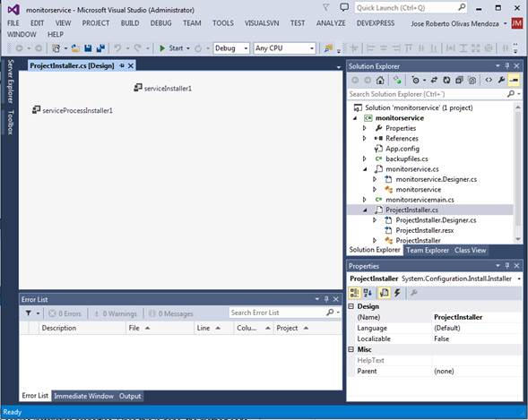
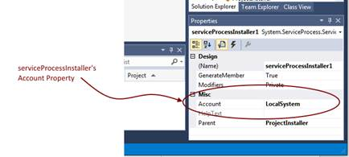

# 第三章服务安装程序

创建一个窗口服务项目有点不同于其他类型的项目。为了正确部署，Visual Studio 附带了可以安装与服务应用程序相关联的资源的安装组件。安装组件在要安装服务的系统上注册单个服务，并让服务控制管理器知道该服务存在。

## 添加服务安装程序

使用服务应用程序允许您自动向项目添加适当的安装程序。您也可以通过双击解决方案资源管理器树中的 **monitorservice.cs** 文件名(存储服务基类的位置)来完成此操作，将出现服务设计器屏幕(如下图所示)。


图 5:服务设计器屏幕

右键单击灰色区域将弹出服务设计器上下文菜单。要自动将正确的安装程序代码添加到项目中，请单击**添加安装程序**。

安装程序代码

两个文件， **ProjectInstaller.cs** 和 **ProjectInstaller。Designer.cs** ，将被添加到项目中。服务安装所需的所有属性都将在此设置。下面的代码示例显示了**项目安装程序的内容。**

代码示例 9

```cs
          using System;
          using System.Collections;
          using System.Collections.Generic;
          using System.ComponentModel;
          using System.Configuration.Install;
          using System.Linq;
          using System.Threading.Tasks;

          namespace monitorservice
          {
              [RunInstaller(true)]
              public partial class ProjectInstaller : System.Configuration.Install.Installer
              {
                  public ProjectInstaller()
                  {
                      InitializeComponent();
                  }
              }
          }

```

`ProjectInstaller`类的`RunInstaller`属性告诉我们，安装程序集时将调用 Visual Studio 的自定义操作安装程序或 InstallUtil.exe。稍后将讨论 InstallUtil.exe。

一个构造函数方法是 IDE 创建的唯一一个方法，这个方法调用`InitializeComponent()`方法是为了设置正确安装服务所需的值。

建立服务安装属性

要建立服务安装属性，右键单击 monitorservice 项目树中的 **ProjectInstaller.cs** 文件名，然后从出现的上下文菜单中选择**视图设计器**。

**项目安装器. cs** 的设计器窗口将出现，其中有两个图标按钮。其中一个链接到`serviceProcessInstaller`对象的实例，另一个链接到`ServiceInstaller`对象的实例。这两个实例包含成功安装 Windows 服务所需的属性。

这些属性是:

*   帐户–指示服务将运行的帐户类型
*   描述–表示服务的描述(解释服务目的的简短注释)
*   显示名称–向用户指示标识服务的友好名称
*   服务名称–指示系统用来标识此服务的名称
*   开始类型–指示此服务的开始方式和时间(如简介中所述)



图 6:带有图标按钮的 ProjectInstaller.cs 设计器屏幕

单击每个按钮可以更改前面列出的属性。为了完成这个任务，需要使用对应于每个按钮的属性窗口，并在相应文本框的属性窗口中输入适当的值。



图 7:服务流程安装程序属性窗口


图 8:服务安装程序属性窗口

一旦这样做了，`InitializeComponent`方法的代码将如下所示。

代码示例 10

```cs
          private void InitializeComponent()
          {
              this.serviceProcessInstaller1 = new System.ServiceProcess.ServiceProcessInstaller();
              this.serviceInstaller1 = new System.ServiceProcess.ServiceInstaller();
              // 
              // serviceProcessInstaller1
              // 
              this.serviceProcessInstaller1.Account = System.ServiceProcess.ServiceAccount.LocalSystem;
              this.serviceProcessInstaller1.Password = null;
              this.serviceProcessInstaller1.Username = null;
              // 
              // serviceInstaller1
              // 
              this.serviceInstaller1.ServiceName = "MonitorService";
              this.serviceInstaller1.DisplayName = "MonitorService";
              this.serviceInstaller1.Description = "Developing Windows Services Succinctly Tutorial";
              this.serviceInstaller1.StartType = System.ServiceProcess.ServiceStartMode.Automatic;
              // 
              // ProjectInstaller
              // 
              this.Installers.AddRange(new System.Configuration.Install.Installer[] {
              this.serviceProcessInstaller1,
              this.serviceInstaller1});

          }

```

代码创建了一个`ServiceProcessInstaller`类的实例和一个`ServiceInstaller`类的实例。然后，它将负责管理服务的帐户名称存储在`ServicesProcessInstaller`实例的帐户属性中。在这种情况下，安装程序将使用`LocalSystem`帐户。

`ServiceInstaller`实例的`StartType`属性将告诉安装程序服务将自动启动。将在 Windows 服务管理单元中显示的名称存储在`DisplayName`属性中，服务的描述存储在`Description`属性中。

现在，project installer 的整个代码将如下所示。

代码示例 11

```cs
          //ProjectInstaller.cs
          using System;
          using System.Collections;
          using System.Collections.Generic;
          using System.ComponentModel;
          using System.Configuration.Install;
          using System.Linq;
          using System.Threading.Tasks;

          namespace monitorservice
          {
              [RunInstaller(true)]
              public partial class ProjectInstaller : System.Configuration.Install.Installer
              {
                  public ProjectInstaller()
                  {
                      InitializeComponent();
                  }
              }
          }

          //ProjectInstaller.Designer.cs
          namespace monitorservice
          {
              partial class ProjectInstaller
              {
                  /// <summary>
                  /// Required designer variable.
                  /// </summary>
                  private System.ComponentModel.IContainer components = null;

                  /// <summary> 
                  /// Clean up any resources being used.
                  /// </summary>
                  /// <param name="disposing">true if managed resources should be disposed; otherwise, false.</param>
                  protected override void Dispose(bool disposing)
                  {
                      if (disposing && (components != null))
                      {
                          components.Dispose();
                      }
                      base.Dispose(disposing);
                  }

                  #region Component Designer generated code

                  /// <summary>
                  /// Required method for Designer support - do not modify
                  /// the contents of this method with the code editor.
                  /// </summary>
                  private void InitializeComponent()
                  {
                      this.serviceProcessInstaller1 = new System.ServiceProcess.ServiceProcessInstaller();
                      this.serviceInstaller1 = new System.ServiceProcess.ServiceInstaller();
                      // 
                      // serviceProcessInstaller1
                      // 
                      this.serviceProcessInstaller1.Account = System.ServiceProcess.ServiceAccount.LocalSystem;
                      this.serviceProcessInstaller1.Password = null;
                      this.serviceProcessInstaller1.Username = null;
                      // 
                      // serviceInstaller1
                      // 
                      this.serviceInstaller1.ServiceName = "MonitorService";
                      this.serviceInstaller1.DisplayName = "MonitorService";
                      this.serviceInstaller1.Description = "Developing Windows Services Succinctly Tutorial";
                      this.serviceInstaller1.StartType = System.ServiceProcess.ServiceStartMode.Automatic;
                      // 
                      // ProjectInstaller
                      // 
                      this.Installers.AddRange(new System.Configuration.Install.Installer[] {
                      this.serviceProcessInstaller1,
                      this.serviceInstaller1});

                  }

                  #endregion

                  private System.ServiceProcess.ServiceProcessInstaller serviceProcessInstaller1;
                  private System.ServiceProcess.ServiceInstaller serviceInstaller1;
              }
          }

```

至此，添加服务安装程序的过程已经完成。

## 章节总结

Windows 服务项目与其他项目有点不同。为了正确部署它，Visual Studio 提供了在目标系统上注册单个服务的安装组件，并让服务控制管理器知道它的存在。

服务基类文件的服务设计器屏幕用于将适当的安装程序添加到项目中。要显示此屏幕，请双击解决方案资源管理器树中的文件名。右键单击灰色区域将弹出一个上下文菜单，在其中可以找到添加安装程序项目。点击它将自动添加正确的安装程序代码。

要在目标计算机中成功部署服务，需要在服务安装代码中为某些属性建立值。这些属性是:`Account`，表示服务运行的账户类型；`Description`，表示解释服务目的的简短评论；`DisplayName`，表示识别服务的友好名称；`ServiceName`，表示系统用来识别的名称；和`StartType`，指示该服务如何以及何时启动。项目安装程序代码文件(**项目安装程序，cs** )的设计器视图用于设置这些值。