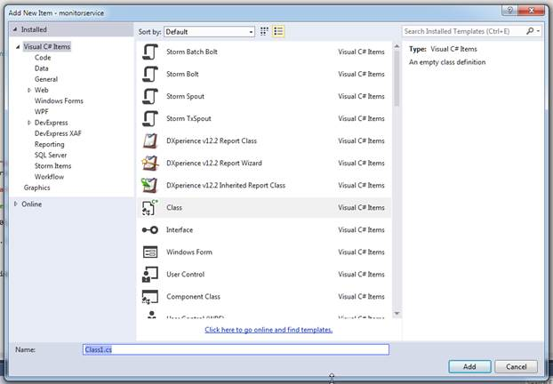
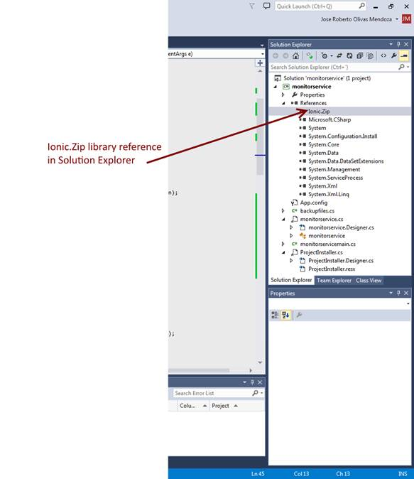

# 四、备份文件服务

到目前为止，已经看到了构建 Windows 服务项目所需的所有代码片段。现在，最重要的是给将要创建的服务一个目标。在这种情况下，将开发备份文件服务。

## 定义需求

如前所述，该服务的目的是备份一组文件。这项服务的要求如下。

*   要备份的文件集将位于目标计算机的特定文件夹中。
*   备份过程需要在工作时间之外完成。
*   文件夹中的所有文件都将被添加到 zip 文件中。
*   zip 文件将被复制到目标计算机的特定文件夹中。

## 任务列表

为了完成前面的需求列表，需要完成以下任务:

*   创建一个配置文件，该文件指定要备份的文件夹、备份文件目标文件夹以及执行备份过程的日期和时间。该文件将采用 XML 格式。
*   创建一个方法来读取存储在配置文件中的参数，并让它们对整个服务应用程序可见。
*   创建一个单独的类来负责备份过程。
*   每次满足参数文件中建立的条件时，执行备份过程。

为了本书的目的，将开发一个具有特定功能的窗口服务。在这种情况下，将使用 C#作为编程语言编写备份文件服务，它将在目标系统中制作特定文件夹的压缩副本。

### 创建 XML 配置文件

如前所述，Windows 服务没有用户交互功能。因此，唯一可用的通信方法是使用配置文件，无论这些配置文件是在文本编辑器中编写的，还是通过使用为此目的构建的桌面应用程序编写的。

备份文件窗口服务的 XML 配置文件如下所示。

代码示例 12

```cs
          <?xml version="1.0" encoding="utf-8"?>
          <Parameters>
          <Backup source="C:\Documents" destination="D:\Backups"dayofweek="0" hour="04:40:00"/>
          </Parameters>

```

XML 的根节点被称为`Parameters`，用于保存服务需要执行的任何类型的操作。服务将执行的每个操作都存储为一个子节点。在这种情况下，`Backup`子节点属性存储备份文件的所有参数。

#### 备份节点属性

``Backup`` 节点的属性如下:

*   来源**–**包含要备份的文件的文件夹
*   目标–将存储压缩备份文件的文件夹
*   dayofweek–一周中的某一天，从 1 开始表示周日，在该天将执行备份过程；0(零)表示每天
*   小时–一天中执行备份过程的时间

### 创建读取参数的方法

一旦创建了 XML 参数文件，服务就需要能够读取它并存储这些参数以便以后使用。具有此目的的方法将被添加到服务定义类中。代码如下所示。

代码示例 13

```cs
          private void check_parameters()
          {
              if (!System.IO.Directory.Exists(this.HomeDir + "\\parameters"))
              {
                  System.IO.Directory.CreateDirectory(this.HomeDir + "\\parameters");
                  this.LogEvent(String.Format("MonitorService: parameters file folder was just been created"), EventLogEntryType.Information);
                  this.IsReady = false;

              }
              else
              {
                  if (System.IO.File.Exists(this.HomeDir + "\\parameters\\srvparams.xml"))
                  {
                      Boolean docparsed = true;
                      XmlDocument parametersdoc = new XmlDocument();

                      try
                      {
                          parametersdoc.Load(this.HomeDir + "\\parameters\\srvparams.xml");
                      }
                      catch (XmlException ex)
                      {
                          docparsed = false;
                          this.IsReady = false;
                          this.LogEvent(String.Format("Parameters file couldn't be read: {0}", ex.Message), EventLogEntryType.Error);
                      }

                      if (docparsed)
                      {
                          XmlNode BackupParameters = parametersdoc.ChildNodes.Item(1).ChildNodes.Item(0);
                          this.source_path = BackupParameters.Attributes.GetNamedItem("source").Value.Trim();
                          this.destination_path = BackupParameters.Attributes.GetNamedItem("destination").Value.Trim();
                          this.dayofweek = Convert.ToInt32(BackupParameters.Attributes.GetNamedItem("dayofweek").Value.Trim());
                          this.time = BackupParameters.Attributes.GetNamedItem("hour").Value.Trim();
                         this.IsReady = true;
                          this.LogEvent(String.Format("Backup Service parameters were loaded"), EventLogEntryType.Information);
                      }

                      parametersdoc = null;
                  }
                  else
                  {
                      this.LogEvent(String.Format("Backup Service parameters file doesn't exist"), EventLogEntryType.Error);
                      this.IsReady = false;
                  }
              }
          }

```

一个`HomeDir`属性被添加到类定义中，以便存储将要安装服务应用程序的文件夹名称。此外，添加了一个`IsReady`属性来告诉服务工作参数是否已经从 XML 文件中加载。

该方法检查名为**参数**的文件夹是否存在于 **HomeDir** 文件夹中。如果没有，则使用`System.IO.Directory.CreateDirectory`方法创建，并在 Windows 事件日志中写入一个条目。`IsReady`属性的值设置为`false`，因此服务不会执行备份过程，因为没有加载工作参数。

否则，该方法在**参数**文件夹中查找 **srvparams.xml** 文件，以加载服务工作参数。如果文件不存在，方法只是在 Windows 事件日志中写一个条目，`IsReady`属性值设置为`false`。如果文件确实存在，`check_parameters()`方法会尝试解析 XML 文件的内容。如果解析失败，则在窗口事件日志中写入一个条目，并且`IsReady`属性也被设置为`false`。否则，工作参数存储在各自的属性中，进入类定义，`IsReady`属性设置为`true`。

服务执行开始时调用`check_parameters()`方法。当`OnStart`事件被触发并且其相关方法被执行时，这将发生。

现在，整个服务类定义代码看起来像下面的示例。

代码示例 14

```cs
          using System;
          using System.Collections.Generic;
          using System.ComponentModel;
          using System.Data;
          using System.Diagnostics;
          using System.Linq;
          using System.ServiceProcess;
          using System.Text;
          using System.Threading.Tasks;
          using System.Xml;

          namespace monitorservice
          {
              public partial class monitorservice : ServiceBase
              {
                  private System.Timers.Timer serviceTimer = null;
                  private string HomeDir = (new System.IO.DirectoryInfo(System.AppDomain.CurrentDomain.BaseDirectory)).FullName.Trim();
                  private string source_path = "";
                  private string destination_path = "";
                  private int dayofweek = 0;
                  private string time = "";

                  public monitorservice()
                  {
                      InitializeComponent();
                  }

                  protected override void OnStart(string[] args)
                  {
                      if (!System.Diagnostics.EventLog.SourceExists("MonitorService"))
                          System.Diagnostics.EventLog.CreateEventSource("MonitorService", "Application");

                      this.LogEvent(String.Format("MonitorService starts on {0} {1}", System.DateTime.Now.ToString("dd-MMM-yyyy"), DateTime.Now.ToString("hh:mm:ss tt")), EventLogEntryType.Information);

                      this.check_parameters(); //Need to load service behavior parameters

                      this.serviceTimer = new System.Timers.Timer(300);
                      this.serviceTimer.AutoReset = true;
                      this.serviceTimer.Elapsed += new System.Timers.ElapsedEventHandler(this.timer_Elapsed);
                      this.serviceTimer.Start();
                  }

                  private void timer_Elapsed(object sender, System.Timers.ElapsedEventArgs e)
                  {

                  }

                  protected override void OnStop()
                  {
                      this.serviceTimer.Stop();
                      this.serviceTimer.Dispose();
                      this.serviceTimer = null;

                      this.LogEvent(String.Format("MonitorService stops on {0} {1}", System.DateTime.Now.ToString("dd-MMM-yyyy"), DateTime.Now.ToString("hh:mm:ss tt")), EventLogEntryType.Information);

                  }

                  private void LogEvent(string message, EventLogEntryType entryType)
                  {
                      System.Diagnostics.EventLog eventLog = new System.Diagnostics.EventLog();

                      eventLog = new System.Diagnostics.EventLog();
                      eventLog.Source = "MonitorService";
                      eventLog.Log = "Application";
                      eventLog.WriteEntry(message, entryType);

                  }

                  private void check_parameters()
                  {
                      if (!System.IO.Directory.Exists(this.HomeDir + "\\parameters"))
                      {
                          System.IO.Directory.CreateDirectory(this.HomeDir + "\\parameters");
                          this.LogEvent(String.Format("MonitorService: parameters file folder was just been created"), EventLogEntryType.Information);
                      }
                      else
                      {
                          if (System.IO.File.Exists(this.HomeDir + "\\parameters\\srvparams.xml"))
                          {
                              Boolean docparsed = true;
                              XmlDocument parametersdoc = new XmlDocument();

                              try
                              {
                                  parametersdoc.Load(this.HomeDir + "\\parameters\\srvparams.xml");
                              }
                              catch (XmlException ex)
                              {
                                  docparsed = false;
                                  this.LogEvent(String.Format("Parameters file couldn't be read: {0}", ex.Message), EventLogEntryType.Error);
                              }

                              if (docparsed)
                              {
                                  XmlNode BackupParameters = parametersdoc.ChildNodes.Item(1).ChildNodes.Item(0);
                                  this.source_path = BackupParameters.Attributes.GetNamedItem("source").Value.Trim();
                                  this.destination_path = BackupParameters.Attributes.GetNamedItem("destination").Value.Trim();
                                  this.dayofweek = Convert.ToInt32(BackupParameters.Attributes.GetNamedItem("dayofweek").Value.Trim());
                                  this.time = BackupParameters.Attributes.GetNamedItem("hour").Value.Trim();

                                  this.LogEvent(String.Format("Backup Service parameters were loaded"), EventLogEntryType.Information);
                              }

                              parametersdoc = null;
                          }
                          else
                          {
                              this.LogEvent(String.Format("Backup Service parameters file doesn't exist"), EventLogEntryType.Error);
                          }
                      }
                  }

              }
          }

```

### 为备份过程创建类

为了便于项目维护，文件备份过程将在一个单独的类定义中编码。为此，需要将类类型项添加到项目中。右键单击解决方案资源管理器树中的项目名称节点，然后单击**添加**子菜单的**类**项。这将弹出添加新项目对话框。



图 9:添加新项目对话框

在适当的文本框中输入类名，点击**添加**将以下代码添加到项目中。

代码示例 15

```cs
          using System;
          using System.Collections.Generic;
          using System.Linq;
          using System.Text;
          using System.Threading.Tasks;

          namespace monitorservice
          {
              class backupfiles
              {
              }
          }

```

整个类将被写在添加到项目中的基线代码上。必须考虑的一点是，前面提到的要求要求备份必须存储在 ZIP 文件中。**离子。Zip** 库将用于此目的，可在此下载[。下载后，需要将库文件复制到项目文件夹中，并添加到项目引用节点中。](http://dotnetzip.codeplex.com/releases/view/68268)



图 10:离子键。已将压缩库添加到引用节点

`backupfiles`类的整个代码显示在下面的代码片段中。

代码示例 16

```cs
          using Ionic.Zip;
          using System;
          using System.Collections.Generic;
          using System.IO;
          using System.Linq;
          using System.Text;
          using System.Threading.Tasks;

          namespace monitorservice
          {
              public class backupfiles
              {
                  public string source_path = "";
                  public string destination_path = "";
                  public string error_message = "";

                  public Boolean DoBackup()
                  {
                      Boolean result = default(Boolean);

                      string destFileName = this.destination_path + "\\backup_" + System.DateTime.Now.ToString("MMM-dd-yyyy") + "-" + System.DateTime.Now.ToString("hh:mm:ss").Replace(":","-")+".zip";

                      using (ZipFile zipFile = new ZipFile())
                       {
                              string[] fileList = new string[1];
                              result = true;

                              this.error_message = "";

                              try
                              {
                                  fileList = Directory.GetFiles(this.source_path + "\\");
                              }
                              catch (Exception exception)
                              {
                                  this.error_message = String.Format("MonitorService: Folder file list can't be read: {0}",exception.Message);
                                  result = false;
                              }
                              finally
                              {
                                  if (result)
                                  {
                                      zipFile.Encryption = EncryptionAlgorithm.WinZipAes256;
                                      zipFile.AddProgress += (this.zipFile_AddProgress);
                                      zipFile.AddDirectory(this.source_path);

                                      zipFile.Save(destFileName);
                                  }

                              }
                       }

                      return (result);
                  }

                  void zipFile_AddProgress(object sender, AddProgressEventArgs e)
                   {
                      switch (e.EventType)
                          {
                          case ZipProgressEventType.Adding_Started:
                              break;
                          case ZipProgressEventType.Adding_AfterAddEntry:
                              break;
                          case ZipProgressEventType.Adding_Completed:
                              break;
                          }

                   }
              }
          }

```

这个类只有两种方法。`DoBackup()`方法执行备份过程，并将源文件夹中的文件存储在压缩的 ZIP 文件中。`zipFile_AddProgress()`方法是`ZipFile`类的`AddProgress`事件的代表。每次压缩工作进度发生变化时，都会触发此事件。

### 执行备份过程

如前所述，服务定义类包含一个`Timer`对象，该对象被编程为每 300 毫秒触发一次`Elapsed`事件。每次触发`Elapsed`事件，都会执行`timer_Elapsed()`方法。因此，备份过程将在此方法中执行。

检查是否满足备份条件

首先，`timer_Elapsed()`方法需要检查从 XML 配置文件中读取的备份工作日和时间是否与执行该方法时的当前工作日和时间匹配。这可以通过下面的代码来完成。

代码示例 17

```cs
          if (this.weekday != 0) //Need to know if current weekday matches parameter's weekday
          {
              if (((int)System.DateTime.Now.DayOfWeek) + 1 != this.weekday)
              {
                  return;
              }
          }

          if (System.TimeSpan.Parse(this.time) >  DateTime.Now.TimeOfDay) //If current daytime is earlier than defined in parameters, the process is stoped
          {
              return;
          }

```

该方法首先检查 weekday 参数是否为零。如果是，则意味着备份过程必须每天执行。否则，该方法需要检查 weekday 参数是否与当前 weekday 匹配。这是通过将工作日参数值与`System.DateTime.Now.DayOfWeek`属性值进行比较来完成的。由于`DayOfWeek`属性是零基索引的，比较前需要加 1，因为在 XML 文件中建立的参数是一基索引的。如果比较得到`true`结果，执行继续。否则，该方法将控制权返回给调用进程。

接下来要做的是检查备份时间参数值是否与当前时间值匹配。代码做的第一件事是解析时间字符串参数值，以便将其转换为`TimeSpan`值。然后，将结果与`DateTime.Now`的`TimeOfDay`属性进行比较，如果值不匹配，该方法将控制权返回给调用进程。否则，方法继续执行。

运行备份过程

如果满足参数条件，则执行备份过程。下面的代码实现了这一点。

代码示例 18

```cs
          this.BackupEngine.source_path = this.source_path;
          this.BackupEngine.destination_path = this.destination_path;
          this.BackupEngine.DoBackup();

```

此时，`BackupEngine`属性被添加到服务类定义中，以便在服务运行时保持`backupfiles`类的实例可用。`source_path`和`destination_path`服务类属性的值被传递到`BackupEngine`实例中的相应属性，并执行`DoBackup()`方法来启动备份过程。

有待解决的问题

在服务运行时每 300 毫秒执行一次`timer_Elapsed()`方法，如果满足参数条件，则该方法执行备份过程。如上所述，`backupfiles`类的一个实例在使用寿命期间是可用的。因此，第一次满足备份条件时，执行`DoBackup()`方法，控制返回到`timer_Elapsed()`方法之外。

如果下次执行`timer_Elapsed()`方法，满足备份条件，会发生什么？`DoBackup()`方法会再次执行，如果启动之前的备份，很可能服务会崩溃。为了避免这种情况，名为`IsBusy`的属性将被添加到`backupfiles`类中，以便在备份过程正在进行时进行标记。现在，`backupfiles`类的代码如下所示。

代码示例 19

```cs
          using Ionic.Zip;
          using System;
          using System.Collections.Generic;
          using System.IO;
          using System.Linq;
          using System.Text;
          using System.Threading.Tasks;

          namespace monitorservice
          {
              public class backupfiles
              {
                  public string source_path = "";
                  public string destination_path = "";
                  public string error_message = "";
                  public Boolean IsBusy = false;

                  public Boolean DoBackup()
                  {
                      Boolean result = default(Boolean);
                      this.IsBusy = false;

                      string destFileName = this.destination_path + "\\backup_" + System.DateTime.Now.ToString("MMM-dd-yyyy") + "-" + System.DateTime.Now.ToString("hh:mm:ss").Replace(":","-")+".zip";

                      using (ZipFile zipFile = new ZipFile())
                       {
                              string[] fileList = new string[1];
                              result = true;

                              this.error_message = "";

                              try
                              {
                                  fileList = Directory.GetFiles(this.source_path + "\\");
                              }
                              catch (Exception exception)
                              {
                                  this.error_message = String.Format("MonitorService: Folder file list can't be read: {0}",exception.Message);
                                  result = false;
                              }
                              finally
                              {
                                  if (result)
                                  {
                                      this.IsBusy = true;

                                      zipFile.Encryption = EncryptionAlgorithm.WinZipAes256;
                                      zipFile.AddProgress += (this.zipFile_AddProgress);
                                      zipFile.AddDirectory(this.source_path);

                                      zipFile.Save(destFileName);

                                      this.IsBusy = false;
                                  }

                              }
                       }

                      return (result);
                  }

                  void zipFile_AddProgress(object sender, AddProgressEventArgs e)
                   {
                      switch (e.EventType)
                          {
                          case ZipProgressEventType.Adding_Started:
                              break;
                          case ZipProgressEventType.Adding_AfterAddEntry:
                              break;
                          case ZipProgressEventType.Adding_Completed:
                              break;
                          }

                   }
              }
          }

```

每次备份进程开始时，`IsBusy`属性被设置为`true`的值，表示在当前进程完成之前不允许执行该方法。备份过程完成后，`IsBusy`设置为`false`。

timer _ Overed()事件的整个代码

现在，事件的代码看起来像下面示例中显示的代码。

代码示例 20

```cs
          private void timer_Elapsed(object sender, System.Timers.ElapsedEventArgs e)
          {
              if (!this.IsReady)
              {
                  return;
              }

              if (this.weekday != 0) //Need to know if current weekday matches parameter's weekday
              {
                  if (((int)System.DateTime.Now.DayOfWeek) + 1 != this.weekday)
                  {
                      return;
                  }
              }

              if (DateTime.Now.TimeOfDay < System.TimeSpan.Parse(this.time)) //If current daytime is earlier than defined in parameters, the process is stoped
              {
                  return;
              }

              if (this.BackupEngine.IsBusy)  //If backup process was previously started we do nothing
              {
                  return;
              }

              this.BackupEngine.source_path = this.source_path;
              this.BackupEngine.destination_path = this.destination_path;
              this.BackupEngine.DoBackup();

          }

```

检查备份条件后，检查`BackupEngine`实例的属性`IsBusy`。如果属性的值为`true`，则该方法停止执行，并将控件返回给调用进程。否则，将执行备份过程。

## 拼图已经拼好了

现在，所有的部分都已经收集在一起，服务类代码看起来像下面的代码片段。

代码示例 21

```cs
          using System;
          using System.Collections.Generic;
          using System.ComponentModel;
          using System.Data;
          using System.Diagnostics;
          using System.Linq;
          using System.ServiceProcess;
          using System.Text;
          using System.Threading.Tasks;
          using System.Xml;

          namespace monitorservice
          {
              public partial class monitorservice : ServiceBase
              {
                  private System.Timers.Timer serviceTimer = null;
                  private string HomeDir = (new System.IO.DirectoryInfo(System.AppDomain.CurrentDomain.BaseDirectory)).FullName.Trim();
                  private string source_path = "";
                  private string destination_path = "";
                  private int weekday = 0;
                  private string time = "";
                  private Boolean IsReady = false;
                  private backupfiles BackupEngine = new backupfiles();

                  public monitorservice()
                  {
                      InitializeComponent();
                  }

                  protected override void OnStart(string[] args)
                  {
                      if (!System.Diagnostics.EventLog.SourceExists("MonitorService"))
                          System.Diagnostics.EventLog.CreateEventSource("MonitorService", "Application");

                      this.LogEvent(String.Format("MonitorService starts on {0} {1}", System.DateTime.Now.ToString("dd-MMM-yyyy"), DateTime.Now.ToString("hh:mm:ss tt")), EventLogEntryType.Information);

                      this.check_parameters(); //Need to load service behavior parameters

                      this.serviceTimer = new System.Timers.Timer(300);
                      this.serviceTimer.AutoReset = true;
                      this.serviceTimer.Elapsed += new System.Timers.ElapsedEventHandler(this.timer_Elapsed);
                      this.serviceTimer.Start();
                  }

                  private void timer_Elapsed(object sender, System.Timers.ElapsedEventArgs e)
                  {
                      if (!this.IsReady)
                      {
                          return;
                      }

                      if (this.weekday != 0) //Need to know if current weekday matches parameter's weekday
                      {
                          if (((int)System.DateTime.Now.DayOfWeek) + 1 != this.weekday)
                          {
                              return;
                          }
                      }

                      if (DateTime.Now.TimeOfDay < System.TimeSpan.Parse(this.time)) //If current daytime is earlier than defined in parameters, the process is stoped
                      {
                          return;
                      }

                      if (this.BackupEngine.IsBusy)  //If backup process was previously started we do nothing
                      {
                          return;
                      }

                      this.BackupEngine.source_path = this.source_path;
                      this.BackupEngine.destination_path = this.destination_path;
                      this.BackupEngine.DoBackup();

                  }

                  protected override void OnStop()
                  {
                      this.serviceTimer.Stop();
                      this.serviceTimer.Dispose();
                      this.serviceTimer = null;

                      this.LogEvent(String.Format("MonitorService stops on {0} {1}", System.DateTime.Now.ToString("dd-MMM-yyyy"), DateTime.Now.ToString("hh:mm:ss tt")), EventLogEntryType.Information);

                  }

                  private void LogEvent(string message, EventLogEntryType entryType)
                  {
                      System.Diagnostics.EventLog eventLog = new System.Diagnostics.EventLog();

                      eventLog = new System.Diagnostics.EventLog();
                      eventLog.Source = "MonitorService";
                      eventLog.Log = "Application";
                      eventLog.WriteEntry(message, entryType);

                  }

                  private void check_parameters()
                  {
                      if (!System.IO.Directory.Exists(this.HomeDir + "\\parameters"))
                      {
                          System.IO.Directory.CreateDirectory(this.HomeDir + "\\parameters");
                          this.LogEvent(String.Format("MonitorService: parameters file folder was just been created"), EventLogEntryType.Information);
                          this.IsReady = false;
                      }
                      else
                      {
                          if (System.IO.File.Exists(this.HomeDir + "\\parameters\\srvparams.xml"))
                          {
                              Boolean docparsed = true;
                              XmlDocument parametersdoc = new XmlDocument();

                              try
                              {
                                  parametersdoc.Load(this.HomeDir + "\\parameters\\srvparams.xml");
                              }
                              catch (XmlException ex)
                              {
                                  docparsed = false;
                                  this.IsReady = false;
                                  this.LogEvent(String.Format("Parameters file couldn't be read: {0}", ex.Message), EventLogEntryType.Error);
                              }

                              if (docparsed)
                              {
                                  XmlNode BackupParameters = parametersdoc.ChildNodes.Item(1).ChildNodes.Item(0);
                                  this.source_path = BackupParameters.Attributes.GetNamedItem("source").Value.Trim();
                                  this.destination_path = BackupParameters.Attributes.GetNamedItem("destination").Value.Trim();
                                  this.weekday = Convert.ToInt32(BackupParameters.Attributes.GetNamedItem("dayofweek").Value.Trim());
                                  this.time = BackupParameters.Attributes.GetNamedItem("hour").Value.Trim();

                                  this.IsReady = true;

                                  this.LogEvent(String.Format("Backup Service parameters were loaded"), EventLogEntryType.Information);
                              }

                              parametersdoc = null;
                          }
                          else
                          {
                              this.LogEvent(String.Format("Backup Service parameters file doesn't exist"), EventLogEntryType.Error);
                          }
                      }
                  }

              }
          }

```

现在是时候构建解决方案并获取应用程序可执行文件了。

## 章节总结

要构建备份文件服务，必须做的第一件事是创建一个 XML 文件来存储控制服务行为所需的所有参数。XML 文件的根节点将被称为`Parameters`，用于保存服务将执行的所有操作。每个动作都会存储为一个子节点，对于备份服务，会存储一个具有以下属性的 backup 子节点:`Source`，表示要备份的文件所在的文件夹；`Destination`，表示将存储 zip 备份文件的文件夹；`Dayofweek`，表示一周中的某一天，从 1 开始表示周日，在这一天将执行备份过程(零表示每天)；`Hour`，表示一天中执行备份过程的时间。

使用`XmlDocument`创建了一个名为`check_parameters()`的方法来读取 XML 文件。NET 类。此方法在服务执行开始时调用，并将所有参数存储在服务类定义中定义的一组相应属性中。

创建名为`backupfiles`的类来处理备份过程。这个类使用**ionczip**库来压缩备份。这个库必须作为参考添加到 Visual Studio 项目中，可以在[这里](http://dotnetzip.codeplex.com/releases/view/68268)下载。服务类定义在名为`BackupEngine`的属性中保存该类的实例。

每次执行服务类定义的`timer_Elapsed()`方法，都会检查是否满足备份条件。如果是，该方法通过使用属于`backupfiles`类的名为`IsBusy`的属性，并将其值与`true`进行比较，来查询先前的备份过程是否正在执行。如果是，方法执行停止。否则，备份过程开始。完成后，`IsBusy`的值被设置为`false`，以便允许执行新的备份过程。

最后，在构建解决方案时会获得一个可执行文件。