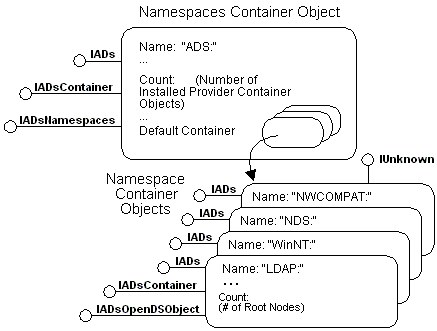

# 第一章简介

## 活动目录服务界面(ADSI)

活动目录服务接口(ADSI)是一组组件对象模型(COM)接口，用于从不同的网络提供商和客户端应用程序中访问目录服务的功能。ADSI 提供了一种自动化任务的方法，使开发人员和网络管理员能够轻松管理网络资源。从网络管理员的角度来看，这些任务可以包括用户管理和打印设备配置，而从开发人员的角度来看，ADSI 提供了一种开发支持目录的应用程序的方法。管理员和开发人员处理一组目录服务接口，而不管安装了哪些目录服务。

ADSI 是许多问题的解决方案的常见场景是在分布式计算环境中工作；在这种类型的环境中，我们有多个目录服务，我们必须找到一种方法来访问和管理其中的所有资源。为了解决这些问题，ADSI 提供了一组一致的接口，可用于无缝管理环境中包含的任何目录。

ADSI 为系统管理员提供了许多好处，从简单的学习和实施到灵活的使用。下面列出了 ADSI 可能提供的一些好处:

*   开放:任何目录提供商都可以实现 ADSI。
*   独立于目录服务:它可以不受目录服务提供商的限制而使用。
*   多语言支持:可以从多种语言(VB，C#，C++)访问接口。
*   简单的编程模型。
*   可脚本化:可以被任何支持自动化的语言使用，比如 VBScript。
*   功能丰富:ISV 有机会部署严肃且功能丰富的应用程序。

### ADSI 事件追踪

ADSI 的事件跟踪是 ADSI LDAP 提供商的某些领域中增加的一项功能，因为其复杂的幕后实现。这种跟踪使开发人员在开发支持目录的应用程序时更容易解决问题。其中一些领域包括:

*   模式解析和下载。
*   更改和设置密码。

### 活动目录服务接口架构

图 1 显示了 ADSI 架构的组件式图表。如我们所见，在顶层我们有一个系统对象，它包含当前安装的所有 ADSI 提供商的列表。列表中的每个条目又是特定于特定 ADSI 提供程序的命名空间对象。在每个名称空间容器对象的顶层根节点，我们已经定义了目录服务使用的任何目录系统对象。ADSI 提供了一组预定义的对象和接口，以便客户端应用程序可以使用一组统一的方法与目录服务进行交互。但是，ADSI 可能不提供目录服务的所有功能。在每个提供程序命名空间对象中找到的根节点容器对象包括一个 ADSI 模式容器对象。此对象包含该提供程序所有功能的定义。

图 1:显示名称空间容器对象的图表

### 活动目录服务接口支持的提供商

| 互联网服务商 | 描述 |
| 轻量级目录访问协议 | 与轻量级目录访问协议兼容的命名空间实现。 |
| WinNT | 与 Windows 兼容的命名空间实现。 |
| 核数据处(Nuclear Data Section) | 与 Novell NetWare 目录服务兼容的命名空间实现。 |
| NWCOMPAT | 与 Novell NetWare 3.x 兼容的命名空间实现。 |

表 1:支持的 ADSI

不是每个服务提供者都支持 ADSI 接口公开的方法和属性方法。因为不同的目录服务在存储的对象和属性类型上有所不同，并且使用不同的协议和身份验证，所以 ADSI 被设计为与受支持的服务提供商无缝协作。因此，有些接口、方法和属性方法适用于一个服务提供者，比如 LDAP，而不适用于另一个服务提供者，比如 WinNT。