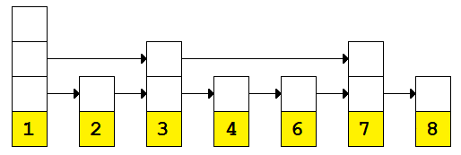
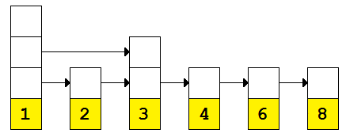
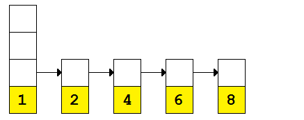

# 一、跳表

## 概述

在前一本书中，我们研究了两种常见的类似列表的数据结构:链表和数组列表。每个数据结构都有一系列的权衡。现在我想添加第三个:跳表。

跳表是以允许插入、移除和搜索的方式存储在链表结构中的项目的有序(排序)列表。因此，它看起来像一个有序的列表，但具有[平衡树](4.html#heading_id_32)的操作复杂性。

为什么这很有说服力？排序数组不是也给了你 *O* (log *n* 搜索吗？当然，但是排序的数组不会给你插入或移除 *O* (日志 *n* )。好吧，为什么不用树呢？你可以的。但是正如我们将看到的，跳表的实现比不平衡树要简单得多，也比平衡树要简单得多。此外，在这一章的最后，我将研究跳表的另一个好处，它不会太难添加-[数组式索引](#heading_id_50)。

那么，如果一个跳表像平衡树一样好，同时更容易实现，为什么没有更多的人使用它们呢？我怀疑这是缺乏意识。跳表是一种相对较新的数据结构——威廉·普格(William Pugh)在 1990 年首次记录了它们——因此，它们不是大多数算法和数据结构课程的核心部分。

### 它是如何工作的

我们先来看看内存中的有序链表。


图 1:内存中表示的排序链表

我想我们都同意搜索值 8 需要从第一个节点开始到最后一个节点的 *O* ( *n* )搜索。

那我们怎么能把它减半呢？如果我们能跳过所有其他节点呢？显然，我们无法摆脱基本的`Next`指针——枚举每一项的能力至关重要。但是如果我们有另一组跳过所有其他节点的指针呢？现在我们的列表可能是这样的:


图 2:指针跳过每隔一个节点的排序链表

通过使用更宽的链接，我们的搜索将能够执行一半的比较。下图中显示的橙色路径演示了搜索路径。橙色的点代表进行比较的点——这是我们在确定搜索算法的复杂性时测量的比较。


图 3:新指针的搜索路径

*O* ( *n* )现在大致是 *O* ( *n* /2)。这是一个不错的改进，但是如果我们再增加一层会发生什么呢？


图 4:添加额外的链接层

我们现在进行了四次比较。如果列表有九个项目长，我们可以通过仅使用 *O* ( *n* /3)比较来找到值 9。

每增加一层链接，我们就可以跳过越来越多的节点。这一层跳过了三层。下一个会跳过七个。之后的一个一次跳过 15 个。

回到图 4，让我们看看使用的具体算法。

我们从第一个节点的最高链接开始。由于该节点的值(1)与我们寻找的值(8)不匹配，我们检查了链接指向的值(5)。由于 5 小于我们想要的值，我们转到该节点并重复该过程。

5 节点在第三层没有额外的链接，所以我们下到第二层。第二级有一个链接，所以我们比较了它所指向的(7)和我们所追求的价值(8)。由于值 7 小于 8，我们遵循该链接并重复。

7 节点在第二层没有额外的链接，因此我们下到第一层，将链接指向的值(8)与我们寻求的值(8)进行比较。我们找到了匹配的。

虽然机制是新的，这种搜索方法应该是熟悉的。这是一个分治算法。每次我们跟踪一个链接，我们实际上都是在把搜索空间减半。

### 但是有一个问题

我们在前面的例子中采用的方法有一个问题。该示例使用确定性方法来设置链接级别高度。在静态列表中，这可能是可以接受的，但是随着节点的添加和移除，我们可以快速创建病态的坏列表，这些坏列表会变成性能退化的链表。

让我们采用三级跳表，并从列表中移除值为 5 的节点。



图 5:删除了 5 个节点的跳表

随着 5 的消失，我们遍历三级链接的能力也消失了，但是我们仍然能够在四次比较中找到值 8(基本上是 *O* ( *n* /2))。现在让我们去掉 7。



图 6:删除了 5 个和 7 个节点的跳表

我们现在只能使用单个二级链接，我们的算法正在快速接近 *O* ( *n* )。一旦我们移除值为 3 的节点，我们就会在那里。



图 7:删除了 3、5 和 7 个节点的跳表

我们找到了。经过一系列三次精心策划的删除，搜索算法从 *O* ( *n* /3)变成了 *O* ( *n* )。

明确地说，问题不在于这种情况会发生，而在于这种情况可能是攻击者故意造成的。如果调用者了解用于创建跳表结构的模式，那么他或她可以精心设计一系列操作来创建像刚才描述的场景。

缓解这种情况最简单的方法，但不是完全预防，是使用随机身高法。基本上，我们想创建一个策略，说 100%的节点有第一级链接(这是强制性的，因为我们需要能够按顺序枚举每个节点)，50%的节点有第二级，25%有第三级，等等。因为随机的方法是，嗯，随机的，确切地说 50%或 25%有第二个或第三个水平是不正确的，但是随着时间的推移，随着列表的增长，这将成为事实。

使用随机方法，我们的列表可能如下所示:


图 8:具有随机高度的跳表

缺少可操作的模式意味着我们的算法成为 *O* (log *n* )的概率随着列表中项目数量的增加而增加。

### 代码样本

本书找到的代码示例可以在[https://bit bucket . org/sync fusion/data _ structures _ 简洁 _part2](https://bitbucket.org/syncfusion/data_structures_succinctly_part2) 下载。

## 滑雪板节点类

就像我们在第一本书中看到的链表一样，跳表有一个节点类来包含值以及项目的链接集合。`Next`集合是指向后续节点的链接数组(如果没有链接，则为空)。

```cs
    internalclass SkipListNode<T>
    {
        /// <summary>
        /// Creates a new node with the specified value
        /// at the indicated link height.
        /// </summary>
        public SkipListNode(T value, int height)
        {
            Value = value;
            Next = new SkipListNode<T>[height];
        }

        /// <summary>
        /// The array of links. The number of items
        /// is the height of the links.
        /// </summary>
        public SkipListNode<T>[] Next
        {
            get;
            private set;
        }

        /// <summary>
        /// The contained value.
        /// </summary>
        public T Value {
            get;
            private set;
        }
    }

```

## SkipList 类

`SkipList<T>`类是实现`ICollection<T>`接口的泛型类，要求泛型类型参数`T`是实现`IComparable<T>`接口的类型。由于跳表是有序集合，因此要求包含的类型实现`IComparable<T>`接口。

除了`ICollection<T>`方法和属性外，还有一些私有字段。`_rand`字段提供对随机数生成器的访问，随机数生成器将用于随机确定节点链路高度。`_head`字段是一个不包含任何数据的节点，但是具有最大链接高度——这很重要，因为它将作为所有遍历的起点。`_levels`字段是任何节点(不包括`_head`节点)当前使用的最大链接高度。`_count`是列表中包含的项目数。

实现`ICollection<T>`界面需要其余的方法和属性:

```cs
    public class SkipList<T> : ICollection<T>
        where T: IComparable<T>
    {
        // Used to determine the random height of the node links.
        private readonly Random _rand = new Random();

        // The non-data node which starts the list.
        private SkipListNode<T> _head;

        // There is always one level of depth (the base list).
        private int _levels = 1;

        // The number of items currently in the list.
        private int _count = 0;

        public SkipList() {}

        public void Add(T value) {}

        public bool Contains(T value) { throw new NotImplementedException(); }

        public bool Remove(T value) { throw new NotImplementedException(); }

        public void Clear() {}

        public void CopyTo(T[] array, int arrayIndex) {}

        public int Count { get { throw new NotImplementedException(); } }

        public bool IsReadOnly { get { throw new NotImplementedException(); } }

        public IEnumerator<T> GetEnumerator() { throw new NotImplementedException(); }

        System.Collections.IEnumerator System.Collections.IEnumerable.GetEnumerator() { throw new NotImplementedException(); }
    }

```

## 添加

| 行为 | 将特定值添加到跳表。 |
| 表演 | *O* (日志 *n* ) |

跳表的添加算法相当简单:

1.  为节点选择一个随机高度(`PickRandomLevel`方法)。
2.  分配具有随机高度和特定值的节点。
3.  找到适当的位置将节点插入排序列表。
4.  插入节点。

### 选择级别

如前所述，随机高度需要对数缩放。100%的值必须至少为 1-1 的高度是常规链表所需的最小值。50%的高度应该是 2。25%应该是 3 级，以此类推。

任何满足这个比例的算法都是合适的。这里演示的算法使用随机的 32 位值和生成的位模式来确定高度。第一个 LSB 位的索引是 1，而不是 0，这是将要使用的高度。

让我们通过将集合从 32 位减少到 4 位来看这个过程，并查看 16 个可能的值以及该值的高度。

| 位模式 | 高度 | 位模式 | 高度 |
| 0000 | five | One thousand | four |
| 0001 | one | One thousand and one | one |
| 0010 | Two | One thousand and ten | Two |
| 0011 | one | One thousand and eleven | one |
| 0100 | three | One thousand one hundred | three |
| 0101 | one | One thousand one hundred and one | one |
| 0110 | Two | One thousand one hundred and ten | Two |
| 0111 | one | One thousand one hundred and eleven | one |

有了这 16 个值，您可以看到发行版如我们所期望的那样工作。100%的高度至少是 1。50%至少是身高 2。

更进一步，下图显示了调用`PickRandomLevel`一百万次的结果。你可以看到所有的 100 万都至少有 1 米高，从那里开始的缩放比例完全符合我们的预期。


图 9:最小高度值被选取一百万次

### 拾取插入点

使用为 [`Contains`](#heading_id_8) 方法描述的相同算法找到插入点。主要区别在于，在`Contains`将返回真或假的点上，以下是正确的:

1.  当前节点小于或等于正在插入的值。
2.  下一个节点大于或等于要插入的值。

这是插入新节点的有效点。

```cs
    public void Add(T item)
    {
        int level = PickRandomLevel();

        SkipListNode<T> newNode = new SkipListNode<T>(item, level + 1);
        SkipListNode<T> current = _head;

        for (int i = _levels - 1; i >= 0; i--)
        {
            while (current.Next[i] != null)
            {
                if (current.Next[i].Value.CompareTo(item) > 0)
                {
                    break;
                }

                current = current.Next[i];
            }

            if (i <= level)
            {
                // Adding "c" to the list: a -> b -> d -> e.
                // Current is node b and current.Next[i] is d.

                // 1\. Link the new node (c) to the existing node (d):
                // c.Next = d
                newNode.Next[i] = current.Next[i];

                // Insert c into the list after b:
                // b.Next = c
                current.Next[i] = newNode;
            }
        }

        _count++;
    }

    private int PickRandomLevel()
    {
        int rand = _rand.Next();
        int level = 0;

        // We're using the bit mask of a random integer to determine if the max
        // level should increase by one or not.
        // Say the 8 LSBs of the int are 00101100\. In that case, when the
        // LSB is compared against 1, it tests to 0 and the while loop is never
        // entered so the level stays the same. That should happen 1/2 of the time.
        // Later, if the _levels field is set to 3 and the rand value is 01101111,
        // the while loop will run 4 times and on the last iteration will
        // run another 4 times, creating a node with a skip list height of 4\. This should
        // only happen 1/16 of the time.
        while ((rand & 1) == 1)
        {
            if (level == _levels)
            {
                _levels++;
                break;
            }

            rand >>= 1;
            level++;
        }

        return level;
    }

```

## 移除

| 行为 | 从跳表中移除具有指示值的第一个节点。 |
| 表演 | *O* (日志 *n* ) |

`Remove`操作确定正在搜索的节点是否存在于列表中，如果存在，则使用正常的链表项移除算法将其从列表中移除。

使用的搜索算法与 [`Contains`](#_Contains) 方法描述的方法相同。

```cs
    public bool Remove(T item)
    {
        SkipListNode<T> cur = _head;

        bool removed = false;

        // Walk down each level in the list (make big jumps).
        for (int level = _levels - 1; level >= 0; level--)
        {
            // While we're not at the end of the list:
            while (cur.Next[level] != null)
            {
                // If we found our node,
                if (cur.Next[level].Value.CompareTo(item) == 0)
                {
                    // remove the node,
                    cur.Next[level] = cur.Next[level].Next[level];
                    removed = true;

                    // and go down to the next level (where
                    // we will find our node again if we're
                    // not at the bottom level).
                    break;
                }

                // If we went too far, go down a level.
                if (cur.Next[level].Value.CompareTo(item) > 0)
                {
                    break;
                }

                cur = cur.Next[level];
            }
        }

        if (removed)
        {
            _count--;
        }

        return removed;
    }

```

## 包含

| 行为 | 如果跳表中存在要查找的值，则返回`true`。 |
| 表演 | *O* (日志 *n* ) |

`Contains`操作从第一个节点上最高的链接开始，并检查链接末端的值。如果该值小于或等于所寻求的值，则可以跟随该链接；但是如果链接值大于所寻求的值，我们需要下降一个高度级别，然后尝试那里的下一个链接。最终，我们要么找到我们寻求的值，要么发现该节点不存在于列表中。

下图演示了如何在跳表中搜索数字 5。


图 10:在跳表中搜索值 5

第一次比较在最顶端的链接上进行。链接值 6 大于正在搜索的值(5)，因此搜索将在下一个较低的高度重复，而不是跟随链接。

下一个较低的链接连接到值为 4 的节点。这小于所寻求的值，因此遵循链接。

高度为 2 的 4 节点链接到值为 6 的节点。因为这个值大于我们要找的值，所以链接不能被跟踪，搜索循环在下一个较低的级别重复。

此时，链接指向包含值 5 的节点，这就是我们要寻找的值。

```cs
    public bool Contains(T item)
    {
        SkipListNode<T> cur = _head;
        for (int i = _levels - 1; i >= 0; i--)
        {
            while (cur.Next[i] != null)
            {
                int cmp = cur.Next[i].Value.CompareTo(item);

                if (cmp > 0)
                {
                    // The value is too large, so go down one level
                    // and take smaller steps.
                    break;
                }

                if (cmp == 0)
                {
                    // Found it!
                    return true;
                }

                cur = cur.Next[i];
            }
        }

        return false;
    }

```

## 晴

| 行为 | 删除列表中的所有条目。 |
| 表演 | *O* (1) |

`Clear`重新初始化列表头，并将当前计数设置为 0。

```cs
    public void Clear()
    {
        _head = new SkipListNode<T>(default(T), 32 + 1);
        _count = 0;
    }

```

## 抄

| 行为 | 从指定的数组索引开始，将跳表的内容复制到提供的数组中。 |
| 表演 | *O* ( *n* ) |

`CopyTo`方法使用类枚举器枚举列表中的项目，并将每个项目复制到目标数组中。

```cs
    public void CopyTo(T[] array, int arrayIndex)
    {
        if (array == null)
        {
            throw new ArgumentNullException("array");
        }

        int offset = 0;
        foreach (T item in this)
        {
            array[arrayIndex + offset++] = item;
        }
    }

```

## 只读

| 行为 | 返回一个值，该值指示跳表是否为只读。 |
| 表演 | *O* (1) |

在这个实现中，跳表是硬编码的，不是只读的。

```cs
    public bool IsReadOnly
    {
        get { return false; }
    }

```

## 计数

| 行为 | 返回跳表中当前的项目数(如果为空则为零)。 |
| 表演 | *O* (1) |

```cs
    public int Count
    {
        get { return _count; }
    }

```

## 获取分子

| 行为 | 返回一个`IEnumerator<T>`实例，该实例可用于按排序顺序枚举跳表中的项目。 |
| 表演 | *O* (1)返回枚举器； *O* ( *n* )执行枚举(来电者费用)。 |

枚举方法只是遍历高度为 1(数组索引 0)的列表。这是一个列表，其链接总是指向列表中的下一个节点。

```cs
    public IEnumerator<T> GetEnumerator()
    {
        SkipListNode<T> cur = _head.Next[0];
        while (cur != null)
        {
            yield return cur.Value;
            cur = cur.Next[0];
        }
    }

    System.Collections.IEnumerator System.Collections.IEnumerable.GetEnumerator()
    {
        return GetEnumerator();
    }

```

## 常见变异

### 数组式索引

对跳表的一个常见更改是提供基于索引的项目访问；例如，调用者可以使用数组索引语法来访问第 *n* 项。

这可以很容易地在 *O* ( *n* )时间内通过简单地行走第一级链接来实现，但是优化的方法是跟踪每个链接的长度，并使用该信息行走到适当的链接。示例列表可能如下所示:


图 11:带有链接长度的跳表

有了这些长度，我们可以在 *O* (log *n* )时间内实现类似数组的索引——它使用与`Contains`方法相同的算法，但是我们只需检查链接长度，而不是检查链接末端的值。

进行这种更改并不是非常困难，但是比简单地添加长度属性要复杂一点。每次操作后，需要更新`Add`和`Remove`方法，以在所有高度设置所有受影响链接的长度。

### 设定行为

另一个常见的变化是通过不允许列表中的重复值来实现类似`Set`(或`Set`)的行为。因为这是跳表的一种相对常见的用法，所以在使用它之前，了解您的列表如何处理重复项是很重要的。